<properties
    pageTitle="Protection des serveurs DPM/Azure sauvegarder une batterie de serveurs SharePoint vers Azure | Microsoft Azure"
    description="Cet article fournit une vue d’ensemble de la protection des serveurs DPM/Azure sauvegarder une batterie de serveurs SharePoint vers Azure"
    services="backup"
    documentationCenter=""
    authors="adigan"
    manager="Nkolli1"
    editor=""/>

<tags
    ms.service="backup"
    ms.workload="storage-backup-recovery"
    ms.tgt_pltfrm="na"
    ms.devlang="na"
    ms.topic="article"
    ms.date="09/29/2016"
    ms.author="adigan;giridham;jimpark;trinadhk;markgal"/>

# Sauvegarder une batterie de serveurs SharePoint vers Azure
Vous sauvegardez une batterie de serveurs SharePoint à Microsoft Azure à l’aide de System Center Data Protection Manager (DPM) de la même façon que vous effectuez une sauvegarde d’autres sources de données. Sauvegarde Azure offre une flexibilité dans la planification de sauvegarde à créer tous les jours, hebdomadaire, mensuel ou annuel sauvegarde pointe et vous propose des options de stratégie de rétention pour les différents points de sauvegarde. DPM offre la possibilité pour stocker des copies de disque local pour les objectifs de temps de récupération rapides (RTO) et stocker des copies sur Azure pour la rétention économique, à long terme.

## SharePoint versions prises en charge et liés scénarios de protection
Sauvegarde Azure pour DPM prend en charge les scénarios suivants :

| Charge de travail | Version | Déploiement de SharePoint | Type de déploiement DPM | DPM - System Center 2012 R2 | Protection et restauration |
| -------- | ------- | --------------------- | ------------------- | --------------------------- | ----------------------- |
| SharePoint | SharePoint 2013, SharePoint 2010, SharePoint 2007, SharePoint 3.0 | SharePoint déployé sous forme de serveur physique ou machine virtuelle Hyper-V/VMware   --------------   AlwaysOn SQL | Physique machine virtuelle Hyper-V server ou en local | Sauvegarde prend en charge pour Azure à partir de la mise à jour cumulative 5 | Protéger les options de récupération de batterie de serveurs SharePoint : ferme de récupération de base de données et fichier ou la liste élément à partir de points de récupération de disque.  Restauration de batterie de serveurs et base de données à partir de points de récupération Azure. |

## Avant de commencer
Il existe plusieurs choses que vous devez confirmer avant de vous sauvegardez une batterie de serveurs SharePoint vers Azure.

### Conditions préalables
Avant de poursuivre, vérifiez que vous remplissez toutes les [conditions préalables pour l’utilisation de Microsoft Azure sauvegardes](backup-azure-dpm-introduction.md#prerequisites) pour protéger les charges de travail. Les tâches pour les composants requis sont notamment : créer un archivage sécurisé sauvegarde, télécharger les informations d’identification de l’archivage sécurisé, installer Agent de sauvegarde Azure et enregistrer le serveur de sauvegarde DPM/Azure avec l’archivage sécurisé.

### Agent de DPM
L’agent DPM doit être installé sur le serveur qui exécute SharePoint, les serveurs qui exécutent SQL Server et tous les autres serveurs qui font partie de la batterie de serveurs SharePoint. Pour plus d’informations sur la configuration de l’agent de protection, voir [Le programme d’installation Protection Agent](https://technet.microsoft.com/library/hh758034(v=sc.12).aspx).  La seule exception est que vous installez l’agent uniquement sur un serveur frontal (WFE) web unique. DPM doit l’agent sur un serveur WFE uniquement pour servir de point d’entrée pour la protection.

### Batterie de serveurs SharePoint
Pour chaque 10 millions d’éléments dans la batterie de serveurs, il doit être au moins de 2 Go d’espace sur le volume où se trouve le dossier DPM. Cet espace est requis pour la génération de catalogue. Pour DPM récupérer des éléments spécifiques (des collections de sites, sites, listes, bibliothèques de documents, dossiers, des documents individuels et les éléments de liste), génération de catalogue crée une liste d’URL incluses dans chaque base de données de contenu. Vous pouvez afficher la liste d’URL dans le volet élément récupérable dans la zone de tâches **récupération** de la Console Administrateur DPM.

### SQL Server
DPM s’exécute comme compte système local. Pour sauvegarder des bases de données SQL Server, DPM doit privilèges sysadmin sur ce compte pour le serveur qui exécute SQL Server. Définissez NT\SYSTÈME à *l’administrateur système* sur le serveur qui exécute SQL Server avant de vous sauvegardez.

Si la batterie de serveurs SharePoint dispose des bases de données SQL Server qui sont configurés avec des alias de SQL Server, installez les composants clients SQL Server sur le serveur Web frontal DPM protéger.

### SharePoint Server
Tandis que les performances dépendent de nombreux facteurs tels que la taille de la batterie de serveurs SharePoint, comme les instructions générales fournies pour un serveur DPM pouvez protéger une batterie de serveurs SharePoint 25 To.

### DPM mise à jour cumulative 5
Pour commencer la protection d’une batterie de serveurs SharePoint vers Azure, vous devez installer DPM mise à jour cumulative 5 ou version ultérieure. Mise à jour cumulative 5 permet de protéger une batterie de serveurs SharePoint vers Azure si la batterie de serveurs est configuré à l’aide de AlwaysOn SQL.
Pour plus d’informations, consultez le blog de billet présente [DPM correctif cumulatif 5]( http://blogs.technet.com/b/dpm/archive/2015/02/11/update-rollup-5-for-system-center-2012-r2-data-protection-manager-is-now-available.aspx)

### Ce qui n’est pas pris en charge
- DPM qui protège une batterie de serveurs SharePoint ne protège pas les index de recherche ou bases de données de service application. Vous devrez configurer la protection de ces bases de données séparément.
- DPM ne fournit pas de sauvegarde de bases de données SharePoint SQL Server qui sont hébergés sur horizontale partages de serveur (SOFS).

## Configurer la protection de SharePoint
Avant de pouvoir utiliser DPM pour protéger SharePoint, vous devez configurer le service SharePoint enregistreurVSS (service Enregistreur WSS) à l’aide de **ConfigureSharePoint.exe**.

Vous pouvez trouver **ConfigureSharePoint.exe** dans le dossier \bin [chemin d’Installation DPM] sur le serveur web frontaux. Cet outil fournit l’agent de protection avec les informations d’identification pour la batterie de serveurs SharePoint. Exécutez-le sur un serveur WFE unique. Si vous avez plusieurs serveurs WFE, sélectionnez un seul lorsque vous configurez un groupe de protection.

### Pour configurer le service SharePoint enregistreurVSS
1. Sur le serveur WFE, à l’invite de commandes, accédez à [emplacement d’installation DPM] \bin\
2. Entrez ConfigureSharePoint - EnableSharePointProtection.
3. Entrez les informations d’identification administrateur de batterie de serveurs. Ce compte doit être membre du groupe Administrateurs local sur le serveur WFE. Si l’administrateur de batterie de serveurs n’est pas une variable locale administrateur accorder les autorisations suivantes sur le serveur WFE :
  - Octroyer le contrôle total du groupe WSS_Admin_WPG vers le dossier DPM (% programme Files%\Microsoft Data Protection Manager\DPM).
  - Accorder l’accès en lecture à la clé de Registre DPM (HKEY_LOCAL_MACHINE\SOFTWARE\Microsoft\Microsoft Data Protection Manager) WSS_Admin_WPG.

>[AZURE.NOTE] Vous devez réexécuter ConfigureSharePoint.exe chaque fois qu’il y a une modification dans les identifiants de l’administrateur de batterie de serveurs SharePoint.

## Sauvegarder une batterie de serveurs SharePoint à l’aide de DPM
Une fois que vous avez configuré DPM et la batterie de serveurs SharePoint comme expliqué précédemment, SharePoint peut être protégée par DPM.

### Pour protéger une batterie de serveurs SharePoint
1. Sous l’onglet **Protection** de la Console Administrateur DPM, cliquez sur **Nouveau**.
    

2. Dans la page **Sélectionner un Type de groupe de Protection** de l’Assistant **Créer un nouveau groupe de Protection** , sélectionnez **Servers**, puis cliquez sur **suivant**.

    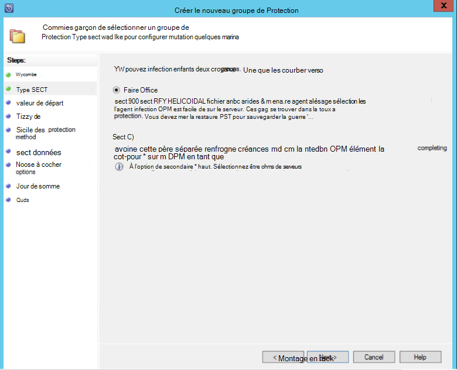

3. Dans l’écran **Sélectionner les membres de groupe** , activez la case à cocher pour le serveur SharePoint que vous voulez protéger, cliquez sur **suivant**.

    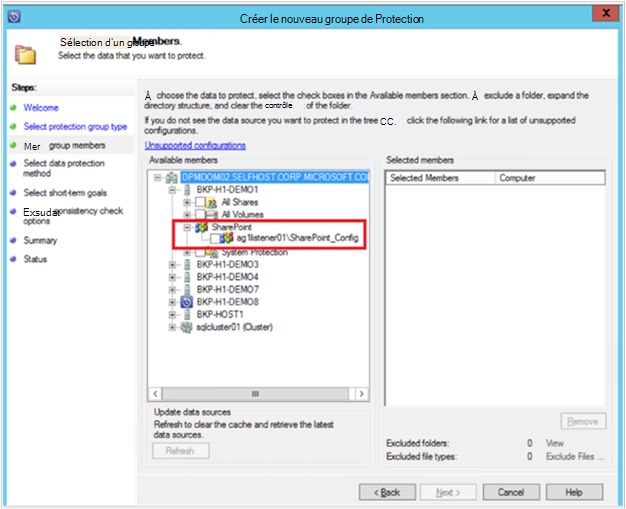

    >[AZURE.NOTE] Avec l’agent DPM installé, vous pouvez visualiser le serveur dans l’Assistant. DPM affiche également sa structure. Étant donné que vous avez exécuté ConfigureSharePoint.exe, DPM communique avec le service SharePoint enregistreurVSS et ses bases de données SQL Server correspondantes et reconnaît la structure de batterie de serveurs SharePoint, les bases de données de contenu associés et tous les éléments correspondants.

4. Dans la page **Sélectionner une méthode de Protection des données** , entrez le nom du **Groupe de Protection**, puis sélectionnez vos *méthodes de protection*par défaut. Cliquez sur **suivant**.

    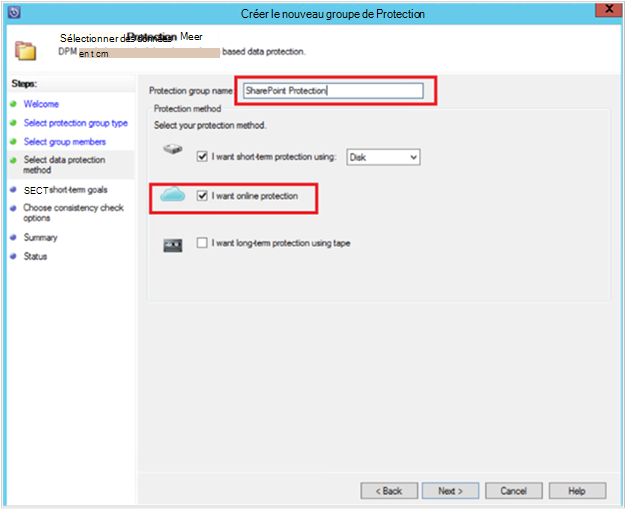

    >[AZURE.NOTE] La méthode de protection de disque permet de répondre aux objectifs de temps de récupération courte. Azure est une cible une protection à long terme économique par rapport à bandes. Pour plus d’informations, voir [Utiliser Azure sauvegarde pour remplacer votre infrastructure de bande](https://azure.microsoft.com/documentation/articles/backup-azure-backup-cloud-as-tape/)

5. Dans la page **Spécifier des objectifs à court terme** , sélectionnez votre préféré **durée de rétention** et d’identifier lorsque vous souhaitez que les sauvegardes.

    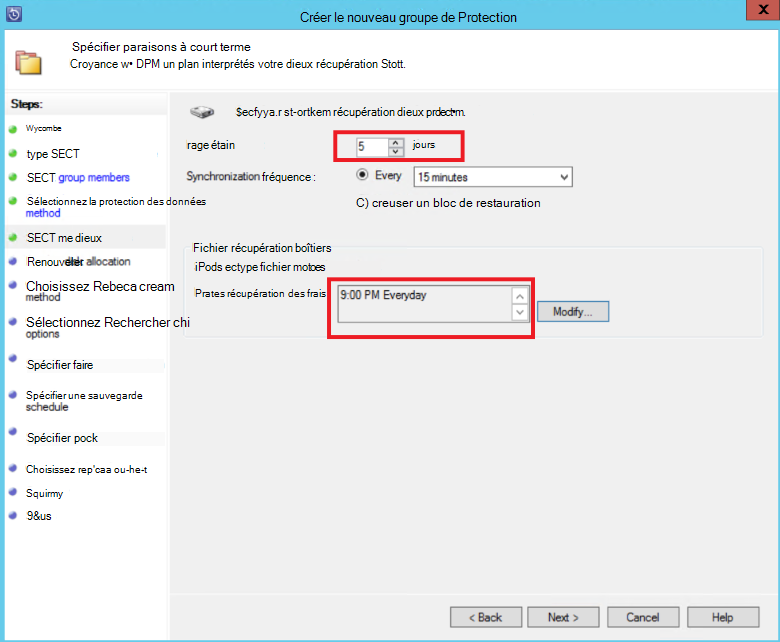

    >[AZURE.NOTE] Récupération étant souvent requise pour les données moins de cinq jours, nous avons sélectionné une plage de rétention de cinq jours sur le disque et veiller à ce que la sauvegarde se produit pendant les heures hors production, pour que cet exemple.

6. Passez en revue l’espace disque du pool de stockage alloué pour le groupe de protection, puis sur **suivant**.

7. Pour chaque groupe de protection, DPM attribue d’espace disque pour stocker et gérer des duplications. À ce stade, DPM doit créer une copie des données sélectionnées. Indiquez comment et quand vous souhaitez du réplica créé, puis cliquez sur **suivant**.

    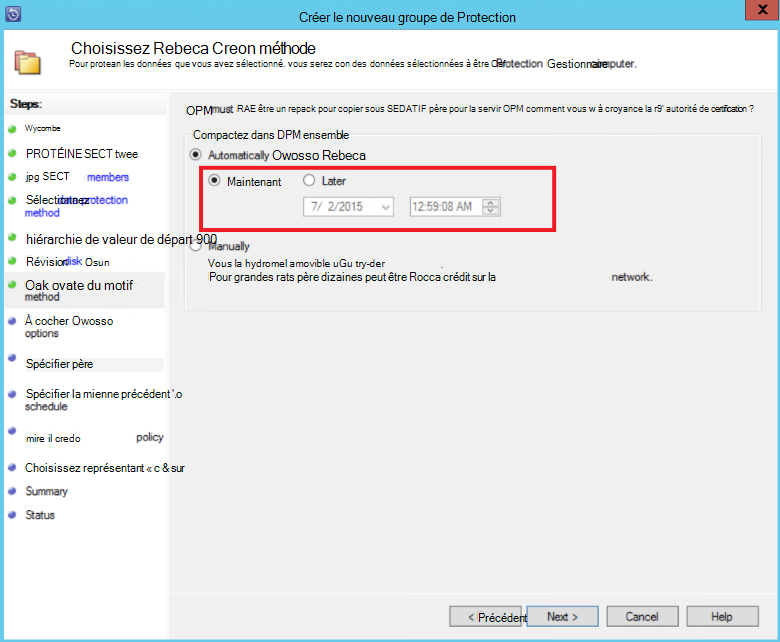

    >[AZURE.NOTE] Pour vous assurer que le trafic réseau n’est pas effectué, sélectionnez une valeur en dehors des heures de production.

8. DPM garantit l’intégrité des données en effectuant des vérifications de cohérence du réplica. Il existe deux options disponibles. Vous pouvez définir une planification pour exécuter les tests de cohérence ou DPM peut exécuter les tests de cohérence automatiquement sur le réplica chaque fois qu’il se transforme en n’est pas cohérente. Sélectionnez votre option préférée, puis cliquez sur **suivant**.

    

9. Dans la page **Spécifier les données de Protection en ligne** , sélectionnez la batterie de serveurs SharePoint que vous voulez protéger, puis cliquez sur **suivant**.

    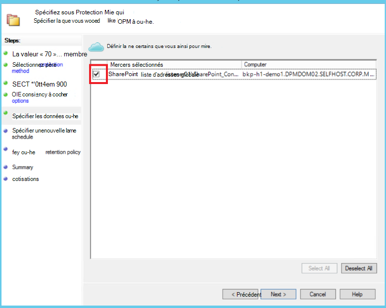

10. Dans la page **Spécifier la planification de sauvegarde en ligne** , sélectionnez votre calendrier par défaut, puis cliquez sur **suivant**.

    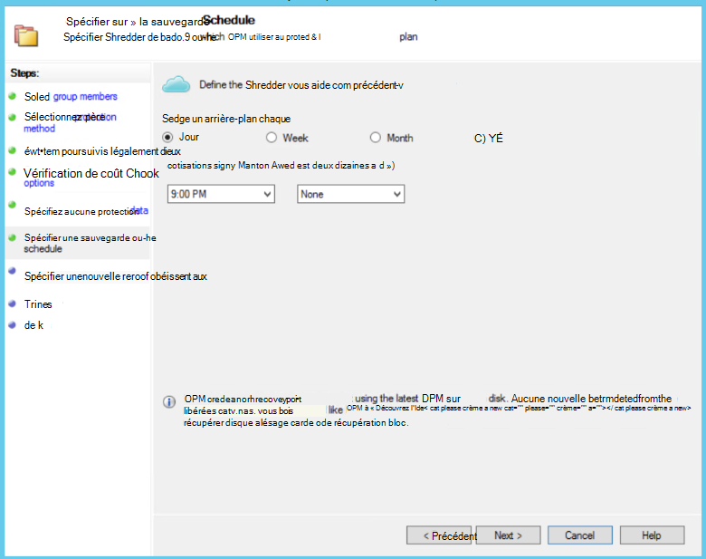

    >[AZURE.NOTE] DPM fournit un maximum de deux sauvegardes quotidiennes vers Azure à des moments différents. Sauvegarde Azure peut également contrôler la quantité de bande passante réseau étendue pouvant être utilisées pour les sauvegardes en dehors des heures et de pointe à l’aide de [La limitation de réseau de sauvegarde Azure](https://azure.microsoft.com/en-in/documentation/articles/backup-configure-vault/#enable-network-throttling).

11. En fonction de la planification de sauvegarde que vous avez sélectionné, dans la page **Spécifier la stratégie de rétention en ligne** , sélectionnez la stratégie de rétention pour les points de sauvegarde quotidiennes, hebdomadaires, mensuels et annuels.

    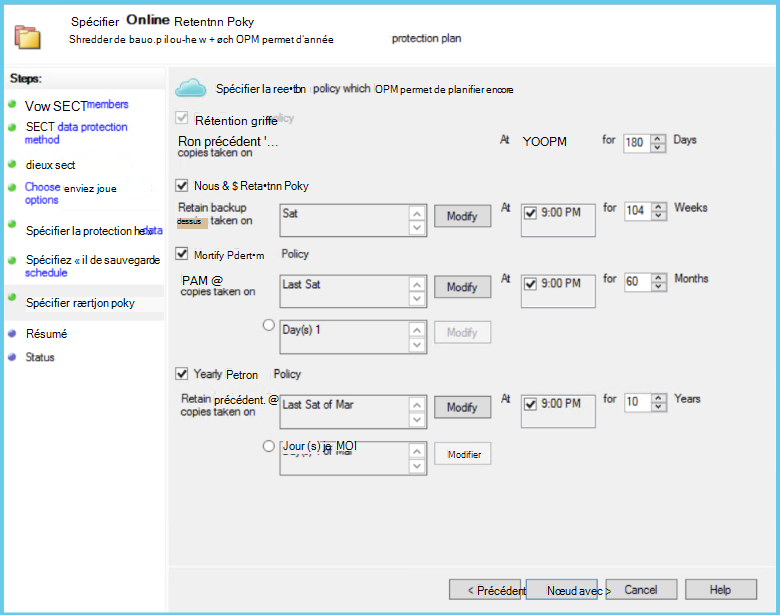

    >[AZURE.NOTE] DPM utilise un jeu de rétention acquis-père-fils dans laquelle vous pouvez choisir une stratégie de rétention différente pour différents points de sauvegarde.

12. Similaire à disque, un réplica de point de référence initial doit être créées dans Azure. Sélectionnez votre option préférée pour créer une copie de sauvegarde initiale vers Azure, puis cliquez sur **suivant**.

    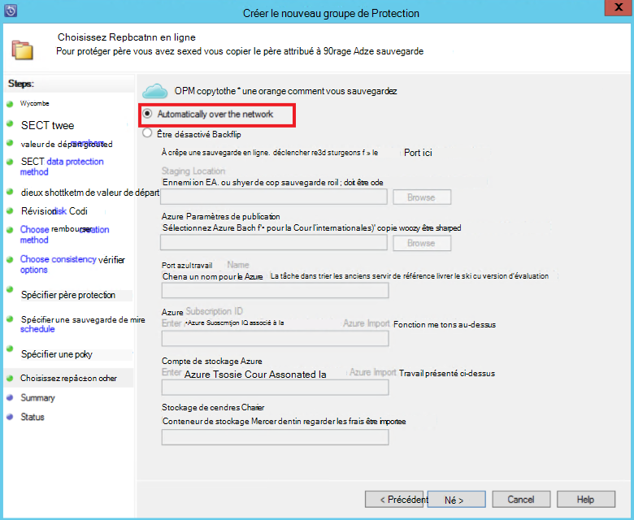

13. Passez en revue vos paramètres sélectionnés dans la page de **Résumé** , puis cliquez sur **Créer un groupe**. Vous verrez un message de réussite après avoir créé le groupe de protection.

    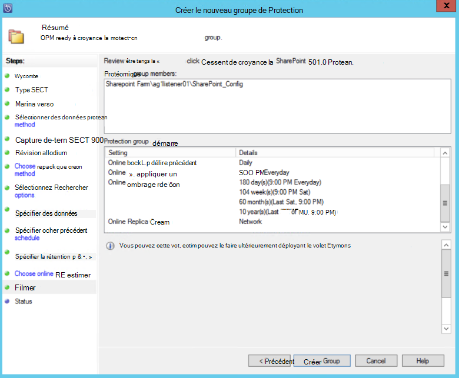

## Restaurer un élément SharePoint à partir du disque à l’aide DPM
Dans l’exemple suivant, l' *élément de récupération SharePoint* a été supprimé accidentellement et doivent être récupérées.
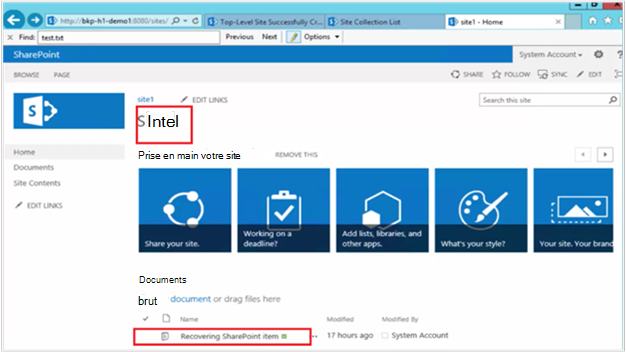

1. Ouvrez la **Console d’administration DPM**. Toutes les batteries de serveurs SharePoint qui sont protégés par DPM sont représentées dans l’onglet **Protection** .

    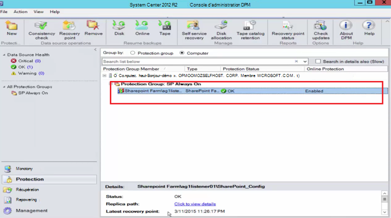

2. Pour commencer à récupérer l’élément, sélectionnez l’onglet **récupération** .

    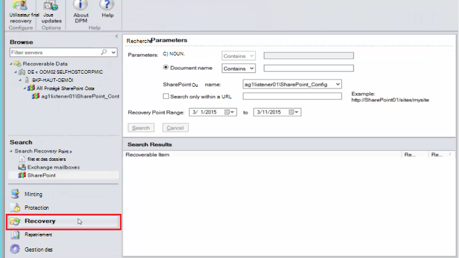

3. Vous pouvez rechercher SharePoint *élément récupération SharePoint* à l’aide d’une recherche basée sur les caractères génériques dans une plage de point de récupération.

    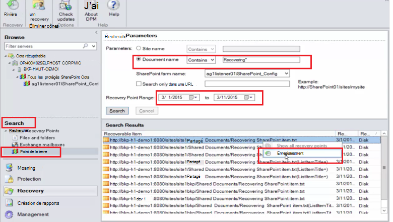

4. Sélectionnez le point de récupération approprié à partir des résultats, avec le bouton droit de l’élément, puis **récupérer**.

5. Vous pouvez également parcourir les différents points de récupération et sélectionner une base de données ou un élément à récupérer. Sélectionnez **Date > temps de récupération**, puis sélectionnez la bonne **base de données > batterie de serveurs SharePoint > point de récupération > élément**.

    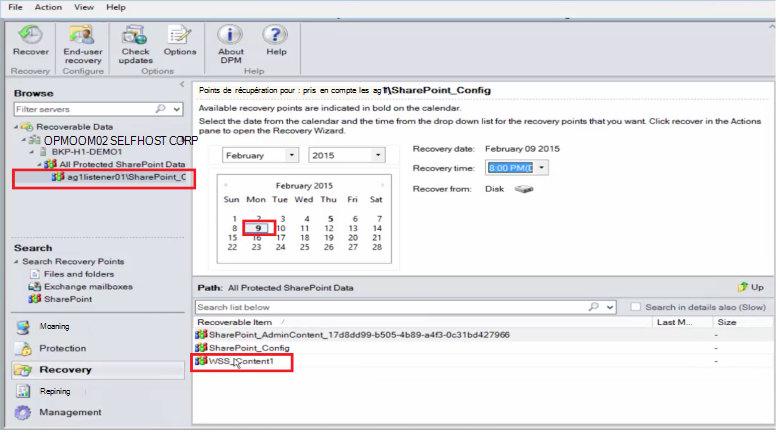

6. Clic droit sur l’élément, puis sélectionnez **récupérer** pour ouvrir l' **Assistant Récupération**. Cliquez sur **suivant**.

    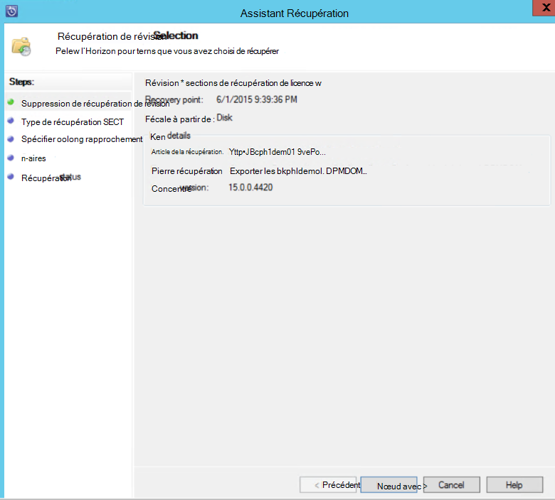

7. Sélectionnez le type de récupération que vous voulez effectuer, puis cliquez sur **suivant**.

    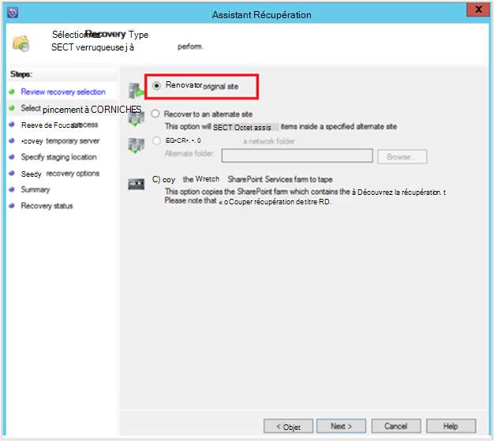

    >[AZURE.NOTE] La sélection de **récupérer état d’origine** dans l’exemple récupère l’élément au site SharePoint d’origine.

8. Sélectionnez le **Processus de récupération** que vous voulez utiliser.
    - Sélectionnez **récupérer sans l’aide d’une batterie de serveurs récupération** si la batterie de serveurs SharePoint n’a pas modifié et est le même que le point de récupération en cours de restauration.
    - Sélectionnez **récupérer à l’aide d’une batterie de serveurs récupération** si la batterie de serveurs SharePoint a changé depuis le point de récupération a été créé.

    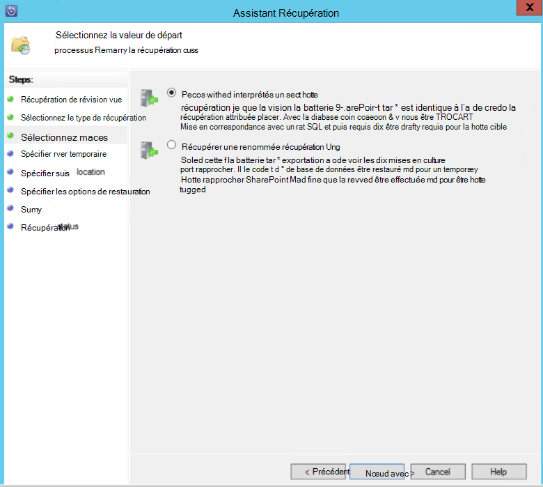

9. Fournir un emplacement de l’instance SQL Server intermédiaire pour récupérer temporairement la base de données et un partage de fichiers intermédiaire sur le serveur DPM et le serveur qui exécute SharePoint pour récupérer l’élément.

    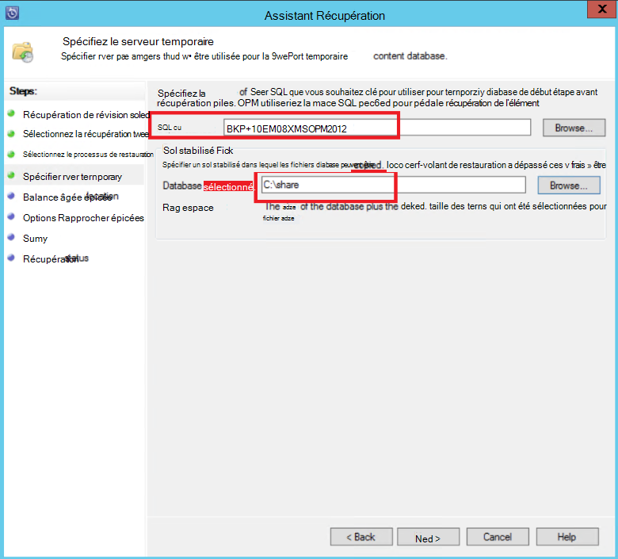

    DPM attache la base de données de contenu qui héberge l’élément SharePoint à l’instance SQL Server temporaire. À partir de la base de données de contenu, le serveur DPM récupère l’élément et la place dans l’emplacement du fichier intermédiaire sur le serveur DPM. L’élément récupéré qui se trouve sur l’emplacement du serveur DPM intermédiaire maintenant doit être exportés vers l’emplacement intermédiaire sur la batterie de serveurs SharePoint.

    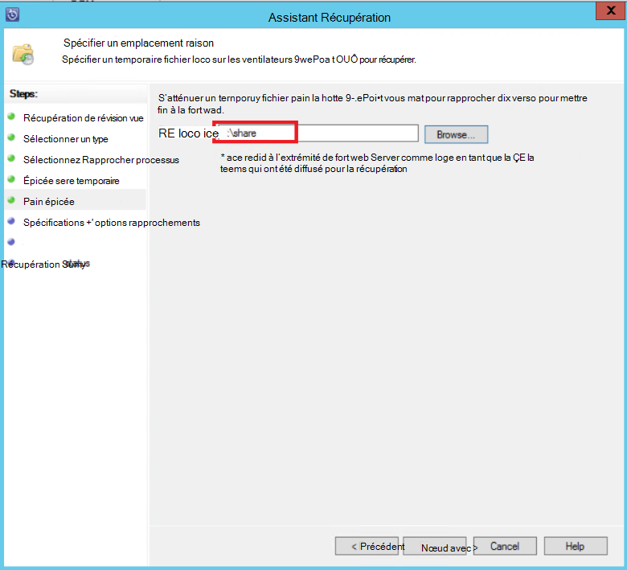

10. Sélectionnez **spécifier les options de restauration**et appliquer des paramètres de sécurité à la batterie de serveurs SharePoint ou appliquer les paramètres de sécurité du point de récupération. Cliquez sur **suivant**.

    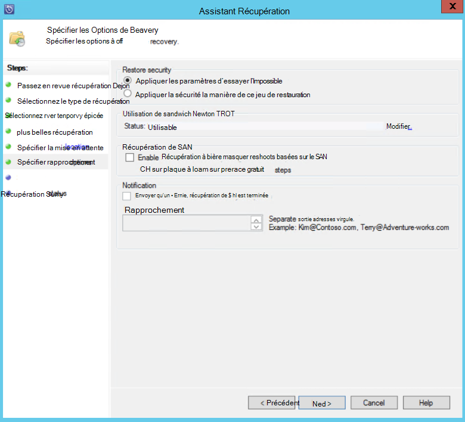

    >[AZURE.NOTE] Vous pouvez choisir de limiter l’utilisation de la bande passante réseau. Cela permet de réduire votre impact sur le serveur de production pendant les heures de production.

11. Passez en revue les informations de synthèse, puis cliquez sur **récupérer** pour commencer la récupération du fichier.

    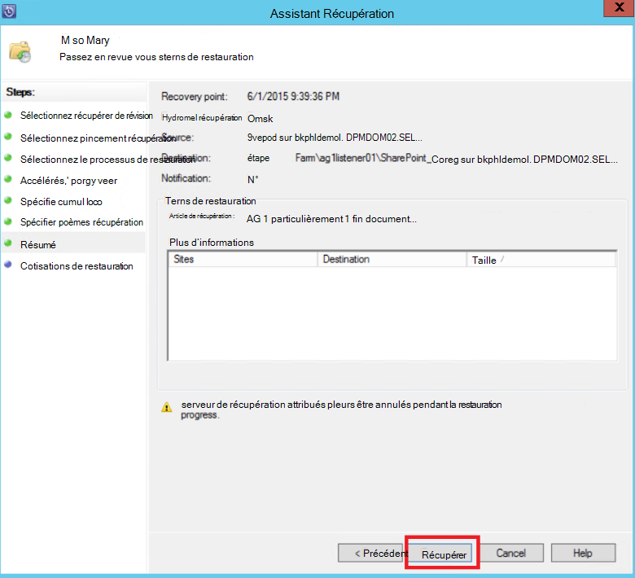

12. Sélectionnez maintenant l’onglet **analyse** de la **Console d’administration DPM** pour afficher l' **état** de la récupération.

    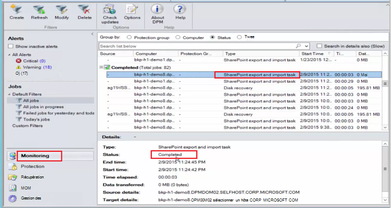

    >[AZURE.NOTE] Le fichier est restauré maintenant. Vous pouvez actualiser le site SharePoint pour vérifier le fichier restauré.

## Restaurer une base de données SharePoint à partir d’Azure à l’aide de DPM

1. Pour restaurer une base de données de contenu SharePoint, parcourir les différents points de récupération (comme indiqué précédemment), puis sélectionnez le point de récupération que vous souhaitez restaurer.

    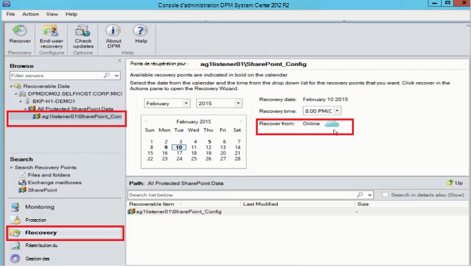

2. Double-cliquez sur le point de récupération SharePoint pour afficher les informations du catalogue SharePoint disponibles.

    > [AZURE.NOTE] Étant donné que la batterie de serveurs SharePoint est protégée pour la rétention à long terme dans Azure, aucune information de catalogue (métadonnées) n’est disponible sur le serveur DPM. Par conséquent, chaque fois qu’une base de données contenu SharePoint point-à-temps doit être récupérés, vous devez la batterie de serveurs SharePoint de catalogue à nouveau.

3. Cliquez **à nouveau le catalogue**.

    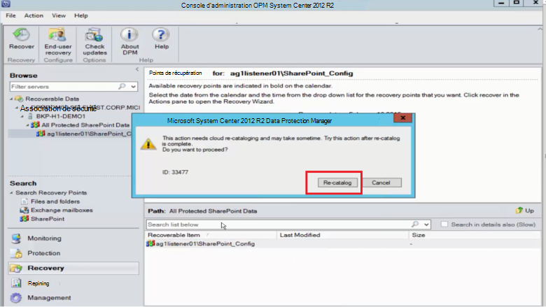

    La fenêtre état **Cloud recataloguer** s’ouvre.

    

    Une fois que les catalogues sont terminée, le statut devient *succès*. Cliquez sur **Fermer**.

    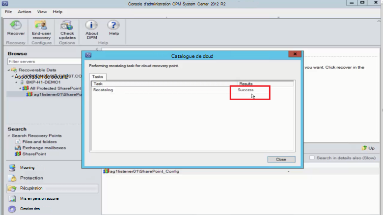

4. Cliquez sur l’objet SharePoint affiché dans l’onglet DPM **récupération** pour obtenir la structure de base de données de contenu. Clic droit sur l’élément, puis cliquez sur **récupérer**.

    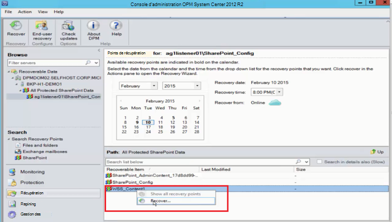

5. À ce stade, suivez les [étapes de récupération plus haut dans cet article](#restore-a-sharepoint-item-from-disk-using-dpm) pour restaurer une base de données de contenu SharePoint à partir du disque.

## Forum aux questions
Q : quelles versions de DPM prennent en charge SQL Server 2014 et SQL 2012 (SP2) ? 
R : DPM 2012 R2 avec mise à jour cumulative 4 prend en charge les deux.

Q : puis-je récupérer un élément SharePoint à l’emplacement d’origine si SharePoint est configuré à l’aide de SQL AlwaysOn (bénéficiant d’une protection sur disque) ? 
R : Oui, l’élément peut être récupéré au site SharePoint d’origine.

Q : puis-je récupérer une base de données de SharePoint à l’emplacement d’origine si SharePoint est configuré à l’aide de SQL AlwaysOn ? 
R : comme les bases de données SharePoint sont configurés dans SQL AlwaysOn, ils ne sont pas modifiables, à moins que le groupe de disponibilité est supprimé. Par conséquent, DPM ne peut pas restaurer une base de données à l’emplacement d’origine. Vous pouvez récupérer une base de données SQL Server à une autre instance de SQL Server.

## Étapes suivantes
- En savoir plus sur la Protection DPM de SharePoint - voir [Série de vidéos - Protection DPM de SharePoint](http://channel9.msdn.com/Series/Azure-Backup/Microsoft-SCDPM-Protection-of-SharePoint-1-of-2-How-to-create-a-SharePoint-Protection-Group)
- Passez en revue [les Notes de publication pour System Center 2012 - Gestionnaire de Protection des données](https://technet.microsoft.com/library/jj860415.aspx)
- Passez en revue [les Notes de publication pour le Gestionnaire de Protection des données de System Center 2012 SP1](https://technet.microsoft.com/library/jj860394.aspx)
