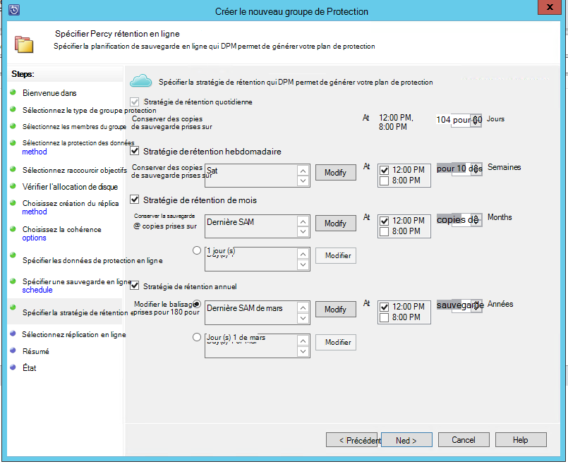
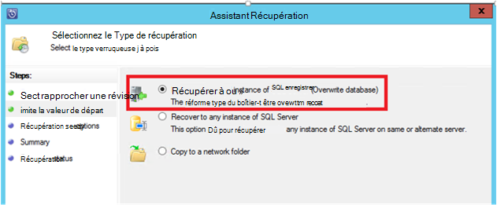
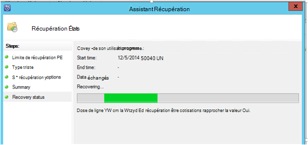

<properties
    pageTitle="Sauvegarde Azure pour les charges de travail de SQL Server à l’aide de DPM | Microsoft Azure"
    description="Présentation de la sauvegarde des bases de données SQL Server à l’aide du service de sauvegarde d’Azure"
    services="backup"
    documentationCenter=""
    authors="adigan"
    manager="Nkolli1"
    editor=""/>

<tags
    ms.service="backup"
    ms.workload="storage-backup-recovery"
    ms.tgt_pltfrm="na"
    ms.devlang="na"
    ms.topic="article"
    ms.date="09/27/2016"
    ms.author="adigan;giridham; jimpark;markgal;trinadhk"/>

# Sauvegarde Azure pour les charges de travail de SQL Server à l’aide de DPM

Cet article vous guide tout au long des étapes de configuration pour la sauvegarde des bases de données SQL Server à l’aide de sauvegarde Azure.

Pour sauvegarder des bases de données SQL Azure, vous avez besoin d’un compte Azure. Si vous n’avez pas un compte, vous pouvez créer un compte d’évaluation gratuit dans seulement quelques minutes. Pour plus d’informations, voir [Azure la version d’évaluation gratuite](https://azure.microsoft.com/pricing/free-trial/).

La gestion de la sauvegarde de base de données SQL Server sur Azure et de récupération à partir d’Azure implique trois étapes :

1. Créer une stratégie de sauvegarde pour protéger des bases de données SQL Server Azure.
2. Créer des copies de sauvegarde à la demande à Azure.
3. Restaurer la base de données à partir d’Azure.

## Avant de commencer
Avant de commencer, vérifiez que toutes les [conditions préalables](../backup-azure-dpm-introduction.md#prerequisites) pour protéger les charges de travail à l’aide de Microsoft Azure Backup ont été satisfaites. Les conditions préalables traitent des tâches telles que : création d’un archivage sécurisé sauvegarde, le téléchargement des informations d’identification de l’archivage sécurisé, l’installation de l’Agent de sauvegarde Azure et enregistrement du serveur avec l’archivage sécurisé.

## Créer une stratégie de sauvegarde pour protéger des bases de données SQL Server Azure

1. Sur le serveur DPM, cliquez sur l’espace de travail de **Protection** .

2. Dans le ruban, cliquez sur **Nouveau** pour créer un nouveau groupe de protection.

    

3. DPM affiche l’écran d’accueil avec l’aide sur la création d’un **Groupe de Protection**. Cliquez sur **suivant**.

4. Sélectionnez **Servers**.

    

5. Développez la machine SQL Server où les bases de données à sauvegarder sont présents. DPM affiche diverses sources de données qui peuvent être sauvegardés à partir de ce serveur. Développer **Tous les éléments partagés SQL** et sélectionnez les bases de données (dans ce cas nous sélectionné ReportServer$ MSDPM2012 et ReportServer$ MSDPM2012TempDB) à sauvegarder. Cliquez sur **suivant**.

    

6. Indiquez un nom pour le groupe de protection et activez la case à cocher **je veux Protection en ligne** .

    

7. Dans l’écran **Spécifier des objectifs à court terme** , inclure les entrées nécessaires pour créer des points de sauvegarde sur le disque.

    Ici, nous voyons que **plage de rétention** est défini sur *5 jours*, **la fréquence de synchronisation** est défini sur une fois toutes *les 15 minutes* qui est la fréquence à laquelle la sauvegarde est effectuée. **Sauvegarde complète Express** est défini sur *8 h 00*.

    

    >[AZURE.NOTE] À 8:00 (en fonction de la saisie tactile) un point de sauvegarde est créé quotidiennement par transfert de données qui a été modifiées à partir du point de sauvegarde du jour précédent 8:00 PM. Ce processus est appelé **Sauvegarde complète Express**. Alors que la transaction journaux sont synchronisés toutes les 15 minutes, s’il est nécessaire pour restaurer la base de données à 9:00 – puis le point est créé par relecture les journaux de la dernière express point sauvegarde complète (20 h dans le cas présent).

8. Cliquez sur **suivant**

    DPM affiche l’espace de stockage globales disponible et l’utilisation de l’espace disque potentiels.

    

    Par défaut, DPM crée un volume par la source de données (base de données SQL Server) qui est utilisé pour la copie de sauvegarde initiale. Le disque Gestionnaire logique à l’aide de cette approche, les limites de protection DPM aux sources de 300 données (bases de données SQL Server). Pour contourner cette limitation, sélectionnez la **co-création localiser des données dans le Pool de stockage DPM**, option. Si vous utilisez cette option, DPM utilise un volume unique pour plusieurs sources de données, ce qui permet à DPM de protéger jusqu'à 2000 bases de données SQL.

    Si l’option **automatiquement accroître les volumes** est sélectionnée, DPM peut représenter le volume de sauvegarde accru fur et aux données de production. Si l’option **Agrandir automatiquement les volumes** n’est pas sélectionnée, DPM limite au stockage de sauvegarde utilisé pour les sources de données dans le groupe de protection.

9. Les administrateurs reçoivent le choix de transfert de cette sauvegarde initiale manuellement (Désactiver réseau) pour éviter l’encombrement de bande passante ou sur le réseau. Ils peuvent également configurer l’heure à laquelle le transfert initial peut se produire. Cliquez sur **suivant**.

    

    La copie de sauvegarde initiale nécessite un transfert de la source de données entière (base de données SQL Server) à partir du serveur de production (ordinateur SQL Server) vers le serveur DPM. Ces données peuvent être volumineuses et transfert de données sur le réseau peut dépasser la bande passante. Pour cette raison, les administrateurs peuvent choisir transférer la sauvegarde initiale : **manuellement** (à l’aide d’un support amovible) pour éviter l’encombrement de bande passante, ou **automatiquement sur le réseau** (à une heure spécifique).

    Une fois que la sauvegarde initiale est terminée, le reste des sauvegardes sont des sauvegardes incrémentielles sur la copie de sauvegarde initiale. Incrémentielles tendent à être et sont transférés facilement sur le réseau.

10. Choisissez si vous souhaitez que la vérification de cohérence d’exécution et cliquez sur **suivant**.

    

    DPM peut effectuer une cohérence à cocher pour vérifier l’intégrité du point de sauvegarde. Il calcule la somme de contrôle du fichier de sauvegarde sur le serveur de production (ordinateur SQL Server dans ce scénario) et les données sauvegardée pour ce fichier à DPM. Dans le cas d’un conflit, il est supposé que le fichier de sauvegarde à DPM est endommagé. DPM rectifier les données sauvegardée en envoyant les blocs correspondant à l’incohérence dans des totaux. Comme la vérification de cohérence est une opération de performances accrue, les administrateurs ont la possibilité de planification de la vérification de cohérence ou exécution automatique.

11. Pour spécifier une protection en ligne des sources de données, sélectionnez les bases de données à protéger sur Azure et cliquez sur **suivant**.

    

12. Les administrateurs peuvent choisir des plannings de sauvegarde et de stratégies de rétention correspondant à des stratégies de leur organisation.

    

    Dans cet exemple, les sauvegardes sont effectuées une fois par jour à 12:00 PM et 20 h (partie inférieure de l’écran)

    >[AZURE.NOTE] Il est conseillé de disposer de quelques points de récupération à court terme sur disque, pour la récupération rapide. Ces points de récupération sont utilisées pour « reprise ». Azure constitue un emplacement hors site bonne avec SLA supérieure et la garantie disponibilité.

    **Meilleures pratiques**: Assurez-vous que les sauvegardes Azure sont planifiées à l’issue de sauvegardes disque local à l’aide de DPM. Cela permet de la dernière sauvegarde sur disque soit copié vers Azure.

13. Cliquez sur la planification de stratégie de rétention. Les détails sur le fonctionne de la stratégie de rétention sont fournies à [Utiliser Azure sauvegarde à remplacer votre article d’infrastructure bandes](backup-azure-backup-cloud-as-tape.md).

    

    Dans cet exemple :

    - Les sauvegardes effectuées une fois par jour à 12:00 PM et 20 h (partie inférieure de l’écran) et sont conservées pendant 180 jours.
    - La sauvegarde samedi à 12:00. sont conservées pendant 104 semaines
    - La sauvegarde dernier samedi à 12:00. sont conservées pendant 60 mois
    - La sauvegarde dernier samedi de mars à 12:00. est conservé pour dix ans

14. Cliquez sur **suivant** et sélectionnez l’option appropriée pour le transfert de la copie de sauvegarde initiale vers Azure. Vous pouvez choisir **automatiquement sur le réseau** ou **Sauvegarde en mode hors connexion**.

    - **Automatiquement sur le réseau** transfère les données de sauvegarde à Azure selon le planning choisi pour la sauvegarde.
    - Fonctionnement de la **Sauvegarde en mode hors connexion** est expliqué au [flux de travail de sauvegarde en mode hors connexion dans Azure sauvegarde](backup-azure-backup-import-export.md).

    Choisissez le mécanisme de transfert pertinents pour envoyer la copie de sauvegarde initiale à Azure et cliquez sur **suivant**.

15. Une fois que vous passez en revue les détails de stratégie dans l’écran de **Résumé** , cliquez sur le bouton **créer un groupe** pour terminer le flux de travail. Cliquer sur le bouton **Fermer** et l’avancement de tâche dans un espace de travail de surveillance.

    

## Sauvegarde à la demande d’une base de données SQL Server
Tandis que les étapes précédentes de créer une stratégie de sauvegarde, un « point de récupération » est créé uniquement lorsque la première sauvegarde se produit. Au lieu d’attendre le planificateur s’active, les étapes en dessous de la création d’une récupération déclencheur, pointez sur manuellement.

1. Attendez que l’état de groupe de protection indique **OK** pour la base de données avant de créer le point de récupération.

    

2. Avec le bouton droit sur la base de données, puis sélectionnez **Créer un Point de récupération**.

    

3. Cliquez sur **Protection en ligne** dans le menu déroulant, puis cliquez sur **OK**. Cela démarre la création d’un point de récupération dans Azure.

    

4. Vous pouvez afficher la progression du projet dans l’espace de travail **surveillance** où vous trouverez une en cours travail similaire à celui illustré dans l’illustration suivante.

    

## Récupérer une base de données SQL Server à partir d’Azure
Les étapes suivantes sont nécessaires pour récupérer une entité protégée (base de données SQL Server) à partir d’Azure.

1. Ouvrez le serveur DPM Management Console. Accédez à l’endroit où vous pouvez voir les serveurs sauvegardés par DPM de l’espace de travail de **récupération** . Recherchez la base de données requise (dans ce cas ReportServer$ MSDPM2012). Sélectionnez une valeur de **récupération à partir de** qui se termine par **en ligne**.

    

2. Double-cliquez sur le nom de la base de données, cliquez sur **récupérer**.

    

3. DPM affiche les détails du point de récupération. Cliquez sur **suivant**. Pour remplacer la base de données, sélectionnez le type de récupération **récupérer à l’instance SQL Server d’origine**. Cliquez sur **suivant**.

    

    Dans cet exemple, DPM permet la récupération de la base de données à une autre instance de SQL Server ou dans un dossier réseau autonome.

4. Dans l’écran **options de spécifier la récupération** , vous pouvez sélectionner les options de récupération comme la limitation de bande passante réseau pour limiter la bande passante utilisée par la récupération. Cliquez sur **suivant**.

5. Dans l’écran **Résumé** , pour afficher toutes les configurations de récupération fournies jusqu'à présent. Cliquez sur **récupérer**.

    La colonne Statut récupération indique la base de données en cours de restauration. Vous pouvez cliquer sur **Fermer** pour fermer l’Assistant et afficher la progression dans l’espace de travail de **surveillance** .

    

    Une fois la restauration terminée, la base de données restaurée est application cohérente.

### Étapes suivantes :

• [Forum aux questions sur sauvegarde azure](backup-azure-backup-faq.md)
