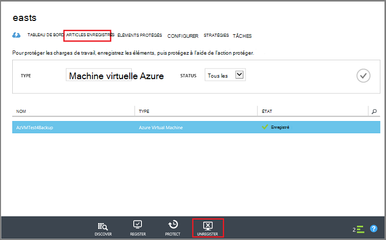

<properties
   pageTitle="Supprimer un archivage sécurisé sauvegarde Azure | Microsoft Azure"
   description="Comment supprimer un archivage sécurisé sauvegarde Azure. Pour déterminer pourquoi vous ne pouvez pas supprimer un archivage sécurisé sauvegarde. "
   services="service-name"
   documentationCenter="dev-center-name"
   authors="markgalioto"
   manager="cfreeman"
   editor=""/>

<tags
   ms.service="backup"
   ms.devlang="na"
   ms.topic="article"
   ms.tgt_pltfrm="na"
   ms.workload="storage-backup-recovery"
   ms.date="08/29/2016"
   ms.author="markgal;trinadhk"/>

# Supprimer un archivage sécurisé sauvegarde Azure

Le service de sauvegarde Azure comporte deux types de chambres fortes - l’archivage sécurisé de sauvegarde et l’archivage sécurisé aux Services de récupération. L’archivage sécurisé sauvegarde reçue en premier. Puis l’archivage sécurisé aux Services de récupération arrivée pour prendre en charge les déploiements Gestionnaire de ressources développée. En raison de l’extension des fonctionnalités et les dépendances des informations qui doivent être stockés dans l’archivage sécurisé, la suppression d’un archivage sécurisé aux Services de récupération peut sembler plus difficile qu’elle doit être.

|**Type de déploiement**|**Portail**|**Nom de l’archivage sécurisé**|
|--------------|----------|---------|
|Classique|Classique|Archivage sécurisé sauvegarde|
|Gestionnaire de ressources|Azure|Archivage sécurisé des Services de récupération|

> [AZURE.NOTE] Chambres fortes sauvegarde ne peut pas protéger solutions déployé le Gestionnaire de ressources. Toutefois, vous pouvez utiliser un archivage sécurisé aux Services de récupération pour protéger les serveurs variation déployées et machines virtuelles.  

Dans cet article, nous utilisons le terme, l’archivage sécurisé, pour faire référence à l’écran de l’archivage sécurisé sauvegarde ou de l’archivage sécurisé des Services de récupération générique. Nous utilisons le nom formel, l’archivage sécurisé sauvegarde ou l’archivage sécurisé des Services de récupération, lorsqu’il est nécessaire de faire la distinction entre les chambres fortes.

## Suppression d’un archivage sécurisé aux Services de récupération

La suppression un archivage sécurisé aux Services de récupération est un processus en une étape - *fourni que la archivage sécurisé ne contient pas toutes les ressources*. Avant de pouvoir supprimer un archivage sécurisé aux Services de récupération, vous devez supprimez ou effacez toutes les ressources dans l’archivage sécurisé. Si vous tentez de supprimer un archivage sécurisé qui contient des ressources, vous obtenez un message d’erreur comme l’image suivante.

  

Jusqu'à ce que vous avez désactivé les ressources de l’archivage sécurisé, cliquer sur **Réessayer** génère le même message d’erreur. Si vous êtes bloqué sur ce message d’erreur, cliquez sur **Annuler** et suivez les étapes ci-dessous pour supprimer les ressources dans l’archivage sécurisé aux Services de récupération.

### La suppression des éléments à partir d’un archivage sécurisé protéger une machine virtuelle

Si vous avez déjà ouvert l’archivage sécurisé aux Services de récupération, passez à l’étape suivante.

1.  Ouvrez le portail Azure, puis dans le tableau de bord, ouvrez l’archivage sécurisé que vous voulez supprimer.

    Si vous n’avez pas l’archivage sécurisé aux Services de récupération épinglée au tableau de bord, dans le menu concentrateur, cliquez sur **Autres Services** et dans la liste des ressources, tapez **Les Services de récupération**. Lorsque vous commencez à taper, les filtres de liste en fonction de vos entrées. Cliquez sur **Services de récupération de chambres fortes**.

      

    La liste des Services de récupération chambres fortes s’affiche. Dans la liste, sélectionnez l’archivage sécurisé que vous voulez supprimer.

    

2. Dans l’affichage de l’archivage sécurisé, consultez le volet **Essentials** . Pour supprimer un archivage sécurisé, ne peuvent pas être tous les éléments protégés. Si vous voyez un nombre différent de zéro, sous **Éléments de sauvegarde** ou **les serveurs de gestion de sauvegarde**, vous devez supprimer ces éléments avant de pouvoir supprimer l’archivage sécurisé.

    

    Machines virtuelles et des fichiers/dossiers sont considérées comme des éléments de sauvegarde et sont répertoriés dans la zone **Éléments de sauvegarde** du volet Essentials. Un serveur DPM est répertorié dans la zone **Serveur de gestion de sauvegarde** du volet Essentials. **Éléments répliquées** concerne le service de récupération de Site Azure.

3. Pour commencer la suppression des éléments protégés de l’archivage sécurisé, vous trouverez les éléments dans l’archivage sécurisé. Dans le tableau de bord de l’archivage sécurisé cliquez sur **paramètres**, puis cliquez sur **éléments de sauvegarde** pour ouvrir cette carte.

    

    La carte de **Sauvegarde éléments** dispose de colonnes distinctes, en fonction du Type d’élément : Machines virtuelles Azure ou dossiers de fichiers (voir l’image). La liste Type d’élément par défaut indiquée est Machines virtuelles Azure. Pour afficher la liste des éléments de dossiers de fichiers dans l’archivage sécurisé, sélectionnez **Dossiers de fichiers** dans le menu déroulant.

4. Avant de pouvoir supprimer un élément de l’archivage sécurisé protéger une machine virtuelle, vous devez arrêter le travail de sauvegarde de l’élément et supprimer les données de point de récupération. Pour chaque élément de l’archivage sécurisé, procédez comme suit :

    un. Sur la carte **d’Éléments de sauvegarde** , avec le bouton droit de l’élément et dans le menu contextuel, sélectionnez **Arrêter la sauvegarde**.

    

    La carte arrêter la sauvegarde s’ouvre.

    b. Sur la carte **Cesser de sauvegarde** , dans le menu **Choisir une option** , sélectionnez **Supprimer les données de sauvegarde** > tapez le nom de l’élément > et cliquez sur **Arrêter la sauvegarde**.

      Tapez le nom de l’élément pour vérifier que vous voulez supprimer. Le bouton **Arrêter la sauvegarde** activera pas jusqu'à ce que vous vérifiez l’élément pour l’arrêter. Si vous ne voyez pas la boîte de dialogue permettant de taper le nom de l’élément de sauvegarde, vous avez choisi l’option **Conserver les données de sauvegarde** .

    

      Si vous le souhaitez, vous pouvez fournir une raison pourquoi vous supprimez les données et ajoutez des commentaires. Après avoir cliqué sur **Arrêter la sauvegarde**, autoriser le travail supprimer terminer avant d’essayer de supprimer l’archivage sécurisé. Pour vérifier que le travail est terminé, vérifier les Messages d’Azure .  
   Une fois que la tâche est terminée, vous recevrez un message indiquant le processus de sauvegarde a été arrêté et les données de sauvegarde a été supprimées pour cet élément.

    c. Après la suppression d’un élément dans la liste, dans le menu **Éléments de sauvegarde** , cliquez sur **Actualiser** pour afficher les éléments restants dans l’archivage sécurisé.

      

      Lorsqu’il n’y a aucun élément dans la liste, faites défiler vers le volet **Essentials** dans la carte de l’archivage sécurisé de sauvegarde. Il ne doivent pas être n’importe quel **éléments de sauvegarde**, des **serveurs de gestion de sauvegarde**ou **répliqué éléments** répertoriés. Si éléments apparaissent toujours dans l’archivage sécurisé, revenez à l’étape 3 ci-dessus et choisissez une liste de type d’élément différent.  

5. Lorsqu’il n’y a pas d’autres éléments dans la barre d’outils de l’archivage sécurisé, cliquez sur **Supprimer**.

    

6. Lorsque vous êtes invité à vérifier que vous souhaitez supprimer l’archivage sécurisé, cliquez sur **Oui**.

    L’archivage sécurisé est supprimé et le portail renvoie au menu **Nouveau** service.

## Que se passe-t-il si j’ai arrêté le processus de sauvegarde mais conservées les données ?

Si vous avez arrêté le processus de sauvegarde mais accidentellement *conservées* les données, vous devez supprimer les données de sauvegarde avant de pouvoir supprimer l’archivage sécurisé. Pour supprimer les données de sauvegarde :

1. Sur la carte **d’Éléments de sauvegarde** , droit de l’élément, puis dans le menu contextuel, cliquez sur **Supprimer les données de sauvegarde**.

    

    La carte de **Supprimer les données de sauvegarde** s’ouvre.

2. Sur la carte de **Supprimer les données de sauvegarde** , tapez le nom de l’élément, puis cliquez sur **Supprimer**.

    

    Une fois que vous avez supprimé les données, passez à l’étape 4c, ci-dessus et continuer le processus.

## Supprimer un archivage sécurisé permet de protéger un serveur DPM

Avant de pouvoir supprimer un archivage sécurisé permet de protéger un serveur DPM, vous devez effacer tous les points de récupération qui ont été créées et puis annuler l’enregistrement du serveur de l’archivage sécurisé.

Pour supprimer les données associées à un groupe de protection :

1. Dans la Console Administrateur DPM, cliquez sur **la Protection**, sélectionnez un groupe de protection, sélectionnez le membre du groupe de Protection et dans le ruban, cliquez sur **Supprimer**. Vous devez sélectionner les membres pour le bouton **Supprimer** apparaissent dans le ruban. Dans l’exemple, le membre est **dummyvm9**. S’il existe plusieurs membres du groupe de protection, maintenez la touche Ctrl pour sélectionner plusieurs membres.

    

    La boîte de dialogue **Désactiver la Protection** s’ouvre.

2. Dans la boîte de dialogue **Désactiver la Protection** , sélectionnez **Supprimer les données protégées**, puis cliquez sur **Désactiver la Protection**.

    

    Vous ne voulez pas conserver les données protégées, car vous devez désactiver l’archivage sécurisé afin de le supprimer. Selon le nombre de récupération points et la quantité de données se trouve dans le groupe de protection, il peut prendre de quelques secondes à quelques minutes pour supprimer les données. La boîte de dialogue **Désactiver la Protection** indique l’état quand la tâche est terminée.

    

3. Continuez ce processus pour tous les membres de tous les groupes de protection.

    Vous devez supprimer protégées toutes les données et les groupes auxquels la protection.

4. Après avoir supprimé tous les membres du groupe de protection, basculez vers le portail Azure. Ouvrez le tableau de bord de l’archivage sécurisé et vérifiez qu’il n’existe **Aucune sauvegarde éléments**, **les serveurs de gestion de sauvegarde**ou **répliqué éléments**. Dans la barre d’outils de l’archivage sécurisé, cliquez sur **Supprimer**.

    

    S’il existe des serveurs d’administration sauvegarde enregistrés à l’archivage sécurisé, vous ne pourrez pas supprimer l’archivage sécurisé même si aucune donnée dans l’archivage sécurisé. Si vous pensez vous aviez supprimé les serveurs de gestion de sauvegarde associés à l’archivage sécurisé, mais il existe encore des serveurs affichant dans le volet **Essentials** , voir [trouver les serveurs de gestion de sauvegarde enregistrés à l’archivage sécurisé](backup-azure-delete-vault.md#find-the-backup-management-servers-registered-to-the-vault).

5. Lorsque vous êtes invité à vérifier que vous souhaitez supprimer l’archivage sécurisé, cliquez sur **Oui**.

    L’archivage sécurisé est supprimé et le portail renvoie au menu **Nouveau** service.

## Supprimer un archivage sécurisé permet de protéger un serveur de Production

Avant de pouvoir supprimer un archivage sécurisé permet de protéger un serveur de Production, vous devez supprimer ou annuler l’enregistrement du serveur de l’archivage sécurisé.

Pour supprimer le serveur de Production associé à l’archivage sécurisé :

1. Dans le portail Azure, ouvrez le tableau de bord de l’archivage sécurisé et cliquez sur **paramètres** > **Infrastructure de sauvegarde** > **Serveurs de Production**.

    

    La carte de **Serveurs de Production** s’ouvre et répertorie tous les serveurs de Production dans l’archivage sécurisé.

    

2. Sur la carte de **Serveurs de Production** , avec le bouton droit sur le serveur, puis cliquez sur **Supprimer**.

    

    La carte **Supprimer** s’ouvre.

    

3. Sur la carte **Supprimer** , vérifiez le nom du serveur à supprimer, cliquez sur **Supprimer**. Vous devez entrer correctement le nom du serveur pour activer le bouton **Supprimer** .

    Une fois que l’archivage sécurisé a été supprimée, vous recevrez un message indiquant que la archivage sécurisé a été supprimé. Après avoir supprimé tous les serveurs dans l’archivage sécurisé, faites défiler vers le volet Essentials dans le tableau de bord de l’archivage sécurisé.

4. Dans le tableau de bord de l’archivage sécurisé, vérifiez qu’aucun **Des éléments de sauvegarde**, **serveurs de gestion de sauvegarde**, ou **éléments répliqué**. Dans la barre d’outils de l’archivage sécurisé, cliquez sur **Supprimer**.

5. Lorsque vous êtes invité à vérifier que vous souhaitez supprimer l’archivage sécurisé, cliquez sur **Oui**.

    L’archivage sécurisé est supprimé et le portail renvoie au menu **Nouveau** service.

## Supprimer un archivage sécurisé sauvegarde

Les instructions suivantes sont appliquent aux suppression d’un archivage sécurisé de sauvegarde dans le portail classique. Un archivage sécurisé de sauvegarde et l’archivage sécurisé des Services de récupération sont identiques : avant de pouvoir supprimer l’archivage sécurisé, supprimer les éléments et les données conservées.

1. Ouvrez le portail classique.

2. Dans la liste des chambres fortes sauvegarde, sélectionnez l’archivage sécurisé que vous voulez supprimer.

    

    Le tableau de bord de l’archivage sécurisé s’ouvre. Examinez le nombre de serveurs Windows et/ou Azure machines virtuelles associées à l’archivage sécurisé. En outre, recherchez-le sur le stockage total consommé dans Azure. Vous devez arrêter les travaux de sauvegarde et de supprimer des données existantes avant de supprimer l’archivage sécurisé.

3. Cliquez sur l’onglet **Éléments protégé** , puis cliquez sur **Désactiver la Protection**

    

    La boîte de dialogue **Arrêter la protection de « votre l’archivage sécurisé »** s’affiche.

4. Dans la boîte de dialogue **Arrêter la protection de « votre l’archivage sécurisé »** , cochez **Supprimer les données de sauvegarde associées** , puis cliquez sur .  
   Si vous le souhaitez, vous pouvez choisir un motif de l’arrêt de la protection et fournissez un commentaire.

    

    Après avoir supprimé les éléments dans l’archivage sécurisé, l’archivage sécurisé sera vide.

    

5. Dans la liste des onglets, cliquez sur **Éléments enregistrés**. Pour chaque élément est enregistré dans l’archivage sécurisé, sélectionnez l’élément, puis cliquez sur **Annuler l’enregistrement**.

    

6. Dans la liste des onglets, cliquez sur **tableau de bord** pour ouvrir cet onglet. Vérifier aucun des serveurs enregistrés ou Azure machines virtuelles protégés dans le cloud. Vérifiez également qu'aucune donnée dans le stockage. Cliquez sur **Supprimer** pour supprimer l’archivage sécurisé.

    

    L’écran de confirmation Supprimer sauvegarde l’archivage sécurisé s’ouvre. Sélectionnez une option pourquoi vous supprimez l’archivage sécurisé, puis cliquez sur .  

    

    L’archivage sécurisé est supprimé, et vous retournez au tableau de bord du portail classique.

### Rechercher les serveurs de gestion de la sauvegarde enregistrés à l’archivage sécurisé

Si vous avez plusieurs serveurs inscrits à un archivage sécurisé, il peut être difficile à mémoriser les. Pour voir les serveurs enregistrés à l’archivage sécurisé et supprimez-les :

1. Ouvrez le tableau de bord de l’archivage sécurisé.

2. Dans le volet **Essentials** , cliquez sur **paramètres** pour ouvrir cette carte.

    

3. Dans la **carte de paramètres**, cliquez sur **Infrastructure de sauvegarde**.

4. Dans la carte de **l’Infrastructure de sauvegarde** , cliquez sur **Les serveurs de gestion de sauvegarde**. La carte de sauvegarde des serveurs d’administration s’ouvre.

    

5. Pour supprimer un serveur dans la liste, double-cliquez sur le nom du serveur, puis cliquez sur **Supprimer**.
    La carte **Supprimer** s’ouvre.

6. Dans la carte à **Supprimer** , indiquez le nom du serveur. S’il s’agit d’un nom complet, vous pouvez copier et coller à partir de la liste des serveurs de gestion de sauvegarde. Cliquez ensuite sur **Supprimer**.  
