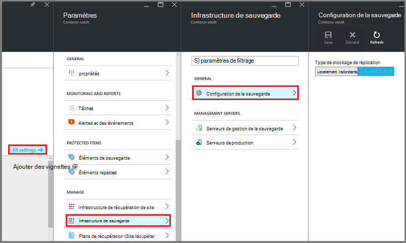

<properties
    pageTitle="Introduction à la sauvegarde DPM Azure | Microsoft Azure"
    description="Présentation de la sauvegarde des serveurs DPM au moyen du service de sauvegarde d’Azure"
    services="backup"
    documentationCenter=""
    authors="Nkolli1"
    manager="shreeshd"
    editor=""
    keywords="System Center Data Protection Manager, Gestionnaire de protection des données, sauvegarde dpm"/>

<tags
    ms.service="backup"
    ms.workload="storage-backup-recovery"
    ms.tgt_pltfrm="na"
    ms.devlang="na"
    ms.topic="article"
    ms.date="08/08/2016"
    ms.author="trinadhk;giridham;jimpark;markgal;adigan"/>

# Préparation sauvegarder les charges de travail sur Azure avec DPM

> [AZURE.SELECTOR]
- [Serveur de sauvegarde Azure](backup-azure-microsoft-azure-backup.md)
- [SCDPM](backup-azure-dpm-introduction.md)
- [Serveur de sauvegarde Azure (classique)](backup-azure-microsoft-azure-backup-classic.md)
- [SCDPM (classique)](backup-azure-dpm-introduction-classic.md)

Cet article fournit une introduction à l’aide de Microsoft Azure sauvegarde pour protéger vos serveurs de System Center Data Protection Manager (DPM) et les charges de travail. En le lisant, vous devez comprendre :

- Fonctionne de sauvegarde du serveur DPM Azure
- Les conditions préalables pour obtenir une meilleure expérience de sauvegarde
- Les erreurs courantes rencontrées et comment traiter les
- Scénarios pris en charge

> [AZURE.NOTE] Azure comporte deux modèles de déploiement pour la création et utilisation des ressources : [Gestionnaire de ressources et classique](../resource-manager-deployment-model.md). Cet article fournit les informations et procédures pour la restauration des machines virtuelles déployées à l’aide du modèle de gestionnaire de ressources.

System Center DPM sauvegarde les données de fichiers et d’applications. Données sauvegardées sur DPM pouvant être stockées sur bande, sur le disque, ou sauvegardées sur Azure avec Microsoft Azure Backup. DPM interagit avec Azure sauvegarde comme suit :

- **DPM déployé comme une machine virtuelle serveur ou local physique** — si DPM est déployé comme un serveur physique ou comme une machine virtuelle de Hyper-V local vous pouvez sauvegarder des données sur un archivage sécurisé de Services de récupération en plus de disque et la bande sauvegarde.
- **DPM déployé comme une machine virtuelle Azure** — à partir de System Center 2012 R2 avec mise à jour 3, DPM peut être déployé comme une machine virtuelle Azure. Si DPM est déployé comme une machine virtuelle Azure, que vous pouvez sauvegarder des données sur disques Azure liés à la machine virtuelle DPM Azure, ou vous pouvez décharger le stockage des données en sauvegardant jusqu'à un archivage sécurisé aux Services de récupération.

## Pourquoi une sauvegarde de DPM vers Azure ?

Les avantages de l’utilisation de sauvegardes Azure pour sauvegarder les serveurs DPM sont les suivantes :

- Pour le déploiement de DPM en local, vous pouvez utiliser Azure place un déploiement à long terme à bandes.
- Pour les déploiements DPM dans Azure, Azure sauvegarde permet de déléguer le stockage à partir du disque Azure, vous permettant d’évoluer en stockant les données plus anciennes dans l’archivage sécurisé des Services de récupération et les nouvelles données sur le disque.

## Conditions préalables
Préparer la sauvegarde Azure pour sauvegarder des données DPM comme suit :

1. **Créer un archivage sécurisé aux Services de récupération** — créer un archivage sécurisé portail Azure.
2. **Informations d’identification de l’archivage sécurisé de téléchargement** : télécharger les informations d’identification qui vous permet d’enregistrer le serveur DPM pour l’archivage sécurisé des Services de récupération.
3. **Installer l’Agent de sauvegarde Azure** — à partir d’Azure sauvegarde, installez l’agent sur chaque serveur DPM.
4. **Enregistrer le serveur** : enregistrer le serveur DPM pour l’archivage sécurisé des Services de récupération.

### 1. créer un archivage sécurisé des services de récupération
Pour créer un archivage sécurisé des services de récupération :

1. Connectez-vous au [portail Azure](https://portal.azure.com/).

2. Dans le menu concentrateur, cliquez sur **Parcourir** , dans la liste des ressources, tapez **Les Services de récupération**. Lorsque vous commencez à taper, la liste filtre selon vos entrées. Cliquez sur **Services de récupération de l’archivage sécurisé**.

    

    La liste des Services de récupération chambres fortes s’affiche.

3. Dans le menu **chambres fortes Services de récupération** , cliquez sur **Ajouter**.

    

    La carte de l’archivage sécurisé aux Services de récupération s’ouvre et vous invite à fournir un **nom**, un **abonnement**, un **groupe de ressources**et un **emplacement**.

    

4. Pour **nom**, entrez un nom convivial pour identifier l’archivage sécurisé. Le nom doit être unique pour l’abonnement Azure. Tapez un nom qui contient entre 2 et 50 caractères. Il doit commencer par une lettre et peut contenir uniquement des lettres, des chiffres et des traits d’union.

5. Cliquez sur l' **abonnement** pour afficher la liste des abonnements disponibles. Si vous n’êtes pas sûr du type d’abonnement à utiliser, utilisez la valeur par défaut (ou suggérées) abonnement. Il sera plusieurs choix uniquement si votre compte professionnel est associé à plusieurs abonnements Azure.

6. Cliquez sur **groupe de ressources** pour afficher la liste des groupes de ressources disponibles, ou cliquez sur **Nouveau** pour créer un nouveau groupe de ressources. Pour plus d’informations sur les groupes de ressources, voir [vue d’ensemble du Gestionnaire de ressources Azure](../azure-resource-manager/resource-group-overview.md)

7. Cliquez sur l' **emplacement** pour sélectionner la zone géographique pour l’archivage sécurisé.

8. Cliquez sur **créer**. Il peut prendre un certain temps pour l’archivage sécurisé de Services de récupération à créer. Surveiller les notifications d’état dans l’angle supérieur droit dans le portail.
Une fois votre l’archivage sécurisé est créé, il s’ouvre dans le portail.

### Définir la réplication du stockage

L’option de réplication de stockage vous permet de choisir entre geo redondants et stockage localement redondant. Par défaut, votre l’archivage sécurisé comprend un stockage geo redondants. Laissez l’option définie sur stockage geo redondants s’il s’agit de votre sauvegarde principal. Choisissez le stockage localement redondant si vous souhaitez une option plus économique n’est pas tout à fait comme résistant. En savoir plus sur [geo redondants](../storage/storage-redundancy.md#geo-redundant-storage) et options de stockage [localement redondantes](../storage/storage-redundancy.md#locally-redundant-storage) dans [vue d’ensemble de la réplication de stockage Azure](../storage/storage-redundancy.md).

Pour modifier le paramètre de réplication de stockage :

1. Sélectionnez votre l’archivage sécurisé pour ouvrir le tableau de bord de l’archivage sécurisé et la carte de paramètres. Si la carte de **paramètres** ne s’ouvre, cliquez sur **tous les paramètres** dans le tableau de bord de l’archivage sécurisé.

2. Dans la carte de **paramètres** , cliquez sur **Sauvegarde Infrastructure** > **Backup Configuration** pour ouvrir la carte de **Configuration de sauvegarde** . Dans la carte de **Configuration de sauvegarde** , sélectionnez l’option de réplication de stockage pour votre l’archivage sécurisé.

    

    Après avoir choisi l’option de stockage pour votre l’archivage sécurisé, vous êtes prêt à associer la machine virtuelle l’archivage sécurisé. Pour commencer l’association, vous devez découvrir et enregistrer les machines virtuelles Azure.

### 2. télécharger des informations d’identification de l’archivage sécurisé

Le fichier d’informations d’identification de l’archivage sécurisé est un certificat généré par le portail pour chaque l’archivage sécurisé sauvegarde. Le portail télécharge puis la clé publique à Access Control Service (ACS). La clé privée du certificat est rendue disponible à l’utilisateur dans le cadre du flux de travail qui est indiquée comme une entrée dans le flux de travail de l’enregistrement automatique. Cela authentifie l’ordinateur pour envoyer des données de sauvegarde à un archivage sécurisé identifié dans le service de sauvegarde Azure.

Les informations d’identification de l’archivage sécurisé sont utilisée uniquement pendant le flux de travail d’inscription. Il est responsable de l’utilisateur pour vous assurer que le fichier d’informations d’identification de l’archivage sécurisé n’est pas compromis. S’il se trouve dans les mains d’un utilisateur non fiables, le fichier d’informations d’identification de l’archivage sécurisé peut servir à enregistrer des autres ordinateurs contre l’archivage sécurisé même. Toutefois, comme les données de sauvegarde sont chiffrées à l’aide d’un mot de passe qui appartient au client, données de sauvegarde existantes ne peuvent pas être compromises. Pour atténuer ce problème, les informations d’identification de l’archivage sécurisé sont configurées pour expirer dans 48hrs. Vous pouvez télécharger les informations d’identification de l’archivage sécurisé de services de récupération n’importe quel nombre de fois – mais seulement le fichier de d’informations d’identification de l’archivage sécurisé plus récent est applicable pendant le flux de travail d’inscription.

Le fichier d’informations d’identification de l’archivage sécurisé est téléchargé via un canal sécurisé à partir du portail Azure. Le service de sauvegarde Azure n’a pas connaissance de la clé privée du certificat et la clé privée n’est pas conservée dans le portail ou le service. Suivez les étapes suivantes pour télécharger le fichier d’informations d’identification de l’archivage sécurisé sur un ordinateur local.

1. Connectez-vous au [portail Azure](https://portal.azure.com/).

2. Ouvrir l’archivage sécurisé de Services de récupération auquel à laquelle vous souhaitez enregistrer DPM de l’ordinateur.

3. Carte de paramètres s’ouvre par défaut. Si elle est fermée, cliquez sur **paramètres** dans le tableau de bord de l’archivage sécurisé pour ouvrir la carte de paramètres. Dans la carte de paramètres, cliquez sur **Propriétés**.

    

4. Dans la page de propriétés, cliquez sur **Télécharger** sous **Informations d’identification de sauvegarde**. Le portail génère le fichier d’informations d’identification de l’archivage sécurisé, qui sera disponible au téléchargement.

    

Le portail génère une information d’identification de l’archivage sécurisé à l’aide d’une combinaison du nom de l’archivage sécurisé et la date du jour. Cliquez sur **Enregistrer** pour télécharger les informations d’identification de l’archivage sécurisé au dossier des téléchargements du compte local, ou sélectionnez Enregistrer sous dans le menu Enregistrer pour spécifier un emplacement pour les informations d’identification de l’archivage sécurisé. Il faudra vers le haut et une minute pour le fichier à générer.

### Remarque
- Vérifiez que le fichier d’informations d’identification de l’archivage sécurisé est enregistré dans un emplacement accessible à partir de votre ordinateur. S’il est stocké dans un partage de fichier/PME, recherchez les autorisations d’accès.
- Le fichier d’informations d’identification de l’archivage sécurisé est utilisé uniquement pendant le flux de travail d’inscription.
- Le fichier d’informations d’identification de l’archivage sécurisé expire après 48hrs et peut être téléchargé à partir du portail.

### 3. Installez l’Agent de sauvegarde

Après avoir créé l’archivage sécurisé sauvegarde Azure, un agent doit être installé sur chacun de vos ordinateurs Windows (Windows Server, client Windows, System Center Data Protection Manager server ou machine Azure sauvegarde serveur) qui permet de sauvegarder des données et applications vers Azure.

1. Ouvrir l’archivage sécurisé de Services de récupération auquel à laquelle vous souhaitez enregistrer DPM de l’ordinateur.

2. Carte de paramètres s’ouvre par défaut. Si elle est fermée, cliquez sur **paramètres** pour ouvrir la carte de paramètres. Dans la carte de paramètres, cliquez sur **Propriétés**.

    

3. Dans la page Paramètres, cliquez sur **Télécharger** sous **Agent de sauvegarde Azure**.

    

   Une fois que l’agent est téléchargé, double-cliquez sur MARSAgentInstaller.exe pour lancer l’installation de l’agent de sauvegarde Azure. Choisissez le dossier d’installation et un dossier de travail requise pour l’agent. L’emplacement du cache spécifié comporter qu’un espace, ce qui correspond au moins 5 % des données de sauvegarde.

4.  Si vous utilisez un serveur proxy pour vous connecter à internet, dans l’écran de **configuration du serveur Proxy** , entrez les détails du serveur proxy. Si vous utilisez un proxy authentifié, entrez les informations de nom et mot de passe utilisateur dans cet écran.

5.  L’agent de sauvegarde Azure installe .NET Framework 4.5 et Windows PowerShell (si elle n’est pas disponible déjà) pour terminer l’installation.

6.  Une fois que l’agent est installé, **Fermer** la fenêtre.

    

7. Pour **Enregistrer le serveur DPM** à l’archivage sécurisé, dans l’onglet **gestion** , cliquez sur **en ligne**. Ensuite, sélectionnez **Enregistrer**. L’Assistant Configuration inscrire s’ouvre.

8. Si vous utilisez un serveur proxy pour vous connecter à internet, dans l’écran de **configuration du serveur Proxy** , entrez les détails du serveur proxy. Si vous utilisez un proxy authentifié, entrez les informations de nom et mot de passe utilisateur dans cet écran.

    

9. Dans l’écran d’informations d’identification de l’archivage sécurisé, recherchez et sélectionnez le fichier d’informations d’identification de l’archivage sécurisé qui a été précédemment téléchargé.

    

    Le fichier d’informations d’identification de l’archivage sécurisé est valide uniquement pour 48 heures (après son téléchargement à partir du portail). Si vous rencontrez l’erreur de cet écran (par exemple, « l’archivage sécurisé informations d’identification fichier fourni a expiré »), connectez-vous au portail Azure et le téléchargement de fichiers à nouveau les informations d’identification de l’archivage sécurisé.

    Vérifiez que le fichier d’informations d’identification de l’archivage sécurisé est disponible dans un emplacement accessible par l’application de configuration. Si vous rencontrez des erreurs connexes d’accès, copiez le fichier d’informations d’identification de l’archivage sécurisé vers un emplacement temporaire sur cet ordinateur et recommencez l’opération.

    Si vous rencontrez une erreur d’informations d’identification non valides de l’archivage sécurisé (par exemple, « l’archivage sécurisé non valide les informations d’identification fournies ») le fichier est endommagé ou les dernières informations d’identification avec le service de récupération de quoi avez-vous pas associé. Recommencez l’opération après avoir téléchargé un nouveau fichier d’informations d’identification de l’archivage sécurisé à partir du portail. Cette erreur se produite généralement si l’utilisateur clique sur l’option de **télécharger les informations d’identification de l’archivage sécurisé** dans le portail Azure, rapidement. Dans ce cas, seul le deuxième fichier de d’informations d’identification de l’archivage sécurisé est valide.

10. Pour contrôler l’utilisation de la bande passante réseau au cours de travail et des heures non liés au travail, dans l’écran de **La limitation de paramètre** , vous pouvez définir les limites de l’utilisation de la bande passante et définir le travail et non liés au travail heures.

    

11. Dans l’écran **Paramètre du dossier de restauration** , recherchez le dossier où les fichiers téléchargés à partir d’Azure aura lieu temporairement.

    

12. Dans l’écran **paramètres de chiffrement** , vous pouvez générer un mot de passe ou fournir un mot de passe (minimum de 16 caractères). N’oubliez pas d’enregistrer le mot de passe dans un emplacement sécurisé.

    

    > [AZURE.WARNING] Si le mot de passe est perdu ou oublié ; Microsoft ne peut pas vous aider à récupérer les données de sauvegarde. L’utilisateur final possède le mot de passe de chiffrement et Microsoft n’a pas de visibilité sur le mot de passe utilisé par l’utilisateur final. Enregistrez le fichier dans un emplacement sécurisé qu’il est nécessaire au cours d’une opération de récupération.

13. Une fois que vous cliquez sur le bouton **Enregistrer** , l’ordinateur a été enregistré à l’archivage sécurisé et vous êtes maintenant prêt à démarrer la sauvegarde sur Microsoft Azure.

14. Lorsque vous utilisez Data Protection Manager, vous pouvez modifier les paramètres spécifiés pendant le flux de travail d’inscription en cliquant sur l’option **configurer** en sélectionnant **Online** sous l’onglet **gestion** .

## Configuration requise (et limitations)

- DPM peut fonctionner comme un serveur physique ou une machine virtuelle Hyper-V installé sur System Center 2012 SP1 ou System Center 2012 R2. Il peut également s’exécuter en tant qu’une machine virtuelle Azure s’exécutant sur System Center 2012 R2 au moins DPM 2012 R2 mise à jour cumulative 3 ou une machine virtuelle Windows dans VMWare exécuté sur System Center 2012 R2 au moins 5 report de mise à jour.
- Si vous exécutez DPM avec System Center 2012 SP1 vous devez installer opérationnelle mise à jour 2 pour System Center Data Protection Manager SP1. Cela est nécessaire avant d’installer l’Agent de sauvegarde Azure.
- Le serveur DPM doit comporter Windows PowerShell et .net Framework 4.5 installé.
- DPM peut en sauvegarder la plupart des charges de travail de sauvegarde Azure. Pour une liste complète des a pris en charge de voir la sauvegarde Azure prend en charge les éléments ci-dessous.
- Données stockées dans Azure sauvegarde ne peuvent pas être récupérées avec l’option « Copier sur bande ».
- Vous devez posséder un compte Azure avec la fonction de sauvegarde Azure activée. Si vous n’avez pas un compte, vous pouvez créer un compte d’évaluation gratuit en quelques minutes. En savoir plus sur [sauvegarde Azure tarifs](https://azure.microsoft.com/pricing/details/backup/).
- L’utilisation de sauvegardes Azure nécessite l’Agent de sauvegarde Azure soit installé sur les serveurs que vous souhaitez sauvegarder. Chaque serveur doit avoir au moins 5 % de la taille des données qui sont sauvegardées, disponible en tant qu’espace de stockage gratuit local. Par exemple, la sauvegarde de 100 Go de données requiert un minimum de 5 Go d’espace libre dans l’emplacement de travail.
- Données seront stockées dans le stockage de l’archivage sécurisé Azure. Il n’existe aucune limite à la quantité de données, que vous pouvez revenir à une sauvegarde Azure vault mais la taille d’une source de données (par exemple une machine virtuelle ou une base de données) ne doivent pas dépasser 54400 go.

Types de fichiers suivants sont pris en charge pour sauvegarder vos fichiers Azure :

- Chiffré (sauvegardes complètes uniquement)
- Compressé (incrémentielles pris en charge)
- Diminuer (incrémentielles pris en charge)
- Comprimée et incomplets (considérées comme diminuer)

Et Voici non prises en charge :

- Serveurs sur les systèmes de fichiers respectant la casse ne sont pas pris en charge.
- Liens en dur (ignoré)
- Points (ignoré) d’analyse
- Chiffrés et compressé (ignoré)
- Chiffré et incomplets (ignorée)
- Flux compressé
- Flux incomplet

>[AZURE.NOTE] À partir de System Center 2012 DPM avec SP1, vous pouvez sauvegarder les charges de travail protégés par DPM vers Azure à l’aide de Microsoft Azure sauvegarde.
