<properties
    pageTitle="Gérer et analyser des sauvegardes Azure machine virtuelle | Microsoft Azure"
    description="Apprenez à gérer et analyser un sauvegardes Azure machine virtuelle"
    services="backup"
    documentationCenter=""
    authors="trinadhk"
    manager="shreeshd"
    editor=""/>

<tags
    ms.service="backup"
    ms.workload="storage-backup-recovery"
    ms.tgt_pltfrm="na"
    ms.devlang="na"
    ms.topic="article"
    ms.date="08/31/2016"
    ms.author="trinadhk; jimpark; markgal;"/>

# <a name="manage-and-monitor-azure-virtual-machine-backups"></a>Gérer et analyser des sauvegardes Azure machine virtuelle

> [AZURE.SELECTOR]
- [Gérer les sauvegardes machine virtuelle Azure](backup-azure-manage-vms.md)
- [Gérer les sauvegardes machine virtuelle classique](backup-azure-manage-vms-classic.md)

Cet article fournit des informations sur la gestion courantes et des tâches d’analyse pour les machines virtuelles modèle classique protégés dans Azure.  

>[AZURE.NOTE] Azure comporte deux modèles de déploiement pour la création et utilisation des ressources : [Gestionnaire de ressources et classique](../resource-manager-deployment-model.md). Pour plus d’informations sur l’utilisation de modèle de déploiement classique machines virtuelles, consultez la section [préparer votre environnement pour sauvegarder des machines virtuelles Azure](backup-azure-vms-prepare.md) .

## <a name="manage-protected-virtual-machines"></a>Gérer des machines virtuelles protégées

Pour gérer des machines virtuelles protégés :

1. Pour afficher et gérer les paramètres de sauvegarde pour une machine virtuelle, cliquez sur l’onglet **Éléments protégé** .

2. Cliquez sur le nom d’un élément protégé pour afficher l’onglet **Détails de la sauvegarde** , ce qui donne des informations sur la dernière sauvegarde.

    

3. Pour afficher et gérer les stratégies de sauvegarde paramètres pour une machine virtuelle, cliquez sur l’onglet **stratégies** .

    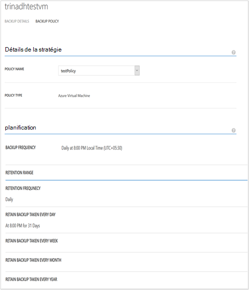

    L’onglet **Stratégies de sauvegarde** vous montre la stratégie existante. Vous pouvez modifier selon vos besoins. Si vous avez besoin créer une nouvelle stratégie cliquez sur **créer** dans la page **stratégies** . Notez que toutes les machines virtuelles associés ne doit pas avoir Si vous souhaitez supprimer une stratégie.

    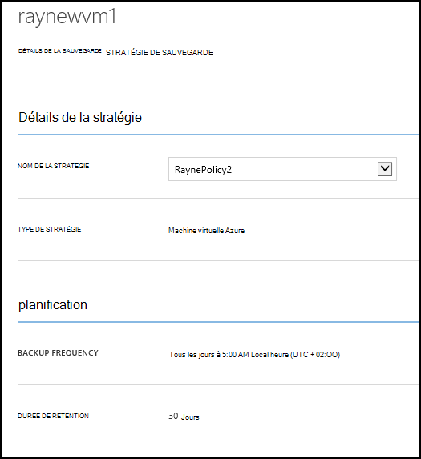

4. Vous pouvez obtenir plus d’informations sur les actions ou état pour une machine virtuelle dans la page **tâches** . Cliquez sur une tâche dans la liste pour obtenir plus d’informations, ou filtrer les tâches pour une machine virtuelle spécifique.

    

## <a name="on-demand-backup-of-a-virtual-machine"></a>Sauvegarde à la demande d’une machine virtuelle
Vous pouvez prendre une demande de sauvegarde d’une machine virtuelle une fois qu’il est configuré pour la protection. Si la sauvegarde initiale est en attente pour la machine virtuelle, à la demande sauvegarde crée une copie complète de la machine virtuelle dans l’archivage sécurisé sauvegarde Azure. Si première sauvegarde est terminée, à la demande sauvegarde s’uniquement envoyer des modifications à partir d’une sauvegarde précédente sauvegarde Azure vault c'est-à-dire qu’il est toujours incrémentiel.

>[AZURE.NOTE] Durée de rétention d’une sauvegarde à la demande est définie sur la valeur de rétention spécifiée pour la rétention quotidienne dans la stratégie de sauvegarde correspondant à la machine virtuelle.  

Pour prendre une demande de sauvegarde d’une machine virtuelle :

1. Accédez à la page **Éléments protégés** et sélectionnez **Machine virtuelle Azure** en tant que **Type** (le cas échéant), cliquez sur bouton **Sélectionner** .

    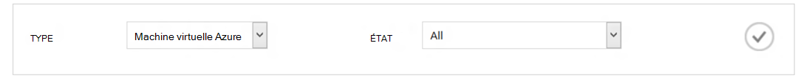

2. Sélectionnez la machine virtuelle sur lequel vous voulez prendre une demande de sauvegarde, puis cliquez sur **Sauvegarder maintenant** dans la partie inférieure de la page.

    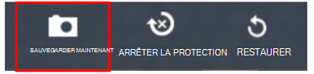

    Cela créera un travail de sauvegarde sur l’ordinateur virtuel sélectionné. Durée de rétention de point de récupération créé par le biais cette tâche sera même que celui spécifié dans la stratégie associée à la machine virtuelle.

    

    >[AZURE.NOTE] Pour afficher la stratégie associée à une machine virtuelle, Explorer les machine virtuelle dans la page **Éléments protégés** et accédez à l’onglet Stratégie de sauvegarde.

3. Une fois que le travail est créé, vous pouvez cliquer sur le bouton **Afficher la tâche** dans la barre toast pour afficher la tâche correspondante dans la page tâches.

    

4. Après la réussite de la tâche, un point de récupération est créé que vous pouvez utiliser pour restaurer la machine virtuelle. Ceci incrémente également la valeur de colonne de point de récupération par 1 dans la page **Éléments protégés** .

## <a name="stop-protecting-virtual-machines"></a>Arrêter la protection de machines virtuelles
Vous pouvez choisir d’arrêter les sauvegardes futures d’une machine virtuelle avec les options suivantes :

- Conserver les données de sauvegarde associées machine virtuelle dans l’archivage sécurisé sauvegarde Azure
- Supprimer les données de sauvegarde associées machine virtuelle

Si vous avez sélectionné pour conserver les données de sauvegarde associées machine virtuelle, vous pouvez utiliser les données de sauvegarde à restaurer la machine virtuelle. Pour connaître les prix pour ces machines virtuelles, cliquez [ici](https://azure.microsoft.com/pricing/details/backup/).

Arrêter la protection pour une machine virtuelle :

1. Accéder aux **Éléments protégés par** page et sélectionnez **Azure machine virtuelle** comme type de filtre (le cas échéant) et cliquez sur le bouton **Sélectionner** .

    

2. Sélectionnez la machine virtuelle et cliquez sur **Désactiver la Protection** en bas de la page.

    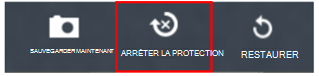

3. Par défaut, Azure sauvegarde ne supprime pas les données de sauvegarde associées à la machine virtuelle.

    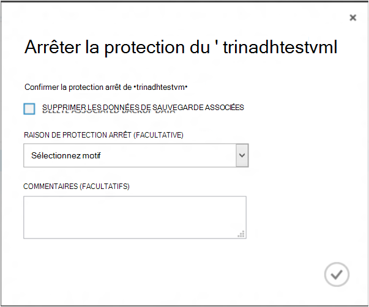

    Si vous souhaitez supprimer les données de sauvegarde, activez la case à cocher.

    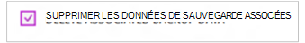

    Sélectionnez un motif de l’arrêt de la sauvegarde. Cette étape est facultative, fournir une raison permettent de sauvegarde Azure pour travailler sur les commentaires et de classer par priorité les scénarios client.

4. Cliquez sur le bouton **Envoyer** pour envoyer la tâche **Arrêter la protection** . Cliquez sur **Afficher la tâche** pour afficher la tâche dans la page **tâches** correspondantes.

    

    Si vous n’avez pas sélectionné option **Supprimer les données de sauvegarde associées** pendant l’Assistant de **Désactiver la Protection** , puis achèvement du projet billet, l’état de protection passe à **La Protection d’arrêt**. Les données sont conservées avec Azure sauvegarde jusqu'à sa suppression explicitement. Vous pouvez toujours supprimer les données en sélectionnant la machine virtuelle dans la page **Éléments protégés** et en cliquant sur **Supprimer**.

    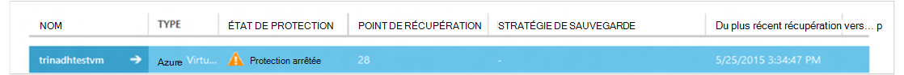

    Si vous avez sélectionné l’option **Supprimer les données de sauvegarde associées** , la machine virtuelle ne seront partie de la page **Éléments protégé** .

## <a name="re-protect-virtual-machine"></a>Protéger de nouveau machine virtuelle
Si vous n’avez pas sélectionné l’option **Supprimer les données de sauvegarde associer** de **Désactiver la Protection**, vous pouvez protéger de nouveau la machine virtuelle en suivant les étapes similaires pour la sauvegarde des machines virtuelles enregistrées. Une fois que protégé, cette machine virtuelle aura conservées avant d’arrêter la protection de données de sauvegarde et de points de récupération créées après protéger de nouveau.

Après avoir protéger de nouveau, l’état de protection de la machine virtuelle deviendra **protégé** s’il existe des points de récupération avant de **Désactiver la Protection**.

  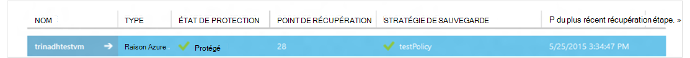

>[AZURE.NOTE] Lorsque vous ré-Protégez la machine virtuelle, vous pouvez choisir une stratégie différente de la stratégie avec laquelle machine virtuelle a été protégé initiale.

## <a name="unregister-virtual-machines"></a>Annuler l’enregistrement des machines virtuelles

Si vous voulez supprimer la machine virtuelle de l’archivage sécurisé sauvegarde :

1. Cliquez sur le bouton **Annuler l’enregistrement** dans la partie inférieure de la page.

    

    Une notification toast s’affiche en bas de l’écran de demande de confirmation. Cliquez sur **Oui** pour continuer.

    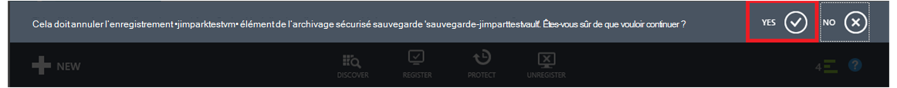

## <a name="delete-backup-data"></a>Supprimer des données de sauvegarde
Vous pouvez supprimer les données de sauvegarde associées à une machine virtuelle, soit :

- Au cours d’une tâche de Protection arrêter
- Après une protection arrêter le travail est effectué sur une machine virtuelle

Pour supprimer les données de sauvegarde sur un ordinateur virtuel, qui se trouve dans l’état de *La Protection d’arrêt* publient la réussite d’un travail de **Sauvegarde arrêter** :

1. Accédez à la page **Éléments protégés** et sélectionnez **Machine virtuelle Azure** en tant que *type* cliquez sur le bouton **Sélectionner** .

    

2. Sélectionnez la machine virtuelle. La machine virtuelle est à l’état de **La Protection d’arrêt** .

    

3. Cliquez sur le bouton **Supprimer** en bas de la page.

    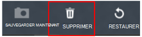

4. Dans l’Assistant de **Supprimer les données de sauvegarde** , sélectionnez un motif pour la suppression des données de sauvegarde (vivement recommandées) et cliquez sur **Envoyer**.

    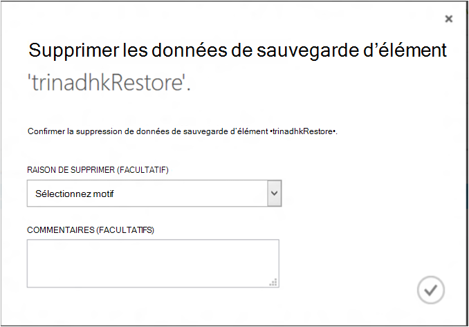

5. Cela créera un travail pour supprimer les données de sauvegarde de machine virtuelle sélectionnée. Cliquez sur **Afficher la tâche** pour afficher la tâche correspondante dans la page tâches.

    

    Une fois que la tâche est terminée, l’entrée correspondant à la machine virtuelle a été supprimée de la page **d’éléments protégé** .

## <a name="dashboard"></a>Tableau de bord
Dans la page **tableau de bord** que vous puissiez consulter d’informations Azure machines virtuelles, leur stockage et les tâches qui leur sont associées dans les dernières 24 heures. Vous pouvez afficher le statut de la sauvegarde ainsi que les erreurs de sauvegarde associés.

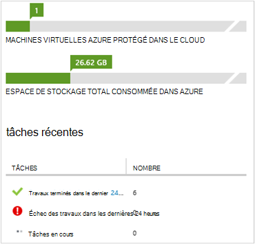

>[AZURE.NOTE] Les valeurs dans le tableau de bord sont actualisées toutes les 24 heures.

## <a name="auditing-operations"></a>Opérations d’audit
Sauvegarde Azure assure la révision des « opération journaux » des opérations de sauvegarde déclenchés par le client, ce qui facilite la voir exactement quelles sont les opérations gestion ont été effectuées sur l’archivage sécurisé sauvegarde. Les journaux d’opérations activer rédaction post-mortem et d’audit prise en charge pour les opérations de sauvegarde.

Les opérations suivantes sont enregistrées dans les journaux d’opération :

- S’inscrire
- Annuler l’enregistrement
- Configurer la protection
- Sauvegarde (les deux planifiées ainsi que la sauvegarde à la demande via BackupNow)
- Restaurer
- Arrêter la protection
- Supprimer les données de sauvegarde
- Ajouter une stratégie
- Supprimer la stratégie
- Stratégie de mise à jour
- Annuler le travail

Pour afficher les journaux d’opération correspondant à un archivage sécurisé sauvegarde :

1. Accéder aux **services de gestion** portail Azure, puis cliquez sur l’onglet **Journaux opération** .

    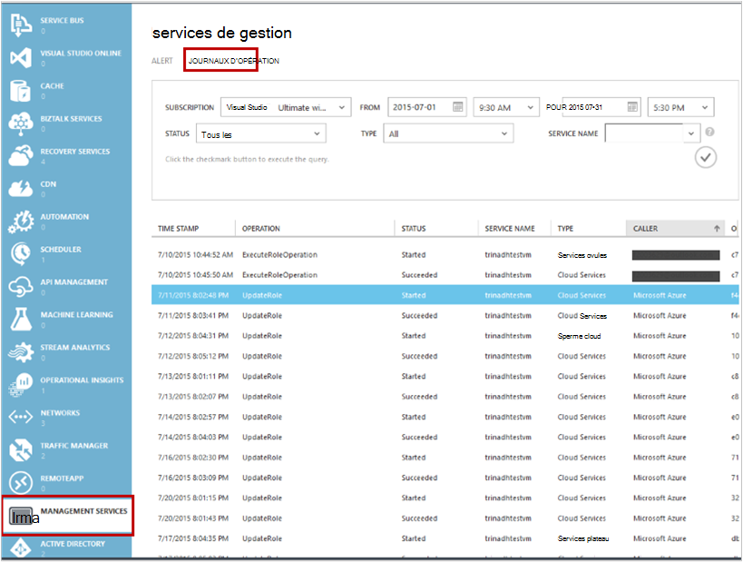

2. Dans les filtres, sélectionnez **la sauvegarde** en tant que *Type* et indiquez le nom de l’archivage sécurisé sauvegarde dans la zone *nom de service* et cliquez sur **Envoyer**.

    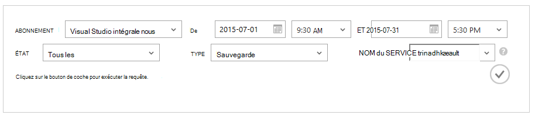

3. Dans les journaux d’opérations, sélectionnez n’importe quelle opération, puis cliquez sur **Détails** pour afficher des détails correspondant à une opération.

    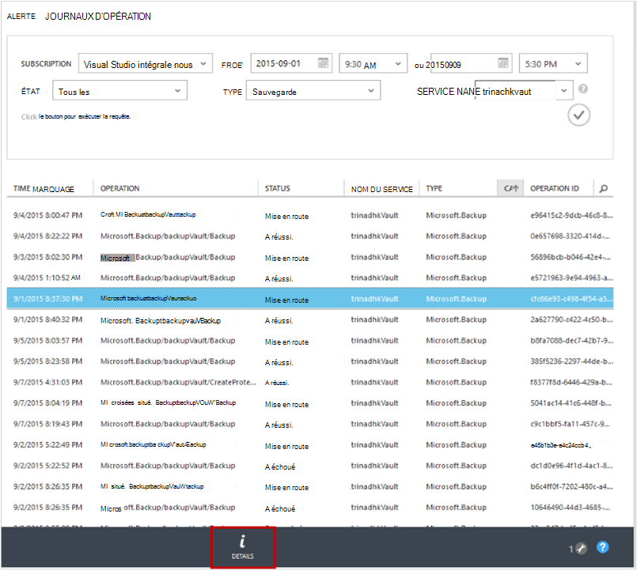

    L' **Assistant détails** contient des informations sur l’opération déclenchée, travail Id, ressources sur lequel cette opération est déclenchée et heure de début de l’opération.

    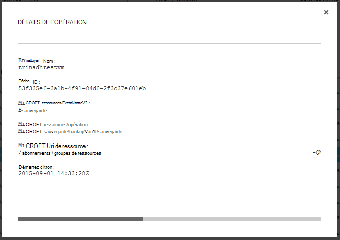

## <a name="alert-notifications"></a>Notifications d’alerte
Vous pouvez obtenir des notifications d’alerte personnalisées pour les tâches dans le portail. Pour ce faire, en définissant des règles d’alerte PowerShell d’événements opérationnels. Nous vous recommandons d’utiliser *PowerShell version version 1.3.0 ou une version ultérieure*.

Pour définir une notification personnalisée pour alerter les échecs de sauvegarde, un exemple de commande se présente comme :

```
PS C:\> $actionEmail = New-AzureRmAlertRuleEmail -CustomEmail contoso@microsoft.com
PS C:\> Add-AzureRmLogAlertRule -Name backupFailedAlert -Location "East US" -ResourceGroup RecoveryServices-DP2RCXUGWS3MLJF4LKPI3A3OMJ2DI4SRJK6HIJH22HFIHZVVELRQ-East-US -OperationName Microsoft.Backup/backupVault/Backup -Status Failed -TargetResourceId /subscriptions/86eeac34-eth9a-4de3-84db-7a27d121967e/resourceGroups/RecoveryServices-DP2RCXUGWS3MLJF4LKPI3A3OMJ2DI4SRJK6HIJH22HFIHZVVELRQ-East-US/providers/microsoft.backupbvtd2/BackupVault/trinadhVault -Actions $actionEmail
```

**ResourceId**: vous pouvez obtenir ceci à partir de la fenêtre contextuelle journaux des opérations comme ci-dessus dans la section. ResourceURI des services Web dans la fenêtre contextuelle de détails d’une opération sont le ResourceId à fournir pour cette applet de commande.

**NomOpération**: il s’agit du format « Microsoft.Backup/backupvault/<EventName>« EventName étant Registre, Unregister, ConfigureProtection, sauvegarder, restaurer, StopProtection, DeleteBackupData, CreateProtectionPolicy, DeleteProtectionPolicy, UpdateProtectionPolicy

**État**: prise en charge des valeurs sont-mise en route, a réussi, a échoué.

**ResourceGroup**: ResourceGroup de la ressource à laquelle opération se déclenche. Vous pouvez obtenir ceci à partir de la valeur ResourceId. Valeur comprise entre les champs */resourceGroups/* et */providers/* dans valeur ResourceId est la valeur pour ResourceGroup.

**Nom**: nom de la règle d’alerte.

**CustomEmail**: spécifier l’adresse de messagerie personnalisé auquel vous souhaitez envoyer une notification d’alerte

**SendToServiceOwners**: cette option envoie une notification alerte à tous les administrateurs et coadministrateurs de l’abonnement. Il peut être utilisé dans l’applet de commande **New-AzureRmAlertRuleEmail**

### <a name="limitations-on-alerts"></a>Limitations des alertes
Alertes basées sur les événements sont soumis aux limitations suivantes :

1. Des alertes sont déclenchées sur toutes les machines virtuelles dans l’archivage sécurisé sauvegarde. Vous ne pouvez pas personnaliser pour recevoir des alertes pour un ensemble spécifique de machines virtuelles dans un archivage sécurisé sauvegarde.
2. Cette fonctionnalité est en mode Aperçu. [Pour en savoir plus](../monitoring-and-diagnostics/insights-powershell-samples.md#create-alert-rules)
3. Vous recevrez des alertes à partir de "alerts-noreply@mail.windowsazure.com". Actuellement, vous ne pouvez pas modifier l’expéditeur de courrier électronique.

## <a name="next-steps"></a>Étapes suivantes

- [Restaurer des machines virtuelles Azure](backup-azure-restore-vms.md)
