<properties
    pageTitle="Gérer les sauvegardes déployé le Gestionnaire de ressources des machines virtuelles | Microsoft Azure"
    description="Apprenez à gérer et analyser des sauvegardes déployé le Gestionnaire de ressources des machine virtuelle"
    services="backup"
    documentationCenter=""
    authors="trinadhk"
    manager="shreeshd"
    editor=""/>

<tags
    ms.service="backup"
    ms.workload="storage-backup-recovery"
    ms.tgt_pltfrm="na"
    ms.devlang="na"
    ms.topic="article"
    ms.date="08/11/2016"
    ms.author="jimpark; markgal; trinadhk"/>

# Gérer les sauvegardes Azure machine virtuelle

> [AZURE.SELECTOR]
- [Gérer les sauvegardes machine virtuelle Azure](backup-azure-manage-vms.md)
- [Gérer les sauvegardes machine virtuelle classique](backup-azure-manage-vms-classic.md)

Cet article fournit des conseils sur la gestion des sauvegardes de machines virtuelles et explique les informations d’alertes de sauvegarde disponibles dans le tableau de bord du portail. Les instructions de cet article s’applique à l’utilisation de machines virtuelles avec les Services de récupération chambres fortes. Cet article n’aborde pas la création de machines virtuelles, ni il explique comment protéger les machines virtuelles. Pour notions fondamentales sur la protection des machines virtuelles déployé Azure le Gestionnaire de ressources dans Azure avec un archivage sécurisé aux Services de récupération, voir [tout d’abord rechercher : sauvegarder des machines virtuelles à un archivage sécurisé aux Services de récupération](backup-azure-vms-first-look-arm.md).

## Gérer les chambres fortes et machines virtuelles protégées

Dans le portail Azure, le tableau de bord de l’archivage sécurisé de Services de récupération fournit un accès aux informations sur l’archivage sécurisé, y compris :

- instantané la sauvegarde le plus récent, qui est également le dernier point de restauration < br\>
- la stratégie de sauvegarde < br\>
- taille de tous les instantanés sauvegarde totale < br\>
- nombre de machines virtuelles qui sont protégés par l’archivage sécurisé < br\>

De nombreuses tâches de gestion avec une sauvegarde des machines virtuelles commencent à l’ouverture de l’archivage sécurisé dans le tableau de bord. Toutefois, étant donné que chambres fortes peuvent être utilisées pour protéger plusieurs éléments (ou plusieurs ordinateurs virtuels) pour afficher des détails sur un ordinateur virtuel particulier, ouvrez le tableau de bord élément l’archivage sécurisé. La procédure suivante vous montre comment ouvrir le *tableau de bord de l’archivage sécurisé* et puis continuer au *tableau de bord élément l’archivage sécurisé*. Il existe « conseils » dans les deux procédures qui désignent comment ajouter l’archivage sécurisé et vault élément au tableau de bord Azure en utilisant le code confidentiel pour commande tableau de bord. Code confidentiel au tableau de bord est un moyen de créer un raccourci vers l’élément ou de l’archivage sécurisé. Vous pouvez également exécuter des commandes courantes à partir du raccourci.

>[AZURE.TIP] Si vous avez plusieurs tableaux de bord et ouvrir des cartes, utilisez le curseur bleu foncé et en bas de la fenêtre des diapositives et reculer le tableau de bord Azure.

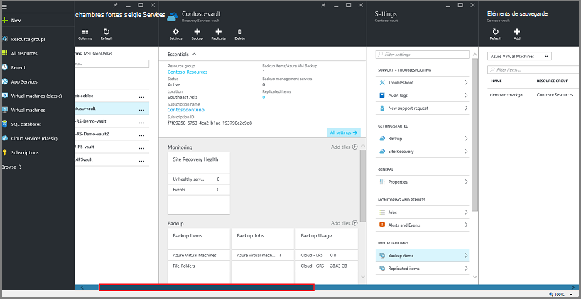

### Ouvrir un archivage sécurisé aux Services de récupération dans le tableau de bord :

1. Connectez-vous au [portail Azure](https://portal.azure.com/).

2. Dans le menu concentrateur, cliquez sur **Parcourir** , dans la liste des ressources, tapez **Les Services de récupération**. Lorsque vous commencez à taper, les filtres de liste en fonction de vos entrées. Cliquez sur **Services de récupération de l’archivage sécurisé**.

    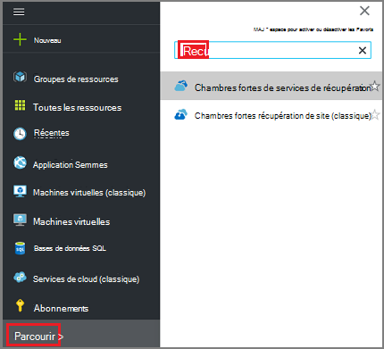  

    La liste des Services de récupération de chambres fortes sont affichées.

    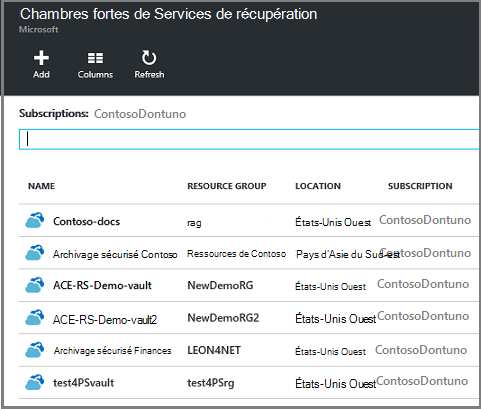  

    >[AZURE.TIP] Si vous épinglez un archivage sécurisé au tableau de bord Azure, que l’archivage sécurisé est accessible immédiatement lorsque vous ouvrez le portail Azure. Pour épingler une archivage sécurisé au tableau de bord, dans la liste de l’archivage sécurisé, avec le bouton droit de l’archivage sécurisé, puis sélectionnez **Ajouter au tableau de bord**.

3. Dans la liste des chambres fortes, sélectionnez l’archivage sécurisé pour ouvrir sa du tableau de bord. Lorsque vous sélectionnez l’archivage sécurisé, le tableau de bord de l’archivage sécurisé et la carte de **paramètres** ouvrent. Dans l’image suivante, le tableau de bord de **l’archivage sécurisé Contoso** est mis en surbrillance.

    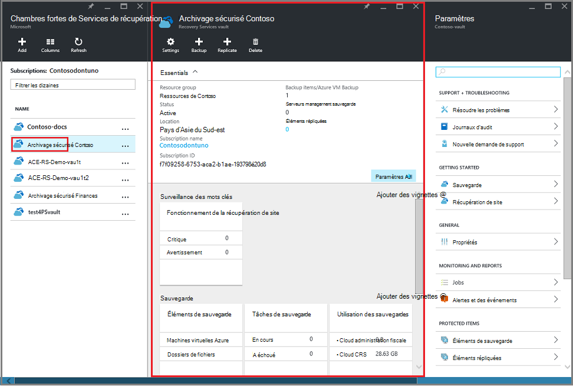

### Ouvrir un tableau de bord élément l’archivage sécurisé

Dans la procédure précédente, vous avez ouvert le tableau de bord de l’archivage sécurisé. Pour ouvrir le tableau de bord l’archivage sécurisé élément :

1. Dans le tableau de bord de l’archivage sécurisé, sur la vignette **Éléments de sauvegarde** , cliquez sur **Machines virtuelles Azure**.

    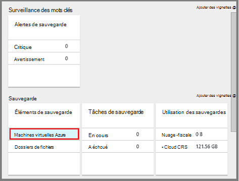

    La carte de **Sauvegarde éléments** répertorie le dernier travail de sauvegarde pour chaque élément. Dans cet exemple, il est une machine virtuelle, demovm-markgal, protégée par cette archivage sécurisé.  

    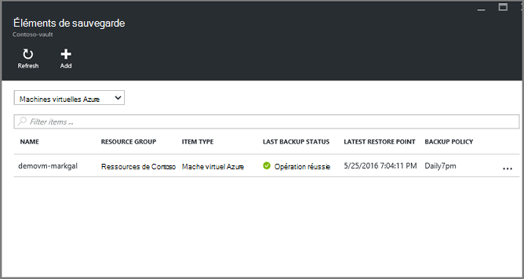

    >[AZURE.TIP] Pour faciliter l’accès, vous pouvez épingler un élément de l’archivage sécurisé au tableau de bord Azure. Pour épingler un élément de l’archivage sécurisé, dans la liste d’éléments de l’archivage sécurisé, avec le bouton droit de l’élément et sélectionnez **Ajouter au tableau de bord**.

2. Dans la carte de **Sauvegarde des éléments** , cliquez sur l’élément pour ouvrir le tableau de bord élément l’archivage sécurisé.

    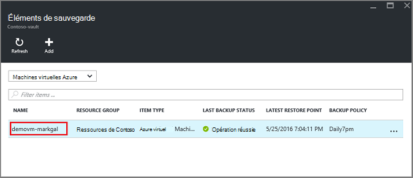

    Le tableau de bord élément l’archivage sécurisé et sa carte de **paramètres** ouvert.

    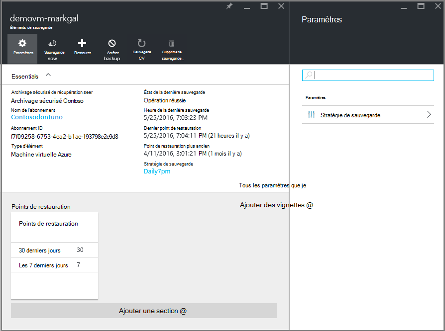

    À partir du tableau de bord d’élément de l’archivage sécurisé, vous pouvez effectuer plusieurs tâches de gestion de clés, tels que :

    - modifier les stratégies ou créez une nouvelle stratégie de sauvegarde < br\>
    - afficher les points de restauration et voir leur état cohérence < br\>
    - sauvegarde à la demande d’une machine virtuelle < br\>
    - arrêter la protection de machines virtuelles < br\>
    - reprendre la protection d’une machine virtuelle < br\>
    - supprimer un les données de sauvegarde (ou un point de récupération) < br\>
    - [restaurer une sauvegarde (ou un point de récupération)](./backup-azure-arm-restore-vms.md#restore-a-recovery-point) < br\>

Pour les procédures suivantes, le point de départ est le tableau de bord élément l’archivage sécurisé.

## Gérer les stratégies de sauvegarde

1. Dans le [tableau de bord de l’archivage sécurisé élément](backup-azure-manage-vms.md#open-a-vault-item-dashboard), cliquez sur **Tous les paramètres** pour ouvrir la carte de **paramètres** .

    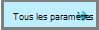

2. Dans la carte de **paramètres** , cliquez sur la **stratégie de sauvegarde** pour ouvrir cette carte.

    Sur la carte, les sauvegarde fréquence et la rétention des détails de la plage sont affichées.

    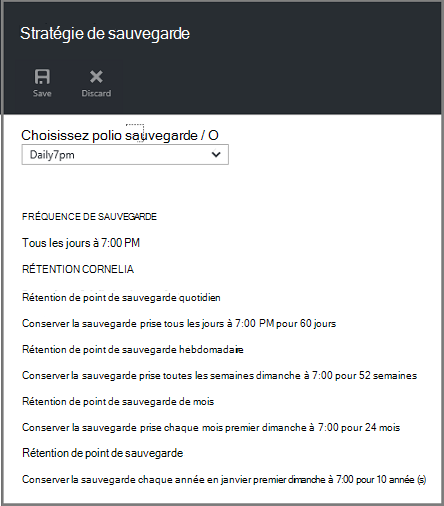

3. Dans le menu de la **stratégie de sauvegarde choisir** :
    - Pour modifier les stratégies, sélectionnez une stratégie différente, puis cliquez sur **Enregistrer**. La nouvelle stratégie est appliquée immédiatement à l’archivage sécurisé. < br\>
    - Pour créer une stratégie, cliquez sur **Créer**.

    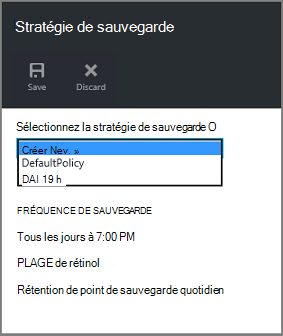

    Pour obtenir des instructions sur la création d’une stratégie de sauvegarde, voir [définir une stratégie de sauvegarde](backup-azure-manage-vms.md#defining-a-backup-policy).

[AZURE.INCLUDE [backup-create-backup-policy-for-vm](../../includes/backup-create-backup-policy-for-vm.md)]

## Sauvegarde à la demande d’une machine virtuelle
Vous pouvez prendre une demande de sauvegarde d’une machine virtuelle une fois qu’il est configuré pour la protection. Si la sauvegarde initiale est en attente, à la demande sauvegarde crée une copie complète de la machine virtuelle dans l’archivage sécurisé aux Services de récupération. Si la sauvegarde initiale est terminée, une sauvegarde à la demande envoyer seulement les modifications de l’instantané précédent, à l’archivage sécurisé aux Services de récupération. Autrement dit, les sauvegardes suivantes sont toujours incrémentielles.

>[AZURE.NOTE] La durée de rétention pour une sauvegarde à la demande est la valeur de rétention spécifiée pour le point de sauvegarde quotidien dans la stratégie. Si aucun point de sauvegarde quotidien n’est sélectionné, puis le point de sauvegarde hebdomadaire est utilisé.

Déclencher une sauvegarde à la demande d’une machine virtuelle :

- Dans le [tableau de bord de l’archivage sécurisé élément](backup-azure-manage-vms.md#open-a-vault-item-dashboard), cliquez sur **Sauvegarder maintenant**.

    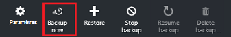

    Le portail permet de s’assurer que vous voulez commencer une opération de sauvegarde à la demande. Cliquez sur **Oui** pour démarrer l’opération de sauvegarde.

    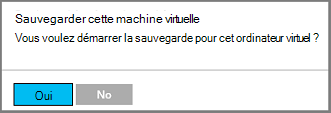

    Le travail de sauvegarde crée un point de récupération. La plage de rétention du point de récupération est identique à la plage de rétention spécifiée dans la stratégie associée à la machine virtuelle. Pour effectuer le suivi de l’avancement du projet, dans le tableau de bord de l’archivage sécurisé, cliquez sur la vignette de **Travaux de sauvegarde** .  

## Arrêter la protection de machines virtuelles
Si vous choisissez d’arrêter la protection d’une machine virtuelle, vous êtes invité si vous souhaitez conserver les points de récupération. Il existe deux façons d’arrêter la protection de machines virtuelles :
- arrêter toutes les futures tâches de sauvegarde et supprimer tous les points de récupération, ou
- arrêter toutes les futures tâches de sauvegarde tout en conservant les points de récupération  

Il existe un coût associé sans modifier les points de récupération d’espace de stockage. Toutefois, l’avantage de quitter les points de récupération est que vous pouvez restaurer la machine virtuelle plus tard, si vous le souhaitez. Pour plus d’informations sur le coût de quitter les points de récupération, consultez les [tarifs](https://azure.microsoft.com/pricing/details/backup/). Si vous choisissez de supprimer tous les points de récupération, vous ne pouvez pas restaurer la machine virtuelle.

Arrêter la protection pour une machine virtuelle :

1. Dans le [tableau de bord de l’archivage sécurisé élément](backup-azure-manage-vms.md#open-a-vault-item-dashboard), cliquez sur **Arrêter la sauvegarde**.

    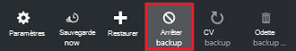

    La carte arrêter la sauvegarde s’ouvre.

    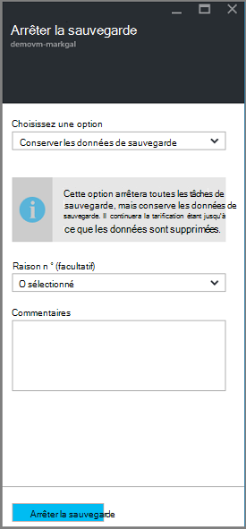

2. Sur la carte **Cesser de sauvegarde** , choisir de conserver ou de supprimer les données de sauvegarde. La zone informations fournit des détails sur votre choix.

    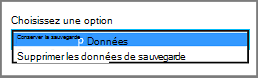

3. Si vous avez choisi de conserver les données de sauvegarde, passez à l’étape 4. Si vous choisissez de supprimer les données de sauvegarde, confirmer que vous voulez arrêter les travaux de sauvegarde et supprimer les points de récupération - tapez le nom de l’élément.

    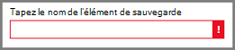

    Si vous n’êtes pas sûr du nom de l’élément, pointez sur le point d’exclamation pour afficher le nom. En outre, le nom de l’élément se trouve sous **Arrêter la sauvegarde** dans la partie supérieure de la cuillère.

4. Vous pouvez également fournir un **motif** ou un **commentaire**.

5. Pour arrêter le travail de sauvegarde pour l’élément actif, cliquez sur  

    Un message de notification vous permet de déterminer que les travaux de sauvegarde ont été arrêtés.

    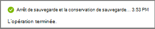

## Reprendre la protection d’une machine virtuelle
Si l’option **Conserver les données de sauvegarde** a été choisie lors de la protection de la machine virtuelle a été arrêtée, il est possible reprendre la protection. Si l’option **Supprimer les données de sauvegarde** a été choisie, la protection de la machine virtuelle ne peut pas reprendre.

Pour reprendre la protection de la machine virtuelle

1. Dans le [tableau de bord de l’archivage sécurisé élément](backup-azure-manage-vms.md#open-a-vault-item-dashboard), cliquez sur **reprendre la sauvegarde**.

    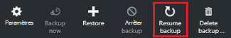

    La carte de stratégie de sauvegarde s’ouvre.

    >[AZURE.NOTE] Lorsque vous ré-Protégez la machine virtuelle, vous pouvez choisir une stratégie différente de la stratégie avec laquelle machine virtuelle a été protégé initiale.

2. Suivez les étapes [stratégies de rétention modifier ou créer une nouvelle stratégie de sauvegarde](backup-azure-manage-vms.md#change-policies-or-create-a-new-backup-policy), pour affecter la stratégie de l’ordinateur virtuel.

    Une fois que la stratégie de sauvegarde est appliquée à la machine virtuelle, vous voyez le message suivant.

    

## Supprimer des données de sauvegarde
Vous pouvez supprimer les données de sauvegarde associées à une machine virtuelle lors de la tâche **Arrêter la sauvegarde** , ou à tout moment après la sauvegarde est terminée. Même, il peut être utile de patienter jours ou semaines avant de supprimer les points de récupération. Contrairement à la restauration des points de récupération, lors de la suppression des données de sauvegarde, vous ne pouvez pas choisir des points de récupération spécifique à supprimer. Si vous choisissez de supprimer vos données de sauvegarde, vous supprimez tous les points de récupération associés à l’élément.

La procédure suivante suppose que le travail de sauvegarde de la machine virtuelle a été arrêté ou désactivé. Une fois l’opération de sauvegarde est désactivée, les options **reprendre la sauvegarde** et de **Supprimer la sauvegarde** sont disponibles dans le tableau de bord élément l’archivage sécurisé.

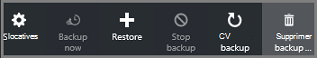

Pour supprimer les données de sauvegarde sur un ordinateur virtuel avec la *sauvegarde désactivée*:

1. Dans le [tableau de bord de l’archivage sécurisé élément](backup-azure-manage-vms.md#open-a-vault-item-dashboard), cliquez sur **Supprimer la sauvegarde**.

    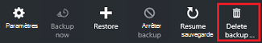

    La carte de **Supprimer les données de sauvegarde** s’ouvre.

    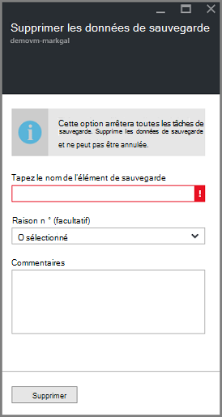

2. Tapez le nom de l’élément pour confirmer que vous voulez supprimer les points de récupération.

    

    Si vous n’êtes pas sûr du nom de l’élément, pointez sur le point d’exclamation pour afficher le nom. En outre, le nom de l’élément se trouve sous **Supprimer les données de sauvegarde** dans la partie supérieure de la cuillère.

3. Vous pouvez également fournir un **motif** ou un **commentaire**.

4. Pour supprimer les données de sauvegarde pour l’élément actif, cliquez sur  

    Un message de notification vous permet de déterminer que les données de sauvegarde a été supprimées.

## Étapes suivantes

Pour plus d’informations sur la création d’une machine virtuelle à partir d’un point de récupération, consultez [Restaurer des machines virtuelles Azure](backup-azure-restore-vms.md). Si vous avez besoin d’informations sur la protection de vos machines virtuelles, voir [tout d’abord rechercher : sauvegarder des machines virtuelles à un archivage sécurisé aux Services de récupération](backup-azure-vms-first-look-arm.md). Pour plus d’informations sur l’analyse des événements, voir [des alertes pour des sauvegardes Azure machine virtuelle](backup-azure-monitor-vms.md).
