<properties
    pageTitle="Gérer les serveurs Azure à l’aide du modèle de déploiement classique et chambres fortes sauvegarde Azure | Microsoft Azure"
    description="Utilisez ce didacticiel pour apprendre à gérer chambres fortes Azure sauvegarde et les serveurs."
    services="backup"
    documentationCenter=""
    authors="markgalioto"
    manager="jwhit"
    editor="tysonn"/>

<tags
    ms.service="backup"
    ms.workload="storage-backup-recovery"
    ms.tgt_pltfrm="na"
    ms.devlang="na"
    ms.topic="article"
    ms.date="09/27/2016"
    ms.author="jimpark;markgal"/>

# Gérer des serveurs à l’aide du modèle de déploiement classique et chambres fortes sauvegarde Azure

> [AZURE.SELECTOR]
- [Gestionnaire de ressources](backup-azure-manage-windows-server.md)
- [Classique](backup-azure-manage-windows-server-classic.md)

Dans cet article, vous trouverez une vue d’ensemble des tâches de gestion des sauvegardes disponibles via le portail classique Azure et de l’agent de sauvegarde de Microsoft Azure.

[AZURE.INCLUDE [learn-about-deployment-models](../../includes/learn-about-deployment-models-classic-include.md)]Modèle de déploiement du Gestionnaire de ressources.

## Tâches du portail de gestion
1. Connectez-vous au [portail de gestion](https://manage.windowsazure.com).

2. Cliquez sur **Services de récupération**, puis cliquez sur le nom de l’archivage sécurisé sauvegarde pour afficher la page de démarrage rapide.

    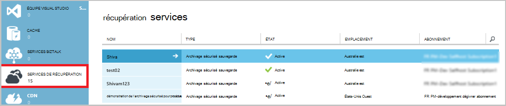

En sélectionnant les options en haut de la page de démarrage rapide, vous pouvez afficher les tâches d’administration disponibles.

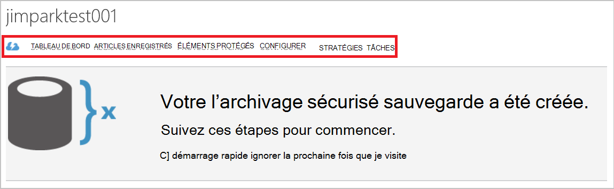

### Tableau de bord
Sélectionnez le **tableau de bord** pour afficher un aperçu de l’utilisation pour le serveur. La **vue d’ensemble de l’utilisation** inclut :

- Le nombre de serveurs Windows enregistré dans le cloud
- Le nombre de machines virtuelles Azure protégé dans le cloud
- L’espace de stockage total consommée dans Azure
- L’état de tâches récentes

En bas du tableau de bord, vous pouvez effectuer les tâches suivantes :

- **Certificat de gérer** - si un certificat a été utilisé pour enregistrer le serveur, puis utilisez cette option pour mettre à jour le certificat. Si vous utilisez des informations d’identification de l’archivage sécurisé, n’utilisez pas **Gérer certificat**.
- **Supprimer** : supprime l’archivage sécurisé sauvegarde en cours. Si un archivage sécurisé sauvegarde est n’est plus utilisé, vous pouvez le supprimer pour libérer de l’espace de stockage. **Supprimer** est activé uniquement une fois que tous les serveurs enregistrés ont été supprimées de l’archivage sécurisé.

## Articles enregistrés
Sélectionnez les **Éléments enregistrés** pour afficher les noms des serveurs qui sont enregistrés à cet archivage sécurisé.

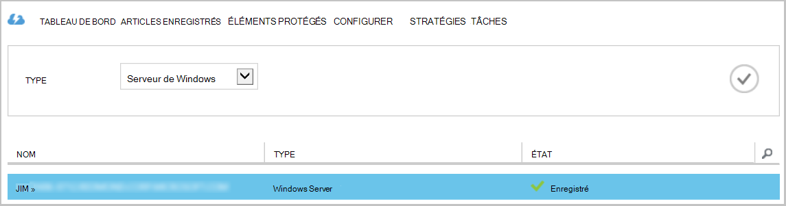

Le filtre de **Type** par défaut pour le Machine virtuelle Azure. Pour afficher les noms des serveurs qui sont enregistrés à cet archivage sécurisé, sélectionnez **serveur Windows** dans le menu déroulant.

À partir de là, vous pouvez effectuer les tâches suivantes :

- **Autoriser ré-inscription** - lorsque cette option est sélectionnée pour un serveur, vous pouvez utiliser l' **Assistant d’inscription** de l’agent de Microsoft Azure sauvegarde locale pour enregistrer le serveur avec l’archivage sécurisé sauvegarde une seconde fois. Vous devrez peut-être réenregistrer en raison d’une erreur dans le certificat ou si un serveur devait être recréés.
- **Supprimer** : supprime un serveur de l’archivage sécurisé sauvegarde. Toutes les données stockées associées au serveur est supprimé immédiatement.

    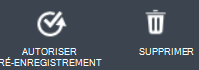

## Éléments protégés
Sélectionnez **Protégé par les éléments** à afficher les éléments qui ont été sauvegardés à partir des serveurs.

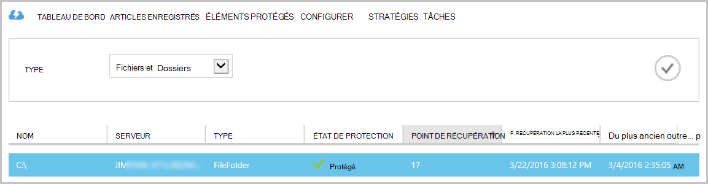

## Configurer

Sous l’onglet **configurer** , vous pouvez sélectionner l’option de redondance de stockage approprié. Le meilleur moment pour sélectionner l’option de redondance de stockage convient après avoir créé un archivage sécurisé et avant que tous les ordinateurs sont enregistrés à celui-ci.

>[AZURE.WARNING] Une fois qu’un élément a été enregistré à l’archivage sécurisé, l’option de redondance de stockage est verrouillée et ne peut pas être modifiée.

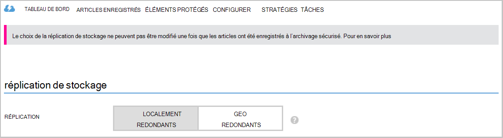

Consultez cet article pour plus d’informations sur [redondance du stockage](../storage/storage-redundancy.md).

## Tâches de l’agent de Microsoft Azure sauvegarde

### Console

Ouvrez l' **agent de Microsoft Azure sauvegarde** (vous pouvez le trouver en recherchant votre ordinateur *Microsoft Azure Backup*).

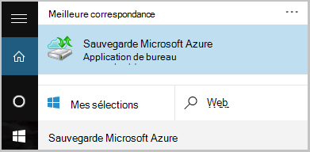

À partir **Actions** disponibles à droite de la console de l’agent de sauvegarde, vous pouvez effectuer les tâches de gestion suivantes :

- Inscrire un serveur
- Planifier la sauvegarde
- Sauvegarder maintenant
- Modifier les propriétés

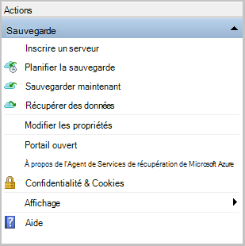

>[AZURE.NOTE] Pour **Récupérer des données**, voir [restaurer les fichiers vers un serveur de Windows ou un ordinateur client Windows](backup-azure-restore-windows-server.md).

### Modifier une sauvegarde existante

1. Dans l’agent de Microsoft Azure sauvegarde cliquez sur **Planifier la sauvegarde**.

    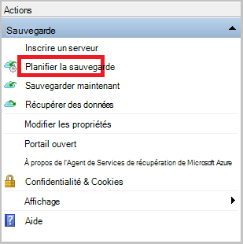

2. Dans l' **Assistant Planification de sauvegarde** laissez l’option **apporter des modifications aux éléments de sauvegarde ou des heures** sélectionnée, puis cliquez sur **suivant**.

    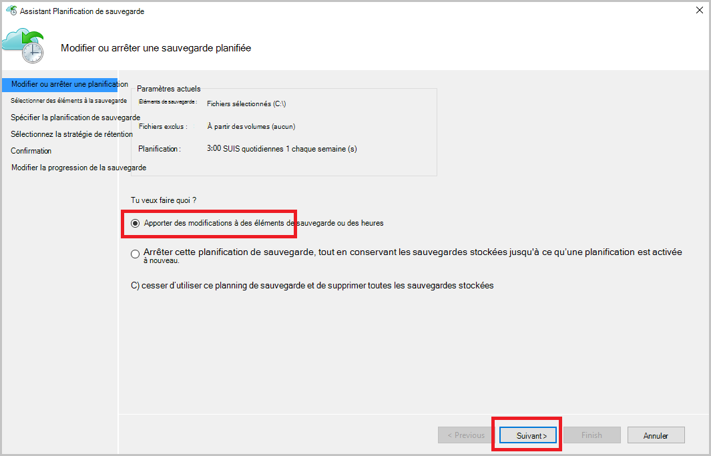

3. Si vous voulez ajouter ou modifier des éléments, cliquez sur **Ajouter des éléments**dans l’écran **Sélectionner des éléments à sauvegarder** .

    Vous pouvez également définir des **Paramètres d’Exclusion** à partir de cette page de l’Assistant. Si vous voulez exclure des fichiers ou les types de fichiers Lisez la procédure d’ajout de [paramètres d’exclusion](#exclusion-settings).

4. Sélectionnez les fichiers et dossiers que vous souhaitez sauvegarder, puis cliquez sur **OK**.

    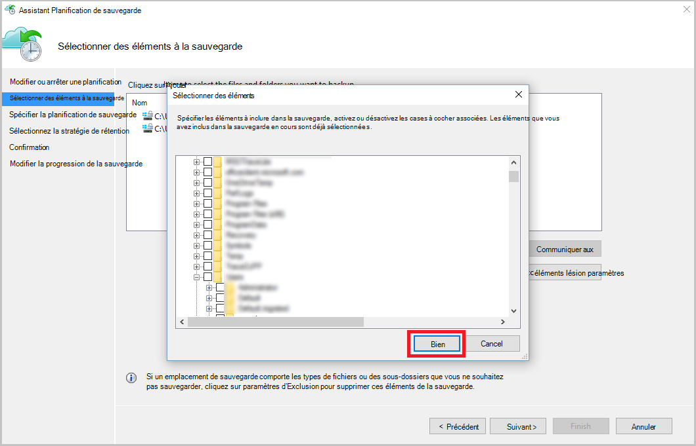

5. Spécifier la **planification de la sauvegarde** , puis cliquez sur **suivant**.

    Vous pouvez planifier des sauvegardes hebdomadaires ou quotidiennement (au maximum 3 fois par jour).

    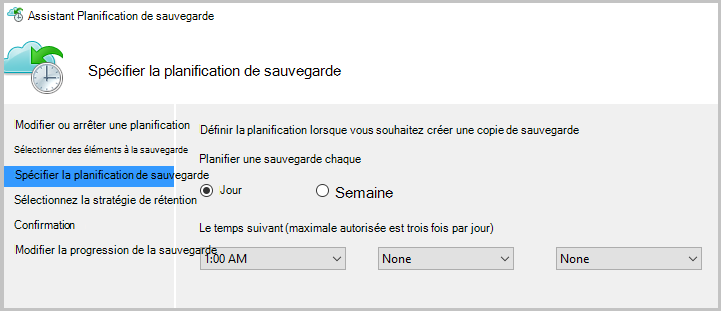

    >[AZURE.NOTE] Spécification de la planification de sauvegarde est expliqué en détail dans cet [article](backup-azure-backup-cloud-as-tape.md).

6. Sélectionnez la **Stratégie de rétention** pour la copie de sauvegarde, puis cliquez sur **suivant**.

    

7. Dans l’écran de **Confirmation** Vérifiez les informations et cliquez sur **Terminer**.

8. Une fois l’Assistant terminé la création de la **planification de la sauvegarde**, cliquez sur **Fermer**.

    Après avoir modifié la protection, vous pouvez confirmer déclenchement de sauvegardes en accédant à l’onglet **tâches** et confirmant que les modifications sont reflétées dans les travaux de sauvegarde.

### Activer la limitation de réseau  
L’agent de sauvegarde Azure fournit un onglet régulation qui permet de contrôler l’utilisation de la bande passante réseau lors du transfert de données. Ce contrôle peut être utile si vous avez besoin sauvegarder les données lors de heures de travail, mais ne souhaitez pas que le processus de sauvegarde interférer avec d’autres le trafic internet. La limitation de données transfert s’applique pour sauvegarder et restaurer des activités.  

Pour activer la limitation :

1. Dans l' **agent de sauvegarde**, cliquez sur **Modifier les propriétés**.

2. Cochez la case **Activer l’utilisation de la bande passante internet la limitation pour les opérations de sauvegarde** .

    

3. Une fois que vous avez activé la limitation, spécifiez la bande passante autorisée pour le transfert de données de sauvegarde pendant les **heures de travail** et les **heures de travail Non**.

    Les valeurs de bande passante commencent à 512 Ko par seconde (kb/s) et peuvent aller jusqu'à 1023 Mo par seconde (Mbps). Vous pouvez également indiquer le début et de fin pour les **heures de travail**et les jours de la semaine sont considérés comme travail jours. L’heure en dehors des heures de travail désignés est considéré comme heures de travail non.

4. Cliquez sur **OK**.

## Paramètres d’exclusion

1. Ouvrez l' **agent de Microsoft Azure sauvegarde** (vous pouvez le trouver en recherchant votre ordinateur *Microsoft Azure Backup*).

    

2. Dans l’agent de Microsoft Azure sauvegarde cliquez sur **Planifier la sauvegarde**.

    

3. Dans l’Assistant Planification de sauvegarde laissez l’option **apporter des modifications aux éléments de sauvegarde ou des heures** sélectionnée, puis cliquez sur **suivant**.

    

4. Cliquez sur **paramètres d’exclusion**.

    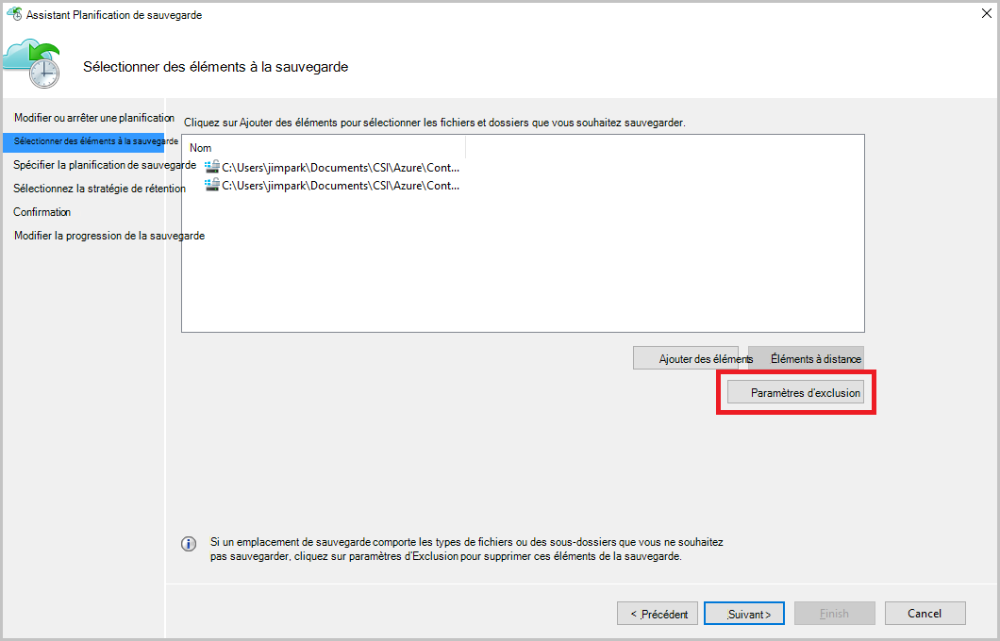

5. Cliquez sur **Ajouter une Exclusion**.

    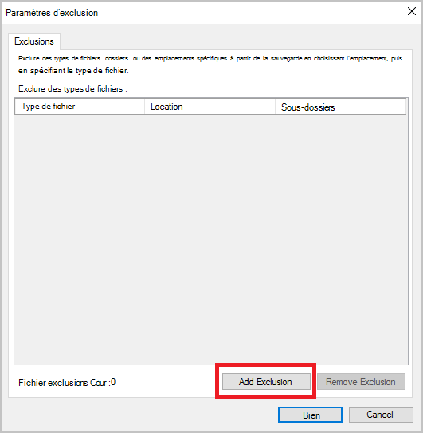

6. Sélectionnez l’emplacement et puis cliquez sur **OK**.

    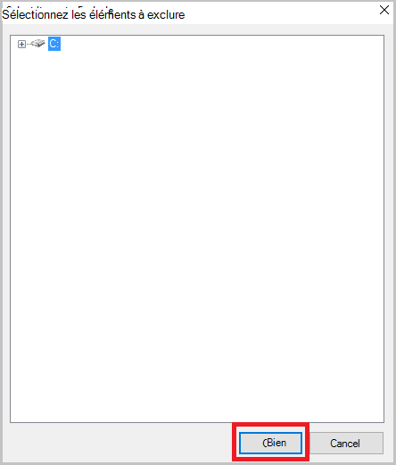

7. Ajoutez l’extension de fichier dans le champ **Type de fichier** .

    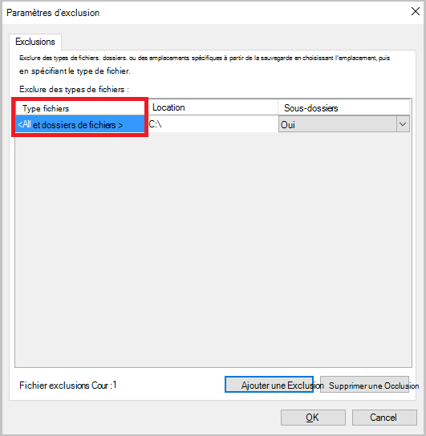

    Ajout d’une extension MP3

    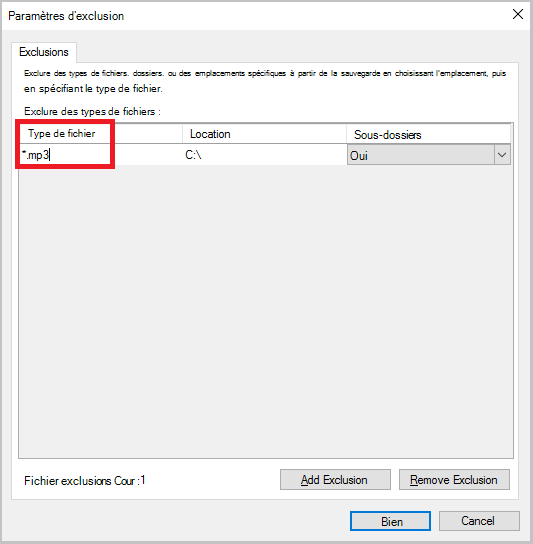

    Pour ajouter un autre numéro de poste, cliquez sur **Ajouter une Exclusion** et entrez un autre extension de fichier (en ajoutant une extension .jpeg).

    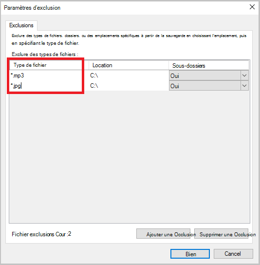

8. Lorsque vous avez ajouté toutes les extensions, cliquez sur **OK**.

9. Poursuivez les étapes de l’Assistant Planification de sauvegarde en cliquant sur **suivant** jusqu'à atteindre la **page de Confirmation**, puis cliquez sur **Terminer**.

    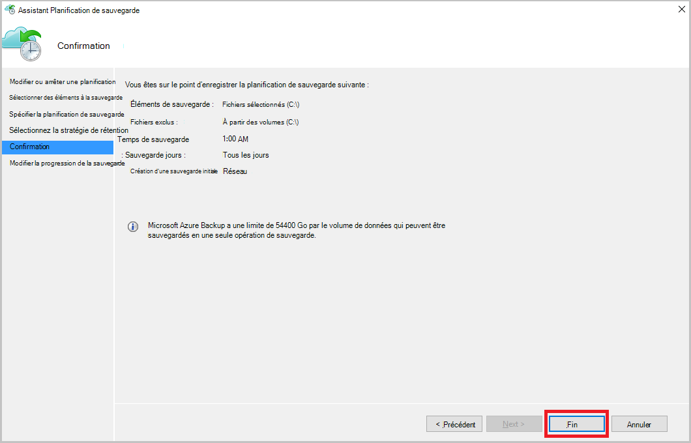

## Étapes suivantes
- [Restaurer Windows Server ou Client Windows Azure](backup-azure-restore-windows-server.md)
- Pour en savoir plus sur sauvegarde Azure, voir [Vue d’ensemble de la sauvegarde Azure](backup-introduction-to-azure-backup.md)
- Visitez le [Forum de sauvegarde Azure](http://go.microsoft.com/fwlink/p/?LinkId=290933)
