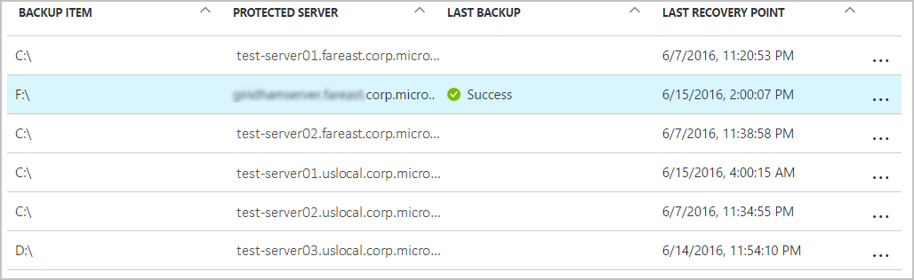

<properties
    pageTitle="Gérer les serveurs et chambres fortes de services de récupération Azure | Microsoft Azure"
    description="Utilisez ce didacticiel pour apprendre à gérer les serveurs et chambres fortes récupération Azure services."
    services="backup"
    documentationCenter=""
    authors="markgalioto"
    manager="cfreeman"
    editor="tysonn"/>

<tags
    ms.service="backup"
    ms.workload="storage-backup-recovery"
    ms.tgt_pltfrm="na"
    ms.devlang="na"
    ms.topic="article"
    ms.date="10/19/2016"
    ms.author="jimpark; markgal"/>


# <a name="monitor-and-manage-azure-recovery-services-vaults-and-servers-for-windows-machines"></a>Surveiller et gérer des chambres fortes récupération Azure services et les serveurs pour les ordinateurs Windows

> [AZURE.SELECTOR]
- [Gestionnaire de ressources](backup-azure-manage-windows-server.md)
- [Classique](backup-azure-manage-windows-server-classic.md)

Dans cet article, vous trouverez une vue d’ensemble des tâches de gestion des sauvegardes disponibles via le portail Azure et de l’agent de sauvegarde de Microsoft Azure.

[AZURE.INCLUDE [learn-about-deployment-models](../../includes/learn-about-deployment-models-rm-include.md)]modèle de déploiement classique.

## <a name="management-portal-tasks"></a>Tâches du portail de gestion

### <a name="access-your-recovery-services-vaults"></a>Accéder à votre chambres fortes Services de récupération

1. Connectez-vous au [Portail Azure](https://portal.azure.com/) à l’aide de votre abonnement Azure.

2. Dans le menu concentrateur, cliquez sur **Parcourir** , dans la liste des ressources, tapez **Les Services de récupération**. Lorsque vous commencez à taper, la liste filtre selon vos entrées. Cliquez sur **Services de récupération de chambres fortes**.

     <br/>

2. Sélectionnez le nom de l’archivage sécurisé que vous souhaitez afficher dans la liste pour ouvrir la carte de tableau de bord de l’archivage sécurisé de Services de récupération.

     <br/>

## <a name="monitor-jobs-and-alerts"></a>Surveillance des tâches et les alertes
Surveiller les travaux et les alertes à partir du tableau de bord de l’archivage sécurisé aux Services de récupération, où vous voyez :

- Détails de l’alerte de sauvegarde
- Fichiers et dossiers, ainsi que des machines virtuelles Azure protégés dans le cloud
- Espace de stockage total consommée dans Azure
- État travail de sauvegarde


En cliquant sur les informations contenues dans chacune de ces vignettes s’ouvre la carte associé à l’endroit où vous gérez les tâches connexes.

Dans la partie supérieure du tableau de bord :

- Paramètres donne accès à des tâches de sauvegarde disponibles.
- Sauvegarde - vous aide à vous sauvegardez les nouveaux fichiers et dossiers (ou machines virtuelles Azure) à l’archivage sécurisé aux Services de récupération.
- Supprimer - si un archivage sécurisé des services de récupération est n’est plus utilisé, vous pouvez le supprimer pour libérer de l’espace de stockage. Supprimer est activé uniquement une fois que tous les serveurs protégés ont été supprimées de l’archivage sécurisé.


## <a name="alerts-for-backups-using-azure-backup-agent"></a>Alertes des sauvegardes à l’aide de l’agent de sauvegarde Azure :
| Niveau d’alerte  | Alertes envoyées |
| ------------- | ------------- |
| Critique | Échec de la sauvegarde, Échec de la récupération  |
| Avertissement  | Sauvegarde s’est terminée avec des avertissements (lorsque moins de 100 fichiers ne sont pas sauvegardées en raison de problèmes de corruption, et plus d’un million fichiers sont sauvegardés)  |
| D’information  | Aucun  |
## <a name="manage-backup-alerts"></a>Gérer les alertes de sauvegarde
Cliquez sur la vignette de **Sauvegarde alertes** pour ouvrir la carte **d’Alertes de sauvegarde** et de gérer les alertes.


La vignette sauvegarde alertes affiche le nombre de :

- alertes critiques pas résolues dans les 24 dernières heures
- alertes d’avertissement pas résolues dans les 24 dernières heures

En cliquant sur chacun de ces liens vous permet d’accéder à la carte de **Sauvegarde alertes** avec un affichage filtré des alertes (critiques ou d’avertissement).

À partir de la carte d’alertes de sauvegarde, vous :

- Sélectionnez les informations appropriées à inclure dans vos alertes.

    

- Filtrer les alertes pour les heures gravité, l’état et début/fin.

    

- Configurer des notifications pour gravité, fréquence et les destinataires, ainsi qu’activer ou désactiver les alertes.

    

Si **Par alerte** est sélectionné comme la fréquence de **notification** sans regroupement ou réduction dans des messages électroniques se produit. Chaque alerte se traduit par 1 notification. C’est le paramètre par défaut et le message électronique résolution est également envoyé immédiatement.

Si **Toutes les heures résumé** est sélectionné comme la **notification** fréquence une adresse électronique est envoyé à l’utilisateur leur indique qu’il n’y a pas résolus nouvelles alertes générées dans la dernière heure. Une adresse de messagerie résolution est envoyée à la fin de l’heure.

Alertes peuvent être envoyés pour les niveaux de gravité suivants :

- critique
- avertissement
- informations

Vous désactivez l’alerte avec le bouton **désactiver** dans la carte de détails de la tâche. Lorsque vous cliquez sur Désactiver, vous pouvez fournir des notes de résolution.

Vous choisissez les colonnes que vous souhaitez voir apparaître dans le cadre de l’alerte avec le bouton **Choisir les colonnes** .

>[AZURE.NOTE] À partir de la carte de **paramètres** , vous gérez les alertes de sauvegarde en sélectionnant **de surveillance et rapports > alertes et des événements > alertes sauvegarde** , puis en cliquant sur **filtre** ou **Configurer les Notifications**.

## <a name="manage-backup-items"></a>Gérer les éléments de sauvegarde
Gestion des sauvegardes locales sont désormais disponible dans le portail de gestion. Dans la section de sauvegarde du tableau de bord, la vignette **Éléments de sauvegarde** indique le nombre d’éléments de sauvegarde protégé pour l’archivage sécurisé.

Cliquez sur **Dossiers de fichiers** dans la vignette éléments de sauvegarde.


La carte d’éléments de sauvegarde s’ouvre avec le filtre est défini au dossier de fichiers indiquant chaque élément répertorié de sauvegarde spécifique.



Si vous sélectionnez un élément de sauvegarde spécifique dans la liste, vous voyez les détails essentiels pour cet élément.

>[AZURE.NOTE] À partir de la carte de **paramètres** , vous gérez des fichiers et dossiers en sélectionnant **éléments protégés > éléments sauvegarde** , puis cliquez sur **Dossiers de fichiers** dans le menu déroulant.


## <a name="manage-backup-jobs"></a>Gérer les travaux de sauvegarde
Les opérations de sauvegarde pour les deux local (lorsque le serveur local est sauvegardez sur Azure) et des sauvegardes Azure sont visibles dans le tableau de bord.

Dans la section de sauvegarde du tableau de bord, la vignette de travail de sauvegarde indique le nombre de tâches :

- en cours
- Échec dans les dernières 24 heures.

Pour gérer vos opérations de sauvegarde, cliquez sur la vignette de **Travaux de sauvegarde** , ce qui permet d’ouvrir la carte de travaux de sauvegarde.


Vous modifiez les informations disponibles dans la carte de travaux de sauvegarde avec le bouton **Choisir les colonnes** en haut de la page.

Utilisez le bouton **filtre** pour sélectionner entre les fichiers et dossiers et sauvegarde des machines virtuelles Azure.

Si vous ne voyez pas vos fichiers sauvegardés et les dossiers, cliquez sur bouton **filtre** en haut de la page et sélectionnez les **fichiers et dossiers** dans le menu Type d’élément.

>[AZURE.NOTE] À partir de la carte de **paramètres** , vous gérez les travaux de sauvegarde en sélectionnant **de surveillance et rapports > tâches > travaux de sauvegarde** , puis cliquez sur **Dossiers de fichiers** dans le menu déroulant.

## <a name="monitor-backup-usage"></a>Surveiller l’utilisation de sauvegarde
Dans la section de sauvegarde du tableau de bord, la vignette de l’utilisation de sauvegarde afficher le stockage utilisé dans Azure. L’utilisation du stockage est fournie pour :
- Utilisation du stockage cloud LRS associée à l’archivage sécurisé
- Utilisation du stockage cloud GRS associée à l’archivage sécurisé

## <a name="production-servers"></a>Serveurs de production
Pour gérer vos serveurs de production, cliquez sur **paramètres**. Sous gérer, cliquez sur **infrastructure de sauvegarde > serveurs de Production**.

Les listes de cartes de serveurs de Production de tous vos serveurs de production disponibles. Cliquez sur un serveur dans la liste pour ouvrir les détails du serveur.


## <a name="microsoft-azure-backup-agent-tasks"></a>Tâches de l’agent de Microsoft Azure sauvegarde

## <a name="open-the-backup-agent"></a>Ouvrir l’agent de sauvegarde

Ouvrez l' **agent de Microsoft Azure sauvegarde** (vous trouvez en recherchant votre ordinateur *Microsoft Azure Backup*).


À partir **Actions** disponibles à droite de la console de l’agent de sauvegarde vous effectuez les tâches de gestion suivantes :

- Inscrire un serveur
- Planifier la sauvegarde
- Sauvegarder maintenant
- Modifier les propriétés


>[AZURE.NOTE] Pour **Récupérer des données**, voir [restaurer les fichiers vers un serveur de Windows ou un ordinateur client Windows](backup-azure-restore-windows-server.md).

## <a name="modify-an-existing-backup"></a>Modifier une sauvegarde existante

1. Dans l’agent de Microsoft Azure sauvegarde cliquez sur **Planifier la sauvegarde**.

    

2. Dans l' **Assistant Planification de sauvegarde** laissez l’option **apporter des modifications aux éléments de sauvegarde ou des heures** sélectionnée, puis cliquez sur **suivant**.

    

3. Si vous voulez ajouter ou modifier des éléments, cliquez sur **Ajouter des éléments**dans l’écran **Sélectionner des éléments à sauvegarder** .

    Vous pouvez également définir des **Paramètres d’Exclusion** à partir de cette page de l’Assistant. Si vous voulez exclure des fichiers ou les types de fichiers Lisez la procédure d’ajout de [paramètres d’exclusion](#exclusion-settings).

4. Sélectionnez les fichiers et dossiers que vous souhaitez sauvegarder, puis cliquez sur **OK**.

    

5. Spécifier la **planification de la sauvegarde** , puis cliquez sur **suivant**.

    Vous pouvez planifier des sauvegardes hebdomadaires ou quotidiennement (au maximum 3 fois par jour).

    

    >[AZURE.NOTE] Spécification de la planification de sauvegarde est expliqué en détail dans cet [article](backup-azure-backup-cloud-as-tape.md).

6. Sélectionnez la **Stratégie de rétention** pour la copie de sauvegarde, puis cliquez sur **suivant**.

    

7. Dans l’écran de **Confirmation** Vérifiez les informations et cliquez sur **Terminer**.

8. Une fois l’Assistant terminé la création de la **planification de la sauvegarde**, cliquez sur **Fermer**.

    Après avoir modifié la protection, vous pouvez confirmer déclenchement de sauvegardes en accédant à l’onglet **tâches** et en vérifiant que les modifications sont reflétées dans les travaux de sauvegarde.

## <a name="enable-network-throttling"></a>Activer la limitation de réseau  
L’agent de sauvegarde Azure fournit un onglet régulation qui permet de contrôler l’utilisation de la bande passante réseau lors du transfert de données. Ce contrôle peut être utile si vous avez besoin sauvegarder les données lors de heures de travail, mais ne souhaitez pas que le processus de sauvegarde interférer avec d’autres le trafic internet. La limitation de données transfert s’applique pour sauvegarder et restaurer des activités.  

Pour activer la limitation :

1. Dans l' **agent de sauvegarde**, cliquez sur **Modifier les propriétés**.

2. Sur la **limitation onglet, sélectionnez **activer la limitation de sauvegarde opérations ** l’utilisation de la bande passante internet.

    

    Une fois que vous avez activé la limitation, spécifiez la bande passante autorisée pour le transfert de données de sauvegarde pendant les **heures de travail** et les **heures de travail Non**.

    Les valeurs de bande passante commencent à 512 Ko par seconde (kb/s) et peuvent aller jusqu'à 1023 Mo par seconde (Mbps). Vous pouvez également indiquer le début et de fin pour les **heures de travail**et les jours de la semaine sont considérés comme travail jours. L’heure en dehors des heures de travail désignés est considéré comme heures de travail non.

3. Cliquez sur **OK**.

## <a name="manage-exclusion-settings"></a>Gérer les paramètres d’exclusion

1. Ouvrez l' **agent de Microsoft Azure sauvegarde** (vous pouvez le trouver en recherchant votre ordinateur *Microsoft Azure Backup*).

    

2. Dans l’agent de Microsoft Azure sauvegarde cliquez sur **Planifier la sauvegarde**.

    

3. Dans l’Assistant Planification de sauvegarde laissez l’option **apporter des modifications aux éléments de sauvegarde ou des heures** sélectionnée, puis cliquez sur **suivant**.

    

4. Cliquez sur **paramètres d’exclusion**.

    

5. Cliquez sur **Ajouter une Exclusion**.

    

6. Sélectionnez l’emplacement et puis cliquez sur **OK**.

    

7. Ajoutez l’extension de fichier dans le champ **Type de fichier** .

    

    Ajout d’une extension MP3

    

    Pour ajouter un autre numéro de poste, cliquez sur **Ajouter une Exclusion** et entrez un autre extension de fichier (en ajoutant une extension .jpeg).

    

8. Lorsque vous avez ajouté toutes les extensions, cliquez sur **OK**.

9. Poursuivez les étapes de l’Assistant Planification de sauvegarde en cliquant sur **suivant** jusqu'à atteindre la **page de Confirmation**, puis cliquez sur **Terminer**.

    

## <a name="frequently-asked-questions"></a>Forum aux questions
**T1. L’état du travail de sauvegarde apparaissent comme étant terminée dans l’agent de sauvegarde Azure, pourquoi n’il obtenir répercutée immédiatement dans le portail ?**

A1. Il est au délai maximal de 15 minutes entre l’état du travail de sauvegarde reflétée dans le portail Azure et de l’agent de sauvegarde Azure.

**Q.2 en cas d’échec d’une opération de sauvegarde, combien de temps faut-il pour déclencher une alerte ?**

A.2 une alerte est élevé au sein de 20 min de l’échec de sauvegarde Azure.

**T3. Existe-t-il un cas où un message électronique ne seront pas envoyé si les notifications sont configurées ?**

A3. Voici les cas la notification n’est pas communiqué afin de réduire le bruit alert :

   - Si les notifications sont configurées toutes les heures et une alerte est élevée et résolue dans l’heure
   - Le travail est annulé.
   - Deuxième sauvegarde a échoué car le travail de sauvegarde d’origine est en cours.

## <a name="troubleshooting-monitoring-issues"></a>Résolution des problèmes d’analyse

**Problème :** Tâches et/ou les alertes de l’agent de sauvegarde Azure n’apparaissent pas dans le portail.

**Étapes de dépannage :** Le processus, ```OBRecoveryServicesManagementAgent```, envoie les données de projet et d’alerte pour le service de sauvegarde Azure. Il peut arriver que ce processus peut devenir bloqué ou l’arrêt.

1. Pour vérifier le processus n’est pas exécuté, ouvrez **Le Gestionnaire des tâches** et vérifiez si le ```OBRecoveryServicesManagementAgent``` est en cours.

2. En supposant que le processus n’est pas exécuté, ouvrez **Le panneau de configuration** et parcourir la liste des services. Démarrez ou redémarrez **l’Agent de gestion des Services Microsoft Azure récupération**.

    Pour plus d’informations, consultez les journaux de :<br/>
`<AzureBackup_agent_install_folder>\Microsoft Azure Recovery Services Agent\Temp\GatewayProvider*`. Par exemple :<br/> `C:\Program Files\Microsoft Azure Recovery Services Agent\Temp\GatewayProvider0.errlog`.

## <a name="next-steps"></a>Étapes suivantes
- [Restaurer Windows Server ou Client Windows Azure](backup-azure-restore-windows-server.md)
- Pour en savoir plus sur sauvegarde Azure, voir [Vue d’ensemble de la sauvegarde Azure](backup-introduction-to-azure-backup.md)
- Visitez le [Forum de sauvegarde Azure](http://go.microsoft.com/fwlink/p/?LinkId=290933)
