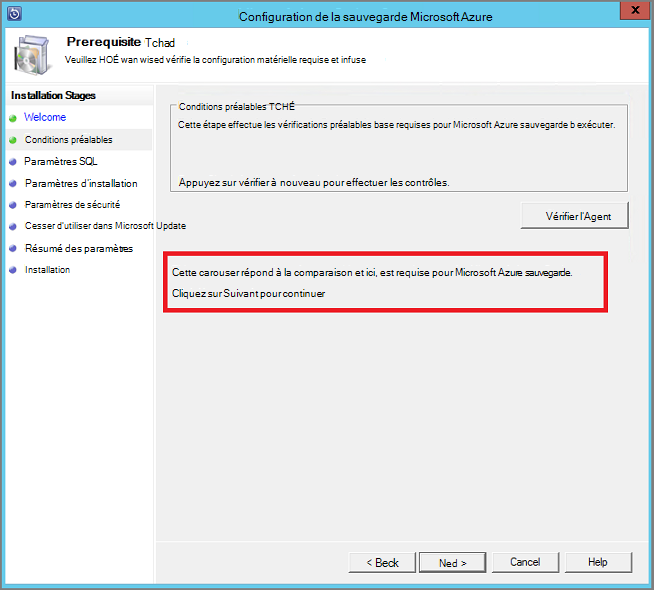
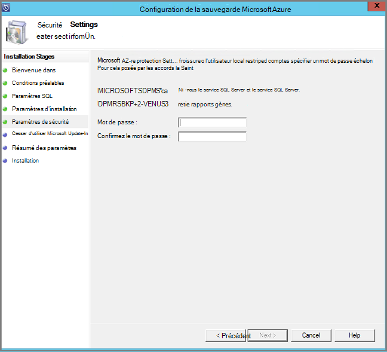
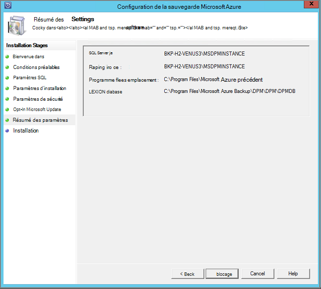
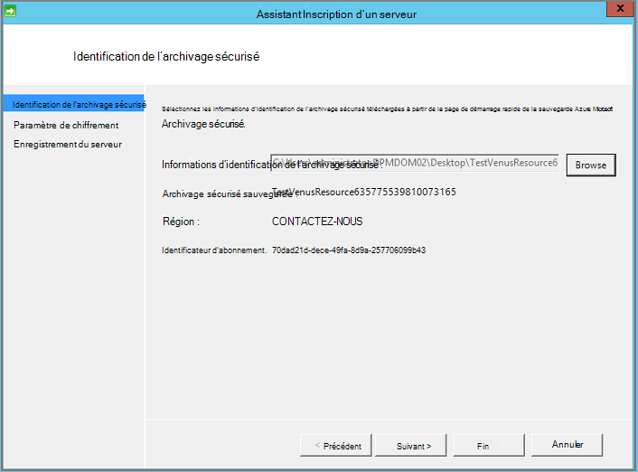

<properties
  pageTitle="Préparer votre environnement pour sauvegarder les charges de travail à l’aide du serveur de sauvegarde Azure | Microsoft Azure"
  description="Vérifiez que votre environnement est correctement préparé pour sauvegarder les charges de travail à l’aide du serveur de sauvegarde Azure"
  services="backup"
  documentationCenter=""
  authors="pvrk"
  manager="shivamg"
  editor=""
  keywords="serveur de sauvegarde Azure ; archivage sécurisé sauvegarde"/>

<tags
  ms.service="backup"
  ms.workload="storage-backup-recovery"
  ms.tgt_pltfrm="na"
  ms.devlang="na"
  ms.topic="article"
  ms.date="08/22/2016"
  ms.author="jimpark;trinadhk;pullabhk; markgal"/>

# <a name="preparing-to-back-up-workloads-using-azure-backup-server"></a>Préparation de sauvegarder les charges de travail à l’aide du serveur de sauvegarde Azure

> [AZURE.SELECTOR]
- [Serveur de sauvegarde Azure](backup-azure-microsoft-azure-backup.md)
- [SCDPM](backup-azure-dpm-introduction.md)
- [Serveur de sauvegarde Azure (classique)](backup-azure-microsoft-azure-backup-classic.md)
- [SCDPM (classique)](backup-azure-dpm-introduction-classic.md)


Cet article est concernant la préparation de votre environnement pour sauvegarder les charges de travail à l’aide du serveur de sauvegarde Azure. Avec le serveur de sauvegarde Azure, vous pouvez protéger des charges de travail tels que des ordinateurs virtuels Hyper-V, Microsoft SQL Server, SharePoint Server, Microsoft Exchange et les clients Windows à partir d’une seule console.

>[AZURE.WARNING] Serveur de sauvegarde Azure hérite de la fonctionnalité de Data Protection Manager (DPM) pour la sauvegarde de la charge de travail. Vous trouverez des pointeurs vers la documentation DPM pour certaines de ces fonctionnalités. Toutefois Azure sauvegarde Server ne pas fournir la protection sur bande ou intégrer System Center.

## <a name="1-windows-server-machine"></a>1. machine serveur Windows


La première étape vers le serveur de sauvegarde Azure les doit disposer d’un ordinateur Windows Server.

| Emplacement | Configuration minimale requise | Obtenir des instructions supplémentaires |
| -------- | -------------------- | ----------------------- |
| Azure | Azure machine virtuelle de IaaS<br><br>A2 Standard : 2 cœurs, 3,5 Go de RAM | Vous pouvez commencer avec une image de la galerie simple de Windows Server 2012 R2 centre de données. [Protection IaaS les charges de travail à l’aide du serveur de sauvegarde Azure (DPM)](https://technet.microsoft.com/library/jj852163.aspx) contient plusieurs nuances. Vous assurer que vous lire l’article complètement avant de déployer l’ordinateur. |
| En local | Machine virtuelle Hyper-V,<br> Machine virtuelle VMWare,<br> ou un hôte physique<br><br>2 cœurs et 4 Go de RAM | Vous pouvez Dédupliquez le stockage DPM à l’aide de Windows Server déduplication. Découvrez comment [DPM et déduplication](https://technet.microsoft.com/library/dn891438.aspx) collaborer lorsque déployée dans ordinateurs virtuels Hyper-V. |

> [AZURE.NOTE] Il est recommandé d’installer Azure sauvegarde Server sur un ordinateur avec Windows Server 2012 R2 centre de données. Un grand nombre des conditions préalables sont couvertes automatiquement avec la dernière version du système d’exploitation Windows.

Si vous souhaitez joindre ce serveur à un domaine à un moment donné, il est recommandé que l’activité rejoindre domaine être terminé avant l’installation du serveur de sauvegarde Azure. Déplacement d’un ordinateur de serveur de sauvegarde Azure existant vers un nouveau domaine après que le déploiement est *pas pris en charge*.

## <a name="2-backup-vault"></a>. 2 l’archivage sécurisé sauvegarde


Si vous envoyez des données de sauvegarde à Azure ou conservez localement, le logiciel doit être connecté à Azure. Pour être plus spécifique, l’ordinateur serveur sauvegarde Azure doit être enregistré par un archivage sécurisé sauvegarde.

Pour créer un archivage sécurisé sauvegarde :

1. Connectez-vous au [portail de gestion](http://manage.windowsazure.com/).

2. Cliquez sur **Nouveau** > **Services Business Data** > **Services de récupération** > **l’archivage sécurisé sauvegarde** > **Création rapide**. Si vous avez plusieurs abonnements associés à votre compte professionnel, sélectionnez l’abonnement à associer à l’archivage sécurisé sauvegarde correcte.

3. Dans la zone **nom**, entrez un nom convivial pour identifier l’archivage sécurisé. Il doit être unique pour chaque abonnement.

4. Dans **la région**, sélectionnez la région géographique pour l’archivage sécurisé. En règle générale, la région de l’archivage sécurisé est choisie en fonction des contraintes de latence souveraineté ou au réseau de données.

    

5. Cliquez sur **créer l’archivage sécurisé**. Il peut prendre un certain temps pour l’archivage sécurisé sauvegarde à créer. Surveiller les notifications d’état au bas du portail.

    

6. Un message confirme que l’archivage sécurisé a été créé correctement et qu’il apparaît dans la page Services de récupération comme étant actif.
    

  > [AZURE.IMPORTANT] Assurez-vous que l’option redondance stockage approprié est choisie juste après que l’archivage sécurisé a été créé. En savoir plus sur [geo redondants](../storage/storage-redundancy.md#geo-redundant-storage) et options [localement redondantes](../storage/storage-redundancy.md#locally-redundant-storage) dans cette [vue d’ensemble](../storage/storage-redundancy.md).


## <a name="3-software-package"></a>3. package logiciel


### <a name="downloading-the-software-package"></a>Télécharger le package de logiciels

Similaire à vault des informations d’identification, vous pouvez télécharger Microsoft Azure sauvegarde pour des charges de travail à partir de la **Page de démarrage rapide** de l’archivage sécurisé sauvegarde.

1. Cliquez sur **les charges de travail Application (à disque vers le Cloud)**. Vous accédez alors à la page Centre de téléchargement à partir de laquelle le logiciel peut être téléchargé.

    

2. Cliquez sur **Télécharger**.

    

3. Sélectionnez tous les fichiers et cliquez sur **suivant**. Télécharger tous les fichiers provenant la page de téléchargement Microsoft Azure Backup et à placer tous les fichiers dans le même dossier.


    Étant donné que la taille de téléchargement de tous les fichiers est ensemble > 3G, sur un 10 Téléchargez lien que peut prendre jusqu'à 60 minutes pour la fin du téléchargement.


### <a name="extracting-the-software-package"></a>Extraction de l’ensemble de logiciels

Une fois que vous avez téléchargé tous les fichiers, cliquez sur **MicrosoftAzureBackupInstaller.exe**. Démarre l' **Assistant de configuration de Microsoft Azure sauvegarde** pour extraire les fichiers d’installation vers un emplacement spécifié par vous. Poursuivez les étapes de l’Assistant, puis cliquez sur le bouton **Extraire** pour commencer le processus d’extraction.

> [AZURE.WARNING] Au moins 4 Go d’espace libre est requis pour extraire les fichiers d’installation.


Une fois que l’extraction traitez terminée, cochez la case pour lancer la récemment extraite *setup.exe* pour commencer l’installation de Microsoft Azure sauvegarde Server et cliquez sur le bouton **fin** .

### <a name="installing-the-software-package"></a>Installation des logiciels

1. Cliquez sur **Microsoft Azure sauvegarde** pour lancer l’Assistant Configuration.

    

2. Sur l’écran d’accueil, cliquez sur le bouton **suivant** . Cela vous permet d’accéder à la section *Vérifications préalables* . Dans cet écran, cliquez sur le bouton **Vérifier** pour déterminer si les conditions préalables matérielle et logicielle pour serveur de sauvegarde Azure sont remplies. Si toutes les conditions préalables sont ont été satisfaits avec succès, vous verrez un message indiquant que l’ordinateur répond à la configuration requise. Cliquez sur le bouton **suivant** .

    

3. Serveur de sauvegarde de Microsoft Azure nécessite SQL Server Standard, et le package d’installation de serveur de sauvegarde Azure est fourni avec les fichiers binaires SQL Server appropriés nécessaires. Lorsque vous démarrez avec une nouvelle installation de serveur de sauvegarde Azure, vous devez sélectionnez l’option **d’Installation nouvelle Instance de SQL Server avec ce programme d’installation** et cliquez sur le bouton **vérifier et installer** . Une fois que les conditions préalables sont installés avec succès, cliquez sur **suivant**.

    

    En cas de panne avec une recommandation pour redémarrer l’ordinateur, faites-le et cliquez sur **Vérification**.

    > [AZURE.NOTE] Serveur de sauvegarde Azure ne fonctionne pas avec une instance de SQL Server à distance. L’instance utilisé par le serveur de sauvegarde Azure doit être local.

4. Fournir un emplacement pour l’installation de Microsoft Azure sauvegarder les fichiers de serveur, puis cliquez sur **suivant**.

    

    L’emplacement de travail est une obligation pour précédent jusqu'à Azure. Vérifiez que l’emplacement de travail est au moins 5 % des données planifiées à sauvegarder dans le cloud. Pour la protection de disque, des disques distincts doivent être configurés une fois l’installation terminée. Pour plus d’informations sur les pools de stockage, voir [configurer les pools de stockage et le stockage de disque](https://technet.microsoft.com/library/hh758075.aspx).

5. Fournir un mot de passe pour les comptes d’utilisateurs locaux à accès restreint et cliquez sur **suivant**.

    

6. Indiquez si vous souhaitez utiliser *Microsoft Update* pour vérifier les mises à jour et cliquez sur **suivant**.

    >[AZURE.NOTE] Nous vous conseillons Windows Update rediriger vers Microsoft Update, qui offre de sécurité et les mises à jour importantes pour Windows et d’autres produits tels que Microsoft Azure sauvegarde Server.

    

7. Passez en revue le *Résumé des paramètres* , puis cliquez sur **installer**.

    

8. L’installation s’est-il passé dans les phases. Dans la première phase l’Agent de Services Microsoft Azure récupération est installé sur le serveur. L’Assistant vérifie également pour la connectivité Internet. Si la connectivité Internet est disponible procéder à l’installation, si ce n’est pas, vous avez besoin fournir des détails des proxy pour vous connecter à Internet.

    L’étape suivante consiste à configurer l’Agent de Services Microsoft Azure récupération. Dans le cadre de la configuration, vous devrez fournir que les informations d’identification de l’archivage sécurisé pour enregistrer l’ordinateur à l’archivage sécurisé sauvegarde qui vous. Vous allez également fournir un mot de passe pour le chiffrement/déchiffrement les données envoyées entre Azure et vos locaux. Vous pouvez automatiquement générer un mot de passe ou fournir votre propre mot de passe 16 caractères minimale. Poursuivez avec l’Assistant jusqu'à ce que l’agent a été configurée.

    

9. Une fois que l’inscription du serveur Microsoft Azure sauvegarde terminée avec succès, l’Assistant de configuration globale passe à l’installation et la configuration de SQL Server et les composants du serveur de sauvegarde Azure. Une fois l’installation du composant SQL Server terminée, les composants de serveur de sauvegarde Azure sont installés.

    


Une fois l’étape de l’installation terminée, les icônes du bureau du produit aura été créés également. Double-cliquez sur l’icône pour lancer le produit.

### <a name="add-backup-storage"></a>Ajouter un stockage de sauvegarde

La première copie de sauvegarde est conservée sur le stockage relié à l’ordinateur serveur de sauvegarde Azure. Pour plus d’informations sur l’ajout de disques, voir [configurer les pools de stockage et le stockage de disque](https://technet.microsoft.com/library/hh758075.aspx).

> [AZURE.NOTE] Vous devez ajouter stockage de sauvegarde, même si vous envisagez d’envoyer des données à Azure. Dans l’architecture actuelle de serveur de sauvegarde Azure, l’archivage sécurisé Azure sauvegarde conserve la *deuxième* copie des données alors que le stockage local conserve la copie de sauvegarde première (et obligatoire).  

## <a name="4-network-connectivity"></a>4. la connectivité réseau


Azure sauvegarde serveur nécessite une connexion au service de sauvegarde Azure pour le produit fonctionne correctement. Pour vérifier si l’ordinateur a la connectivité à Azure, utilisez la ```Get-DPMCloudConnection``` applet de commande dans la console Azure sauvegarde serveur PowerShell. Si le résultat de l’applet de commande est vrai, connectivité existe, sinon connectivité n’existe pas.

En même temps, l’abonnement Azure doit se trouver dans un état correct. Pour déterminer l’état de votre abonnement et le gérer, connectez-vous au [portail de l’abonnement]( https://account.windowsazure.com/Subscriptions).

Une fois que vous connaissez l’état de la connectivité Azure et de l’abonnement Azure, vous pouvez utiliser le tableau ci-dessous pour déterminer l’impact sur la fonctionnalité de sauvegarde et de restauration proposée.

| État de connectivité | Abonnement Azure | Sauvegarde vers Azure| Sauvegarde sur disque | Restaurer à partir d’Azure | Restaurer à partir du disque |
| -------- | ------- | --------------------- | ------------------- | --------------------------- | ----------------------- |
| Connecté | Active | Autorisé | Autorisé | Autorisé | Autorisé |
| Connecté | Expiré | Arrêté | Arrêté | Autorisé | Autorisé |
| Connecté | Annulé | Arrêté | Arrêté | Points de récupération arrêté et Azure supprimés | Arrêté |
| Perte de connectivité > 15 jours | Active | Arrêté | Arrêté | Autorisé | Autorisé |
| Perte de connectivité > 15 jours | Expiré | Arrêté | Arrêté | Autorisé | Autorisé |
| Perte de connectivité > 15 jours | Annulé | Arrêté | Arrêté |  Points de récupération arrêté et Azure supprimés | Arrêté |

### <a name="recovering-from-loss-of-connectivity"></a>Récupération contre la perte de connectivité
Si vous avez un pare-feu ou un serveur proxy qui empêche l’accès à Azure, vous devez d’autorisation les adresses de domaine suivantes dans le profil de pare-feu/proxy :

- www.msftncsi.com
- \*. Microsoft.com
- \*. WindowsAzure.com
- \*. microsoftonline.com
- \*. Windows.NET

Une fois la connectivité à Azure a été restaurée sur l’ordinateur serveur de sauvegarde Azure, les opérations qui peuvent être exécutées sont déterminées par l’état d’abonnement Azure. Le tableau ci-dessus comporte plus d’informations sur les opérations autorisées une fois que l’ordinateur est « connecté ».

### <a name="handling-subscription-states"></a>Gestion des États de l’abonnement

Il est possible d’utiliser un abonnement Azure d’un état *expiré* ou *Deprovisioned* à l’état *actif* . Ceci a toutefois certaines conséquences sur le comportement du produit alors que l’état n’est pas *actif*:

- Un abonnement *Deprovisioned* perd la fonctionnalité pour la période Il est annulé. Sur la sélection *Active*, les fonctionnalités de produit de sauvegarde et de restauration sont réactivée. Les données de sauvegarde sur le disque local peuvent également être récupérées si elle a été conservé avec une période de rétention suffisante. Toutefois, les données de sauvegarde dans Azure sont définitivement perdues une fois que l’abonnement passe à l’état *Deprovisioned* .
- Un abonnement *expiré* perd uniquement la fonctionnalité pour jusqu'à ce qu’il a été rendu *actif* à nouveau. Toutes les sauvegardes planifiées pour la période que l’abonnement a *expiré* ne fonctionnera pas.


## <a name="troubleshooting"></a>Résolution des problèmes

Si le serveur de sauvegarde de Microsoft Azure échoue avec les erreurs pendant la phase d’installation (ou sauvegarde ou restauration), reportez-vous à ce [document de codes d’erreur](https://support.microsoft.com/kb/3041338) pour plus d’informations.
Vous pouvez également faire référence à [Qu'azure sauvegarde liés à des questions fréquentes](backup-azure-backup-faq.md)


## <a name="next-steps"></a>Étapes suivantes

Vous pouvez obtenir des informations détaillées concernant la [Préparation de votre environnement pour DPM](https://technet.microsoft.com/library/hh758176.aspx) sur le site Microsoft TechNet. Il contienne également des informations sur les configurations prises en charge sur lequel Azure sauvegarde Server peut être déployée et utilisée.

Vous pouvez utiliser ces articles pour mieux comprendre de protection de la charge de travail à l’aide de serveur de Microsoft Azure sauvegarde.

- [Sauvegarde SQL Server](backup-azure-backup-sql.md)
- [SharePoint server sauvegarde](backup-azure-backup-sharepoint.md)
- [Sauvegarde de serveur de remplacement](backup-azure-alternate-dpm-server.md)
