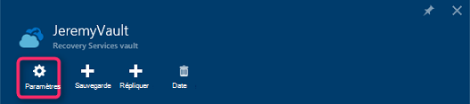

<properties
  pageTitle="Préparer votre environnement pour sauvegarder les charges de travail à l’aide du serveur de sauvegarde Azure | Microsoft Azure"
  description="Préparer votre environnement pour serveur de sauvegarde Azure permet de protéger ou sauvegarder les charges de travail."
  services="backup"
  documentationCenter=""
  authors="PVRK"
  manager="shivamg"
  editor=""
  keywords="serveur de sauvegarde Azure ; protéger les charges de travail ; sauvegarder les charges de travail"/>

<tags
  ms.service="backup"
  ms.workload="storage-backup-recovery"
  ms.tgt_pltfrm="na"
  ms.devlang="na"
  ms.topic="article"
  ms.date="09/27/2016"
  ms.author="jimpark;trinadhk;pullabhk;markgal"/>

# <a name="preparing-to-back-up-workloads-using-azure-backup-server"></a>Préparation de sauvegarder les charges de travail à l’aide du serveur de sauvegarde Azure

> [AZURE.SELECTOR]
- [Serveur de sauvegarde Azure](backup-azure-microsoft-azure-backup.md)
- [SCDPM](backup-azure-dpm-introduction.md)
- [Serveur de sauvegarde Azure (classique)](backup-azure-microsoft-azure-backup-classic.md)
- [SCDPM (classique)](backup-azure-dpm-introduction-classic.md)

Cet article explique comment faire pour préparer votre environnement pour sauvegarder les charges de travail à l’aide du serveur de sauvegarde Azure. Avec le serveur de sauvegarde Azure, vous pouvez protéger des charges de travail tels que des ordinateurs virtuels Hyper-V, Microsoft SQL Server, SharePoint Server, Microsoft Exchange et les clients Windows à partir d’une seule console. Vous pouvez également protéger les informations dans le cadre d’un charges de serveur (IaaS) tels que des machines virtuelles dans Azure.

> [AZURE.NOTE] Azure comporte deux modèles de déploiement pour la création et utilisation des ressources : [Gestionnaire de ressources et classique](../resource-manager-deployment-model.md). Cet article fournit les informations et procédures pour la restauration des machines virtuelles déployées à l’aide du modèle de gestionnaire de ressources.

Serveur de sauvegarde Azure hérite grande partie de la fonctionnalité de sauvegarde de la charge de travail à partir de Data Protection Manager (DPM). Cet article renvoie à la documentation DPM afin d’expliquer certaines des fonctionnalités partagées. Bien que Azure sauvegarde Server pour la plupart de la même fonctionnalité que DPM partage. Azure sauvegarde le serveur ne répond pas sauvegarder sur bande, ni s’intègre avec System Center.

## <a name="1-choose-an-installation-platform"></a>1. Cliquez sur une plateforme d’installation

La première étape vers le serveur de sauvegarde Azure les consiste à configurer Windows Server. Votre serveur peut se trouver dans Azure ou en local.

### <a name="using-a-server-in-azure"></a>À l’aide d’un serveur dans Azure

Lors du choix d’un serveur pour l’exécution de serveur de sauvegarde Azure, il est recommandé de commencer avec une image de la galerie de Windows Server 2012 R2 centre de données. L’article [créer votre première machine virtuelle de Windows dans le portail Azure](..\virtual-machines\virtual-machines-windows-hero-tutorial.md), fournit un didacticiel de mise en route avec la machine virtuelle recommandée dans Azure, même si vous n’avez jamais utilisé Azure avant. La configuration minimale requise recommandée pour le serveur de machine virtuelle (machine virtuelle) doit être : A2 Standard avec 2 cœurs et 3,5 Go de RAM.

Protéger les charges de travail avec le serveur de sauvegarde Azure comporte plusieurs nuances. L’article, [Installer DPM comme une machine virtuelle Azure](https://technet.microsoft.com/library/jj852163.aspx), permet d’expliquer ces nuances. Lisez cet article complètement avant de déployer l’ordinateur.

### <a name="using-an-on-premises-server"></a>Utilisation d’un serveur local

Si vous ne souhaitez pas exécuter le serveur de base dans Azure, vous pouvez exécuter le serveur sur un ordinateur virtuel Hyper-V, un VMware VM ou un hôte physique. La configuration minimale requise recommandée pour le matériel de serveur est 2 cœurs et 4 Go de RAM. Les systèmes d’exploitation pris en charge sont répertoriées dans le tableau suivant.

| Système d'exploitation        | Plateforme           | RÉFÉRENCE (SKU)  |
| :------------- |-------------| :-----|
|Windows Server 2012 R2 et les plus récentes SP| 64 bits| Standard, centre de données, Foundation|
|Windows Server 2012 et les plus récentes SP|    64 bits| Centre de données, Foundation, Standard|
|Stockage de Windows Server 2012 R2 et les plus récentes SP  |64 bits|    Standard, groupe de travail|
|Stockage de Windows Server 2012 et les plus récentes SP |64 bits |Standard, groupe de travail|


Vous pouvez Dédupliquez le stockage DPM à l’aide de Windows Server déduplication. Découvrez comment [DPM et déduplication](https://technet.microsoft.com/library/dn891438.aspx) collaborer lorsque déployée dans ordinateurs virtuels Hyper-V.

> [AZURE.NOTE]  Vous ne pouvez pas installer Azure sauvegarde Server sur un ordinateur exécutant comme contrôleur de domaine.

Vous devez joindre Azure sauvegarde serveur à un domaine. Si vous envisagez de déplacer le serveur vers un autre domaine, il est recommandé de joindre le serveur vers le nouveau domaine avant d’installer le serveur de sauvegarde Azure. Déplacement d’un ordinateur de serveur de sauvegarde Azure existant vers un nouveau domaine après que le déploiement est *pas pris en charge*.

## <a name="2-recovery-services-vault"></a>2. l’archivage sécurisé des Services de récupération

Si vous envoyez des données de sauvegarde à Azure ou conservez localement, le logiciel doit être connecté à Azure. Pour être plus spécifique, l’ordinateur serveur de sauvegarde Azure doit être enregistré par un archivage sécurisé des services de récupération.

Pour créer un archivage sécurisé des services de récupération :

1. Connectez-vous au [portail Azure](https://portal.azure.com/).

2. Dans le menu concentrateur, cliquez sur **Parcourir** , dans la liste des ressources, tapez **Les Services de récupération**. Lorsque vous commencez à taper, la liste filtre selon vos entrées. Cliquez sur **Services de récupération de l’archivage sécurisé**.

     <br/>

    La liste des Services de récupération chambres fortes s’affiche.

3. Dans le menu **chambres fortes Services de récupération** , cliquez sur **Ajouter**.

    

    La carte de l’archivage sécurisé aux Services de récupération s’ouvre et vous invite à fournir un **nom**, un **abonnement**, un **groupe de ressources**et un **emplacement**.

    

4. Pour **nom**, entrez un nom convivial pour identifier l’archivage sécurisé. Le nom doit être unique pour l’abonnement Azure. Tapez un nom qui contient entre 2 et 50 caractères. Il doit commencer par une lettre et peut contenir uniquement des lettres, des chiffres et des traits d’union.

5. Cliquez sur l' **abonnement** pour afficher la liste des abonnements disponibles. Si vous n’êtes pas sûr du type d’abonnement à utiliser, utilisez la valeur par défaut (ou suggérées) abonnement. Il sera plusieurs choix uniquement si votre compte professionnel est associé à plusieurs abonnements Azure.

6. Cliquez sur **groupe de ressources** pour afficher la liste des groupes de ressources disponibles, ou cliquez sur **Nouveau** pour créer un nouveau groupe de ressources. Pour plus d’informations sur les groupes de ressources, voir [vue d’ensemble du Gestionnaire de ressources Azure](../azure-resource-manager/resource-group-overview.md)

7. Cliquez sur l' **emplacement** pour sélectionner la zone géographique pour l’archivage sécurisé.

8. Cliquez sur **créer**. Il peut prendre un certain temps pour l’archivage sécurisé de Services de récupération à créer. Surveiller les notifications d’état dans l’angle supérieur droit dans le portail.
Une fois votre l’archivage sécurisé est créé, il s’ouvre dans le portail.

### <a name="set-storage-replication"></a>Définir la réplication du stockage

L’option de réplication de stockage vous permet de choisir entre geo redondants et stockage localement redondant. Par défaut, votre l’archivage sécurisé comprend un stockage geo redondants. Laissez l’option définie sur stockage geo redondants s’il s’agit de votre sauvegarde principal. Choisissez le stockage localement redondant si vous souhaitez une option plus économique n’est pas tout à fait comme résistant. En savoir plus sur [geo redondants](../storage/storage-redundancy.md#geo-redundant-storage) et options de stockage [localement redondantes](../storage/storage-redundancy.md#locally-redundant-storage) dans [vue d’ensemble de la réplication de stockage Azure](../storage/storage-redundancy.md).

Pour modifier le paramètre de réplication de stockage :

1. Sélectionnez votre l’archivage sécurisé pour ouvrir le tableau de bord de l’archivage sécurisé et la carte de paramètres. Si la carte de **paramètres** ne s’ouvre, cliquez sur **tous les paramètres** dans le tableau de bord de l’archivage sécurisé.

2. Dans la carte de **paramètres** , cliquez sur **Sauvegarde Infrastructure** > **Backup Configuration** pour ouvrir la carte de **Configuration de sauvegarde** . Dans la carte de **Configuration de sauvegarde** , sélectionnez l’option de réplication de stockage pour votre l’archivage sécurisé.

    

    Après avoir choisi l’option de stockage pour votre l’archivage sécurisé, vous êtes prêt à associer la machine virtuelle l’archivage sécurisé. Pour commencer l’association, vous devez découvrir et enregistrer les machines virtuelles Azure.

## <a name="3-software-package"></a>3. package logiciel

### <a name="downloading-the-software-package"></a>Télécharger le package de logiciels
1. Connectez-vous au [portail Azure](https://portal.azure.com/).

2. Si vous avez déjà un service de récupération l’archivage sécurisé est ouvert, passez à l’étape 3. Si vous avez un Services de récupération n’êtes pas vault ouvert, mais se trouvent dans le portail Azure, dans le menu concentrateur, cliquez sur **Parcourir**.

    - Dans la liste des ressources, tapez **Les Services de récupération**.
    - Lorsque vous commencez à taper, la liste filtre selon vos entrées. Lorsque vous voyez **les Services de récupération chambres fortes**, cliquez dessus.

    

    La liste des Services de récupération chambres fortes s’affiche.

    - Dans la liste des Services de récupération chambres fortes, sélectionnez un archivage sécurisé.

    Le tableau de bord sélectionné l’archivage sécurisé s’ouvre.

    

3. Carte de paramètres s’ouvre par défaut. Si elle est fermée, cliquez sur **paramètres** pour ouvrir la carte de paramètres.

    

4. Cliquez sur **sauvegarde** dans **Prise en main** pour ouvrir l’Assistant prise en main.

    

5. Dans la mise en route qui s’ouvre, écran objectifs de sauvegarde sera automatiquement sélectionnés.
    

    Dans la section **objectifs de sauvegarde** , sélectionnez *local* pour *lequel votre charge de travail s’exécute*.

    

6. Sélectionnez les charges de travail que vous souhaitez protéger à l’aide du serveur de sauvegarde Azure dans *les charges de travail à protéger* et cliquez sur **OK**.

    > [AZURE.NOTE] Si vous envisagez de protéger uniquement les fichiers et dossiers, nous recommandons à l’aide de l’agent de sauvegarde Azure. Si vous envisagez de protéger les charges de travail plus que de simples fichiers et dossiers ou à l’avenir si vous envisagez de développer les besoins de protection, sélectionnez toutes les charges de travail.

    Cette opération modifie l’Assistant prise en main pour préparer infrastructure pour la protection des charges de travail locales pour Azure.

    

7. Dans la carte de **préparer infrastructure** qui s’ouvre, cliquez sur les liens de **téléchargement** pour installer le serveur Azure sauvegarde et télécharger les informations d’identification de l’archivage sécurisé. Vous utilisez les informations d’identification de l’archivage sécurisé pendant l’enregistrement de serveur de sauvegarde Azure à l’archivage sécurisé des services de récupération. Les liens vous dirigent vers le centre de téléchargement où le logiciel peut être téléchargé.

    

8. Sélectionnez tous les fichiers et cliquez sur **suivant**. Télécharger tous les fichiers provenant la page de téléchargement Microsoft Azure Backup et à placer tous les fichiers dans le même dossier.

    

    Étant donné que la taille de téléchargement de tous les fichiers est ensemble > 3G, sur un 10 Téléchargez lien que peut prendre jusqu'à 60 minutes pour la fin du téléchargement.


### <a name="extracting-the-software-package"></a>Extraction de l’ensemble de logiciels

Une fois que vous avez téléchargé tous les fichiers, cliquez sur **MicrosoftAzureBackupInstaller.exe**. Démarre l' **Assistant de configuration de Microsoft Azure sauvegarde** pour extraire les fichiers d’installation vers un emplacement spécifié par vous. Poursuivez les étapes de l’Assistant, puis cliquez sur le bouton **Extraire** pour commencer le processus d’extraction.

> [AZURE.WARNING] Au moins 4 Go d’espace libre est requis pour extraire les fichiers d’installation.


Une fois que l’extraction traitez terminée, cochez la case pour lancer la récemment extraite *setup.exe* pour commencer l’installation de Microsoft Azure sauvegarde Server et cliquez sur le bouton **fin** .

### <a name="installing-the-software-package"></a>Installation des logiciels

1. Cliquez sur **Microsoft Azure sauvegarde** pour lancer l’Assistant Configuration.

    

2. Sur l’écran d’accueil, cliquez sur le bouton **suivant** . Cela vous permet d’accéder à la section *Vérifications préalables* . Dans cet écran, cliquez sur le bouton **Vérifier** pour déterminer si les conditions préalables matérielle et logicielle pour serveur de sauvegarde Azure sont remplies. Si toutes les conditions préalables sont ont été satisfaits avec succès, vous verrez un message indiquant que l’ordinateur répond à la configuration requise. Cliquez sur le bouton **suivant** .

    

3. Serveur de sauvegarde de Microsoft Azure nécessite SQL Server Standard, et le package d’installation de serveur de sauvegarde Azure est fourni avec les fichiers binaires SQL Server appropriés nécessaires. Lorsque vous démarrez avec une nouvelle installation de serveur de sauvegarde Azure, vous devez sélectionnez l’option **d’Installation nouvelle Instance de SQL Server avec ce programme d’installation** et cliquez sur le bouton **vérifier et installer** . Une fois que les conditions préalables sont installés avec succès, cliquez sur **suivant**.

    

    En cas de panne avec une recommandation pour redémarrer l’ordinateur, faites-le et cliquez sur **Vérification**.

    > [AZURE.NOTE] Serveur de sauvegarde Azure ne fonctionne pas avec une instance de SQL Server à distance. L’instance utilisé par le serveur de sauvegarde Azure doit être local.

4. Fournir un emplacement pour l’installation de Microsoft Azure sauvegarder les fichiers de serveur, puis cliquez sur **suivant**.

    

    L’emplacement de travail est une obligation pour précédent jusqu'à Azure. Vérifiez que l’emplacement de travail est au moins 5 % des données planifiées à sauvegarder dans le cloud. Pour la protection de disque, des disques distincts doivent être configurés une fois l’installation terminée. Pour plus d’informations sur les pools de stockage, voir [configurer les pools de stockage et le stockage de disque](https://technet.microsoft.com/library/hh758075.aspx).

5. Fournir un mot de passe pour les comptes d’utilisateurs locaux à accès restreint et cliquez sur **suivant**.

    

6. Indiquez si vous souhaitez utiliser *Microsoft Update* pour vérifier les mises à jour et cliquez sur **suivant**.

    >[AZURE.NOTE] Nous vous conseillons Windows Update rediriger vers Microsoft Update, qui offre de sécurité et les mises à jour importantes pour Windows et d’autres produits tels que Microsoft Azure sauvegarde Server.

    

7. Passez en revue le *Résumé des paramètres* , puis cliquez sur **installer**.

    

8. L’installation s’est-il passé dans les phases. Dans la première phase l’Agent de Services Microsoft Azure récupération est installé sur le serveur. L’Assistant vérifie également pour la connectivité Internet. Si la connectivité Internet est disponible procéder à l’installation, si ce n’est pas, vous avez besoin fournir des détails des proxy pour vous connecter à Internet.

    L’étape suivante consiste à configurer l’Agent de Services Microsoft Azure récupération. Dans le cadre de la configuration, vous devrez fournir vos informations d’identification de l’archivage sécurisé pour enregistrer l’ordinateur à l’archivage sécurisé des services de récupération. Vous allez également fournir un mot de passe pour le chiffrement/déchiffrement les données envoyées entre Azure et vos locaux. Vous pouvez automatiquement générer un mot de passe ou fournir votre propre mot de passe 16 caractères minimale. Poursuivez avec l’Assistant jusqu'à ce que l’agent a été configurée.

    

9. Une fois que l’inscription du serveur Microsoft Azure sauvegarde terminée avec succès, l’Assistant de configuration globale passe à l’installation et la configuration de SQL Server et les composants du serveur de sauvegarde Azure. Une fois l’installation du composant SQL Server terminée, les composants de serveur de sauvegarde Azure sont installés.

    


Une fois l’étape de l’installation terminée, les icônes du bureau du produit aura été créés également. Double-cliquez sur l’icône pour lancer le produit.

### <a name="add-backup-storage"></a>Ajouter un stockage de sauvegarde

La première copie de sauvegarde est conservée sur le stockage relié à l’ordinateur serveur de sauvegarde Azure. Pour plus d’informations sur l’ajout de disques, voir [configurer les pools de stockage et le stockage de disque](https://technet.microsoft.com/library/hh758075.aspx).

> [AZURE.NOTE] Vous devez ajouter stockage de sauvegarde, même si vous envisagez d’envoyer des données à Azure. Dans l’architecture actuelle de serveur de sauvegarde Azure, l’archivage sécurisé Azure sauvegarde conserve la *deuxième* copie des données alors que le stockage local conserve la copie de sauvegarde première (et obligatoire).

## <a name="4-network-connectivity"></a>4. la connectivité réseau

Azure sauvegarde serveur nécessite une connexion au service de sauvegarde Azure pour le produit fonctionne correctement. Pour vérifier si l’ordinateur a la connectivité à Azure, utilisez la ```Get-DPMCloudConnection``` applet de commande dans la console Azure sauvegarde serveur PowerShell. Si le résultat de l’applet de commande est vrai, connectivité existe, sinon connectivité n’existe pas.

En même temps, l’abonnement Azure doit se trouver dans un état correct. Pour déterminer l’état de votre abonnement et le gérer, connectez-vous au [portail de l’abonnement]( https://account.windowsazure.com/Subscriptions).

Une fois que vous connaissez l’état de la connectivité Azure et de l’abonnement Azure, vous pouvez utiliser le tableau ci-dessous pour déterminer l’impact sur la fonctionnalité de sauvegarde et de restauration proposée.

| État de connectivité | Abonnement Azure | Sauvegarde vers Azure| Sauvegarde sur disque | Restaurer à partir d’Azure | Restaurer à partir du disque |
| -------- | ------- | --------------------- | ------------------- | --------------------------- | ----------------------- |
| Connecté | Active | Autorisé | Autorisé | Autorisé | Autorisé |
| Connecté | Expiré | Arrêté | Arrêté | Autorisé | Autorisé |
| Connecté | Annulé | Arrêté | Arrêté | Points de récupération arrêté et Azure supprimés | Arrêté |
| Perte de connectivité > 15 jours | Active | Arrêté | Arrêté | Autorisé | Autorisé |
| Perte de connectivité > 15 jours | Expiré | Arrêté | Arrêté | Autorisé | Autorisé |
| Perte de connectivité > 15 jours | Annulé | Arrêté | Arrêté |  Points de récupération arrêté et Azure supprimés | Arrêté |

### <a name="recovering-from-loss-of-connectivity"></a>Récupération contre la perte de connectivité
Si vous avez un pare-feu ou un serveur proxy qui empêche l’accès à Azure, vous devez d’autorisation les adresses de domaine suivantes dans le profil de pare-feu/proxy :

- www.msftncsi.com
- \*. Microsoft.com
- \*. WindowsAzure.com
- \*. microsoftonline.com
- \*. Windows.NET

Une fois la connectivité à Azure a été restaurée sur l’ordinateur serveur de sauvegarde Azure, les opérations qui peuvent être exécutées sont déterminées par l’état d’abonnement Azure. Le tableau ci-dessus comporte plus d’informations sur les opérations autorisées une fois que l’ordinateur est « connecté ».

### <a name="handling-subscription-states"></a>Gestion des États de l’abonnement

Il est possible d’utiliser un abonnement Azure d’un état *expiré* ou *Deprovisioned* à l’état *actif* . Ceci a toutefois certaines conséquences sur le comportement du produit alors que l’état n’est pas *actif*:

- Un abonnement *Deprovisioned* perd la fonctionnalité pour la période Il est annulé. Sur la sélection *Active*, les fonctionnalités de produit de sauvegarde et de restauration sont réactivée. Les données de sauvegarde sur le disque local peuvent également être récupérées si elle a été conservé avec une période de rétention suffisante. Toutefois, les données de sauvegarde dans Azure sont définitivement perdues une fois que l’abonnement passe à l’état *Deprovisioned* .
- Un abonnement *expiré* perd uniquement la fonctionnalité pour jusqu'à ce qu’il a été rendu *actif* à nouveau. Toutes les sauvegardes planifiées pour la période que l’abonnement a *expiré* ne fonctionnera pas.


## <a name="troubleshooting"></a>Résolution des problèmes

Si le serveur de sauvegarde de Microsoft Azure échoue avec les erreurs pendant la phase d’installation (ou sauvegarde ou restauration), reportez-vous à ce [document de codes d’erreur](https://support.microsoft.com/kb/3041338) pour plus d’informations.
Vous pouvez également faire référence à [Qu'azure sauvegarde liés à des questions fréquentes](backup-azure-backup-faq.md)


## <a name="next-steps"></a>Étapes suivantes

Vous pouvez obtenir des informations détaillées concernant la [Préparation de votre environnement pour DPM](https://technet.microsoft.com/library/hh758176.aspx) sur le site Microsoft TechNet. Il contienne également des informations sur les configurations prises en charge sur lequel Azure sauvegarde Server peut être déployée et utilisée.

Vous pouvez utiliser ces articles pour mieux comprendre de protection de la charge de travail à l’aide de serveur de Microsoft Azure sauvegarde.

- [Sauvegarde SQL Server](backup-azure-backup-sql.md)
- [SharePoint server sauvegarde](backup-azure-backup-sharepoint.md)
- [Sauvegarde de serveur de remplacement](backup-azure-alternate-dpm-server.md)
