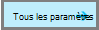
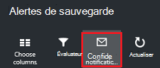
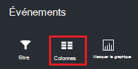

<properties
   pageTitle="Des sauvegardes déployé Gestionnaire de ressources moniteur virtual machine | Microsoft Azure"
   description="Surveiller les événements et les alertes à partir de sauvegardes déployé le Gestionnaire de ressources des machines virtuelles. Envoyer des messages électroniques en fonction des alertes."
   services="backup"
   documentationCenter="dev-center-name"
   authors="markgalioto"
   manager="cfreeman"
   editor=""/>

<tags
ms.service="backup"
ms.workload="storage-backup-recovery"
ms.tgt_pltfrm="na"
ms.devlang="na"
ms.topic="article"
ms.date="08/25/2016"
ms.author="trinadhk; giridham;"/>

# <a name="monitor-alerts-for-azure-virtual-machine-backups"></a>Surveiller les alertes des sauvegardes Azure machine virtuelle

Alertes sont des réponses à partir du service qu’un seuil d’événement a été remplie ou dépassé. Savoir quand les problèmes début peut être indispensable pour limiter les coûts d’entreprise vers le bas. Alertes ne se produisent généralement pas sur une planification, et ainsi qu’il est utile de prendre dès que possible après que alertes se produisent. Par exemple, lorsqu’un travail de sauvegarde ou la restauration échoue, une alerte se produit au sein de cinq minutes de l’échec. Dans le tableau de bord de l’archivage sécurisé, la vignette de sauvegarde alertes affiche les événements critique et niveau d’avertissement. Dans les paramètres d’alertes de sauvegarde, vous pouvez afficher tous les événements. Mais que faire si une alerte se produit lorsque vous travaillez sur un problème différent ? Si vous ne savez pas lorsque l’alerte se produit, cela peut s’expliquer un désagréments secondaires, ou il pourrait compromettre les données. Pour vous assurer que les personnes autorisées connaissent une alerte - lorsqu’il se produit, configurez le service pour envoyer des notifications par courrier électronique. Pour plus d’informations sur la configuration des notifications par courrier électronique, voir [configurer les notifications](backup-azure-monitor-vms.md#configure-notifications).

## <a name="how-do-i-find-information-about-the-alerts"></a>Comment trouver des informations sur les alertes ?

Pour afficher des informations sur l’événement qui a levé une alerte, vous devez ouvrir la carte de sauvegarde alertes. Il existe deux façons d’ouvrir la carte de sauvegarde alertes : les alertes de sauvegarde de la vignette dans le tableau de bord de l’archivage sécurisé, ou à partir de la carte d’événements et les alertes.

Pour ouvrir la carte de sauvegarde alertes à partir de sauvegarde alertes mosaïque :

- Sur la vignette **d’Alertes de sauvegarde** dans le tableau de bord de l’archivage sécurisé, cliquez sur **critique** ou **Avertissement** pour afficher les événements pour ce niveau gravité opérationnels.

    


Pour ouvrir la carte de sauvegarde alertes à partir de la carte alertes et les événements :

1. Dans le tableau de bord de l’archivage sécurisé, cliquez sur **Tous les paramètres**. 

2. Dans la carte de **paramètres** , cliquez sur **alertes et des événements**. 

3. Dans la carte **événements et les alertes** , cliquez sur **Alertes de sauvegarde**. 

    La carte de **Sauvegarde alertes** s’ouvre et affiche les alertes filtrées.

    

4. Pour afficher des informations détaillées sur une alerte, dans la liste des événements, cliquez sur l’alerte pour ouvrir sa carte de **Détails** .

    

    Pour personnaliser les attributs affichés dans la liste, voir [Afficher les attributs d’événements](backup-azure-monitor-vms.md#view-additional-event-attributes)

## <a name="configure-notifications"></a>Configurer les notifications

 Vous pouvez configurer le service pour envoyer des notifications par courrier électronique pour les alertes qui se sont produites sur les heures passées, ou lorsque des types d’événements se produisent.

Pour configurer les notifications par courrier électronique pour les alertes

1. Dans le menu alertes de sauvegarde, cliquez sur **configurer les notifications**

    

    La carte de notifications configurer s’ouvre.

    

2. Sur la carte de notifications configurer, pour les notifications par courrier électronique, cliquez **sur**.

    Les destinataires et la gravité boîtes de dialogue possèdent une étoile en regard, car ces informations sont requises. Fournir l’adresse de messagerie au moins une, puis sélectionnez au moins une gravité.

3. Dans la boîte de dialogue **destinataires (courrier électronique)** , tapez les adresses de messagerie pour qui reçoivent les notifications. Utilisez le format : username@domainname.com. Séparez plusieurs adresses de messagerie par un point-virgule ( ;).

4. Dans la zone de **notification** , choisissez **Par alerte** pour envoyer une notification lorsque l’alerte indiquée se produit ou **Résumé horaire** afin d’envoyer une synthèse pour la dernière heure.

5. Dans la boîte de dialogue **gravité** , sélectionnez un ou plusieurs niveaux que vous souhaitez déclencher notification par courrier électronique.

6. Cliquez sur **Enregistrer**.
### <a name="what-alert-types-are-available-for-azure-iaas-vm-backup"></a>Quels types d’alerte sont disponibles pour la sauvegarde machine virtuelle IaaS Azure ?
| Niveau d’alerte  | Alertes envoyées |
| ------------- | ------------- |
| Critique | Échec de la sauvegarde, Échec de la récupération  |
| Avertissement  | Aucun |
| D’information  | Aucun  |

### <a name="are-there-situations-where-email-isnt-sent-even-if-notifications-are-configured"></a>Existe-t-il des situations où les messages n’est pas envoyés même si les notifications sont configurées ?

Il existe des situations où une alerte n’est pas envoyée, même si les notifications ont été correctement configurées. Dans le message électronique situations suivantes notifications ne sont pas envoyées pour éviter de fond alerte :

- Si les notifications sont configurées pour toutes les heures de résumé, et une alerte est élevée et résolue dans l’heure.
- Le travail est annulé.
- Une opération de sauvegarde se déclenche et puis échoue, et une autre tâche sauvegarde est en cours.
- Démarre une sauvegarde planifiée pour une machine virtuelle compatibles avec le Gestionnaire de ressources, mais la machine virtuelle n’existe plus.

## <a name="customize-your-view-of-events"></a>Personnaliser l’affichage des événements

Le paramètre **journaux d’Audit** est fourni avec un jeu de filtres et les colonnes qui affiche les informations d’événement opérationnelles prédéfini. Vous pouvez personnaliser l’affichage de sorte que lorsque la carte **d’événements** s’ouvre, elle affiche les informations souhaitées.

1. Dans le [tableau de bord de l’archivage sécurisé](./backup-azure-manage-vms.md#open-a-recovery-services-vault-in-the-dashboard), recherchez et cliquez sur les **Journaux d’Audit** pour ouvrir la carte **d’événements** .

    

    La carte **d’événements** s’ouvre sur les événements opérationnelles filtrés uniquement pour l’archivage sécurisé en cours.

    

    La carte affiche la liste des tâches critiques, erreur, avertissement et événements d’information qui s’est produite lors de la semaine dernière. L’intervalle de temps est une valeur par défaut définie dans le **filtre**. La carte **événements** affiche également un graphique à barres suivi lorsque les événements s’est produite. Si vous ne voulez pas voir le graphique à barres, dans le menu **d’événements** , cliquez sur **Masquer le graphique** pour activer / désactiver le graphique. L’affichage par défaut des événements affiche des informations opération, niveau, état, ressources et heure. Pour plus d’informations sur l’exposition des attributs événement supplémentaires, consultez la section [développement d’informations sur l’événement](backup-azure-monitor-vms.md#view-additional-event-attributes).

2. Pour plus d’informations sur un événement opérationnel, dans la colonne **opération** , cliquez sur un événement opérationnel pour ouvrir sa carte. La carte contient des informations détaillées sur les événements. Événements sont regroupées par leur ID de corrélation et une liste des événements qui se sont produites dans l’intervalle de temps.

    

3. Pour afficher des informations détaillées sur un événement particulier, dans la liste des événements, cliquez sur l’événement pour ouvrir sa carte de **Détails** .

    

    Les informations au niveau de l’événement soient aussi détaillées qu’Obtient les informations. Si vous préférez afficher autant d’informations sur chaque événement et que vous souhaitez pour ajouter autant de détails de la carte **d’événements** , consultez la section [développement d’informations sur l’événement](backup-azure-monitor-vms.md#view-additional-event-attributes).


## <a name="customize-the-event-filter"></a>Personnaliser le filtre d’événements
Utiliser le **filtre** pour ajuster ou sélectionnez les informations qui s’affiche dans une carte spécifique. Pour filtrer les informations d’événement :

1. Dans le [tableau de bord de l’archivage sécurisé](./backup-azure-manage-vms.md#open-a-recovery-services-vault-in-the-dashboard), recherchez et cliquez sur les **Journaux d’Audit** pour ouvrir la carte **d’événements** .

    

    La carte **d’événements** s’ouvre sur les événements opérationnelles filtrés uniquement pour l’archivage sécurisé en cours.

    

2. Dans le menu **d’événements** , cliquez sur **filtre** pour ouvrir cette carte.

    

3. Dans la carte de **filtre** , ajustez les filtres **au niveau** **d’intervalle de temps**et **l’appelant** . Les autres filtres ne sont pas disponibles dans la mesure où ils ont été définies pour fournir les informations actuelles pour l’archivage sécurisé aux Services de récupération.

    

    Vous pouvez spécifier le **niveau** d’événement : critique, erreur, avertissement ou information. Vous pouvez choisir n’importe quelle combinaison de niveaux d’événement, mais vous devez disposer au moins un niveau sélectionné. Activer ou désactiver le le niveau. Le filtre **d’intervalle de temps** permet de spécifier la durée pour capturer des événements. Si vous utilisez un intervalle de temps personnalisé, vous pouvez définir les heures de début et de fin.

4. Une fois que vous êtes prêt aux journaux d’opérations à l’aide de votre filtre de la requête, cliquez sur **mettre à jour**. Les résultats s’affichent dans la carte **d’événements** .

    


### <a name="view-additional-event-attributes"></a>Afficher les attributs d’événements
En utilisant le bouton **colonnes** , vous pouvez activer les attributs d’événement supplémentaires doivent apparaître dans la liste sur la carte **d’événements** . La liste par défaut des événements affiche des informations pour l’opération, niveau, état, ressources et heure. Pour activer les attributs supplémentaires :

1. Dans la carte **d’événements** , cliquez sur **colonnes**.

    

    La carte de **Choisir les colonnes** s’ouvre.

    

2. Pour sélectionner l’attribut, cliquez sur la case à cocher. La case à cocher attribut peut être activée ou désactivée.

3. Cliquez sur **Réinitialiser** pour rétablir la liste des attributs de la carte **d’événements** . Après l’ajout ou suppression des attributs de la liste, utilisez **Réinitialiser** pour afficher la nouvelle liste des attributs de l’événement.

4. Cliquez sur **mettre à jour** pour mettre à jour les données dans les attributs d’événement. Le tableau suivant fournit des informations relatives à chaque attribut.

| Nom de colonne      |Description|
| -----------------|-----------|
| Opération|Le nom de l’opération|
| Niveau|Le niveau de l’opération, les valeurs peuvent être : d’information, d’avertissement, d’erreur ou critique|
|État|État descriptif de l’opération|
|Ressource|URL qui identifie la ressource ; également connue sous l’ID de ressource|
|Heure|Durée, mesurée à partir de l’heure actuelle, lorsque l’événement s’est produite|
|Appelant|Qui ou qu’appelé ou a déclenché l’événement ; peut être le système ou un utilisateur|
|Horodatage|Lors du déclenchée de l’événement|
|Groupe de ressources|Le groupe de ressources associées|
|Type de ressource|Le type de ressource interne utilisé par le Gestionnaire de ressources|
|ID de l’abonnement|L’ID de l’abonnement associé|
|Catégorie|Catégorie de l’événement|
|ID de corrélation|ID courantes pour les événements liés|


## <a name="use-powershell-to-customize-alerts"></a>Utiliser PowerShell pour personnaliser les alertes
Vous pouvez obtenir des notifications d’alerte personnalisées pour les tâches dans le portail. Pour obtenir ces tâches, définir des règles d’alerte PowerShell sur les événements de journaux des opérations. Utiliser *PowerShell version version 1.3.0 ou version ultérieure*.

Pour définir une notification personnalisée pour alerter les échecs de sauvegarde, utilisez une commande tel que le suivant :

```
PS C:\> $actionEmail = New-AzureRmAlertRuleEmail -CustomEmail contoso@microsoft.com
PS C:\> Add-AzureRmLogAlertRule -Name backupFailedAlert -Location "East US" -ResourceGroup RecoveryServices-DP2RCXUGWS3MLJF4LKPI3A3OMJ2DI4SRJK6HIJH22HFIHZVVELRQ-East-US -OperationName Microsoft.Backup/RecoveryServicesVault/Backup -Status Failed -TargetResourceId /subscriptions/86eeac34-eth9a-4de3-84db-7a27d121967e/resourceGroups/RecoveryServices-DP2RCXUGWS3MLJF4LKPI3A3OMJ2DI4SRJK6HIJH22HFIHZVVELRQ-East-US/providers/microsoft.backupbvtd2/RecoveryServicesVault/trinadhVault -Actions $actionEmail
```

**ResourceId** : vous pouvez obtenir ResourceId dans les journaux d’Audit. Le ResourceId est une URL fournie dans la colonne ressource des journaux opération.

**NomOpération** : NomOpération est au format « Microsoft.RecoveryServices/recoveryServicesVault/*EventName*» où *EventName* peut être :<br/>
- S’inscrire <br/>
- Annuler l’enregistrement <br/>
- ConfigureProtection <br/>
- Sauvegarde <br/>
- Restaurer <br/>
- StopProtection <br/>
- DeleteBackupData <br/>
- CreateProtectionPolicy <br/>
- DeleteProtectionPolicy <br/>
- UpdateProtectionPolicy <br/>

**État** : valeurs prises en charge sont mise en route, réussite ou échec.

**ResourceGroup** : il s’agit du groupe de ressources à laquelle la ressource appartient. Vous pouvez ajouter la colonne du groupe de ressources pour les journaux générées. Groupe de ressources figure parmi les types d’informations sur les événements disponibles.

**Nom** : nom de la règle d’alerte.

**CustomEmail** : spécifier l’adresse de messagerie personnalisé auquel vous voulez envoyer une notification d’alerte

**SendToServiceOwners** : cette option envoie des notifications d’alerte à tous les administrateurs et coadministrateurs de l’abonnement. Il peut être utilisé dans l’applet de commande **New-AzureRmAlertRuleEmail**

### <a name="limitations-on-alerts"></a>Limitations des alertes
Alertes basées sur les événements sont soumis aux limitations suivantes :

1. Des alertes sont déclenchées sur toutes les machines virtuelles dans l’archivage sécurisé aux Services de récupération. Vous ne pouvez pas personnaliser l’alerte pour un sous-ensemble des machines virtuelles dans un archivage sécurisé aux Services de récupération.
2. Cette fonctionnalité est en mode Aperçu. [Pour en savoir plus](../monitoring-and-diagnostics/insights-powershell-samples.md#create-alert-rules)
3. Alertes sont envoyées à partir de "alerts-noreply@mail.windowsazure.com". Actuellement, vous ne pouvez pas modifier l’expéditeur de courrier électronique.


## <a name="next-steps"></a>Étapes suivantes

Les journaux d’événements activer excellent post-mortem et d’audit prise en charge pour les opérations de sauvegarde. Les opérations suivantes sont enregistrées :

- S’inscrire
- Annuler l’enregistrement
- Configurer la protection
- Sauvegarde (les deux planifiées ainsi que de sauvegarde à la demande)
- Restaurer
- Arrêter la protection
- Supprimer les données de sauvegarde
- Ajouter une stratégie
- Supprimer la stratégie
- Stratégie de mise à jour
- Annuler le travail

Pour obtenir une explication large d’événements, opérations et des journaux d’audit sur les services Azure, voir l’article, [Afficher les événements et les journaux d’audit](../monitoring-and-diagnostics/insights-debugging-with-events.md).

Pour plus d’informations sur la création d’une machine virtuelle à partir d’un point de récupération, consultez [Restaurer des machines virtuelles Azure](backup-azure-restore-vms.md). Si vous avez besoin d’informations sur la protection de vos machines virtuelles, voir [tout d’abord rechercher : sauvegarder des machines virtuelles à un archivage sécurisé aux Services de récupération](backup-azure-vms-first-look-arm.md). En savoir plus sur les tâches de gestion des sauvegardes machine virtuelle dans l’article, [des sauvegardes machine virtuelle Azure gérer](backup-azure-manage-vms.md).
