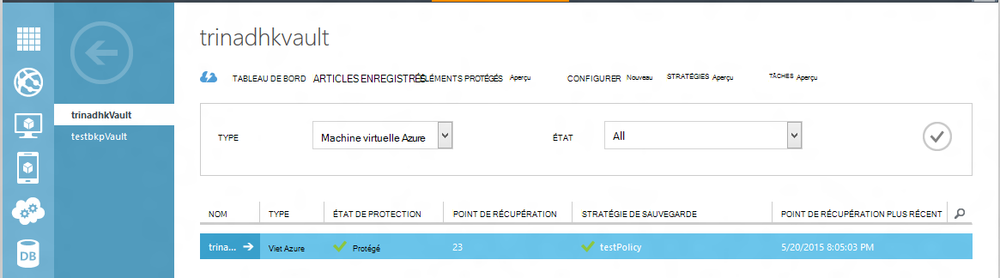
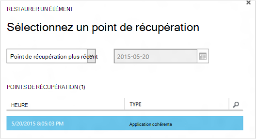
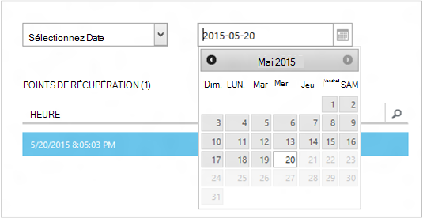
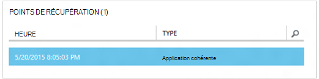
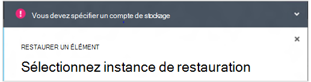
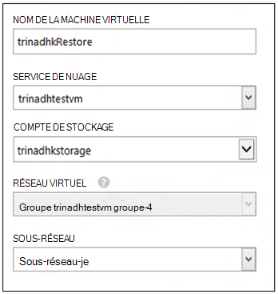
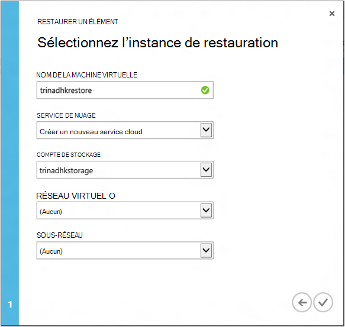
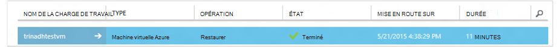

<properties
    pageTitle="Restaurer un machines virtuelles à partir de sauvegarde | Microsoft Azure"
    description="Découvrez comment restaurer une machine virtuelle Azure à partir d’un point de récupération"
    services="backup"
    documentationCenter=""
    authors="trinadhk"
    manager="shreeshd"
    editor=""
    keywords="restaurer la sauvegarde ; Comment restaurer ; point de récupération ;"/>

<tags
    ms.service="backup"
    ms.workload="storage-backup-recovery"
    ms.tgt_pltfrm="na"
    ms.devlang="na"
    ms.topic="article"
    ms.date="08/02/2016"
    ms.author="trinadhk; jimpark;"/>

# Restaurer des machines virtuelles dans Azure

> [AZURE.SELECTOR]
- [Restaurer des machines virtuelles dans le portail Azure](backup-azure-arm-restore-vms.md)
- [Restaurer des machines virtuelles dans le portail classique](backup-azure-restore-vms.md)

Restaurer une machine virtuelle sur une nouvelle machine virtuelle à partir des sauvegardes stockées dans un archivage sécurisé sauvegarde Azure aux étapes suivantes.

## Restaurer des flux de travail

### 1. Cliquez sur un élément à restaurer

1. Accédez à l’onglet **Éléments protégés** et sélectionnez la machine virtuelle que vous souhaitez restaurer vers un nouvel ordinateur virtuel.

    

    La colonne de **Point de récupération** dans la page **Éléments protégé** vous indiquer le nombre de points de récupération pour une machine virtuelle. La colonne de **Point de récupération plus récent** indique l’heure de la sauvegarde la plus récente à partir de laquelle une machine virtuelle peuvent être restaurée.

2. Cliquez sur **restaurer** pour ouvrir l’Assistant **restaurer un élément** .

    

### 2. Choisissez un point de récupération

1. Dans l’écran **Sélectionner un point de récupération** , vous pouvez restaurer à partir du point de récupération plus récent ou d’un point précédent dans le temps. L’option par défaut sélectionnée lorsque l’Assistant s’ouvre est un *Point de récupération plus récent*.

    

2. Pour sélectionner un point antérieur dans le temps, choisissez l’option **Sélectionner une Date** dans la liste déroulante et sélectionnez une date dans le contrôle calendrier en cliquant sur l' **icône de calendrier**. Dans le contrôle, toutes les dates qui ont des points de récupération sont remplis avec un dégradé de gris clair et peuvent être sélectionnés par l’utilisateur.

    

    Une fois que vous cliquez sur une date dans le contrôle calendrier, la récupération des points disponibles sur que date est affichée dans le tableau de points de récupération ci-dessous. La colonne **heure** indique l’heure à laquelle l’instantané. La colonne **Type** affiche la [cohérence](https://azure.microsoft.com/documentation/articles/backup-azure-vms/#consistency-of-recovery-points) du point de récupération. L’en-tête de tableau affiche le nombre de points de récupération disponibles sur ce jour entre parenthèses.

    

3. Sélectionnez le point de récupération à partir de la table de **Points de récupération** , puis cliquez sur la flèche suivant pour accéder à l’écran suivant.

### 3. Indiquez un emplacement de destination

1. Dans l’écran **Sélectionner restaurer instance** spécifier où restaurer la machine virtuelle.

  - Indiquez le nom de la machine virtuelle : dans un service cloud donnée, le nom de la machine virtuelle doit être unique. Nous ne prend pas en charge écraser machine virtuelle existante. 
  - Sélectionnez un service cloud pour la machine virtuelle : ce champ est obligatoire pour la création d’un ordinateur virtuel. Vous pouvez soit utiliser un service cloud existant ou créer un nouveau service cloud.

        Whatever cloud service name is picked should be globally unique. Typically, the cloud service name gets associated with a public-facing URL in the form of [cloudservice].cloudapp.net. Azure will not allow you to create a new cloud service if the name has already been used. If you choose to create select create a new cloud service, it will be given the same name as the virtual machine – in which case the VM name picked should be unique enough to be applied to the associated cloud service.

        We only display cloud services and virtual networks that are not associated with any affinity groups in the restore instance details. [Learn More](../virtual-network/virtual-networks-migrate-to-regional-vnet.md).

2. Sélectionnez un compte de stockage pour la machine virtuelle : ce champ est obligatoire pour la création de la machine virtuelle. Vous pouvez sélectionner des comptes de stockage existants dans la même région en tant que l’archivage sécurisé sauvegarde Azure. Nous ne prend en charge les comptes de stockage qui sont redondantes ou de type de stockage Premium.

    S’il n’existe aucun compte de stockage avec configuration prise en charge, créez un compte de stockage de configuration prise en charge avant de commencer l’opération de restauration.

    

3. Sélectionnez un réseau virtuel : le réseau virtuel (VNET) pour la machine virtuelle doit déjà être sélectionné au moment de la création de la machine virtuelle. La restaurer l’interface utilisateur affiche tous les VNETs au sein de cet abonnement pouvant être utilisées. Il n’est pas obligatoire pour sélectionner un VNET pour la machine virtuelle restaurée : vous ne pourrez pas vous connecter à la machine virtuelle restaurée via internet même si le VNET n’est pas appliqué.

    Si le service cloud sélectionné est associé à un réseau virtuel, vous ne pouvez pas modifier le réseau virtuel.

    

4. Sélectionner un sous-réseau : au cas où la VNET a sous-réseaux, le premier sous-réseau est sélectionné par défaut. Choisissez le sous-réseau de votre choix parmi les options de liste déroulante. Pour plus d’informations sous-réseau, accédez à extension de réseaux dans la [page d’accueil du portail](https://manage.windowsazure.com/), accédez à **Des réseaux virtuels** et sélectionnez le réseau virtuel et Explorer les configurer pour afficher les détails du sous-réseau.

    

5. Cliquez sur l’icône **Envoyer** de l’Assistant pour soumettre les détails et de créer une tâche de restauration.

## Effectuer le suivi de l’opération de restauration
Une fois que vous avez entrée toutes les informations dans l’Assistant Restauration et soumis Azure sauvegarde essaiera de créer une tâche pour effectuer le suivi de l’opération de restauration.

Si la création d’une tâche terminée, vous verrez une notification toast indiquant que le travail est créé. Vous pouvez obtenir plus de détails en cliquant sur le bouton **Afficher la tâche** qui vous accédez alors à l’onglet **tâches** .

Une fois la restauration terminée, il est marqué comme étant terminée dans l’onglet **tâches** .

Après la restauration de la machine virtuelle, vous devrez peut-être réinstaller les extensions existant sur la machine virtuelle d’origine et [Modifier les points de terminaison](../virtual-machines/virtual-machines-windows-classic-setup-endpoints.md) de la machine virtuelle dans le portail Azure.

## Règles postérieures à la restaurer étapes
Si vous utilisez une distribution Linux en fonction de cloud-initialisation comme Ubuntu, pour des raisons de sécurité, mot de passe est bloquée publier restaurer. Utilisez l’extension VMAccess sur l’ordinateur restauré virtuel pour [Réinitialiser le mot de passe](../virtual-machines/virtual-machines-linux-classic-reset-access.md). Nous recommandons d’utiliser des clés SSH sur ces répartitions pour éviter la réinitialisation de mot de passe billet restaurer. 

## Sauvegarde pour les machines virtuelles restaurés
Si vous avez restauré machine virtuelle au service cloud même portant le même nom que sauvegardé machine virtuelle, sauvegarde continue sur la restauration de billet machine virtuelle. Si vous avez restauré machine virtuelle à un service de nuage différent ou spécifié un autre nom pour machine virtuelle restauré, il sera traité comme une machine virtuelle et vous devez sauvegarde le programme d’installation pour machine virtuelle restauré.

## Restaurer une machine virtuelle pendant Azure sinistre centre de données
Sauvegarde Azure permet de restauration sauvegardés machines virtuelles au centre de données appariés au cas où les données principales centrer où machines virtuelles exécutez expériences urgence et que vous avez configuré l’archivage sécurisé sauvegarde pour être geo redondants. Au cours de ces scénarios, vous devez sélectionner un compte de stockage qui se trouve dans le centre de données pour et reste du processus de restauration reste la même. Sauvegarde Azure utilise le service cluster du geo pour créer la machine virtuelle restaurée. 

## Machines virtuelles contrôleur de domaine en cours de restauration
Sauvegarde des machines virtuelles contrôleur de domaine (DC) est un scénario pris en charge avec Azure sauvegarde. Toutefois certaines prudence pendant le processus de restauration. L’expérience de restaurer est très différente pour les machines virtuelles contrôleur de domaine dans une configuration unique-DC et machines virtuelles dans une configuration multi-DC.

### Contrôleur de domaine unique
La machine virtuelle peut être restaurée (par exemple, machine virtuelle) à partir de la Azure portail ou à l’aide de PowerShell.

### Plusieurs DC
Lorsque vous avez un environnement multi-DC, le domaine a ses propres de synchronisation des données. Lorsqu’un point de sauvegarde antérieur est restauré *sans pris les précautions adéquates*, processus de restauration USN The peuvent entraîner des problèmes dans un environnement multi-DC. Comment récupérer ce une machine virtuelle est pour qu’il démarre en mode DSRM.

Le problème se pose parce qu’en mode DSRM ne figure pas dans Azure. Donc pour restaurer ce une machine virtuelle, vous ne pouvez pas utiliser le portail Azure. Prise en charge uniquement restaurer mécanisme est restaurer sur le disque à l’aide de PowerShell.

>[AZURE.WARNING] Pour les contrôleur de domaine machines virtuelles dans un environnement multi-DC, n’utilisez pas le portail Azure pour restaurer ! Uniquement restaurer PowerShell basée est pris en charge

En savoir plus sur le [problème de restauration USN](https://technet.microsoft.com/library/dd363553) et les stratégies suggérées résoudre le problème.

## Restauration d’ordinateurs virtuels avec configurations réseau spécial
Sauvegarde Azure prend en charge la sauvegarde pour suivre les configurations réseau spécial des machines virtuelles.

- Machines virtuelles sous équilibrage de charge (interne et externe)
- Machines virtuelles avec plusieurs adresses IP réservé
- Machines virtuelles avec plusieurs cartes réseau

Ces configurations imposent la suite de considérations lors de la restauration.

>[AZURE.TIP] Flux de restauration de PowerShell en fonction permet de recréer la configuration réseau spécial des machines virtuelles billet restaurer.

### Restauration de l’interface utilisateur :
Lors de la restauration de l’interface utilisateur, **Sélectionnez toujours un service en nuage**. Notez que dans la mesure où portail prend uniquement obligatoire paramètres pendant le déroulement de restauration, machines virtuelles restaurés à l’aide de l’interface utilisateur seront perdues la configuration du réseau spécial que dont ils disposent. En d’autres termes, restaurer machines virtuelles sera normales machines virtuelles sans configuration d’équilibrage de charge ou à plusieurs carte réseau ou plusieurs adresses IP réservé.

### Restauration de PowerShell :
PowerShell a la possibilité de restaurer les disques machine virtuelle à partir de sauvegarde et la machine virtuelle n’a pas créer. Cette opération est utile lorsque vous restaurez machines virtuelles qui nécessitent réseau spécial configurations mentined ci-dessus.

Pour recréer entièrement disques restauration billet machine virtuelle, procédez comme suit :

1. Restaurer les disques de l’archivage sécurisé sauvegarde à l’aide de [PowerShell sauvegarde Azure](../backup-azure-vms-classic-automation.md#restore-an-azure-vm)

2. Créer la configuration de la machine virtuelle requise pour équilibrage de charge / plusieurs IP réservées multiple/carte réseau à l’aide d’utiliser les applets de commande PowerShell pour créer la machine virtuelle de vous le souhaitez configuration.
    - Créer des machines virtuelles dans un service cloud avec [équilibrage de charge interne](https://azure.microsoft.com/documentation/articles/load-balancer-internal-getstarted/)
    - Créer la machine virtuelle pour vous connecter à [Internet facing équilibrage de charge] (https://azure.microsoft.com/en-us/documentation/articles/load-balancer-internet-getstarted/)
    - Créer des machines virtuelles avec [plusieurs cartes réseau](https://azure.microsoft.com/documentation/articles/virtual-networks-multiple-nics/)
    - Créer des machines virtuelles avec [plusieurs adresses IP réservé](https://azure.microsoft.com/documentation/articles/virtual-networks-reserved-public-ip/)

## Étapes suivantes
- [Résolution des erreurs](backup-azure-vms-troubleshoot.md#restore)
- [Gérer des machines virtuelles](backup-azure-manage-vms.md)
