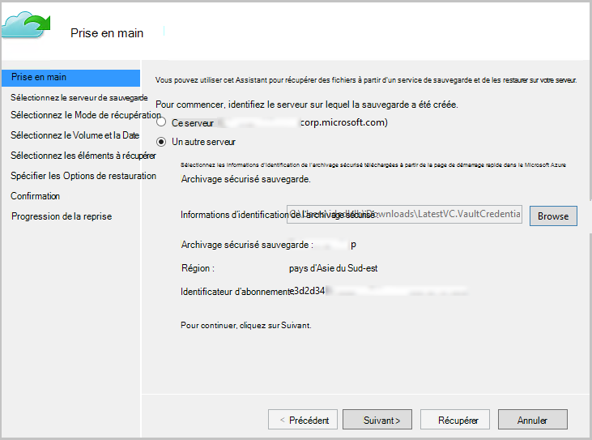

<properties
   pageTitle="Restaurer les données sur un serveur Windows ou d’un Client Windows Azure à l’aide du modèle de déploiement Gestionnaire de ressources | Microsoft Azure"
   description="Découvrez comment restaurer à partir d’un Client de Windows ou Windows Server."
   services="backup"
   documentationCenter=""
   authors="saurabhsensharma"
   manager="shivamg"
   editor=""/>

<tags
   ms.service="backup"
   ms.workload="storage-backup-recovery"
     ms.tgt_pltfrm="na"
     ms.devlang="na"
     ms.topic="article"
     ms.date="08/02/2016"
     ms.author="trinadhk; jimpark; markgal;"/>

# Restaurer des fichiers sur un serveur de Windows ou un ordinateur client Windows à l’aide du modèle de déploiement Gestionnaire de ressources

> [AZURE.SELECTOR]
- [Portail Azure](backup-azure-restore-windows-server.md)
- [Portail classique](backup-azure-restore-windows-server-classic.md)

Cet article décrit les étapes nécessaires pour effectuer les deux types d’opérations de restauration :

- Restaurer les données sur le même ordinateur à partir duquel les sauvegardes effectuées.
- Restaurer les données à n’importe quel autre ordinateur.

Dans les deux cas, les données soient récupérées à partir de l’archivage sécurisé Azure récupération Services.

[AZURE.INCLUDE [learn-about-deployment-models](../../includes/learn-about-deployment-models-rm-include.md)]modèle de déploiement classique.

## Récupérer des données à un même ordinateur
Si vous accidentellement supprimé un fichier et que vous souhaitez restaurer sur le même ordinateur (à partir de laquelle la sauvegarde est considérée), les étapes suivantes vous aidera à récupérer les données.

1. Ouvrez le composant logiciel enfichable **Microsoft Azure sauvegarde** .
2. Cliquez sur **Récupérer les données** pour démarrer le flux de travail.

    

3. Sélectionnez le * *ce serveur (*yourmachinename*) ** option pour restaurer la sauvegardé fichier sur le même ordinateur.

    

4. Choisir de **Rechercher des fichiers** ou **Rechercher des fichiers**.

    Laissez l’option par défaut si vous souhaitez restaurer un ou plusieurs fichiers dont le chemin est connu. Si vous êtes pas sûr de la structure du dossier mais que vous voulez rechercher un fichier, sélectionnez l’option de **recherche pour les fichiers** . Dans cette section, nous continuera avec l’option par défaut.

    

5. Sélectionnez le volume à partir duquel vous voulez restaurer le fichier.

    Vous pouvez restaurer à partir de n’importe quel point dans le temps. Dates qui apparaissent en **gras** dans le contrôle calendrier indiquant la disponibilité d’un point de restauration. Une fois qu’une date est sélectionnée, en fonction de votre planification de la sauvegarde (et la réussite d’une opération de sauvegarde), vous pouvez sélectionner un point à partir de la liste déroulante **heure** vers le bas.

    

6. Sélectionnez les éléments à récupérer. Vous pouvez sélectionner plusieurs dossiers/fichiers que vous souhaitez restaurer.

    

7. Spécifier les paramètres de récupération.

    

  - Vous avez une possibilité de restaurer à l’emplacement d’origine (dans lequel le fichier/dossier seraient remplacé) ou vers un autre emplacement dans le même ordinateur.
  - Si le fichier/dossier que vous souhaitez restaurer existe dans l’emplacement cible, vous pouvez créer des copies (deux versions du même fichier), remplacer les fichiers à l’emplacement cible ou ignorer la restauration des fichiers qui existent dans la cible.
  - Il est vivement recommandé que vous laissez l’option par défaut de restaurer les utilisateurs sur les fichiers qui sont en cours de restauration.

8. Une fois que vous trouverez ces entrées, cliquez sur **suivant**. Le flux de travail de récupération qui restaure les fichiers sur cet ordinateur, se lance.

## Récupérer à un autre ordinateur
Si l’intégralité du serveur est perdu, vous pouvez toujours récupérer les données à partir d’Azure sauvegarde à un autre ordinateur. Les étapes suivantes illustrent le flux de travail.  

La terminologie utilisée dans ces étapes inclut :

- *Machine source* – l’ordinateur d’origine à partir duquel la sauvegarde a eu lieu et qui n’est pas disponible.
- *Machine cible* – l’ordinateur sur lequel les données sont en cours de restauration.
- *L’archivage sécurisé exemple* – l’archivage sécurisé les Services de récupération auquel la *machine Source* et *cible* sont enregistrés.  

> [AZURE.NOTE] Les sauvegardes effectuées à partir d’un ordinateur ne peut pas être restaurés sur un ordinateur qui exécute une version antérieure du système d’exploitation. Par exemple, si les sauvegardes sont effectuées à partir d’un ordinateur Windows 7, il peut être restauré sur un Windows 8 ou au-dessus de machine. Toutefois et vice-versa n’est pas vraie.

1. Ouvrez le composant logiciel enfichable **Microsoft Azure sauvegarde** dans sur l' *ordinateur cible*.
2. Assurez-vous que l' *ordinateur cible* et la *machine Source* sont enregistrés à la même l’archivage sécurisé de Services de récupération.
3. Cliquez sur **Récupérer les données** pour démarrer le flux de travail.

    

4. Sélectionnez **un autre serveur**

    

5. Fournir le fichier d’informations d’identification de l’archivage sécurisé qui correspond à *l’archivage sécurisé exemple*. Si le fichier d’informations d’identification de l’archivage sécurisé est non valide (ou a expiré) Téléchargez un nouveau fichier d’informations d’identification de l’archivage sécurisé à partir de *l’archivage sécurisé exemples* dans le portail Azure. Une fois que le fichier d’informations d’identification de l’archivage sécurisé est fourni, l’archivage sécurisé de Services de récupération par rapport au fichier d’informations d’identification de l’archivage sécurisé s’affiche.

6. Sélectionnez la *machine Source* dans la liste des ordinateurs affichées.

    

7. L’option **Rechercher des fichiers** ou **Rechercher des fichiers** . Dans cette section, nous allons utiliser l’option de **recherche pour les fichiers** .

    

8. Sélectionnez le volume et la date dans l’écran suivant. Recherchez le nom du fichier/dossier que vous souhaitez restaurer.

    

9. Sélectionnez l’emplacement dans lequel les fichiers devront être restaurés.

    

10. Fournir le mot de passe de chiffrement qui a été fourni lors de l’inscription de *l’ordinateur Source* à *l’archivage sécurisé exemple*.

    

11. Une fois que l’entrée est fournie, cliquez sur **récupérer**, qui déclenche la restauration des fichiers sauvegardés à la destination fourni.

## Étapes suivantes
- À présent que vous avez récupéré vos fichiers et dossiers, vous pouvez [gérer vos sauvegardes](backup-azure-manage-windows-server.md).
