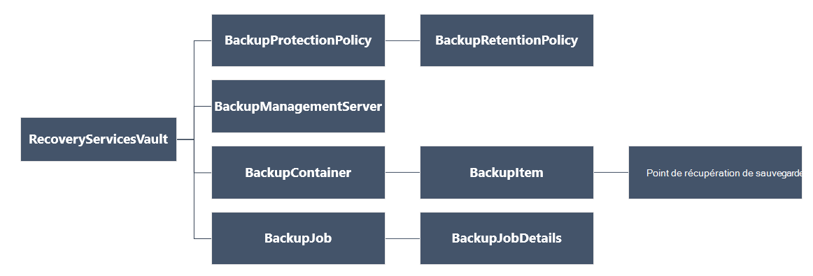

<properties
   pageTitle="Déployer et gérer des sauvegardes pour les machines virtuelles déployé le Gestionnaire de ressources à l’aide de PowerShell | Microsoft Azure"
   description="Utiliser PowerShell pour déployer et gérer des sauvegardes dans Azure pour les machines virtuelles déployé le Gestionnaire de ressources"
   services="backup"
   documentationCenter=""
   authors="markgalioto"
   manager="cfreeman"
   editor=""/>

<tags
   ms.service="backup"
   ms.devlang="na"
   ms.topic="article"
   ms.tgt_pltfrm="na"
   ms.workload="storage-backup-recovery"
   ms.date="08/03/2016"
   ms.author="markgal; trinadhk"/>

# <a name="deploy-and-manage-backups-for-resource-manager-deployed-vms-using-powershell"></a>Déployer et gérer des sauvegardes pour les machines virtuelles déployé le Gestionnaire de ressources à l’aide de PowerShell

> [AZURE.SELECTOR]
- [Gestionnaire de ressources](backup-azure-vms-automation.md)
- [Classique](backup-azure-vms-classic-automation.md)

Cet article vous explique comment utiliser les applets de commande PowerShell Azure pour sauvegarder et restaurer une Azure machine virtuelle () à partir d’un archivage sécurisé aux Services de récupération. Un archivage sécurisé aux Services de récupération est une ressource concernant le Gestionnaire de ressources Azure et est utilisé pour protéger des données et des ressources dans les services Azure sauvegarde et restauration de Site Azure. Vous pouvez utiliser un archivage sécurisé aux Services de récupération pour protéger des machines virtuelles déployé Azure Service Manager, ainsi que les machines virtuelles déployé Azure le Gestionnaire de ressources.

>[AZURE.NOTE] Azure comporte deux modèles de déploiement pour la création et utilisation des ressources : [Gestionnaire de ressources et classique](../resource-manager-deployment-model.md). Cet article est destiné avec machines virtuelles créées à l’aide du modèle de gestionnaire de ressources.

Cet article décrit l’utilisation de PowerShell pour protéger une machine virtuelle et restaurer des données à partir d’un point de récupération.

## <a name="concepts"></a>Concepts

Si vous n’êtes pas familiarisé avec le service de sauvegarde Azure, pour une vue d’ensemble du service, consultez [Nouveautés sauvegarde Azure ?](backup-introduction-to-azure-backup.md) Avant de commencer, vérifiez que vous expliquer les notions fondamentales sur les conditions préalables nécessaires pour collaborer avec Azure sauvegarde, ainsi que les limites de la solution de sauvegarde machine virtuelle actuelle.

Pour pouvoir utiliser PowerShell efficacement, il est nécessaire de comprendre la hiérarchie des objets et à partir de laquelle commencer.



Pour afficher la référence applet de commande AzureRmRecoveryServicesBackup PowerShell, voir la [Sauvegarde Azure - applets de commande de Services de récupération](https://msdn.microsoft.com/library/mt723320.aspx) dans la bibliothèque Azure.
Pour afficher la référence applet de commande AzureRmRecoveryServicesVault PowerShell, voir les [Applets de commande Azure récupération](https://msdn.microsoft.com/library/mt643905.aspx).


## <a name="setup-and-registration"></a>Le programme d’installation et d’enregistrement

Pour commencer :

1. [Téléchargez la dernière version de PowerShell](https://github.com/Azure/azure-powershell/releases) (la version minimale requise est : 1.4.0)

2. Rechercher les applets de commande PowerShell de sauvegarde Azure disponibles en tapant la commande suivante :

```
PS C:\> Get-Command *azurermrecoveryservices*

CommandType     Name                                               Version    Source
-----------     ----                                               -------    ------
Cmdlet          Backup-AzureRmRecoveryServicesBackupItem           1.4.0      AzureRM.RecoveryServices.Backup
Cmdlet          Disable-AzureRmRecoveryServicesBackupProtection    1.4.0      AzureRM.RecoveryServices.Backup
Cmdlet          Enable-AzureRmRecoveryServicesBackupProtection     1.4.0      AzureRM.RecoveryServices.Backup
Cmdlet          Get-AzureRmRecoveryServicesBackupContainer         1.4.0      AzureRM.RecoveryServices.Backup
Cmdlet          Get-AzureRmRecoveryServicesBackupItem              1.4.0      AzureRM.RecoveryServices.Backup
Cmdlet          Get-AzureRmRecoveryServicesBackupJob               1.4.0      AzureRM.RecoveryServices.Backup
Cmdlet          Get-AzureRmRecoveryServicesBackupJobDetails        1.4.0      AzureRM.RecoveryServices.Backup
Cmdlet          Get-AzureRmRecoveryServicesBackupManagementServer  1.4.0      AzureRM.RecoveryServices.Backup
Cmdlet          Get-AzureRmRecoveryServicesBackupProperties        1.4.0      AzureRM.RecoveryServices
Cmdlet          Get-AzureRmRecoveryServicesBackupProtectionPolicy  1.4.0      AzureRM.RecoveryServices.Backup
Cmdlet          Get-AzureRMRecoveryServicesBackupRecoveryPoint     1.4.0      AzureRM.RecoveryServices.Backup
Cmdlet          Get-AzureRmRecoveryServicesBackupRetentionPolic... 1.4.0      AzureRM.RecoveryServices.Backup
Cmdlet          Get-AzureRmRecoveryServicesBackupSchedulePolicy... 1.4.0      AzureRM.RecoveryServices.Backup
Cmdlet          Get-AzureRmRecoveryServicesVault                   1.4.0      AzureRM.RecoveryServices
Cmdlet          Get-AzureRmRecoveryServicesVaultSettingsFile       1.4.0      AzureRM.RecoveryServices
Cmdlet          New-AzureRmRecoveryServicesBackupProtectionPolicy  1.4.0      AzureRM.RecoveryServices.Backup
Cmdlet          New-AzureRmRecoveryServicesVault                   1.4.0      AzureRM.RecoveryServices
Cmdlet          Remove-AzureRmRecoveryServicesProtectionPolicy     1.4.0      AzureRM.RecoveryServices.Backup
Cmdlet          Remove-AzureRmRecoveryServicesVault                1.4.0      AzureRM.RecoveryServices
Cmdlet          Restore-AzureRMRecoveryServicesBackupItem          1.4.0      AzureRM.RecoveryServices.Backup
Cmdlet          Set-AzureRmRecoveryServicesBackupProperties        1.4.0      AzureRM.RecoveryServices
Cmdlet          Set-AzureRmRecoveryServicesBackupProtectionPolicy  1.4.0      AzureRM.RecoveryServices.Backup
Cmdlet          Set-AzureRmRecoveryServicesVaultContext            1.4.0      AzureRM.RecoveryServices
Cmdlet          Stop-AzureRmRecoveryServicesBackupJob              1.4.0      AzureRM.RecoveryServices.Backup
Cmdlet          Unregister-AzureRmRecoveryServicesBackupContainer  1.4.0      AzureRM.RecoveryServices.Backup
Cmdlet          Unregister-AzureRmRecoveryServicesBackupManagem... 1.4.0      AzureRM.RecoveryServices.Backup
Cmdlet          Wait-AzureRmRecoveryServicesBackupJob              1.4.0      AzureRM.RecoveryServices.Backup
```


Les tâches suivantes peuvent être automatisées avec PowerShell :

- Créer un archivage sécurisé aux Services de récupération
- Sauvegarder ou protéger machines virtuelles Azure
- Déclencher la lecture d’une opération de sauvegarde
- Surveiller une opération de sauvegarde
- Restaurer une machine virtuelle Azure

## <a name="create-a-recovery-services-vault"></a>Créer un archivage sécurisé des services de récupération

Les étapes suivantes vous guident dans le processus de création d’un archivage sécurisé aux Services de récupération. Un archivage sécurisé aux Services de récupération est différent de celui un archivage sécurisé de sauvegarde.

1. Si vous utilisez Azure sauvegarde pour la première fois, vous devez utiliser l’applet de commande **[AzureRMResourceProvider de Registre](https://msdn.microsoft.com/library/mt679020.aspx)** pour enregistrer le fournisseur de Service de récupération Azure avec votre abonnement.

    ```
    PS C:\> Register-AzureRmResourceProvider -ProviderNamespace "Microsoft.RecoveryServices"
    ```

2. L’archivage sécurisé aux Services de récupération est une ressource Gestionnaire de ressources, vous devez placer au sein d’un groupe de ressources. Vous pouvez utiliser un groupe de ressources existant, ou créer un nouveau groupe de ressources avec l’applet de commande **[New-AzureRmResourceGroup](https://msdn.microsoft.com/library/mt678985.aspx)** . Lorsque vous créez un nouveau groupe de ressources, spécifiez le nom et l’emplacement du groupe de ressources.  

    ```
    PS C:\> New-AzureRmResourceGroup –Name "test-rg" –Location "West US"
    ```

3. Utiliser l’applet de commande **[New-AzureRmRecoveryServicesVault](https://msdn.microsoft.com/library/mt643910.aspx)** pour créer l’archivage sécurisé nouveau. Veillez à spécifier le même emplacement pour l’archivage sécurisé que celui utilisé pour le groupe de ressources.

    ```
    PS C:\> New-AzureRmRecoveryServicesVault -Name "testvault" -ResourceGroupName " test-rg" -Location "West US"
    ```

4. Spécifier le type de redondance du stockage à utiliser ; Vous pouvez utiliser [Stockage localement redondantes (LRS)](../storage/storage-redundancy.md#locally-redundant-storage) ou [Geo redondants stockage (GRS)](../storage/storage-redundancy.md#geo-redundant-storage). L’exemple suivant montre que l’option - BackupStorageRedundancy pour testVault est définie sur GeoRedundant.

    ```
    PS C:\> $vault1 = Get-AzureRmRecoveryServicesVault –Name "testVault"
    PS C:\> Set-AzureRmRecoveryServicesBackupProperties  -Vault $vault1 -BackupStorageRedundancy GeoRedundant
    ```

    > [AZURE.TIP] Applets de commande de sauvegarde Azure nombreux nécessitent l’objet de l’archivage sécurisé aux Services de récupération comme entrée. Pour cette raison, il est recommandé de stocker l’objet de l’archivage sécurisé de Services de récupération de sauvegarde dans une variable.

## <a name="view-the-vaults-in-a-subscription"></a>Afficher les chambres fortes dans un abonnement
**[Get-AzureRmRecoveryServicesVault](https://msdn.microsoft.com/library/mt643907.aspx)** permet d’afficher la liste de tous les chambres fortes dans l’abonnement actif. Vous pouvez utiliser cette commande pour vérifier qu’un archivage sécurisé nouveau a été créé, ou pour savoir quels chambres fortes sont disponibles dans l’abonnement.

Exécutez la commande Get-AzureRmRecoveryServicesVault, et toutes les chambres fortes dans l’abonnement sont répertoriées.

```
PS C:\> Get-AzureRmRecoveryServicesVault
Name              : Contoso-vault
ID                : /subscriptions/1234
Type              : Microsoft.RecoveryServices/vaults
Location          : WestUS
ResourceGroupName : Contoso-docs-rg
SubscriptionId    : 1234-567f-8910-abc
Properties        : Microsoft.Azure.Commands.RecoveryServices.ARSVaultProperties
```


## <a name="backup-azure-vms"></a>Machines virtuelles Azure sauvegarde
Maintenant que vous avez créé un archivage sécurisé des services de récupération, vous pouvez l’utiliser pour protéger une machine virtuelle. Cependant avant d’appliquer la protection, vous devez définir le contexte de l’archivage sécurisé et que vous voulez vérifier la stratégie de protection. Contexte de l’archivage sécurisé définit le type de données sont protégées dans l’archivage sécurisé. La stratégie de protection est l’Échéancier pour lorsque l’opération de sauvegarde est exécutée, et combien de chaque sauvegarde instantané est conservé.

Avant d’activer la protection sur un ordinateur virtuel, vous devez définir le contexte de l’archivage sécurisé. Le contexte est appliqué à toutes les applets de commande suivantes.

```
PS C:\> Get-AzureRmRecoveryServicesVault -Name testvault | Set-AzureRmRecoveryServicesVaultContext
```

### <a name="create-a-protection-policy"></a>Créer une stratégie de protection

Lorsque vous créez un archivage sécurisé nouvelle, il est fourni avec une stratégie par défaut. Cette stratégie permet de déclencher une opération de sauvegarde chaque jour à un moment donné. Par la stratégie par défaut, l’instantané sauvegarde est conservé pendant 30 jours. Vous pouvez utiliser la stratégie par défaut pour protéger rapidement votre machine virtuelle et modifier la stratégie ultérieurement avec différents détails.

**[Get-AzureRmRecoveryServicesBackupProtectionPolicy](https://msdn.microsoft.com/library/mt723300.aspx)** permet d’afficher la liste des stratégies disponibles dans l’archivage sécurisé :

```
PS C:\> Get-AzureRmRecoveryServicesBackupProtectionPolicy -WorkloadType AzureVM
Name                 WorkloadType       BackupManagementType BackupTime                DaysOfWeek
----                 ------------       -------------------- ----------                ----------
DefaultPolicy        AzureVM            AzureVM              4/14/2016 5:00:00 PM
```

> [AZURE.NOTE] Le fuseau horaire du champ BackupTime dans PowerShell est au format UTC. Toutefois, lorsque la durée de sauvegarde est affichée dans le portail Azure, l’heure est ajustée à votre fuseau horaire local.

Une stratégie de protection des sauvegardes est associée au moins une stratégie de rétention.  Stratégie de rétention définit la durée pendant laquelle un point de récupération est conservé avec Azure sauvegarde. **Get-AzureRmRecoveryServicesBackupRetentionPolicyObject** permet d’afficher la stratégie de rétention par défaut.  De même, vous pouvez utiliser **Get-AzureRmRecoveryServicesBackupSchedulePolicyObject** pour obtenir la stratégie de calendrier par défaut. Les objets de stratégie de planification et la rétention sont utilisés comme entrées dans l’applet de commande **New-AzureRmRecoveryServicesBackupProtectionPolicy** .

Une stratégie de protection des sauvegardes définit quand et à quelle fréquence la sauvegarde d’un élément est terminée. L’applet de commande New-AzureRmRecoveryServicesBackupProtectionPolicy crée un objet PowerShell qui conserve des informations de stratégie de sauvegarde. La stratégie de sauvegarde est utilisée comme une entrée de l’applet de commande Enable-AzureRmRecoveryServicesBackupProtection.

```
PS C:\> $schPol = Get-AzureRmRecoveryServicesBackupSchedulePolicyObject -WorkloadType "AzureVM"
PS C:\>  $retPol = Get-AzureRmRecoveryServicesBackupRetentionPolicyObject -WorkloadType "AzureVM"
PS C:\>  New-AzureRmRecoveryServicesBackupProtectionPolicy -Name "NewPolicy" -WorkloadType AzureVM -RetentionPolicy $retPol -SchedulePolicy $schPol
Name                 WorkloadType       BackupManagementType BackupTime                DaysOfWeek
----                 ------------       -------------------- ----------                ----------
NewPolicy           AzureVM            AzureVM              4/24/2016 1:30:00 AM
```

### <a name="enable-protection"></a>Activer la protection

Activation de la protection implique deux objets - l’élément et la stratégie. Les deux objets sont requis pour activer la protection de l’archivage sécurisé. Une fois que la stratégie a été associée à l’archivage sécurisé, le flux de travail de sauvegarde se déclenche au moment définie dans la planification de la stratégie.

Pour activer la protection sur non chiffré de machines virtuelles du processeur

```
PS C:\> $pol=Get-AzureRmRecoveryServicesBackupProtectionPolicy -Name "NewPolicy"
PS C:\> Enable-AzureRmRecoveryServicesBackupProtection -Policy $pol -Name "V2VM" -ResourceGroupName "RGName1"
```

Pour activer la protection des machines virtuelles chiffrés [chiffrés à l’aide de BEK et KEK], vous devez octroyez des autorisations pour le service de sauvegarde Azure lire clés et secrets à partir de l’archivage sécurisé clé. 

```
PS C:\> Set-AzureRmKeyVaultAccessPolicy -VaultName 'KeyVaultName' -ResourceGroupName 'RGNameOfKeyVault' -PermissionsToKeys backup,get,list -PermissionsToSecrets get,list -ServicePrincipalName 262044b1-e2ce-469f-a196-69ab7ada62d3
PS C:\> $pol=Get-AzureRmRecoveryServicesBackupProtectionPolicy -Name "NewPolicy"
PS C:\> Enable-AzureRmRecoveryServicesBackupProtection -Policy $pol -Name "V2VM" -ResourceGroupName "RGName1"
```

Pour ASM basé machines virtuelles

```
PS C:\>  $pol=Get-AzureRmRecoveryServicesBackupProtectionPolicy -Name "NewPolicy"
PS C:\>  Enable-AzureRmRecoveryServicesBackupProtection -Policy $pol -Name "V1VM" -ServiceName "ServiceName1"
```

### <a name="modify-a-protection-policy"></a>Modifier une stratégie de protection

Pour modifier la stratégie, modifiez l’objet BackupSchedulePolicyObject ou BackupRetentionPolicy et modifier la stratégie à l’aide de jeu AzureRmRecoveryServicesBackupProtectionPolicy

L’exemple suivant modifie le nombre de rétention à 365.

```
PS C:\> $retPol = Get-AzureRmRecoveryServicesBackupRetentionPolicyObject -WorkloadType "AzureVM"
PS C:\> $retPol.DailySchedule.DurationCountInDays = 365
PS C:\> $pol= Get-AzureRmRecoveryServicesBackupProtectionPolicy -Name NewPolicy
PS C:\> Set-AzureRmRecoveryServicesBackupProtectionPolicy -Policy $pol  -RetentionPolicy  $RetPol
```

## <a name="run-an-initial-backup"></a>Exécuter une sauvegarde initiale

La planification de sauvegarde déclenche complète sauvegarder sur l’initiale du retour pour l’article. Sur les sauvegardes, la sauvegarde est une copie incrémentielle. Si vous voulez forcer la sauvegarde initiale se produire à un moment donné ou même immédiatement alors utiliser l’applet de commande **[Sauvegarde AzureRmRecoveryServicesBackupItem](https://msdn.microsoft.com/library/mt723312.aspx)** :

```
PS C:\> $namedContainer = Get-AzureRmRecoveryServicesBackupContainer -ContainerType "AzureVM" -Status "Registered" -Name "V2VM"
PS C:\> $item = Get-AzureRmRecoveryServicesBackupItem -Container $namedContainer -WorkloadType "AzureVM"
PS C:\> $job = Backup-AzureRmRecoveryServicesBackupItem -Item $item
WorkloadName     Operation            Status               StartTime                 EndTime                   JobID
------------     ---------            ------               ---------                 -------                   ----------
V2VM              Backup               InProgress            4/23/2016 5:00:30 PM                       cf4b3ef5-2fac-4c8e-a215-d2eba4124f27
```

> [AZURE. Remarque : Le fuseau horaire des champs heures de début et heure de fin de PowerShell est au format UTC. Toutefois, lorsque l’heure est affichée dans le portail Azure, l’heure est ajustée à votre fuseau horaire local.

## <a name="monitoring-a-backup-job"></a>Une opération de sauvegarde de surveillance

La plupart des opérations de longue dans Azure sauvegarde sont conformes en tant que tâche. Cela facilite suivre la progression sans avoir à garder le portail Azure ouvert en permanence.

Pour obtenir le dernier état d’une tâche en cours, utilisez l’applet de commande Get-AzureRmRecoveryservicesBackupJob.

```
PS C:\ > $joblist = Get-AzureRmRecoveryservicesBackupJob –Status InProgress
PS C:\ > $joblist[0]
WorkloadName     Operation            Status               StartTime                 EndTime                   JobID
------------     ---------            ------               ---------                 -------                   ----------
V2VM             Backup               InProgress            4/23/2016 5:00:30 PM           cf4b3ef5-2fac-4c8e-a215-d2eba4124f27
```

Au lieu d’interrogation ces tâches achèvement - situé inutile code supplémentaire - utilisent l’applet de commande **[Attente AzureRmRecoveryServicesBackupJob](https://msdn.microsoft.com/library/mt723321.aspx)** . Cette applet de commande interrompt l’exécution jusqu'à ce que la tâche se termine ou de la valeur du délai spécifié est atteint.

```
PS C:\> Wait-AzureRmRecoveryServicesBackupJob -Job $joblist[0] -Timeout 43200
```

## <a name="restore-an-azure-vm"></a>Restaurer une machine virtuelle Azure

Il existe une différence clée entre la restauration d’un ordinateur virtuel à l’aide du portail Azure et la restauration d’un ordinateur virtuel à l’aide de PowerShell. Avec PowerShell, l’opération de restauration est terminée une fois que les disques et les informations de configuration du point de récupération sont créés. L’opération de restauration ne crée pas une machine virtuelle. Les instructions pour la création de la machine virtuelle à partir des disques sont fournies. Toutefois, pour restaurer une machine virtuelle, vous devez effectuer les procédures suivantes :

- Sélectionnez la machine virtuelle
- Choisissez un point de récupération
- Restaurer les disques
- Créer la machine virtuelle à partir des disques stockées

L’illustration ci-dessous montre la hiérarchie d’objets à partir de la RecoveryServicesVault vers le bas jusqu'à la BackupRecoveryPoint.


Afin de restaurer les données de sauvegarde, identifier l’élément sauvegardée et le point de récupération qui contient les données de point dans le temps. Ensuite utiliser l’applet de commande **[Restaurer AzureRmRecoveryServicesBackupItem](https://msdn.microsoft.com/library/mt723316.aspx)** pour restaurer les données de l’archivage sécurisé sur le compte du client.

### <a name="select-the-vm"></a>Sélectionnez la machine virtuelle

Pour obtenir l’objet PowerShell qui identifie l’élément à restaurer, commencez à partir du conteneur dans l’archivage sécurisé et navigation vers le bas de la hiérarchie d’objets. Pour sélectionner le conteneur qui représente la machine virtuelle, utilisez l’applet de commande **[Get-AzureRmRecoveryServicesBackupContainer](https://msdn.microsoft.com/library/mt723319.aspx)** et du canal que pour l’applet de commande **[Get-AzureRmRecoveryServicesBackupItem](https://msdn.microsoft.com/library/mt723305.aspx)** .

```
PS C:\> $namedContainer = Get-AzureRmRecoveryServicesBackupContainer  -ContainerType AzureVM –Status Registered -Name 'V2VM'
PS C:\> $backupitem = Get-AzureRmRecoveryServicesBackupItem –Container $namedContainer  –WorkloadType "AzureVM"
```

### <a name="choose-a-recovery-point"></a>Choisissez un point de récupération

L’applet de commande **[Get-AzureRmRecoveryServicesBackupRecoveryPoint](https://msdn.microsoft.com/library/mt723308.aspx)** permet de répertorier tous les points de récupération de l’élément de sauvegarde. Point de récupération à restaurer, puis sélectionnez. Si vous ne savez pas quel point de récupération à utiliser, il est judicieux de choisir la plus récente RecoveryPointType = AppConsistent point dans la liste.

Dans le script suivant, la variable, **$rp**, est un tableau de points de récupération pour la sauvegarde sélectionnée. Le tableau est trié dans l’ordre inverse de temps avec le dernier point de récupération à l’index 0. Utilisez standard PowerShell l’indexation de tableau pour sélectionner le point de récupération. Par exemple : $rp [0] sélectionne le dernier point de récupération.

```
PS C:\> $startDate = (Get-Date).AddDays(-7)
PS C:\> $endDate = Get-Date
PS C:\> $rp = Get-AzureRmRecoveryServicesBackupRecoveryPoint -Item $backupitem -StartDate $startdate.ToUniversalTime() -EndDate $enddate.ToUniversalTime()
PS C:\> $rp[0]
RecoveryPointAdditionalInfo :
SourceVMStorageType         : NormalStorage
Name                        : 15260861925810
ItemName                    : VM;iaasvmcontainer;RGName1;V2VM
RecoveryPointId             : /subscriptions/XX/resourceGroups/ RGName1/providers/Microsoft.RecoveryServices/vaults/testvault/backupFabrics/Azure/protectionContainers/IaasVMContainer;iaasvmcontainer;RGName1;V2VM/protectedItems/VM;iaasvmcontainer; RGName1;V2VM
                              /recoveryPoints/15260861925810
RecoveryPointType           : AppConsistent
RecoveryPointTime           : 4/23/2016 5:02:04 PM
WorkloadType                : AzureVM
ContainerName               : IaasVMContainer;iaasvmcontainer; RGName1;V2VM
ContainerType               : AzureVM
BackupManagementType        : AzureVM
```


### <a name="restore-the-disks"></a>Restaurer les disques

Utiliser l’applet de commande **[Restaurer AzureRmRecoveryServicesBackupItem](https://msdn.microsoft.com/library/mt723316.aspx)** pour restaurer les données et la configuration d’un élément de sauvegarde, un point de récupération. Une fois que vous avez identifié un point de récupération l’utiliser comme valeur pour le paramètre **- RecoveryPoint** . Dans l’exemple de code précédent, **$rp [0]** a été choisi comme point de récupération à utiliser. Dans l’exemple de code ci-dessous, **$rp [0]** est spécifié en tant que point de récupération à utiliser pour restaurer le disque.

Pour restaurer les disques et les informations de configuration

```
PS C:\> $restorejob = Restore-AzureRmRecoveryServicesBackupItem -RecoveryPoint $rp[0] -StorageAccountName DestAccount -StorageAccountResourceGroupName DestRG
PS C:\> $restorejob
WorkloadName     Operation          Status               StartTime                 EndTime            JobID
------------     ---------          ------               ---------                 -------          ----------
V2VM              Restore           InProgress           4/23/2016 5:00:30 PM                        cf4b3ef5-2fac-4c8e-a215-d2eba4124f27
```

Une fois l’opération de restauration terminée, utilisez l’applet de commande **[Get-AzureRmRecoveryServicesBackupJobDetails](https://msdn.microsoft.com/library/mt723310.aspx)** pour obtenir les détails de l’opération de restauration. La propriété JobDetails comporte les informations nécessaires pour reconstruire la machine virtuelle.

```
PS C:\> $restorejob = Get-AzureRmRecoveryServicesBackupJob -Job $restorejob
PS C:\> $details = Get-AzureRmRecoveryServicesBackupJobDetails
```

Une fois que vous restaurez les disques, accédez à la section suivante pour plus d’informations sur la création de la machine virtuelle.

### <a name="create-a-vm-from-restored-disks"></a>Créer une machine virtuelle à partir des disques restaurés

Une fois que vous avez restauré les disques, utilisez ces étapes pour créer et configurer la machine virtuelle à partir du disque.

1. Interroger les propriétés d’un disque restauré pour les détails d’une tâche.

    ```
    PS C:\> $properties = $details.properties
    PS C:\> $storageAccountName = $properties["Target Storage Account Name"]
    PS C:\> $containerName = $properties["Config Blob Container Name"]
    PS C:\> $blobName = $properties["Config Blob Name"]
    ```

2. Définir le contexte de stockage Azure et de restaurer le fichier de configuration JSON.

    ```
    PS C:\> Set-AzureRmCurrentStorageAccount -Name $storageaccountname -ResourceGroupName testvault
    PS C:\> $destination_path = "C:\vmconfig.json"
    PS C:\> Get-AzureStorageBlobContent -Container $containerName -Blob $blobName -Destination $destination_path
    PS C:\> $obj = ((Get-Content -Path $destination_path -Encoding Unicode)).TrimEnd([char]0x00) | ConvertFrom-Json
    ```

3. Utiliser le fichier de configuration JSON pour créer la configuration de la machine virtuelle.

    ```
  PS C:\> $vm = New-AzureRmVMConfig -VMSize $obj.HardwareProfile.VirtualMachineSize -VMName "testrestore"
    ```

4. Joindre le disque du système d’exploitation et les données disques.

      Pour les machines virtuelles non chiffré,

       ```
       PS C:\> Set-AzureRmVMOSDisk -VM $vm -Name "osdisk" -VhdUri $obj.StorageProfile.OSDisk.VirtualHardDisk.Uri -CreateOption “Attach”
       PS C:\> $vm.StorageProfile.OsDisk.OsType = $obj.StorageProfile.OSDisk.OperatingSystemType foreach($dd in $obj.StorageProfile.DataDisks)
       {
       $vm = Add-AzureRmVMDataDisk -VM $vm -Name "datadisk1" -VhdUri $dd.VirtualHardDisk.Uri -DiskSizeInGB 127 -Lun $dd.Lun -CreateOption Attach
       }
       ```
      Pour les machines virtuelles chiffrés, vous devez spécifier les [informations de l’archivage sécurisé clé](https://msdn.microsoft.com/library/dn868052.aspx) avant que vous pouvez joindre disques.
      
      ```
      PS C:\> Set-AzureRmVMOSDisk -VM $vm -Name "osdisk" -VhdUri $obj.StorageProfile.OSDisk.VirtualHardDisk.Uri -DiskEncryptionKeyUrl "https://ContosoKeyVault.vault.azure.net:443/secrets/ContosoSecret007" -DiskEncryptionKeyVaultId "/subscriptions/abcdedf007-4xyz-1a2b-0000-12a2b345675c/resourceGroups/ContosoRG108/providers/Microsoft.KeyVault/vaults/ContosoKeyVault" -KeyEncryptionKeyUrl "https://ContosoKeyVault.vault.azure.net:443/keys/ContosoKey007" -KeyEncryptionKeyVaultId "subscriptions/abcdedf007-4xyz-1a2b-0000-12a2b345675c/resourceGroups/ContosoRG108/providers/Microsoft.KeyVault/vaults/ContosoKeyVault" -CreateOption "Attach" -Windows
      PS C:\> $vm.StorageProfile.OsDisk.OsType = $obj.StorageProfile.OSDisk.OperatingSystemType foreach($dd in $obj.StorageProfile.DataDisks)
       {
       $vm = Add-AzureRmVMDataDisk -VM $vm -Name "datadisk1" -VhdUri $dd.VirtualHardDisk.Uri -DiskSizeInGB 127 -Lun $dd.Lun -CreateOption Attach
       }
      ```
      
5. Définir les paramètres réseau.

    ```
    PS C:\> $nicName="p1234"
    PS C:\> $pip = New-AzureRmPublicIpAddress -Name $nicName -ResourceGroupName "test" -Location "WestUS" -AllocationMethod Dynamic
    PS C:\> $vnet = Get-AzureRmVirtualNetwork -Name "testvNET" -ResourceGroupName "test"
    PS C:\> $nic = New-AzureRmNetworkInterface -Name $nicName -ResourceGroupName "test" -Location "WestUS" -SubnetId $vnet.Subnets[$subnetindex].Id -PublicIpAddressId $pip.Id
    PS C:\> $vm=Add-AzureRmVMNetworkInterface -VM $vm -Id $nic.Id
    ```

6. Créer la machine virtuelle.

    ```
    PS C:\> $vm.StorageProfile.OsDisk.OsType = $obj.StorageProfile.OSDisk.OperatingSystemType
    PS C:\> New-AzureRmVM -ResourceGroupName "test" -Location "WestUS" -VM $vm
    ```

## <a name="next-steps"></a>Étapes suivantes

Si vous préférez utiliser PowerShell pour collaborer avec vos ressources Azure, consultez l’article PowerShell pour la protection des Windows Server, [déployer et gérer la sauvegarde de serveur de Windows](./backup-client-automation.md). Vous trouverez également un article PowerShell pour la gestion des sauvegardes DPM, [déployer et gérer la sauvegarde pour DPM](./backup-dpm-automation.md). Deux des articles suivants ont une version pour les déploiements du Gestionnaire de ressources, ainsi que les déploiements classique.  
