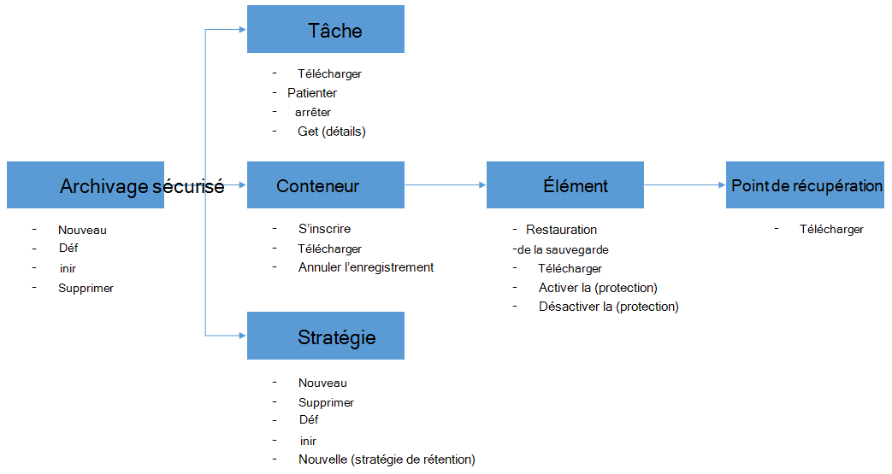

<properties
    pageTitle="Déployer et gérer la sauvegarde pour les machines virtuelles Azure à l’aide de PowerShell | Microsoft Azure"
    description="Découvrez comment déployer et gérer la sauvegarde Azure à l’aide de PowerShell"
    services="backup"
    documentationCenter=""
    authors="markgalioto"
    manager="cfreeman"
    editor=""/>

<tags
    ms.service="backup"
    ms.workload="storage-backup-recovery"
    ms.tgt_pltfrm="na"
    ms.devlang="na"
    ms.topic="article"
    ms.date="08/08/2016"
    ms.author="markgal;trinadhk;jimpark" />


# <a name="deploy-and-manage-backup-for-azure-vms-using-powershell"></a>Déployer et gérer la sauvegarde pour les machines virtuelles Azure à l’aide de PowerShell

> [AZURE.SELECTOR]
- [Gestionnaire de ressources](backup-azure-vms-automation.md)
- [Classique](backup-azure-vms-classic-automation.md)

Cet article vous explique comment utiliser Azure PowerShell pour la sauvegarde et restauration de machines virtuelles Azure. Azure comporte deux modèles de déploiement différents pour la création et utilisation des ressources : ressources responsable et classique. Cet article décrit l’utilisation du modèle de déploiement classique. Microsoft recommande la plupart des nouveaux déploiements d’utiliser le modèle de gestionnaire de ressources.

## <a name="concepts"></a>Concepts


Cet article fournit des informations spécifiques sur les applets de commande PowerShell utilisé pour sauvegarder des machines virtuelles. Pour obtenir des informations sur la protection de machines virtuelles Azure, voir [planifier votre infrastructure de sauvegarde machine virtuelle dans Azure](backup-azure-vms-introduction.md).

> [AZURE.NOTE] Avant de commencer, lisez les [conditions préalables](backup-azure-vms-prepare.md) requises pour travailler avec Azure sauvegarde, ainsi que les [limitations](backup-azure-vms-prepare.md#limitations) de la solution de sauvegarde machine virtuelle actuelle.

Pour utiliser efficacement PowerShell, prenez le temps de comprendre la hiérarchie des objets et à partir de laquelle commencer.



Les deux flux les plus importantes sont activation de la protection d’un ordinateur virtuel et restauration de données à partir d’un point de récupération. L’objectif de cet article consiste à vous permettent de gagner performants pour travailler avec les applets de commande PowerShell pour activer ces deux scénarios.


## <a name="setup-and-registration"></a>Le programme d’installation et d’enregistrement
Pour commencer :

1. [Téléchargez la dernière PowerShell](https://github.com/Azure/azure-powershell/releases) (version minimale requise est : 1.0.0)

2. Rechercher les applets de commande PowerShell de sauvegarde Azure disponibles en tapant la commande suivante :

```
PS C:\> Get-Command *azurermbackup*

CommandType     Name                                               Version    Source
-----------     ----                                               -------    ------
Cmdlet          Backup-AzureRmBackupItem                           1.0.1      AzureRM.Backup
Cmdlet          Disable-AzureRmBackupProtection                    1.0.1      AzureRM.Backup
Cmdlet          Enable-AzureRmBackupContainerReregistration        1.0.1      AzureRM.Backup
Cmdlet          Enable-AzureRmBackupProtection                     1.0.1      AzureRM.Backup
Cmdlet          Get-AzureRmBackupContainer                         1.0.1      AzureRM.Backup
Cmdlet          Get-AzureRmBackupItem                              1.0.1      AzureRM.Backup
Cmdlet          Get-AzureRmBackupJob                               1.0.1      AzureRM.Backup
Cmdlet          Get-AzureRmBackupJobDetails                        1.0.1      AzureRM.Backup
Cmdlet          Get-AzureRmBackupProtectionPolicy                  1.0.1      AzureRM.Backup
Cmdlet          Get-AzureRmBackupRecoveryPoint                     1.0.1      AzureRM.Backup
Cmdlet          Get-AzureRmBackupVault                             1.0.1      AzureRM.Backup
Cmdlet          Get-AzureRmBackupVaultCredentials                  1.0.1      AzureRM.Backup
Cmdlet          New-AzureRmBackupProtectionPolicy                  1.0.1      AzureRM.Backup
Cmdlet          New-AzureRmBackupRetentionPolicyObject             1.0.1      AzureRM.Backup
Cmdlet          New-AzureRmBackupVault                             1.0.1      AzureRM.Backup
Cmdlet          Register-AzureRmBackupContainer                    1.0.1      AzureRM.Backup
Cmdlet          Remove-AzureRmBackupProtectionPolicy               1.0.1      AzureRM.Backup
Cmdlet          Remove-AzureRmBackupVault                          1.0.1      AzureRM.Backup
Cmdlet          Restore-AzureRmBackupItem                          1.0.1      AzureRM.Backup
Cmdlet          Set-AzureRmBackupProtectionPolicy                  1.0.1      AzureRM.Backup
Cmdlet          Set-AzureRmBackupVault                             1.0.1      AzureRM.Backup
Cmdlet          Stop-AzureRmBackupJob                              1.0.1      AzureRM.Backup
Cmdlet          Unregister-AzureRmBackupContainer                  1.0.1      AzureRM.Backup
Cmdlet          Wait-AzureRmBackupJob                              1.0.1      AzureRM.Backup
```

Les tâches de configuration et d’enregistrement suivantes peuvent être automatisées avec PowerShell :

- Créer un archivage sécurisé sauvegarde
- Enregistrement d’ordinateurs virtuels avec le service de sauvegarde d’Azure

### <a name="create-a-backup-vault"></a>Créer un archivage sécurisé sauvegarde

> [AZURE.WARNING] Pour les clients à l’aide de sauvegarde Azure pour la première fois, vous devez enregistrer le fournisseur de sauvegarde Azure à utiliser avec votre abonnement. Cela peut être exécuté en exécutant la commande suivante : Registre AzureRmResourceProvider - ProviderNamespace « Microsoft.Backup »

Vous pouvez créer un archivage sécurisé sauvegarde à l’aide de l’applet de commande **New-AzureRmBackupVault** . L’archivage sécurisé sauvegarde est une ressource processeur, vous devez placer au sein d’un groupe de ressources. Dans une console PowerShell Azure avec élévation de privilèges, exécutez les commandes suivantes :

```
PS C:\> New-AzureRmResourceGroup –Name “test-rg” –Location “West US”
PS C:\> $backupvault = New-AzureRmBackupVault –ResourceGroupName “test-rg” –Name “test-vault” –Region “West US” –Storage GeoRedundant
```

Vous pouvez obtenir une liste de tous les coffres-forts sauvegarde dans un abonnement donné à l’aide de l’applet de commande **Get-AzureRmBackupVault** .

> [AZURE.NOTE] Il est recommandé de stocker l’objet de l’archivage sécurisé sauvegarde dans une variable. L’objet de l’archivage sécurisé est nécessaire comme une entrée de nombreuses cmdlets de sauvegarde Azure.


### <a name="registering-the-vms"></a>Enregistrer les ordinateurs virtuels
La première étape de configuration de la sauvegarde avec Azure sauvegarde consiste à enregistrer votre ordinateur ou votre machine virtuelle avec un archivage sécurisé Azure sauvegarde. L’applet de commande **Registre AzureRmBackupContainer** utilise les informations d’entrée d’un ordinateur virtuel IaaS Azure et inscrit auprès de l’archivage sécurisé spécifié. L’opération de Registre associe la machine virtuelle Azure l’archivage sécurisé sauvegarde et effectue le suivi de la machine virtuelle par le biais du cycle de vie de sauvegarde.

L’enregistrement de votre ordinateur virtuel avec le service de sauvegarde Azure crée un objet conteneur de niveau supérieur. Un conteneur contient généralement plusieurs éléments qui peuvent être sauvegardées, mais dans le cas d’ordinateurs virtuels il sera qu’un seul élément de sauvegarde pour le conteneur.

```
PS C:\> $registerjob = Register-AzureRmBackupContainer -Vault $backupvault -Name "testvm" -ServiceName "testvm"
```

## <a name="backup-azure-vms"></a>Machines virtuelles Azure sauvegarde

### <a name="create-a-protection-policy"></a>Créer une stratégie de protection
Il n’est pas obligatoire pour créer une nouvelle stratégie de protection pour démarrer la sauvegarde de vos ordinateurs virtuels. L’archivage sécurisé est fourni avec un 'stratégie par défaut » qui peut être utilisé pour activer la protection et puis modifiées plus tard avec les détails de la droite. Vous pouvez obtenir une liste des stratégies disponibles dans l’archivage sécurisé à l’aide de l’applet de commande **Get-AzureRmBackupProtectionPolicy** :

```
PS C:\> Get-AzureRmBackupProtectionPolicy -Vault $backupvault

Name                      Type               ScheduleType       BackupTime
----                      ----               ------------       ----------
DefaultPolicy             AzureVM            Daily              26-Aug-15 12:30:00 AM
```

> [AZURE.NOTE] Le fuseau horaire du champ BackupTime dans PowerShell est au format UTC. Toutefois, lorsque la durée de sauvegarde est affichée dans le portail Azure, le fuseau horaire est aligné à votre système ainsi que le décalage UTC local.

Une stratégie de sauvegarde est associée au moins une stratégie de rétention. La stratégie de rétention définit la durée pendant laquelle un point de récupération est conservé avec Azure sauvegarde. L’applet de commande **New-AzureRmBackupRetentionPolicy** crée des objets PowerShell qui contiennent des informations de stratégie de rétention. Ces objets de stratégie de rétention sont utilisés comme entrées à l’applet de commande *New-AzureRmBackupProtectionPolicy* , ou directement auprès de l’applet de commande *Enable-AzureRmBackupProtection* .

Une stratégie de sauvegarde définit quand et à quelle fréquence la sauvegarde d’un élément est terminée. L’applet de commande **New-AzureRmBackupProtectionPolicy** crée un objet PowerShell qui conserve des informations de stratégie de sauvegarde. La stratégie de sauvegarde est utilisée comme une entrée de l’applet de commande *Enable-AzureRmBackupProtection* .

```
PS C:\> $Daily = New-AzureRmBackupRetentionPolicyObject -DailyRetention -Retention 30
PS C:\> $newpolicy = New-AzureRmBackupProtectionPolicy -Name DailyBackup01 -Type AzureVM -Daily -BackupTime ([datetime]"3:30 PM") -RetentionPolicy $Daily -Vault $backupvault

Name                      Type               ScheduleType       BackupTime
----                      ----               ------------       ----------
DailyBackup01             AzureVM            Daily              01-Sep-15 3:30:00 PM
```

### <a name="enable-protection"></a>Activer la protection
Activation de la protection implique deux objets - l’élément et la stratégie, et les deux doivent appartenir à l’archivage sécurisé même. Une fois que la stratégie a été associée à l’élément, le flux de travail de sauvegarde démarre à la planification définie.

```
PS C:\> Get-AzureRmBackupContainer -Type AzureVM -Status Registered -Vault $backupvault | Get-AzureRmBackupItem | Enable-AzureRmBackupProtection -Policy $newpolicy
```

### <a name="initial-backup"></a>Sauvegarde initiale
La planification de sauvegarde se charge d’effectuer la copie initiale complète de l’élément et la copie incrémentielle pour les sauvegardes ultérieures. Toutefois, si vous voulez forcer la sauvegarde initiale se produire à un moment donné ou même immédiatement alors utiliser l’applet de commande **Sauvegarde AzureRmBackupItem** :

```
PS C:\> $container = Get-AzureRmBackupContainer -Vault $backupvault -Type AzureVM -Name "testvm"
PS C:\> $backupjob = Get-AzureRmBackupItem -Container $container | Backup-AzureRmBackupItem
PS C:\> $backupjob

WorkloadName    Operation       Status          StartTime              EndTime
------------    ---------       ------          ---------              -------
testvm          Backup          InProgress      01-Sep-15 12:24:01 PM  01-Jan-01 12:00:00 AM
```

> [AZURE.NOTE] Le fuseau horaire des champs heures de début et heure de fin affichés dans PowerShell est au format UTC. Toutefois, lorsque les informations similaires sont affichées dans le portail Azure, le fuseau horaire est aligné sur l’horloge de votre système local.

### <a name="monitoring-a-backup-job"></a>Une opération de sauvegarde de surveillance
La plupart des opérations de longue dans Azure sauvegarde sont conformes en tant que tâche. Cela facilite suivre la progression sans avoir à garder le portail Azure ouvert en permanence.

Pour obtenir le dernier état d’une tâche en cours, utilisez l’applet de commande **Get-AzureRmBackupJob** .

```
PS C:\> $joblist = Get-AzureRmBackupJob -Vault $backupvault -Status InProgress
PS C:\> $joblist[0]

WorkloadName    Operation       Status          StartTime              EndTime
------------    ---------       ------          ---------              -------
testvm          Backup          InProgress      01-Sep-15 12:24:01 PM  01-Jan-01 12:00:00 AM
```

Au lieu d’interrogation ces tâches de saisie semi-automatique, qui est code supplémentaire inutile - il est plus simple d’utiliser l’applet de commande **Attente AzureRmBackupJob** . Lorsqu’il est utilisé dans un script, l’applet de commande s’interrompt l’exécution jusqu'à la fin du travail ou la valeur du délai spécifié est atteint.

```
PS C:\> Wait-AzureRmBackupJob -Job $joblist[0] -Timeout 43200
```


## <a name="restore-an-azure-vm"></a>Restaurer une machine virtuelle Azure

Afin de restaurer les données de sauvegarde, vous devez identifier l’élément sauvegardée et le Point de récupération qui contient les données de point dans le temps. Ces informations sont fournies à l’applet de commande Restaurer AzureRmBackupItem pour lancer une restauration de données à partir de l’archivage sécurisé pour le compte du client.

### <a name="select-the-vm"></a>Sélectionnez la machine virtuelle

Pour obtenir l’objet PowerShell qui identifie l’élément à restaurer, vous devez démarrer à partir du conteneur dans l’archivage sécurisé, poursuivez hiérarchie d’objets. Pour sélectionner le conteneur qui représente la machine virtuelle, utilisez l’applet de commande **Get-AzureRmBackupContainer** et du canal que pour l’applet de commande **Get-AzureRmBackupItem** .

```
PS C:\> $backupitem = Get-AzureRmBackupContainer -Vault $backupvault -Type AzureVM -name "testvm" | Get-AzureRmBackupItem
```

### <a name="choose-a-recovery-point"></a>Choisissez un point de récupération

Vous pouvez maintenant tous les points de récupération de l’élément de sauvegarde à l’aide de l’applet de commande **Get-AzureRmBackupRecoveryPoint** de la liste, puis sélectionnez le point de récupération à restaurer. En règle générale, les utilisateurs choisir point *AppConsistent* le plus récent dans la liste.

```
PS C:\> $rp =  Get-AzureRmBackupRecoveryPoint -Item $backupitem
PS C:\> $rp

RecoveryPointId    RecoveryPointType  RecoveryPointTime      ContainerName
---------------    -----------------  -----------------      -------------
15273496567119     AppConsistent      01-Sep-15 12:27:38 PM  iaasvmcontainer;testvm;testv...
```

La variable ```$rp``` est un tableau de points de récupération pour la sauvegarde sélectionnée élément, triées dans l’ordre inverse de temps - le dernier point de récupération est à l’index 0. Utilisez standard PowerShell l’indexation de tableau pour sélectionner le point de récupération. Par exemple : ```$rp[0]``` sélectionne le dernier point de récupération.

### <a name="restoring-disks"></a>Restauration des disques

Il existe une différence clée entre les opérations de restauration effectuées par le biais du portail Azure et Azure PowerShell. Avec PowerShell, l’opération de restauration s’arrête à restaurer les disques et les informations de configuration du point de récupération. Il ne crée pas une machine virtuelle.

> [AZURE.WARNING] La restauration-AzureRmBackupItem ne crée pas une machine virtuelle. Il restaure uniquement les disques sur le compte de stockage spécifié. Ce n’est pas le même comportement que vous serez confronté dans le portail Azure.

```
PS C:\> $restorejob = Restore-AzureRmBackupItem -StorageAccountName "DestAccount" -RecoveryPoint $rp[0]
PS C:\> $restorejob

WorkloadName    Operation       Status          StartTime              EndTime
------------    ---------       ------          ---------              -------
testvm          Restore         InProgress      01-Sep-15 1:14:01 PM   01-Jan-01 12:00:00 AM
```

Vous pouvez obtenir les détails de l’opération de restauration à l’aide de l’applet de commande **Get-AzureRmBackupJobDetails** une fois terminée la tâche de restauration. La propriété *ErrorDetails* aura les informations nécessaires pour reconstruire la machine virtuelle.

```
PS C:\> $restorejob = Get-AzureRmBackupJob -Job $restorejob
PS C:\> $details = Get-AzureRmBackupJobDetails -Job $restorejob
```

### <a name="build-the-vm"></a>Créer la machine virtuelle

Création de la machine virtuelle déconnecter les disques restaurés peut être effectuée à l’aide de l’ancienne Azure Service Gestion des applets de commande PowerShell, les nouveaux modèles Azure le Gestionnaire de ressources, ou encore à l’aide du portail Azure. Dans un exemple rapide, nous allons montrer pour y accéder à l’aide des applets de commande de gestion des services Azure.

```
 $properties  = $details.Properties

 $storageAccountName = $properties["Target Storage Account Name"]
 $containerName = $properties["Config Blob Container Name"]
 $blobName = $properties["Config Blob Name"]

 $keys = Get-AzureStorageKey -StorageAccountName $storageAccountName
 $storageAccountKey = $keys.Primary
 $storageContext = New-AzureStorageContext -StorageAccountName $storageAccountName -StorageAccountKey $storageAccountKey


 $destination_path = "C:\Users\admin\Desktop\vmconfig.xml"
 Get-AzureStorageBlobContent -Container $containerName -Blob $blobName -Destination $destination_path -Context $storageContext


$obj = [xml](((Get-Content -Path $destination_path -Encoding UniCode)).TrimEnd([char]0x00))
 $pvr = $obj.PersistentVMRole
 $os = $pvr.OSVirtualHardDisk
 $dds = $pvr.DataVirtualHardDisks
 $osDisk = Add-AzureDisk -MediaLocation $os.MediaLink -OS $os.OS -DiskName "panbhaosdisk"
 $vm = New-AzureVMConfig -Name $pvr.RoleName -InstanceSize $pvr.RoleSize -DiskName $osDisk.DiskName

 if (!($dds -eq $null))
 {
     foreach($d in $dds.DataVirtualHardDisk)
     {
         $lun = 0
         if(!($d.Lun -eq $null))
         {
             $lun = $d.Lun
         }
         $name = "panbhadataDisk" + $lun
     Add-AzureDisk -DiskName $name -MediaLocation $d.MediaLink
     $vm | Add-AzureDataDisk -Import -DiskName $name -LUN $lun
    }
}

New-AzureVM -ServiceName "panbhasample" -Location "SouthEast Asia" -VM $vm
```

Pour plus d’informations sur la façon de créer une machine virtuelle à partir des disques restaurés, Découvrez les applets de commande suivantes :

- [AzureDisk ajouter](https://msdn.microsoft.com/library/azure/dn495252.aspx)
- [Nouvelle AzureVMConfig](https://msdn.microsoft.com/library/azure/dn495159.aspx)
- [Nouvelle AzureVM](https://msdn.microsoft.com/library/azure/dn495254.aspx)

## <a name="code-samples"></a>Exemples de code

### <a name="1-get-the-completion-status-of-job-sub-tasks"></a>1. obtenir l’état d’achèvement du travail des tâches subordonnées

Pour effectuer le suivi de l’état d’achèvement des tâches subordonnées individuels, vous pouvez utiliser l’applet de commande **Get-AzureRmBackupJobDetails** :

```
PS C:\> $details = Get-AzureRmBackupJobDetails -JobId $backupjob.InstanceId -Vault $backupvault
PS C:\> $details.SubTasks

Name                                                        Status
----                                                        ------
Take Snapshot                                               Completed
Transfer data to Backup vault                               InProgress
```

### <a name="2-create-a-dailyweekly-report-of-backup-jobs"></a>2. créer un rapport quotidiennes/hebdomadaires des travaux de sauvegarde

En règle générale, les administrateurs souhaitent savoir ce qu’exécuté les travaux de sauvegarde dans les dernières 24 heures, l’état de ces tâches de sauvegarde. En outre, la quantité de données transférées permet aux administrateurs un moyen d’estimer leur utilisation de données mensuel. Le script ci-dessous extrait les données brutes à partir du service de sauvegarde Azure et affiche les informations dans la console PowerShell.

```
param(  [Parameter(Mandatory=$True,Position=1)]
        [string]$backupvaultname,

        [Parameter(Mandatory=$False,Position=2)]
        [int]$numberofdays = 7)


#Initialize variables
$DAILYBACKUPSTATS = @()
$backupvault = Get-AzureRmBackupVault -Name $backupvaultname
$enddate = ([datetime]::Today).AddDays(1)
$startdate = ([datetime]::Today)

for( $i = 1; $i -le $numberofdays; $i++ )
{
    # We query one day at a time because pulling 7 days of data might be too much
    $dailyjoblist = Get-AzureRmBackupJob -Vault $backupvault -From $startdate -To $enddate -Type AzureVM -Operation Backup
    Write-Progress -Activity "Getting job information for the last $numberofdays days" -Status "Day -$i" -PercentComplete ([int]([decimal]$i*100/$numberofdays))

    foreach( $job in $dailyjoblist )
    {
        #Extract the information for the reports
        $newstatsobj = New-Object System.Object
        $newstatsobj | Add-Member -Type NoteProperty -Name Date -Value $startdate
        $newstatsobj | Add-Member -Type NoteProperty -Name VMName -Value $job.WorkloadName
        $newstatsobj | Add-Member -Type NoteProperty -Name Duration -Value $job.Duration
        $newstatsobj | Add-Member -Type NoteProperty -Name Status -Value $job.Status

        $details = Get-AzureRmBackupJobDetails -Job $job
        $newstatsobj | Add-Member -Type NoteProperty -Name BackupSize -Value $details.Properties["Backup Size"]
        $DAILYBACKUPSTATS += $newstatsobj
    }

    $enddate = $enddate.AddDays(-1)
    $startdate = $startdate.AddDays(-1)
}

$DAILYBACKUPSTATS | Out-GridView
```

Si vous voulez ajouter des fonctionnalités de création de graphiques à cette sortie du rapport, apprendre le billet de blog TechNet [graphiques avec PowerShell](http://blogs.technet.com/b/richard_macdonald/archive/2009/04/28/3231887.aspx)

## <a name="next-steps"></a>Étapes suivantes

Si vous préférez utiliser PowerShell pour collaborer avec vos ressources Azure, consultez l’article PowerShell pour la protection des Windows Server, [déployer et gérer la sauvegarde de serveur de Windows](./backup-client-automation-classic.md). Vous trouverez également un article PowerShell pour la gestion des sauvegardes DPM, [déployer et gérer la sauvegarde pour DPM](./backup-dpm-automation-classic.md). Deux des articles suivants ont une version pour les déploiements du Gestionnaire de ressources, ainsi que les déploiements classique.
