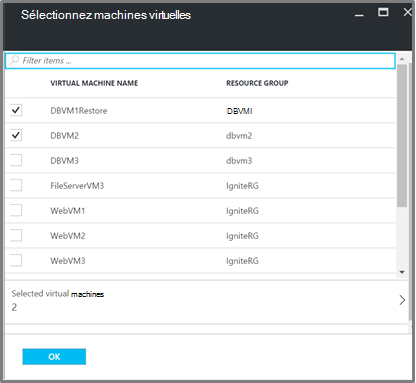

<properties
   pageTitle="Sauvegarder et restaurer chiffrées machines virtuelles à l’aide de sauvegarde Azure"
   description="Cet article traite de la sauvegarde et restauration expérience des machines virtuelles chiffrés à l’aide de chiffrement des disques Azure."
   services="backup"
   documentationCenter=""
   authors="JPallavi"
   manager="vijayts"
   editor=""/>
<tags
   ms.service="backup"
   ms.devlang="na"
   ms.topic="article"
   ms.tgt_pltfrm="na"
   ms.workload="storage-backup-recovery"
   ms.date="10/25/2016"
   ms.author="markgal; jimpark; trinadhk"/>

# Sauvegarder et restaurer chiffrées machines virtuelles à l’aide de sauvegarde Azure

Cet article traite d’étapes pour sauvegarder et restaurer des machines virtuelles à l’aide de sauvegarde Azure. Il fournit également des détails sur les scénarios pris en charge, les conditions préalables et les étapes de dépannage dans les cas d’erreur.

## Scénarios pris en charge

> [AZURE.NOTE]
1.  Sauvegarder et restaurer des machines virtuelles chiffrés est pris en charge uniquement pour les machines virtuelles déployé le Gestionnaire de ressources. Il n’est pas pris en charge pour les machines virtuelles classique.  
2.  Il est pris en charge uniquement pour les machines virtuelles chiffrés à l’aide de la clé de chiffrement BitLocker et la clé de chiffrement. Il n’est pas pris en charge pour les machines virtuelles chiffrés à l’aide de clé de chiffrement BitLocker uniquement.  

## Conditions préalables

1.  Machine virtuelle a été chiffré à l’aide de [Chiffrement des disques Azure](../security/azure-security-disk-encryption.md). Il doit être chiffré à l’aide de la clé de chiffrement BitLocker et la clé de chiffrement.
2.  L’archivage sécurisé des services de récupération a été créé et la réplication du stockage défini à l’aide des étapes mentionnées dans l’article [préparer votre environnement pour la sauvegarde](backup-azure-arm-vms-prepare.md).

## Sauvegarde cryptée machine virtuelle
Utilisez les étapes suivantes pour définir objectif de sauvegarde, définir une stratégie, configurez les éléments et déclencheur de sauvegarde.

### Configurer la sauvegarde

1. Si vous avez déjà un archivage sécurisé aux Services de récupération ouvert, passez à l’étape suivante. Si vous avez un Services de récupération n’êtes pas vault ouvert, mais se trouvent dans le portail Azure, dans le menu concentrateur, cliquez sur **Parcourir**.

  - Dans la liste des ressources, tapez **Les Services de récupération**.
  - Lorsque vous commencez à taper, les filtres de liste en fonction de vos entrées. Lorsque vous voyez **les Services de récupération chambres fortes**, cliquez dessus.
  
        

    La liste des Services de récupération chambres fortes s’affiche. Dans la liste des Services de récupération chambres fortes, sélectionnez un archivage sécurisé.

    Le tableau de bord sélectionné l’archivage sécurisé s’ouvre.

2. Dans la liste des éléments qui s’affiche sous l’archivage sécurisé, cliquez sur **sauvegarde** pour ouvrir la carte de sauvegarde.

       
    
3. Dans la carte de sauvegarde, cliquez sur **objectif de sauvegarde** pour ouvrir la carte de l’objectif de sauvegarde.

       
    
4.   Sur la carte de sauvegarde objectif, définissez **l’endroit où votre charge de travail s’exécute** sur Azure et **que voulez-vous sauvegarder** à machine virtuelle, puis cliquez sur **OK**.

    La carte de sauvegarde objectif se ferme et la carte de stratégie de sauvegarde s’ouvre.

       

5. Dans la carte de stratégie de sauvegarde, sélectionnez la stratégie de sauvegarde que vous voulez appliquer à l’archivage sécurisé et cliquez sur **OK**.

       

    Les détails de la stratégie par défaut sont répertoriées dans les détails. Si vous voulez créer une stratégie, sélectionnez **Créer un nouveau** dans le menu déroulant. Une fois que vous cliquez sur **OK**, la stratégie de sauvegarde est associée à l’archivage sécurisé.

    Sélectionnez ensuite les ordinateurs virtuels à associer à l’archivage sécurisé.
    
6. Cliquez sur les ordinateurs virtuels chiffrés à associer à la stratégie spécifiée et cliquez sur **OK**.

      
   
7. Cette page affiche un message concernant l’archivage sécurisé clé associé aux ordinateurs virtuels chiffrés sélectionnés. Service de sauvegarde nécessite un accès en lecture seule aux clés et secrets dans l’archivage sécurisé clé. Il utilise les autorisations suivantes à la clé de sauvegarde et le code secret, ainsi que les ordinateurs virtuels associés. 

      

      Maintenant que vous avez défini tous les paramètres pour l’archivage sécurisé, dans la carte de sauvegarde, cliquez sur Activer la sauvegarde dans la partie inférieure de la page. Active la sauvegarde déploie la stratégie à l’archivage sécurisé et les ordinateurs virtuels.

8. La phase suivante de préparation est l’installation de l’Agent machine virtuelle ou veillant l’Agent machine virtuelle est installé. Pour effectuer la même, suivez les étapes mentionnées dans l’article [préparer votre environnement pour la sauvegarde](backup-azure-arm-vms-prepare.md). 

### Déclenchement du travail de sauvegarde
Suivez les étapes mentionnées dans l’article [Sauvegarde Azure machines virtuelles à l’archivage sécurisé des services de récupération](backup-azure-arm-vms.md) pour déclencheur du travail de sauvegarde.

## Restaurer machine virtuelle chiffré
Expérience de restaurer des machines virtuelles chiffrés et non chiffrés est la même. Suivez les étapes mentionnées dans [restaurer machines virtuelles Azure portail](backup-azure-arm-restore-vms.md) pour restaurer la machine virtuelle chiffrée. Au cas où vous voulez restaurer clés et secrets, vous devez vous assurer que l’archivage sécurisé clé les restaurer doit déjà exister.

## Résolution des erreurs

| Opération | Détails de l’erreur | Résolution |
| -------- | -------- | -------|
| Sauvegarde | Échec de la validation comme machine virtuelle est chiffré avec BEK uniquement. Effectuer des sauvegardes régulières peuvent être activés uniquement pour les machines virtuelles chiffrées avec BEK et KEK. | Machine virtuelle doivent être chiffrée à l’aide de BEK et KEK. Après cela, la sauvegarde doit être activée. |
| Restaurer | Vous ne peut pas restaurer cet ordinateur virtuel chiffré dans la mesure où l’archivage sécurisé clé associée à cet ordinateur virtuel n’existe pas. | Créer l’archivage sécurisé clé à l’aide de la [Prise en main l’archivage sécurisé de clé Azure](../key-vault/key-vault-get-started.md). Consultez l’article [restaurer la clé de l’archivage sécurisé clés et un code secret à l’aide de sauvegarde Azure](backup-azure-restore-key-secret.md) restaurer secret et la clé si elles ne sont pas présentes. |
| Restaurer | Vous ne peut pas restaurer cet ordinateur virtuel chiffré comme clé et un code secret associé à cet ordinateur virtuel n’existent pas. | Consultez l’article [restaurer secret à l’aide de sauvegarde Azure et la clé de l’archivage sécurisé clés](backup-azure-restore-key-secret.md) pour restaurer secret et la clé si elles ne sont pas présentes. |
