<properties
    pageTitle="Tout d’abord rechercher : protéger machines virtuelles Azure avec un archivage sécurisé des services de récupération | Microsoft Azure"
    description="Protéger des machines virtuelles Azure avec un archivage sécurisé des services de récupération. Utiliser les sauvegardes de machines virtuelles déployé le Gestionnaire de ressources, machines virtuelles déployé classique et machines virtuelles stockage Premium pour protéger vos données. Créer et enregistrer un archivage sécurisé des services de récupération. Enregistrer des machines virtuelles, créer stratégie et protéger des machines virtuelles dans Azure."
    services="backup"
    documentationCenter=""
    authors="markgalioto"
    manager="cfreeman"
    editor=""
    keyword="backups; vm backup"/>

<tags
    ms.service="backup"
    ms.workload="storage-backup-recovery"
    ms.tgt_pltfrm="na"
    ms.devlang="na"
    ms.topic="hero-article"
    ms.date="10/13/2016"
    ms.author="markgal; jimpark"/>

# Tout d’abord rechercher : protéger machines virtuelles Azure avec un archivage sécurisé des services de récupération

> [AZURE.SELECTOR]
- [Protéger des machines virtuelles avec un archivage sécurisé des services de récupération](backup-azure-vms-first-look-arm.md)
- [Protéger des machines virtuelles avec un archivage sécurisé sauvegarde](backup-azure-vms-first-look.md)

Ce didacticiel vous permet d’accéder à travers les étapes permettant de créer un archivage sécurisé des services de récupération et sauvegarder une Azure machine virtuelle (). Chambres fortes de services de récupération protéger :

- Azure machines virtuelles déployé le Gestionnaire de ressources
- Machines virtuelles classiques
- Machines virtuelles de stockage standard
- Stockage Premium machines virtuelles
- Machines virtuelles chiffrées avec le chiffrement de disque Azure, BEK et KEK

Pour plus d’informations sur la protection du stockage Premium machines virtuelles, voir [sauvegarder et restaurer des machines virtuelles stockage Premium](backup-introduction-to-azure-backup.md#back-up-and-restore-premium-storage-vms)

>[AZURE.NOTE] Ce didacticiel suppose que vous disposez déjà d’une machine virtuelle dans votre abonnement Azure et que vous avez pris des mesures pour permettre le service de sauvegarde à accéder à la machine virtuelle.

[AZURE.INCLUDE [learn-about-Azure-Backup-deployment-models](../../includes/backup-deployment-models.md)]

À un niveau élevé, voici les étapes que vous devez effectuer.  

1. Créer un archivage sécurisé des services de récupération pour une machine virtuelle.
2. Utiliser le portail Azure pour sélectionner un scénario, définir une stratégie, identifier les éléments à protéger.
3. Exécuter la sauvegarde initiale.

## Créer un archivage sécurisé des services de récupération pour une machine virtuelle

Un archivage sécurisé des services de récupération est une entité qui stocke les sauvegardes et les points de récupération qui ont été créées au fil du temps. L’archivage sécurisé des services de récupération contienne également la stratégie de sauvegarde appliquée aux ordinateurs virtuels protégées.

>[AZURE.NOTE] Sauvegarde des machines virtuelles est un processus local. Vous ne pouvez pas sauvegarder vos machines virtuelles d’un emplacement sur un archivage sécurisé des services de récupération dans un autre emplacement. Par conséquent, pour chaque emplacement Azure qui a machines virtuelles à sauvegarder, l’archivage sécurisé des services de récupération au moins un doit exister dans cet emplacement.

Pour créer un archivage sécurisé des services de récupération :

1. Connectez-vous au [portail Azure](https://portal.azure.com/).

2. Dans le menu concentrateur, cliquez sur **Parcourir** , dans la liste des ressources, tapez **Les Services de récupération**. Lorsque vous commencez à taper, les filtres de liste en fonction de vos entrées. Cliquez sur **Services de récupération de l’archivage sécurisé**.

    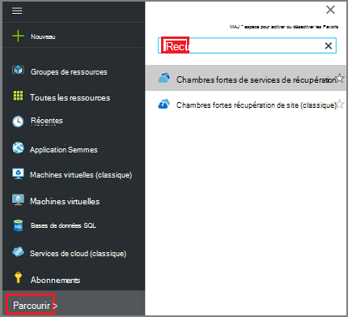  

    La liste des chambres fortes de services de récupération sont affichés.

3. Dans le menu **chambres fortes Services de récupération** , cliquez sur **Ajouter**.

    

    La carte de l’archivage sécurisé aux Services de récupération s’ouvre et vous invite à fournir un **nom**, un **abonnement**, un **groupe de ressources**et un **emplacement**.

    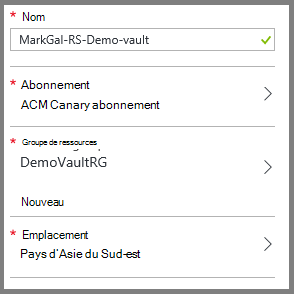

4. Pour **nom**, entrez un nom convivial pour identifier l’archivage sécurisé. Le nom doit être unique pour l’abonnement Azure. Tapez un nom qui contient entre 2 et 50 caractères. Il doit commencer par une lettre et peut contenir uniquement des lettres, des chiffres et des traits d’union.

5. Cliquez sur l' **abonnement** pour afficher la liste des abonnements disponibles. Si vous n’êtes pas sûr du type d’abonnement à utiliser, utilisez la valeur par défaut (ou suggérées) abonnement. Il existe plusieurs choix uniquement si votre compte professionnel est associé à plusieurs abonnements Azure.

6. Cliquez sur **groupe de ressources** pour afficher la liste des groupes de ressources disponibles, ou cliquez sur **Nouveau** pour créer un groupe de ressources. Pour plus d’informations sur les groupes de ressources, voir [vue d’ensemble du Gestionnaire de ressources Azure](../azure-resource-manager/resource-group-overview.md)

7. Cliquez sur l' **emplacement** pour sélectionner la zone géographique pour l’archivage sécurisé. L’archivage sécurisé **doit** être dans la même région en tant que les ordinateurs virtuels que vous souhaitez protéger.

    >[AZURE.IMPORTANT] Si vous n’êtes pas sûr de l’emplacement dans lequel se trouve votre machine virtuelle, fermer la boîte de dialogue de création de l’archivage sécurisé, puis accédez à la liste des Machines virtuelles dans le portail. Si vous avez machines virtuelles dans plusieurs régions, créer une archivage sécurisé des services de récupération de chaque région. Créer l’archivage sécurisé dans le premier emplacement avant de passer à l’emplacement suivant. Il est inutile de spécifier des comptes de stockage pour stocker les données de sauvegarde--l’archivage sécurisé des services de récupération et le service de sauvegarde Azure gérer automatiquement.

8. Cliquez sur **créer**. Il peut prendre un certain temps pour l’archivage sécurisé des services de récupération à créer. Surveiller les notifications d’état dans l’angle supérieur droit dans le portail. Une fois votre l’archivage sécurisé est créé, il apparaît dans la liste des chambres fortes de services de récupération.

    

À présent que vous avez créé votre l’archivage sécurisé, découvrez comment définir la réplication de stockage.

### Définir la réplication du stockage

L’option de réplication de stockage vous permet de choisir entre geo redondants et stockage localement redondant. Par défaut, votre l’archivage sécurisé comprend un stockage geo redondants. Laissez l’option définie sur stockage geo redondants s’il s’agit de votre sauvegarde principal. Choisissez le stockage localement redondant si vous souhaitez une option plus économique n’est pas comme résistant. En savoir plus sur [geo redondants](../storage/storage-redundancy.md#geo-redundant-storage) et options de stockage [localement redondantes](../storage/storage-redundancy.md#locally-redundant-storage) dans [vue d’ensemble de la réplication de stockage Azure](../storage/storage-redundancy.md).

Pour modifier le paramètre de réplication de stockage :

1. Sélectionnez votre l’archivage sécurisé pour ouvrir le tableau de bord de l’archivage sécurisé et la carte de paramètres. Si la carte de **paramètres** ne s’ouvre, cliquez sur **tous les paramètres** dans le tableau de bord de l’archivage sécurisé.

2. Dans la carte de **paramètres** , cliquez sur **Sauvegarde Infrastructure** > **Backup Configuration** pour ouvrir la carte de **Configuration de sauvegarde** . Dans la carte de **Configuration de sauvegarde** , sélectionnez l’option de réplication de stockage pour votre l’archivage sécurisé.

    

    Après avoir choisi l’option de stockage pour votre l’archivage sécurisé, vous êtes prêt à associer la machine virtuelle l’archivage sécurisé. Pour commencer l’association, vous devez découvrir et enregistrer les machines virtuelles Azure.

## Sélectionnez un objectif de sauvegarde, définir une stratégie et définir les éléments à protéger

Avant d’enregistrer une machine virtuelle avec un archivage sécurisé, exécutez le processus de détection pour vous assurer que les nouvelles machines virtuelles qui ont été ajoutés à l’abonnement sont identifiés. Les requêtes de processus Azure pour la liste des ordinateurs virtuels de l’abonnement, ainsi que des informations supplémentaires telles que le nom du service cloud et la région. Dans le portail Azure, scénario fait référence à ce que vous vous apprêtez à placer dans l’archivage sécurisé des services de récupération. La stratégie est l’Échéancier pour quand et à quelle fréquence les points de récupération sont prises. La stratégie inclut également la durée de rétention pour les points de récupération.

1. Si vous disposez déjà d’un services de récupération de l’archivage sécurisé ouvrir, passez à l’étape 2. Si vous n’avez pas une récupération services vault ouvert, mais se trouvent dans le portail Azure, dans le menu concentrateur, cliquez sur **Parcourir**.

  - Dans la liste des ressources, tapez **Les Services de récupération**.
  - Lorsque vous commencez à taper, les filtres de liste en fonction de vos entrées. Lorsque vous voyez **les Services de récupération chambres fortes**, cliquez dessus.

      

    La liste des chambres fortes de services de récupération s’affiche.
  - Dans la liste des chambres fortes récupération services, sélectionnez un archivage sécurisé.

    Le tableau de bord sélectionné l’archivage sécurisé s’ouvre.

    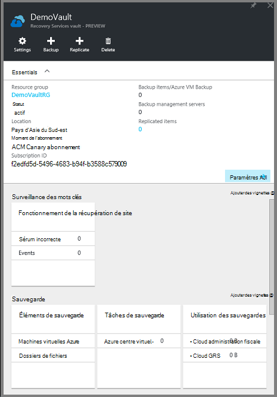

2. Dans le menu Tableau de bord de l’archivage sécurisé, cliquez sur **sauvegarde** pour ouvrir la carte de sauvegarde.

    

    Lorsque la carte s’ouvre, le service de sauvegarde de recherche pour les nouvelles machines virtuelles dans l’abonnement.

    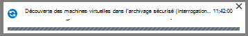

3. Dans la carte de sauvegarde, cliquez sur **objectif de sauvegarde** pour ouvrir la carte de l’objectif de sauvegarde.

    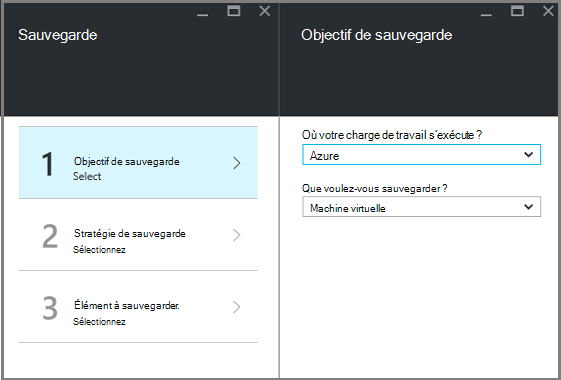

4. Sur la carte de sauvegarde objectif, définissez **l’endroit où votre charge de travail s’exécute** sur Azure et **que voulez-vous sauvegarder** à machine virtuelle, puis cliquez sur **OK**.

    La carte de sauvegarde objectif se ferme et la carte de stratégie de sauvegarde s’ouvre.

    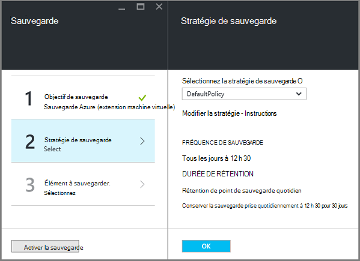

5. Dans la carte de stratégie de sauvegarde, sélectionnez la stratégie de sauvegarde que vous voulez appliquer à l’archivage sécurisé et cliquez sur **OK**.

    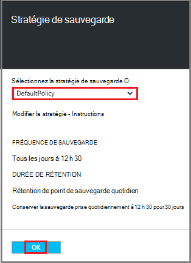

    Les détails de la stratégie par défaut sont répertoriées dans les détails. Si vous voulez créer une stratégie, sélectionnez **Créer un nouveau** dans le menu déroulant. Le menu déroulant fournit également une option pour changer l’heure lorsque l’instantané, 19 h. Pour obtenir des instructions sur la définition d’une stratégie de sauvegarde, voir [définir une stratégie de sauvegarde](backup-azure-vms-first-look-arm.md#defining-a-backup-policy). Une fois que vous cliquez sur **OK**, la stratégie de sauvegarde est associée à l’archivage sécurisé.

    Sélectionnez ensuite les ordinateurs virtuels à associer à l’archivage sécurisé.

6. Sélectionnez les machines virtuelles à associer à la stratégie spécifiée et cliquez sur **Sélectionner**.

    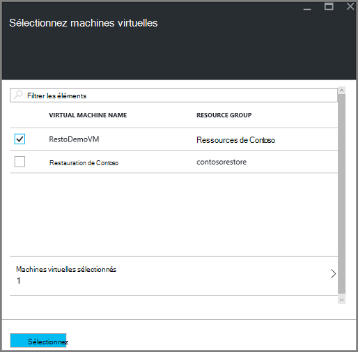

    Si vous ne voyez pas la machine virtuelle souhaitée, vérifiez qu’il existe dans le même emplacement Azure que l’archivage sécurisé aux Services de récupération.

7. Maintenant que vous avez défini tous les paramètres pour l’archivage sécurisé, dans la carte de sauvegarde, cliquez sur **Activer la sauvegarde** dans la partie inférieure de la page. La stratégie est déployé à l’archivage sécurisé et les ordinateurs virtuels.

    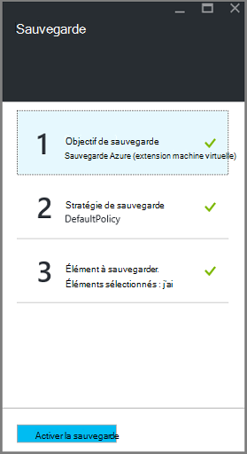

## Sauvegarde initiale

Une fois qu’une stratégie de sauvegarde a été déployée sur l’ordinateur virtuel, ce qui signifie pas les données a été sauvegardées. Par défaut, la première sauvegarde planifiée (tel que défini dans la stratégie de sauvegarde) est la sauvegarde initiale. Jusqu'à ce que la sauvegarde initiale se produit, le dernier état de sauvegarde sur la carte de **Travaux de sauvegarde** s’affiche comme **Avertissement (sauvegarde initiale en attente)**.

À moins que votre sauvegarde initiale est due à commencer plus tôt, il est recommandé d’exécuter **Sauvegarder maintenant**.

Pour exécuter **Sauvegarder maintenant**:

1. Dans le tableau de bord de l’archivage sécurisé, sur la vignette de **sauvegarde** , cliquez sur **Machines virtuelles Azure**  
    

    La carte **d’Éléments de sauvegarde** s’ouvre.

2. Sur la carte **d’Éléments de sauvegarde** , avec le bouton droit de l’archivage sécurisé que vous souhaitez sauvegarder, puis cliquez sur **Sauvegarder maintenant**.

    

    L’opération de sauvegarde se déclenche.  

    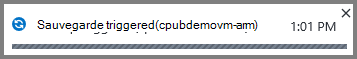

3. Pour que votre sauvegarde initiale est terminée, dans le tableau de bord de l’archivage sécurisé, sur la vignette de **Travaux de sauvegarde** , cliquez sur **Azure machines virtuelles**.

    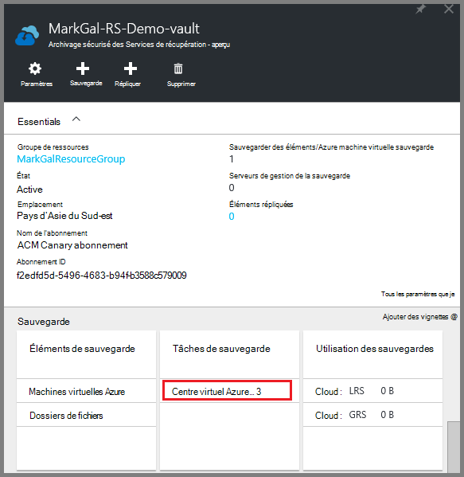

    La carte de travaux de sauvegarde s’ouvre.

4. Dans la carte de travaux de sauvegarde, vous pouvez voir l’état de toutes les tâches.

    

    >[AZURE.NOTE] Dans le cadre de l’opération de sauvegarde, le service de sauvegarde Azure envoie une commande à l’extension de sauvegarde dans chaque machine virtuelle pour vider toutes les écritures et prendre une capture instantanée cohérente.

    Lorsque la sauvegarde est terminée, le statut est *terminé*.

[AZURE.INCLUDE [backup-create-backup-policy-for-vm](../../includes/backup-create-backup-policy-for-vm.md)]

## Installer l’Agent machine virtuelle sur la machine virtuelle

Ces informations sont fournies au cas où il est nécessaire. L’Agent de machine virtuelle Azure doit être installé sur l’ordinateur virtuel Azure pour l’extension de sauvegarde à utiliser. Toutefois, si votre ordinateur virtuel a été créé à partir de la galerie Azure, puis l’Agent machine virtuelle est déjà présent sur l’ordinateur virtuel. Machines virtuelles sont migrées à partir de centres de données locale serait n’a pas l’Agent machine virtuelle installé. Dans ce cas, l’Agent machine virtuelle doit être installé. Si vous rencontrez des problèmes de sauvegarde de la machine virtuelle Azure, vérifiez que l’Agent de machine virtuelle Azure est correctement installé sur l’ordinateur virtuel (voir le tableau ci-dessous). Si vous créez une machine virtuelle personnalisée, [Assurez-vous que la case à cocher **installer l’Agent machine virtuelle** est sélectionnée](../virtual-machines/virtual-machines-windows-classic-agents-and-extensions.md) avant la machine virtuelle est mis en service.

En savoir plus sur [l’Agent de machine virtuelle](https://go.microsoft.com/fwLink/?LinkID=390493&clcid=0x409) et [comment l’installer](../virtual-machines/virtual-machines-windows-classic-manage-extensions.md).

Le tableau suivant fournit des informations supplémentaires sur la mémoire virtuelle Agent pour Windows et machines virtuelles Linux.

| **Opération** | **Windows** | **Linux** |
| --- | --- | --- |
| Installation de l’Agent de machine virtuelle | <li>Téléchargez et installez l' [agent MSI](http://go.microsoft.com/fwlink/?LinkID=394789&clcid=0x409). Vous avez besoin des privilèges d’administrateur pour terminer l’installation. <li>[Mettre à jour la propriété machine virtuelle](http://blogs.msdn.com/b/mast/archive/2014/04/08/install-the-vm-agent-on-an-existing-azure-vm.aspx) pour indiquer que l’agent est installé. | <li> Installer dernière [agent Linux](https://github.com/Azure/WALinuxAgent) à partir de GitHub. Vous avez besoin des privilèges d’administrateur pour terminer l’installation. <li> [Mettre à jour la propriété machine virtuelle](http://blogs.msdn.com/b/mast/archive/2014/04/08/install-the-vm-agent-on-an-existing-azure-vm.aspx) pour indiquer que l’agent est installé. |
| Mise à jour de l’Agent de machine virtuelle | Mise à jour de l’Agent de machine virtuelle est aussi simple que les [fichiers binaires Agent machine virtuelle](http://go.microsoft.com/fwlink/?LinkID=394789&clcid=0x409)la réinstallation.  Vérifiez qu’aucune opération de sauvegarde ne s’exécute pendant que l’agent machine virtuelle est mis à jour. | Suivez les instructions de [mise à jour de l’Agent de machine virtuelle Linux ](../virtual-machines-linux-update-agent.md).  Vérifiez qu’aucune opération de sauvegarde ne s’exécute pendant que l’Agent machine virtuelle est mis à jour. |
| Validation de l’installation de l’Agent de machine virtuelle | <li>Accédez au dossier *C:\WindowsAzure\Packages* dans la machine virtuelle Azure. <li>Vous devriez trouver le fichier WaAppAgent.exe présenter.<li> Cliquez sur le fichier, accédez aux **Propriétés**et puis sélectionnez l’onglet **Détails** . Le champ Version du produit doit être 2.6.1198.718 ou une version ultérieure. | N/A |

### Extension de sauvegarde

Une fois l’Agent machine virtuelle est installé sur l’ordinateur virtuel, le service de sauvegarde Azure installe l’extension de sauvegarde à l’Agent de machine virtuelle. Le service de sauvegarde Azure met à niveau en toute transparence et correctifs l’extension de sauvegarde sans intervention de l’utilisateur supplémentaires.

L’extension de sauvegarde est installée par le service de sauvegarde si la machine virtuelle est en cours d’exécution. Une machine virtuelle en cours d’exécution fournit les plus grande chances d’obtenir un point de récupération des applications. Toutefois, le service de sauvegarde Azure continue sauvegarder la machine virtuelle même si elle est désactivée, et l’extension n’a pas pu être installée. Il s’agit virtuelle en mode hors connexion. Dans ce cas, le point de récupération seront *blocage cohérente*.

## Informations de dépannage
Si vous rencontrez des problèmes accomplir certaines tâches dans cet article, consultez les [conseils de dépannage](backup-azure-vms-troubleshoot.md).

## Tarifs
Sauvegarde machine virtuelle Azure est facturé en fonction de modèle Instances protégé. Pour plus d’informations sur les [Prix de sauvegarde](https://azure.microsoft.com/pricing/details/backup/)

## Questions ?
Si vous avez des questions, ou s’il existe une fonctionnalité que vous voulez voir inclus, [envoyez-nous vos commentaires](http://aka.ms/azurebackup_feedback).
