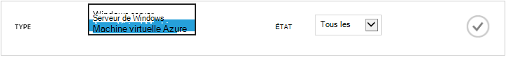
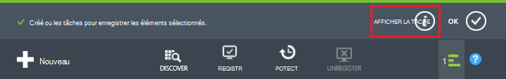
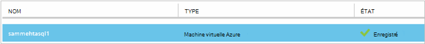
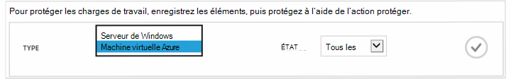
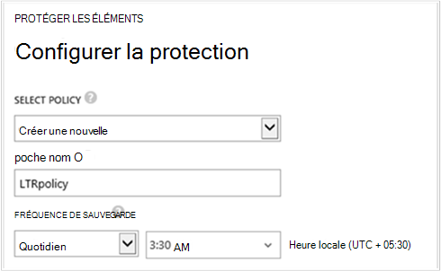
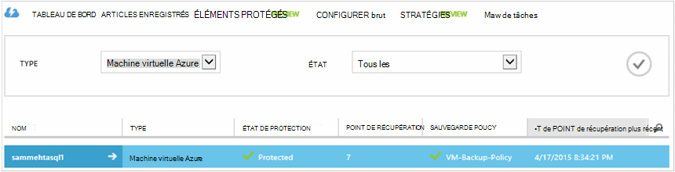

<properties
    pageTitle="Aperçu : Protéger machines virtuelles Azure avec un archivage sécurisé sauvegarde | Microsoft Azure"
    description="Protéger des machines virtuelles Azure avec l’archivage sécurisé de sauvegarde. Didacticiel explique créer l’archivage sécurisé, inscrire machines virtuelles, créer des stratégies et protéger des machines virtuelles dans Azure."
    services="backup"
    documentationCenter=""
    authors="markgalioto"
    manager="cfreeman"
    editor=""/>

<tags
    ms.service="backup"
    ms.workload="storage-backup-recovery"
    ms.tgt_pltfrm="na"
    ms.devlang="na"
    ms.topic="hero-article"
    ms.date="09/15/2016"
    ms.author="markgal; jimpark"/>

# Tout d’abord rechercher : sauvegarde des machines virtuelles Azure

> [AZURE.SELECTOR]
- [Protéger des machines virtuelles avec un archivage sécurisé des services de récupération](backup-azure-vms-first-look-arm.md)
- [Protéger des machines virtuelles Azure avec un archivage sécurisé sauvegarde](backup-azure-vms-first-look.md)

Ce didacticiel vous permet d’accéder à travers les étapes pour sauvegarder une Azure machine virtuelle () à un archivage sécurisé sauvegarde dans Azure. Cet article décrit le modèle classique ou le modèle de déploiement de Service Manager, pour la sauvegarde des machines virtuelles. Si vous êtes intéressé sauvegarder une machine virtuelle sur un archivage sécurisé de Services de récupération appartenant à un groupe de ressources, consultez [tout d’abord rechercher : protéger machines virtuelles avec un archivage sécurisé des services de récupération](backup-azure-vms-first-look-arm.md). Pour effectuer ce didacticiel, ces conditions préalables doivent être réunies :

- Vous avez créé une machine virtuelle dans votre abonnement Azure.
- La machine virtuelle dispose d’une connectivité à Azure adresses IP publiques. Pour plus d’informations, voir [la connectivité réseau](./backup-azure-vms-prepare.md#network-connectivity).

Pour sauvegarder une machine virtuelle, il existe cinq étapes principales :  

 créez un archivage sécurisé sauvegarde ou identifiez un archivage sécurisé sauvegarde existant.  
 le portail Azure classique permet de découvrir et enregistrer les machines virtuelles.  
 installer l’Agent machine virtuelle.  
 créer la stratégie pour la protection des machines virtuelles.  
 exécuter la sauvegarde.

>[AZURE.NOTE] Azure comporte deux modèles de déploiement pour la création et utilisation des ressources : [Gestionnaire de ressources et classique](../resource-manager-deployment-model.md). Ce didacticiel est utilisée avec les ordinateurs virtuels pouvant être créées dans le portail Azure classique. Le service de sauvegarde Azure prend en charge le Gestionnaire de ressources sur des ordinateurs virtuels. Pour plus d’informations sur la sauvegarde des machines virtuelles à un archivage sécurisé des services de récupération, voir [First Look : protéger machines virtuelles avec un archivage sécurisé des services de récupération](backup-azure-vms-first-look-arm.md).

## Étape 1 : créer un archivage sécurisé sauvegarde pour une machine virtuelle

Un archivage sécurisé sauvegarde est une entité qui stocke les sauvegardes et les points de récupération qui ont été créées au fil du temps. L’archivage sécurisé sauvegarde contienne également les stratégies de sauvegarde qui sont appliqués aux machines virtuelles à sauvegarder.

1. Connectez-vous au [portail Azure classique](http://manage.windowsazure.com/).

2. Dans le coin inférieur gauche du portail Azure, cliquez sur **Nouveau**

    

3. Dans l’Assistant Création rapide, cliquez sur **Data Services** > **Services de récupération** > **L’archivage sécurisé sauvegarde** > **Création rapide**.

    

    L’Assistant vous invite pour le **nom** et **région**. Si vous gérez plus d’un abonnement, une boîte de dialogue pour le choix de l’abonnement s’affiche.

4. Pour **nom**, entrez un nom convivial pour identifier l’archivage sécurisé. Le nom doit être unique pour l’abonnement Azure.

5. Dans **la région**, sélectionnez la région géographique pour l’archivage sécurisé. L’archivage sécurisé **doit** être dans la même région en tant que les ordinateurs virtuels qu’il protège.

    Si vous ne connaissez pas la zone dans laquelle se trouve votre machine virtuelle, fermez cet Assistant et cliquez sur **Machines virtuelles** dans la liste des services Azure. La colonne emplacement fournit le nom de la région. Si vous avez machines virtuelles dans plusieurs régions, créez un archivage sécurisé sauvegarde dans chaque région.

6. S’il n’existe aucune boîte de dialogue **abonnement** de l’Assistant, passez à l’étape suivante. Si vous travaillez avec plusieurs abonnements, sélectionnez un abonnement à associer à l’archivage sécurisé sauvegarde nouveau.

    

7. Cliquez sur **créer l’archivage sécurisé**. Il peut prendre un certain temps pour l’archivage sécurisé sauvegarde à créer. Surveiller les notifications d’état au bas du portail.

    

    Un message confirme que le archivage sécurisé a été créé. Il est répertorié dans la page **services de récupération** comme étant **actif**.

    

8. Dans la liste des chambres fortes sur **Services de récupération de** page, sélectionnez l’archivage sécurisé que vous avez créé pour lancer la page de **Démarrage rapide** .

    

9. Dans la page de **Démarrage rapide** , cliquez sur **configurer** pour ouvrir l’option de réplication de stockage.
    

10. L’option **réplication de stockage** , choisissez l’option de réplication pour votre l’archivage sécurisé.

    

    Par défaut, votre l’archivage sécurisé comprend un stockage geo redondants. Choisissez le stockage geo redondants s’il s’agit de votre sauvegarde principal. Choisissez le stockage localement redondant si vous souhaitez une option plus économique n’est pas tout à fait comme résistant. En savoir plus sur les options de stockage geo redondants et localement redondantes dans [vue d’ensemble de la réplication de stockage Azure](../storage/storage-redundancy.md).

Après avoir choisi l’option de stockage pour votre l’archivage sécurisé, vous êtes prêt à associer la machine virtuelle l’archivage sécurisé. Pour commencer l’association, découvrir et enregistrer les machines virtuelles Azure.

## Étape 2 : Découvrez et machines virtuelles inscrire Azure
Avant d’enregistrer la machine virtuelle avec un archivage sécurisé, exécutez le processus de détection pour identifier les nouvelles machines virtuelles. Ceci renvoie une liste des machines virtuelles dans l’abonnement, ainsi que des informations supplémentaires, telles que le nom du service cloud et la région.

1. Connectez-vous au [portail Azure classique](http://manage.windowsazure.com/)

2. Dans le portail Azure classique, cliquez sur **Services de récupération** pour ouvrir la liste des Services de récupération chambres fortes.
    

3. Dans la liste des chambres fortes, sélectionnez l’archivage sécurisé pour sauvegarder une machine virtuelle.

    Lorsque vous sélectionnez votre l’archivage sécurisé, il s’ouvre dans la page de **Démarrage rapide**

4. Dans le menu de l’archivage sécurisé, cliquez sur **Éléments enregistrés**.

    

5. Dans le menu **Type** , sélectionnez **Machine virtuelle Azure**.

    

6. Cliquez sur **Rechercher** dans la partie inférieure de la page.
    

    Le processus de découverte peut prendre quelques minutes tandis que les ordinateurs virtuels sont en cours sous forme de tableau. Il existe une notification en bas de l’écran qui vous permet de déterminer que le processus est en cours d’exécution.

    

    Les modifications de notification lorsque le processus est terminer.

    

7. Cliquez sur **Enregistrer** dans la partie inférieure de la page.
    

8. Dans le menu contextuel **Enregistrer les éléments** , sélectionnez les machines virtuelles que vous souhaitez enregistrer.

    >[AZURE.TIP] Machines virtuelles peuvent être enregistrés en même temps.

    Une tâche est créée pour chaque machine virtuelle que vous avez sélectionnées.

9. Cliquez sur **Afficher la tâche** dans la notification pour accéder à la page **tâches** .

    

    La machine virtuelle apparaît également dans la liste des éléments enregistrés, ainsi que l’état de l’opération d’enregistrement.

    

    Lorsque l’opération terminée, les changements d’état pour refléter l’état *enregistré* .

    

## Étape 3 : installer l’Agent machine virtuelle sur la machine virtuelle

L’Agent de machine virtuelle Azure doit être installé sur l’ordinateur virtuel Azure pour l’extension de sauvegarde à utiliser. Si votre ordinateur virtuel a été créé à partir de la galerie Azure, l’Agent de machine virtuelle est déjà présent sur la machine virtuelle. Vous pouvez passer à la [protection de vos ordinateurs virtuels](backup-azure-vms-first-look.md#step-4-protect-azure-virtual-machines).

Si votre ordinateur virtuel migré à partir d’un centre de données locale, la machine virtuelle probablement n’a pas installé l’Agent de machine virtuelle. Vous devez installer l’Agent machine virtuelle sur l’ordinateur virtuel avant de procéder à protéger la machine virtuelle. Pour plus d’informations sur l’installation de l’Agent de machine virtuelle, consultez la [section machine virtuelle Agent de l’article machines virtuelles de sauvegarde](backup-azure-vms-prepare.md#vm-agent).

## Étape 4 : créer la stratégie de sauvegarde
Avant de déclencher l’opération de sauvegarde initiale, définissez la planification lorsque des instantanés sauvegarde. La planification lorsque des instantanés sauvegarde et la durée de ces instantanés sont conservés, est la stratégie de sauvegarde. Les informations de rétention basées sur jeu de rotation des sauvegardes acquis-père-fils.

1. Naviguez jusqu'à l’archivage sécurisé sauvegarde sous **Services de récupération** dans le portail Azure classique, puis cliquez sur **Éléments enregistrés**.
2. Sélectionnez **Machine virtuelle Azure** dans le menu déroulant.

    

3. Cliquez sur **protéger** dans la partie inférieure de la page.
    

    L' **Assistant de protéger les éléments** apparaît et répertorie *uniquement* les machines virtuelles qui sont enregistrés et pas protégées.

    

4. Sélectionnez les machines virtuelles que vous voulez protéger.

    S’il existe deux ou plusieurs machines virtuelles portant le même nom, utilisez le Service Cloud pour faire la distinction entre les machines virtuelles.

5. Dans le menu **configurer protection** sélectionnez une stratégie existante ou créer une nouvelle stratégie pour protéger les machines virtuelles que vous avez identifiés.

    Nouveau chambres fortes sauvegarde aient une stratégie par défaut associée à l’archivage sécurisé. Cette stratégie prend un instantané de chaque soir tous les jours, et l’instantané quotidien est conservée pendant 30 jours. Chaque stratégie sauvegarde peut avoir plusieurs machines virtuelles qui lui est associés. Toutefois, la machine virtuelle peut uniquement être associée à une stratégie à la fois.

    

    >[AZURE.NOTE] Une stratégie de sauvegarde inclut un jeu de rétention pour les sauvegardes planifiées. Si vous sélectionnez une stratégie de sauvegarde existante, vous ne pourrez pas modifier les options de rétention dans l’étape suivante.

6. Sous **Plage de rétention** définissez l’étendue quotidienne, hebdomadaire, mensuel et annuel pour les points de sauvegarde spécifiques.

    

    Stratégie de rétention spécifie la durée pour stocker une sauvegarde. Vous pouvez spécifier des autres stratégies de rétention basées sur lors de la sauvegarde est effectuée.

7. Cliquez sur **tâches** pour afficher la liste des tâches **Configurer la Protection** .

    

    À présent que vous avez établi la stratégie, accédez à l’étape suivante et exécutez la sauvegarde initiale.

## Étape 5 : sauvegarde initiale

Une fois qu’une machine virtuelle a été protégée par une stratégie, vous pouvez afficher cette relation sous l’onglet **Éléments protégé** . Jusqu'à ce que la sauvegarde initiale se produit, l' **État de Protection** affiche **protégé - (en attente de sauvegarde initiale)**. Par défaut, la première sauvegarde planifiée est la *sauvegarde initiale*.

Pour démarrer la sauvegarde initiale maintenant :

1. Dans la page **Éléments protégé** , cliquez sur **Sauvegarder maintenant** dans la partie inférieure de la page.
    

    Le service de sauvegarde Azure crée une sauvegarde pour l’opération de sauvegarde initiale.

2. Cliquez sur l’onglet **tâches** pour afficher la liste des tâches.

    

    Lors de la sauvegarde initiale est terminée, l’état de la machine virtuelle dans l’onglet **Éléments protégé** est *protégé*.

    

    >[AZURE.NOTE] Sauvegarde des machines virtuelles est un processus local. Vous ne pouvez pas sauvegarder machines virtuelles à partir d’une région à un archivage sécurisé sauvegarde dans une autre zone. Par conséquent, pour chaque région Azure qui comporte des ordinateurs virtuels qui doivent être sauvegardées, l’archivage sécurisé sauvegarde au moins une doit être créé dans cette zone.

## Étapes suivantes
À présent que vous avez sauvegardé une machine virtuelle, il existe plusieurs étapes suivantes qui pourraient être utiles. La plus logique consiste à vous familiariser avec la restauration des données sur un ordinateur virtuel. Toutefois, il existe des tâches de gestion qui vous aidera à comprendre comment protéger vos données et réduire les coûts.

- [Gérer et analyser vos machines virtuelles](backup-azure-manage-vms.md)
- [Restaurer des machines virtuelles](backup-azure-restore-vms.md)
- [Conseils de dépannage](backup-azure-vms-troubleshoot.md)

## Questions ?
Si vous avez des questions, ou s’il existe une fonctionnalité que vous voulez voir inclus, [envoyez-nous vos commentaires](http://aka.ms/azurebackup_feedback).
