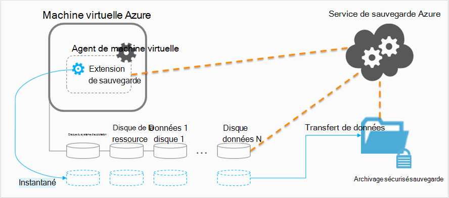

<properties
    pageTitle="Planification de votre infrastructure de sauvegarde machine virtuelle dans Azure | Microsoft Azure"
    description="Considérations importantes lors de la planification sauvegarder des machines virtuelles dans Azure"
    services="backup"
    documentationCenter=""
    authors="markgalioto"
    manager="cfreeman"
    editor=""
    keywords="machines virtuelles sauvegarde, sauvegarder des machines virtuelles"/>

<tags
    ms.service="backup"
    ms.workload="storage-backup-recovery"
    ms.tgt_pltfrm="na"
    ms.devlang="na"
    ms.topic="article"
    ms.date="10/19/2016"
    ms.author="trinadhk; jimpark; markgal;"/>

# <a name="plan-your-vm-backup-infrastructure-in-azure"></a>Planifier votre infrastructure de sauvegarde machine virtuelle dans Azure
Cet article fournit des performances et les suggestions de ressources pour vous aider à planifier votre infrastructure de sauvegarde machine virtuelle. Il définit également les aspects essentiels du service sauvegarde ; Ces aspects peuvent être très importantes pour déterminer votre architecture, capacité de planification et des prévisions. Si vous avez [préparé votre environnement](backup-azure-vms-prepare.md), c’est l’étape suivante avant de commencer [à machines virtuelles sauvegarde](backup-azure-vms.md). Si vous avez besoin de plus d’informations sur les machines virtuelles Azure, consultez la [documentation de Machines virtuelles](https://azure.microsoft.com/documentation/services/virtual-machines/).

## <a name="how-does-azure-back-up-virtual-machines"></a>En quoi Azure sauvegarder des machines virtuelles ?
Lorsque le service de sauvegarde Azure lance une opération de sauvegarde à la date planifiée, il déclenche l’extension de sauvegarde pour prendre un instantané de point dans le temps. Cette capture instantanée est considérée en association avec le Service Volume Shadow Copy (VSS) pour obtenir un instantané cohérent des disques dans la machine virtuelle sans avoir à l’arrêter.

Une fois l’instantané, les données sont transférées par le service de sauvegarde Azure à l’archivage sécurisé sauvegarde. Pour rendre le processus de sauvegarde plus efficace, le service identifie et transfère uniquement les blocs de données qui ont été modifiées depuis la dernière sauvegarde.



Lorsque le transfert de données est terminé, l’instantané est supprimée et un point de récupération est créé.

### <a name="data-consistency"></a>Cohérence des données
Sauvegarde et restauration entreprise données critiques sont compliquées par le fait que les données critiques doivent être sauvegardées pendant les applications qui génèrent les données sont en cours d’exécution. Pour contourner ce problème, sauvegarde Azure fournit des sauvegardes cohérentes avec les applications pour charges de travail Microsoft à l’aide de VSS pour vous assurer que les données soient enregistrées correctement au stockage.

>[AZURE.NOTE] Pour les machines virtuelles Linux, uniquement des sauvegardes cohérentes de fichier sont possibles, Linux n’ayant pas une plateforme équivalente à VSS.

Sauvegarde Azure prend en charge les sauvegardes complètes VSS machines virtuelles Windows (pour en savoir plus sur la [sauvegarde complète VSS](http://blogs.technet.com/b/filecab/archive/2008/05/21/what-is-the-difference-between-vss-full-backup-and-vss-copy-backup-in-windows-server-2008.aspx)). Pour activer les sauvegardes VSS, l’en dessous du Registre de clé doit être définie sur l’ordinateur virtuel.

```
[HKEY_LOCAL_MACHINE\SOFTWARE\MICROSOFT\BCDRAGENT]
"USEVSSCOPYBACKUP"="TRUE"
```


Ce tableau décrit les types de la cohérence et les conditions qui ils se produisent sous pendant machine virtuelle Azure sauvegarde et restauration des procédures.

| Cohérence | Basés sur VSS | Explication et des détails |
|-------------|-----------|---------|
| Cohérence des applications | Oui | Il s’agit du type de cohérence idéal pour les charges de travail Microsoft comme il garantit que :<ol><li> La machine virtuelle *démarre*. <li>Il n’est *pas corrompu*. <li>Il existe *sans perte de données*.<li> Les données sont cohérentes à l’application qui utilise les données, en supposant l’application au moment de sauvegarde--à l’aide de VSS.</ol> La plupart des charges de travail Microsoft ont writersVSS qu’effectuer des actions spécifiques à la charge de travail qui sont liées à la cohérence des données. Par exemple, Microsoft SQL Server a enregistreurVSS qui garantit que l’écriture sur le fichier journal des transactions et la base de données est effectuées correctement.<br><br> Machine virtuelle Azure sauvegardes, l’obtention d’un point de récupération des applications signifie que l’extension de sauvegarde a été en mesure d’appeler le flux de travail VSS et achever *correctement* pour pouvoir l’instantané machine virtuelle. Bien entendu, cela signifie que les writersVSS de toutes les applications dans la machine virtuelle Azure ont été également appelés.<br><br>(Découvrez les [Concepts de base de VSS](http://blogs.technet.com/b/josebda/archive/2007/10/10/the-basics-of-the-volume-shadow-copy-service-vss.aspx) et examinez en détail [comment](https://technet.microsoft.com/library/cc785914%28v=ws.10%29.aspx)procéder). |
| Cohérence du système de fichiers | Oui, pour les ordinateurs Windows | Il existe deux scénarios où le point de récupération peut être *système de fichiers cohérente*:<ul><li>Sauvegardes de machines virtuelles Linux dans Azure, Linux n’ayant pas une plateforme équivalente à VSS.<li>Échec VSS lors de la sauvegarde pour les machines virtuelles Windows dans Azure.</li></ul> Dans ces deux cas, la meilleure qui peut être effectuée est pour vous assurer que : <ol><li> La machine virtuelle *démarre*. <li>Il n’est *pas corrompu*.<li>Il existe *sans perte de données*.</ol> Applications doivent implémenter leur propre mécanisme « fix-up » sur les données restaurées.|
| Cohérence des incidents | N° | Cette situation équivaut à une machine virtuelle rencontre un « blocage » (via une réinitialisation matérielle ou logicielle). En règle générale, cela se produit lorsque la machine virtuelle Azure est arrêtée au moment de la sauvegarde. Des sauvegardes Azure machine virtuelle, prise un moyen de point de récupération blocage cohérents que la sauvegarde Azure ne fournit aucune garantie autour de la cohérence des données sur le support de stockage--du point de vue du système d’exploitation ou du point de vue de l’application. Seules les données qui existe déjà sur le disque au moment de la sauvegarde sont qu’obtient capturé et sauvegarder. <br/> <br/> Il existe aucune garantie, dans la plupart des cas, le système d’exploitation démarre. Il est généralement suivi une procédure de vérification du disque, tel que chkdsk, pour corriger les erreurs éventuelles corruption. Toutes les données en mémoire ou écritures qui n’ont pas été complètement vidés sur le disque seront perdues. L’application suit généralement avec son propre mécanisme de vérification en cas d’annulation de données doit être effectuée. <br><br>Par exemple, si le journal des transactions comporte des entrées qui ne figurent pas dans la base de données, puis le logiciel de base de données effectue une annulation jusqu'à ce que les données sont cohérentes. Lorsque les données sont réparties sur plusieurs disques virtuels (par exemple, des volumes fractionnés), un point de récupération cohérent après sinistre ne fournit aucune garantie pour l’exactitude des données.|


## <a name="performance-and-resource-utilization"></a>Utilisation des ressources et des performances
Comme logiciel de sauvegarde est déployé en local, vous devez planifier pour la capacité et l’utilisation des ressources besoins lorsque vous sauvegardez machines virtuelles dans Azure. Les [limites de stockage Azure](azure-subscription-service-limits.md#storage-limits) définir la structure des déploiements machine virtuelle pour optimiser les performances avec un impact minimum charges de travail en cours d’exécution.

Attention aux limites de stockage Azure suivants lors de la planification des performances de sauvegarde :

- Sortie max par le compte de stockage
- Taux de requêtes total par compte de stockage

### <a name="storage-account-limits"></a>Limites de compte de stockage
Chaque fois que les données de sauvegarde sont copiées à partir d’un compte de stockage, elle compte vers entrées/sorties par seconde (sorties par) et sortie (ou débit) métriques du compte de stockage. En même temps, les machines virtuelles sont en cours d’exécution et par d’autres programmes sorties par et débit. L’objectif consiste à vérifier que le trafic total - machine virtuelle et sauvegarde - ne dépasse pas les limites de compte de stockage.

### <a name="number-of-disks"></a>Nombre de disques
Le processus de sauvegarde tente d’effectuer une opération de sauvegarde aussi rapidement que possible. Dans ce cas, il consomme des ressources autant que possible. Toutefois, toutes les opérations d’e/s sont limitées par le *Débit cible pour Blob unique*qui a une limite de 60 Mo par seconde. Dans le but d’optimiser la vitesse, le processus de sauvegarde tente de sauvegarder chacune de la machine virtuelle disques la liste *en parallèle*. Par conséquent, si une machine virtuelle comporte quatre disques, puis sauvegarde Azure tente de sauvegarder tous les quatre disques en parallèle. Pour cette raison, le facteur déterminant le trafic de sauvegarde quitté le programme un compte de stockage client est le **nombre de disques** sauvegardé à partir du compte de stockage.

### <a name="backup-schedule"></a>Planification de sauvegarde
Un facteur supplémentaire qui affecte les performances est le **planning de sauvegarde**. Si vous configurez les stratégies pour tous les ordinateurs virtuels sont sauvegardés en même temps, vous avez planifié un embouteillage. Le processus de sauvegarde tentera de sauvegarder tous les disques en parallèle. Une consiste à réduire le trafic de sauvegarde à partir d’un compte de stockage - s’assurer que différentes machines virtuelles sont sauvegardés à des moments différents de la journée, sans chevauchement.

## <a name="capacity-planning"></a>Planification de la capacité
Rassembler tous ces facteurs signifie que l’utilisation du stockage compte doit être planifiée correctement. Téléchargez la [machine virtuelle capacité de sauvegarde planification feuille de calcul Excel](https://gallery.technet.microsoft.com/Azure-Backup-Storage-a46d7e33) pour visualiser l’impact de votre disque et des choix de planification de la sauvegarde.

### <a name="backup-throughput"></a>Débit de sauvegarde
Pour chaque disque sauvegardée, Azure sauvegarde lit les blocs sur le disque et stocke uniquement les données modifiées (incrémentiel). Ce tableau présente les valeurs de débit moyen que vous pouvez attendre de sauvegarde Azure. Utilisez cette, vous pouvez estimer le laps de temps faut-il pour sauvegarder un disque d’une taille donnée.

| Opération de sauvegarde | Débit préférentiel |
| ---------------- | ---------- |
| Sauvegarde initiale | 160 Mbps |
| Incrémentiel (DR) | 640 Mbps <br><br> Ce débit peut supprimer sensiblement s’il existe un grand nombre de l’évolution du dispersés sur le disque qui doit être sauvegardé. |

## <a name="total-vm-backup-time"></a>Durée totale de sauvegarde machine virtuelle
Tandis que la majorité de l’heure de sauvegarde passée en lecture et copier des données, il existe d’autres opérations qui contribuent à la durée totale nécessaire pour sauvegarder une machine virtuelle :

- Temps nécessaire pour [installer ou mettre à jour de l’extension de sauvegarde](backup-azure-vms.md#offline-vms).
- Instantané temps, ce qui est le temps nécessaire pour déclencher la lecture d’un instantané. Instantanés sont déclenchés près de l’heure de sauvegarde planifiée.
- Délai d’attente file d’attente. Étant donné que le service de sauvegarde traite des sauvegardes à partir de plusieurs clients, la copie des données de sauvegarde d’instantané vers la sauvegarde ou l’archivage sécurisé des Services de récupération peut ne pas démarre immédiatement. Temps de pointe de chargement, l’attente pouvez étirer jusqu'à 8 heures en raison du nombre de sauvegardes en cours de traitement. Cependant, le temps de sauvegarde machine virtuelle total est inférieure à 24 heures pour les stratégies de sauvegarde quotidiennes.

## <a name="best-practices"></a>Meilleures pratiques
Nous vous conseille de suivre ces pratiques lors de la configuration des sauvegardes pour machines virtuelles :

- Ne pas planifier plus de quatre machines virtuelles classiques du service cloud même pour sauvegarder en même temps. Nous vous recommandons échelonnement des heures de début de la sauvegarde d’une heure si vous souhaitez sauvegarder plusieurs ordinateurs virtuels d’un service cloud même.
- Ne pas planifier plus de 40 machines virtuelles déployé le Gestionnaire de ressources pour sauvegarder en même temps.
- Planifier des sauvegardes machine virtuelle pendant les heures de pointe non afin que le service de sauvegarde utilise sorties par pour transférer des données à partir du compte de stockage client à la sauvegarde ou les Services de récupération vault.
- Assurez-vous qu’une stratégie adresses machines virtuelles répartir les comptes de stockage différents. Nous vous recommandons de ne plus de 20 disques total d’un compte de stockage unique protégés par une stratégie. Si vous avez supérieure à 20 disques dans un compte de stockage, répartir ces machines virtuelles sur plusieurs stratégies pour obtenir les sorties requis par pendant la phase de transfert du processus de sauvegarde.
- Ne permet pas de restaurer une machine virtuelle s’exécutant sur stockage Premium au même compte de stockage. Si le processus de restauration correspond à l’opération de sauvegarde, il permet de réduire la sorties par disponibles pour la sauvegarde.
- Nous vous recommandons d’exécutant chaque machine virtuelle Premium sur un compte de stockage premium distincts pour des performances optimales de sauvegarde.

## <a name="data-encryption"></a>Chiffrement des données

Sauvegarde Azure ne chiffre pas les données dans le cadre du processus de sauvegarde. Toutefois, vous pouvez chiffrer les données au sein de la machine virtuelle et sauvegarder les données protégées en toute transparence (en savoir plus sur la [sauvegarde des données chiffrées](backup-azure-vms-encryption.md)).


## <a name="how-are-protected-instances-calculated"></a>Mode de calcul des instances protégés ?
Machines virtuelles Azure qui sont sauvegardés via Azure sauvegarde sont soumis aux [tarifs Azure sauvegarde](https://azure.microsoft.com/pricing/details/backup/). Le calcul Instances protégé est basé sur la taille *réelle* de la machine virtuelle, ce qui correspond à la somme de toutes les données de la machine virtuelle--excluant le disque « ressource ».

Vous êtes *pas* facturé en fonction de la taille maximale qui est prise en charge pour chaque disque de données lié à la machine virtuelle, mais sur les données réelles stockées dans le disque de données. De même, la facture de stockage de sauvegarde est basée sur la quantité de données qui sont stockées avec sauvegarde Azure, qui représente la somme des données réelles dans chaque point de récupération.

Par exemple, prendre une machine virtuelle Standard A2 Tabloïd contenant deux disques des données supplémentaires avec une taille maximale de 1 To. Le tableau ci-dessous indique les données réelles stockées sur chacun de ces disques :

|Type de disque|Taille maximale|Données réelles présentes|
|---------|--------|------|
| Disque système d’exploitation | GO 1023 | 17 GO |
| Disque local / disque de la ressource | À 135 GO | 5 Go (non inclus pour la sauvegarde) |
| Disque de données 1 | GO 1023 | 30 GO |
| Disque de données 2 | GO 1023 | 0 GO |

Dans ce cas, la taille *réelle* de la machine virtuelle est 17 + 30 Go + 0 = 47 go. Cela devient la taille d’Instance protégé basée sur la facture mensuelle. Au fur et à mesure de la quantité de données de la machine virtuelle, la taille d’Instance protégé utilisée pour facturation également changent en conséquence.

Facturation ne démarre pas jusqu'à ce que la première sauvegarde est terminée. À ce stade, la facturation pour le stockage et Instances protégé se lance. Facturation continue dans la mesure où il est *stockées avec Azure sauvegarde des données de sauvegarde* de la machine virtuelle. L’opération de désactiver la Protection n’empêche pas la facturation si les données de sauvegarde sont conservées.

La facturation pour une machine virtuelle spécifiée est abandonnée uniquement si la protection est arrêté *et* des données de sauvegarde sont supprimées. Lorsqu’il n’y a aucune tâche sauvegarde active (lors de la protection a été arrêtée), la taille de la machine virtuelle au moment de la dernière sauvegarde réussie devient la taille d’Instance protégé basée sur la facture mensuelle.

## <a name="questions"></a>Questions ?
Si vous avez des questions, ou s’il existe une fonctionnalité que vous voulez voir inclus, [envoyez-nous vos commentaires](http://aka.ms/azurebackup_feedback).

## <a name="next-steps"></a>Étapes suivantes

- [Sauvegarder des machines virtuelles](backup-azure-vms.md)
- [Gérer la sauvegarde machine virtuelle](backup-azure-manage-vms.md)
- [Restaurer des machines virtuelles](backup-azure-restore-vms.md)
- [Résoudre les problèmes de sauvegarde machine virtuelle](backup-azure-vms-troubleshoot.md)
