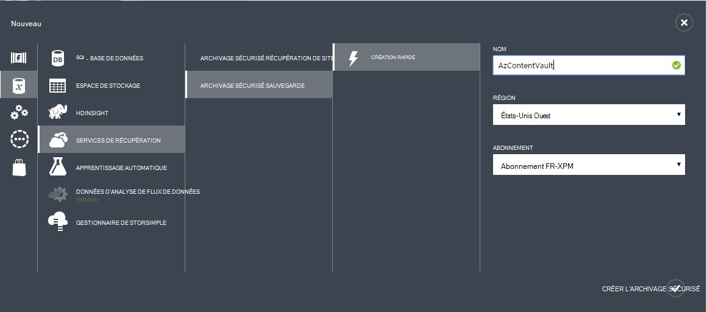

<properties
    pageTitle="Préparer votre environnement pour sauvegarder des machines virtuelles Azure | Microsoft Azure"
    description="Vous assurer que votre environnement est prêt pour la sauvegarde des machines virtuelles dans Azure"
    services="backup"
    documentationCenter=""
    authors="markgalioto"
    manager="cfreeman"
    editor=""
    keywords="sauvegardes ; sauvegarder ;"/>

<tags
    ms.service="backup"
    ms.workload="storage-backup-recovery"
    ms.tgt_pltfrm="na"
    ms.devlang="na"
    ms.topic="article"
    ms.date="08/26/2016"
    ms.author="trinadhk; jimpark; markgal;"/>


# <a name="prepare-your-environment-to-back-up-azure-virtual-machines"></a>Préparer votre environnement pour sauvegarder des machines virtuelles Azure

> [AZURE.SELECTOR]
- [Modèle de gestionnaire de ressources](backup-azure-arm-vms-prepare.md)
- [Modèle classique](backup-azure-vms-prepare.md)

Avant de pouvoir sauvegarder une Azure machine virtuelle (), il existe trois conditions qui doivent exister.

- Vous devez créer un archivage sécurisé sauvegarde ou identifier un existant l’archivage sécurisé sauvegarde *dans la même région en tant que votre ordinateur virtuel*.
- Établir la connectivité réseau entre les adresses Internet publics Azure et les points de terminaison de stockage Azure.
- Installez l’agent machine virtuelle sur l’ordinateur virtuel.

Si vous connaissez que ces conditions existent déjà dans votre environnement continuer à [sauvegarder votre article machines virtuelles](backup-azure-vms.md). Dans le cas contraire, lisez la suite, cet article vous guidera les étapes pour préparer votre environnement pour sauvegarder une machine virtuelle Azure.


## <a name="limitations-when-backing-up-and-restoring-a-vm"></a>Limitations lors de la sauvegarde et restauration une machine virtuelle

>[AZURE.NOTE] Azure comporte deux modèles de déploiement pour la création et utilisation des ressources : [Gestionnaire de ressources et classique](../resource-manager-deployment-model.md). La liste suivante fournit les limitations lors du déploiement dans le modèle classique.

- Sauvegarde des machines virtuelles avec plus de 16 disques de données n’est pas pris en charge.
- Sauvegarde des machines virtuelles avec une adresse IP réservée et aucun point de terminaison défini n’est pas pris en charge.
- Lecteurs réseau monté attachés à la machine virtuelle n’incluent pas les données de sauvegarde. 
- Remplacement d’une machine virtuelle existante au cours de restauration n’est pas pris en charge. Tout d’abord supprimer la machine virtuelle existante et tous les disques associés et puis restaurer les données de sauvegarde.
- Entre région sauvegarde et restauration n’est pas pris en charge.
- Sauvegarde des machines virtuelles à l’aide du service de sauvegarde Azure est pris en charge dans toutes les régions publiques d’Azure (voir [liste de vérification](https://azure.microsoft.com/regions/#services) des régions pris en charge). Si la zone que vous recherchez est non prises en charge aujourd'hui, il n’apparaîtront pas dans la liste déroulante lors de la création de l’archivage sécurisé.
- Sauvegarde des machines virtuelles à l’aide du service de sauvegarde Azure est pris en charge uniquement pour les versions sélectionnez système d’exploitation :
  - **Linux**: sauvegarde Azure prend en charge [une liste de distribution qui sont recommandés par Azure](../virtual-machines/virtual-machines-linux-endorsed-distros.md) à l’exception de base du système d’exploitation Linux. Autres mettre-Your-appartient-éditions Linux peut également travailler dans la mesure où l’agent machine virtuelle est disponible sur l’ordinateur virtuel et prend en charge pour Python existe.
  - **Windows Server**: les Versions antérieures de Windows Server 2008 R2 ne sont pas pris en charge.
- Machine virtuelle (DC) qui fait partie d’une configuration multi-DC restauration d’un contrôleur de domaine est prise en charge uniquement par le biais de PowerShell. En savoir plus sur la [restauration d’un contrôleur de domaine multi-DC](backup-azure-restore-vms.md#restoring-domain-controller-vms).
- Machines virtuelles ayant les configurations réseau spécial suivantes en cours de restauration est prise en charge uniquement par le biais de PowerShell. Machines virtuelles que vous créez à l’aide de la restauration du flux de travail dans l’interface utilisateur n’ont pas ces configurations réseau une fois la restauration terminée. Pour plus d’informations, voir [Restauration des machines virtuelles avec des configurations réseau spécial](backup-azure-restore-vms.md#restoring-vms-with-special-netwrok-configurations).
    - Machines virtuelles sous configuration d’équilibrage de charge (interne et externe)
    - Machines virtuelles avec plusieurs adresses IP réservées
    - Machines virtuelles avec plusieurs cartes réseau

## <a name="create-a-backup-vault-for-a-vm"></a>Créer un archivage sécurisé sauvegarde pour une machine virtuelle

Un archivage sécurisé sauvegarde est une entité qui stocke les sauvegardes et les points de récupération qui ont été créées au fil du temps. L’archivage sécurisé sauvegarde contienne également les stratégies de sauvegarde qui seront appliquées aux machines virtuelles à sauvegarder.

Cette image montre les relations entre les différentes entités sauvegarde Azure :     

Pour créer un archivage sécurisé sauvegarde :

1. Connectez-vous au [portail Azure](http://manage.windowsazure.com/).

2. Cliquez sur **Nouveau**dans le portail Azure > **Intégration hybride** > **sauvegarde**. Lorsque vous cliquez sur **Sauvegarder**, vous allez utiliser automatiquement le portail classique (visible après la Note).

    

    >[AZURE.NOTE] Si votre abonnement a été utilisé en dernier dans le portail classique, votre abonnement s’ouvre dans le portail classique. Dans ce cas, pour créer un archivage sécurisé sauvegarde, cliquez sur **Nouveau** > **Data Services** > **Services de récupération** > **L’archivage sécurisé sauvegarde** > **Création rapide** (voir l’image ci-dessous).

    

3. Pour **nom**, entrez un nom convivial pour identifier l’archivage sécurisé. Le nom doit être unique pour l’abonnement Azure. Tapez un nom qui contient entre 2 et 50 caractères. Il doit commencer par une lettre et peut contenir uniquement des lettres, des chiffres et des traits d’union.

4. Dans **la région**, sélectionnez la région géographique pour l’archivage sécurisé. L’archivage sécurisé doit être placé dans la même région que les ordinateurs virtuels que vous voulez protéger. Si vous avez machines virtuelles dans plusieurs régions, vous devez créer un archivage sécurisé sauvegarde dans chaque région. Il est inutile de spécifier des comptes de stockage pour stocker les données de sauvegarde--l’archivage sécurisé sauvegarde et la poignée de service Azure sauvegarde automatiquement.

5. **Abonnement** , sélectionnez l’abonnement que vous souhaitez associer à l’archivage sécurisé sauvegarde. Il sera plusieurs choix uniquement si votre compte professionnel est associé à plusieurs abonnements Azure.

6. Cliquez sur **créer l’archivage sécurisé**. Il peut prendre un certain temps pour l’archivage sécurisé sauvegarde à créer. Surveiller les notifications d’état au bas du portail.

    

7. Un message Confirmer la que l’archivage sécurisé a été créé. Il doit être répertorié dans la page **services de récupération** comme étant **actif**. Assurez-vous d’avoir choisi le droit d’option de redondance stockage approprié une fois que l’archivage sécurisé a été créé. En savoir plus sur la [définition de l’option de redondance de stockage dans l’archivage sécurisé sauvegarde](backup-configure-vault.md#azure-backup---storage-redundancy-options).

    

8. Cliquez sur l’archivage sécurisé sauvegarde pour accéder à la page de **Démarrage rapide** , où les instructions pour la sauvegarde des machines virtuelles Azure sont affichées.

    


## <a name="network-connectivity"></a>Connectivité réseau

Pour gérer les instantanés machine virtuelle, l’extension de sauvegarde doit connectivité aux adresses IP publics Azure. Sans la connectivité Internet, délai d’expiration des requêtes HTTP de la machine virtuelle et l’opération de sauvegarde échoue. Si votre déploiement comporte les restrictions d’accès en place (via un groupe de sécurité réseau (NSG), par exemple), puis choisissez une des options suivantes pour fournir un chemin clair pour le trafic de sauvegarde :

- [Plages d’autorisation du centre de données Azure IP](http://www.microsoft.com/en-us/download/details.aspx?id=41653) - consultez l’article pour obtenir des instructions sur comment à liste d’autorisation les adresses IP.
- Déploiement d’un serveur proxy HTTP pour acheminer le trafic.

Lors du choix de l’option à utiliser, les compromis soient comprises entre la facilité de gestion, un contrôle plus précis et coût.

|Option|Avantages|Inconvénients liés|
|------|----------|-------------|
|Plages Whitelist IP| Sans frais supplémentaires.<br><br>Pour l’ouverture access dans un NSG, utilisez l’applet de commande <i>Set-AzureNetworkSecurityRule</i> . | Complexe à gérer en tant que l’encadrement concernés plages d’adresses IP modifier dans le temps.<br><br>Permet d’accéder à l’ensemble de Azure et pas seulement de stockage.|
|Proxy HTTP| Contrôle précis dans le proxy sur le stockage URL autorisée.<br>Un seul point d’Internet d’accès aux machines virtuelles.<br>Ne fait l’objet de modifications d’adresses IP Azure.| Frais supplémentaires pour l’exécution d’une machine virtuelle avec le logiciel proxy.|

### <a name="whitelist-the-azure-datacenter-ip-ranges"></a>Plages d’adresses IP liste d’autorisation du centre de données Azure

À la liste d’autorisation les plages d’adresses IP Azure centre de données, voir le [site Web Azure](http://www.microsoft.com/en-us/download/details.aspx?id=41653) pour plus d’informations sur les plages d’adresses IP et les instructions.

### <a name="using-an-http-proxy-for-vm-backups"></a>À l’aide d’un proxy HTTP des sauvegardes machine virtuelle
Lorsque vous sauvegardez une machine virtuelle, l’extension de sauvegarde sur l’ordinateur virtuel envoie les commandes de gestion instantané au stockage Azure à l’aide d’une API HTTPS. Acheminer le trafic de sauvegarde extension via le serveur proxy HTTP car il est le seul composant configuré pour l’accès à l’Internet public.

>[AZURE.NOTE] Il n’existe aucune recommandation pour le logiciel de proxy qui doit être utilisé. Assurez-vous que vous sélectionnez un serveur proxy qui est compatible avec les étapes de configuration ci-dessous.

L’image d’exemple ci-dessous montre les étapes de trois configuration nécessaire d’utiliser un proxy HTTP :

- Machine virtuelle application achemine tout le trafic HTTP destiné à l’Internet public par le biais machine virtuelle Proxy.
- Proxy machine virtuelle autorise le trafic entrant à partir d’ordinateurs virtuels dans le réseau virtuel.
- Le groupe de sécurité réseau (NSG) nommé SP verrouillage doit un sécurité règle permettant Internet le trafic sortant de machine virtuelle Proxy.


Pour utiliser un serveur proxy HTTP pour communiquer à l’Internet public, procédez comme suit :

#### <a name="step-1-configure-outgoing-network-connections"></a>Étape 1. Configurer les connexions réseau sortantes
###### <a name="for-windows-machines"></a>Pour les ordinateurs Windows
Cela va configurer configuration du serveur proxy pour le compte système Local.

1. Télécharger [PsExec](https://technet.microsoft.com/sysinternals/bb897553)
2. Exécutez la commande suivante à partir de l’invite de commandes avec élévation de privilèges,

     ```
     psexec -i -s "c:\Program Files\Internet Explorer\iexplore.exe"
     ```
     Fenêtre internet explorer s’ouvre.
3. Accédez à outils -> Options Internet -> connexions -> Paramètres réseau.
4. Vérifiez les paramètres de proxy pour le compte système. Définir IP Proxy et le port.
5. Fermez Internet Explorer.

Cette option définit une configuration d’échelle de l’ordinateur proxy et sera utilisée pour le trafic sortant HTTP/HTTPS.

Si vous avez configuré un serveur proxy sur un compte d’utilisateur actuel (pas un compte système Local), utilisez le script suivant les appliquer aux SYSTEMACCOUNT :

```
   $obj = Get-ItemProperty -Path Registry::”HKEY_CURRENT_USER\Software\Microsoft\Windows\CurrentVersion\Internet Settings\Connections"
   Set-ItemProperty -Path Registry::”HKEY_USERS\S-1-5-18\Software\Microsoft\Windows\CurrentVersion\Internet Settings\Connections" -Name DefaultConnectionSettings -Value $obj.DefaultConnectionSettings
   Set-ItemProperty -Path Registry::”HKEY_USERS\S-1-5-18\Software\Microsoft\Windows\CurrentVersion\Internet Settings\Connections" -Name SavedLegacySettings -Value $obj.SavedLegacySettings
   $obj = Get-ItemProperty -Path Registry::”HKEY_CURRENT_USER\Software\Microsoft\Windows\CurrentVersion\Internet Settings"
   Set-ItemProperty -Path Registry::”HKEY_USERS\S-1-5-18\Software\Microsoft\Windows\CurrentVersion\Internet Settings" -Name ProxyEnable -Value $obj.ProxyEnable
   Set-ItemProperty -Path Registry::”HKEY_USERS\S-1-5-18\Software\Microsoft\Windows\CurrentVersion\Internet Settings" -Name Proxyserver -Value $obj.Proxyserver
```

>[AZURE.NOTE] Si vous observez « (407) authentification Proxy requise » dans le journal du serveur proxy, vérifiez que votre authrntication est configuré correctement.

######<a name="for-linux-machines"></a>Pour les ordinateurs Linux

Ajoutez la ligne suivante à la ```/etc/environment``` fichier :

```
http_proxy=http://<proxy IP>:<proxy port>
```

Ajoutez les lignes suivantes à la ```/etc/waagent.conf``` fichier :

```
HttpProxy.Host=<proxy IP>
HttpProxy.Port=<proxy port>
```

#### <a name="step-2-allow-incoming-connections-on-the-proxy-server"></a>Étape 2. Autoriser les connexions entrantes sur le serveur proxy :

1. Sur le serveur proxy, ouvrez le pare-feu Windows. Pour accéder au pare-feu, le plus simple consiste à rechercher le pare-feu Windows avec fonctions avancées de sécurité.

    

2. Dans la boîte de dialogue Pare-feu Windows, cliquez sur **Règles de trafic entrant** , puis cliquez sur **Nouvelle règle...**.

    

3. Dans l' **Assistant Nouvelle règle de trafic entrant**, choisissez l’option **personnalisé** pour le **Type de règle** , puis cliquez sur **suivant**.

4. Dans la page pour sélectionner le **programme**, sélectionnez **Tous les programmes** , puis cliquez sur **suivant**.

5. Dans la page **protocole et les Ports** , entrez les informations suivantes, puis cliquez sur **suivant**:

    

    - pour *type de protocole* , sélectionnez *TCP*
    - choisir des *Ports spécifiques*pour le *port Local* , dans le champ ci-dessous spécifier la ```<Proxy Port>``` qui a été configuré.
    - pour les *ports à distance* , sélectionnez *Tous les Ports*

    Pour le reste de l’Assistant, cliquez sur tout à fait à la fin et donnez un nom à cette règle.

#### <a name="step-3-add-an-exception-rule-to-the-nsg"></a>Étape 3. Ajouter une règle d’exception à la NSG :

Dans une invite de commandes PowerShell Azure, entrez la commande suivante :

La commande suivante ajoute une exception à la NSG. Cette exception autorise le trafic TCP à partir de n’importe quel port 10.0.0.5 à n’importe quelle adresse Internet sur le port 80 (HTTP) ou 443 (HTTPS). Si vous avez besoin d’un port spécifique de l’Internet public, veillez à ajouter ce port pour le ```-DestinationPortRange``` également.

```
Get-AzureNetworkSecurityGroup -Name "NSG-lockdown" |
Set-AzureNetworkSecurityRule -Name "allow-proxy " -Action Allow -Protocol TCP -Type Outbound -Priority 200 -SourceAddressPrefix "10.0.0.5/32" -SourcePortRange "*" -DestinationAddressPrefix Internet -DestinationPortRange "80-443"
```

*Veillez à remplacer les noms dans l’exemple avec les détails adaptées à votre déploiement.*


## <a name="vm-agent"></a>Agent de machine virtuelle

Avant de pouvoir sauvegarder la machine virtuelle Azure, vous devez vous assurer que l’agent de machine virtuelle Azure est correctement installé sur l’ordinateur virtuel. Dans la mesure où l’agent machine virtuelle est un composant facultatif au moment où la machine virtuelle est créée, vérifiez que la case à cocher pour l’agent de machine virtuelle est sélectionnée avant de la machine virtuelle est mis en service.

### <a name="manual-installation-and-update"></a>Mise à jour et installation manuelle

L’agent de machine virtuelle est déjà présent dans machines virtuelles créées à partir de la galerie Azure. Cependant, machines virtuelles qui sont déplacés du centres de données locale n’aurait pas l’agent machine virtuelle est installé. Pour ces machines virtuelles, l’agent machine virtuelle doit être installé explicitement. En savoir plus sur [l’installation de l’agent de machine virtuelle sur un ordinateur virtuel existant](http://blogs.msdn.com/b/mast/archive/2014/04/08/install-the-vm-agent-on-an-existing-azure-vm.aspx).

| **Opération** | **Windows** | **Linux** |
| --- | --- | --- |
| Installation de l’agent de machine virtuelle | <li>Téléchargez et installez l' [agent MSI](http://go.microsoft.com/fwlink/?LinkID=394789&clcid=0x409). Vous avez besoin des privilèges d’administrateur pour terminer l’installation. <li>[Mettre à jour la propriété machine virtuelle](http://blogs.msdn.com/b/mast/archive/2014/04/08/install-the-vm-agent-on-an-existing-azure-vm.aspx) pour indiquer que l’agent est installé. | <li> Installer dernière [agent Linux](https://github.com/Azure/WALinuxAgent) à partir de GitHub. Vous avez besoin des privilèges d’administrateur pour terminer l’installation. <li> [Mettre à jour la propriété machine virtuelle](http://blogs.msdn.com/b/mast/archive/2014/04/08/install-the-vm-agent-on-an-existing-azure-vm.aspx) pour indiquer que l’agent est installé. |
| Mise à jour de l’agent de machine virtuelle | Mise à jour de l’agent de machine virtuelle est aussi simple que les [fichiers binaires agent machine virtuelle](http://go.microsoft.com/fwlink/?LinkID=394789&clcid=0x409)la réinstallation. <br><br>Vérifiez qu’aucune opération de sauvegarde ne s’exécute pendant que l’agent machine virtuelle est mis à jour. | Suivez les instructions de [mise à jour de l’agent machine virtuelle Linux ](../virtual-machines-linux-update-agent.md). <br><br>Vérifiez qu’aucune opération de sauvegarde ne s’exécute pendant que l’agent machine virtuelle est mis à jour. |
| Validation de l’installation de l’agent de machine virtuelle | <li>Accédez au dossier *C:\WindowsAzure\Packages* dans la machine virtuelle Azure. <li>Vous devriez trouver le fichier WaAppAgent.exe présenter.<li> Cliquez sur le fichier, accédez aux **Propriétés**et puis sélectionnez l’onglet **Détails** . Le champ Version du produit doit être 2.6.1198.718 ou une version ultérieure. | N/A |


En savoir plus sur [l’agent de machine virtuelle](https://go.microsoft.com/fwLink/?LinkID=390493&clcid=0x409) et [comment l’installer](https://azure.microsoft.com/blog/2014/04/15/vm-agent-and-extensions-part-2/).

### <a name="backup-extension"></a>Extension de sauvegarde

Pour sauvegarder la machine virtuelle, le service de sauvegarde Azure installe une extension à l’agent de machine virtuelle. Le service de sauvegarde Azure met à niveau en toute transparence et correctifs l’extension de sauvegarde sans intervention de l’utilisateur supplémentaires.

L’extension de sauvegarde est installée si la machine virtuelle est en cours d’exécution. Une machine virtuelle en cours d’exécution fournit également les plus grande chances d’obtenir un point de récupération des applications. Toutefois, la sauvegarde Azure service continuent à sauvegarder la machine virtuelle, même si elle est désactivée, et l’extension n’a pas pu être installé (ou en mode hors connexion machine virtuelle). Dans ce cas, le point de récupération seront *blocage cohérente* comme indiqué ci-dessus.


## <a name="questions"></a>Questions ?
Si vous avez des questions, ou s’il existe une fonctionnalité que vous voulez voir inclus, [envoyez-nous vos commentaires](http://aka.ms/azurebackup_feedback).

## <a name="next-steps"></a>Étapes suivantes
À présent que vous avez préparé votre environnement de sauvegarde de votre ordinateur virtuel, l’étape logique suivante consiste à créer une sauvegarde. L’article planification fournit des informations plus détaillées sur la sauvegarde des machines virtuelles.

- [Sauvegarder des machines virtuelles](backup-azure-vms.md)
- [Planifier votre infrastructure de sauvegarde machine virtuelle](backup-azure-vms-introduction.md)
- [Gérer les sauvegardes machine virtuelle](backup-azure-manage-vms.md)
