<properties
    pageTitle="Sauvegarder des machines virtuelles Azure | Microsoft Azure"
    description="Découvrir, enregistrer et sauvegarder vos machines virtuelles avec ces procédures de sauvegarde des machines virtuelles Azure."
    services="backup"
    documentationCenter=""
    authors="markgalioto"
    manager="jwhit"
    editor=""
    keywords="sauvegarde des machines virtuelles ; sauvegarder la machine virtuelle ; sauvegarde et récupération d’urgence ; sauvegarde machine virtuelle"/>

<tags
    ms.service="backup"
    ms.workload="storage-backup-recovery"
    ms.tgt_pltfrm="na"
    ms.devlang="na"
    ms.topic="article"
    ms.date="09/28/2016"
    ms.author="trinadhk; jimpark; markgal;"/>

# Sauvegarder des machines virtuelles Azure

> [AZURE.SELECTOR]
- [Sauvegarder des machines virtuelles à l’archivage sécurisé des Services de récupération](backup-azure-arm-vms.md)
- [Sauvegarder des machines virtuelles à l’archivage sécurisé sauvegarde](backup-azure-vms.md)

Cet article fournit les procédures de sauvegarde une déployé classique Azure machine virtuelle () à un archivage sécurisé de sauvegarde. Il existe quelques tâches que vous devez prendre en charge avant de pouvoir sauvegarder une machine virtuelle Azure. Si vous n’avez pas déjà fait, suivre les [conditions préalables](backup-azure-vms-prepare.md) pour préparer votre environnement pour sauvegarder vos ordinateurs virtuels.

Pour plus d’informations, voir les articles sur la [planification votre infrastructure de sauvegarde machine virtuelle dans Azure](backup-azure-vms-introduction.md) et [Azure machines virtuelles](https://azure.microsoft.com/documentation/services/virtual-machines/).

>[AZURE.NOTE] Azure comporte deux modèles de déploiement pour la création et utilisation des ressources : [Gestionnaire de ressources et classique](../resource-manager-deployment-model.md). Un archivage sécurisé sauvegarde pouvez protéger uniquement machines virtuelles déployé classique. Vous ne peut pas protéger déployé le Gestionnaire de ressources machines virtuelles avec un archivage sécurisé de sauvegarde. Pour plus d’informations sur l’utilisation de Services de récupération chambres fortes, voir [sauvegarder des machines virtuelles aux Services de récupération de l’archivage sécurisé](backup-azure-arm-vms.md) .

Sauvegarde des machines virtuelles Azure implique trois principales étapes :

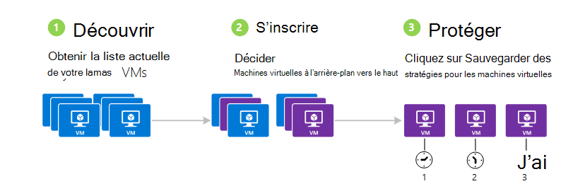

>[AZURE.NOTE] Sauvegarde des machines virtuelles est un processus local. Vous ne pouvez pas sauvegarder vos machines virtuelles dans une zone géographique sur un archivage sécurisé sauvegarde dans une autre zone. Le cas, vous devez créer un archivage sécurisé sauvegarde dans chaque région Azure, lorsqu’il y a machines virtuelles qui seront sauvegardés.

## Étape 1 : découvrir les machines virtuelles Azure
Pour vous assurer que les nouvelles machines virtuelles (machines virtuelles) ajoutés à l’abonnement sont identifiés avant d’enregistrer, exécuter le processus de découverte. Les requêtes de processus Azure pour la liste des ordinateurs virtuels de l’abonnement, ainsi que des informations supplémentaires telles que le nom du service cloud et la région.

1. Connectez-vous au [portail classique](http://manage.windowsazure.com/)

2. Dans la liste des services Azure, cliquez sur **Services de récupération** pour ouvrir la liste des chambres fortes de sauvegarde et de récupération de Site.
    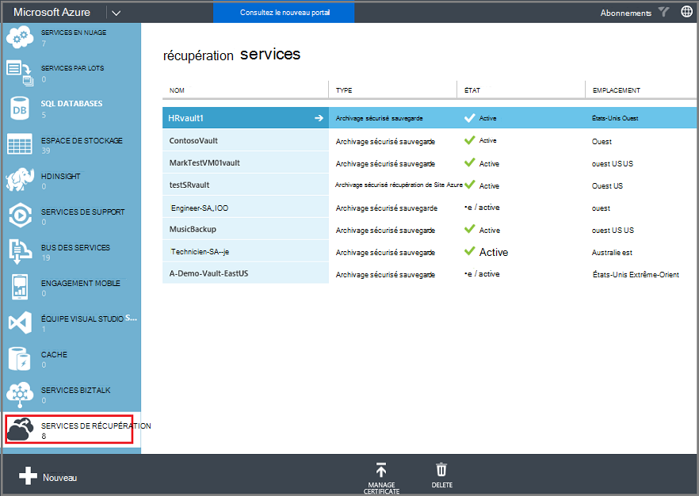

3. Dans la liste des chambres fortes de sauvegarde, sélectionnez l’archivage sécurisé pour sauvegarder une machine virtuelle.

    S’il s’agit d’un archivage sécurisé nouveau le portail s’ouvre à la page de **Démarrage rapide** .

    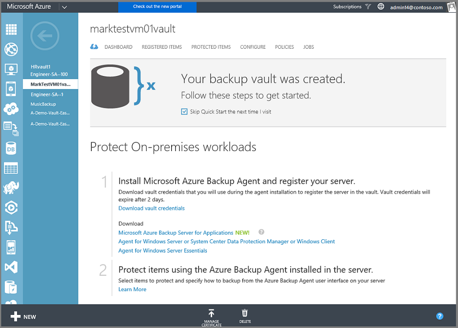

    Si l’archivage sécurisé a été configurée précédemment, le portail s’ouvre sur le menu des derniers fichiers utilisé.

4. Dans le menu de l’archivage sécurisé (en haut de la page), cliquez sur **Éléments enregistrés**.

    

5. Dans le menu **Type** , sélectionnez **Machine virtuelle Azure**.

    

6. Cliquez sur **Rechercher** dans la partie inférieure de la page.
    

    Le processus de découverte peut prendre quelques minutes tandis que les ordinateurs virtuels sont en cours sous forme de tableau. Il existe une notification en bas de l’écran qui vous permet de déterminer que le processus est en cours d’exécution.

    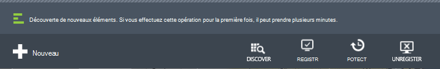

    Les modifications de notification lorsque le processus est terminer. Si le processus de découverte ne trouve pas les ordinateurs virtuels, assurez-vous tout d’abord que les ordinateurs virtuels existent. Si les ordinateurs virtuels existent, vérifier que les ordinateurs virtuels soient dans la même région en tant que l’archivage sécurisé sauvegarde. Si les ordinateurs virtuels existent et se trouvent dans la même région, vérifiez que les ordinateurs virtuels ne sont pas encore inscrit à un archivage sécurisé sauvegarde. Si une machine virtuelle est affectée à un archivage sécurisé sauvegarde il n’est pas disponible pour être assignée à d’autres chambres fortes sauvegarde.

    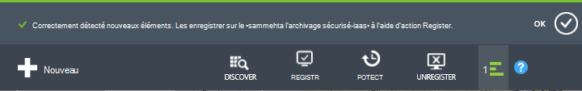

    Une fois que vous avez découvert les nouveaux éléments, accédez à l’étape 2 et enregistrez vos ordinateurs virtuels.

##  Étape 2 : Registre machines virtuelles Azure
Vous enregistrez une machine virtuelle Azure pour associer avec le service de sauvegarde Azure. Il s’agit d’une activité ponctuelle.

1. Naviguez jusqu'à l’archivage sécurisé sauvegarde sous **Services de récupération** dans le portail Azure, puis cliquez sur **Éléments enregistrés**.

2. Sélectionnez **Machine virtuelle Azure** dans le menu déroulant.

    

3. Cliquez sur **Enregistrer** dans la partie inférieure de la page.
    

4. Dans le menu contextuel **Enregistrer les éléments** , sélectionnez les machines virtuelles que vous souhaitez enregistrer. S’il existe deux ou plusieurs machines virtuelles portant le même nom, utilisez le service cloud pour faire la distinction entre elles.

    >[AZURE.TIP] Machines virtuelles peuvent être enregistrés en même temps.

    Une tâche est créée pour chaque machine virtuelle que vous avez sélectionnées.

5. Cliquez sur **Afficher la tâche** dans la notification pour accéder à la page **tâches** .

    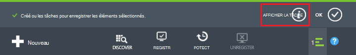

    La machine virtuelle apparaît également dans la liste des éléments enregistrés, ainsi que l’état de l’opération d’enregistrement.

    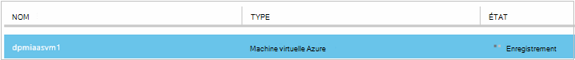

    Lorsque l’opération terminée, les changements d’état pour refléter l’état *enregistré* .

    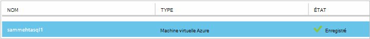

## Étape 3 : protéger les machines virtuelles Azure
À présent, vous pouvez définir une stratégie de sauvegarde et de rétention pour la machine virtuelle. Machines virtuelles peut être protégés à l’aide d’un seul protéger action.

Azure chambres fortes de sauvegarde créées après mai 2015 fournis avec une stratégie par défaut intégré à l’archivage sécurisé. Cette stratégie par défaut est fourni avec une rétention par défaut de 30 jours et d’un planning de sauvegarde une fois par jour.

1. Naviguez jusqu'à l’archivage sécurisé sauvegarde sous **Services de récupération** dans le portail Azure, puis cliquez sur **Éléments enregistrés**.
2. Sélectionnez **Machine virtuelle Azure** dans le menu déroulant.

    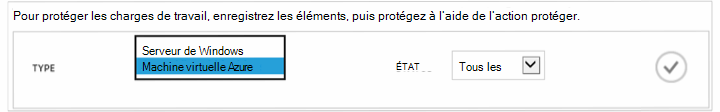

3. Cliquez sur **protéger** dans la partie inférieure de la page.

    L' **Assistant de protéger les éléments** apparaît. L’Assistant ne répertorie que les machines virtuelles qui sont enregistrés et pas protégées. Sélectionnez les machines virtuelles que vous voulez protéger.

    S’il existe deux ou plusieurs machines virtuelles portant le même nom, utilisez le service cloud pour faire la distinction entre les machines virtuelles.

    >[AZURE.TIP] Vous pouvez protéger plusieurs machines virtuelles en même temps.

    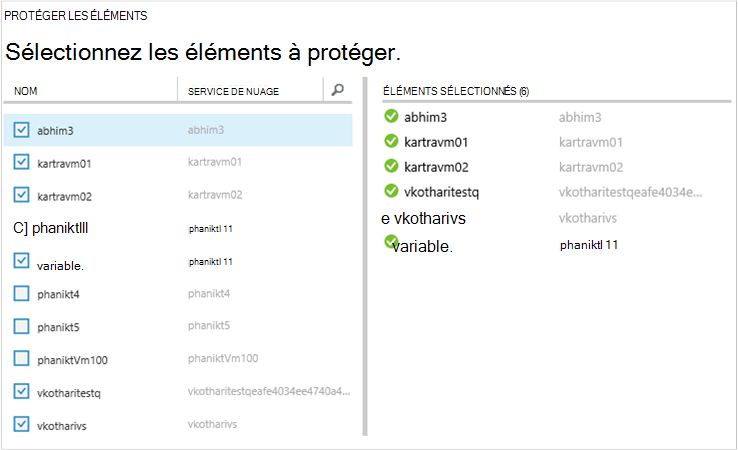

4. Choisissez une **planification de sauvegarde** pour sauvegarder les machines virtuelles que vous avez sélectionnées. Vous pouvez choisir parmi un ensemble de stratégies existant ou définir un nouveau.

    Chaque stratégie sauvegarde peut avoir plusieurs machines virtuelles qui lui est associés. Toutefois, la machine virtuelle peut uniquement être associée à une stratégie à un moment donné dans le temps.

    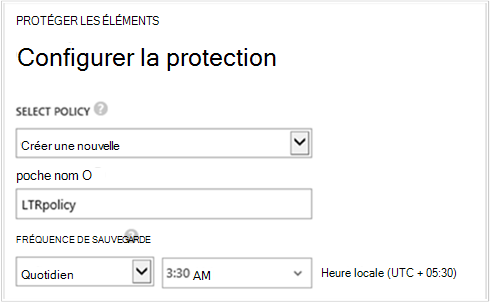

    >[AZURE.NOTE] Une stratégie de sauvegarde inclut un jeu de rétention pour les sauvegardes planifiées. Si vous sélectionnez une stratégie de sauvegarde existante, vous ne pouvez pas modifier les options de rétention à l’étape suivante.

5. Sélectionnez une **plage de rétention** à associer avec les sauvegardes.

    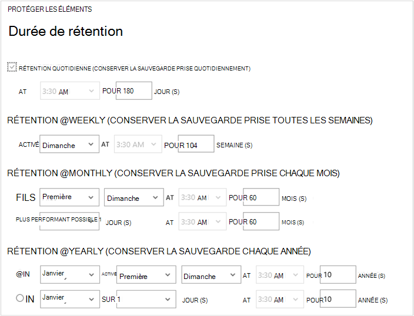

    Stratégie de rétention spécifie la durée pour stocker une sauvegarde. Vous pouvez spécifier des autres stratégies de rétention basées sur lors de la sauvegarde est effectuée. Par exemple, un point de sauvegarde pris quotidiennement (qui sert d’un point de restauration opérationnelle) peut-être être conservé pendant 90 jours. En revanche, un point de sauvegarde pris à la fin de chaque trimestre (à des fins d’audit) devrez peut-être être conservés pendant des mois ou années.

    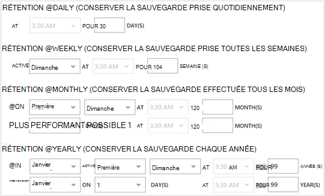

    Dans cet exemple d’image :

    - **Stratégie de rétention quotidienne**: prises quotidiennement les sauvegardes sont stockées pendant 30 jours.
    - **Stratégie de rétention hebdomadaire**: les sauvegardes effectuées toutes les semaines dimanche sont conservées pendant 104 semaines.
    - **Stratégie de rétention mensuel**: les sauvegardes effectuées sur le dernier dimanche de chaque mois sont conservés de 120 mois.
    - **Stratégie de rétention annuel**: les sauvegardes effectuées sur le premier dimanche de chaque janvier sont conservés pour 99 ans.

    Une tâche est créée pour configurer la stratégie de protection et associer les machines virtuelles à cette stratégie pour chaque machine virtuelle que vous avez sélectionnées.

6. Pour afficher la liste des tâches **Configurer la Protection** , dans le menu chambres fortes, cliquez sur **projets** , puis sélectionnez **Configurer la Protection** dans le filtre **opération** .

    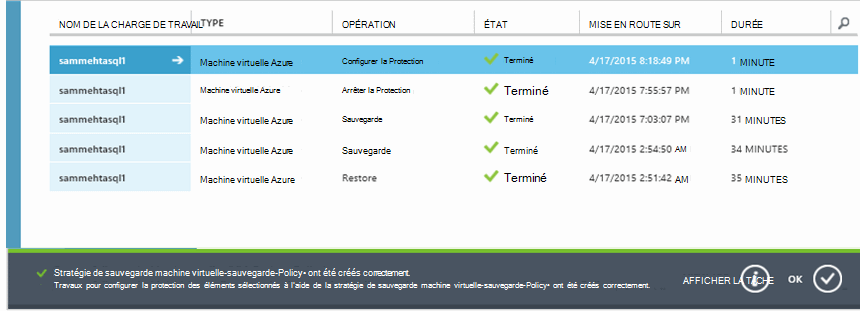

## Sauvegarde initiale
Une fois que la machine virtuelle est protégée par une stratégie, il s’affiche sous l’onglet **Éléments protégés** avec l’état de *protégé - (en attente de sauvegarde initiale)*. Par défaut, la première sauvegarde planifiée est la *sauvegarde initiale*.

Déclencher la sauvegarde initiale immédiatement après la configuration de la protection :

1. En bas de la page **Éléments protégé** , cliquez sur **Sauvegarder maintenant**.

    Le service de sauvegarde Azure crée une sauvegarde pour l’opération de sauvegarde initiale.

2. Cliquez sur l’onglet **tâches** pour afficher la liste des tâches.

    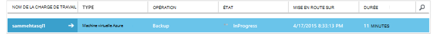

>[AZURE.NOTE] Pendant l’opération de sauvegarde, le service de sauvegarde Azure envoie une commande à l’extension de sauvegarde dans chaque machine virtuelle pour vider toutes les tâches d’écriture et prendre une capture instantanée cohérente.

Une fois la sauvegarde initiale, le statut de la machine virtuelle dans l’onglet **Éléments protégé** est *protégé*.

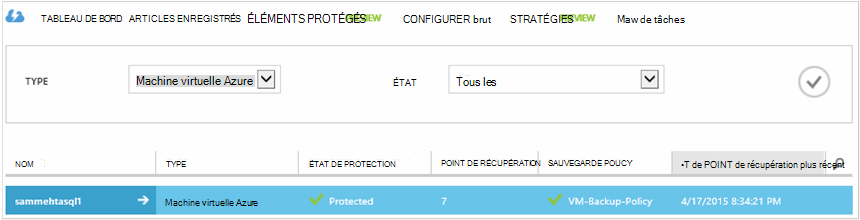

## Affichage des détails et l’état de sauvegarde
Une fois que protégé, le nombre de machine virtuelle augmente également dans la page **tableau de bord** synthèse. La page **tableau de bord** affiche également le nombre de tâches à partir des dernières 24 heures qui ont été *réussie*, *Échec*et sont *en cours*. Dans la page **tâches** , utilisez **l’état**, **opération**ou les menus **** d’et **à** pour filtrer les tâches.

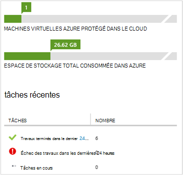

Les valeurs dans le tableau de bord sont actualisées toutes les 24 heures.

## Résolution des erreurs
Si vous rencontrez des problèmes pendant la sauvegarde votre machine virtuelle, consultez l' [article de résolution des problèmes de mémoire virtuelle](backup-azure-vms-troubleshoot.md) pour vous aider.

## Étapes suivantes

- [Gérer et analyser vos machines virtuelles](backup-azure-manage-vms.md)
- [Restaurer des machines virtuelles](backup-azure-restore-vms.md)
