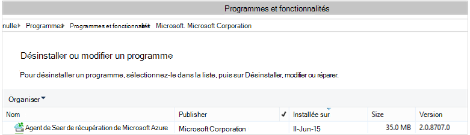

<properties
    pageTitle="Déployer et gérer la sauvegarde de Windows Server/Client à l’aide de PowerShell | Microsoft Azure"
    description="Découvrez comment déployer et gérer la sauvegarde Azure à l’aide de PowerShell"
    services="backup"
    documentationCenter=""
    authors="saurabhsensharma"
    manager="shivamg"
    editor=""/>

<tags
    ms.service="backup"
    ms.workload="storage-backup-recovery"
    ms.tgt_pltfrm="na"
    ms.devlang="na"
    ms.topic="article"
    ms.date="09/01/2016"
    ms.author="saurabhsensharma;markgal;jimpark;nkolli;trinadhk"/>


# <a name="deploy-and-manage-backup-to-azure-for-windows-serverwindows-client-using-powershell"></a>Déployer et gérer des sauvegardes sur Azure pour Windows Server et Windows Client à l’aide de PowerShell

> [AZURE.SELECTOR]
- [PROCESSEUR](backup-client-automation.md)
- [Classique](backup-client-automation-classic.md)

Cet article vous explique comment utiliser PowerShell pour la configuration d’Azure sauvegarde sur un client Windows ou de Windows Server et la gestion de sauvegarde et restauration.

## <a name="install-azure-powershell"></a>Installer PowerShell Azure

[AZURE.INCLUDE [learn-about-deployment-models](../../includes/learn-about-deployment-models-include.md)]

Cet article se concentre sur les applets de commande PowerShell Azure Resource Manager (ARM) qui vous permettent d’utiliser un archivage sécurisé aux Services de récupération dans un groupe de ressources.

En octobre 2015, Azure PowerShell 1.0 a été publié. Cette version a réussi la 0.9.8 relâchez et remis sur certaines des modifications substantielles, en particulier dans le modèle de dénomination des applets de commande. applets de 1.0 commande suivent le modèle d’appellation {verbe}-AzureRm {substantif} ; alors que, la 0.9.8 noms n’incluent pas **Rm** (par exemple, New-AzureRmResourceGroup au lieu de nouveau-AzureResourceGroup). Lorsque vous utilisez Azure PowerShell 0.9.8, vous devez d’abord activer le mode directeur des ressources en exécutant la commande **AzureResourceManager commutateur AzureMode** . Cette commande n’est pas nécessaire dans 1.0 ou version ultérieure.

Si vous souhaitez utiliser vos scripts écrites pour la 0.9.8 environnement, dans l’environnement 1.0 ou version ultérieure, veillez à tester les scripts dans un environnement de production avant avant de les utiliser en production pour éviter l’impact inattendu.

[Téléchargez la dernière version de PowerShell](https://github.com/Azure/azure-powershell/releases) (version minimale requise est : 1.0.0)


[AZURE.INCLUDE [arm-getting-setup-powershell](../../includes/arm-getting-setup-powershell.md)]

## <a name="create-a-recovery-services-vault"></a>Créer un archivage sécurisé des services de récupération

Les étapes suivantes vous guident dans le processus de création d’un archivage sécurisé aux Services de récupération. Un archivage sécurisé aux Services de récupération est différent de celui un archivage sécurisé de sauvegarde.

1. Si vous utilisez Azure sauvegarde pour la première fois, vous devez utiliser l’applet de commande **AzureRMResourceProvider de Registre** pour enregistrer le fournisseur de Service de récupération Azure avec votre abonnement.

    ```
    PS C:\> Register-AzureRmResourceProvider -ProviderNamespace "Microsoft.RecoveryServices"
    ```

2. L’archivage sécurisé aux Services de récupération est une ressource processeur, vous devez placer au sein d’un groupe de ressources. Vous pouvez utiliser un groupe de ressources existant ou créez-en un. Lorsque vous créez un nouveau groupe de ressources, spécifiez le nom et l’emplacement du groupe de ressources.  

    ```
    PS C:\> New-AzureRmResourceGroup –Name "test-rg" –Location "West US"
    ```

3. Utiliser l’applet de commande **New-AzureRmRecoveryServicesVault** pour créer l’archivage sécurisé nouveau. Veillez à spécifier le même emplacement pour l’archivage sécurisé que celui utilisé pour le groupe de ressources.

    ```
    PS C:\> New-AzureRmRecoveryServicesVault -Name "testvault" -ResourceGroupName " test-rg" -Location "West US"
    ```

4. Spécifier le type de redondance du stockage à utiliser ; Vous pouvez utiliser [Stockage localement redondantes (LRS)](../storage/storage-redundancy.md#locally-redundant-storage) ou [Geo redondants stockage (GRS)](../storage/storage-redundancy.md#geo-redundant-storage). L’exemple suivant montre que l’option - BackupStorageRedundancy pour testVault est définie sur GeoRedundant.

    > [AZURE.TIP] Applets de commande de sauvegarde Azure nombreux nécessitent l’objet de l’archivage sécurisé aux Services de récupération comme entrée. Pour cette raison, il est recommandé de stocker l’objet de l’archivage sécurisé de Services de récupération de sauvegarde dans une variable.

    ```
    PS C:\> $vault1 = Get-AzureRmRecoveryServicesVault –Name "testVault"
    PS C:\> Set-AzureRmRecoveryServicesBackupProperties  -vault $vault1 -BackupStorageRedundancy GeoRedundant
    ```

## <a name="view-the-vaults-in-a-subscription"></a>Afficher les chambres fortes dans un abonnement
**Get-AzureRmRecoveryServicesVault** permet d’afficher la liste de tous les chambres fortes dans l’abonnement actif. Vous pouvez utiliser cette commande pour vérifier qu’un archivage sécurisé nouveau a été créé, ou pour savoir quels chambres fortes sont disponibles dans l’abonnement.

Exécutez la commande Get-AzureRmRecoveryServicesVault, et toutes les chambres fortes dans l’abonnement sont répertoriées.

```
PS C:\> Get-AzureRmRecoveryServicesVault
Name              : Contoso-vault
ID                : /subscriptions/1234
Type              : Microsoft.RecoveryServices/vaults
Location          : WestUS
ResourceGroupName : Contoso-docs-rg
SubscriptionId    : 1234-567f-8910-abc
Properties        : Microsoft.Azure.Commands.RecoveryServices.ARSVaultProperties
```


## <a name="installing-the-azure-backup-agent"></a>Installation de l’agent de sauvegarde Azure
Avant d’installer l’agent de sauvegarde Azure, vous devez avoir le programme d’installation téléchargé et présent sur le serveur de Windows. Vous pouvez obtenir la dernière version de l’installer à partir du [Centre de téléchargement Microsoft](http://aka.ms/azurebackup_agent) ou à partir de la page de tableau de bord de l’archivage sécurisé Services de récupération. Enregistrer le programme d’installation vers un emplacement accessible facilement comme * C:\Downloads\*.

Pour installer l’agent, exécutez la commande suivante dans une console PowerShell avec élévation de privilèges :

```
PS C:\> MARSAgentInstaller.exe /q
```

Cette procédure installe l’agent avec toutes les options par défaut. L’installation peut prendre quelques minutes en arrière-plan. Si vous ne spécifiez pas l’option */nu* la fenêtre **Windows Update** s’ouvre à la fin de l’installation pour vérifier les mises à jour. Une fois installée, l’agent s’affichent dans la liste des programmes installés.

Pour afficher la liste des programmes installés, accédez au **Panneau** > **programmes** > **programmes et fonctionnalités**.



### <a name="installation-options"></a>Options d’installation

Pour afficher toutes les options disponibles via la ligne de commande, utilisez la commande suivante :

```
PS C:\> MARSAgentInstaller.exe /?
```

Les options disponibles incluent :

| Option | Plus d’informations | Par défaut |
| ---- | ----- | ----- |
| / q | Installation en mode silencieux | - |
| / p: « emplacement » | Chemin d’accès au dossier d’installation de l’agent de sauvegarde Azure. | Agent de C:\Program Files\Microsoft récupération Azure Services |
| / s: « emplacement » | Chemin d’accès au dossier cache de l’agent de sauvegarde Azure. | C:\Program Files\Microsoft récupération Azure Services Agent\Scratch |
| /m | Participer à Microsoft Update | - |
| /nu | Ne pas vérifier les mises à jour une fois l’installation terminée | - |
| /d | Désinstallation Agent de Services de récupération de Microsoft Azure | - |
| /pH | Adresse de l’hôte proxy | - |
| PD | Numéro de Port de l’hôte proxy | - |
| /pu | Nom d’utilisateur hôte de proxy | - |
| /pw | Mot de passe proxy | - |


## <a name="registering-windows-server-or-windows-client-machine-to-a-recovery-services-vault"></a>Enregistrement de Windows Server ou ordinateur de client Windows à un archivage sécurisé des Services de récupération

Une fois que vous avez créé l’archivage sécurisé aux Services de récupération, téléchargez la dernière agent et les informations d’identification de l’archivage sécurisé et le stocker dans un emplacement pratique, par exemple C:\Downloads.

```
PS C:\> $credspath = "C:\downloads"
PS C:\> $credsfilename = Get-AzureRmRecoveryServicesVaultSettingsFile -Backup -Vault $vault1 -Path  $credspath
PS C:\> $credsfilename C:\downloads\testvault\_Sun Apr 10 2016.VaultCredentials
```

Sur le serveur de Windows ou l’ordinateur client Windows, exécutez l’applet de commande [Démarrer OBRegistration](https://technet.microsoft.com/library/hh770398%28v=wps.630%29.aspx) pour enregistrer l’ordinateur avec l’archivage sécurisé.

```
PS C:\> $cred = $credspath + $credsfilename
PS C:\> Start-OBRegistration-VaultCredentials $cred -Confirm:$false
CertThumbprint      :7a2ef2caa2e74b6ed1222a5e89288ddad438df2
SubscriptionID      : ef4ab577-c2c0-43e4-af80-af49f485f3d1
ServiceResourceName: testvault
Region              :West US
Machine registration succeeded.
```

> [AZURE.IMPORTANT] N’utilisez pas de chemins d’accès relatifs pour spécifier le fichier d’informations d’identification de l’archivage sécurisé. Vous devez fournir un chemin d’accès absolu comme une entrée de l’applet de commande.

## <a name="networking-settings"></a>Paramètres de mise en réseau
Lorsque la connectivité de l’ordinateur Windows à internet est via un serveur proxy, les paramètres de proxy peuvent également être fournis à l’agent. Dans cet exemple, il n’existe pas de serveur proxy, afin que nous apportions explicitement désactivant les informations relatives aux proxy.

L’utilisation de la bande passante peut également être contrôlée avec les options de ```work hour bandwidth``` et ```non-work hour bandwidth``` d’un ensemble de jours de la semaine.

Définir les détails de proxy et la bande passante est effectuée à l’aide de l’applet de commande [Set-OBMachineSetting](https://technet.microsoft.com/library/hh770409%28v=wps.630%29.aspx) :

```
PS C:\> Set-OBMachineSetting -NoProxy
Server properties updated successfully.

PS C:\> Set-OBMachineSetting -NoThrottle
Server properties updated successfully.
```

## <a name="encryption-settings"></a>Paramètres de chiffrement
Les données de sauvegarde envoyées à Azure sauvegarde sont chiffrées pour protéger la confidentialité des données. Le mot de passe de chiffrement est « mot de passe » à déchiffrer les données au moment de la restaurer.

```
PS C:\> ConvertTo-SecureString -String "Complex!123_STRING" -AsPlainText -Force | Set-OBMachineSetting
Server properties updated successfully
```

> [AZURE.IMPORTANT] Conserver les informations de mot de passe sécurisé une fois que celle-ci est définie. Vous ne serez pas en mesure de restaurer les données à partir d’Azure sans ce mot de passe.

## <a name="back-up-files-and-folders"></a>Sauvegarder des fichiers et dossiers
Toutes les sauvegardes de serveurs et clients Windows Azure sauvegarde sont régis par une stratégie. La stratégie comprend trois parties :

1. **Planification de la sauvegarde** qui spécifie lorsque des sauvegardes doivent être prises et synchronisés avec le service.
2. **Planification de rétention** qui indique la durée de conserver les points de récupération dans Azure.
3. **Spécification d’inclusion/exclusion de fichier** qui détermine quelle doit être sauvegardé.

Dans ce document, étant donné que nous allons automatisation des sauvegardes, nous allons part du principe que rien n’a été configurée. Nous commençons par créer une nouvelle stratégie de sauvegarde à l’aide de l’applet de commande [New-OBPolicy](https://technet.microsoft.com/library/hh770416.aspx) .

```
PS C:\> $newpolicy = New-OBPolicy
```

Pour le moment la stratégie est vide et autres applets de commande sont nécessaires pour définir les éléments qui seront inclus ou exclus, où des sauvegardes doit s’exécuter, et l’emplacement dans lequel les sauvegardes seront stockés.

### <a name="configuring-the-backup-schedule"></a>Configuration de la planification de sauvegarde
La première des 3 composants d’une stratégie est le planning de sauvegarde, qui est créé en utilisant l’applet de commande [New-OBSchedule](https://technet.microsoft.com/library/hh770401) . Le planning de sauvegarde définit lorsque des sauvegardes doivent être prises. Lorsque vous créez une planification, que vous devez spécifier 2 paramètres d’entrée :

- **Jours de la semaine** que la sauvegarde doit s’exécuter. Vous pouvez exécuter l’opération de sauvegarde sur une seule journée ou tous les jours de la semaine ou n’importe quelle combinaison entre les deux.
- **Heures de la journée** lors de la sauvegarde doit s’exécuter. Vous pouvez définir jusqu'à 3 différentes heures de la journée déclenchement de la sauvegarde.

Par exemple, vous pouvez configurer une stratégie de sauvegarde qui s’exécute à 4 PM chaque samedi et dimanche.

```
PS C:\> $sched = New-OBSchedule -DaysofWeek Saturday, Sunday -TimesofDay 16:00
```

La planification de sauvegarde doit être associé à une stratégie, et pour ce faire à l’aide de l’applet de commande [Set-OBSchedule](https://technet.microsoft.com/library/hh770407) .

```
PS C:> Set-OBSchedule -Policy $newpolicy -Schedule $sched
BackupSchedule : 4:00 PM Saturday, Sunday, Every 1 week(s) DsList : PolicyName : RetentionPolicy : State : New PolicyState : Valid
```
### <a name="configuring-a-retention-policy"></a>Configuration d’une stratégie de rétention
La stratégie de rétention définit la durée de conservation des points de récupération créés à partir des travaux de sauvegarde. Lorsque vous créez une nouvelle stratégie de rétention à l’aide de l’applet de commande [New-OBRetentionPolicy](https://technet.microsoft.com/library/hh770425) , vous pouvez spécifier le nombre de jours pendant lequel les points de sauvegarde et de restauration doivent être conservées avec Azure sauvegarde. L’exemple ci-dessous définit une stratégie de rétention de 7 jours.

```
PS C:\> $retentionpolicy = New-OBRetentionPolicy -RetentionDays 7
```

La stratégie de rétention doit être associé à la stratégie principale à l’aide de l’applet de commande [Set-OBRetentionPolicy](https://technet.microsoft.com/library/hh770405):

```
PS C:\> Set-OBRetentionPolicy -Policy $newpolicy -RetentionPolicy $retentionpolicy

BackupSchedule  : 4:00 PM
                  Saturday, Sunday,
                  Every 1 week(s)
DsList          :
PolicyName      :
RetentionPolicy : Retention Days : 7

                  WeeklyLTRSchedule :
                  Weekly schedule is not set

                  MonthlyLTRSchedule :
                  Monthly schedule is not set

                  YearlyLTRSchedule :
                  Yearly schedule is not set

State           : New
PolicyState     : Valid
```
### <a name="including-and-excluding-files-to-be-backed-up"></a>Inclusion et exclusion de fichiers à sauvegarder
Un ```OBFileSpec``` objet définit les fichiers pour être inclus ou non dans une sauvegarde. Il s’agit d’un ensemble de règles d’étendue les fichiers protégés et les dossiers sur un ordinateur. Vous pouvez avoir comme plusieurs règles d’inclusion ou exclusion selon les besoins de fichiers et associez-les à une stratégie. Lorsque vous créez un nouvel objet OBFileSpec, vous pouvez :

- Spécifier les fichiers et dossiers à inclure
- Spécifier les fichiers et dossiers à exclure
- Spécifier une sauvegarde récursive de données dans un dossier (ou) si doivent être sauvegardés, seuls les fichiers de niveau supérieur dans le dossier spécifié vers le haut.

La deuxième est réalisée à l’aide de l’indicateur - récursif dans la commande New-OBFileSpec.

Dans l’exemple ci-dessous, nous allons sauvegarder volume c et d et exclure les fichiers binaires du système d’exploitation dans le dossier Windows et les dossiers temporaires. Pour cela, nous allons créer deux spécifications à l’aide de l’applet de commande [New-OBFileSpec](https://technet.microsoft.com/library/hh770408) - une pour l’inclusion de fichiers et l’autre pour exclusion. Une fois que les spécifications de fichier ont été créées, elles sont associées à la stratégie à l’aide de l’applet de commande [Add-OBFileSpec](https://technet.microsoft.com/library/hh770424) .

```
PS C:\> $inclusions = New-OBFileSpec -FileSpec @("C:\", "D:\")

PS C:\> $exclusions = New-OBFileSpec -FileSpec @("C:\windows", "C:\temp") -Exclude

PS C:\> Add-OBFileSpec -Policy $newpolicy -FileSpec $inclusions

BackupSchedule  : 4:00 PM
                  Saturday, Sunday,
                  Every 1 week(s)
DsList          : {DataSource
                  DatasourceId:0
                  Name:C:\
                  FileSpec:FileSpec
                  FileSpec:C:\
                  IsExclude:False
                  IsRecursive:True

                  , DataSource
                  DatasourceId:0
                  Name:D:\
                  FileSpec:FileSpec
                  FileSpec:D:\
                  IsExclude:False
                  IsRecursive:True

                  }
PolicyName      :
RetentionPolicy : Retention Days : 7

                  WeeklyLTRSchedule :
                  Weekly schedule is not set

                  MonthlyLTRSchedule :
                  Monthly schedule is not set

                  YearlyLTRSchedule :
                  Yearly schedule is not set

State           : New
PolicyState     : Valid


PS C:\> Add-OBFileSpec -Policy $newpolicy -FileSpec $exclusions

BackupSchedule  : 4:00 PM
                  Saturday, Sunday,
                  Every 1 week(s)
DsList          : {DataSource
                  DatasourceId:0
                  Name:C:\
                  FileSpec:FileSpec
                  FileSpec:C:\
                  IsExclude:False
                  IsRecursive:True
                  ,FileSpec
                  FileSpec:C:\windows
                  IsExclude:True
                  IsRecursive:True
                  ,FileSpec
                  FileSpec:C:\temp
                  IsExclude:True
                  IsRecursive:True

                  , DataSource
                  DatasourceId:0
                  Name:D:\
                  FileSpec:FileSpec
                  FileSpec:D:\
                  IsExclude:False
                  IsRecursive:True

                  }
PolicyName      :
RetentionPolicy : Retention Days : 7

                  WeeklyLTRSchedule :
                  Weekly schedule is not set

                  MonthlyLTRSchedule :
                  Monthly schedule is not set

                  YearlyLTRSchedule :
                  Yearly schedule is not set

State           : New
PolicyState     : Valid
```

### <a name="applying-the-policy"></a>Appliquer la stratégie
Maintenant, l’objet de stratégie est terminée et a associé à un planning de sauvegarde, de stratégie de rétention et d’une liste d’inclusion/exclusion de fichiers. Cette stratégie peut désormais être validée pour la sauvegarde Azure à utiliser. Avant d’appliquer la stratégie nouvellement créée vous assurer qu’il n’y a aucune stratégie de sauvegarde existant associé au serveur à l’aide de l’applet de commande [Supprimer OBPolicy](https://technet.microsoft.com/library/hh770415) . Suppression de la stratégie vous invite de confirmation. Pour ignorer l’utilisation de confirmation la ```-Confirm:$false``` indicateur avec l’applet de commande.

```
PS C:> Get-OBPolicy | Remove-OBPolicy
Microsoft Azure Backup Are you sure you want to remove this backup policy? This will delete all the backed up data. [Y] Yes [A] Yes to All [N] No [L] No to All [S] Suspend [?] Help (default is "Y"):
```

Validation de l’objet de stratégie est effectuée à l’aide de l’applet de commande [Set-OBPolicy](https://technet.microsoft.com/library/hh770421) . Cela vous demandera également confirmation. Pour ignorer l’utilisation de confirmation la ```-Confirm:$false``` indicateur avec l’applet de commande.

```
PS C:> Set-OBPolicy -Policy $newpolicy
Microsoft Azure Backup Do you want to save this backup policy ? [Y] Yes [A] Yes to All [N] No [L] No to All [S] Suspend [?] Help (default is "Y"):
BackupSchedule : 4:00 PM Saturday, Sunday, Every 1 week(s)
DsList : {DataSource
         DatasourceId:4508156004108672185
         Name:C:\
         FileSpec:FileSpec
         FileSpec:C:\
         IsExclude:False
         IsRecursive:True,

         FileSpec
         FileSpec:C:\windows
         IsExclude:True
         IsRecursive:True,

         FileSpec
         FileSpec:C:\temp
         IsExclude:True
         IsRecursive:True,

         DataSource
         DatasourceId:4508156005178868542
         Name:D:\
         FileSpec:FileSpec
         FileSpec:D:\
         IsExclude:False
         IsRecursive:True
    }
PolicyName : c2eb6568-8a06-49f4-a20e-3019ae411bac
RetentionPolicy : Retention Days : 7
              WeeklyLTRSchedule :
              Weekly schedule is not set

              MonthlyLTRSchedule :
              Monthly schedule is not set

              YearlyLTRSchedule :
              Yearly schedule is not set
State : Existing PolicyState : Valid
```

Vous pouvez afficher les détails de la stratégie de sauvegarde existante à l’aide de l’applet de commande [Get-OBPolicy](https://technet.microsoft.com/library/hh770406) . Vous pouvez exploration des niveaux inférieurs davantage à l’aide de l’applet de commande [Get-OBSchedule](https://technet.microsoft.com/library/hh770423) pour la planification de sauvegarde et de l’applet de commande [Get-OBRetentionPolicy](https://technet.microsoft.com/library/hh770427) pour les stratégies de rétention

```
PS C:> Get-OBPolicy | Get-OBSchedule
SchedulePolicyName : 71944081-9950-4f7e-841d-32f0a0a1359a
ScheduleRunDays : {Saturday, Sunday}
ScheduleRunTimes : {16:00:00}
State : Existing

PS C:> Get-OBPolicy | Get-OBRetentionPolicy
RetentionDays : 7
RetentionPolicyName : ca3574ec-8331-46fd-a605-c01743a5265e
State : Existing

PS C:> Get-OBPolicy | Get-OBFileSpec
FileName : *
FilePath : \?\Volume{b835d359-a1dd-11e2-be72-2016d8d89f0f}\
FileSpec : D:\
IsExclude : False
IsRecursive : True

FileName : *
FilePath : \?\Volume{cdd41007-a22f-11e2-be6c-806e6f6e6963}\
FileSpec : C:\
IsExclude : False
IsRecursive : True

FileName : *
FilePath : \?\Volume{cdd41007-a22f-11e2-be6c-806e6f6e6963}\windows
FileSpec : C:\windows
IsExclude : True
IsRecursive : True

FileName : *
FilePath : \?\Volume{cdd41007-a22f-11e2-be6c-806e6f6e6963}\temp
FileSpec : C:\temp
IsExclude : True
IsRecursive : True
```

### <a name="performing-an-ad-hoc-backup"></a>Exécution d’une sauvegarde ad hoc
Une fois qu’une stratégie de sauvegarde a été définie les sauvegardes produira par l’échéancier. Déclencher une sauvegarde ad hoc est également possible à l’aide de l’applet de commande [Démarrer OBBackup](https://technet.microsoft.com/library/hh770426) :

```
PS C:> Get-OBPolicy | Start-OBBackup
Taking snapshot of volumes...
Preparing storage...
Estimating size of backup items...
Estimating size of backup items...
Transferring data...
Verifying backup...
Job completed.
The backup operation completed successfully.
```

## <a name="restore-data-from-azure-backup"></a>Restaurer les données à partir d’Azure sauvegarde
Cette section vous guidera tout au long de la procédure pour automatiser la restauration des données à partir d’Azure sauvegarde. Cela implique les étapes suivantes :

1. Sélectionnez le volume source
2. Choisissez un point de sauvegarde à restaurer
3. Choisissez un élément à restaurer
4. Déclencher le processus de restauration

### <a name="picking-the-source-volume"></a>En sélectionnant le volume source
Pour restaurer un élément à partir d’Azure sauvegarde, vous devez d’abord identifier la source de l’élément. Étant donné que nous allons l’exécution des commandes dans le contexte d’un serveur Windows ou un client Windows, l’ordinateur est déjà identifié. L’étape suivante de l’identification de la source est d’identifier le volume qui en contiennent. Liste des volumes ou des sources en cours de sauvegarde à partir de cet ordinateur peut être récupérée en exécutant l’applet de commande [Get-OBRecoverableSource](https://technet.microsoft.com/library/hh770410) . Cette commande renvoie une matrice de toutes les sources sauvegardé à partir de ce client/serveur.

```
PS C:> $source = Get-OBRecoverableSource
PS C:> $source
FriendlyName : C:\
RecoverySourceName : C:\
ServerName : myserver.microsoft.com

FriendlyName : D:\
RecoverySourceName : D:\
ServerName : myserver.microsoft.com
```

### <a name="choosing-a-backup-point-to-restore"></a>Choix d’un point de sauvegarde à restaurer
La liste des points de sauvegarde peut être récupérée en exécutant l’applet de commande [Get-OBRecoverableItem](https://technet.microsoft.com/library/hh770399.aspx) avec les paramètres appropriés. Dans notre exemple, nous allons choisir le dernier point de sauvegarde pour le volume source *d* et l’utiliser pour récupérer un fichier spécifique.

```
PS C:> $rps = Get-OBRecoverableItem -Source $source[1]
IsDir : False
ItemNameFriendly : D:\
ItemNameGuid : \?\Volume{b835d359-a1dd-11e2-be72-2016d8d89f0f}\
LocalMountPoint : D:\
MountPointName : D:\
Name : D:\
PointInTime : 18-Jun-15 6:41:52 AM
ServerName : myserver.microsoft.com
ItemSize :
ItemLastModifiedTime :

IsDir : False
ItemNameFriendly : D:\
ItemNameGuid : \?\Volume{b835d359-a1dd-11e2-be72-2016d8d89f0f}\
LocalMountPoint : D:\
MountPointName : D:\
Name : D:\
PointInTime : 17-Jun-15 6:31:31 AM
ServerName : myserver.microsoft.com
ItemSize :
ItemLastModifiedTime :
```
L’objet ```$rps``` est un tableau de points de sauvegarde. Le premier élément est le dernier point et du nième élément est le point le plus ancien. Pour sélectionner le dernier point, nous utiliserons ```$rps[0]```.

### <a name="choosing-an-item-to-restore"></a>Choix d’un élément à restaurer
Pour identifier l’exact du fichier ou dossier à restaurer, récursive utiliser l’applet de commande [Get-OBRecoverableItem](https://technet.microsoft.com/library/hh770399.aspx) . De cette manière la hiérarchie des dossiers est accessible uniquement à l’aide de la ```Get-OBRecoverableItem```.

Dans cet exemple, si nous voulons restaurer le fichier *finances.xls* nous pouvons référencer qu’à l’aide de l’objet ```$filesFolders[1]```.

```
PS C:> $filesFolders = Get-OBRecoverableItem $rps[0]
PS C:> $filesFolders
IsDir : True
ItemNameFriendly : D:\MyData\
ItemNameGuid : \?\Volume{b835d359-a1dd-11e2-be72-2016d8d89f0f}\MyData\
LocalMountPoint : D:\
MountPointName : D:\
Name : MyData
PointInTime : 18-Jun-15 6:41:52 AM
ServerName : myserver.microsoft.com
ItemSize :
ItemLastModifiedTime : 15-Jun-15 8:49:29 AM

PS C:> $filesFolders = Get-OBRecoverableItem $filesFolders[0]
PS C:> $filesFolders
IsDir : False
ItemNameFriendly : D:\MyData\screenshot.oxps
ItemNameGuid : \?\Volume{b835d359-a1dd-11e2-be72-2016d8d89f0f}\MyData\screenshot.oxps
LocalMountPoint : D:\
MountPointName : D:\
Name : screenshot.oxps
PointInTime : 18-Jun-15 6:41:52 AM
ServerName : myserver.microsoft.com
ItemSize : 228313
ItemLastModifiedTime : 21-Jun-14 6:45:09 AM

IsDir : False
ItemNameFriendly : D:\MyData\finances.xls
ItemNameGuid : \?\Volume{b835d359-a1dd-11e2-be72-2016d8d89f0f}\MyData\finances.xls
LocalMountPoint : D:\
MountPointName : D:\
Name : finances.xls
PointInTime : 18-Jun-15 6:41:52 AM
ServerName : myserver.microsoft.com
ItemSize : 96256
ItemLastModifiedTime : 21-Jun-14 6:43:02 AM
```

Vous pouvez également rechercher les éléments à restaurer en utilisant la ```Get-OBRecoverableItem``` applet de commande. Dans notre exemple, pour rechercher des *finances.xls* nous pourrions manipuler le fichier en exécutant cette commande :

```
PS C:\> $item = Get-OBRecoverableItem -RecoveryPoint $rps[0] -Location "D:\MyData" -SearchString "finance*"
```

### <a name="triggering-the-restore-process"></a>Déclencher le processus de restauration
Pour déclencher le processus de restauration, nous devons spécifier les options de récupération. Pour cela, à l’aide de l’applet de commande [New-OBRecoveryOption](https://technet.microsoft.com/library/hh770417.aspx) . Dans cet exemple, supposons que nous voulons restaurer les fichiers vers *C:\temp*. Supposons également que nous voulons ignorer les fichiers qui existent déjà dans le dossier de destination *C:\temp*. Pour créer ce une option de récupération, utilisez la commande suivante :

```
PS C:\> $recovery_option = New-OBRecoveryOption -DestinationPath "C:\temp" -OverwriteType Skip
```

Déclencher maintenant restaurer sur le texte sélectionné à l’aide de la commande [Démarrer OBRecovery](https://technet.microsoft.com/library/hh770402.aspx) ```$item``` à partir du résultat de la ```Get-OBRecoverableItem``` applet de commande :

```
PS C:\> Start-OBRecovery -RecoverableItem $item -RecoveryOption $recover_option
Estimating size of backup items...
Estimating size of backup items...
Estimating size of backup items...
Estimating size of backup items...
Job completed.
The recovery operation completed successfully.
```


## <a name="uninstalling-the-azure-backup-agent"></a>Désinstallation de l’agent de sauvegarde Azure
Désinstallation de l’agent de sauvegarde Azure peut être effectuée à l’aide de la commande suivante :

```
PS C:\> .\MARSAgentInstaller.exe /d /q
```

Désinstaller les fichiers binaires agent de l’ordinateur a certaines conséquences à prendre en compte :

- Il supprime le filtre de fichiers de l’ordinateur et le suivi des modifications est arrêté.
- Toutes les informations de stratégie sont supprimées de l’ordinateur, mais les informations de stratégie restent stocké dans le service.
- Tous les plannings de sauvegarde sont supprimées et aucune autre sauvegarde n’est prises.

Toutefois, les données stockées dans Azure reste et sont conservées conformément à la configuration de stratégie de rétention par vous. Points plus anciens sont automatiquement obsolètes.

## <a name="remote-management"></a>Gestion à distance
Toute la gestion autour de l’agent sauvegarde Azure, stratégies et sources de données peut être effectuée à distance via PowerShell. L’ordinateur qui doivent être géré à distance doit être correctement préparé.

Par défaut, le service WinRM est configuré pour un démarrage manuel. Le type de démarrage doit être défini sur *automatique* et le service doit être démarré. Pour vérifier que le service WinRM est en cours d’exécution, la valeur de la propriété Status doit être *en cours d’exécution*.

```
PS C:\> Get-Service WinRM

Status   Name               DisplayName
------   ----               -----------
Running  winrm              Windows Remote Management (WS-Manag...
```

PowerShell doit être configuré pour l’accès distant.

```
PS C:\> Enable-PSRemoting -force
WinRM is already set up to receive requests on this computer.
WinRM has been updated for remote management.
WinRM firewall exception enabled.

PS C:\> Set-ExecutionPolicy unrestricted -force
```

L’ordinateur peut désormais être géré à distance, à partir de l’installation de l’agent. Par exemple, le script suivant copie l’agent sur l’ordinateur distant et l’installe.

```
PS C:\> $dloc = "\\REMOTESERVER01\c$\Windows\Temp"
PS C:\> $agent = "\\REMOTESERVER01\c$\Windows\Temp\MARSAgentInstaller.exe"
PS C:\> $args = "/q"
PS C:\> Copy-Item "C:\Downloads\MARSAgentInstaller.exe" -Destination $dloc - force

PS C:\> $s = New-PSSession -ComputerName REMOTESERVER01
PS C:\> Invoke-Command -Session $s -Script { param($d, $a) Start-Process -FilePath $d $a -Wait } -ArgumentList $agent $args
```

## <a name="next-steps"></a>Étapes suivantes
Pour plus d’informations sur, voir Azure pour Windows Server/Client de sauvegarde

- [Introduction à la sauvegarde Azure](backup-introduction-to-azure-backup.md)
- [Sauvegarder les serveurs de Windows](backup-configure-vault.md)
