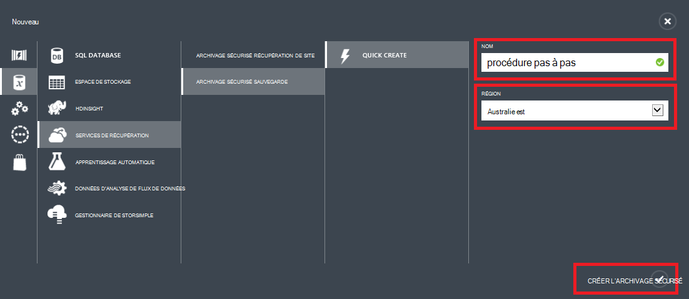
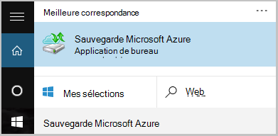

<properties
    pageTitle="Sauvegarder un serveur Windows ou client vers Azure à l’aide du modèle de déploiement classique | Microsoft Azure"
    description="Sauvegarde des serveurs Windows ou des clients Azure en créant un archivage sécurisé sauvegarde, le téléchargement des informations d’identification, l’installation de l’agent de sauvegarde et réalisation d’une sauvegarde initiale de vos fichiers et dossiers."
    services="backup"
    documentationCenter=""
    authors="markgalioto"
    manager="cfreeman"
    editor=""
    keywords="archivage sécurisé sauvegarde ; sauvegarder un serveur Windows ; fenêtres de sauvegarde ;"/>

<tags
    ms.service="backup"
    ms.workload="storage-backup-recovery"
    ms.tgt_pltfrm="na"
    ms.devlang="na"
    ms.topic="article"
    ms.date="08/08/2016"
    ms.author="jimpark; trinadhk; markgal"/>

# Sauvegarder un serveur Windows ou d’un client vers Azure à l’aide du modèle de déploiement classique

> [AZURE.SELECTOR]
- [Portail classique](backup-configure-vault-classic.md)
- [Portail Azure](backup-configure-vault.md)

Cet article décrit les procédures à suivre pour préparer votre environnement et sauvegarder Windows server (ou client) à Azure. Il traite également les considérations relatives au déploiement de votre solution de sauvegarde. Si vous êtes intéressé par l’Azure sauvegarde pour la première fois, cet article vous guide rapidement dans le processus.

>[AZURE.IMPORTANT] Azure comporte deux modèles de déploiement différents pour la création et utilisation des ressources : Gestionnaire de ressources et classique. Cet article décrit l’utilisation du modèle de déploiement classique. Microsoft recommande la plupart des nouveaux déploiements d’utiliser le modèle de gestionnaire de ressources.

## Avant de commencer
Pour sauvegarder un serveur ou client vers Azure, vous avez besoin d’un compte Azure. Si vous n’en avez pas, vous pouvez créer un [compte gratuit](https://azure.microsoft.com/free/) en quelques minutes.

## Étape 1 : Créer un archivage sécurisé sauvegarde
Pour sauvegarder des fichiers et dossiers à partir d’un serveur ou le client, vous devez créer un archivage sécurisé sauvegarde dans la région géographique dans lequel vous voulez stocker les données.

### Pour créer un archivage sécurisé sauvegarde

1. Connectez-vous au [portail classique](https://manage.windowsazure.com/).

2. Cliquez sur **Nouveau** > **Data Services** > **Services de récupération** > **L’archivage sécurisé de sauvegarde**, puis cliquez sur **Création rapide**.

3. Pour le paramètre **nom** , entrez un nom convivial pour l’archivage sécurisé sauvegarde. Tapez un nom qui contient entre 2 et 50 caractères. Il doit commencer par une lettre et peut contenir uniquement des lettres, des chiffres et des traits d’union. Ce nom doit être unique pour chaque abonnement.

4. Pour le paramètre de **région** , sélectionnez la région géographique pour l’archivage sécurisé sauvegarde. Ce choix détermine la région géographique où vos données de sauvegarde sont envoyées. En choisissant une région géographique est éloigné de votre emplacement, vous pouvez réduire la latence du réseau lorsque vous sauvegardez vers Azure.

5. Cliquez sur **créer l’archivage sécurisé**.

    

    Il peut prendre un certain temps pour l’archivage sécurisé sauvegarde à créer. Pour vérifier l’état, surveiller les notifications en bas du portail classique.

    Une fois que l’archivage sécurisé sauvegarde a été créé, vous verrez un message vous informant que l’archivage sécurisé a été créé. Il s’affiche également comme **actif** dans la liste des **Services de récupération des** ressources.

    

4. Sélectionnez l’option de redondance de stockage en suivant les étapes décrites ici.

    >[AZURE.IMPORTANT] Le meilleur moment pour identifier votre option de redondance de stockage est juste après la création de l’archivage sécurisé et avant que tous les ordinateurs sont enregistrés à l’archivage sécurisé. Une fois un élément a été enregistré à l’archivage sécurisé, l’option de redondance de stockage est verrouillée et ne peut pas être modifiée.

    Si vous utilisez Azure comme un point de terminaison de stockage de sauvegarde principal (par exemple, vous sauvegardez sur Azure à partir de Windows server), envisagez d’option de [stockage geo redondants](../storage/storage-redundancy.md#geo-redundant-storage) en sélectionnant (par défaut).

    Si vous utilisez Azure comme point de terminaison troisième stockage de sauvegarde (par exemple, vous utilisez System Center Data Protection Manager pour stocker une copie de sauvegarde locale en local et l’utilisation Azure pour la rétention à long terme doit), pensez à choisir [stockage localement redondants](../storage/storage-redundancy.md#locally-redundant-storage). Cela vers le bas du coût de stockage des données dans Azure, tout en fournissant un niveau inférieur de durabilité pour vos données peuvent être acceptables pour la troisième copies.

    **Pour sélectionner l’option de redondance de stockage :**

    un. Cliquez sur l’archivage sécurisé que vous venez de créer.

    b. Dans la page de démarrage rapide, cliquez sur **configurer**.

    

    c. Choisissez l’option de redondance de stockage approprié.

    Si vous sélectionnez **Redondants localement**, vous devez cliquer sur **Enregistrer** (car **Geo redondants** est l’option par défaut).

    d. Dans le volet de navigation gauche, cliquez sur **Services de récupération** pour revenir à la liste des ressources pour les Services de récupération.

## Étape 2 : Télécharger le fichier d’informations d’identification de l’archivage sécurisé
L’ordinateur local doit être authentifié avec un archivage sécurisé sauvegarde qu’il puisse sauvegarder données Azure. L’authentification par le biais *informations d’identification de l’archivage sécurisé*. Le fichier d’informations d’identification de l’archivage sécurisé est téléchargé via un canal sécurisé à partir du portail classique. La clé privée n’est pas conservé dans le portail ou le service.

En savoir plus sur [l’utilisation de vault informations d’identification pour vous authentifier avec le service de sauvegarde](backup-introduction-to-azure-backup.md#what-is-the-vault-credential-file).

### Pour télécharger le fichier d’informations d’identification de l’archivage sécurisé sur un ordinateur local

1. Dans le volet de navigation gauche, cliquez sur **Services de récupération**, puis sélectionnez l’archivage sécurisé sauvegarde que vous avez créé.

    

2.  Dans la page de démarrage rapide, cliquez sur **télécharger les informations d’identification de l’archivage sécurisé**.

    Le portail classique génère une information d’identification de l’archivage sécurisé à l’aide d’une combinaison du nom de l’archivage sécurisé et la date du jour. Le fichier d’informations d’identification de l’archivage sécurisé est utilisé uniquement pendant le flux de travail d’inscription et expire après 48 heures.

    Le fichier d’informations d’identification de l’archivage sécurisé peut être téléchargé à partir du portail.

3. Cliquez sur **Enregistrer** pour télécharger le fichier d’informations d’identification de l’archivage sécurisé dans le dossier Téléchargements du compte local. Vous pouvez également sélectionner **Enregistrer sous** dans le menu **Enregistrer** pour spécifier un emplacement pour le fichier d’informations d’identification de l’archivage sécurisé.

    >[AZURE.NOTE] Vérifiez que le fichier d’informations d’identification de l’archivage sécurisé est enregistré dans un emplacement accessible à partir de votre ordinateur. S’il est stocké dans un bloc de message de partage ou un serveur de fichier, vérifiez que vous disposez des autorisations pour y accéder.

## Étape 3 : Télécharger, installer et inscrire l’agent de sauvegarde
Après avoir créé l’archivage sécurisé sauvegarde et téléchargez le fichier d’informations d’identification de l’archivage sécurisé, un agent doit être installé sur chacun de vos ordinateurs Windows.

### Pour télécharger, installer et inscrire l’agent

1. Cliquez sur **Services de récupération**et sélectionnez l’archivage sécurisé sauvegarde que vous voulez enregistrer avec un serveur.

2. Dans la page de démarrage rapide, cliquez sur l’agent de **l’Agent de Windows Server System Center Data Protection Manager ou Windows client**. Cliquez sur **Enregistrer**.

    

3. Une fois le fichier MARSagentinstaller.exe téléchargé, cliquez sur **exécuter** (ou double-cliquez sur **MARSAgentInstaller.exe** de l’emplacement enregistré).

4. Sélectionnez le dossier d’installation et le dossier cache requis pour l’agent, puis cliquez sur **suivant**. L’emplacement du cache que vous spécifiez peut comporter qu’un espace libre égal au moins 5 % des données de sauvegarde.

5. Vous pouvez continuer à vous connecter à Internet via les paramètres de proxy par défaut.          Si vous utilisez un serveur proxy pour vous connecter à Internet, dans la page Configuration du serveur Proxy, activez la case à cocher **utiliser les paramètres de proxy personnalisés** et puis entrez les détails du serveur proxy. Si vous utilisez un proxy authentifié, entrez les informations de nom et mot de passe utilisateur, puis cliquez sur **suivant**.

7. Cliquez sur **installer** pour commencer l’installation de l’agent. L’agent de sauvegarde installe .NET Framework 4.5 et Windows PowerShell (s’il n’est pas déjà installé) pour terminer l’installation.

8. Une fois que l’agent est installé, cliquez sur **continuer à la page inscription** pour continuer le flux de travail.

9. Dans la page d’Identification de l’archivage sécurisé, recherchez et sélectionnez le fichier d’informations d’identification de l’archivage sécurisé que vous avez précédemment téléchargé.

    Le fichier d’informations d’identification de l’archivage sécurisé est valable uniquement 48 heures après son téléchargement à partir du portail. Si vous rencontrez une erreur sur cette page (par exemple, « l’archivage sécurisé informations d’identification fichier fourni a expiré »), connectez-vous au portail et télécharger à nouveau le fichier d’informations d’identification de l’archivage sécurisé.

    Vérifiez que le fichier d’informations d’identification de l’archivage sécurisé est disponible dans un emplacement accessible par l’application de configuration. Si vous rencontrez des erreurs liées à access, copiez le fichier d’informations d’identification de l’archivage sécurisé vers un emplacement temporaire sur le même ordinateur et recommencez l’opération.

    Si vous rencontrez une erreur d’informations d’identification de l’archivage sécurisé comme « non valides de l’archivage sécurisé informations d’identification fournies », le fichier est endommagé ou les dernières informations d’identification avec le service de récupération signifie avez pas associé. Recommencez l’opération après avoir téléchargé un nouveau fichier d’informations d’identification de l’archivage sécurisé à partir du portail. Cette erreur peut se produire également si un utilisateur clique sur l’option **d’informations d’identification de l’archivage sécurisé télécharger** plusieurs fois de suite. Dans ce cas, uniquement le dernier fichier de données d’identification de l’archivage sécurisé est valide.

9. Dans la page Paramètres de chiffrement, vous pouvez générer un mot de passe ou fournir un mot de passe (avec un minimum de 16 caractères). N’oubliez pas d’enregistrer le mot de passe dans un emplacement sécurisé.

10. Cliquez sur **Terminer**. L’Assistant Inscription Server inscrit le serveur avec la sauvegarde.

    >[AZURE.WARNING] Si vous perdez ou oubliez le mot de passe, Microsoft ne peut vous aider à récupérer les données de sauvegarde. Vous êtes propriétaire du mot de passe de chiffrement, et Microsoft n’a pas de visibilité sur le mot de passe que vous utilisez. Enregistrez le fichier dans un emplacement sécurisé parce qu’il sera requis lors d’une opération de récupération.

11. Une fois la clé de chiffrement est définie, laissez la case à cocher **Lancer l’Agent de Services de Microsoft Azure récupération** activée, puis cliquez sur **Fermer**.

## Étape 4 : Finaliser la sauvegarde initiale

La sauvegarde initiale inclut deux tâches clés :

- Création de la planification de sauvegarde
- Sauvegarde des fichiers et dossiers pour la première fois

La stratégie de sauvegarde après la sauvegarde initiale, il crée des points de sauvegarde que vous pouvez utiliser si vous avez besoin récupérer les données. La stratégie de sauvegarde pour cela, en fonction du programme que vous définissez.

### Pour planifier la sauvegarde

1. Ouvrez l’agent de Microsoft Azure sauvegarde. (Il s’ouvre automatiquement si vous avez oublié la case à cocher **Lancer l’Agent de Services de Microsoft Azure récupération** sélectionnée lorsque vous avez fermé l’Assistant enregistrement de serveur.) Vous pouvez trouver en recherchant votre ordinateur **Microsoft Azure sauvegarde**.

    

2. Dans l’agent de sauvegarde, cliquez sur **Planifier la sauvegarde**.

    

3. Dans la page prise en main de l’Assistant Planification de sauvegarde, cliquez sur **suivant**.

4. Dans les éléments sélectionnez page de sauvegarde, cliquez sur **Ajouter des éléments**.

5. Sélectionnez les fichiers et dossiers que vous souhaitez sauvegarder, puis cliquez sur **OK**.

6. Cliquez sur **suivant**.

7. Dans la page **Spécifier la planification de sauvegarde** , spécifiez la **planification de la sauvegarde** , puis cliquez sur **suivant**.

    Vous pouvez planifier quotidiennement (au taux maximal de trois fois par jour) ou sauvegardes hebdomadaires.

    

    >[AZURE.NOTE] Pour plus d’informations sur la spécification de la planification de sauvegarde, voir l’article [Utiliser Azure sauvegarde à remplacer votre infrastructure de bandes](backup-azure-backup-cloud-as-tape.md).

8. Dans la page **Sélectionner une stratégie de rétention** , sélectionnez la **Stratégie de rétention** pour la copie de sauvegarde.

    La stratégie de rétention indique la durée pendant laquelle la sauvegarde est stockée. Au lieu de simplement spécifier une stratégie « plate » pour tous les points de sauvegarde, vous pouvez spécifier d’autres stratégies de rétention basée sur lorsque la sauvegarde a lieu. Vous pouvez modifier les stratégies de rétention quotidienne, hebdomadaire, mensuel et annuel selon vos besoins.

9. Dans la page Choisir un Type de sauvegarde Initial, choisissez le type de sauvegarde initial. Assurez-vous que l’option **automatiquement sur le réseau** sélectionné, puis cliquez sur **suivant**.

    Vous pouvez sauvegarder automatiquement sur le réseau, ou vous pouvez sauvegarder en mode hors connexion. Le reste de cet article décrit le processus de sauvegarde automatiquement. Si vous préférez effectuer une sauvegarde hors connexion, consultez l’article [en mode hors connexion flux de travail de sauvegarde dans Azure sauvegarde](backup-azure-backup-import-export.md) pour plus d’informations.

10. Dans la page de Confirmation, vérifiez les informations, puis cliquez sur **Terminer**.

11. Une fois l’Assistant terminé la création de la planification de sauvegarde, cliquez sur **Fermer**.

### Activer la limitation de réseau (facultatif)

L’agent de sauvegarde fournit la limitation de réseau. Cette limitation contrôle utilisation de la bande passante réseau lors du transfert de données. Ce contrôle peut être utile si vous avez besoin sauvegarder les données lors de heures de travail, mais ne souhaitez pas que le processus de sauvegarde interférer avec d’autres le trafic Internet. La limitation s’applique pour sauvegarder et restaurer des activités.

**Pour activer la limitation de réseau**

1. Dans l’agent de sauvegarde, cliquez sur **Modifier les propriétés**.

    

2. Sous l’onglet **régulation** , cochez la case **Activer l’utilisation de la bande passante internet la limitation pour les opérations de sauvegarde** .

    

3. Une fois que vous avez activé la limitation, spécifiez la bande passante autorisée pour le transfert de données de sauvegarde pendant les **heures de travail** et les **heures de travail Non**.

    Les valeurs de bande passante commencent à la vitesse maximale 512 par seconde (kb/s) et peuvent aller jusqu'à 1023 Mo par seconde (MBps). Vous pouvez également indiquer le début et de fin pour les **heures de travail**et les jours de la semaine sont des jours de travail considérée. Heures en dehors de travail désigné heures sont considérées comme non liés au travail heures.

4. Cliquez sur **OK**.

### Pour sauvegarder maintenant

1. Dans l’agent de sauvegarde, cliquez sur **Sauvegarder maintenant** pour terminer la distribution initiale du réseau.

    

2. Dans la page de Confirmation, passez en revue les paramètres de l’Assistant sauvegarde des maintenant utilisera pour sauvegarder l’ordinateur. Puis cliquez sur **Sauvegarder**.

3. Cliquez sur **Fermer** pour fermer l’Assistant. Si vous procédez comme suit avant la fin du processus de sauvegarde, l’Assistant continue à fonctionner en arrière-plan.

Une fois la sauvegarde initiale terminée, l’état **du travail terminée** s’affiche dans la console de sauvegarde.

## Étapes suivantes
- S’inscrire à un [compte Azure gratuit](https://azure.microsoft.com/free/).

Pour plus d’informations sur la sauvegarde des machines virtuelles ou autres charges de travail, voir :

- [Sauvegarder des machines virtuelles IaaS](backup-azure-vms-prepare.md)
- [Sauvegarder les charges de travail vers Azure avec Microsoft Azure sauvegarde Server](backup-azure-microsoft-azure-backup.md)
- [Sauvegarder les charges de travail vers Azure avec DPM](backup-azure-dpm-introduction.md)
