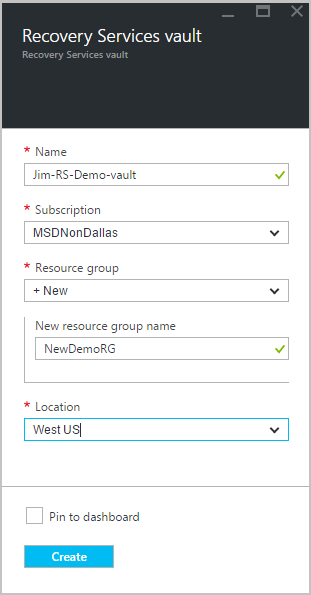

<properties
    pageTitle="Sauvegarder un client vers Azure avec sauvegarde Azure en utilisant le modèle de déploiement du Gestionnaire de ressources ou Windows Server | Microsoft Azure"
    description="Sauvegarde des serveurs Windows ou des clients Azure en créant un archivage sécurisé sauvegarde, le téléchargement des informations d’identification, l’installation de l’agent de sauvegarde et réalisation d’une sauvegarde initiale de vos fichiers et dossiers."
    services="backup"
    documentationCenter=""
    authors="markgalioto"
    manager="cfreeman"
    editor=""
    keywords="archivage sécurisé sauvegarde ; sauvegarder un serveur Windows ; fenêtres de sauvegarde ;"/>

<tags
    ms.service="backup"
    ms.workload="storage-backup-recovery"
    ms.tgt_pltfrm="na"
    ms.devlang="na"
    ms.topic="article"
    ms.date="08/10/2016"
    ms.author="jimpark; trinadhk; markgal"/>

# Sauvegarder un client ou Windows Server sur Azure à l’aide du modèle de déploiement Gestionnaire de ressources

> [AZURE.SELECTOR]
- [Portail Azure](backup-configure-vault.md)
- [Portail classique](backup-configure-vault-classic.md)

Cet article explique comment faire pour sauvegarder votre Windows Server (ou client Windows) fichiers et dossiers vers Azure avec sauvegarde Azure en utilisant le modèle de déploiement du Gestionnaire de ressources.

[AZURE.INCLUDE [learn-about-deployment-models](../../includes/backup-deployment-models.md)]

## Avant de commencer
Pour sauvegarder un serveur ou client vers Azure, vous avez besoin d’un compte Azure. Si vous n’en avez pas, vous pouvez créer un [compte gratuit](https://azure.microsoft.com/free/) en quelques minutes.

## Étape 1 : Créer un archivage sécurisé aux Services de récupération

Un archivage sécurisé aux Services de récupération est une entité qui stocke les sauvegardes et les points de récupération que vous créez au fil du temps. L’archivage sécurisé aux Services de récupération contienne également la stratégie de sauvegarde appliquée aux fichiers protégés et dossiers. Lorsque vous créez un archivage sécurisé aux Services de récupération, vous devez également sélectionnez l’option de redondance stockage approprié.

### Pour créer une récupération Services l’archivage sécurisé

1. Si vous n’avez pas déjà fait, connectez-vous au [Portail Azure](https://portal.azure.com/) à l’aide de votre abonnement Azure.

2. Dans le menu concentrateur, cliquez sur **Parcourir** , dans la liste des ressources, tapez **Les Services de récupération**. Lorsque vous commencez à taper, la liste filtre selon vos entrées. Cliquez sur **Services de récupération de chambres fortes**.

      

    La liste des Services de récupération chambres fortes s’affiche.

3. Dans le menu **chambres fortes Services de récupération** , cliquez sur **Ajouter**.

    

    La carte de l’archivage sécurisé aux Services de récupération s’ouvre et vous invite à fournir un **nom**, un **abonnement**, un **groupe de ressources**et un **emplacement**.

    

4. Pour **nom**, entrez un nom convivial pour identifier l’archivage sécurisé. Le nom doit être unique pour l’abonnement Azure. Tapez un nom qui contient entre 2 et 50 caractères. Il doit commencer par une lettre et peut contenir uniquement des lettres, des chiffres et des traits d’union.

5. Cliquez sur l' **abonnement** pour afficher la liste des abonnements disponibles. Si vous n’êtes pas sûr du type d’abonnement à utiliser, utilisez la valeur par défaut (ou suggérées) abonnement. Il sera plusieurs choix uniquement si votre compte professionnel est associé à plusieurs abonnements Azure.

6. Cliquez sur **groupe de ressources** pour afficher la liste des groupes de ressources disponibles, ou cliquez sur **Nouveau** pour créer un nouveau groupe de ressources. Pour plus d’informations sur les groupes de ressources, voir [vue d’ensemble du Gestionnaire de ressources Azure](../azure-resource-manager/resource-group-overview.md)

7. Cliquez sur l' **emplacement** pour sélectionner la zone géographique pour l’archivage sécurisé. Ce choix détermine la région géographique où vos données de sauvegarde sont envoyées. En choisissant une région géographique est éloigné de votre emplacement, vous pouvez réduire la latence du réseau lorsque vous sauvegardez vers Azure.

8. Cliquez sur **créer**. Il peut prendre un certain temps pour l’archivage sécurisé de Services de récupération à créer. Surveiller les notifications d’état dans l’angle supérieur droit dans le portail. Une fois votre l’archivage sécurisé est créé, il doit s’ouvrir dans le portail. Si vous ne voyez pas votre l’archivage sécurisé répertorié après que qu’elle a été terminée, cliquez sur **Actualiser**. Lors de l’actualisation de la liste, cliquez sur le nom de l’archivage sécurisé.

### Pour déterminer redondance du stockage
Lorsque vous créez un archivage sécurisé aux Services de récupération vous déterminez comment stockage est répliqué.

1. Dans la carte de **paramètres** qui s’ouvre automatiquement avec votre tableau de bord de l’archivage sécurisé, cliquez sur **Infrastructure de sauvegarde**.

2. Dans la carte de l’Infrastructure de sauvegarde, cliquez sur la **Configuration de sauvegarde** pour afficher le **type de réplication de stockage**.

    

3. Choisissez l’option de réplication de stockage pour votre l’archivage sécurisé.

    

    Par défaut, votre l’archivage sécurisé comprend un stockage geo redondants. Si vous utilisez Azure comme point de terminaison stockage sauvegarde principal, continuez à l’aide de stockage geo redondants. Si vous utilisez Azure comme un point de terminaison de stockage de sauvegarde non primaire, puis choisissez stockage localement redondant, ce qui permet de réduire les frais de stockage des données dans Azure. En savoir plus sur [geo redondants](../storage/storage-redundancy.md#geo-redundant-storage) et les options de stockage [localement redondantes](../storage/storage-redundancy.md#locally-redundant-storage) dans cette [vue d’ensemble](../storage/storage-redundancy.md).

    Après avoir choisi l’option de stockage pour votre l’archivage sécurisé, vous êtes prêt à associer vos fichiers et dossiers à l’archivage sécurisé.

À présent que vous avez créé un archivage sécurisé, vous préparez votre infrastructure pour sauvegarder des fichiers et dossiers en téléchargement et installation de l’agent de Services de récupération de Microsoft Azure, le téléchargement des informations d’identification de l’archivage sécurisé, puis en utilisant ces informations d’identification pour enregistrer l’agent avec l’archivage sécurisé.

## Étape 2 : télécharger des fichiers

>[AZURE.NOTE] L’activation de sauvegarde via le portail Azure sera bientôt disponible. Pour le moment, vous utilisez l’Agent de Services Microsoft Azure récupération en local pour sauvegarder vos fichiers et dossiers.

1. Cliquez sur **paramètres** dans le tableau de bord de l’archivage sécurisé de Services de récupération.

    

2. Cliquez sur **mise en route > sauvegarde** sur la carte de paramètres.

    

3. Cliquez sur **objectif de sauvegarde** dans la carte de sauvegarde.

    

4. Sélectionnez **local** à partir de la page où est votre charge de travail en cours d’exécution ? menu.

5. Sélectionnez les **fichiers et dossiers** dans le que voulez-vous sauvegarder ? menu, puis cliquez sur **OK**.

#### Téléchargez l’agent de Services de récupération

1. Cliquez sur **Télécharger l’Agent de Windows Server ou Client Windows** dans la carte de **préparer infrastructure** .

    

2. Dans la fenêtre contextuelle de téléchargement, cliquez sur **Enregistrer** . Par défaut, le fichier **MARSagentinstaller.exe** est enregistré dans votre dossier Téléchargements.

#### Télécharger des informations d’identification de l’archivage sécurisé

1. Cliquez sur **Télécharger > Enregistrer** sur la carte d’infrastructure préparer.

    

## Étape 3 : installer et inscrire l’agent

1. Recherchez et double-cliquez sur **MARSagentinstaller.exe** dans le dossier Téléchargements (ou un autre emplacement enregistré).

2. Exécutez l’Assistant Configuration de Microsoft Azure récupération Services Agent. Pour terminer l’Assistant, vous devez :

    - Choisissez un emplacement pour l’installation et le dossier cache.
    - Si vous utilisez un serveur proxy pour vous connecter à internet, fournissent votre proxy informations du serveur.
    - Fournir aux utilisateurs plus nom et mot de passe si vous utilisez un proxy authentifié.
    - Fournir les informations d’identification de l’archivage sécurisé téléchargé
    - Enregistrer le mot de passe de chiffrement dans un emplacement sécurisé.

    >[AZURE.NOTE] Si vous perdez ou oubliez le mot de passe, Microsoft ne peut pas vous aider à récupérer les données de sauvegarde. Enregistrez le fichier dans un emplacement sécurisé. Il est nécessaire de restaurer une sauvegarde.

L’agent est installé et votre ordinateur est enregistrée dans l’archivage sécurisé. Vous êtes prêt à configurer et planifier votre sauvegarde.

### Confirmer l’installation

Pour vérifier que l’agent a été installé et enregistré correctement, vous pouvez vérifier pour les éléments que vous avez sauvegardé dans la section **Serveur de Production** du portail de gestion. Pour cela :

1. Connectez-vous au [Portail Azure](https://portal.azure.com/) à l’aide de votre abonnement Azure.

2. Dans le menu concentrateur, cliquez sur **Parcourir** , dans la liste des ressources, tapez **Les Services de récupération**. Lorsque vous commencez à taper, la liste filtre selon vos entrées. Cliquez sur **Services de récupération de chambres fortes**.

      

    La liste des Services de récupération chambres fortes s’affiche.

2. Sélectionnez le nom de l’archivage sécurisé que vous avez créé.

    La carte de tableau de bord de l’archivage sécurisé de Services de récupération s’ouvre.

      

3. Cliquez sur le bouton **paramètres** en haut de la page.

4. Cliquez sur **Infrastructure de sauvegarde > serveurs de Production**.

    

Si vous voyez vos serveurs dans la liste, vous devez confirmation que l’agent a été installé et enregistré correctement.

## Étape 4 : Finaliser la sauvegarde initiale

La sauvegarde initiale inclut deux tâches clés :

- Planifier la sauvegarde
- Sauvegarder des fichiers et dossiers pour la première fois

Pour terminer la sauvegarde initiale, vous utilisez l’agent de sauvegarde de Microsoft Azure.

### Pour planifier la sauvegarde

1. Ouvrez l’agent de Microsoft Azure sauvegarde. Vous pouvez trouver en recherchant votre ordinateur **Microsoft Azure sauvegarde**.

    

2. Dans l’agent de sauvegarde, cliquez sur **Planifier la sauvegarde**.

    

3. Dans la page prise en main de l’Assistant Planification de sauvegarde, cliquez sur **suivant**.

4. Dans les éléments sélectionnez page de sauvegarde, cliquez sur **Ajouter des éléments**.

5. Sélectionnez les fichiers et dossiers que vous souhaitez sauvegarder, puis cliquez sur **OK**.

6. Cliquez sur **suivant**.

7. Dans la page **Spécifier la planification de sauvegarde** , spécifiez la **planification de la sauvegarde** , puis cliquez sur **suivant**.

    Vous pouvez planifier quotidiennement (au taux maximal de trois fois par jour) ou sauvegardes hebdomadaires.

    

    >[AZURE.NOTE] Pour plus d’informations sur la spécification de la planification de sauvegarde, voir l’article [Utiliser Azure sauvegarde à remplacer votre infrastructure de bandes](backup-azure-backup-cloud-as-tape.md).

8. Dans la page **Sélectionner une stratégie de rétention** , sélectionnez la **Stratégie de rétention** pour la copie de sauvegarde.

    La stratégie de rétention indique la durée pendant laquelle la sauvegarde est stockée. Au lieu de simplement spécifier une stratégie « plate » pour tous les points de sauvegarde, vous pouvez spécifier d’autres stratégies de rétention basée sur lorsque la sauvegarde a lieu. Vous pouvez modifier les stratégies de rétention quotidienne, hebdomadaire, mensuel et annuel selon vos besoins.

9. Dans la page Choisir un Type de sauvegarde Initial, choisissez le type de sauvegarde initial. Assurez-vous que l’option **automatiquement sur le réseau** sélectionné, puis cliquez sur **suivant**.

    Vous pouvez sauvegarder automatiquement sur le réseau, ou vous pouvez sauvegarder en mode hors connexion. Le reste de cet article décrit le processus de sauvegarde automatiquement. Si vous préférez effectuer une sauvegarde hors connexion, consultez l’article [en mode hors connexion flux de travail de sauvegarde dans Azure sauvegarde](backup-azure-backup-import-export.md) pour plus d’informations.

10. Dans la page de Confirmation, vérifiez les informations, puis cliquez sur **Terminer**.

11. Une fois l’Assistant terminé la création de la planification de sauvegarde, cliquez sur **Fermer**.

### Activer la limitation de réseau (facultatif)

L’agent de sauvegarde fournit la limitation de réseau. Cette limitation contrôle utilisation de la bande passante réseau lors du transfert de données. Ce contrôle peut être utile si vous avez besoin sauvegarder les données lors de heures de travail, mais ne souhaitez pas que le processus de sauvegarde interférer avec d’autres le trafic Internet. La limitation s’applique pour sauvegarder et restaurer des activités.

>[AZURE.NOTE] Limitation de réseau n’est pas disponible sur Windows 7, Windows Server 2008 SP2 ou Windows Server 2008 R2 SP1 (avec service Pack). Le réseau de sauvegarde Azure la limitation fonctionnalité engage qualité de Service (qualité de service) sur le système d’exploitation local. Bien que la sauvegarde Azure pouvez protéger ces systèmes d’exploitation, la version de qualité de service disponible sur ces plateformes ne fonctionne pas avec la limitation de réseau Azure sauvegarde. Limitation de réseau peut être utilisée dans tous les autres [systèmes d’exploitation pris en charge](backup-azure-backup-faq.md#installation-amp-configuration).

**Pour activer la limitation de réseau**

1. Dans l’agent de sauvegarde, cliquez sur **Modifier les propriétés**.

    

2. Sous l’onglet **régulation** , cochez la case **Activer l’utilisation de la bande passante internet la limitation pour les opérations de sauvegarde** .

    

3. Une fois que vous avez activé la limitation, spécifiez la bande passante autorisée pour le transfert de données de sauvegarde pendant les **heures de travail** et les **heures de travail Non**.

    Les valeurs de bande passante commencent à la vitesse maximale 512 par seconde (kb/s) et peuvent aller jusqu'à 1023 Mo par seconde (MBps). Vous pouvez également indiquer le début et de fin pour les **heures de travail**et les jours de la semaine sont des jours de travail considérée. Heures en dehors de travail désigné heures sont considérées comme non liés au travail heures.

4. Cliquez sur **OK**.

### Pour sauvegarder des fichiers et dossiers pour la première fois

1. Dans l’agent de sauvegarde, cliquez sur **Sauvegarder maintenant** pour terminer la distribution initiale du réseau.

    

2. Dans la page de Confirmation, passez en revue les paramètres de l’Assistant sauvegarde des maintenant utilisera pour sauvegarder l’ordinateur. Puis cliquez sur **Sauvegarder**.

3. Cliquez sur **Fermer** pour fermer l’Assistant. Si vous procédez comme suit avant la fin du processus de sauvegarde, l’Assistant continue à fonctionner en arrière-plan.

Une fois la sauvegarde initiale terminée, l’état **du travail terminée** s’affiche dans la console de sauvegarde.

## Questions ?
Si vous avez des questions, ou s’il existe une fonctionnalité que vous voulez voir inclus, [envoyez-nous vos commentaires](http://aka.ms/azurebackup_feedback).

## Étapes suivantes
Pour plus d’informations sur la sauvegarde des machines virtuelles ou autres charges de travail, voir :

- À présent que vous avez sauvegardé vos fichiers et dossiers, vous pouvez [gérer vos serveurs et chambres fortes](backup-azure-manage-windows-server.md).
- Si vous avez besoin restaurer une sauvegarde, utilisez cet article pour [restaurer des fichiers sur un ordinateur Windows](backup-azure-restore-windows-server.md).
