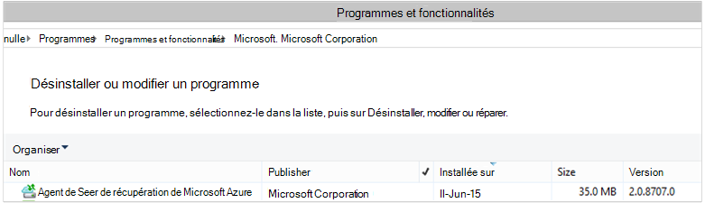

<properties
    pageTitle="Azure sauvegarder - déployer et gérer précédent pour DPM à l’aide de PowerShell | Microsoft Azure"
    description="Découvrez comment déployer et gérer la sauvegarde Azure pour Data Protection Manager (DPM) à l’aide de PowerShell"
    services="backup"
    documentationCenter=""
    authors="Nkolli1"
    manager="shreeshd"
    editor=""/>

<tags
    ms.service="backup"
    ms.workload="storage-backup-recovery"
    ms.tgt_pltfrm="na"
    ms.devlang="na"
    ms.topic="article"
    ms.date="09/27/2016"
    ms.author="jimpark; trinadhk; anuragm; markgal"/>


# <a name="deploy-and-manage-backup-to-azure-for-data-protection-manager-dpm-servers-using-powershell"></a>Déployer et gérer la sauvegarde sur Azure pour les serveurs Data Protection Manager (DPM) à l’aide de PowerShell

> [AZURE.SELECTOR]
- [PROCESSEUR](backup-dpm-automation.md)
- [Classique](backup-dpm-automation-classic.md)

Cet article vous explique comment utiliser PowerShell pour le programme d’installation Azure sauvegarde sur un serveur DPM et gérer la sauvegarde et restauration.

## <a name="setting-up-the-powershell-environment"></a>La configuration de l’environnement PowerShell

[AZURE.INCLUDE [learn-about-deployment-models](../../includes/learn-about-deployment-models-include.md)]

Avant de pouvoir utiliser PowerShell pour gérer les sauvegardes à partir du Gestionnaire de Protection des données à Azure, vous devez disposer de l’environnement propice dans PowerShell. Au début de la session PowerShell, assurez-vous que vous exécutez la commande suivante pour importer les modules droite et vous permettent de faire référence à correctement les applets de commande DPM :

```
PS C:> & "C:\Program Files\Microsoft System Center 2012 R2\DPM\DPM\bin\DpmCliInitScript.ps1"

Welcome to the DPM Management Shell!

Full list of cmdlets: Get-Command
Only DPM cmdlets: Get-DPMCommand
Get general help: help
Get help for a cmdlet: help <cmdlet-name> or <cmdlet-name> -?
Get definition of a cmdlet: Get-Command <cmdlet-name> -Syntax
Sample DPM scripts: Get-DPMSampleScript
```

## <a name="setup-and-registration"></a>Le programme d’installation et d’enregistrement
Pour commencer :

1. [Téléchargez la dernière PowerShell](https://github.com/Azure/azure-powershell/releases) (version minimale requise est : 1.0.0)
2. Activer les applets de commande sauvegarde Azure en optant pour le mode *AzureResourceManager* à l’aide de l’applet de commande **Commutateur AzureMode** :

```
PS C:\> Switch-AzureMode AzureResourceManager
```

Les tâches de configuration et d’enregistrement suivantes peuvent être automatisées avec PowerShell :

- Créer un archivage sécurisé sauvegarde
- Installation de l’agent de sauvegarde Azure
- Enregistrement avec le service de sauvegarde d’Azure
- Paramètres de mise en réseau
- Paramètres de chiffrement

### <a name="create-a-backup-vault"></a>Créer un archivage sécurisé sauvegarde

> [AZURE.WARNING] Pour les clients à l’aide de sauvegarde Azure pour la première fois, vous devez enregistrer le fournisseur de sauvegarde Azure à utiliser avec votre abonnement. Cela peut être exécuté en exécutant la commande suivante : Registre AzureProvider - ProviderNamespace « Microsoft.Backup »

Vous pouvez créer un archivage sécurisé sauvegarde à l’aide de l’applet de commande **New-AzureRMBackupVault** . L’archivage sécurisé sauvegarde est une ressource processeur, vous devez placer au sein d’un groupe de ressources. Dans une console PowerShell Azure avec élévation de privilèges, exécutez les commandes suivantes :

```
PS C:\> New-AzureResourceGroup –Name “test-rg” -Region “West US”
PS C:\> $backupvault = New-AzureRMBackupVault –ResourceGroupName “test-rg” –Name “test-vault” –Region “West US” –Storage GRS
```

Vous pouvez obtenir une liste de tous les coffres-forts sauvegarde dans un abonnement donné à l’aide de l’applet de commande **Get-AzureRMBackupVault** .


### <a name="installing-the-azure-backup-agent-on-a-dpm-server"></a>Installation de l’agent de sauvegarde Azure sur un serveur DPM
Avant d’installer l’agent de sauvegarde Azure, vous devez avoir le programme d’installation téléchargé et présent sur le serveur de Windows. Vous pouvez obtenir la dernière version de l’installer à partir du [Centre de téléchargement Microsoft](http://aka.ms/azurebackup_agent) ou à partir de la page de tableau de bord de l’archivage sécurisé sauvegarde. Enregistrer le programme d’installation vers un emplacement accessible facilement comme * C:\Downloads\*.

Pour installer l’agent, exécutez la commande suivante dans un PowerShell avec élévation de privilèges console **sur le serveur DPM**:

```
PS C:\> MARSAgentInstaller.exe /q
```

Cette procédure installe l’agent avec toutes les options par défaut. L’installation peut prendre quelques minutes en arrière-plan. Si vous ne spécifiez pas l’option */nu* la fenêtre **Windows Update** s’ouvre à la fin de l’installation pour vérifier les mises à jour.

L’agent s’affichent dans la liste des programmes installés. Pour afficher la liste des programmes installés, accédez au **Panneau** > **programmes** > **programmes et fonctionnalités**.



#### <a name="installation-options"></a>Options d’installation
Pour afficher toutes les options disponibles via la ligne de commande, utilisez la commande suivante :

```
PS C:\> MARSAgentInstaller.exe /?
```

Les options disponibles incluent :

| Option | Plus d’informations | Par défaut |
| ---- | ----- | ----- |
| / q | Installation en mode silencieux | - |
| / p: « emplacement » | Chemin d’accès au dossier d’installation de l’agent de sauvegarde Azure. | Agent de C:\Program Files\Microsoft récupération Azure Services |
| / s: « emplacement » | Chemin d’accès au dossier cache de l’agent de sauvegarde Azure. | C:\Program Files\Microsoft récupération Azure Services Agent\Scratch |
| /m | Participer à Microsoft Update | - |
| /nu | Ne pas vérifier les mises à jour une fois l’installation terminée | - |
| /d | Désinstallation Agent de Services de récupération de Microsoft Azure | - |
| /pH | Adresse de l’hôte proxy | - |
| PD | Numéro de Port de l’hôte proxy | - |
| /pu | Nom d’utilisateur hôte de proxy | - |
| /pw | Mot de passe proxy | - |

### <a name="registering-with-the-azure-backup-service"></a>Enregistrement avec le service de sauvegarde d’Azure
Avant de pouvoir enregistrer avec le service de sauvegarde Azure, vous devez vous assurer que les [conditions préalables](backup-azure-dpm-introduction.md) sont remplies. Il le faut :

- Ayez un abonnement Azure valide
- Ont un archivage sécurisé sauvegarde

Pour télécharger les informations d’identification de l’archivage sécurisé, exécutez l’applet de commande **Get-AzureBackupVaultCredentials** dans une console PowerShell Azure et stockez-le dans un emplacement pratique, par exemple * C:\Downloads\*.

```
PS C:\> $credspath = "C:\"
PS C:\> $credsfilename = Get-AzureRMBackupVaultCredentials -Vault $backupvault -TargetLocation $credspath
PS C:\> $credsfilename
f5303a0b-fae4-4cdb-b44d-0e4c032dde26_backuprg_backuprn_2015-08-11--06-22-35.VaultCredentials
```

Inscription de l’ordinateur avec l’archivage sécurisé est effectuée à l’aide de l’applet de commande [Démarrer DPMCloudRegistration](https://technet.microsoft.com/library/jj612787) :

```
PS C:\> $cred = $credspath + $credsfilename
PS C:\> Start-DPMCloudRegistration -DPMServerName "TestingServer" -VaultCredentialsFilePath $cred
```

Cela va enregistrer le serveur DPM nommé « TestingServer » avec l’archivage sécurisé Azure de Microsoft à l’aide des informations d’identification de l’archivage sécurisé spécifié.

> [AZURE.IMPORTANT] N’utilisez pas de chemins d’accès relatifs pour spécifier le fichier d’informations d’identification de l’archivage sécurisé. Vous devez fournir un chemin d’accès absolu comme une entrée de l’applet de commande.

### <a name="initial-configuration-settings"></a>Paramètres de configuration initiale
Une fois que le serveur DPM est enregistré avec l’archivage sécurisé sauvegarde Azure, il commence par les paramètres d’abonnement par défaut. Ces paramètres d’abonnement incluent mise en réseau, le chiffrement et la zone de travail. Pour modifier les paramètres de l’abonnement, vous devez tout d’abord manipuler les paramètres (par défaut) existants à l’aide de l’applet de commande [Get-DPMCloudSubscriptionSetting](https://technet.microsoft.com/library/jj612793) :

```
$setting = Get-DPMCloudSubscriptionSetting -DPMServerName "TestingServer"
```

Toutes les modifications sont apportées à cet objet PowerShell local ```$setting``` et puis l’objet complet s’engage à DPM et sauvegarde Azure d’enregistrer à l’aide de l’applet de commande [Set-DPMCloudSubscriptionSetting](https://technet.microsoft.com/library/jj612791) . Vous devez utiliser le ```–Commit``` indicateur pour vous assurer que les modifications sont conservées. Les paramètres ne seront pas appliqués et utilisés par la sauvegarde Azure, à moins que validée.

```
PS C:\> Set-DPMCloudSubscriptionSetting -DPMServerName "TestingServer" -SubscriptionSetting $setting -Commit
```

### <a name="networking"></a>Mise en réseau
Si la connectivité de l’ordinateur DPM pour le service de sauvegarde Azure sur internet est via un serveur proxy, les paramètres du serveur proxy doivent être fournis pour réussir des sauvegardes. Pour ce faire, à l’aide de la ```-ProxyServer```, ```-ProxyPort```, ```-ProxyUsername``` et la ```ProxyPassword``` paramètres avec l’applet de commande [Set-DPMCloudSubscriptionSetting](https://technet.microsoft.com/library/jj612791) . Dans cet exemple, il n’existe aucun serveur proxy afin que nous apportions explicitement désactivant les informations relatives aux proxy.

```
PS C:\> Set-DPMCloudSubscriptionSetting -DPMServerName "TestingServer" -SubscriptionSetting $setting -NoProxy
```

L’utilisation de la bande passante peut également être contrôlée avec les options de ```-WorkHourBandwidth``` et ```-NonWorkHourBandwidth``` d’un ensemble de jours de la semaine. Dans cet exemple, nous n'allons pas affecter toute régulation.

```
PS C:\> Set-DPMCloudSubscriptionSetting -DPMServerName "TestingServer" -SubscriptionSetting $setting -NoThrottle
```

### <a name="configuring-the-staging-area"></a>Configuration de la zone de travail
L’agent de sauvegarde Azure s’exécutant sur le serveur DPM a besoin de stockage temporaire pour les données restaurées à partir du cloud (zone de travail local). Configurer la zone de travail à l’aide de l’applet de commande [Set-DPMCloudSubscriptionSetting](https://technet.microsoft.com/library/jj612791) et la ```-StagingAreaPath``` paramètre.

```
PS C:\> Set-DPMCloudSubscriptionSetting -DPMServerName "TestingServer" -SubscriptionSetting $setting -StagingAreaPath "C:\StagingArea"
```

Dans l’exemple ci-dessus, la zone de travail est fixée à *C:\StagingArea* dans l’objet PowerShell ```$setting```. Vérifiez que le dossier spécifié existe déjà, sinon la validation finale les paramètres d’abonnement échouera.


### <a name="encryption-settings"></a>Paramètres de chiffrement
Les données de sauvegarde envoyées à Azure sauvegarde sont chiffrées pour protéger la confidentialité des données. Le mot de passe de chiffrement est « mot de passe » à déchiffrer les données au moment de la restaurer. Il est important de maintenir ces informations sécurisée une fois que celle-ci est définie.

Dans l’exemple ci-dessous, la première commande convertit la chaîne ```passphrase123456789``` à une chaîne sécurisée et affecte la chaîne sécurisée à la variable nommée ```$Passphrase```. la commande deuxième définit la chaîne sécurisée dans ```$Passphrase``` en tant que le mot de passe pour le chiffrement des sauvegardes.

```
PS C:\> $Passphrase = ConvertTo-SecureString -string "passphrase123456789" -AsPlainText -Force

PS C:\> Set-DPMCloudSubscriptionSetting -DPMServerName "TestingServer" -SubscriptionSetting $setting -EncryptionPassphrase $Passphrase
```

> [AZURE.IMPORTANT] Conserver les informations de mot de passe sécurisé une fois que celle-ci est définie. Vous ne serez pas en mesure de restaurer les données à partir d’Azure sans ce mot de passe.

À ce stade, vous devez apportées toutes les modifications nécessaires à la ```$setting``` objet. N’oubliez pas de valider les modifications.

```
PS C:\> Set-DPMCloudSubscriptionSetting -DPMServerName "TestingServer" -SubscriptionSetting $setting -Commit
```

## <a name="protect-data-to-azure-backup"></a>Protéger vos données de sauvegarde d’Azure
Dans cette section, vous ajoutez un serveur de production à DPM et puis protéger les données sur le stockage DPM local, puis à la sauvegarde Azure. Dans les exemples nous va vous montrer comment sauvegarder des fichiers et dossiers. La logique peut être facilement étendue pour sauvegarder n’importe quelle source de données prises en charge DPM. Toutes vos sauvegardes DPM sont régis par un groupe de Protection (PG) avec quatre parties :

1. **Membres du groupe** est une liste de tous les susceptibles d’être protégées objets (également appelés *sources de données* dans DPM) que vous souhaitez protéger dans le même groupe de protection. Par exemple, il est possible qu’à protéger production machines virtuelles dans un groupe de protection et les bases de données SQL Server dans un autre groupe de protection qu’ils peuvent avoir des besoins de sauvegarde différents. Avant de sauvegarder toute source de données sur un serveur de production que vous avez besoin pour vous assurer que l’Agent DPM est installé sur le serveur et est géré par DPM. Suivez les étapes de [l’installation de l’Agent DPM](https://technet.microsoft.com/library/bb870935.aspx) et liaison vers le serveur DPM approprié.
2. **Méthode de protection des données** indique les emplacements de sauvegarde cible - bandes, disque et le cloud. Dans notre exemple nous protège les données sur le disque local et dans le cloud.
3. **Planification de la sauvegarde** qui spécifie lorsque des sauvegardes doivent être prises et la fréquence à laquelle les données doivent être synchronisées entre le serveur DPM et le serveur de production.
4. **Planification de rétention** qui indique la durée de conserver les points de récupération dans Azure.

### <a name="creating-a-protection-group"></a>Création d’un groupe de protection
Commencez par créer un nouveau groupe de Protection à l’aide de l’applet de commande [New-DPMProtectionGroup](https://technet.microsoft.com/library/hh881722) .

```
PS C:\> $PG = New-DPMProtectionGroup -DPMServerName " TestingServer " -Name "ProtectGroup01"
```

L’applet de commande ci-dessus crée un groupe de Protection nommée *ProtectGroup01*. Un groupe de protection existant également peut être modifié ultérieurement pour ajouter de sauvegarde dans le cloud Azure. Toutefois, pour apporter des modifications au groupe de Protection - nouvelle ou existante - nous avons besoin manipuler un objet *modifiable* à l’aide de l’applet de commande [Get-DPMModifiableProtectionGroup](https://technet.microsoft.com/library/hh881713) .

```
PS C:\> $MPG = Get-ModifiableProtectionGroup $PG
```

### <a name="adding-group-members-to-the-protection-group"></a>Ajout de membres du groupe au groupe de Protection
Chaque Agent DPM sait la liste des sources de données sur le serveur qu’il est installé sur. Pour ajouter une source de données au groupe de Protection, l’Agent DPM doit envoyer tout d’abord une liste des sources de données sur le serveur DPM. Une ou plusieurs sources de données sont ensuite sélectionnés et ajoutés au groupe de Protection. Les étapes PowerShell nécessaires pour accéder obtenir ceci sont :

1. Récupérer une liste de tous les serveurs gérés par DPM via l’Agent DPM.
2. Cliquez sur un serveur spécifique.
3. Lire une liste de toutes les sources de données sur le serveur.
4. Sélectionnez une ou plusieurs sources de données et les ajouter au groupe de Protection

La liste des serveurs sur lequel l’Agent DPM est installé et est géré par le serveur DPM est acquise avec l’applet de commande [Get-DPMProductionServer](https://technet.microsoft.com/library/hh881600) . Dans cet exemple, nous filtrer et configurer uniquement PS avec nom *productionserver01* pour la sauvegarde.

```
PS C:\> $server = Get-ProductionServer -DPMServerName "TestingServer" | where {($_.servername) –contains “productionserver01”
```

Maintenant récupérer la liste des sources de données sur ```$server``` à l’aide de l’applet de commande [Get-DPMDatasource](https://technet.microsoft.com/library/hh881605) . Dans cet exemple, nous sommes filtrage pour le volume *d\* qui nous souhaitons configurer pour la sauvegarde. Cette source de données est ensuite ajouté au groupe de Protection à l’aide de l’applet de commande [Add-DPMChildDatasource](https://technet.microsoft.com/library/hh881732) . N’oubliez pas d’utiliser la *objet de groupe de protection modifable * ```$MPG``` pour rendre les compléments.

```
PS C:\> $DS = Get-Datasource -ProductionServer $server -Inquire | where { $_.Name -contains “D:\” }

PS C:\> Add-DPMChildDatasource -ProtectionGroup $MPG -ChildDatasource $DS
```

Répétez cette étape autant de fois selon les besoins, jusqu'à ce que vous ayez ajouté toutes les sources de données choisies au groupe de protection. Vous pouvez également commencer avec une source de données et terminer le flux de travail pour créer le groupe de Protection et ultérieurement ajouter plusieurs sources de données au groupe de Protection.

### <a name="selecting-the-data-protection-method"></a>Sélection de la méthode de protection des données
Une fois les sources de données ont été ajoutés au groupe de Protection, l’étape suivante consiste à spécifier la méthode de protection à l’aide de l’applet de commande [Set-DPMProtectionType](https://technet.microsoft.com/library/hh881725) . Dans cet exemple, le groupe de Protection sera le programme d’installation pour la sauvegarde de cloud et disque local. Vous devez également spécifier la source de données que vous souhaitez protéger dans le cloud à l’aide de l’applet de commande [Add-DPMChildDatasource](https://technet.microsoft.com/library/hh881732.aspx) avec - indicateur en ligne.

```
PS C:\> Set-DPMProtectionType -ProtectionGroup $MPG -ShortTerm Disk –LongTerm Online
PS C:\> Add-DPMChildDatasource -ProtectionGroup $MPG -ChildDatasource $DS –Online
```

### <a name="setting-the-retention-range"></a>Définition de la plage de rétention
Affectez la rétention pour les points de sauvegarde à l’aide de l’applet de commande [Set-DPMPolicyObjective](https://technet.microsoft.com/library/hh881762) . Il peut sembler impair définir la rétention avant la planification de la sauvegarde a été définie, à l’aide de la ```Set-DPMPolicyObjective``` applet de commande définit automatiquement un planning de sauvegarde par défaut qui peut ensuite être modifié. Il est toujours possible de définir la sauvegarde planifier tout d’abord et la stratégie de rétention après.

Dans l’exemple ci-dessous, l’applet de commande définit les paramètres de rétention des sauvegardes disque. Cela conservera des sauvegardes pour 10 jours et synchroniser des données entre le serveur de production et le serveur DPM toutes les 6 heures. La ```SynchronizationFrequencyMinutes``` ne définir la fréquence à laquelle un point de sauvegarde est créé, mais quelle fréquence les données sont copiées sur le serveur DPM ; Ainsi, des sauvegardes devient trop importante.

```
PS C:\> Set-DPMPolicyObjective –ProtectionGroup $MPG -RetentionRangeInDays 10 -SynchronizationFrequencyMinutes 360
```

Des sauvegardes accédant à Azure (DPM fait référence à comme des sauvegardes en ligne) les plages de rétention peuvent être configurés pour la [rétention à long terme à l’aide d’un jeu d’acquis-père-fils (GFS)](backup-azure-backup-cloud-as-tape.md). Autrement dit, vous pouvez définir une stratégie de rétention combinée impliquant quotidienne, hebdomadaire, mensuel ou annuel des stratégies de rétention. Dans cet exemple, nous créer un tableau représentant le jeu de rétention complexes que nous voulons et configurez la plage de rétention à l’aide de l’applet de commande [Set-DPMPolicyObjective](https://technet.microsoft.com/library/hh881762) .

```
PS C:\> $RRlist = @()
PS C:\> $RRList += (New-Object -TypeName Microsoft.Internal.EnterpriseStorage.Dls.UI.ObjectModel.OMCommon.RetentionRange -ArgumentList 180, Days)
PS C:\> $RRList += (New-Object -TypeName Microsoft.Internal.EnterpriseStorage.Dls.UI.ObjectModel.OMCommon.RetentionRange -ArgumentList 104, Weeks)
PS C:\> $RRList += (New-Object -TypeName Microsoft.Internal.EnterpriseStorage.Dls.UI.ObjectModel.OMCommon.RetentionRange -ArgumentList 60, Month)
PS C:\> $RRList += (New-Object -TypeName Microsoft.Internal.EnterpriseStorage.Dls.UI.ObjectModel.OMCommon.RetentionRange -ArgumentList 10, Years)
PS C:\> Set-DPMPolicyObjective –ProtectionGroup $MPG -OnlineRetentionRangeList $RRlist
```

### <a name="set-the-backup-schedule"></a>Définir le planning de sauvegarde
DPM définit automatiquement un planning de sauvegarde par défaut si vous spécifiez l’objectif de protection à l’aide du ```Set-DPMPolicyObjective``` applet de commande. Pour modifier les planifications par défaut, utilisez l’applet de commande [Get-DPMPolicySchedule](https://technet.microsoft.com/library/hh881749) suivie de l’applet de commande [Set-DPMPolicySchedule](https://technet.microsoft.com/library/hh881723) .

```
PS C:\> $onlineSch = Get-DPMPolicySchedule -ProtectionGroup $mpg -LongTerm Online
PS C:\> Set-DPMPolicySchedule -ProtectionGroup $MPG -Schedule $onlineSch[0] -TimesOfDay 02:00
PS C:\> Set-DPMPolicySchedule -ProtectionGroup $MPG -Schedule $onlineSch[1] -TimesOfDay 02:00 -DaysOfWeek Sa,Su –Interval 1
PS C:\> Set-DPMPolicySchedule -ProtectionGroup $MPG -Schedule $onlineSch[2] -TimesOfDay 02:00 -RelativeIntervals First,Third –DaysOfWeek Sa
PS C:\> Set-DPMPolicySchedule -ProtectionGroup $MPG -Schedule $onlineSch[3] -TimesOfDay 02:00 -DaysOfMonth 2,5,8,9 -Months Jan,Jul
PS C:\> Set-DPMProtectionGroup -ProtectionGroup $MPG
```

Dans l’exemple ci-dessus, ```$onlineSch``` est un tableau avec quatre éléments qui contient la planification de protection en ligne existante pour le groupe de Protection dans le schéma de GFS :

1. ```$onlineSch[0]```contiendra la planification quotidienne
2. ```$onlineSch[1]```contiendra la planification hebdomadaire
3. ```$onlineSch[2]```contiendra la planification mensuelle
4. ```$onlineSch[3]```contiendra la planification annuelle

Si vous avez besoin modifier la planification hebdomadaire, vous devez faire référence à la ```$onlineSch[1]```.

### <a name="initial-backup"></a>Sauvegarde initiale
Lorsque vous sauvegardez une source de données pour la première fois, DPM nécessaires pour créer un réplica initial qui crée une copie de la source de données à protéger sur volume du réplica DPM. Cette activité peut être planifiée pour une heure spécifique ou peuvent être déclenchée manuellement, à l’aide de l’applet de commande [Set-DPMReplicaCreationMethod](https://technet.microsoft.com/library/hh881715) avec le paramètre ```-NOW```.

```
PS C:\> Set-DPMReplicaCreationMethod -ProtectionGroup $MPG -NOW
```
### <a name="changing-the-size-of-dpm-replica--recovery-point-volume"></a>Modifier la taille du volume de point de récupération & réplica DPM
Vous pouvez également modifier la taille du volume du réplica DPM ainsi que volume ombre copie à l’aide d’applet de commande [Set-DPMDatasourceDiskAllocation](https://technet.microsoft.com/library/hh881618.aspx) comme dans l’exemple ci-dessous : Get-DatasourceDiskAllocation - Datasource $DS Set-DatasourceDiskAllocation - Datasource $DS - ProtectionGroup $MPG-manuel - ReplicaArea (2 Go) - ShadowCopyArea (2 Go)

### <a name="committing-the-changes-to-the-protection-group"></a>Approuver les modifications apportées au groupe de Protection
Enfin, les modifications doivent être validée avant DPM peut prendre la sauvegarde par la nouvelle configuration de groupe de Protection. Pour cela, à l’aide de l’applet de commande [Set-DPMProtectionGroup](https://technet.microsoft.com/library/hh881758) .

```
PS C:\> Set-DPMProtectionGroup -ProtectionGroup $MPG
```
## <a name="view-the-backup-points"></a>Afficher les points de sauvegarde
Vous pouvez utiliser l’applet de commande [Get-DPMRecoveryPoint](https://technet.microsoft.com/library/hh881746) pour obtenir une liste de tous les points de récupération pour une source de données. Dans cet exemple, nous allons :
- récupérer toutes les pages sur le serveur DPM qui sera stocké dans un tableau```$PG```
- obtenir les sources de données correspondant à la```$PG[0]```
- obtenir les points de récupération pour une source de données.

```
PS C:\> $PG = Get-DPMProtectionGroup –DPMServerName "TestingServer"
PS C:\> $DS = Get-DPMDatasource -ProtectionGroup $PG[0]
PS C:\> $RecoveryPoints = Get-DPMRecoverypoint -Datasource $DS[0] -Online
```

## <a name="restore-data-protected-on-azure"></a>Restaurer les données protégées sur Azure
Restauration de données est une combinaison d’un ```RecoverableItem``` objet et un ```RecoveryOption``` objet. Dans la section précédente, nous vous utilisez une liste des points de sauvegarde pour une source de données.

Dans l’exemple ci-dessous, nous vous montrer comment restaurer une machine virtuelle Hyper-V à partir d’Azure sauvegarde en combinant les points de sauvegarde à la valeur cible pour la récupération. Cela inclut :

- Création d’une option de récupération à l’aide de l’applet de commande [New-DPMRecoveryOption](https://technet.microsoft.com/library/hh881592) .
- L’extraction de la matrice des points de sauvegarde à l’aide de la ```Get-DPMRecoveryPoint``` applet de commande.
- Choix d’un point de sauvegarde à restaurer à partir de.

```
PS C:\> $RecoveryOption = New-DPMRecoveryOption -HyperVDatasource -TargetServer "HVDCenter02" -RecoveryLocation AlternateHyperVServer -RecoveryType Recover -TargetLocation “C:\VMRecovery”

PS C:\> $PG = Get-DPMProtectionGroup –DPMServerName "TestingServer"
PS C:\> $DS = Get-DPMDatasource -ProtectionGroup $PG[0]
PS C:\> $RecoveryPoints = Get-DPMRecoverypoint -Datasource $DS[0] -Online

PS C:\> Restore-DPMRecoverableItem -RecoverableItem $RecoveryPoints[0] -RecoveryOption $RecoveryOption
```

Les commandes peuvent être facilement étendus pour n’importe quel type de source de données.

## <a name="next-steps"></a>Étapes suivantes

- Pour plus d’informations sur la sauvegarde Azure pour DPM, voir [Présentation de sauvegarde DPM](backup-azure-dpm-introduction.md)
