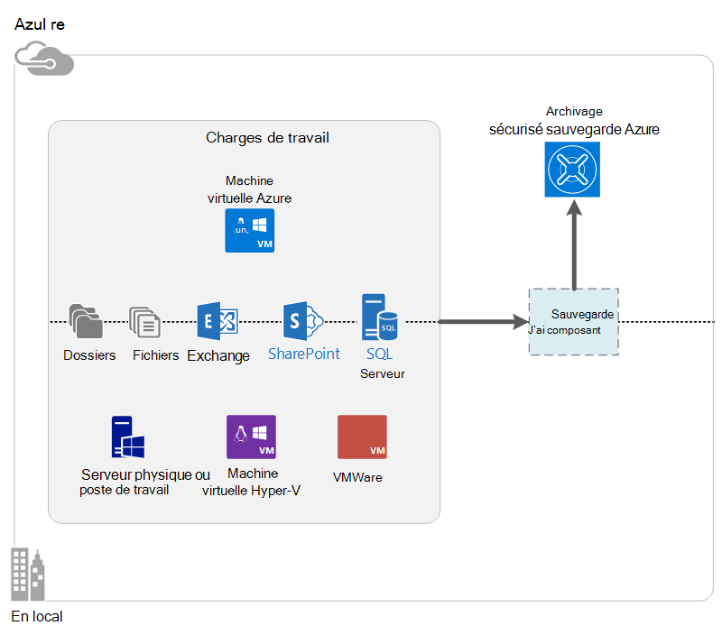

<properties
    pageTitle="Quelle est la sauvegarde Azure ? | Microsoft Azure"
    description="À l’aide de Azure Services de sauvegarde et restauration, vous pouvez sauvegarder et restaurer des données et des applications à partir de Windows serveurs, ordinateurs clients Windows, serveurs System Center DPM et Azure machines virtuelles."
    services="backup"
    documentationCenter=""
    authors="markgalioto"
    manager="cfreeman"
    editor="tysonn"
    keywords="sauvegarder et restaurer ; services de récupération ; solutions de sauvegarde"/>

<tags
    ms.service="backup"
    ms.workload="storage-backup-recovery"
    ms.tgt_pltfrm="na"
    ms.devlang="na"
    ms.topic="get-started-article"
    ms.date="10/19/2016"
    ms.author="jimpark; trinadhk"/>

# Quelle est la sauvegarde Azure ?
Sauvegarde Azure est le service que vous utilisez pour sauvegarder et restaurer vos données dans le cloud Microsoft. Cette action remplace vos locaux existant ou votre solution de sauvegarde hors site avec une solution sur le nuage est fiable, sécurisé et coût à la concurrence. Il permet également de protéger les ressources qui s’exécutent dans le cloud. Sauvegarde Azure fournit des services de récupération basés sur une infrastructure mondiale scalable, résistant et hautement disponible.

[Regarder une vidéo de présentation de la sauvegarde Azure](https://azure.microsoft.com/documentation/videos/what-is-azure-backup/)

## Pourquoi utiliser la sauvegarde Azure ?
Solutions de sauvegarde classiques ont évolué pour que le cloud comme un point de terminaison similaire aux disques ou bandes. Cette approche est simple, il est également limité. Il ne prend pas pleinement parti d’une plateforme cloud sous-jacente et se traduit par une solution inefficace et coûteuse.
En revanche, Azure sauvegarde offre tous les avantages d’une solution de sauvegarde cloud puissante et économique. Voici quelques-uns des principaux avantages fournissant Azure sauvegarde.

| Fonctionnalité | Avantage |
| ------- | ------- |
| Gestion du stockage automatique | Aucune dépense majuscule n’est nécessaire pour les périphériques de stockage en local. Sauvegarde Azure affecte automatiquement et gère le stockage de sauvegarde, et qu’il utilise un modèle de consommation de paie comme-vous à l’emploi. |
| Mise à l’échelle illimité | Tirer parti des garanties de disponibilité sans les frais de maintenance et de contrôle. Sauvegarde Azure utilise la power sous-jacentes et les proportions du cloud Azure, grâce à ses fonctions autoscaling intrusives. |
| Plusieurs options de stockage | Choisissez votre stockage de sauvegarde en fonction des besoins :<li>Un blob de bloc de stockage localement redondants est idéal pour les clients soucieux de prix, et il est toujours utile de protéger vos données contre les défaillances matérielles local. <li>Un blob de bloc de stockage geo réplication fournit trois plus de copies dans un centre de données apparié. Ces copies supplémentaires vous assurer que vos données de sauvegarde soient hautement disponibles même en cas d’un incident au niveau du site Azure. |
| Transfert de données illimité | Il est gratuit pour les transferts de données (sortant) de sortie pendant une opération de restauration de l’archivage sécurisé sauvegarde. Données entrant dans Azure est également gratuit. Fonctionne avec le service d’importation où il est disponible. |
| Chiffrement des données | Permet de chiffrement des données pour sécuriser la transmission et le stockage des données client dans le cloud public. Le mot de passe de chiffrement est stockée dans la source, et il n’est jamais transmise ou stockée dans Azure. La clé de chiffrement est nécessaire pour restaurer les données, et que le client a un accès intégral aux données dans le service. |  
| Sauvegarde cohérente à l’application | Sauvegardes cohérentes avec les applications sur Windows permettent de garantir que les correctifs ne sont pas nécessaires au moment de la restauration, qui permet de réduire l’objectif de temps de récupération. Cela permet aux clients revenir à un état en cours d’exécution plus rapidement. |
| Rétention à long terme | Au lieu de salaire pour les solutions de sauvegarde sur bande hors site, clients peut effectuer des sauvegardes Azure, qui fournit une solution en forme de bande attrayante à un faible coût. |

## Composants de sauvegarde Azure
Étant donné que la sauvegarde est une solution de sauvegarde hybride, il se compose de plusieurs composants travailler ensemble pour activer la sauvegarde de bout en bout et restaurer des flux de travail.

### Scénarios de déploiement

| Composant | Peut être déployée dans Azure ? | Peut être déployé en local ? | Stockage cible pris en charge|
| --- | --- | --- | --- |
| Agent de sauvegarde Azure | 
**Oui**
 
L’agent de sauvegarde Azure peut être déployé sur n’importe quel ordinateur Windows serveur virtuel qui s’exécute dans Azure.
 | 
**Oui**
 
L’agent de sauvegarde peut être déployé sur une machine virtuelle Windows Server ou machine physique.
 | 
Archivage sécurisé sauvegarde Azure
 |
| System Center Data Protection Manager (DPM) | 
**Oui**

En savoir plus sur [la protection de charges de travail dans Azure à l’aide de System Center DPM](http://blogs.technet.com/b/dpm/archive/2014/09/02/azure-iaas-workload-protection-using-data-protection-manager.aspx).
 | 
**Oui**
 
En savoir plus sur [la protection de charges de travail et des ordinateurs virtuels dans votre centre de données](https://technet.microsoft.com/library/hh758173.aspx).
 | 
Disque connecté localement,
 
Archivage sécurisé sauvegarde Azure,
 
bande (en local uniquement)
 |
| Serveur de sauvegarde Azure | 
**Oui**

En savoir plus sur [la protection de charges de travail dans Azure à l’aide de serveur de sauvegarde Azure](backup-azure-microsoft-azure-backup.md).
 | 
**Oui**
 
En savoir plus sur [la protection de charges de travail dans Azure à l’aide de serveur de sauvegarde Azure](backup-azure-microsoft-azure-backup.md).
 | 
Disque connecté localement,
 
Archivage sécurisé sauvegarde Azure
 |
| Sauvegarde Azure (extension machine virtuelle) | 
**Oui**

Partie de tissu Azure

Spécialisées pour la [sauvegarde de Azure infrastructure comme un machines virtuelles service (IaaS)](backup-azure-vms-introduction.md).
 | 
**N°**
 
Utiliser System Center DPM pour sauvegarder des machines virtuelles dans votre centre de données.
 | 
Archivage sécurisé sauvegarde Azure
 |

### Limitations et avantages au niveau du composant

| Composant | Avantages | Limitations | Précision récupération |
| --- | --- | --- | --- |
| Agent de sauvegarde (MARS) Azure | <li>Pouvez sauvegarder les fichiers et dossiers sur un ordinateur de système d’exploitation Windows, qu’il s’agisse physique ou virtuel (machines virtuelles se situer locaux ou Azure)<li>Aucun serveur de sauvegarde distinct requis<li>Utilise l’archivage sécurisé sauvegarde Azure | <li>Restaurer des trois fois un fichier de sauvegarde/niveau day<li>Restauration de niveau fichier/dossier/volume uniquement, non de l’application prenant en charge<li>Aucune prise en charge pour Linux | fichiers/dossiers/volumes |
| System Center Data Protection Manager | <li>Instantanés prenant en charge l’application (VSS)<li>Flexibilité totale pour laquelle effectuer des sauvegardes<li>Précision récupération (tous)<li>Permet l’archivage sécurisé sauvegarde Azure<li>Prise en charge Linux (s’il est hébergé sur Hyper-V) | <li>Absence de prise en charge hétérogène (VMware machine virtuelle sauvegarder, la charge de travail Oracle sauvegarder).  | fichiers/dossiers/volumes / Machines virtuelles/applications |
| Serveur de sauvegarde de Microsoft Azure | <li>Instantanés prenant en charge l’application (VSS)<li>Flexibilité totale pour laquelle effectuer des sauvegardes<li>Précision récupération (tous)<li>Permet l’archivage sécurisé sauvegarde Azure<li>Prise en charge Linux (s’il est hébergé sur Hyper-V)<li>Ne nécessite pas de licence de System Center | <li>Absence de prise en charge hétérogène (VMware machine virtuelle sauvegarder, la charge de travail Oracle sauvegarder).<li>Toujours nécessite l’abonnement Azure<li>Aucune prise en charge pour la sauvegarde de bande | fichiers/dossiers/volumes / Machines virtuelles/applications |
| Sauvegarde machine virtuelle IaaS Azure | <li>Sauvegardes natives pour Windows/Linux<li>Aucune installation agent spécifique<li>Sauvegarde TISSU sans infrastructure sauvegarde nécessité | <li>Une fois par jour précédent haut/disque restauration de niveau<li>Impossible de sauvegarder des locaux | Machines virtuelles Tous les disques (à l’aide de PowerShell) |

## Les applications et les charges de travail peuvent être sauvegardées ?

| Charge de travail | Machine source | Solution de sauvegarde Azure |
| --- | --- |---|
| Fichiers et dossiers | Windows Server | 
[Agent de sauvegarde azure](backup-configure-vault.md),
 
[Centre de système DPM](backup-azure-dpm-introduction.md) (+ l’agent de sauvegarde Azure),
 
[Serveur de sauvegarde Azure](backup-azure-microsoft-azure-backup.md) (y compris l’agent de sauvegarde Azure)
  |
| Fichiers et dossiers | Client Windows | 
[Agent de sauvegarde azure](backup-configure-vault.md),
 
[Centre de système DPM](backup-azure-dpm-introduction.md) (+ l’agent de sauvegarde Azure),
 
[Serveur de sauvegarde Azure](backup-azure-microsoft-azure-backup.md) (y compris l’agent de sauvegarde Azure)
  |
| Machine virtuelle Hyper-V (Windows) | Windows Server | 
[Centre de système DPM](backup-azure-backup-sql.md) (+ l’agent de sauvegarde Azure),
 
[Serveur de sauvegarde Azure](backup-azure-microsoft-azure-backup.md) (y compris l’agent de sauvegarde Azure)
 |
| Machine virtuelle Hyper-V (Linux) | Windows Server | 
[Centre de système DPM](backup-azure-backup-sql.md) (+ l’agent de sauvegarde Azure),
 
[Serveur de sauvegarde Azure](backup-azure-microsoft-azure-backup.md) (y compris l’agent de sauvegarde Azure)
  |
| Microsoft SQL Server | Windows Server | 
[Centre de système DPM](backup-azure-backup-sql.md) (+ l’agent de sauvegarde Azure),
 
[Serveur de sauvegarde Azure](backup-azure-microsoft-azure-backup.md) (y compris l’agent de sauvegarde Azure)
  |
| Microsoft SharePoint | Windows Server | 
[Centre de système DPM](backup-azure-backup-sql.md) (+ l’agent de sauvegarde Azure),
 
[Serveur de sauvegarde Azure](backup-azure-microsoft-azure-backup.md) (y compris l’agent de sauvegarde Azure)
   |
| Microsoft Exchange |  Windows Server | 
[Centre de système DPM](backup-azure-backup-sql.md) (+ l’agent de sauvegarde Azure),
 
[Serveur de sauvegarde Azure](backup-azure-microsoft-azure-backup.md) (y compris l’agent de sauvegarde Azure)
   |
| Machines virtuelles IaaS Azure (Windows) | - | [Sauvegarde Azure (extension machine virtuelle)](backup-azure-vms-introduction.md) |
| Machines virtuelles IaaS Azure (Linux) | - | [Sauvegarde Azure (extension machine virtuelle)](backup-azure-vms-introduction.md) |

## Prise en charge processeur et Linux

| Composant | Prise en charge du processeur | Linux (Azure approuvée) prise en charge |
| --- | --- | --- |
| Agent de sauvegarde (MARS) Azure | Oui | Aucune (agent uniquement sur Windows) |
| System Center Data Protection Manager | Oui (Agent d’invité) | Uniquement les sauvegarde uniquement fichier cohérentes Hyper-V (pas Azure machine virtuelle) sont possible |
| Serveur de sauvegarde Azure (MABS) | Oui (Agent d’invité) | Une seule sauvegarde uniquement fichier cohérentes Hyper-V (pas Azure machine virtuelle) est possible (identique au DPM) |
| Sauvegarde machine virtuelle IaaS Azure | Oui | Oui |

[AZURE.INCLUDE [learn-about-deployment-models](../../includes/learn-about-deployment-models-include.md)]

## Sauvegarder et restaurer des machines virtuelles stockage Premium

Le service de sauvegarde Azure protège à présent les machines virtuelles stockage Premium.

### Sauvegarder des machines virtuelles stockage Premium

Lors de la sauvegarde des machines virtuelles stockage Premium, le service de sauvegarde crée un emplacement intermédiaire temporaire dans le compte de stockage Premium. L’emplacement intermédiaire, nommé « AzureBackup- » est égale à la taille totale des données des disques premium liés à la machine virtuelle.

>[AZURE.NOTE] Ne modifiez pas ou modifier l’emplacement de dossier intermédiaire.

Une fois que le travail de sauvegarde se termine, l’emplacement intermédiaire est supprimé. Le prix de stockage utilisé pour l’emplacement intermédiaire est cohérent avec tous les [tarifs de stockage Premium](../storage/storage-premium-storage.md#pricing-and-billing).

### Restaurer des machines virtuelles stockage Premium

Machine virtuelle stockage Premium peut être restauré soit stockage Premium ou stockage normal. La restauration d’un point de récupération Premium stockage mémoire virtuelle au stockage Premium est le processus classique de restauration. Toutefois, il peut être rentable pour restaurer un point de récupération Premium stockage mémoire virtuelle stockage standard. Ce type de restauration peut être utilisé si vous avez besoin d’un sous-ensemble des fichiers à partir de la machine virtuelle.

## Fonctionnalités
Ces cinq tableaux synthétiser les fonctionnalités de la sauvegarde est géré dans chaque composant.

### Espace de stockage

| Fonctionnalité | Agent de sauvegarde Azure | Centre de système DPM | Serveur de sauvegarde Azure | Sauvegarde Azure (extension machine virtuelle) |
| ------- | --- | --- | --- | ---- |
| Archivage sécurisé sauvegarde Azure | ![Oui][green] | ![Oui][green] | ![Oui][green] | ![Oui][green] |
| Stockage sur disque | | ![Oui][green] | ![Oui][green] |  |
| Stockage sur bande | | ![Oui][green] |  | |
| Compression (dans l’archivage sécurisé sauvegarde) | ![Oui][green] | ![Oui][green]| ![Oui][green] | |
| Incrémentiel | ![Oui][green] | ![Oui][green] | ![Oui][green] | ![Oui][green] |
| Déduplication de disque | | ![Partiellement][yellow] | ![Partiellement][yellow]| | |

L’archivage sécurisé sauvegarde est la cible de stockage par défaut entre tous les composants. System Center DPM et serveur de sauvegarde offrent également la possibilité d’avoir une copie de disque local. Toutefois, System Center DPM fournit l’option pour écrire des données dans un lecteur de bande.

#### Incrémentiel
Chaque composant prend en charge incrémentiel quel que soit le stockage cible (disque, bandes, l’archivage sécurisé sauvegarde). Incrémentiel garantit que les sauvegardes sont temps efficace et le stockage de transférer uniquement les modifications apportées depuis la dernière sauvegarde.

#### Compression
Effectuer des sauvegardes régulières sont compressées pour réduire l’espace de stockage requis. Le seul composant qui n’utilise pas de compression est l’extension de la mémoire virtuelle. Avec l’extension de la mémoire virtuelle, toutes les données de sauvegarde est copiée à partir du compte de stockage client dans l’archivage sécurisé sauvegarde dans la même région sans le compresser. Alors qu’accédant sans compression légèrement augmente l’espace de stockage utilisé, stocker les données sans compression permet de temps de restauration plus rapides.

#### Déduplication
Déduplication est prise en charge System Center DPM et serveur de sauvegarde lorsqu’elle est [déployée dans une machine virtuelle Hyper-V](http://blogs.technet.com/b/dpm/archive/2015/01/06/deduplication-of-dpm-storage-reduce-dpm-storage-consumption.aspx). Déduplication est effectuée au niveau de l’hôte à l’aide de déduplication Windows Server sur virtuels disques durs (disques durs virtuels) qui sont joints à la machine virtuelle sous forme de stockage de sauvegarde.

>[AZURE.WARNING] Déduplication n’est pas disponible dans Azure pour tous les composants de sauvegarde. Lors du déploiement de System Center DPM et serveur de sauvegarde dans Azure, les disques de stockage de la machine virtuelle ne peut pas être deduplicated.

### Sécurité

| Fonctionnalité | Agent de sauvegarde Azure | Centre de système DPM | Serveur de sauvegarde Azure | Sauvegarde Azure (extension machine virtuelle) |
| ------- | --- | --- | --- | ---- |
| Sécurité réseau (pour Azure) | ![Oui][green] |![Oui][green] | ![Oui][green] | ![Partiellement][yellow]|
| Sécurité des données (dans Azure) | ![Oui][green] |![Oui][green] | ![Oui][green] | ![Partiellement][yellow]|

Tout le trafic de sauvegarde à partir de vos serveurs à l’archivage sécurisé sauvegarde est chiffré à l’aide de 256 Standard chiffrement avancées. Les données sont envoyées sur un lien HTTPS sécurisé. Les données de sauvegarde sont également stockées dans l’archivage sécurisé de sauvegarde dans un format chiffré. Le client uniquement conserve le mot de passe pour la déverrouiller ces données. Microsoft ne peut pas déchiffrer les données de sauvegarde à tout moment.

>[AZURE.WARNING] La clé utilisée pour chiffrer les données de sauvegarde est présente uniquement avec le client. Microsoft ne conserve pas une copie dans Azure et n’a pas accès à la clé. Si la clé est déplacée, Microsoft ne peut pas récupérer les données de sauvegarde.

Sauvegarde des machines virtuelles Azure requiert la configuration de chiffrement *au sein de* la machine virtuelle. Utiliser BitLocker sur machines virtuelles Windows et **dm crypt** sur des machines virtuelles Linux. Sauvegarde Azure ne chiffre pas automatiquement les données de sauvegarde qui est fourni par le biais ce chemin d’accès.

### Pris en charge les charges de travail

| Fonctionnalité | Agent de sauvegarde Azure | Centre de système DPM | Serveur de sauvegarde Azure | Sauvegarde Azure (extension machine virtuelle) |
| ------- | --- | --- | --- | ---- |
| Ordinateur Windows Server--fichiers et dossiers | ![Oui][green] | ![Oui][green] | ![Oui][green] | |
| Ordinateur client de Windows, fichiers et dossiers | ![Oui][green] | ![Oui][green] | ![Oui][green] | |
| Machine virtuelle Hyper-V (Windows) | | ![Oui][green] | ![Oui][green] | |
| Machine virtuelle Hyper-V (Linux) | | ![Oui][green] | ![Oui][green] | |
| Microsoft SQL Server | | ![Oui][green] | ![Oui][green] | |
| Microsoft SharePoint | | ![Oui][green] | ![Oui][green] | |
| Microsoft Exchange  | | ![Oui][green] | ![Oui][green] | |
| Machine virtuelle Azure (Windows) | | | | ![Oui][green] |
| Machine virtuelle Azure (Linux) | | | | ![Oui][green] |

### Réseau

| Fonctionnalité | Agent de sauvegarde Azure | Centre de système DPM | Serveur de sauvegarde Azure | Sauvegarde Azure (extension machine virtuelle) |
| ------- | --- | --- | --- | ---- |
| Compression de réseau (sur le serveur de sauvegarde) | | ![Oui][green] | ![Oui][green] | |
| Compression de réseau (pour l’archivage sécurisé sauvegarde) | ![Oui][green] | ![Oui][green] | ![Oui][green] | |
| Protocole réseau (pour le serveur de sauvegarde) | | TCP | TCP | |
| Protocole réseau (à l’archivage sécurisé sauvegarde) | HTTPS | HTTPS | HTTPS | HTTPS |

Étant donné que l’extension machine virtuelle lit les données directement à partir du compte de stockage Azure via le réseau de stockage, il n’est pas nécessaire d’optimiser ce trafic. Le trafic est sur le réseau de stockage local du centre de données Azure, il est peu nécessaire compression en raison de problèmes de bande passante.

Si vous sauvegardez vos données sur un serveur de sauvegarde (DPM ou serveur de sauvegarde), le trafic du serveur principal au serveur de sauvegarde peut être compressé pour enregistrer la bande passante.

#### Limitation de réseau
L’agent de sauvegarde Azure permet la limitation, qui permet de contrôler l’utilisation de la bande passante réseau lors du transfert de données. La limitation peut être utile si vous avez besoin sauvegarder les données lors de heures de travail, mais ne souhaitez pas que le processus de sauvegarde interférer avec d’autres le trafic internet. La limitation pour les données de transfert s’applique pour sauvegarder et restaurer des activités.

### Sauvegarde et la rétention

|  | Agent de sauvegarde Azure | Centre de système DPM | Serveur de sauvegarde Azure | Sauvegarde Azure (extension machine virtuelle) |
| --- | --- | --- | --- | --- |
| Fréquence de sauvegarde (à l’archivage sécurisé sauvegarde) | Trois sauvegardes par jour | Deux sauvegardes par jour |Deux sauvegardes par jour | Une sauvegarde par jour |
| Fréquence de sauvegarde (sur disque) | Non applicable | 
Toutes les 15 minutes pour SQL Server
 
Toutes les heures pour les autres charges de travail
 | 
Toutes les 15 minutes pour SQL Server
 
Toutes les heures pour les autres charges de travail
 |Non applicable |
| Options de rétention | Quotidienne, hebdomadaire, mensuelle, annuelle | Quotidienne, hebdomadaire, mensuelle, annuelle | Quotidienne, hebdomadaire, mensuelle, annuelle |Quotidienne, hebdomadaire, mensuelle, annuelle |
| Période de rétention | Jusqu'à 99 ans | Jusqu'à 99 ans | Jusqu'à 99 ans | Jusqu'à 99 ans |
| Points de récupération de l’archivage sécurisé sauvegarde | Illimité | Illimité | Illimité | Illimité |
| Points de récupération sur disque local | Non applicable | 64 pour les serveurs de fichiers  448 serveurs d’applications | 64 pour les serveurs de fichiers  448 serveurs d’applications |Non applicable |
| Points de récupération sur bande | Non applicable | Illimité | Non applicable | Non applicable |

## Quel est le fichier d’informations d’identification de l’archivage sécurisé ?

Le fichier d’informations d’identification de l’archivage sécurisé est un certificat généré par le portail pour chaque l’archivage sécurisé sauvegarde. Le portail télécharge puis la clé publique à Access Control Service (ACS). La clé privée est fournie à l’utilisateur lorsque vous téléchargez les informations d’identification et ensuite entrée lors de l’enregistrement automatique. La clé privée authentifie l’ordinateur pour envoyer des données de sauvegarde à un archivage sécurisé identifié dans le service de sauvegarde Azure.

Les informations d’identification de l’archivage sécurisé sont utilisée uniquement pendant le flux de travail d’inscription. Il est vous assurer que le fichier d’informations d’identification de l’archivage sécurisé n’est pas compromis. S’il se trouve dans les mains d’un utilisateur non fiables, le fichier d’informations d’identification de l’archivage sécurisé peut servir à enregistrer des autres ordinateurs contre l’archivage sécurisé même. Toutefois, étant donné que les données de sauvegarde sont chiffrées à l’aide d’un mot de passe appartenant uniquement au client, données de sauvegarde existantes ne peuvent pas être compromises. Pour atténuer ce problème, les informations d’identification de l’archivage sécurisé sont configurées pour expirer 48 heures. Pendant que vous pouvez télécharger les informations d’identification de l’archivage sécurisé d’une sauvegarde vault n’importe quel nombre de fois, uniquement le fichier le plus récent est applicable pendant le flux de travail d’inscription.

## En quoi diffère Azure sauvegarde récupération de Site Azure ?
De nombreux clients confondez récupération de sauvegarde et de récupération d’urgence. Les deux capturent des données et de fournir une sémantique restaurer, mais leurs atouts core sont différents.

Azure sauvegarde des données en local et dans le cloud. Récupération de Site Azure coordonnées retour arrière, le basculement et la réplication des machines virtuelles et serveur physique. Les deux services sont importants parce que votre solution de récupération d’urgence doit protéger vos données et récupérables (sauvegarde) *et* conserver vos charges de travail disponibles (récupération de Site) lorsque des défaillances se produisent.

Les concepts suivants vous aident à prendre des décisions importantes autour de sauvegarde et restauration.

| Concept | Plus d’informations | Sauvegarde | Reprise (DR) |
| ------- | ------- | ------ | ----------------- |
| Récupération objectifs de point) | La quantité de perte de données acceptable si une récupération doit être effectuée. | Solutions de sauvegarde ont variabilité large dans leur RPO acceptable. Machine virtuelle sauvegardes disposent généralement d’un RPO d’un jour, tandis que les sauvegardes de base de données ont RPO jusqu'à 15 minutes. | Solutions de reprise ont RPO faible. La copie DR peut être derrière en quelques secondes ou en quelques minutes. |
| Objectif de temps de récupération (RTO) | La durée nécessaire pour achever la restauration ou restaurer. | En raison de la plus grande RPO, la quantité de données nécessitant une solution de sauvegarde à traiter est généralement beaucoup plus élevée, qui permet d’accéder à plus de temps RTO. Par exemple, il peut prendre jours pour restaurer les données à partir de bandes, selon le temps que nécessaire pour transporter la bande depuis un emplacement hors site. | Solutions de reprise ont RTO plus petits, car ils ne sont plus synchronisés avec la source. Moins de modifications doivent être traités. |
| Rétention | La durée pendant laquelle les données doivent être stockées | Pour les scénarios qui requièrent reprise (Échec du système d’exploitation, suppression des fichiers par inadvertance, altération des données), les données de sauvegarde sont généralement conservées pendant 30 jours ou moins. Du point de vue de la conformité, données doit être stockée pour mois, voire des années. Données de sauvegarde sont idéale pour l’archivage dans ce cas. | Récupération d’urgence doit uniquement les données de restauration opérationnelle, qui prend généralement quelques heures, voire un jour. En raison de la capture des données affinés utilisée dans les solutions DR, à l’aide de données DR pour la rétention à long terme n’est pas recommandé. |

## Étapes suivantes

Essayer une sauvegarde Azure simple. Pour plus d’informations, voir un de ces didacticiels :

- [Essayez de sauvegarde Azure](backup-try-azure-backup-in-10-mins.md)
- [Essayez d’effectuer de sauvegarde machine virtuelle Azure](backup-azure-vms-first-look.md)

Étant donné que ces didacticiels vous aident à sauvegarder rapidement, qu’ils apparaissent uniquement le chemin d’accès plus directe pour sauvegarder vos données. Pour plus d’informations sur le type de sauvegarde que vous voulez faire, voir :

- [Sauvegarder la machine Windows](backup-configure-vault.md)
- [Sauvegarder des charges de travail](backup-azure-microsoft-azure-backup.md)
- [Machines virtuelles sauvegarde IaaS Azure](backup-azure-vms-prepare.md)

[green]: ./media/backup-introduction-to-azure-backup/green.png
[yellow]: ./media/backup-introduction-to-azure-backup/yellow.png
[red]: ./media/backup-introduction-to-azure-backup/red.png
