<properties
   pageTitle="Apprenez à sauvegarder les fichiers et dossiers à partir de Windows Azure avec sauvegarde Azure en utilisant le modèle de déploiement du Gestionnaire de ressources | Microsoft Azure"
   description="Découvrez comment faire pour sauvegarder des données de Windows Server en créant un archivage sécurisé, installation de l’agent de Services de récupération et en sauvegardant vos fichiers et dossiers dans Azure."
   services="backup"
   documentationCenter=""
   authors="markgalioto"
   manager="cfreeman"
   editor=""
   keywords="Comment faire pour sauvegarder ; Comment faire pour sauvegarder"/>

<tags
   ms.service="backup"
   ms.workload="storage-backup-recovery"
   ms.tgt_pltfrm="na"
   ms.devlang="na"
   ms.topic="hero-article"
   ms.date="09/27/2016"
   ms.author="markgal;"/>

# Tout d’abord rechercher : sauvegarder des fichiers et dossiers avec la sauvegarde Azure en utilisant le modèle de déploiement du Gestionnaire de ressources

Cet article explique comment faire pour sauvegarder votre Windows Server (ou client Windows) fichiers et dossiers vers Azure avec sauvegarde Azure à l’aide du Gestionnaire de ressources. Il s’agit d’un didacticiel destiné à vous guident dans les notions de base. Si vous voulez commencer à utiliser sauvegarde Azure, vous êtes au bon endroit.

Si vous voulez en savoir plus sur sauvegarde Azure, lisez cette [vue d’ensemble](backup-introduction-to-azure-backup.md).

Sauvegarde des fichiers et dossiers sur Azure nécessite ces activités :

 souscrire à un abonnement Azure (si vous n’avez pas encore). 
 créer un archivage sécurisé aux Services de récupération. 
 télécharger les fichiers nécessaires. 
 installation et Registre l’agent de Services de récupération. 
 sauvegarder vos fichiers et dossiers.

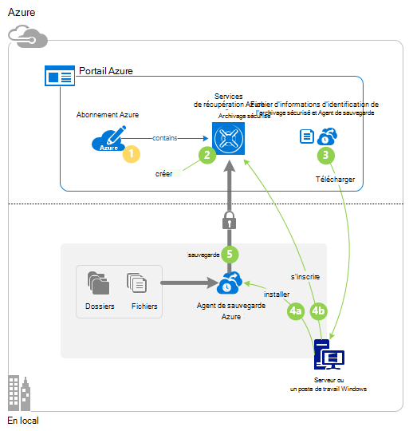

## Étape 1 : Obtenir un abonnement Azure

Si vous n’avez un abonnement Azure, créez un [compte gratuit](https://azure.microsoft.com/free/) qui vous permet d’accéder à n’importe quel service Azure.

## Étape 2 : Créer un archivage sécurisé aux Services de récupération

Pour sauvegarder vos fichiers et dossiers, vous devez créer un archivage sécurisé aux Services de récupération dans la région dans lequel vous voulez stocker les données. Vous devez également déterminer comment vous souhaitez que votre stockage répliquée.

### Pour créer une récupération Services l’archivage sécurisé

1. Si vous n’avez pas déjà fait, connectez-vous au [Portail Azure](https://portal.azure.com/) à l’aide de votre abonnement Azure.

2. Dans le menu concentrateur, cliquez sur **Parcourir** et dans la liste des ressources, tapez **Les Services de récupération** et cliquez sur **Services de récupération de chambres fortes**.

    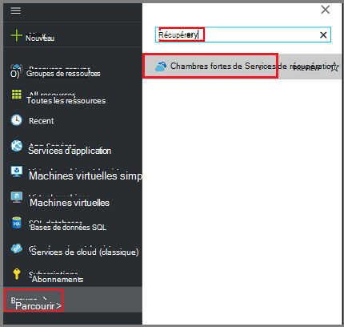  

3. Dans le menu **chambres fortes Services de récupération** , cliquez sur **Ajouter**.

    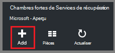

    La carte de l’archivage sécurisé aux Services de récupération s’ouvre et vous invite à fournir un **nom**, un **abonnement**, un **groupe de ressources**et un **emplacement**.

    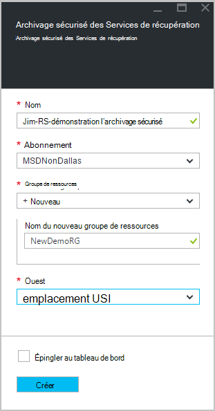

4. Pour **nom**, entrez un nom convivial pour identifier l’archivage sécurisé.

5. Cliquez sur l' **abonnement** pour afficher la liste des abonnements disponibles.

6. Cliquez sur **groupe de ressources** pour afficher la liste des groupes de ressources disponibles, ou cliquez sur **Nouveau** pour créer un nouveau groupe de ressources.

7. Cliquez sur l' **emplacement** pour sélectionner la zone géographique pour l’archivage sécurisé. Ce choix détermine la région géographique où vos données de sauvegarde sont envoyées.

8. Cliquez sur **créer**.

    Si vous ne voyez pas votre l’archivage sécurisé répertorié après que qu’elle a été terminée, cliquez sur **Actualiser**. Lors de l’actualisation de la liste, cliquez sur le nom de l’archivage sécurisé.

### Pour déterminer redondance du stockage
Lorsque vous créez un archivage sécurisé aux Services de récupération vous déterminez comment stockage est répliqué.

1. Cliquez sur l’archivage sécurisé nouveau pour ouvrir le tableau de bord.

2. Dans la carte de **paramètres** qui s’ouvre automatiquement avec votre tableau de bord de l’archivage sécurisé, cliquez sur **Infrastructure de sauvegarde**.

3. Dans la carte de l’Infrastructure de sauvegarde, cliquez sur la **Configuration de sauvegarde** pour afficher le **type de réplication de stockage**.

    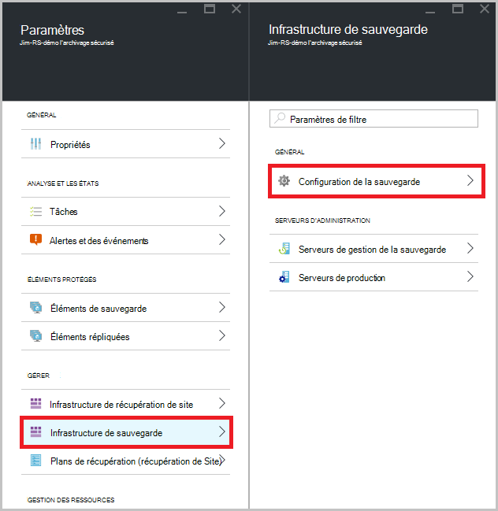

4. Choisissez l’option de réplication de stockage approprié pour vos l’archivage sécurisé.

    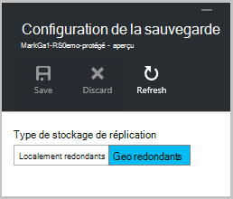

    Par défaut, votre l’archivage sécurisé comprend un stockage geo redondants. Si vous utilisez Azure comme point de terminaison stockage sauvegarde principal, continuez à l’aide de stockage geo redondants. Si vous utilisez Azure comme un point de terminaison de stockage de sauvegarde non primaire, puis choisissez stockage localement redondant, ce qui permet de réduire les frais de stockage des données dans Azure. En savoir plus sur [geo redondants](../storage/storage-redundancy.md#geo-redundant-storage) et les options de stockage [localement redondantes](../storage/storage-redundancy.md#locally-redundant-storage) dans cette [vue d’ensemble](../storage/storage-redundancy.md).

À présent que vous avez créé un archivage sécurisé, vous préparez votre infrastructure pour sauvegarder des fichiers et dossiers en téléchargeant les informations d’identification Microsoft Azure récupération Services agent et l’archivage sécurisé.

## Étape 3 : télécharger des fichiers

1. Cliquez sur **paramètres** dans le tableau de bord de l’archivage sécurisé de Services de récupération.

    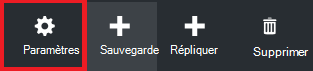

2. Cliquez sur **mise en route > sauvegarde** sur la carte de paramètres.

    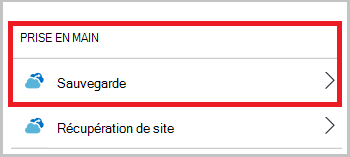

3. Cliquez sur **objectif de sauvegarde** dans la carte de sauvegarde.

    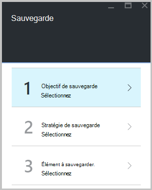

4. Sélectionnez **local** à partir de la page où est votre charge de travail en cours d’exécution ? menu.

5. Sélectionnez les **fichiers et dossiers** dans le que voulez-vous sauvegarder ? menu, puis cliquez sur **OK**.

### Téléchargez l’agent de Services de récupération

1. Cliquez sur **Télécharger l’Agent de Windows Server ou Client Windows** dans la carte de **préparer infrastructure** .

    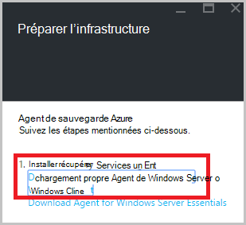

2. Dans la fenêtre contextuelle de téléchargement, cliquez sur **Enregistrer** . Par défaut, le fichier **MARSagentinstaller.exe** est enregistré dans votre dossier Téléchargements.

### Télécharger des informations d’identification de l’archivage sécurisé

1. Cliquez sur **Télécharger > Enregistrer** sur la carte d’infrastructure préparer.

    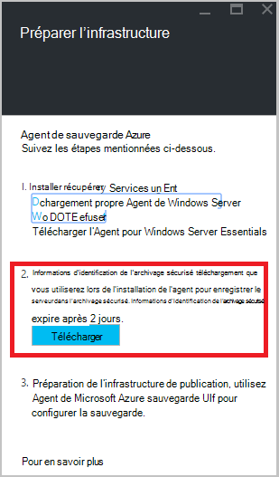

## Étape 4 : installer et inscrire l’agent

>[AZURE.NOTE] L’activation de sauvegarde via le portail Azure sera bientôt disponible. Pour le moment, vous utilisez l’Agent de Services Microsoft Azure récupération en local pour sauvegarder vos fichiers et dossiers.

1. Recherchez et double-cliquez sur **MARSagentinstaller.exe** dans le dossier Téléchargements (ou un autre emplacement enregistré).

2. Exécutez l’Assistant Configuration de Microsoft Azure récupération Services Agent. Pour terminer l’Assistant, vous devez :

    - Choisissez un emplacement pour l’installation et le dossier cache.
    - Si vous utilisez un serveur proxy pour vous connecter à internet, fournissent votre proxy informations du serveur.
    - Fournir aux utilisateurs plus nom et mot de passe si vous utilisez un proxy authentifié.
    - Fournir les informations d’identification de l’archivage sécurisé téléchargé
    - Enregistrer le mot de passe de chiffrement dans un emplacement sécurisé.

    >[AZURE.NOTE] Si vous perdez ou oubliez le mot de passe, Microsoft ne peut pas vous aider à récupérer les données de sauvegarde. Enregistrez le fichier dans un emplacement sécurisé. Il est nécessaire de restaurer une sauvegarde.

L’agent est installé et votre ordinateur est enregistrée dans l’archivage sécurisé. Vous êtes prêt à configurer et planifier votre sauvegarde.

## Étape 5 : Sauvegarder vos fichiers et dossiers

La sauvegarde initiale inclut deux tâches clés :

- Planifier la sauvegarde
- Sauvegarder des fichiers et dossiers pour la première fois

Pour terminer la sauvegarde initiale, vous utilisez l’agent de Services de récupération de Microsoft Azure.

### Pour planifier la sauvegarde

1. Ouvrez l’agent de Services de récupération de Microsoft Azure. Vous pouvez trouver en recherchant votre ordinateur **Microsoft Azure sauvegarde**.

    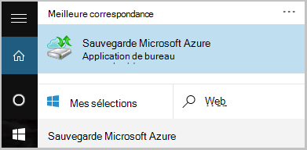

2. Dans l’agent de Services de récupération, cliquez sur **Planifier la sauvegarde**.

    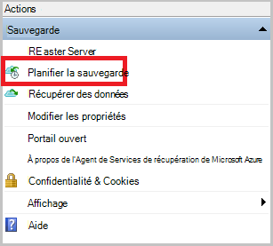

3. Dans la page prise en main de l’Assistant Planification de sauvegarde, cliquez sur **suivant**.

4. Dans les éléments sélectionnez page de sauvegarde, cliquez sur **Ajouter des éléments**.

5. Sélectionnez les fichiers et dossiers que vous souhaitez sauvegarder, puis cliquez sur **OK**.

6. Cliquez sur **suivant**.

7. Dans la page **Spécifier la planification de sauvegarde** , spécifiez la **planification de la sauvegarde** , puis cliquez sur **suivant**.

    Vous pouvez planifier quotidiennement (au taux maximal de trois fois par jour) ou sauvegardes hebdomadaires.

    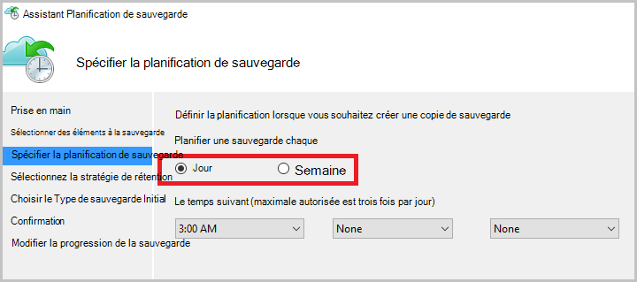

    >[AZURE.NOTE] Pour plus d’informations sur la spécification de la planification de sauvegarde, voir l’article [Utiliser Azure sauvegarde à remplacer votre infrastructure de bandes](backup-azure-backup-cloud-as-tape.md).

8. Dans la page **Sélectionner une stratégie de rétention** , sélectionnez la **Stratégie de rétention** pour la copie de sauvegarde.

    La stratégie de rétention indique la durée pendant laquelle la sauvegarde est stockée. Au lieu de simplement spécifier une stratégie « plate » pour tous les points de sauvegarde, vous pouvez spécifier d’autres stratégies de rétention basée sur lorsque la sauvegarde a lieu. Vous pouvez modifier les stratégies de rétention quotidienne, hebdomadaire, mensuel et annuel selon vos besoins.

9. Dans la page Choisir un Type de sauvegarde Initial, choisissez le type de sauvegarde initial. Assurez-vous que l’option **automatiquement sur le réseau** sélectionné, puis cliquez sur **suivant**.

    Vous pouvez sauvegarder automatiquement sur le réseau, ou vous pouvez sauvegarder en mode hors connexion. Le reste de cet article décrit le processus de sauvegarde automatiquement. Si vous préférez effectuer une sauvegarde hors connexion, consultez l’article [en mode hors connexion flux de travail de sauvegarde dans Azure sauvegarde](backup-azure-backup-import-export.md) pour plus d’informations.

10. Dans la page de Confirmation, vérifiez les informations, puis cliquez sur **Terminer**.

11. Une fois l’Assistant terminé la création de la planification de sauvegarde, cliquez sur **Fermer**.

### Pour sauvegarder des fichiers et dossiers pour la première fois

1. Dans l’agent de Services de récupération, cliquez sur **Sauvegarder maintenant** pour terminer la distribution initiale du réseau.

    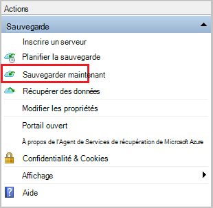

2. Dans la page de Confirmation, passez en revue les paramètres de l’Assistant sauvegarde des maintenant utilisera pour sauvegarder l’ordinateur. Puis cliquez sur **Sauvegarder**.

3. Cliquez sur **Fermer** pour fermer l’Assistant. Si vous procédez comme suit avant la fin du processus de sauvegarde, l’Assistant continue à fonctionner en arrière-plan.

Une fois la sauvegarde initiale terminée, l’état **du travail terminée** s’affiche dans la console de sauvegarde.

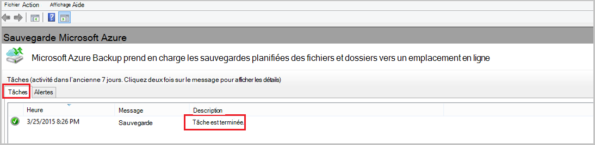

## Questions ?
Si vous avez des questions, ou s’il existe une fonctionnalité que vous voulez voir inclus, [envoyez-nous vos commentaires](http://aka.ms/azurebackup_feedback).

## Étapes suivantes
- Obtenir plus d’informations sur la [sauvegarde des ordinateurs Windows](backup-configure-vault.md).
- À présent que vous avez sauvegardé vos fichiers et dossiers, vous pouvez [gérer vos serveurs et chambres fortes](backup-azure-manage-windows-server.md).
- Si vous avez besoin restaurer une sauvegarde, utilisez cet article pour [restaurer des fichiers sur un ordinateur Windows](backup-azure-restore-windows-server.md).
