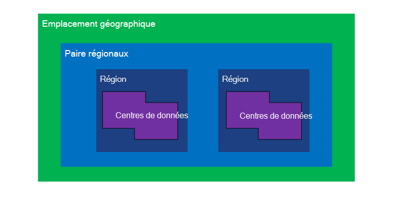
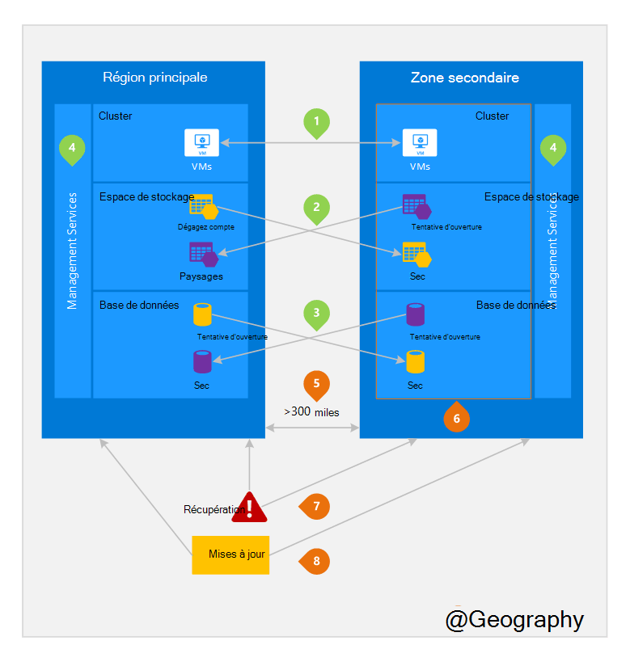

<properties
    pageTitle="Entreprise continuité et récupération d’urgence (BCDR) : régions appariés Azure | Microsoft Azure"
    description="Azure paires régionaux s’assurer que les applications sont résistants au cours des échecs de centre de données."
    services="site-recovery"
    documentationCenter=""
    authors="rayne-wiselman"
    manager="jwhit"
    editor=""/>

<tags
    ms.service="site-recovery"
    ms.workload="storage-backup-recovery"
    ms.tgt_pltfrm="na"
    ms.devlang="na"
    ms.topic="article"
    ms.date="08/23/2016"
    ms.author="raynew"/>

# Entreprise continuité et récupération d’urgence (BCDR) : régions jumelé Azure

## Que sont appariés régions ?

Azure fonctionne en plusieurs zones géographiques du monde entier. Une géographie Azure est une zone définie du monde qui contient au moins une région Azure. Une région Azure est une zone dans un emplacement géographique contenant un ou plusieurs centres de données.

Chaque région Azure est associée à une autre zone dans le même emplacement géographique, créant ainsi une paire régionale. L’exception est sud Brésil qui est associé à une zone en dehors de ses géographiques.

Figure 1 – diagramme paire régionaux Azure

| Emplacement géographique     |  Régions appariées  |                     |
| :-------------| :-------------   | :-------------      |
| Amérique du Nord | États-Unis centre nord | États-Unis centre sud    |
| Amérique du Nord | États-Unis Extrême-Orient          | États-Unis Ouest             |
| Amérique du Nord | États-Unis est 2        | États-Unis centre          |
| Amérique du Nord | États-Unis Ouest 2        | États-Unis centre ouest     |
| Europe        | Europe du Nord     | Europe occidentale         |
| Pays d’Asie          | Asie du Sud-est  | Asie de l’est           |
| Chine         | Chine Extrême-Orient       | En Chine du Nord         |
| Japon         | Orient Japon       | Japon ouest          |
| Brésil        | Brésil Sud (1) | États-Unis centre sud    |
| Australie     | Australie est   | Australie sud-est. |
| Gouvernement des États-Unis | États-Unis et pour le gouvernement Iowa      | États-Unis et pour le gouvernement Virginie     |
| Inde         | Inde central    | Inde du Sud         |
| Canada        | Canada Central   | Canada Extrême-Orient         |
| ROYAUME-UNI            | Royaume-Uni ouest          | Royaume-Uni sud            |

Tableau 1 : mise en correspondance des paires régionaux azure

> (1) sud Brésil est unique, car il est associé à une zone en dehors de ses propres géographiques. Région secondaire du Sud Brésil est sud mais de Sud centrale nous région secondaire n’est pas Brésil Sud.

Nous vous recommandons de répliquer charges de travail sur régionaux paires de bénéficier de stratégies d’isolement et la disponibilité d’Azure. Par exemple, mises à jour système Azure planifié sont déployés dans un ordre séquentiel (pas en même temps) au sein de régions appariées. Cela signifie que même dans les rares cas d’une mise à jour défectueux, les deux régions ne seront pas affectées simultanément. En outre, dans l’éventualité d’une interruption de large, récupération d’au moins une région se déconnecter de toutes les paires est prioritaire.

## Exemple de régions appariés
Figure 2 ci-dessous montre une application hypothétique qui utilise la paire régionale de reprise. Les nombres vertes mettez en surbrillance les activités entre région de trois services Azure (calculer Azure, le stockage et base de données) et comment ils sont configurés pour répliquer sur régions. Les avantages du déploiement au sein de régions appariées uniques sont mis en surbrillance en fonction des numéros oranges.

Figure 2-hypothétique paire régionaux Azure

## Activités entre région
Conformément à la figure 2.

 **Azure calculer (PaaS)** – vous devez configurer les ressources de cluster supplémentaires à l’avance pour vous assurer que les ressources sont disponibles dans une autre région durant un incident. Pour plus d’informations, voir [conseils techniques résilience Azure](./resiliency/resiliency-technical-guidance.md).

 **Stockage Azure** - stockage Geo redondantes (GRS) est configuré par défaut lors de la création d’un compte de stockage Azure. Avec GRS, vos données sont automatiquement répliquées trois fois dans la zone principale et trois fois dans la région appariée. Pour plus d’informations, voir [Options de redondance du stockage Azure](storage/storage-redundancy.md).

 **Bases de données SQL Azure** – avec Azure SQL Standard Geo-répétition, vous pouvez configurer réplication asynchrone des transactions à une zone appariée. Avec Premium Geo-réplication, vous pouvez configurer la réplication à n’importe quelle région dans le monde ; Toutefois, nous vous recommandons de que vous déployez ces ressources dans une zone pour la plupart des scénarios de récupération d’urgence. Pour plus d’informations, voir [Geo-réplication de base de données SQL Azure](./sql-database/sql-database-geo-replication-overview.md).

 **Azure Resource Manager (ARM)** - processeur offre par nature isolement logique des composants de gestion de service au sein de régions. Cela signifie que des échecs logiques dans une zone géographique sont moins susceptibles d’avoir un impact sur un autre.

## Avantages des régions appariés
Conformément à la figure 2.  

**isolement physique** – lorsque cela est possible, Azure préfère au moins 300 miles de séparation entre centres de données dans une paire régionale, même si ce n’est pas pratique, voire impossible dans toutes les régions géographiques. Centre de données physique séparation réduit le risque d’urgence Natural Keyboard, TROUBLES civile, coupures ou défaillances réseau physique qui peuvent affecter les deux régions simultanément. Isolement est couvertes par les contraintes au sein de la géographie (taille de la géographie, disponibilité de l’infrastructure power/réseau, réglementaires, etc.).  

**réplication fournie par la plate-forme** - certains services tels que stockage Geo redondants fournir la réplication automatique à la région appariée.

**ordre de récupération de région** – en cas de panne large, récupération d’une région est prioritaire se déconnecter de toutes les paires. Les applications qui sont déployées à travers les régions appariées garanties que l’une des régions récupérées avec une priorité. Si une application est déployée sur régions qui ne sont pas associées, récupération peut être retardée – dans le pire des cas que les régions choisies est peut-être les deux derniers à restaurer.

**séquentiel met à jour** – système Azure planifiée mises à jour sont transférées aux régions appariées dans un ordre séquentiel (pas en même temps) pour réduire les temps d’arrêt, l’effet des bogues et échecs logiques dans les rares cas d’une mise à jour incorrecte.

**délégation de données** – une région se trouve dans la même géographie en tant que sa paire (à l’exception du Sud Brésil) afin de répondre aux exigences de la délégation de données à des fins taxes et la loi l’application compétence.

