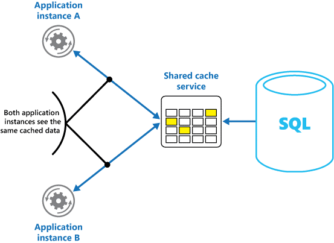

<properties
   pageTitle="Guide de mise en cache | Microsoft Azure"
   description="Conseils sur la mise en cache pour améliorer les performances et extensibilité élevées."
   services=""
   documentationCenter="na"
   authors="dragon119"
   manager="christb"
   editor=""
   tags=""/>

<tags
   ms.service="best-practice"
   ms.devlang="na"
   ms.topic="article"
   ms.tgt_pltfrm="na"
   ms.workload="na"
   ms.date="07/14/2016"
   ms.author="masashin"/>


# <a name="caching-guidance"></a>Guide de mise en cache

[AZURE.INCLUDE [pnp-header](../includes/guidance-pnp-header-include.md)]

Mise en cache est une technique courante qui a pour but d’améliorer les performances et extensibilité élevées d’un système. Pour cela en copiant temporairement les données fréquemment consultées au stockage rapide situé fermer pour l’application. Si cette capacité de stockage rapide se trouve rapprocher à l’application à la source d’origine, puis la mise en cache peut considérablement améliorer temps de réponse pour les applications clientes par servent plus rapidement les données.

La mise en cache est très utile lorsqu’une instance du client lit à plusieurs reprises les mêmes données, notamment si toutes les conditions suivantes s’appliquent au magasin de données d’origine :
- Il reste relativement statique.
- Il est lent par rapport à la vitesse du cache.
- Il est soumis à un niveau élevé de conflit.
- Il n’est éloigné latence du réseau peut entraîner l’accès à est ralentie.

## <a name="caching-in-distributed-applications"></a>La mise en cache dans les applications distribuées

Applications distribuées en général implémentent une ou les deux des stratégies suivantes lors de la mise en cache de données :

- À l’aide d’un cache privé, dans lequel les données sont stockées localement sur l’ordinateur qui exécute une instance d’une application ou un service.
- À l’aide d’un cache partagé, servant à une source commune qui est accessible par plusieurs processus et/ou machines.

Dans les deux cas, la mise en cache peut être effectuée côté client et/ou côté serveur. La mise en cache côté client est émise par le processus qui fournit l’interface utilisateur pour un système, tel qu’un navigateur web ou une application de bureau.
La mise en cache côté serveur est émise par le processus qui fournit aux services en cours d’exécution à distance.

### <a name="private-caching"></a>La mise en cache privé

Le type de cache plus simple est un magasin en mémoire. Celui-ci a maintenu dans l’espace d’adressage d’un seul processus et accéder directement par le code qui s’exécute dans ce processus. Ce type de cache est très rapide pour accéder à. Il peut également fournir un moyen très efficace pour le stockage de faible quantité de données statiques, étant donné que la taille d’un cache est généralement limitée par le volume de mémoire disponible sur l’ordinateur qui héberge le processus.

Si vous avez besoin pour mettre en cache n’est pas physiquement possible en mémoire, vous pouvez écrire des données mises en cache pour le système de fichiers local. Cela sera plus lente accéder à des données qui sont conservées en mémoire, mais doit toujours être plus rapide et plus fiable que la récupération des données sur un réseau.

Si vous avez plusieurs instances d’une application qui utilise ce modèle qui s’exécutent simultanément, chaque instance de l’application a son propre cache indépendante contenant sa propre copie des données.

Considérez un cache comme un instantané de données d’origine à un moment donné par le passé. Si ces données ne soient pas statiques, il est probable qu’instances de l’autre application contenir différentes versions des données dans leur cache. Par conséquent, la même requête effectuée par ces instances peut retourner des résultats différents, comme illustré dans la Figure 1.


_Figure 1 : À l’aide d’un cache en mémoire dans différentes instances d’une application_

### <a name="shared-caching"></a>Partagée la mise en cache

À l’aide d’un cache partagé peut vous aider à résoudre les problèmes que les données peuvent varier dans chaque cache, ce qui peut se produire avec la mise en cache en mémoire. La mise en cache partagé permet instances de l’application différente de voir la même vue de données mises en cache. Pour cela, vous avez trouvé le cache dans un autre endroit, généralement hébergé dans le cadre d’un service séparé, comme illustré dans la Figure 2.



_Figure 2 : À l’aide d’un cache partagé_

Un avantage important de l’approche mise en cache partagé est l’extensibilité élevées qu'il propose. Les services de cache partagé sont implémentées en utilisant un cluster de serveurs et d’utilisent le logiciel qui distribue les données sur le cluster de manière transparente. Une instance d’application envoie simplement une demande le service de cache.
L’infrastructure sous-jacente est chargé de déterminer l’emplacement des données mises en cache dans le cluster. Vous pouvez facilement adapter le cache en ajoutant des serveurs.

Il existe deux principaux inconvénients de l’approche mise en cache partagée :
- Le cache est plus lent, car il n’est plus maintenu localement à chaque instance de l’application.
- La configuration minimale requise pour implémenter un service de cache distinct peut rendre plus complexe la solution.

## <a name="considerations-for-using-caching"></a>Considérations sur l’utilisation de la mise en cache

Les sections suivantes décrivent plus en détail les considérations pour la conception et l’utilisation d’un cache.

### <a name="decide-when-to-cache-data"></a>Déterminer quand en cache des données

La mise en cache peut améliorer considérablement disponibilité, performances et extensibilité élevées. Davantage de données que vous avez et plus le nombre d’utilisateurs qui doivent accéder à ces données, plus les avantages de la mise en cache deviennent. C’est parce que la mise en cache permet de réduire la latence et le conflit associée à la gestion des volumes importants de demandes simultanées dans le magasin de données d’origine.

Par exemple, une base de données peut prendre en charge un nombre limité de connexions simultanées. Extraire des données à partir d’un cache partagé, cependant, plutôt que de la base de données sous-jacente rend possibles pour une application cliente pour accéder à ces données même si le nombre de connexions disponibles est actuellement atteint. En outre, si la base de données deviendrait indisponible, les applications clientes peuvent être en mesure de continuer à l’aide de données qui sont conservées dans le cache.

Pensez à la mise en cache de données qui sont lues fréquemment mais modifiées rarement (par exemple, les données ayant un plus grand nombre d’opérations de lecture que les opérations d’écriture). Toutefois, nous ne vous recommandons d’utiliser le cache comme faisant autoritée banque d’informations critiques. En revanche, assurez-vous que votre application ne peut pas vous permettre de perdre toutes les modifications sont toujours enregistrées dans un magasin de données permanente. Cela signifie que si le cache n’est pas disponible, votre application peut toujours continuer à faire fonctionner en utilisant le magasin de données et ne pas perdre des informations importantes.

### <a name="determine-how-to-cache-data-effectively"></a>Déterminer comment mettre en cache efficacement les données

La clé à l’aide d’un cache efficacement repose dans déterminer les données plus appropriées pour mettre en cache et la mise en cache au moment opportun. Les données peuvent être ajoutées au cache à la demande la première fois qu’il est extrait par une application. Cela signifie que l’application a besoin récupérer les données qu’une seule fois à partir du magasin de données, et que l’accès suivants peuvent être satisfaites à l’aide du cache.

Par ailleurs, un cache peut être complet ou partiel rempli avec des données à l’avance, généralement au démarrage de l’application (une approche appelée amorçage). Toutefois, il peut être préférable de mettre en œuvre ensemencement pour un grand cache parce que cette approche pouvez imposer une charge soudaine, haute sur le magasin de données d’origine au démarrage de l’application en cours d’exécution.

Souvent une analyse des tendances d’utilisation peut vous aider à décider s’il faut pour entièrement ou partiellement renseigner un cache au et pour choisir les données à mettre en cache. Par exemple, il peut être utile amorcer le cache avec les données de profil utilisateur statique pour les clients qui utilisent l’application régulièrement (par exemple tous les jours), mais pas pour les clients qui utilisent l’application uniquement une fois par semaine.

La mise en cache généralement fonctionne bien avec les données qui est immuable ou qui changent rarement. Exemples : les informations de référence, telles que produit et informations de tarification dans une application de commerce ou ressources partagées statiques qui sont coûteuses à construire. Tout ou partie de ces données peuvent être chargées dans le cache au démarrage de l’application pour réduire la demande de ressources et pour améliorer les performances. Il peut également être approprié d’avoir un processus en arrière-plan qui met à jour régulièrement de référence des données dans le cache afin de s’assurer qu’il sont à jour, ou qui actualise le cache lorsque font référence aux données modifications.

La mise en cache est moins utile pour échange dynamique de données, bien qu’il existe quelques exceptions à cette considération (voir la section Cache hautement échange dynamique de données plus loin dans cet article pour plus d’informations). Lorsque les données d’origine changent régulièrement, les informations mises en cache deviennent très rapidement obsolètes ou la charge de synchronisation du cache avec le magasin de données d’origine réduit l’efficacité de la mise en cache.

Notez qu’un cache ne comporte pas d’inclure toutes les données d’une entité. Par exemple, si un élément de données représente un objet à plusieurs valeurs tel qu’un client bancaire avec un nom, adresse et solde, certains de ces éléments peuvent rester statique (par exemple, le nom et l’adresse), tandis que d’autres personnes (par exemple, le solde du compte) peuvent être plus dynamiques. Dans ce cas, il peut être utile mettre en cache les parties statiques des données et récupérer (ou calculer) uniquement les informations restantes lorsqu’il est requis.

Nous vous recommandons d’effectuer analyse test et l’utilisation des performances pour déterminer si population préliminaire ou à la demande le chargement de la mémoire cache ou une combinaison des deux, est approprié. La décision doit être basée sur la volatilité et au modèle d’utilisation des données. Analyse des performances et de l’utilisation du cache est particulièrement important dans les applications qui rencontrer charges et doivent être hautement scalable. Par exemple, dans les scénarios hautement scalable, il peut être utile pour amorcer le cache pour réduire la charge sur le magasin de données à des moments pointe.

La mise en cache peut également servir à éviter la répétition des calculs pendant l’exécution de l’application. Si une opération des transformations de données ou effectue un calcul complexe, il peut enregistrer les résultats de l’opération dans le cache. Si le même calcul est requis par la suite, l’application suffit d’extraire les résultats à partir du cache.

Une application peut modifier les données qui sont trouve dans un cache. Toutefois, nous vous recommandons de réflexion du cache en tant que données transitoires magasin qui pourrait disparaissent à tout moment. Ne pas stocker des données importantes dans le cache uniquement ; Vérifiez que vous tenir à jour les informations contenues dans le magasin de données d’origine. Cela signifie que si le cache deviendrait indisponible, vous réduisez les risques de perdre des données.

### <a name="cache-highly-dynamic-data"></a>Cache hautement échange dynamique de données

Lorsque vous stockez évolue rapidement des informations dans un magasin de données permanente, il peut affecter un sur le système. Par exemple, considérez un appareil qui en permanence signale certaines autres mesure ou l’état. Si une application choisit de ne pas mettre en cache ces données sur la base que les informations mises en cache sera presque toujours obsolètes, le même compte peut être true lorsque le stockage et l’extraction de ces informations à partir du magasin de données. Dans le temps que nécessaire pour enregistrer et récupérer ces données, il peut être changé.

Dans une situation telles que, tenez compte des avantages de stocker les informations dynamiques directement dans le cache plutôt que dans le magasin de données permanente. Si les données sont non critiques et ne nécessitent pas l’audit, puis cela n’a aucune importance si la modification occasionnelle est perdue.

### <a name="manage-data-expiration-in-a-cache"></a>Gérer l’expiration de données dans un cache

Dans la plupart des cas, les données qui sont trouve dans un cache sont une copie des données qui sont trouve dans le magasin de données d’origine. Les données dans le magasin de données d’origine peuvent changer une fois qu’il a été mis en cache, rendant deviennent obsolètes dans les données mises en cache. De nombreux systèmes de mise en cache permettent de configurer le cache pour expiration des données et réduire la période pour laquelle les données peuvent être mis à jour.

Expiration de données mises en cache, celui-ci est supprimé à partir du cache et l’application doit récupérer les données à partir du magasin de données d’origine (mettre les informations que vous venez extraites revenir en cache). Vous pouvez définir une stratégie d’expiration par défaut lorsque vous configurez le cache. Dans les services de cache, vous pouvez également prévoir la période d’expiration pour les objets individuels lorsque vous stockez par programme dans le cache.
Certains cache permettre de spécifier la période d’expiration comme une valeur absolue, ou comme une valeur décalée entraînant l’élément à supprimer à partir du cache si elle n’est pas accessible dans le délai spécifié. Ce paramètre remplace toute stratégie d’expiration à l’échelle de cache, mais uniquement pour les objets spécifiés.

> [AZURE.NOTE] Vous pouvez la période d’expiration pour le cache et les objets qu’elle contient avec soin. Si vous apportez trop courte, objets expirera trop rapidement et vous permet de réduire les avantages de l’utilisation du cache. Si vous effectuez la période trop de temps, vous risquez des données désormais périmés.

Il est également possible que le cache peut compléter si données sont autorisées à rester résident pendant une longue période. Dans ce cas, les requêtes pour ajouter de nouveaux éléments dans le cache peuvent provoquer certains éléments force Quitter dans un processus appelé ait. Les services de cache généralement suppression de données récentes moins récemment utilisé (LRU), mais vous pouvez généralement remplacer cette stratégie et empêcher que des éléments en cours de suppression. Toutefois, si vous adoptez cette approche, vous risquez de dépassement de la mémoire qui est disponible dans le cache. Une application qui tente d’ajouter un élément dans le cache échoue avec une exception.

Certaines mises en œuvre la mise en cache peuvent fournir des stratégies ait supplémentaires. Il existe plusieurs types de stratégies de suppression. Parmi lesquels :
- Une stratégie des derniers fichiers utilisés (dans l’éventualité que les données ne sera pas requises à nouveau).
- Une stratégie in-first-out (données les plus anciennes sont supprimées tout d’abord).
- Une stratégie de suppression explicite basée sur un événement déclenché (par exemple, les données en cours de modification).

### <a name="invalidate-data-in-a-client-side-cache"></a>Invalider des données dans un cache côté client

Données contenues dans un cache côté client sont généralement considérées comme à l’extérieur de la responsabilité du service qui fournit les données au client. Un service ne peut pas forcer directement un client pour ajouter ou supprimer des informations à partir d’un cache côté client.

Cela signifie qu’il est possible pour un client qui utilise un cache mal configuré pour continuer à utiliser des informations obsolètes. Par exemple, si les stratégies d’expiration du cache ne sont pas correctement mis en œuvre, un client peut utiliser des informations obsolètes sont mis en cache localement lorsque les informations contenues dans la source de données d’origine a été modifiée.

Si vous créez une application web qui sert de données via une connexion HTTP, vous pouvez forcer implicitement un client web (par exemple, un navigateur ou proxy web) pour récupérer les informations les plus récentes. Vous pouvez le faire si une ressource est mis à jour en modifiant l’URI de la ressource. Les clients Web utilisent généralement l’URI d’une ressource comme la clé dans le cache côté client, afin que si l’URI modifie, le client web ignore les précédemment mis en cache des versions d’une ressource et extrait la nouvelle version à la place.

## <a name="managing-concurrency-in-a-cache"></a>Gestion des accès concurrentiels dans un cache

Cache est souvent destinés à être partagé par plusieurs instances d’une application. Chaque instance de l’application peut lire et modifier des données dans le cache. Par conséquent, les problèmes d’accès concurrentiels au même en cas de problème avec n’importe quel magasin de données partagée s’appliquent également à un cache. Dans une situation où une application a besoin pour modifier les données mises en cache, vous devrez peut-être vous assurer que les mises à jour effectuées par une instance de l’application de ne pas remplacent les modifications apportées par une autre instance.

En fonction de la nature des données et la probabilité de conflits, vous pouvez adopter l’une des deux manières d’accès concurrentiels au :

- __Optimiste.__ Immédiatement avant la mise à jour les données, l’application vérifie si les données dans le cache a changé depuis qu’il a été extrait. Si les données sont toujours la même, la modification peut être effectuée. Dans le cas contraire, l’application doit décider s’il faut mettre à jour. (La logique métier qui régissent la présente décision sera spécifique à l’application). Cette approche est adapté aux situations où les mises à jour sont rares ou où se trouvent pas probable conflits.
- __Pessimiste.__ Lorsqu’il récupère les données, l’application bloque dans le cache pour empêcher une autre instance de le modifier. Ce processus garantit que les conflits ne peut pas se produire, mais ils peuvent également bloquer les autres instances devant traiter les mêmes données. Concurrence pessimiste peut affecter l’extensibilité élevées d’une solution et est recommandé uniquement pour les opérations de courte durée de vie. Cette approche peut être appropriée pour les situations dans lesquelles les conflits sont censées, surtout si une application met à jour plusieurs éléments dans le cache et devez vous assurer que ces modifications sont appliquées en permanence.

### <a name="implement-high-availability-and-scalability-and-improve-performance"></a>Mise en œuvre élevées et améliorer les performances

Évitez d’utiliser un cache en tant que le référentiel principal de données ; Il s’agit du rôle du magasin de données d’origine à partir de laquelle le cache est rempli. Le magasin de données d’origine est responsable de la durée des données.

En veillant à ne pas introduire de dépendances critiques sur la disponibilité d’un service de cache partagé dans vos solutions. Une application doit être en mesure de continuer à fonctionner si le service qui fournit la mémoire cache partagée n’est pas disponible. L’application ne doit pas se bloquent ou échouer pendant l’attente reprendre le service de cache.

Par conséquent, l’application doit être préparée pour détecter la disponibilité du service de cache et y revenir au magasin de données d’origine si le cache n’est pas accessible. Le [séparateur de Circuit motif](http://msdn.microsoft.com/library/dn589784.aspx) est utile pour gérer ce scénario. Le service qui fournit la mémoire cache peut être récupéré et dès qu’il sera disponible, le cache peut être rempli lorsque les données sont lues former le magasin de données d’origine, suivi d’une stratégie de tels que le [motif de Cache latérale](http://msdn.microsoft.com/library/dn589799.aspx).

Toutefois, il peut être un impact extensibilité élevées sur le système si l’application revient au magasin de données d’origine lorsque le cache est temporairement indisponible.
Pendant que le magasin de données est en cours de restauration, le magasin de données d’origine pourrait être alors demandes de données, ce qui crée de délais d’expiration et échecs de connexions.

Envisagez d’implémenter un cache local, private dans chaque instance d’une application, ainsi que le cache partagé qui accèdent à toutes les instances de l’application. Lorsque l’application récupère un élément, il peut vérifier tout d’abord dans son cache local, puis dans le partagé en cache et enfin dans les données d’origine stocker. Le cache local peut être rempli utilisent les données dans le cache partagé ou dans la base de données si le cache partagé n’est pas disponible.

Cette approche nécessite une configuration prudent pour empêcher le cache local de devenir trop obsolètes en ce qui concerne la mémoire cache partagée. Toutefois, le cache local est interprété comme une mémoire tampon si le cache partagé n’est pas accessible. Figure 3 illustre cette structure.


_Figure 3 : à l’aide d’un cache local, privé avec un cache partagé_

Pour prendre en charge cache volumineux qui contiennent des données à long terme, certains services cache comprennent une option de disponibilité qui mettent en œuvre, basculement automatique si le cache n’est plus disponible. Cette approche implique généralement la réplication des données mises en cache qui sont trouve sur un serveur de cache principal vers un serveur de cache secondaire, puis passer au serveur secondaire en cas d’échec du serveur principal ou connectivité est perdue.

Pour réduire la latence associée écriture à plusieurs destinataires, la réplication vers le serveur secondaire peut se produire asynchrone lorsque les données sont écrites dans le cache sur le serveur principal. Cette approche permet d’accéder à la possibilité que certaines informations mises en cache peuvent être perdues en cas de panne, mais la proportion de ces données doit être inférieures à la taille du cache.

Si un cache partagé est volumineux, il peut être utile diviser les données mises en cache entre nœuds pour réduire les risques de conflit et améliorer extensibilité élevées. Cache partagé mettent en prennent en charge la fonctionnalité permettant d’ajouter dynamiquement (et supprimer) nœuds et rééquilibrer les données entre partitions. Cette approche peut impliquer cluster, dans lequel la collection de nœuds est présentée aux applications clientes comme un cache transparent, unique. Toutefois, en interne, les données sont répartis entre les nœuds de suivi d’une stratégie de distribution prédéfini qui équilibre la charge de manière égale. Le [document d’orientation partition des données](http://msdn.microsoft.com/library/dn589795.aspx) sur le site Web Microsoft fournit plus d’informations sur les stratégies partition possibles.

Cluster peut également augmenter la disponibilité du cache. Si un nœud échoue, le reste du cache est toujours accessible.
Cluster est souvent conjointement avec réplication et basculement. Chaque nœud peut être répliquée, et le réplica peut être rapidement mis en ligne si le nœud échoue.

De nombreux lecture et les opérations d’écriture sont susceptibles de présenter des valeurs de données uniques ou des objets. Toutefois, il arrive qu’il peut être nécessaire stocker ou récupérer rapidement de grands volumes de données.
Par exemple, ensemencement un cache pourrait nécessiter l’écriture des centaines ou des milliers d’éléments dans le cache. Une application peut devoir également récupérer un grand nombre d’éléments associés dans le cache dans le cadre de la même demande.

Cache mettent en grande fournissent des opérations de commandes pour effectuer ces opérations. Cela permet à une application client créer un package d’un grand nombre d’éléments dans une seule demande et permet de réduire la charge associée effectue un grand nombre de requêtes petites.

## <a name="caching-and-eventual-consistency"></a>Garantir la cohérence éventuelle et mise en cache

Pour le modèle de cache latérale pour l’utiliser, l’instance de l’application qui remplit le cache doit avoir accès à la version les plus récente et cohérente des données. Dans un système qui mettent en œuvre, la cohérence éventuelle (par exemple, un magasin de données répliquée) cela peut-être pas la casse.

Une instance d’une application peut modifier un élément de données et invalider la version mise en cache de cet élément. Une autre instance de l’application peut tenter de lire cet élément à partir d’un cache, ce qui entraîne une absence de cache, de sorte qu’elle lit les données dans le magasin de données et le place dans le cache. Toutefois, si le magasin de données n’a pas été entièrement synchronisé avec les autres réplicas, l’instance d’application peut lire et remplir le cache avec l’ancienne valeur.

Pour plus d’informations sur la gestion de la cohérence des données, consultez la page [d’Introduction à la cohérence des données](http://msdn.microsoft.com/library/dn589800.aspx) sur le site Web Microsoft.

### <a name="protect-cached-data"></a>Protéger vos données mises en cache

Quel que soit le service de cache que vous utilisez, réfléchir à la façon de protéger les données mises en cache des accès non autorisés. Il existe deux questions principales :

- La confidentialité des données dans le cache
- Flux de la confidentialité des données lorsqu’il entre le cache et l’application qui utilise le cache

Pour protéger vos données dans le cache, le service de cache peut implémenter un mécanisme d’authentification qui nécessite que les applications spécifier les éléments suivants :
- Les identités qui peuvent accéder aux données dans le cache.
- Les opérations (lire et écrire) ces identités sont autorisées à effectuer.

Pour réduire les frais qui a associé à lire et écrire des données, une fois une identité accordée écriture et/ou l’accès en lecture dans le cache, qu’identité peut utiliser toutes les données dans le cache.

Si vous voulez limiter l’accès aux sous-groupes des données mises en cache, vous pouvez effectuer une des opérations suivantes :

- Fractionner le cache en partitions (à l’aide de serveurs cache différents) et de n’accorder l’accès à des identités pour les partitions qu’ils doivent être autorisés à utiliser.
- Chiffrer les données dans chaque sous-ensemble à l’aide des touches différentes et fournissez les clés de chiffrement uniquement avec les identités qui doivent y accéder à chaque sous-ensemble. Une application cliente peut-être toujours être en mesure de récupérer toutes les données dans le cache, mais il seulement pourra pas déchiffrer les données pour lesquelles il a les clés.

Vous devez également protéger les données qu’elles se trouvent dans le cache. Pour ce faire, vous dépendez de fonctionnalités de sécurité fournies par l’infrastructure réseau qui utilisent des applications clientes pour vous connecter à la mémoire cache. Si le cache est implémenté à l’aide d’un serveur sur place au sein de la même organisation qui héberge les applications clientes, puis l’isolement du réseau pas amené à prendre des mesures supplémentaires. Si le cache se trouve à distance et nécessite une connexion TCP ou HTTP via un réseau public (par exemple, Internet), envisagez d’implémenter SSL.

## <a name="considerations-for-implementing-caching-with-microsoft-azure"></a>Considérations pour l’implémentation de la mise en cache avec Microsoft Azure

Azure fournit le Cache Redis Azure. Il s’agit d’une implémentation de la source du cache Redis qui s’exécute en tant que service dans un centre de données Azure ouverte. Il propose un service de mise en cache qui sont accessibles à partir de n’importe quelle application Azure, si l’application est implémentée sous la forme d’un service cloud, un site Web, ou à l’intérieur d’une machine virtuelle Azure. Cache peut être partagés par les applications clientes qui ont la touche d’accès appropriés.

Cache Redis Azure est une solution de cache High performance qui fournit la disponibilité, sécurité et extensibilité élevées. Il s’exécute en général en tant que service répartis sur un ou plusieurs ordinateurs dédiés. Il tente de stocker autant d’informations que possible dans la mémoire pour assurer un accès rapide. Cette architecture est destinée à fournir faible latence et haut débit en réduisant la nécessité d’effectuer les opérations d’e/s lentes.

 Cache Redis Azure est compatible avec la plupart des API différentes qui sont utilisés par les applications clientes. Si vous avez les applications qui utilisent déjà Azure Redis Cache en cours d’exécution en local, le Cache de Redis Azure fournit un chemin d’accès de migration rapide à la mise en cache dans le nuage.

> [AZURE.NOTE] Azure fournit également le Service de Cache géré. Ce service est basé sur le moteur d’Azure Service TISSU Cache. Il vous permet de créer un cache distribué qui peut être partagé par les applications souples d’utilisation. Le cache est hébergé sur des serveurs haute performance en cours d’exécution dans un centre de données Azure.
Toutefois, cette option n’est plus recommandée et n’est fournie pour prendre en charge des applications existantes qui ont été créées pour l’utiliser. Pour tous les nouveaux développements, utilisez plutôt Azure Redis Cache.
>
> En outre, Azure prend en charge la mise en cache dans le rôle. Cette fonctionnalité permet de créer un cache qui est propre à un service cloud.
Le cache est hébergé par les instances d’un rôle web ou de travail et sont accessibles par les rôles qui fonctionnent dans le cadre de l’unité de déploiement de service cloud même. (Une unité de déploiement est l’ensemble des instances de rôle déployées comme un service cloud vers une zone spécifique). Le cache est groupé, et toutes les instances du rôle dans la même unité de déploiement qui héberge le cache deviennent partie intégrante du même cluster cache. Toutefois, cette option n’est plus recommandée et n’est fournie pour prendre en charge des applications existantes qui ont été créées pour l’utiliser. Pour tous les nouveaux développements, utilisez plutôt Azure Redis Cache.
>
> Service de Cache géré Azure et Azure dans le rôle Cache sont actuellement prêts retraite sur le 16 novembre 2016.
Il est recommandé de migrer vers Azure Redis Cache en vue de ce déclassement. Pour plus d’informations, visitez la page   [Nouveautés offre Azure Redis Cache et la taille que dois-je utiliser ?](redis-cache/cache-faq.md#what-redis-cache-offering-and-size-should-i-use) sur le site Web Microsoft.


### <a name="features-of-redis"></a>Fonctionnalités de Redis

 Redis est supérieure à un serveur de cache simple. Il propose une base de données en mémoire distribuée avec un jeu de commandes étendues qui prend en charge de nombreux scénarios courants. Celles-ci sont décrites plus loin dans ce document, dans la section Redis à l’aide de la mise en cache. Cette section décrit quelques-unes des fonctionnalités clés qui fournit des Redis.

### <a name="redis-as-an-in-memory-database"></a>Redis comme une base de données en mémoire

Redis prend en charge les lire et écrire des opérations. Dans Redis, écritures peuvent être protégées panne du système en régulièrement stockées dans un fichier instantané local ou dans un fichier journal ajout uniquement. Ce n’est pas le cas dans cache mettent en (qui doivent être considérées comme banques de données temporaires).

 Toutes les écritures sont asynchrones et ne bloquent pas les clients de lire et écrire des données. Lorsque Redis démarre en cours d’exécution, il lit les données dans le fichier journal ou de capture instantanée et utilise pour créer le cache en mémoire. Pour plus d’informations, voir [Redis persistance](http://redis.io/topics/persistence) sur le site Web Redis.

> [AZURE.NOTE] Redis ne garantit pas que toutes les écritures seront enregistrés en cas de panne grave, mais au pire vous risquez de perdre uniquement quelques secondes de données. N’oubliez pas qu’un cache n’est pas destiné à agir comme source de données faisant autorité, ainsi que la responsabilité des applications qui utilisent le cache pour vous assurer que les données critiques sont enregistrées sur un magasin de données appropriées. Pour plus d’informations, voir le [cache latérale de motif](http://msdn.microsoft.com/library/dn589799.aspx).

#### <a name="redis-data-types"></a>Redis des types de données

Redis est un magasin clé-valeur, où les valeurs peuvent contenir des types simples ou structures de données complexes tels que hachage, listes et. Il prend en charge un ensemble d’opérations atomiques sur ces types de données. Clés peuvent être permanents ou balisé avec une limité temps de vie, à partir de laquelle la clé et sa valeur correspondante sont automatiquement supprimés à partir du cache. Pour plus d’informations sur les clés Redis et les valeurs, visitez la page [présentation Redis captages et des types de données](http://redis.io/topics/data-types-intro) sur le site Web Redis.

#### <a name="redis-replication-and-clustering"></a>Redis fautes et

Redis prend en charge la réplication de masque/subalterne afin de garantir la disponibilité et conserver débit. Écrire des opérations à un nœud maître Redis sont répliquées sur un ou plusieurs nœuds subordonné. Opérations de lecture peuvent être fournies par la forme de base et tous les subordonnés.

Dans le cas d’une partition réseau, subordonnés peuvent continuer à faire Office de données et puis en toute transparence effectuer la synchronisation avec la forme de base lors de la connexion est rétablie. Pour plus d’informations, visitez la page de [réplication](http://redis.io/topics/replication) sur le site Web Redis.

Redis fournit également la mise en cluster, qui vous permet de diviser les données en milieu des fragments entre serveurs et répartir la charge de façon transparente. Cette fonctionnalité améliore extensibilité élevées, parce que des nouveaux serveurs Redis peuvent être ajoutés et les données réparties à mesure que la taille du cache augmentent.

En outre, chaque serveur dans le cluster peut être répliquée en utilisant la réplication de masque/subalterne. Cela garantit la disponibilité au sein de chaque nœud du cluster. Pour plus d’informations sur la mise en cluster et ont, visitez le [Redis page didacticiel cluster](http://redis.io/topics/cluster-tutorial) sur le site Web Redis.

### <a name="redis-memory-use"></a>Redis utilisation de la mémoire

Un cache Redis a une taille déterminée basée sur les ressources disponibles sur l’ordinateur hôte. Lorsque vous configurez un serveur Redis, vous pouvez spécifier la quantité maximale de mémoire qu’il peut utiliser. Vous pouvez également configurer une clé dans un cache Redis d’avoir un délai d’expiration après laquelle il est automatiquement supprimé du cache. Cette fonctionnalité permet d’éviter le cache en mémoire à partir de remplissage des données obsolètes ou très anciennes.

Comme mémoire est pleine, les Redis pouvez automatiquement supprimer les clés et leurs valeurs en suivant un certain nombre de stratégies. La valeur par défaut est LRU (moins récemment utilisé), mais vous pouvez également sélectionner d’autres stratégies tels que la suppression de clés de manière aléatoire ou la désactivation d’ait complètement (dans lequel, casse tente d’ajouter des éléments à l’échec du cache s’il est saturé). La page [à l’aide de Redis comme un cache LRU](http://redis.io/topics/lru-cache) donne des informations supplémentaires.

### <a name="redis-transactions-and-batches"></a>Redis transactions et lots

Redis permet à une application cliente à la soumettre une série d’opérations de lire et écrire des données dans le cache sous la forme d’une transaction atomique. Toutes les commandes dans la transaction ont la garantie à exécuter dans un ordre séquentiel et aucune commande émis par d’autres clients simultanées ne sera insérée entre elles.

Cependant, il s’agit pas transactions trues comme une base de données relationnel serait les exécuter. Traitement des transactions se compose de deux étapes : la première est lorsque les commandes sont en attente, et le second est lorsque les commandes sont exécutées. Pendant la phase de files d’attente de commande, les commandes qui composent la transaction sont envoyés par le client. Si particulière d’erreur se produit à ce stade (par exemple, une erreur de syntaxe, ou le nombre de paramètres incorrect) Redis puis refuse de traiter toute la transaction et ignore.

Pendant la phase d’exécution, Redis exécute chaque commande en file d’attente dans l’ordre. Si une commande échoue au cours de cette phase, Redis continue avec la commande suivante en file d’attente et ne restaure pas les effets de toutes les commandes qui ont déjà été exécutés. Ce formulaire simplifié de transaction permet de maintenir des performances et éviter les problèmes de performances causés par les conflits.

Redis mise en œuvre d’un écran de verrouillage optimiste pour vous aider à maintenir la cohérence. Pour plus d’informations sur les transactions et verrouillage avec Redis, visitez la [page Transactions](http://redis.io/topics/transactions) sur le site Web Redis.

Redis prend également en charge le traitement par lots non transactions de requêtes. Le protocole Redis que les clients utilisent pour envoyer des commandes à un serveur Redis permet à un client envoyer une série d’opérations dans le cadre de la même demande. Cela peut vous aider à réduire la fragmentation des paquets sur le réseau. Lorsque le lot est traité, chaque commande est effectuée. Si un de ces commandes sont incorrect, ils seront rejetés (qui ne se produire avec une transaction), mais les commandes restants à effectuer. Il n’existe également aucune garantie concernant l’ordre dans lequel les commandes dans le lot seront traités.

### <a name="redis-security"></a>Redis de sécurité

Redis consacrent exclusivement à un accès rapide aux données et est conçu pour fonctionner à l’intérieur d’un environnement approuvé accessible qu’aux clients approuvés. Redis prend en charge un modèle de sécurité limitée basé sur l’authentification de mot de passe. (Il est possible supprimer complètement, l’authentification bien que nous ne recommandons cela.)

Tous les clients authentifiés partagent le même mot de passe global et aient accès aux mêmes ressources. Si vous avez besoin plus complète de sécurité de connexion, vous devez implémenter votre propre couche de sécurité devant le serveur Redis, et toutes les demandes des clients doivent passer par ce niveau supplémentaire. Redis ne doivent pas être exposées directement aux clients non approuvés ou non authentifiés.

Vous pouvez limiter l’accès aux commandes en désactivant les ou en renommant (et en fournissant uniquement dotés de privilèges clients avec les nouveaux noms).

Redis ne reconnaît pas directement les quelque de chiffrement des données, tout encodage doit être effectuée par les applications clientes. En outre, Redis n’offre pas de n’importe quel type de sécurité de transport. Si vous avez besoin de protéger les données qu’elles se trouvent sur le réseau, nous vous recommandons de mise en œuvre d’un serveur proxy SSL.

Pour plus d’informations, visitez la page [Redis sécurité](http://redis.io/topics/security) sur le site Web Redis.

> [AZURE.NOTE] Cache Redis Azure fournit sa propre couche sécurité via lequel les clients se connecter. Les serveurs Redis sous-jacentes ne sont pas exposés au réseau public.

### <a name="using-the-azure-redis-cache"></a>Utilisation du cache Redis Azure

Le Cache Redis Azure permet d’accéder aux serveurs Redis en cours d’exécution sur des serveurs hébergés en un centre de données Azure ; il fonctionne comme une façade qui fournit la sécurité et contrôle d’accès. Vous pouvez configurer un cache à l’aide du portail de gestion Azure. Le portail fournit un certain nombre de configurations prédéfinies, allant d’un cache Go 53 exécute comme un service dédié qui prend en charge les communications SSL (pour confidentialité) et la réplication de masque/subalterne avec accord de 99,9 %, vers le bas jusqu'à un 250 Mo cache sans réplication (aucune garantie de disponibilité) s’exécutant sur partagé.

À l’aide du portail de gestion Azure, vous pouvez également configurer la stratégie de suppression du cache et contrôler l’accès à la mémoire cache en ajoutant des utilisateurs aux rôles fournies ; Propriétaire, collaborateur, lecteur. Ces rôles définissent les opérations que les membres peuvent effectuer. Par exemple, les membres du rôle propriétaire contrôlez le cache (y compris la sécurité) et son contenu, les membres du rôle de collaborateur peuvent lire et écrire des informations dans le cache, et les membres du rôle Lecteur peuvent uniquement extraire des données à partir du cache.

La plupart des tâches d’administration sont effectuées via le portail de gestion Azure et c’est pourquoi la plupart des commandes administratifs disponibles dans la version standard de Redis ne sont pas disponibles, y compris la possibilité de modifier la configuration par programme, arrêtez le serveur Redis, configurez esclaves supplémentaires ou force : enregistrer les données sur le disque.

Le portail de gestion Azure inclut un affichage graphique pratique qui vous permet d’analyser les performances du cache. Par exemple, vous pouvez afficher le nombre de connexions sachant, du nombre de requêtes effectuées, le volume de lecture et d’écriture, et le nombre de cache atteint par rapport aux échecs du cache. À l’aide de ces informations, vous pouvez déterminer l’efficacité du cache et si nécessaire basculez vers une autre configuration ou modifier la stratégie de suppression. En outre, vous pouvez créer des alertes qui envoient des messages électroniques à un administrateur si un ou plusieurs indicateurs critiques se trouvent en dehors d’une plage attendue. Par exemple, si le nombre d’échecs du cache dépasse une valeur spécifiée dans la dernière heure, un administrateur peut être prévenu que le cache peut être trop petit ou données peuvent être en cours de suppression trop rapidement.

Vous pouvez également surveiller processeur, la mémoire et l’utilisation du réseau pour le cache.

Pour plus d’informations et des exemples montrant comment créer et configurer un Cache Redis Azure, visitez la page [visite guidée de Cache Redis Azure](https://azure.microsoft.com/blog/2014/06/04/lap-around-azure-redis-cache-preview/) sur le blog Azure.

## <a name="caching-session-state-and-html-output"></a>État de la session mise en cache et sortie HTML

Si vous créez ASP.NET applications qu’exécuter à l’aide de rôles web Azure, vous pouvez enregistrer les informations d’état session et sortie HTML dans un Cache Redis Azure web. Le fournisseur d’état de Session pour Azure Redis Cache permet de partager des informations de session entre différentes instances d’une application web ASP.NET et est très utile dans les situations de batterie de serveurs web où affinité client / serveur n’est pas disponible et la mise en cache de données session en mémoire serait pas approprié.

À l’aide de la Session State Provider avec Azure Redis Cache offre plusieurs avantages, notamment :

- Il peut partager un état de session avec un grand nombre d’instances d’une application web ASP.NET, fournissant extensibilité élevées améliorée,
- Il prend en charge un accès contrôlé et simultané aux données d’état session même pour plusieurs lecteurs et un seul rédacteur, et
- Il peut utiliser compression à économiser de la mémoire et améliorer les performances du réseau.

Pour plus d’informations visitez la page [ASP.NET Session State Provider pour Azure Redis Cache](redis-cache/cache-aspnet-session-state-provider.md) sur le site Web Microsoft.

> [AZURE.NOTE] N’utilisez pas le fournisseur d’état de Session pour Azure Redis Cache pour les applications ASP.NET qui s’exécutent en dehors de l’environnement Azure. La latence de l’accès au cache d’en dehors d’Azure peut éliminer les avantages de la mise en cache de données.

De même, le fournisseur de Cache de sortie pour Azure Redis Cache vous permet d’enregistrer les réponses HTTP générées par une application web ASP.NET. Le fournisseur de Cache de sortie avec Azure Redis Cache contribue à améliorer la réactivité des applications qui qu’un rendu complexe HTML ; instances de l’application génération réponses similaires peuvent rendre l’utilisation des fragments de sortie partagé dans le cache, plutôt que de génération de cette sortie nouveau HTML.  Pour plus d’informations visitez la page de [Fournisseur de Cache de sortie ASP.NET pour Azure Redis Cache](redis-cache/cache-aspnet-output-cache-provider.md) sur le site Web Microsoft.

### <a name="azure-redis-cache"></a>Cache Redis Azure

Cache Redis Azure permet d’accéder aux serveurs Redis qui sont hébergés sur un centre de données Azure. Il fonctionne comme une façade qui fournit la sécurité et contrôle d’accès. Vous pouvez configurer un cache à l’aide du portail Azure.

Le portail fournit un certain nombre de configurations prédéfinies. Ces plage à partir d’un cache Go 53 exécute comme un service dédié prenant en charge les communications SSL (pour confidentialité) et la réplication de masque/subalterne avec accord de 99,9 %, vers le bas jusqu'à un cache 0 Mo 25 sans réplication (aucune garantie de disponibilité) s’exécutant sur partagé.

À l’aide du portail Azure, vous pouvez également configurer la stratégie de suppression du cache et contrôler l’accès à la mémoire cache en ajoutant des utilisateurs aux rôles fournis.  Ces rôles, qui définissent les opérations que les membres peuvent effectuer, incluent propriétaire, collaboration et Reader. Par exemple, les membres du rôle propriétaire contrôlez le cache (y compris la sécurité) et son contenu, les membres du rôle de collaborateur peuvent lire et écrire des informations dans le cache, et les membres du rôle Lecteur peuvent uniquement extraire des données à partir du cache.

La plupart des tâches d’administration sont effectuées via le portail Azure. Pour cette raison, la plupart des commandes d’administration disponibles dans la version standard de Redis ne sont pas disponibles, y compris la possibilité de modifier la configuration par programme, arrêtez le serveur Redis, configurer subordonnés supplémentaires ou force enregistrer les données sur le disque.

Le portail Azure inclut un affichage graphique pratique qui vous permet d’analyser les performances du cache. Par exemple, vous pouvez afficher le nombre de connexions sachant, le nombre de requêtes en cours d’exécution, le volume de lecture et d’écriture et le nombre d’accès au cache par rapport aux échecs du cache. À l’aide de ces informations, vous pouvez déterminer l’efficacité de la mémoire cache et si nécessaire, basculez vers une autre configuration ou modifier la stratégie de suppression.

En outre, vous pouvez créer des alertes qui envoient des messages électroniques à un administrateur si un ou plusieurs indicateurs critiques se trouvent en dehors d’une plage attendue. Par exemple, vous souhaiterez peut-être avertir un administrateur si le nombre d’échecs du cache dépasse une valeur spécifiée dans la dernière heure, car cela signifie que le cache peut-être être trop petit ou données peuvent être en cours de suppression trop rapidement.

Vous pouvez également surveiller l’UC, la mémoire et l’utilisation du réseau pour le cache.

Pour plus d’informations et des exemples montrant comment créer et configurer un Cache Redis Azure, visitez la page [visite guidée de Cache Redis Azure](https://azure.microsoft.com/blog/2014/06/04/lap-around-azure-redis-cache-preview/) sur le blog Azure.

## <a name="caching-session-state-and-html-output"></a>État de la session mise en cache et sortie HTML

Si vous créez des applications web ASP.NET que vous exécutez en utilisant des rôles web Azure, vous pouvez enregistrer session mentionner informations et sortie HTML dans un Cache Redis Azure. Le fournisseur d’état de session pour Azure Redis Cache permet de partager des informations de session entre différentes instances d’une application web ASP.NET et est très utile dans les situations de batterie de serveurs web où affinité client / serveur n’est pas disponible et la mise en cache de données session en mémoire serait pas approprié.

À l’aide du fournisseur d’état de session avec Azure Redis Cache offre plusieurs avantages, notamment :

- État de la session de partage avec un grand nombre d’instances d’applications web ASP.NET.
- Fournir améliorée extensibilité élevées.
- Prise en charge access contrôlé et simultané aux données d’état session même pour plusieurs lecteurs et un seul rédacteur.
- À l’aide de compression à économiser de la mémoire et améliorer les performances du réseau.

Pour plus d’informations, visitez la page [fournisseur d’état de session ASP.NET pour Azure Redis Cache](redis-cache/cache-aspnet-session-state-provider.md) sur le site Web Microsoft.

> [AZURE.NOTE] N’utilisez pas le fournisseur d’état de session pour Azure Redis Cache avec les applications ASP.NET qui s’exécutent en dehors de l’environnement Azure. La latence de l’accès au cache d’en dehors d’Azure peut éliminer les avantages de la mise en cache de données.

De même, le fournisseur de cache de sortie pour Azure Redis Cache vous permet d’enregistrer les réponses HTTP générées par une application web ASP.NET. Le fournisseur de cache de sortie avec Azure Redis Cache contribue à améliorer la réactivité des applications qui un rendu HTML complexes. Instances de l’application qui génèrent des réponses similaires possibles utilisation des fragments sortie partagé dans le cache, plutôt que de génération de cette sortie nouveau HTML. Pour plus d’informations, visitez la page de [fournisseur de cache de sortie ASP.NET pour Azure Redis Cache](redis-cache/cache-aspnet-output-cache-provider.md) sur le site Web Microsoft.

## <a name="building-a-custom-redis-cache"></a>Création d’un cache Redis personnalisé

Cache Redis Azure fonctionne comme une façade aux serveurs Redis sous-jacente. Il prend un ensemble fixe de configurations actuellement mais ne fournit pas pour effectuer ces regroupements Redis. Si vous avez besoin d’une configuration avancée qui n’est pas traitée par le cache Azure Redis (par exemple, un cache supérieur à 53 Go), vous pouvez générer et héberge vos propres serveurs Redis à l’aide de machines virtuelles Azure.

Il s’agit d’un processus potentiellement complexe, car vous devrez peut-être créer plusieurs machines virtuelles pour l’utiliser comme nœuds principales et secondaires si vous souhaitez implémenter la réplication. En outre, si vous souhaitez créer un cluster, vous devez ensuite plusieurs masques et les serveurs subordonnés. Une topologie de réplication groupé minimales qui fournit un haut degré de disponibilité et extensibilité élevées comporte au moins six machines virtuelles organisées sous forme de trois paires de masque/subalterne serveurs (un cluster doit contenir au moins trois nœuds maître).

Chaque paire de masque/subalterne doit être placé proches pour réduire le temps de latence. Toutefois, chaque jeu de paires peut s’exécuter dans différents centres de données Azure situés dans différentes régions, si vous le souhaitez localiser des données mises en cache à proximité les applications qui sont susceptibles de l’utiliser. La page [En cours d’exécution Redis sur un ordinateur virtuel Linux CentOS dans Azure](http://blogs.msdn.com/b/tconte/archive/2012/06/08/running-redis-on-a-centos-linux-vm-in-windows-azure.aspx) sur le site Web Microsoft décrit un exemple qui montre comment créer et configurer un nœud Redis exécutés en tant qu’une machine virtuelle Azure.

[AZURE.NOTE] Veuillez noter que si vous implémentez votre propre cache Redis de cette façon, vous êtes responsable de la surveillance et la gestion des sécurisation du service.

## <a name="partitioning-a-redis-cache"></a>Partition un cache Redis

Partition le cache suppose de scinder le cache sur plusieurs ordinateurs. Cette structure présente plusieurs avantages à l’aide d’un serveur de cache unique, y compris :

- Création d’un cache qui est beaucoup plus grand que peuvent être stockés sur un serveur unique.
- Distribution des données sur les serveurs, amélioration de la disponibilité. Si un serveur échoue ou devient inaccessible, les données qu’il contient n’est pas disponible, mais les données sur les autres serveurs sont toujours accessibles. Pour un cache, cela n’est pas essentiel car les données mises en cache sont uniquement une copie temporaire des données qui sont trouve dans une base de données. Données mises en cache sur un serveur est inaccessible peuvent être mis en cache sur un serveur différent à la place.
- Répartition de la charge sur les serveurs, ce qui améliore les performances et extensibilité élevées.
- Données Geolocating fermer pour les utilisateurs qui y accéder, en réduisant la latence.

Pour un cache, la forme la plus courante de partition est ont. Dans cette stratégie, chaque partition (ou éclater) est un cache Redis dans sa propre droit. Données sont dirigées vers une partition spécifique en utilisant une logique ont, ce qui permet de diverses approches pour distribuer les données. Le [modèle ont](http://msdn.microsoft.com/library/dn589797.aspx) donne des informations supplémentaires sur l’implémentation ont.

Pour mettre en œuvre partition dans un cache Redis, vous pouvez prendre une des approches suivantes :

- _Routage de requête côté serveur._ Dans cette technique, une application cliente envoie une demande à tous les serveurs Redis qui composent le cache (probablement le serveur le plus proche). Chaque serveur Redis stocke les métadonnées qui décrivent la partition qu’elle conserve et contienne également des informations sur les partitions se trouvent sur d’autres serveurs. Le serveur Redis examine la demande du client. S’il peut être résolu localement, elle effectue l’opération demandée. Dans le cas contraire, il transférera la demande une session sur le serveur approprié. Ce modèle est implémenté par Redis cluster et est décrit plus en détail dans la page [Redis didacticiel cluster](http://redis.io/topics/cluster-tutorial) sur le site Web Redis. Regroupement redis est transparente pour les applications clientes, et des serveurs Redis supplémentaires peuvent être ajoutés pour le cluster (et les données engendreront) sans devoir que vous reconfigurez les clients.

- _Partition du côté client._ Dans ce modèle, l’application cliente contienne une logique (éventuellement sous la forme d’une bibliothèque) qui route les requêtes vers le serveur Redis approprié. Cette approche peut être utilisée avec Azure Redis Cache. Créer plusieurs Azure Redis cache (soit un pour chaque partition de données) et mise en œuvre la logique côté client qui achemine les demandes vers le cache correct. Si le jeu de partition modifie (si le cache de Redis Azure supplémentaires sont créés, par exemple), les applications clientes devrez peut-être être reconfigurés.

- _Assister proxy partition._ Dans ce modèle, client applications envoyer les demandes d’un service proxy intermédiaire qui prend en charge la façon dont les données sont réparties, puis achemine la demande approprié Redis server. Cette approche peut également être utilisée avec Azure Redis Cache ; le service proxy peut être implémenté comme un service cloud Azure. Cette approche nécessite un niveau supplémentaire de complexité pour implémenter le service, et demandes peuvent prendre plus longtemps qu’à l’aide de partition côté client.

La page [partitionnement : comment fractionner des données entre plusieurs instances de Redis](http://redis.io/topics/partitioning) sur le Redis site Web fournit des informations supplémentaires sur l’implémentation partition avec Redis.

### <a name="implement-redis-cache-client-applications"></a>Mettre en œuvre des applications clientes Redis cache

Redis prend en charge les applications clientes écrites dans de nombreuses langues de programmation. Si vous créez des nouvelles applications à l’aide du .NET Framework, l’approche recommandée consiste à utiliser la bibliothèque de client StackExchange.Redis. Cette bibliothèque fournit un modèle d’objet .NET Framework qui résume les détails pour vous connecter à un serveur Redis, l’envoi de commandes et recevoir des réponses. Il est disponible dans Visual Studio comme package NuGet. Vous pouvez utiliser cette bibliothèque même pour vous connecter à un Cache Redis Azure ou un cache Redis personnalisé hébergé sur un ordinateur virtuel.

Pour vous connecter à un serveur Redis vous utilisez la méthode statique `Connect` méthode de le `ConnectionMultiplexer` cours. La connexion créé par cette méthode est conçue pour être utilisé dans l’ensemble de la durée de vie de l’application cliente et la même connexion peut être utilisée par plusieurs threads simultanées. Ne pas vous reconnecter et déconnecter à chaque fois que vous effectuez une opération Redis, car cela peut diminuer les performances.

Vous pouvez spécifier les paramètres de connexion, par exemple, l’adresse de l’hôte Redis et le mot de passe. Si vous utilisez Azure Redis Cache, le mot de passe est soit la clé primaire ou secondaire qui est générée pour Azure Redis Cache à l’aide du portail de gestion Azure.

Après que vous être connecté au serveur Redis, vous pouvez obtenir une poignée sur la base de données Redis joue du cache. La connexion Redis fournit la `GetDatabase` méthode pour effectuer cette action. Vous pouvez récupérer des éléments à partir du cache et stocker des données dans le cache à l’aide de la `StringGet` et `StringSet` méthodes. Ces méthodes ils doivent s’attendre une clé en tant que paramètre, puis renvoyer l’élément dans le cache qui comporte une valeur correspondante (`StringGet`) ou ajouter l’élément au cache avec cette clé (`StringSet`).

Selon l’emplacement du serveur Redis, de nombreuses opérations peuvent subir une latence pendant une demande est transmise au serveur et une réponse est renvoyée au client. La bibliothèque StackExchange fournit des versions asynchrones de la plupart des méthodes qu’il expose pour aider les applications clientes rester réactif. Ces méthodes prennent en charge le [Modèle asynchrone basé sur des tâches](http://msdn.microsoft.com/library/hh873175.aspx) dans le .NET Framework.

L’extrait de code suivant montre une méthode nommée `RetrieveItem`. Il illustre une implémentation du modèle latérale cache en fonction de Redis et de la bibliothèque StackExchange. La méthode prend une valeur de clé de chaîne et tente d’extraire l’élément correspondant à partir du cache Redis en appelant le `StringGetAsync` méthode (la version asynchrone de `StringGet`).

Si l’élément n’est pas trouvé, il est extraite de la source de données sous-jacente à l’aide du `GetItemFromDataSourceAsync` méthode (qui est une méthode locale et ne faisant pas partie de la bibliothèque StackExchange). Il est ensuite ajouté au cache à l’aide de la `StringSetAsync` méthode afin qu’il peut être récupéré plus rapidement votre prochaine.

```csharp
// Connect to the Azure Redis cache
ConfigurationOptions config = new ConfigurationOptions();
config.EndPoints.Add("<your DNS name>.redis.cache.windows.net");
config.Password = "<Redis cache key from management portal>";
ConnectionMultiplexer redisHostConnection = ConnectionMultiplexer.Connect(config);
IDatabase cache = redisHostConnection.GetDatabase();
...
private async Task<string> RetrieveItem(string itemKey)
{
    // Attempt to retrieve the item from the Redis cache
    string itemValue = await cache.StringGetAsync(itemKey);

    // If the value returned is null, the item was not found in the cache
    // So retrieve the item from the data source and add it to the cache
    if (itemValue == null)
    {
        itemValue = await GetItemFromDataSourceAsync(itemKey);
        await cache.StringSetAsync(itemKey, itemValue);
    }

    // Return the item
    return itemValue;
}
```

La `StringGet` et `StringSet` méthodes ne sont pas limités à extraire ou le stockage de valeurs de chaîne. Elles peuvent prendre n’importe quel élément est sérialisée sous forme de tableau d’octets. Si vous avez besoin enregistrer un objet .NET, vous pouvez sérialiser sous forme de flux sur un octet et utiliser la `StringSet` méthode à écrire dans le cache.

De même, vous pouvez lire un objet à partir du cache à l’aide de la `StringGet` méthode et désérialisant en tant qu’objet .NET. Le code suivant montre un ensemble de méthodes d’extension pour l’interface IDatabase (la `GetDatabase` méthode d’une connexion Redis retourne un `IDatabase` objet) et un exemple de code qui utilise ces méthodes pour lire et écrire un `BlogPost` objet dans le cache :

```csharp
public static class RedisCacheExtensions
{
    public static async Task<T> GetAsync<T>(this IDatabase cache, string key)
    {
        return Deserialize<T>(await cache.StringGetAsync(key));
    }

    public static async Task<object> GetAsync(this IDatabase cache, string key)
    {
        return Deserialize<object>(await cache.StringGetAsync(key));
    }

    public static async Task SetAsync(this IDatabase cache, string key, object value)
    {
        await cache.StringSetAsync(key, Serialize(value));
    }

    static byte[] Serialize(object o)
    {
        byte[] objectDataAsStream = null;

        if (o != null)
        {
            BinaryFormatter binaryFormatter = new BinaryFormatter();
            using (MemoryStream memoryStream = new MemoryStream())
            {
                binaryFormatter.Serialize(memoryStream, o);
                objectDataAsStream = memoryStream.ToArray();
            }
        }

        return objectDataAsStream;
    }

    static T Deserialize<T>(byte[] stream)
    {
        T result = default(T);

        if (stream != null)
        {
            BinaryFormatter binaryFormatter = new BinaryFormatter();
            using (MemoryStream memoryStream = new MemoryStream(stream))
            {
                result = (T)binaryFormatter.Deserialize(memoryStream);
            }
        }

        return result;
    }
}
```

Le code suivant montre une méthode nommée `RetrieveBlogPost` qui utilise ces méthodes d’extension pour lire et écrire un sérialisable `BlogPost` objet dans le cache selon le modèle de cache latérale :

```csharp
// The BlogPost type
[Serializable]
private class BlogPost
{
    private HashSet<string> tags = new HashSet<string>();

    public BlogPost(int id, string title, int score, IEnumerable<string> tags)
    {
        this.Id = id;
        this.Title = title;
        this.Score = score;
        this.tags = new HashSet<string>(tags);
    }

    public int Id { get; set; }
    public string Title { get; set; }
    public int Score { get; set; }
    public ICollection<string> Tags { get { return this.tags; } }
}
...
private async Task<BlogPost> RetrieveBlogPost(string blogPostKey)
{
    BlogPost blogPost = await cache.GetAsync<BlogPost>(blogPostKey);
    if (blogPost == null)
    {
        blogPost = await GetBlogPostFromDataSourceAsync(blogPostKey);
        await cache.SetAsync(blogPostKey, blogPost);
    }

    return blogPost;
}
```

Redis prend en charge la commande pipeline si une application cliente envoie plusieurs requêtes asynchrones. Redis pouvez multiplier les les requêtes à l’aide de la même connexion plutôt que de recevoir et de répondre à des commandes dans une séquence stricte.

Cette approche permet de réduire la latence à l’aide d’une utilisation plus efficace du réseau. L’extrait de code suivant montre un exemple qui Récupère les détails des deux clients simultanément. Le code envoie deux requêtes, puis effectue d’autres opérations (non affichée) avant d’attendre pour recevoir les résultats. La `Wait` méthode de l’objet cache est similaire à .NET Framework `Task.Wait` méthode :

```csharp
ConnectionMultiplexer redisHostConnection = ...;
IDatabase cache = redisHostConnection.GetDatabase();
...
var task1 = cache.StringGetAsync("customer:1");
var task2 = cache.StringGetAsync("customer:2");
...
var customer1 = cache.Wait(task1);
var customer2 = cache.Wait(task2);
```

La page [documentation Azure Redis Cache](https://azure.microsoft.com/documentation/services/cache/) sur le site Web Microsoft donne des informations supplémentaires sur la façon d’écrire des applications clientes que vous peuvent utiliser le Cache Redis Azure. Informations supplémentaires sont disponibles dans la [page de l’utilisation de base](https://github.com/StackExchange/StackExchange.Redis/blob/master/Docs/Basics.md) sur le site Web StackExchange.Redis.

La page [Pipelines et multiplexeurs](https://github.com/StackExchange/StackExchange.Redis/blob/master/Docs/PipelinesMultiplexers.md) sur le site Web même donne des informations supplémentaires sur les opérations asynchrones et canalisation avec Redis et la bibliothèque StackExchange.  La section suivante dans cet article, à l’aide de Redis mise en cache, fournit des exemples de certaines techniques avancées que vous pouvez appliquer aux données qui sont trouve dans un cache Redis.

## <a name="using-redis-caching"></a>À l’aide de la mise en cache Redis

L’utilisation de la plus simple de Redis de problèmes de mise en cache est paires clé-valeur dont la valeur est une chaîne de longueur arbitraire qui peut contenir toutes les données binaires non interprétée. (C’est pour l’essentiel un tableau d’octets qui peut être traitée sous forme de chaîne). Ce scénario a été illustré dans les applications de client de mettre en œuvre Redis Cache section plus haut dans cet article.

Notez que clés contiennent également des données non interprétées, afin d’utiliser les informations binaires comme clé. Plus la clé est, cependant, plus l’espace nécessaire pour stocker, et plus il faudra pour effectuer des opérations de recherche. Facilité d’utilisation et simplifier la maintenance, concevoir avec soin votre keyspace et utilisez les touches significatifs (mais pas détaillée).

Par exemple, utilisez des touches structurées comme « client : 100 » pour représenter la clé pour le client avec l’ID 100 au lieu de simplement « 100 ». Ce modèle vous permet de distinguer facilement des valeurs qui stockent les différents types de données. Par exemple, vous pouvez également utiliser la clé « commandes : 100 » pour représenter la clé pour la commande avec l’ID 100.

En dehors de dimension chaînes binaires, une valeur dans une paire clé-valeur Redis peut également contenir plus structurée informations, y compris les listes, définit (triées et non trié) et hache. Redis propose un ensemble de commande complète qui peut de manipuler les types suivants, et la plupart de ces commandes ne sont disponibles pour les applications .NET Framework via une bibliothèque de client par exemple StackExchange. La page [présentation Redis captages et des types de données](http://redis.io/topics/data-types-intro) sur le site Web Redis fournit une vue plus détaillée de ces types et les commandes que vous pouvez utiliser pour manipuler les.

Cette section décrit quelques exemples d’utilisation de ces types de données et des commandes courantes.

### <a name="perform-atomic-and-batch-operations"></a>Effectuer atomique et les opérations de commandes

Redis prend en charge une série d’opérations get-et-set atomiques sur les valeurs de chaîne. Ces opérations supprimer les risques course possibles qui peuvent se produire lorsque vous utilisez distinct `GET` et `SET` commandes. Les opérations disponibles sont les suivantes :

- `INCR`, `INCRBY`, `DECR`, et `DECRBY`, laquelle effectuer des opérations incrément et incrémentation atomiques sur des données numériques des nombres entiers. La bibliothèque StackExchange fournit les versions surchargées de la `IDatabase.StringIncrementAsync` et `IDatabase.StringDecrementAsync` méthodes pour effectuer ces opérations et retourne la valeur résultante stockée dans le cache. L’extrait de code suivant montre comment utiliser les méthodes suivantes :

  ```csharp
  ConnectionMultiplexer redisHostConnection = ...;
  IDatabase cache = redisHostConnection.GetDatabase();
  ...
  await cache.StringSetAsync("data:counter", 99);
  ...
  long oldValue = await cache.StringIncrementAsync("data:counter");
  // Increment by 1 (the default)
  // oldValue should be 100

  long newValue = await cache.StringDecrementAsync("data:counter", 50);
  // Decrement by 50
  // newValue should be 50
  ```

- `GETSET`, qui extrait la valeur associée à une clé et la remplace par une nouvelle valeur. La bibliothèque StackExchange rend cette opération disponible via le `IDatabase.StringGetSetAsync` méthode. L’extrait de code ci-dessous montre un exemple de cette méthode. Ce code renvoie la valeur actuelle associée à la clé « données : compteur » à partir de l’exemple précédent. Puis elle réinitialise la valeur pour cette clé à zéro, tout dans le cadre de la même opération :

  ```csharp
  ConnectionMultiplexer redisHostConnection = ...;
  IDatabase cache = redisHostConnection.GetDatabase();
  ...
  string oldValue = await cache.StringGetSetAsync("data:counter", 0);
  ```

- `MGET`et `MSET`, lequel peut renvoyer ou modifier un jeu de valeurs de chaîne en une seule opération. La `IDatabase.StringGetAsync` et `IDatabase.StringSetAsync` méthodes sont surchargés pour prendre en charge de cette fonctionnalité, comme illustré dans l’exemple suivant :

  ```csharp
  ConnectionMultiplexer redisHostConnection = ...;
  IDatabase cache = redisHostConnection.GetDatabase();
  ...
  // Create a list of key-value pairs
  var keysAndValues =
      new List<KeyValuePair<RedisKey, RedisValue>>()
      {
          new KeyValuePair<RedisKey, RedisValue>("data:key1", "value1"),
          new KeyValuePair<RedisKey, RedisValue>("data:key99", "value2"),
          new KeyValuePair<RedisKey, RedisValue>("data:key322", "value3")
      };

  // Store the list of key-value pairs in the cache
  cache.StringSet(keysAndValues.ToArray());
  ...
  // Find all values that match a list of keys
  RedisKey[] keys = { "data:key1", "data:key99", "data:key322"};
  RedisValue[] values = null;
  values = cache.StringGet(keys);
  // values should contain { "value1", "value2", "value3" }
  ```

Vous pouvez également combiner plusieurs opérations en une seule transaction Redis comme décrit dans la section Redis transactions et lots plus haut dans cet article. La bibliothèque StackExchange prend en charge des transactions jusqu'à la `ITransaction` interface.

Vous créez un `ITransaction` objet à l’aide de la `IDatabase.CreateTransaction` méthode. Vous appelez des commandes à la transaction en utilisant les méthodes fournies par la `ITransaction` objet.

La `ITransaction` interface permet d’accéder à un ensemble de méthodes est semblable à ceux accessible par le `IDatabase` interface, sauf que toutes les méthodes sont asynchrones. Cela signifie qu’ils ne soient effectuées quand la `ITransaction.Execute` méthode est appelée. La valeur renvoyée par la `ITransaction.Execute` méthode indique si la transaction a été créée avec succès (true) ou si elle a échoué (faux).

L’extrait de code suivant montre un exemple ce deux compteurs augmente et diminue dans le cadre de la même transaction :

```csharp
ConnectionMultiplexer redisHostConnection = ...;
IDatabase cache = redisHostConnection.GetDatabase();
...
ITransaction transaction = cache.CreateTransaction();
var tx1 = transaction.StringIncrementAsync("data:counter1");
var tx2 = transaction.StringDecrementAsync("data:counter2");
bool result = transaction.Execute();
Console.WriteLine("Transaction {0}", result ? "succeeded" : "failed");
Console.WriteLine("Result of increment: {0}", tx1.Result);
Console.WriteLine("Result of decrement: {0}", tx2.Result);
```

N’oubliez pas que les transactions Redis sont à la différence des transactions dans les bases de données relationnelles. La `Execute` méthode simplement en file d’attente toutes les commandes qui composent la transaction à exécuter, et si un d’eux est incorrect la transaction est arrêtée. Si toutes les commandes ont été mis en attente, chaque commande s’exécute en mode asynchrone.

Si n’importe quelle commande échoue, les autres colonnes toujours poursuivre le traitement. Si vous avez besoin vérifier qu’une commande terminée avec succès, vous devez récupérer les résultats de la commande à l’aide de la propriété **Result** de la tâche correspondante, comme illustré dans l’exemple ci-dessus. Lecture de la propriété de **résultat** se bloque le thread appelant jusqu'à ce que la tâche est terminée.

Pour plus d’informations, consultez la page de [Transactions dans Redis](https://github.com/StackExchange/StackExchange.Redis/blob/master/Docs/Transactions.md) sur le site Web StackExchange.Redis.

Lorsque vous effectuez les opérations de commandes, vous pouvez utiliser la `IBatch` interface de la bibliothèque StackExchange. Cette interface permet d’accéder à un ensemble de méthodes semblables à ceux accessible par le `IDatabase` interface, sauf que toutes les méthodes sont asynchrones.

Vous créez un `IBatch` objet à l’aide de la `IDatabase.CreateBatch` méthode et puis exécutez le lot à l’aide de la `IBatch.Execute` méthode, comme illustré dans l’exemple suivant. Ce code simplement définit une valeur de chaîne, augmente et diminue les mêmes compteurs utilisés dans l’exemple précédent et affiche les résultats :

```csharp
ConnectionMultiplexer redisHostConnection = ...;
IDatabase cache = redisHostConnection.GetDatabase();
...
IBatch batch = cache.CreateBatch();
batch.StringSetAsync("data:key1", 11);
var t1 = batch.StringIncrementAsync("data:counter1");
var t2 = batch.StringDecrementAsync("data:counter2");
batch.Execute();
Console.WriteLine("{0}", t1.Result);
Console.WriteLine("{0}", t2.Result);
```

Il est important de comprendre que contrairement à une transaction, si une commande dans un lot échoue, car il est incorrect, les autres commandes peuvent toujours exécuter. La `IBatch.Execute` méthode ne renvoie pas une indication de réussite ou l’échec.

### <a name="perform-fire-and-forget-cache-operations"></a>Effectuer fire et avez oublié opérations du cache

Redis fire prend en charge et oubliez opérations à l’aide d’indicateurs de commande. Dans ce cas, le client simplement lance une opération mais n’a aucun intérêt dans le résultat et n’attend pas la commande à effectuer. L’exemple ci-dessous montre comment effectuer la commande INCR comme un fire et avez oublié opération :

```csharp
ConnectionMultiplexer redisHostConnection = ...;
IDatabase cache = redisHostConnection.GetDatabase();
...
await cache.StringSetAsync("data:key1", 99);
...
cache.StringIncrement("data:key1", flags: CommandFlags.FireAndForget);
```

### <a name="specify-automatically-expiring-keys"></a>Spécifier des touches automatiquement arrive à expiration

Lorsque vous enregistrez un élément dans un cache Redis, vous pouvez spécifier un délai d’expiration après laquelle l’élément a été automatiquement supprimé de la mémoire cache. Vous pouvez également lancer une requête a été une clé plus combien de temps avant son expiration à l’aide de la `TTL` commande. Cette commande n’est disponible pour les applications StackExchange à l’aide de la `IDatabase.KeyTimeToLive` méthode.

L’extrait de code suivant montre comment définir un délai d’expiration de 20 secondes sur une clé et la durée de vie restante de la clé de la requête :

```csharp
ConnectionMultiplexer redisHostConnection = ...;
IDatabase cache = redisHostConnection.GetDatabase();
...
// Add a key with an expiration time of 20 seconds
await cache.StringSetAsync("data:key1", 99, TimeSpan.FromSeconds(20));
...
// Query how much time a key has left to live
// If the key has already expired, the KeyTimeToLive function returns a null
TimeSpan? expiry = cache.KeyTimeToLive("data:key1");
```

Vous pouvez également définir le délai d’expiration à une date spécifique et l’heure à l’aide de la commande expiration, qui est disponible dans la bibliothèque StackExchange en tant que la `KeyExpireAsync` méthode :

```csharp
ConnectionMultiplexer redisHostConnection = ...;
IDatabase cache = redisHostConnection.GetDatabase();
...
// Add a key with an expiration date of midnight on 1st January 2015
await cache.StringSetAsync("data:key1", 99);
await cache.KeyExpireAsync("data:key1",
    new DateTime(2015, 1, 1, 0, 0, 0, DateTimeKind.Utc));
...
```

> _Conseil :_ Vous pouvez supprimer manuellement un élément à partir du cache à l’aide de la commande SUPPR, qui est disponible via la bibliothèque de StackExchange en tant que la `IDatabase.KeyDeleteAsync` méthode.

### <a name="use-tags-to-cross-correlate-cached-items"></a>Utiliser des indicateurs pour cross-corrélation éléments mis en cache

Un ensemble de Redis est un ensemble de plusieurs éléments qui partagent une seule clé. Vous pouvez créer un jeu à l’aide de la commande SADD. Vous pouvez récupérer les éléments d’un jeu à l’aide de la commande SMEMBERS. La bibliothèque StackExchange mettent en œuvre, la commande SADD avec la `IDatabase.SetAddAsync` méthode et la SMEMBERS commande avec le `IDatabase.SetMembersAsync` méthode.

Vous pouvez également combiner les jeux existants à créer de nouveaux jeux à l’aide de la SDIFF (différence entre), frittage (intersection définie) et les commandes SUNION (union définie). La bibliothèque StackExchange réunit ces opérations dans les `IDatabase.SetCombineAsync` méthode. Le premier paramètre à cette méthode spécifie l’opération de jeu à effectuer.

Extraits de code suivants montrent comment jeux peuvent être utiles pour rapidement le stockage et récupération de collections d’éléments connexes. Ce code utilise le `BlogPost` type qui a été décrit dans la section Redis de mettre en œuvre des Applications clientes Cache plus haut dans cet article.

A `BlogPost` objet contient les quatre champs — un ID, un titre, une note de classement et une collection de balises. Le premier extrait de code ci-dessous montre les exemples de données qui sont utilisés pour remplir une liste c# de `BlogPost` objets :

```csharp
List<string[]> tags = new List<string[]>()
{
    new string[] { "iot","csharp" },
    new string[] { "iot","azure","csharp" },
    new string[] { "csharp","git","big data" },
    new string[] { "iot","git","database" },
    new string[] { "database","git" },
    new string[] { "csharp","database" },
    new string[] { "iot" },
    new string[] { "iot","database","git" },
    new string[] { "azure","database","big data","git","csharp" },
    new string[] { "azure" }
};

List<BlogPost> posts = new List<BlogPost>();
int blogKey = 0;
int blogPostId = 0;
int numberOfPosts = 20;
Random random = new Random();
for (int i = 0; i < numberOfPosts; i++)
{
    blogPostId = blogKey++;
    posts.Add(new BlogPost(
        blogPostId,               // Blog post ID
        string.Format(CultureInfo.InvariantCulture, "Blog Post #{0}",
            blogPostId),          // Blog post title
        random.Next(100, 10000),  // Ranking score
        tags[i % tags.Count]));   // Tags--assigned from a collection
                                  // in the tags list
}
```

Vous pouvez stocker les balises pour chaque `BlogPost` objet sous la forme d’un ensemble dans un cache Redis et associer chaque jeu à l’ID de la `BlogPost`. Cela permet à une application trouver rapidement toutes les balises qui appartiennent à un billet de blog spécifique. Pour activer la recherche dans le sens inverse et rechercher tous les billets de blog qui partagent une balise spécifique, vous pouvez créer un autre jeu qui conserve les billets faisant référence à l’ID de la balise dans la clé :

```csharp
ConnectionMultiplexer redisHostConnection = ...;
IDatabase cache = redisHostConnection.GetDatabase();
...
// Tags are easily represented as Redis Sets
foreach (BlogPost post in posts)
{
    string redisKey = string.Format(CultureInfo.InvariantCulture,
        "blog:posts:{0}:tags", post.Id);
    // Add tags to the blog post in Redis
    await cache.SetAddAsync(
        redisKey, post.Tags.Select(s => (RedisValue)s).ToArray());

    // Now do the inverse so we can figure how which blog posts have a given tag
    foreach (var tag in post.Tags)
    {
        await cache.SetAddAsync(string.Format(CultureInfo.InvariantCulture,
            "tag:{0}:blog:posts", tag), post.Id);
    }
}
```

Ces structures permettent d’exécuter très efficacement un grand nombre de requêtes courantes. Par exemple, vous pouvez rechercher et afficher toutes les balises de billet de blog 1 comme suit :

```csharp
// Show the tags for blog post #1
foreach (var value in await cache.SetMembersAsync("blog:posts:1:tags"))
{
    Console.WriteLine(value);
}
```

Vous pouvez trouver toutes les balises qui sont communes à blog publient un billet de blog et 1 2 en effectuant une opération d’intersection définie, comme suit :

```csharp
// Show the tags in common for blog posts #1 and #2
foreach (var value in await cache.SetCombineAsync(SetOperation.Intersect, new RedisKey[]
    { "blog:posts:1:tags", "blog:posts:2:tags" }))
{
    Console.WriteLine(value);
}
```

Et vous pouvez rechercher tous les billets de blog qui contiennent une balise spécifique :

```csharp
// Show the ids of the blog posts that have the tag "iot".
foreach (var value in await cache.SetMembersAsync("tag:iot:blog:posts"))
{
    Console.WriteLine(value);
}
```

### <a name="find-recently-accessed-items"></a>Rechercher les éléments utilisés récemment

Une tâche courante obligatoire de nombreuses applications consiste à trouver le plus récemment consulté éléments. Par exemple, un site de blog souhaiterez peut-être afficher des informations sur les billets de blog lus le plus récemment.

Vous pouvez mettre en œuvre cette fonctionnalité à l’aide d’une liste Redis. Une liste Redis contient plusieurs éléments qui partagent la même clé. La liste fonctionne comme une file d’attente deux pointes. Vous pouvez distribuer des éléments à chaque extrémité de la liste à l’aide de la LPUSH (push gauche) et les commandes de (push droite) RPUSH. Vous pouvez récupérer des éléments à partir de des extrémités de la liste en utilisant les commandes LPOP et RPOP. Vous pouvez également renvoyer un ensemble d’éléments en utilisant les commandes LRANGE et réorganiser les.

Extraits de code ci-dessous montrent comment vous pouvez effectuer ces opérations à l’aide de la bibliothèque StackExchange. Ce code utilise le `BlogPost` type des exemples précédents. Comme un billet de blog est lu par un utilisateur, le `IDatabase.ListLeftPushAsync` méthode pousse le titre du billet de blog sur une liste associée à la clé « blog:recent_posts » dans le cache Redis.

```csharp
ConnectionMultiplexer redisHostConnection = ...;
IDatabase cache = redisHostConnection.GetDatabase();
...
string redisKey = "blog:recent_posts";
BlogPost blogPost = ...; // Reference to the blog post that has just been read
await cache.ListLeftPushAsync(
    redisKey, blogPost.Title); // Push the blog post onto the list
```

Comme autres billets de blog sont lues, les titres sont déplacées vers la même liste. La liste est classée par l’ordre dans lequel les titres ont été ajoutées. Les billets de blog lus le plus récemment sont vers l’extrémité gauche de la liste. (Si le même billet de blog est lue plusieurs fois, celui-ci possède plusieurs entrées dans la liste.)

Vous pouvez afficher les titres des billets lus le plus récemment à l’aide de la `IDatabase.ListRange` méthode. Cette méthode prend la clé qui contient la liste, un point de départ et un point de terminaison. Le code suivant extrait les titres des 10 billets de blog (éléments de 0 à 9) à la fin de la plus à gauche de la liste :

```csharp
// Show latest ten posts
foreach (string postTitle in await cache.ListRangeAsync(redisKey, 0, 9))
{
    Console.WriteLine(postTitle);
}
```

Notez que la `ListRangeAsync` méthode ne supprime pas les éléments dans la liste. Pour ce faire, vous pouvez utiliser la `IDatabase.ListLeftPopAsync` et `IDatabase.ListRightPopAsync` méthodes.

Pour empêcher la liste de croître indéfiniment, vous pouvez régulièrement éliminez les éléments par réduction de la liste. L’extrait de code ci-dessous montre comment supprimer tous, mais les cinq la plus à gauche des éléments dans la liste :

```csharp
await cache.ListTrimAsync(redisKey, 0, 5);
```

### <a name="implement-a-leader-board"></a>Mise en œuvre d’un tableau de points de suite

Par défaut, les éléments d’une série de se trouvent pas dans un ordre spécifique. Vous pouvez créer un jeu d’ordonnée à l’aide de la commande ZADD (la `IDatabase.SortedSetAdd` méthode dans la bibliothèque StackExchange). Les éléments sont triés à l’aide d’une valeur numérique appelée une note, qui est fournie sous forme d’un paramètre à la commande.

L’extrait de code suivant ajoute le titre d’un billet de blog à une liste. Dans cet exemple, chaque billet de blog est également un champ score qui contient le classement du billet de blog.

```csharp
ConnectionMultiplexer redisHostConnection = ...;
IDatabase cache = redisHostConnection.GetDatabase();
...
string redisKey = "blog:post_rankings";
BlogPost blogPost = ...; // Reference to a blog post that has just been rated
await cache.SortedSetAddAsync(redisKey, blogPost.Title, blogpost.Score);
```

Vous pouvez récupérer les titres de billet de blog et notes dans l’ordre de score croissant à l’aide de la `IDatabase.SortedSetRangeByRankWithScores` méthode :

```csharp
foreach (var post in await cache.SortedSetRangeByRankWithScoresAsync(redisKey))
{
    Console.WriteLine(post);
}
```

> [AZURE.NOTE] La bibliothèque StackExchange fournit également la `IDatabase.SortedSetRangeByRankAsync` méthode, qui renvoie les données dans l’ordre de résultat, mais ne renvoie pas les résultats.

Vous pouvez également récupérer des éléments dans l’ordre décroissant des scores et limiter le nombre d’éléments qui sont retournés en fournissant des paramètres supplémentaires pour la `IDatabase.SortedSetRangeByRankWithScoresAsync` méthode. L’exemple suivant affiche les titres et les résultats des billets de blog classés 10 supérieure :

```csharp
foreach (var post in await cache.SortedSetRangeByRankWithScoresAsync(
                               redisKey, 0, 9, Order.Descending))
{
    Console.WriteLine(post);
}
```

L’exemple suivant utilise la `IDatabase.SortedSetRangeByScoreWithScoresAsync` méthode, vous pouvez utiliser pour limiter les éléments qui sont retournés à ceux qui se trouvent dans un score donné plage :

```csharp
// Blog posts with scores between 5000 and 100000
foreach (var post in await cache.SortedSetRangeByScoreWithScoresAsync(
                               redisKey, 5000, 100000))
{
    Console.WriteLine(post);
}
```

### <a name="message-by-using-channels"></a>Message à l’aide des canaux

Outre le joue un cache de données, un serveur Redis fournit la messagerie via un mécanisme High performance éditeur/abonné. Les applications clientes peuvent s’abonner à un canal, et autres applications ou services peuvent publier des messages sur le canal. S’abonner applications puis recevez ces messages et les traiter.

Redis fournit la commande s’abonner pour les applications clientes à utiliser pour vous abonner à des canaux. Cette commande suppose que le nom d’un ou plusieurs canaux sur lequel l’application acceptera les messages. La bibliothèque StackExchange inclut la `ISubscription` interface, qui permet à une application .NET Framework pour vous abonner et publier sur canaux.

Vous créez un `ISubscription` objet à l’aide de la `GetSubscriber` méthode de la connexion au serveur Redis. Puis vous recevoir des messages sur un canal à l’aide de la `SubscribeAsync` méthode de cet objet. L’exemple suivant montre comment s’abonner à un canal nommé « messages : blogPosts » :

```csharp
ConnectionMultiplexer redisHostConnection = ...;
ISubscriber subscriber = redisHostConnection.GetSubscriber();
...
await subscriber.SubscribeAsync("messages:blogPosts", (channel, message) =>
{
    Console.WriteLine("Title is: {0}", message);
});
```

Le premier paramètre de la `Subscribe` méthode correspond au nom du canal. Ce nom suit les mêmes conventions qui sont utilisées par des clés dans le cache. Le nom peut contenir des données binaires, même s’il est conseillé d’utiliser des chaînes relativement courts et explicites pour garantir la facilité de gestion et de bonnes performances.

Notez également que l’espace de noms utilisé par les canaux est différente de celle utilisée par clés. Cela signifie que vous pouvez avoir des canaux et clés possédant le même nom, même si cela peut rendre le code de votre application plus difficile à gérer.

Le second paramètre est un délégué d’Action. Ce délégué s’exécute en mode asynchrone chaque fois qu’un nouveau message s’affiche sur le canal. Cet exemple affiche simplement le message de la console (le message contiendra le titre d’un billet de blog).

Pour publier sur un canal, une application peut utiliser la commande Redis la publication. La bibliothèque StackExchange fournit la `IServer.PublishAsync` méthode pour effectuer cette opération. L’extrait de code suivant montre comment publier un message sur le canal « messages : blogPosts » :

```csharp
ConnectionMultiplexer redisHostConnection = ...;
ISubscriber subscriber = redisHostConnection.GetSubscriber();
...
BlogPost blogpost = ...;
subscriber.PublishAsync("messages:blogPosts", blogPost.Title);
```

Il existe plusieurs points que vous devez comprendre sur le mécanisme de publication et d’abonnement :

- Plusieurs abonnés peuvent s’abonner à la même canal, et ils recevront tous les messages qui sont publiés sur ce canal.
- Les abonnés uniquement recevoir des messages qui ont été publiées après leur être abonné. Canaux ne sont pas en mémoire tampon et une fois qu’un message est publié, l’infrastructure Redis envoie le message à chaque abonné, puis le supprime.
- Par défaut, les messages sont reçus par les abonnés dans l’ordre dans lequel ils sont envoyés. Dans un système très actif avec un grand nombre de messages, de nombreux abonnés et éditeurs, garantie séquentielle remise des messages peut ralentir les performances du système. Si chaque message est indépendante et la commande n’est pas importance, vous pouvez activer le traitement simultané par le système Redis, ce qui peut vous aider à améliorer la réactivité. Vous pouvez y parvenir dans un client StackExchange en définissant la PreserveAsyncOrder de la connexion utilisée par l’abonné faux :

```csharp
ConnectionMultiplexer redisHostConnection = ...;
redisHostConnection.PreserveAsyncOrder = false;
ISubscriber subscriber = redisHostConnection.GetSubscriber();
```

## <a name="related-patterns-and-guidance"></a>Conseils et des modèles connexes

Le modèle suivant peut-être également être pertinent pour votre scénario lors de l’implémentation de la mise en cache dans vos applications :

- [Motif de cache latérale](http://msdn.microsoft.com/library/dn589799.aspx): ce modèle explique comment charger les données à la demande dans un cache à partir d’un magasin de données. Ce modèle permet également de maintenir la cohérence entre des données mises en cache et les données dans le magasin de données d’origine.
- Le [motif ont](http://msdn.microsoft.com/library/dn589797.aspx) fournit des informations sur l’implémentation partition horizontale pour améliorer l’extensibilité élevées lorsque le stockage et l’accès à grands volumes de données.

## <a name="more-information"></a>Plus d’informations

- La page de [classe MemoryCache](http://msdn.microsoft.com/library/system.runtime.caching.memorycache.aspx) sur le site Web de Microsoft
- La page de [documentation Azure Redis Cache](https://azure.microsoft.com/documentation/services/cache/) sur le site Web de Microsoft
- La page [Azure Redis Cache Forum aux questions](redis-cache/cache-faq.md) sur le site Web de Microsoft
- La page de [modèle de Configuration](http://msdn.microsoft.com/library/windowsazure/hh914149.aspx) sur le site Web de Microsoft
- La page [Modèle asynchrone basé sur des tâches](http://msdn.microsoft.com/library/hh873175.aspx) sur le site Web de Microsoft
- La page [Pipelines et multiplexeurs](https://github.com/StackExchange/StackExchange.Redis/blob/master/Docs/PipelinesMultiplexers.md) la mis en pension StackExchange.Redis GitHub
- La page sur le site Web Redis [Redis persistance](http://redis.io/topics/persistence)
- La [page de réplication](http://redis.io/topics/replication) sur le site Web Redis
- La page sur le site Web Redis [Redis didacticiel cluster](http://redis.io/topics/cluster-tutorial)
- La [partitionnement : comment fractionner des données entre plusieurs instances Redis](http://redis.io/topics/partitioning) page sur le site Web Redis
- La page [à l’aide de Redis comme un Cache LRU](http://redis.io/topics/lru-cache) sur le site Web Redis
- La page [Transactions](http://redis.io/topics/transactions) sur le site Web Redis
- La page [Redis sécurité](http://redis.io/topics/security) sur le site Web Redis
- La page de la [visite guidée de Cache Redis Azure](https://azure.microsoft.com/blog/2014/06/04/lap-around-azure-redis-cache-preview/) sur le blog Azure
- La page [En cours d’exécution Redis sur un ordinateur virtuel Linux CentOS dans Azure](http://blogs.msdn.com/b/tconte/archive/2012/06/08/running-redis-on-a-centos-linux-vm-in-windows-azure.aspx) sur le site Web de Microsoft
- La page de [fournisseur d’état de session ASP.NET pour Azure Redis Cache](redis-cache/cache-aspnet-session-state-provider.md) sur le site Web de Microsoft
- La page de [fournisseur de cache de sortie ASP.NET pour Azure Redis Cache](redis-cache/cache-aspnet-output-cache-provider.md) sur le site Web de Microsoft
- La page [d’Une présentation Redis captages et des types de données](http://redis.io/topics/data-types-intro) sur le site Web Redis
- La page de [l’utilisation de base](https://github.com/StackExchange/StackExchange.Redis/blob/master/Docs/Basics.md) sur le site Web StackExchange.Redis
- La page de [Transactions dans Redis](https://github.com/StackExchange/StackExchange.Redis/blob/master/Docs/Transactions.md) la mis en pension StackExchange.Redis
- Le [guide partition de données](http://msdn.microsoft.com/library/dn589795.aspx) sur le site Web de Microsoft
