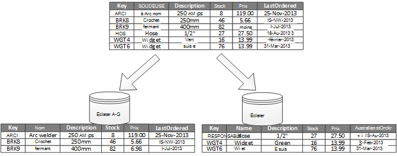
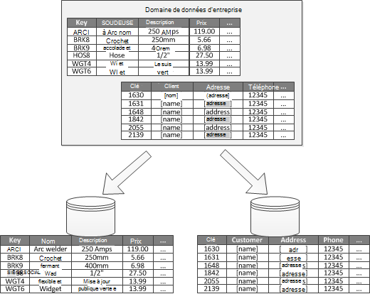
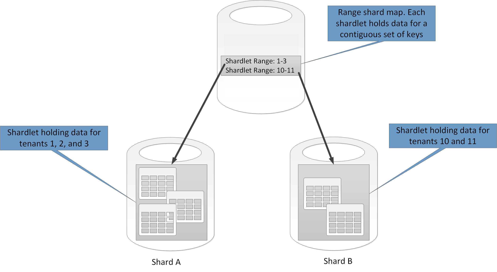
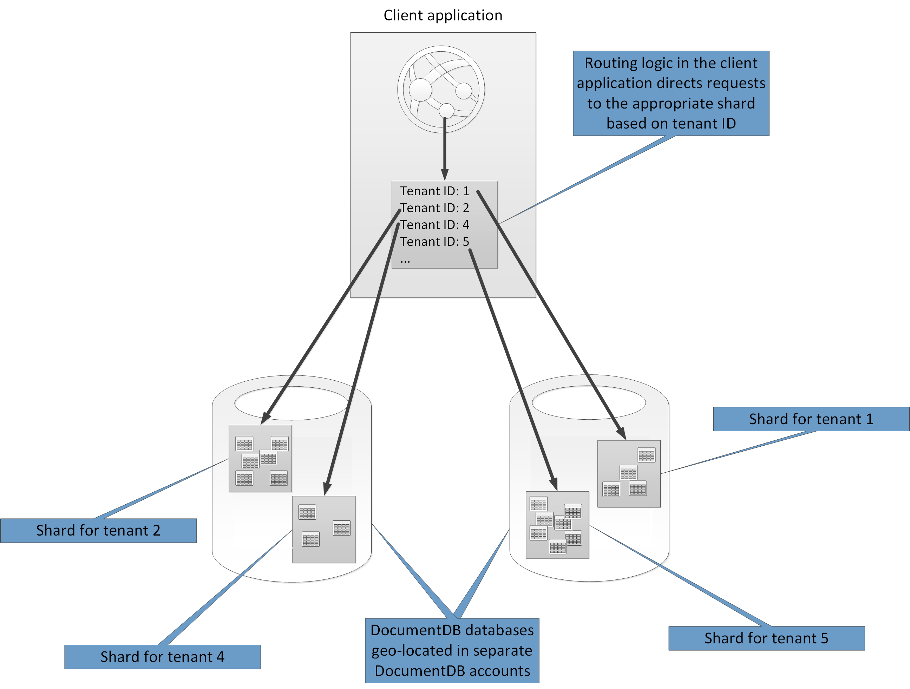

<properties
   pageTitle="Partitions conseils de données | Microsoft Azure"
   description="Conseils pour savoir comment séparer les partitions devant être gérés et consultés séparément."
   services=""
   documentationCenter="na"
   authors="dragon119"
   manager="christb"
   editor=""
   tags=""/>

<tags
   ms.service="best-practice"
   ms.devlang="na"
   ms.topic="article"
   ms.tgt_pltfrm="na"
   ms.workload="na"
   ms.date="07/14/2016"
   ms.author="masashin"/>

# Conseils de partition de données

[AZURE.INCLUDE [pnp-header](../includes/guidance-pnp-header-include.md)]

## Vue d’ensemble

Dans de nombreuses solutions à grande échelle, les données sont divisées en partitions distinctes pouvant être gérées et consultées séparément. La stratégie de partition doit être choisie avec soin à tirer le meilleur parti et en limitant les effets négatifs. Partition permet d’améliorer extensibilité élevées, réduire les conflits et optimiser les performances. Avantage de partition est qu’il peut fournir un mécanisme de diviser les données par le modèle d’utilisation. Par exemple, vous pouvez archiver des données (à froid) plus anciennes et moins actifs dans le stockage de données plus économique.

## Pourquoi partition données ?

La plupart des services et applications en nuage stockent et récupérer des données dans le cadre de leurs activités. La création de banques de données qui utilise une application peut avoir une incidence significative sur les performances, débit et extensibilité élevées d’un système. Une technique couramment appliqué dans des systèmes à grande échelle consiste à diviser les données dans des partitions distinctes.

> Le terme _partition_ qui est utilisée dans ce guide fait référence au processus de physiquement diviser les données en données distinctes. Ce n’est pas différente de celle partition de table SQL Server, qui est un concept différent.

Partition données contribuent à de nombreux avantages. Par exemple, il peut être appliqué de manière à :

- **Extensibilité du améliorer**. Lorsque vous redimensionnez un système de base de données unique, il atteignent une limite de matériel physique. Si vous divisez des données entre plusieurs partitions, chacun d'entre eux est hébergé sur un serveur différent, vous pouvez évoluer le système quasiment indéfiniment.
- **Amélioration des performances**. Opérations d’accès aux données de chaque partition intervienne sur un volume de données plus petit. Condition que les données sont partitionnées de façon appropriée, partition peut rendre votre système plus efficace. Opérations qui affectent plusieurs partitions peuvent s’exécuter en parallèle. Chaque partition peut résider près de l’application qui utilise pour réduire la latence du réseau.
- **Améliorer la disponibilité**. Séparer les données sur plusieurs serveurs permet d’éviter un point de défaillance unique. Si un serveur échoue, ou est en cours de la maintenance planifiée, seules les données de cette partition n’est pas disponible. Opérations sur d’autres partitions peuvent continuer. Augmenter le nombre de partitions réduit l’impact d’une défaillance de serveur unique relative en réduisant le pourcentage de données qui ne seront pas disponibles. Réplication de chaque partition permet de réduire les risques d’une défaillance partition unique qui peuvent affecter les opérations. Il permet également de séparer les données critiques qui doivent toujours être et hautement disponible à partir des données de faible valeur contient des exigences de disponibilité moindres (fichiers journaux, par exemple).
- **Sécurité améliorée**. Selon la nature des données et le mode de partition, il est possible de distribuer des données non sensibles et dans différentes partitions et stocke par conséquent à différents serveurs ou des données. Sécurité peut ensuite être spécifiquement optimisée pour les données sensibles.
- **Fournir une flexibilité opérationnelle**. Ce dernier offre de nombreuses opportunités fins réglage des opérations, maximiser l’efficacité administrative et en réduisant les coûts. Par exemple, vous pouvez définir différentes stratégies de gestion, suivi, sauvegarde et restauration et autres tâches d’administration en fonction de l’importance des données dans chaque partition.
- **Stockent les données au modèle d’utilisation de correspondance**. Partition permet à chaque partition d’être déployé sur un autre type de données, en fonction de coût et les fonctionnalités intégrées qu’offres du magasin de données. Par exemple, les données binaires volumineuses peuvent être stockées dans un magasin de données blob, tandis que les autres données structurées peuvent être contenues dans une base de données de document. Pour plus d’informations, voir [Création d’une solution polyglot] dans le guide des modèles et pratiques et [d’accès aux données pour les solutions hautement scalable : à l’aide de SQL, NoSQL et persistance polyglot] sur le site Web Microsoft.

Certains systèmes n’implémentent pas partition car il est considéré comme un coût plutôt que le des avantages. Raisons courantes pour cette raison d’être sont les suivantes :

- De nombreux systèmes de stockage de données ne prennent pas en charge les jointures entre partitions, et il peut être difficile de maintenir l’intégrité référentielle dans un système partitionné. Il est souvent nécessaire mettre en œuvre des jointures et les vérifications d’intégrité de code de l’application (dans la couche partition), ce qui peut entraîner e/s supplémentaires et la complexité des applications.
- La conservation de partitions n’est pas toujours une tâche simple. Dans un système dans lequel les données sont volatiles, vous devrez peut-être rééquilibrer partitions régulièrement afin de réduire les conflits et les points sensibles.
- Certains outils courants ne fonctionnent pas naturellement avec des données partitionnées.

## Concevez des partitions

Données peuvent être partitionnées de différentes manières : horizontalement, verticalement ou fonctionne. La stratégie que vous choisissez dépend de la raison pour laquelle de division les données et la configuration requise des applications et services qui utiliseront les données.

> [AZURE.NOTE] Modèles de partition décrites dans ce guide sont expliquées d’une manière indépendante de la technologie de stockage de données sous-jacente. Elles peuvent être appliquées à de nombreux types de banques de données, y compris relationnelles et question.

### Stratégies de partition

Les trois stratégies par défaut pour la partition des données sont :

- **Partition horizontale** (souvent appelée _ont_). Dans cette stratégie, chaque partition est un magasin de données dans sa propre droite, mais toutes les partitions ont le même schéma. Chaque partition est appelée un _partagé_ et conserve un sous-ensemble spécifique des données, telles que toutes les commandes pour un ensemble spécifique de clients dans une application de commerce.
- **Partition verticale**. Dans cette stratégie, chaque partition contient un sous-ensemble des champs pour les éléments dans le magasin de données. Les champs sont divisées en fonction de leur modèle d’utilisation. Par exemple, les champs fréquemment consultés peuvent être placés dans une partition verticale et moins fréquemment consultés champs dans une autre.
- **Partition fonctionnels**. Dans cette stratégie, les données sont regroupées en fonction de leur utilisation par chaque contexte limitée dans le système. Par exemple, un système de commerce électronique que met en œuvre séparer les fonctions d’entreprise pour la facturation et gestion des stocks de produit peuvent stocker les données des factures dans une partition et produit les données de stock dans une autre.

Il est important de noter que les trois stratégies décrites ici peuvent être combinées. Il se n'agit pas s’excluent mutuellement, et nous vous recommandons de mette tous les lors de la création d’un jeu de partition. Par exemple, vous pourriez diviser les données en milieu des fragments et ensuite utiliser partition verticale pour diviser plus encore les données dans chaque partagé. De même, les données dans une partition fonctionnelle peuvent être divisées en milieu des fragments (qui peuvent également être verticalement partition).

Toutefois, des exigences différentes de chaque stratégie peuvent déclencher un certain nombre de problèmes en conflit. Vous devez évaluer et équilibrer tous ces éléments lorsque vous créez un jeu de partition qui répond aux objectifs spécifiques de performances globales traitement des données pour votre système. Les sections suivantes explorent chacune des stratégies plus en détail.

### Horizontal partition (ont)

Figure 1 montre un aperçu de partition horizontale ou ont. Dans cet exemple, les données d’inventaire produit sont divisées en milieu des fragments en fonction de la clé de produit. Chaque éclater conserve les données pour une plage contiguë de clés partagé (A-G et H-Z), organisés par ordre alphabétique.

_Figure 1. Données (ont) horizontalement partition basées sur une clé de partition_

Ont vous permet de répartir la charge sur plusieurs ordinateurs, ce qui réduit les conflits et améliore les performances. Vous pouvez ajuster le système absence en ajoutant davantage milieu des fragments qui s’exécutent sur des serveurs supplémentaires.

Le facteur le plus important lors de l’implémentation cette stratégie partition est le choix de la clé ont. Il peut être difficile de modifier la clé une fois le système en opération. La clé doit s’assurer que les données sont réparties afin que la charge de travail est comme pair que possible sur les milieu des fragments.

Notez que différentes milieu des fragments n’ont pas contenir des volumes de données similaires. Au lieu de cela, le plus est important d’équilibrer le nombre de requêtes. Certains milieu des fragments peuvent être très grandes, mais chaque élément fait l’objet d’un petit nombre d’opérations d’accès. Autres milieu des fragments peuvent être plus petites, mais chaque élément est accessible beaucoup plus fréquemment. Il est également important de s’assurer qu’un seul partagé ne dépasse pas les limites d’échelle (en termes de capacité et les ressources de traitement) du magasin de données qui est utilisé pour héberger ce partagé.

Si vous utilisez un jeu ont, évitez de créer des zones sensibles (ou partitions hot) qui peut affecter les performances et la disponibilité. Par exemple, si vous utilisez un hachage d’un identificateur de client à la place de la première lettre du nom d’un client, vous empêchez la distribution ajustée qui résulte de premières lettres en communs et moins courantes. Il s’agit d’une technique classique qui vous permet de distribuer des données de manière plus égale sur partitions.

Choisissez une touche ont réduit tous les besoins futurs fractionner milieu des fragments volumineux en parties plus petites, petites milieu des fragments de fusion dans des partitions plus grandes ou modifier le schéma qui décrit les données stockées dans un ensemble de partitions. Ces opérations peuvent être très longues et peuvent nécessiter se milieu un ou plusieurs des fragments en mode hors connexion alors qu’ils effectuent.

Si le milieu des fragments sont répliquées, il est possible de conserver certaines réplica en ligne tandis que d’autres personnes sont fractionnées, fusionnées ou reconfigurés. Toutefois, le système devrez limiter les opérations qui peuvent être effectuées sur les données dans ces milieu des fragments tandis que reconfigurer intervient. Par exemple, les données dans les doubles peuvent être marquées en lecture seule pour limiter l’étendue des incohérences susceptibles de se produire pendant que milieu des fragments sont en cours restructurées.

> Pour plus d’informations et des conseils sur la plupart de ces considérations et techniques de bonnes pratiques pour la conception de banques de données qui implémentent partition horizontale, voir [motif ont].

### Partition verticale

Le plus souvent utilisé pour la partition verticale consiste à réduire les e/s et des coûts de performance associés à l’extraction les éléments qui sont accessibles plus fréquemment. Figure 2 montre un exemple de partition verticale. Dans cet exemple, des propriétés différentes pour chaque élément de données sont trouvent dans des partitions différentes. Une partition conserve les données qui se trouve plus fréquemment, y compris le nom, la description et les informations de prix des produits. Un autre conserve le volume en stock et la dernière date triée.

_Figure 2. Données verticalement partition par son modèle d’utilisation_

Dans cet exemple, l’application régulièrement des requêtes le nom du produit, la description et le prix lorsque vous affichez les détails du produit aux clients. Le niveau de stock et la date lorsque le produit a été dernière commandé par le fabricant sont stockés dans une partition distincte, car ces deux éléments sont fréquemment utilisées ensemble.

Ce modèle partition a l’avantage que les données relativement lente (nom du produit, description et prix) sont séparées à partir des données plus dynamiques (niveau boursier et dernière date ordonné). Une application peut être utile pour mettre en cache les données en mémoire lente si elle est accèdent fréquemment.

Un autre scénario pour que cette stratégie partition consiste à renforcer la sécurité des données sensibles. Par exemple, vous pouvez le faire en enregistrant les numéros de carte de crédit et les numéros de vérification de sécurité cartes correspondantes dans des partitions distinctes.

Partition verticale peut également réduire la quantité d’accès simultané est nécessaire pour les données.

> Partition verticale fonctionne au niveau de l’entité dans un magasin de données, normalisation partiellement une entité pour décomposer à partir d’un élément _large_ à un ensemble _d’affiner_ les éléments. Il est idéale pour banques de données orientée en colonne tels que HBase et Cassandra. Si les données dans une collection de colonnes ne sont probablement pas à modifier, vous pouvez également envisager l’utilisation de banques de colonne dans SQL Server.

### Partition fonctionnel

Pour les systèmes où il est possible d’identifier un contexte limité pour chaque secteur d’activité distinct ou le service dans l’application, partition fonctionnel fournit une technique pour améliorer les performances d’accès isolement et les données. Autre utilité des partition fonctionnelle consiste à séparer les données en lecture / écriture à partir des données en lecture seule qui sont utilisées pour créer un rapport. Figure 3 présente un aperçu des partition fonctionnel où les données d’inventaire sont séparées de données client.

_Figure 3. Point de vue fonctionnel partition les données par contexte délimitée ou sous-domaine_

Cette stratégie partition permettent de réduire les données access conflits entre les différentes parties d’un système.

## Concevez des partitions à extensibilité élevées

Il est essentiel de prendre en compte la taille et la charge de travail pour chaque partition et les ajustent afin que les données sont réparties pour assurer l’extensibilité maximale. Toutefois, vous devez également partition les données afin qu’elle ne dépasse pas les limites d’échelle d’un magasin partition unique.

Lorsque vous créez des partitions pour une extensibilité, procédez comme suit :

1. Analyser l’application de comprendre les modèles d’accès aux données, telles que la taille du jeu de résultats renvoyé par chaque requête, la fréquence d’accès, la latence intrinsèque à et du côté serveur calculer les exigences de traitement. Dans de nombreux cas, quelques entités principales demande la plupart des ressources de traitement.
2. Utilisez cette analyse pour déterminer les objectifs extensibilité élevées actuelles et futures, telles que la taille des données et la charge de travail. Puis distribuer les données sur les partitions pour répondre à la cible extensibilité élevées. Dans la stratégie de partition horizontale, en choisissant la clé partagé approprié est important pour vous assurer que la distribution est pair. Pour plus d’informations, consultez le [motif ont].
3. Assurez-vous que les ressources disponibles pour chaque partition sont suffisantes pour gérer les exigences extensibilité élevées en termes de débit et la taille des données. Par exemple, le nœud qui héberge une partition peut imposer une limite maximale sur la quantité d’espace de stockage, traitement power ou la bande passante réseau qu’il propose. Si les besoins en matière de stockage et de transformation des données sont susceptibles de dépasser ces limites, il peut être nécessaire affiner votre stratégie de partition ou fractionner des données supplémentaires. Par exemple, l’une des approches extensibilité élevées peuvent être pour séparer les données de journalisation les fonctionnalités des applications core. Pour cela, à l’aide de données distinctes pour empêcher les besoins de stockage total des données dépassent la limite de mise à l’échelle du nœud. Si le nombre total de banques de données dépasse la limite de nœud, il peut être nécessaire d’utiliser des nœuds de stockage distinct.
4. Surveiller le système sous utiliser pour vérifier que les données sont distribuées comme prévu et que les partitions peuvent gérer la charge imposée dessus. Il est possible que l’utilisation ne correspond pas à l’utilisation qui est prévue par l’analyse. Dans ce cas, il est parfois possible rééquilibrer les partitions. À défaut, il peut être nécessaire modifier la conception certaines parties du système pour obtenir de l’équilibre nécessaire.

Notez que certains environnements cloud affecter des ressources en ce qui concerne les limites de l’infrastructure. Ce que les limites de votre limite sélectionné fournissent suffisamment d’espace pour toute croissance prévue dans le volume de données, en termes de stockage des données, la puissance de traitement et la bande passante.

Par exemple, si vous utilisez le stockage de table Azure, un éclater occupé peut nécessiter plus de ressources que sont disponibles à une partition unique pour gérer les requêtes. (Il existe une limite au volume de requêtes qui peut être résolu en une seule partition dans un intervalle de temps particulier. Consultez la page [cibles de performances et extensibilité élevées Azure stockage] sur le site Web de Microsoft pour plus d’informations.)

 Si c’est le cas, l’éclater devrez être repartitionnées pour répartir la charge. Si la taille totale ou débit de ces tables dépasse la capacité d’un compte de stockage, il peut être nécessaire créer des comptes d’espace de stockage supplémentaire et répartir les tables sur ces comptes. Si le nombre de comptes de stockage dépasse le nombre de comptes qui sont disponibles pour un abonnement, il peut être nécessaire d’utiliser plusieurs abonnements.

## Concevez des partitions à performances des requêtes

Performances de la requête peuvent souvent être renforcée à l’aide des ensembles de données plus petits et en exécutant des requêtes en parallèle. Chaque partition doit contenir une fraction de l’ensemble de données. Cette réduction du volume de peut améliorer les performances des requêtes. Toutefois, partition n’est pas une alternative pour concevoir et configurer une base de données de manière appropriée. Par exemple, assurez-vous que les index nécessaires en place si vous utilisez une base de données relationnelle.

Lorsque vous créez des partitions de performances des requêtes, procédez comme suit :

1. Examiner les besoins de l’application et les performances :
    - Besoins de l’entreprise permet de déterminer les requêtes critiques doivent toujours effectuer rapidement.
    - Contrôler le système pour identifier les requêtes qui exécutent lentement.
    - Établir les requêtes sont effectuées plus fréquemment. Une seule instance de chaque requête peut avoir coût minimal, mais la consommation cumulée des ressources peut être significative. Il peut être utile séparer les données soient récupérées par ces requêtes dans une partition distincte, ou encore un cache.
2. Partition les données à l’origine de baisse des performances :
    - Limiter la taille de chaque partition afin que le temps de réponse de requête se trouve dans la cible.
    - Concevoir la clé partagé afin que l’application peut trouver facilement la partition si vous implémentez partition horizontale. Ainsi, la requête devoir passez en revue toutes les partitions.
    - Réfléchissez à l’emplacement d’une partition. Si possible, essayez de conserver les données dans des partitions géographiquement près les applications et les utilisateurs qui y accéder.
3. Si une entité possède des exigences de performances débit et la requête, utilisez partition fonctionnelle en fonction de cette entité. Si cela ne respecte pas la configuration requise, s’appliquent également la partition horizontale. Dans la plupart des cas, il suffit une stratégie de partition unique, mais dans certains cas, il est plus efficace pour combiner les deux stratégies.
4. Envisagez d’utiliser des requêtes asynchrones qui s’exécutent en parallèle entre partitions pour améliorer les performances.

## Concevez des partitions à disponibilité

Partition de données peut améliorer la disponibilité des applications en veillant à ce que l’ensemble du dataset ne constitue pas un point de défaillance unique et que des sous-ensembles individuels du jeu de données pouvant être gérées séparément. Réplication des partitions qui contiennent des données critiques peut également améliorer la disponibilité.

Lors de la conception et implémentation des partitions, tenez compte des facteurs suivants qui affectent la disponibilité :

- **Comment critique elles se trouvent sur les activités**. Certaines données peuvent inclure des informations critiques telles que les détails de la facture ou transactions bancaires. Autres données peuvent inclure des données opérationnelles moins importantes, telles que les fichiers journaux, traces de performances et ainsi de suite. Après avoir identifié chaque type de données, vous pouvez :
    - Le stockage de données critiques sur des partitions hautement disponible avec un plan de sauvegarde approprié.
    - Établissement de gestion séparé et surveillance mécanismes ou des procédures pour les points critiques différents chaque jeu de données. Placer les données qui a le même niveau d’importance dans la même partition afin qu’il puisse être sauvegardé ensemble à une fréquence appropriée. Par exemple, partitions qui contiennent des données pour les transactions bancaires devrez à sauvegarder plus fréquemment que les partitions contenant les informations de traçage ou de journalisation.
- **Comment les partitions individuelles pouvant être gérées**. Concevez des partitions à prendre en charge de la maintenance et gestion indépendante présente plusieurs avantages par. Par exemple :
    - Si une partition échoue, il peut être récupérée séparément sans affecter les instances des applications qui accèdent aux données dans d’autres partitions.
    - Partition des données par zone géographique permet de tâches de maintenance planifiée pour se produire en dehors des heures pour chaque emplacement. Assurez-vous que les partitions ne sont pas trop volumineux pour empêcher toute maintenance planifiée de réalisée pendant cette période.
- **Si vous voulez dupliquer des données critiques entre partitions**. Cette stratégie peut améliorer la disponibilité et les performances, bien qu’il peut également introduire des problèmes de cohérence. De temps pour les modifications apportées aux données dans une partition d’être synchronisé avec chaque réplica. Pendant cette période, des partitions différentes contiendra différentes valeurs de données.

## Comprendre comment partition affecte la conception et développement

Utilisant la partition complique la création et le développement de votre système. Vous pouvez partition comme une partie essentielle de système de conception même si le système initiale contient uniquement une partition unique. Si vous envoyez partition après coup, lorsque le système démarre à subir des problèmes de performances et extensibilité élevées, la complexité augmente, car vous disposez déjà d’un système actif à mettre à jour.

Si vous mettez à jour le système pour incorporer partition dans cet environnement, il nécessite une modification de la logique d’accès aux données. Il peut également impliquer la migration de grandes quantités de données existantes à distribuer parmi les partitions, souvent tandis que les utilisateurs souhaitent pouvoir continuer à utiliser le système.

Dans certains cas, partition n'est pas considéré comme important, car le dataset initial est petit et peut être facilement traité par un seul serveur. Cela peut être vrai dans un système qui n’est pas prévu à l’échelle au-delà de sa taille initiale, mais nombreux systèmes commerciales ont besoin pour le développer en tant que le nombre d’utilisateurs augmente. Cette extension est généralement accompagnée d’une croissance dans le volume de données.

Il est également important de comprendre que partition n’est pas toujours une fonction de banques de données de grande taille. Par exemple, un magasin de données de petite taille peut-être être fréquemment utilisé par des centaines de clients simultanées. Partition les données dans cette situation peut vous aider à réduire les conflits et améliorer les performances.

Lorsque vous créez un jeu de partition de données, tenez compte des points suivants :

- **Si possible, regrouper les données pour les opérations de base de données les plus courantes dans chaque partition pour réduire les opérations d’accès aux données entre partitions**. Interrogation entre partitions peut être plus longue qu’interroger uniquement dans une même partition, mais optimisation des partitions pour un ensemble de requêtes peut affecter d’autres jeux de requêtes. Lorsque vous ne pouvez pas éviter interrogation entre partitions, réduire le moment de la requête en cours d’exécution des requêtes en parallèle et en regroupant les résultats dans l’application. Cette approche est pas possible dans certains cas, par exemple lorsqu’il est nécessaire obtenir un résultat d’une requête et l’utiliser dans la requête suivante.
- **Si les requêtes rendre utiliser relativement statique de données de référence, par exemple code postal tables ou des listes de produits, pensez à répliquer ces données dans toutes les partitions pour réduire la configuration minimale requise pour les opérations de recherche distincte dans des partitions différentes**. Cette approche peut également réduire la probabilité que les données de référence devenir un jeu de données « actif » est soumis à un trafic dense dans l’ensemble du système. Cependant, il est un coût supplémentaire associé à synchroniser les modifications qui peuvent se produire à ces données de référence.
- **Si possible, réduisez configuration requise pour l’intégrité référentielle entre partitions verticales et fonctionnelles**. Dans ces modèles de l’application elle-même est chargée de maintenir l’intégrité référentielle entre partitions lorsque les données sont mises à jour et consommées. Requêtes qui doivent joindre des données entre plusieurs partitions s’exécutent plus lentement que les requêtes reliant les données uniquement au sein de la même partition, car l’application a généralement besoin exécuter des requêtes consécutives basés sur une touche, puis sur une clé étrangère. À la place, vous pouvez répliquer ou désélectionnez normaliser les données pertinentes. Pour réduire la durée de la requête où jointures entre partitions sont nécessaires, exécuter des requêtes en parallèle sur les partitions et de joindre les données dans l’application.
- **Prendre en compte l’effet que le jeu de partition peut-être avoir sur la cohérence des données entre partitions.** Déterminez si la cohérence forte est en réalité une obligation. En revanche, une approche commune dans le cloud consiste à mettre en œuvre la cohérence éventuelle. Les données de chaque partition sont mis à jour séparément, et la logique d’application garantit que les mises à jour sont tous a réussi. Il gère également les incohérences qui peuvent provenir de l’interrogation de données pendant l’exécution d’une opération finalement cohérente. Pour plus d’informations sur l’implémentation de la cohérence éventuelle, voir l' [Introduction à la cohérence des données].
- **Prendre en compte comment requêtes localiser la partition correcte**. Si une requête doit analyser toutes les partitions pour identifier les données nécessaires, est un impact sur les performances, même lorsque plusieurs requêtes parallèles en cours d’exécution. Requêtes qui sont utilisés avec les stratégies de partition verticales et fonctionnels peuvent naturellement spécifier les partitions. Toutefois, partition horizontale (ont) pouvez facilitent la localisation d’un élément difficile, car chaque éclater a le même schéma. Une solution standard pour ont consiste à mettre à jour un mappage qui peut être utilisé pour rechercher l’emplacement partagé pour les éléments spécifiques de données. Cette carte peut être activée dans la logique ont de l’application ou gérée par le magasin de données si elle ont transparente prend en charge.
- **Lorsque vous utilisez une stratégie de partition horizontale, envisagez régulièrement rééquilibrage au milieu des fragments**. Cela permet d’uniformiser les données par taille et la charge de travail pour réduire les zones sensibles, optimiser les performances de requête et contourner les limitations de stockage physique. Toutefois, il s’agit d’une tâche complexe qui souvent nécessite l’utilisation d’un outil personnalisé ou un processus.
- **Si vous êtes répliquer chaque partition, il offre une protection supplémentaire contre les pannes**. Si un seul réplica échoue, les requêtes peuvent être dirigés vers une copie de travail.
- **Si vous atteignez les limites physiques d’une stratégie de partition, vous devrez peut-être étendre l’extensibilité élevées vers un autre niveau**. Par exemple, si partition est au niveau de la base de données, vous devrez peut-être localiser ou répliquer partitions dans plusieurs bases de données. Si partition est déjà au niveau de la base de données, et limitations physiques sont un problème, il ne signifie que vous devez rechercher ou répliquer partitions dans plusieurs comptes d’hébergement.
- **Éviter les transactions qui accèdent aux données dans plusieurs partitions**. Certaines données banques de mettre en œuvre la cohérence et l’intégrité référentielle pour les opérations qui modifient les données, mais uniquement lorsque les données sont trouve dans une seule partition. Si vous avez besoin de prise en charge de transactions sur plusieurs partitions, vous devrez probablement implémenter dans le cadre de votre logique d’application, car les systèmes plus partition ne fournissent pas prise en charge native.

Toutes les banques de données nécessitent une gestion des opérations et analyse de l’activité. Les tâches peuvent varier de chargement des données, sauvegarder et restaurer les données, la réorganisation des données et s’assurer que le système s’exécute correctement et efficacement.

Tenez compte des facteurs suivants qui affectent la gestion des opérations :

- **Comment mettre en œuvre la gestion appropriés et des tâches opérationnelles lorsque les données sont réparties**. Ces tâches peuvent inclure des sauvegarde et restauration, l’archivage des données, surveillance le système et autres tâches d’administration. Par exemple, mise à jour cohérence logique pendant les opérations de sauvegarde et restauration peut être compliqué.
- **Comment charger les données en plusieurs partitions et ajouter de nouvelles données qui sont arrivant provenant d’autres sources**. Certains outils et utilitaires ne peut-être pas en charge les opérations de données sharded tels que le chargement de données dans la partition correcte. Cela signifie que vous devrez peut-être créer ou obtenir des nouveaux outils.
- **Comment faire pour archiver et supprimer les données à intervalles réguliers**. Pour empêcher la croissance excessive des partitions, vous devez archiver et supprimer des données à intervalles réguliers (par exemple tous les mois). Il peut être nécessaire transformer les données conformément à un schéma d’archivage différents.
- **Comment faire pour identifier les problèmes d’intégrité des données**. Envisager d’exécuter un processus périodiques, pour rechercher les problèmes d’intégrité des données telles que des données dans une partition qui fait référence à des informations manquantes dans une autre. Le processus peut essayer de corriger automatiquement ces problèmes ou déclencher une alerte pour un opérateur pour corriger les problèmes manuellement. Par exemple, dans une application de commerce, commande informations peuvent être stockées dans une partition, mais les postes qui constituent chaque commande peuvent être conservées dans une autre. Le processus de passer une commande doit ajouter des données à d’autres partitions. Si ce processus échoue, il peut être postes stockés pour lesquels il n’existe aucune commande correspondante.

Technologies de stockage des données différentes fournissent généralement leurs propres fonctionnalités pour prendre en charge partition. Les sections suivantes synthétisent les options qui sont implémentées par banques de données fréquemment utilisées par les applications Azure. Elles décrivent également les considérations relatives à la conception d’applications pour tirer le meilleur parti de ces fonctionnalités.

## Partition stratégies pour la base de données SQL Azure

Base de données SQL Azure est un relationnelles de base de données-comme-a-service qui s’exécute dans le cloud. Il est basé sur Microsoft SQL Server. Une base de données relationnelle divise les informations dans des tables et chaque table contient des informations sur les entités sous forme d’une série de lignes. Chaque ligne contient des colonnes qui contiennent les données pour les champs individuels d’une entité. La page [Quelle est la base de données SQL Azure ?] sur Microsoft site Web fournit des informations détaillées sur la création et à l’aide de bases de données SQL.

## Partition horizontale avec élastique de base de données

Une seule base de données SQL a une limite au volume de données qu’il peut contenir. Débit est limité par des facteurs architecturales et le nombre de connexions simultanées prises en charge. La fonctionnalité de base de données élastique de base de données SQL prend en charge l’évolution horizontale pour une base de données SQL. À l’aide de la base de données élastique, vous pouvez partition vos données en milieu des fragments qui sont réparties sur plusieurs bases de données SQL. Vous pouvez également ajouter ou supprimer milieu des fragments que le volume de données que vous devez gérer taille augmente ou diminue. À l’aide de la base de données élastique peut également aider à réduire les conflits à distribuer la charge sur les bases de données.

> [AZURE.NOTE] Base de données élastique ne remplace la fonctionnalité fédérations de base de données SQL Azure. Des installations peuvent être migrées vers élastique de base de données à l’aide de l’utilitaire de migration fédérations la fédération de base de données SQL. Vous pouvez également implémenter votre propre mécanisme ont si votre scénario prête pas naturellement aux fonctionnalités qui sont fournies par élastique de base de données.

Chaque partagé est implémenté comme une base de données SQL. Un partagé peut contenir plus d’un dataset (appelé un _shardlet_). Chaque base de données gère les métadonnées qui décrit le shardlets qu’il contient. Un shardlet peut être un seul élément de données, ou elle peut être un groupe d’éléments qui partagent la même clé shardlet. Par exemple, si vous êtes données ont dans une application partagée, la clé shardlet peut être l’ID de client et toutes les données pour un client donné peuvent contenir dans le cadre de la même shardlet. Données pour d’autres clients auront lieu dans différents shardlets.

Il est la responsabilité du programmeur pour associer un jeu de données avec une clé de shardlet. Une base de données SQL distincte se comporte comme un responsable de carte global partagé. Cette base de données contient la liste de tous les milieu des fragments et shardlets dans le système. Une application cliente qui accède à des données se connecte en premier éclater global carte Gestionnaire de base de données pour obtenir une copie de la carte partagé (répertoriant milieu des fragments et shardlets), laquelle il puis met en cache localement.

L’application puis utilise ces informations pour acheminer les demandes de données pour l’éclater approprié. Cette fonctionnalité est masquée par une série d’API qui figurent dans la Azure SQL de base de données élastique de base de données bibliothèque Client, qui est disponible sous forme de package NuGet. La page [vue d’ensemble des fonctionnalités de base de données élastique] sur le site Web Microsoft fournit une introduction plus complète à élastique de base de données.

> [AZURE.NOTE] Vous pouvez répliquer la base de données Gestionnaire de carte éclater globale pour réduire la latence et améliorer la disponibilité. Si vous implémentez la base de données en utilisant l’un des niveaux de prix Premium, vous pouvez configurer réplication geo active pour copier les données en permanence aux bases de données dans différentes régions. Créer une copie de la base de données de chaque région dans lequel se trouvent des utilisateurs. Puis configurez votre application pour vous connecter à cette copie pour obtenir la carte partagé.

> Une autre solution consiste à utiliser synchronisation de données SQL Azure ou un pipeline Azure Data Factory de répliquer la base de données Gestionnaire de carte éclater régions. Cette forme de réplication s’exécute régulièrement et plus appropriée si la carte éclater change rarement. En outre, la base de données Gestionnaire de carte partagé n’a pas à être créé à l’aide d’une prime tarifs niveau.

Base de données élastique fournit deux jeux de mappage des données à shardlets et en les enregistrant dans milieu des fragments :

- Une **carte d’éclater liste** décrit une association entre une seule clé et un shardlet. Par exemple, dans un système partagé, les données pour chaque client peuvent être associées à une clé unique et stockées dans sa propre shardlet. Pour garantir la confidentialité et isolement (autrement dit, pour empêcher un client de consommer les ressources de stockage de données disponibles à d’autres personnes), chaque shardlet puisse se dérouler dans sa propre partagé.

_Figure 4. À l’aide d’une carte éclater liste pour stocker des données client dans milieu des fragments distincts_

- Une **carte d’éclater range** décrit une association entre un ensemble contigus de valeurs de clé et un shardlet. Dans l’exemple partagé décrite précédemment, comme alternative à l’implémentation shardlets dédié, vous pouvez regrouper les données d’un ensemble de clients (chacun avec leur propre clé) au sein de la même shardlet. Ce modèle est moins coûteux que la première (car clients partagent les ressources de stockage de données), mais elle crée également un risque de confidentialité des données réduite et isolement.

_Figure 5. À l’aide d’une carte éclater range pour stocker des données pour une plage de clients dans un partagé_

Notez qu’un seul éclater peut contenir les données de plusieurs shardlets. Par exemple, vous pouvez utiliser shardlets liste pour stocker les données pour différentes installations non contigus dans la même partagé. Vous pouvez aussi combiner plage shardlets et shardlets de liste dans la même partagé, bien qu’ils doivent être traités via différentes cartes dans la base de données Gestionnaire de carte global partagé. (La base de données Gestionnaire de carte éclater globale peut contenir plusieurs cartes partagé.) La figure 6 illustre cette approche.

_Figure 6. Mise en œuvre éclater plusieurs cartes_

Le jeu de partition que vous implémentez peut avoir une incidence considérable sur les performances de votre système. Il peut également affecter la fréquence à laquelle milieu des fragments doivent être ajouté ou supprimé, ou la fréquence à laquelle les données doivent être repartitionnées sur milieu des fragments. Lorsque vous utilisez une base de données élastique pour données partition, tenez compte des points suivants :

- Regrouper les données qui sont utilisées ensemble dans la même partagé et éviter les opérations que vous avez besoin pour accéder aux données qui sont conservées dans plusieurs milieu des fragments. N’oubliez pas que la base de données élastique un partagé est une base de données SQL dans sa propre droite et base de données SQL Azure ne prend pas en charge les jointures de bases de données croisées (qui doivent être effectuées sur le côté client). N’oubliez pas que dans la base de données SQL Azure, contraintes d’intégrité référentielle, déclencheurs et des procédures stockées dans une base de données ne peut pas référencer les objets dans un autre. Par conséquent, ne concevoir un système qui comporte des dépendances entre milieu des fragments. Une base de données SQL possible, cependant, contenir des tables qui contiennent des copies de données de référence fréquemment utilisées par les requêtes et d’autres opérations. Ces tableaux n’avez pas doit appartenir à n’importe quel shardlet spécifique. Réplication ces données via milieu des fragments permet de supprimer la nécessité de données de la jointure qui s’étend sur les bases de données. Dans l’idéal, ces données doivent être statique ou lente pour réduire les efforts de réplication et réduire les risques de celui-ci désormais périmés.

    > [AZURE.NOTE] Base de données SQL ne prend pas en charge les jointures croisées-base de données, vous pouvez effectuer les requêtes croisées partagé avec l’API de base de données élastique. Ces requêtes peuvent en toute transparence parcourir les données contenues dans tous les shardlets qui sont référencées par une carte partagé. Le sauts élastique API de base de données croisées-éclater des requêtes vers le bas en une série de requêtes individuels (un pour chaque base de données) et puis fusionne les résultats. Pour plus d’informations, voir la page [à plusieurs éclater une requête] sur le site Web Microsoft.

- Les données stockées dans shardlets appartenant à la même carte partagé doivent avoir le même schéma. Par exemple, ne créez pas un mappage éclater liste qui pointe vers certaines shardlets contenant des données client et autres shardlets contenant des informations sur le produit. Cette règle n’est pas appliquée par élastique de base de données, mais la gestion des données et interroger devient très complexe si chaque shardlet a un schéma différent. Dans l’exemple simplement cité, un bon est solution consiste à créer deux liste éclater cartes : celui qui fait référence à des données client et une autre qui pointe vers des informations sur le produit. N’oubliez pas que les données appartenant à différents shardlets peuvent être stockées dans le même partagé.

    > [AZURE.NOTE] La fonctionnalité de requête croisée partagé de l’API de base de données élastique dépend de chaque shardlet dans l’Explorateur de partagé contenant le même schéma.

- Opérations transactions sont uniquement pris en charge pour les données contenues dans la même partagé et non à travers milieu des fragments. Transactions peuvent couvrir shardlets dans la mesure où ils font partie de la même partagé. Par conséquent, si votre logique métier doit effectuer des transactions, soit stocker les données affectées dans la même éclater ou mettre en œuvre la cohérence éventuelle. Pour plus d’informations, voir l' [Introduction à la cohérence des données].
- Placez le milieu des fragments près les utilisateurs qui accèdent aux données dans ces milieu des fragments (autrement dit, geo-Recherchez au milieu des fragments). Cette stratégie permet de réduire la latence.
- Éviter d’avoir un mélange de hautement actif (conseillées) et milieu des fragments relativement inactifs. Essayez de répartir uniformément la charge sur milieu des fragments. Cela peut nécessiter les clés shardlet de hachage.
- Si vous êtes milieu des fragments géolocalisation, vérifiez que les touches hachés correspondent aux shardlets contenus dans les milieu des fragments stockés à proximité les utilisateurs qui accèdent à ces données.
- Pour l’instant, un ensemble limité de données SQL types sont pris en charge en tant que clés shardlet ; _int, bigint, varbinary_ et _uniqueidentifier_. Les types de _int_ et _bigint_ SQL correspondent aux types de données _int_ et _long_ en c# et comporte la même plage. Le type de _varbinary_ SQL peut être géré à l’aide d’un tableau _d’octets_ en c#, et le type de _uniqueidentier_ SQL correspond à la classe _Guid_ du .NET Framework.

Comme le nom l’indique, base de données élastique rend possible pour un système ajouter et supprimer milieu des fragments que le volume de données augmente et diminue. L’API dans la bibliothèque de client de la base de données élastique de base de données SQL Azure activer une application créer et supprimer milieu des fragments dynamiquement (et en toute transparence mettre à jour le Gestionnaire de carte éclater). Toutefois, la suppression d’un partagé est une opération de destruction qui nécessite également la suppression de toutes les données dans cette partagé.

Si une application doit fractionner une partagé en deux milieu des fragments distincts ou combiner milieu des fragments, élastique base de données fournit un service de fractionnement fusion distinct. Ce service s’exécute dans un service cloud hébergé (qui doit être créé par le développeur) et déplace les données en toute sécurité entre milieu des fragments. Pour plus d’informations, consultez la rubrique [mise à l’échelle à l’aide de l’outil de fusion et fractionnement élastique de base de données] sur le site Web Microsoft.

## Stratégies partition d’espace de stockage Azure

Stockage Azure fournit trois abstractions pour la gestion des données :

- Stockage de tables, qui mettent en œuvre, stockage scalable structure. Une table contient un ensemble d’entités, chacun d'entre eux peut inclure un ensemble de propriétés et les valeurs.
- Stockage d’objets BLOB, qui fournit le stockage de fichiers et des objets de grande taille.
- Stockage files d’attente, qui prend en charge la messagerie asynchrone fiable entre les applications.

Stockage de tables et de stockage d’objets blob sont banques essentiellement clé-valeur qui sont optimisés pour mettre en attente des données structurées et respectivement. Files d’attente de stockage fournissent un mécanisme de création d’applications souple, format SVG. Stockage de table, le stockage blob et files d’attente de stockage sont créés dans le cadre d’un compte de stockage Azure. Comptes de stockage prennent en charge trois formes de redondance :

- **Stockage localement redondants**conserve trois copies de données au sein d’un centre de données unique. Ce formulaire de redondance protège contre les défaillances matérielles mais pas contre un incident qui englobe le centre de données entier.
- Stockage redondants **zone**, qui conserve trois copies de données réparties travers différents centres de données au sein de la même région (ou deux régions géographiquement fermeture). Ce formulaire de redondance peut se protéger contre les incidents qui se produisent dans un centre de données unique, mais ne peut pas protéger contre les réseaux de grande envergure déconnecte qui affectent une région entière. Notez que la zone redondants stockage n’est actuellement actuellement disponible pour les objets BLOB bloc.
- **Stockage Geo redondants**, ce qui conserve six copies de données : trois copies dans une zone géographique (votre région locale) et une autre copie trois dans une région à distance. Ce formulaire de redondance fournit le niveau de sinistre.

Microsoft a publié cibles extensibilité du stockage Azure. Pour plus d’informations, consultez la page [cibles de performances et extensibilité élevées Azure stockage] sur le site Web Microsoft. Pour l’instant, la capacité de compte espace de stockage total ne peut pas dépasser 500 To. (Y compris la taille des données qui sont conservées dans le stockage de tables et stockage d’objets blob, ainsi que les messages en attente qui sont trouvent dans la file d’attente stockage).

Le taux de requête maximale (en supposant une entité 1 Ko, blob ou taille du message) est 20 kb/s. Si votre système est susceptible de dépasser ces limites, vous pouvez partition la charge entre plusieurs comptes de stockage. Un seul abonnement Azure peut créer jusqu'à 100 comptes de stockage. Toutefois, notez que ces limites peuvent modifier le temps.

## Partition stockage de table Azure

Stockage de table Azure est un magasin clé-valeur qui s’appuie sur partition. Toutes les entités sont stockées dans une partition et partitions sont gérées en interne par le stockage de table Azure. Chaque entité qui est stockée dans un tableau doit fournir une clé de deux parties qui inclut :

- **Clé de partition**. Il s’agit d’une valeur de chaîne qui détermine dans quelle partition stockage de table Azure place l’entité. Toutes les entités avec la même clé partition seront stockées dans la même partition.
- **La clé de ligne**. Il s’agit d’une autre valeur de chaîne qui identifie l’entité au sein de la partition. Toutes les entités au sein d’une partition sont lexicalement, triées par ordre croissant, par cette touche. La combinaison de touches partition clé/ligne doit être unique pour chaque entité et ne peut pas dépasser 1 Ko longueur.

Le reste des données d’une entité se compose des champs définis par l’application. Aucune schémas particuliers ne sont appliqués, et chaque ligne peut contenir un autre jeu de champs définis par l’application. La seule limitation est que la taille maximale d’une entité (y compris les touches partition et ligne) est actuellement 1 Mo. La taille maximale d’un tableau est de 200 To, bien que ces chiffres peuvent changer à l’avenir. (Consultez la page [cibles de performances et extensibilité élevées Azure stockage] sur le site Web de Microsoft pour obtenir les dernières informations sur ces limites.)

Si vous essayez de stocker entités dépassant cette capacité, vous pouvez les fractionner en plusieurs tables. Utilisez partition verticale pour séparer les champs dans les groupes qui sont susceptibles d’être accessible ensemble.

Figure 7 illustre la structure logique d’un compte de stockage exemple (données Contoso) pour une application de commerce fictif. Le compte de stockage contient trois tables : informations client, les informations de produit et les informations d’ordre. Chaque table possède plusieurs partitions.

Dans la table Infos client, les données sont réparties en fonction de la ville dans lequel se trouve le client et la clé de ligne contient l’ID de client. Dans la table d’informations sur les produits, les produits sont répartis par catégorie de produit et la clé de ligne contient le numéro de référence. Dans la table d’informations sur l’ordre, les commandes sont répartis par la date à laquelle elles ont été placées et la clé de ligne indique l’heure de que l’ordre de réception. Notez que toutes les données est organisée par la clé de ligne dans chaque partition.

_Figure 7. Les tables et les partitions dans un compte de stockage d’exemple_

> [AZURE.NOTE] Stockage de table Azure ajoute également un champ d’horodatage à chaque entité. Le champ d’horodatage est géré par le stockage de table et est mis à jour chaque fois que l’entité est modifiée et écrite revenir sur une partition. Le service de stockage de table utilise ce champ pour implémenter simultané. (Chaque fois qu’une application écrit une entité sur le stockage de table, le service de stockage de table compare la valeur de l’horodatage dans l’entité en cours d’écriture avec la valeur qui se trouve dans le stockage de tables. Si les valeurs sont différentes, cela signifie qu’une autre application doit avoir modifié l’entité dans la mesure où il a été récupéré dernière et que l’opération d’écriture échoue. Ne modifiez pas ce champ dans votre propre code et ne spécifiez pas une valeur pour ce champ lorsque vous créez une nouvelle entité.

Stockage de table Azure utilise la clé de partition pour déterminer comment stocker les données. Si une entité est ajoutée à une table avec une clé de partition précédemment inutilisés, stockage de table Azure crée une nouvelle partition pour cette entité. Autres entités avec la même clé partition seront stockées dans la même partition.

Ce mécanisme efficace met en œuvre une stratégie horizontale automatique. Chaque partition est stockée sur un serveur unique dans un centre de données Azure pour vous assurer que les requêtes qui extraient des données à partir d’une seule partition s’exécutent rapidement. Toutefois, des partitions différentes peuvent être distribuées sur plusieurs serveurs. En outre, un seul serveur peut héberger plusieurs partitions si ces partitions sont limitées en taille.

Lorsque vous concevez vos entités pour le stockage de table Azure, tenez compte des points suivants :

- La sélection des valeurs clés partition clé et ligne doit par ailleurs par l’effort dans lequel les données sont accessibles. Choisissez une combinaison de touches clé/ligne partition qui prend en charge la majorité de vos requêtes. Les requêtes plus efficaces récupérer des données en spécifiant la clé de partition et la clé de ligne. Requêtes qui spécifient une clé de partition et une plage de clés de ligne peuvent être effectuées par une seule partition d’analyse. Ceci est relativement rapide, car les données sont conservées dans l’ordre de clés de lignes. Si les requêtes ne spécifier quelle partition à analyser, clé de partition peut nécessiter de stockage de table Azure pour analyser toutes les partitions pour vos données.

    > [AZURE.TIP] Si une entité possède une clé naturelle, puis utilisez-le comme clé partition et spécifiez une chaîne vide comme la clé de ligne. Si une entité a une clé composite comprenant deux propriétés, sélectionnez la propriété plus lente modifier comme clé de partition et l’autre comme la clé de ligne. Si une entité comporte plus de deux propriétés de clé, utilisez une concaténation des propriétés pour fournir les clés de partition et de ligne.

- Si vous effectuez régulièrement des requêtes qui recherchent des données à l’aide de champs autre que les touches partition et ligne, envisagez d’implémenter le [modèle de table index].
- Si vous générez des clés de partition en utilisant une augmentation monotone ou en diminuant la séquence (par exemple, « 0001 », « 0002 », « 0003 » et ainsi de suite) et chaque partition ne comporte que peu de données, stockage de table Azure peut regrouper physiquement ces partitions collaborer sur le même serveur. Ce mécanisme suppose que l’application est probablement exécuter des requêtes sur une plage de cellules contiguë des partitions (requêtes plage) et est optimisée pour ce cas. Toutefois, cette approche peut affecter les zones sensibles axées sur un serveur unique, car toutes les insertions de nouvelles entités sont susceptibles d’être concentré à une fin ou l’autre des plages contiguës. Il peut également réduire extensibilité élevées. Pour répartir la charge de manière plus égale sur serveurs, envisagez de hachage clé de partition pour rendre la séquence plus aléatoire.
- Stockage de table Azure prend en charge les opérations de transactions pour entités appartenant à la même partition. Cela signifie qu’une application peut effectuer plusieurs insertion, mise à jour, supprimer, remplacer ou opérations de fusion comme une unité atomique (à condition que la transaction n’inclut pas plus de 100 entités et la charge utile de la demande ne dépasse pas 4 Mo). Opérations qui s’étalent sur plusieurs partitions ne sont pas transactions et il est nécessaire d’implémenter la cohérence éventuelle comme décrit à l' [Introduction à la cohérence des données]. Pour plus d’informations sur le stockage de tables et les transactions, accédez à la page [transactions de groupe l’entité exécution] sur le site Web Microsoft.
- Donner une attention particulière au niveau de la clé de partition pour les raisons suivantes :
    - L’utilisation de la même clé partition pour chaque entité provoque le service de stockage de table créer une seule grande partition conservées sur un serveur. Cette empêche d’évoluer et répartition à la place de la charge sur un serveur unique. Par conséquent, cette approche consiste uniquement pour les systèmes qui gèrent un petit nombre d’entités. Toutefois, cette approche assure-t-il que toutes les entités peuvent participer à regrouper les transactions entité.
    - À l’aide d’une clé de partition unique pour chaque entité provoque le service de stockage de table créer une partition distincte pour chaque entité, ce qui peut provoquer un grand nombre de petites partitions (selon la taille des entités). Cette approche est plus scalable de l’utilisation d’une clé de partition unique, mais entité groupe transactions n’est pas possibles. En outre, les requêtes qui extraient plusieurs entités peuvent impliquent la lecture à partir de plusieurs serveurs. Toutefois, si l’application effectue des requêtes de plage, puis en utilisant une séquence monotone pour générer les clés de partition peut-être vous aider à optimiser ces requêtes.
    - Grâce au partage clé de partition sur un sous-ensemble d’entités, vous pouvez regrouper les entités dans la même partition liées. Opérations qui impliquent entités associées peuvent être effectuées à l’aide de regrouper les transactions entité, et les requêtes qui extraient un ensemble d’entités associées peuvent être satisfaites en accédant à un seul serveur.

Pour plus d’informations sur les données de partition dans le stockage de table Azure, voir l’article [guide de conception de table Azure stockage] sur le site Web Microsoft.

## Partition stockage d’objets blob Azure

Stockage d’objets blob Azure rend possible contenir des objets binaires volumineux--actuellement jusqu'à 200 Go taille pour les objets BLOB bloc ou 1 To pour les objets BLOB de page. (Pour obtenir les dernières informations, accédez à la page [cibles de performances et extensibilité élevées Azure stockage] sur le site Web Microsoft.) Utiliser des objets BLOB bloc dans des scénarios tels que la diffusion en continu où vous devez pour charger ou télécharger rapidement de grands volumes de données. Utiliser des objets BLOB de page pour les applications qui nécessitent aléatoire plutôt que d’en série accès à certaines parties des données.

Chaque blob (bloc ou page) est stockée dans un conteneur dans un compte de stockage Azure. Vous pouvez utiliser conteneurs pour regrouper des objets BLOB associées qui ont les mêmes exigences de sécurité, bien que ce regroupement est logique plutôt que physique. À l’intérieur d’un conteneur, chaque blob comporte un nom unique.

Stockage d’objets BLOB est regroupée automatiquement par le nom d’objets blob. Chaque blob est conservé dans sa propre partition. Objets BLOB dans le même conteneur ne pas partagent une partition. Cette architecture permet de stockage d’objets blob Azure à équilibrer la charge sur les serveurs en toute transparence, car des objets BLOB différentes dans le même conteneur peuvent être distribuées sur des serveurs différents.

Les actions de l’écriture d’un seul bloc (blob bloc) ou une page (blob page) sont atomiques, mais les opérations qui s’étalent sur blocs, les pages ou des objets BLOB ne sont pas. Si vous avez besoin garantir la cohérence lorsque vous effectuez les opérations d’écriture entre blocs, pages et des objets BLOB, souscrire un verrou en écriture à l’aide d’un contrat de location blob.

Stockage d’objets blob Azure prend en charge les taux de transfert de jusqu'à 60 Mo par seconde ou 500 demandes par seconde pour chaque blob. Si vous envisagez de passer outre ces limites et les données blob sont relativement statiques, envisagez de réplication des objets BLOB à l’aide du réseau de distribution de contenu Azure. Pour plus d’informations, consultez la page [à l’aide de contenu réseau de distribution pour Azure] sur le site Web Microsoft. Pour obtenir des conseils supplémentaires et les considérations, voir [à l’aide de contenu réseau de distribution pour Azure].

## Partition files d’attente de stockage Azure

Files d’attente de stockage Azure permettent d’implémenter la messagerie asynchrone entre les processus. Un compte de stockage Azure peut contenir un nombre quelconque de files d’attente, et chaque file d’attente peut contenir un ou plusieurs messages. La seule limitation est l’espace disponible dans le compte de stockage. La taille maximale d’un message individuel est 64 Ko. Si vous avez besoin des messages plus grand que cela, vous pouvez utiliser à la place des files d’attente Bus des services Azure.

Chaque file d’attente de stockage comporte un nom unique au sein du compte de stockage qui le contient. Azure partitions files d’attente en fonction du nom. Tous les messages de la même file d’attente sont stockés dans la même partition, qui est contrôlée par un seul serveur. Différentes files d’attente peuvent être gérés par des serveurs distincts pour aider à l’équilibrage de la charge. L’allocation de files d’attente aux serveurs est transparente aux applications et aux utilisateurs.

 Dans une application à grande échelle, n’utilisez pas la même file d’attente de stockage pour toutes les instances de l’application, car cette approche peut entraîner le serveur qui héberge la file d’attente pour devenir une zone réactive. À la place, utilisez différentes files d’attente pour différentes zones fonctionnelles de l’application. Files d’attente de stockage Azure ne prennent pas charge transactions, dirigeant les messages vers différentes files d’attente doit avoir un impact limité sur la cohérence de messagerie.

Une file d’attente de stockage Azure peut gérer jusqu'à 2 000 messages par seconde.  Si vous avez besoin traiter les messages à un rythme supérieur que cela, envisagez de créer plusieurs files d’attente. Par exemple, dans une application globale, créer des files d’attente de stockage distinct dans les comptes de stockage distincte pour gérer les instances de l’application en cours d’exécution dans chaque région.

## Partition stratégies Bus des services Azure

Bus des services Azure utilise un agent de message pour gérer les messages qui sont envoyés à une file d’attente de Bus de Service ou de la rubrique. Par défaut, tous les messages qui sont envoyés à une file d’attente ou une rubrique sont gérées par la même procédure intermédiaire message. Cette architecture pouvez placer une limitation sur la vitesse globale de la file d’attente. Toutefois, vous pouvez également diviser un file d’attente ou une rubrique lorsqu’elle est créée. Pour cela, en définissant la propriété _EnablePartitioning_ de la description de la file d’attente ou rubrique _true_.

Un partitionnée file d’attente ou une rubrique est divisée en plusieurs fragments, chacun d'entre eux est sauvegardée par une banque de messages séparée et intermédiaire du message. Bus des services est responsable de la création et la gestion de ces fragments. Lorsqu’une application envoie un message à une file d’attente partitionnée ou rubrique, Bus des services affecte le message vers un fragment de cette file d’attente ou une rubrique. Lorsqu’une application reçoit un message à partir d’un abonnement ou file d’attente, Bus des services vérifie chaque fragment du message disponible suivante et puis passe à la demande de traitement.

Cette structure vous aide à distribuer la charge sur agents message et banques de messages augmentant progressivement extensibilité élevées et améliorer la disponibilité. Si la base de messages intermédiaire ou d’un message pour un seul fragment est temporairement indisponible, Bus des services pouvez récupérer des messages à partir d’un des fragments disponibles restants.

Service Bus affecte un message vers un fragment comme suit :

- Si le message fait partie d’une session, tous les messages avec la même valeur pour la propriété _ID de session_ sont envoyés à la même fragment.
- Si le message n’appartient pas à une session, mais l’expéditeur a spécifié une valeur pour la propriété _PartitionKey_ , tous les messages avec la même valeur _PartitionKey_ sont envoyés à la même fragment.

    > [AZURE.NOTE] Si les propriétés de _l’ID de session_ et _PartitionKey_ sont tous deux spécifiés, puis ils doivent être définis sur la même valeur ou le message sera rejeté.
- Si les propriétés _d’ID de session_ et _PartitionKey_ d’un message ne sont pas spécifiées, mais la détection des doublons est activée, la propriété _MessageId_ servira. Tous les messages avec le même _MessageId_ seront dirigés vers la même fragment.
- Si les messages ne comportent pas de propriété d’un _ID de session, PartitionKey,_ ou _MessageId_ , puis Bus des services affecte aux fragments dans un ordre séquentiel. Si un fragment n’est pas disponible, Bus des services sera passez à l’autre. Cela signifie qu’une défaillance temporaire dans l’infrastructure de messagerie n’entraîne pas l’opération d’envoi de message Échec.

Tenez compte des points suivants lorsque vous décidez si ou comment partition un file d’attente Bus des services ou une rubrique :

- Rubriques et files d’attente de Bus de Service sont créés dans le cadre d’un espace de noms Bus des services. Service Bus permet actuellement jusqu'à 100 files d’attente partitionnées ou rubriques sont affichées par l’espace de noms.
- Chaque espace de noms Bus des services impose des quotas sur les ressources disponibles, telles que le nombre d’abonnements par sujet, le nombre de simultanées envoyer et recevoir des demandes par seconde et le nombre maximal de connexions simultanées qui peuvent être établies. Ces quotas sont présentées sur le site Web Microsoft dans la page [quotas Bus des services]. Si vous prévoyez de dépassement de ces valeurs, puis créer des espaces de noms supplémentaires avec leurs propres files d’attente et les rubriques et répartir le travail sur ces espaces de noms. Par exemple, dans une application globale, créer des espaces de noms distincts dans chaque région et configurer les instances de l’application pour utiliser les files d’attente et les rubriques dans l’espace de noms le plus proche.
- Les messages envoyés dans le cadre d’une transaction doivent spécifier une clé de partition. Cela peut être une propriété _ID de session_, _PartitionKey_ou _MessageId_ . Tous les messages envoyés dans le cadre de la même transaction doivent spécifier la même clé partition, car ils doivent être gérées par la même procédure intermédiaire message. Vous ne pouvez pas envoyer des messages vers différentes files d’attente ou rubriques dans la même transaction.
- Rubriques et files d’attente partitionnées ne peut pas être configurés pour être supprimés automatiquement lorsqu’ils deviennent inactifs.
- Rubriques et files d’attente partitionnées ne peut pas actuellement servir avec l’avancées Message Queuing Protocol (AMQP) si vous créez des solutions de disponibilité sur plusieurs plateformes ou hybride.

## Stratégies partition d’Azure DocumentDB les bases de données

DocumentDB Azure est une base de données NoSQL peut stocker des documents. Un document dans une base de données DocumentDB est une représentation JSON numéro de série d’un objet ou autre élément de données. Aucun schéma fixe n’est appliquées sauf que chaque document doit contenir un ID unique.

Documents sont organisés en collections. Vous pouvez regrouper les documents connexes dans une collection de sites. Par exemple, dans un système qui conserve les entrées de blogs, vous pouvez stocker le contenu de chaque billet de blog en tant que document dans une collection de sites. Vous pouvez également créer des collections de sites pour chaque type d’objet. Par ailleurs, dans une application partagée, tel qu’un système où différents auteurs contrôler et gérer leurs propre billets de blog, vous pouvez partition blogs par auteur et créer des collections de sites distinctes pour chaque auteur. L’espace de stockage alloué aux collections est élastique et peut réduire ou augmenter selon vos besoins.

Collections de document fournissent un mécanisme naturel de division de données au sein d’une seule base de données. En interne, une base de données DocumentDB peut s’étalent sur plusieurs serveurs et peut essayer répartir la charge par répartir des collections de serveurs. Mise en œuvre ont la façon la plus simple consiste à créer une collection de sites pour chaque partagé.

> [AZURE.NOTE] Chaque base de données DocumentDB ayant un _niveau de performance_ qui détermine la quantité de ressources qu'il obtient. Un niveau de performance est associé à une limite de taux _unitaires demande_ (demandeur). La limite de taux demandeur indique le volume de ressources exclusif réservée et pouvant être afin d’utiliser par cette collection de sites. Le coût d’une collection dépend du niveau de performance qui est sélectionné pour cette collection de sites. Les performances est élevé au niveau (et la limite de taux demandeur) est élevé frais. Vous pouvez ajuster le niveau de performance d’une collection de sites à l’aide du portail Azure. Pour plus d’informations, consultez la page [des niveaux de Performance dans DocumentDB] sur le site Web Microsoft.

Toutes les bases de données sont créés dans le contexte d’un compte DocumentDB. Un seul compte DocumentDB peut contenir plusieurs bases de données, et spécifie dans quelle région les bases de données sont créés. Chaque compte DocumentDB garantit également un son propre contrôle d’accès. Vous pouvez utiliser des comptes DocumentDB à geo-recherchez milieu des fragments (collections au sein de bases de données) à proximité les utilisateurs ayant besoin d’y accéder et appliquer des restrictions de sorte que seuls les utilisateurs peuvent se connecter à leur.

Chaque compte DocumentDB dispose d’un quota qui limite le nombre de bases de données et de collections de sites qu’il peut contenir et la quantité de stockage de documents n’est disponible. Ces limites sont susceptibles d’être modifiées, mais sont décrites dans la page [quotas et les limites de DocumentDB] sur le site Web Microsoft. Il est théoriquement possible que si vous implémentez un système où tous les milieu des fragments appartiennent à la même base de données, vous risquez d’atteindre la limite de capacité de stockage du compte.

Dans ce cas, vous devrez peut-être créer des bases de données et des comptes supplémentaires DocumentDB et distribuer au milieu des fragments sur ces bases de données. Toutefois, même si vous êtes probablement pas atteindre la capacité de stockage d’une base de données, il est recommandé d’utiliser plusieurs bases de données. C’est parce que chaque base de données possède son propre jeu d’utilisateurs et autorisations, et que vous pouvez utiliser ce mécanisme pour isoler l’accès aux collections sur une base par base de données.

Figure 8 illustre la structure de haut niveau de l’architecture DocumentDB.

_Figure 8.  La structure de l’architecture DocumentDB_

Il s’agit de la tâche de l’application cliente pour envoyer les requêtes vers l’éclater approprié, généralement en mettant en œuvre son propre mécanisme de mappage en fonction de certains attributs des données qui définissent la clé partagé. Figure 9 montre deux bases de données DocumentDB, chacun contenant deux collections faisant office de milieu des fragments. Les données sont sharded par un ID de client et contient les données pour un client spécifique. Les bases de données sont créés dans des comptes DocumentDB distincts. Ces comptes se trouvent dans la même région en tant que les clients dont ils contiennent des données. La logique de routage dans l’application cliente utilise l’ID de client comme clé partagé.

_Figure 9. Mise en œuvre ont à l’aide d’une base de données Azure DocumentDB_

Tenez compte des points suivants lorsque vous décidez de mode de partition des données avec une base de données DocumentDB :

- **Les ressources disponibles pour une base de données DocumentDB sont soumis aux limitations de quota du compte DocumentDB**. Chaque base de données peut contenir un nombre de collections de sites (à nouveau, il existe une limite), et chaque collection de sites est associé à un niveau de performance qui régit la limite de taux demandeur (débit réservé) pour cette collection de sites. Pour plus d’informations, accédez à la page [les quotas et les limites de DocumentDB] sur le site Web Microsoft.
- **Chaque document doit avoir un attribut qui peut être utilisé pour identifier ce document au sein de la collection de sites dans laquelle il est stocké**. Cet attribut est différent de la clé partagé, qui définit la collection qui conserve le document. Une collection de sites peut contenir un grand nombre de documents. En principes, il est limitée uniquement par la longueur maximale de l’ID de document. L’ID de document peut contenir jusqu'à 255 caractères.
- **Toutes les opérations par rapport à un document sont exécutées dans le contexte d’une transaction. Transactions dans les bases de données DocumentDB sont adaptées à la collection de sites dans laquelle se trouve le document.** Si une opération échoue, le travail qu’il a effectué est annulé. Lorsqu’un document est soumis à une opération, toutes les modifications apportées sont soumis aux instantané niveau d’isolement. Ce mécanisme garantit que si, par exemple, une demande pour créer un nouveau document échoue, un autre utilisateur qui effectue une requête simultanément la base de données ne voit pas un document partiel est alors supprimé.
- **Requêtes de base de données DocumentDB sont appliquent également à niveau de la collection**. Une seule requête peut récupérer des données à partir d’une collection de sites. Si vous avez besoin extraire des données provenant de plusieurs collections, vous devez interroger chaque collection individuellement et fusionner les résultats dans le code de votre application.
- **Bases de données DocumentDB prend en charge les éléments programmables qui peuvent également être stockés dans une collection de sites avec les documents**. Ces incluent les procédures stockées, des fonctions définies par l’utilisateur et des déclencheurs (écrits en JavaScript). Ces éléments peuvent accéder à n’importe quel document dans la même collection. En outre, ces éléments exécution, soit à l’intérieur de l’étendue de la transaction ambiance (dans le cas d’un déclencheur déclenchant comme le résultat de créer, supprimer ou remplacer l’opération effectuée par rapport à un document), ou à partir d’une nouvelle transaction (dans le cas d’une procédure stockée qui est exécutée en tant que le résultat d’une demande de client explicite). Si une exception est le code dans un élément programmable, la transaction est annulée. Vous pouvez utiliser les procédures stockées et des déclencheurs pour maintenir l’intégrité et la cohérence des documents, mais ces documents doivent être tous dans la même collection.
- **Les collections que vous souhaitez stocker dans les bases de données dans un compte DocumentDB doivent être probablement pas dépasse les limites de débit définies par les niveaux de performances des collections**. Ces limites sont décrites dans la page [Gérer les DocumentDB capacité doit] sur le site Web Microsoft. Si vous envisagez d’atteint ces limites, pensez à fractionner collections entre bases de données sur différents comptes DocumentDB pour réduire la charge par collection de sites.

## Stratégies partition d’Azure recherche

La possibilité de rechercher des données est souvent la méthode principale de navigation et d’exploration qui est fournie par de nombreuses applications web. Il permet aux utilisateurs d’accéder à des ressources rapidement (par exemple, produits dans une application de commerce) en fonction des combinaisons de critères de recherche. Le service de recherche Azure fournit des fonctions de recherche en texte intégral sur le contenu web et inclut des fonctionnalités telles que les requêtes semi-automatique, suggérés basées sur près de correspondances et la navigation par facettes. Une description complète de ces fonctionnalités n’est disponible dans la page [What recherche Azure ?] sur le site Web Microsoft.

Recherche Azure stocke la recherche de contenu en tant que documents JSON dans une base de données. Vous définissez des index qui spécifient les champs de recherche dans ces documents et fournissent ces définitions à Azure recherche. Lorsqu’un utilisateur envoie une demande de recherche, recherche Azure utilise les index appropriés pour rechercher des éléments correspondants.

Pour réduire les conflits, le stockage utilisé par la recherche Azure peut être divisé en 1, 2, 3, 4, 6 ou 12 partitions et chaque partition peut être répliquée jusqu'à 6 heures. Le produit du nombre de partitions multipliée par le nombre de réplicas est appelé l' _unité de recherche_ (so). Une seule instance d’Azure recherche peut contenir un maximum de 36 SUs (une base de données avec 12 partitions prend uniquement en charge un maximum de 3 réplicas).

Vous êtes facturé pour chaque so alloué à votre service. À mesure que le volume d’augmentations de contenu que vous pourrez recherches ou le taux de demandes de recherche augmente, vous pouvez ajouter SUs sur une instance existante de recherche Azure pour gérer la charge supplémentaire. Recherche Azure lui-même répartit uniformément les documents sur les partitions. Aucune stratégies partition manuelles ne sont actuellement prises en charge.

Chaque partition peut contenir un maximum de 15 millions de documents ou occuper 300 Go d’espace de stockage (selon ce qui est plus petit). Vous pouvez créer jusqu'à 50 à partir d’index. Les performances du service varient et dépendant de la complexité des documents, les index disponibles et les effets de latence du réseau. En moyenne, un seul réplica (1 so) doit être en mesure de gérer 15 requêtes par seconde (QPS), bien que nous vous recommandons d’effectuer comparative avec vos propres données pour obtenir une mesure plus précise de débit. Pour plus d’informations, consultez la page [des limites de Service de recherche Azure] sur le site Web Microsoft.

> [AZURE.NOTE] Vous pouvez stocker un ensemble limité de types de données dans les documents que vous pourrez recherches, y compris les chaînes, booléens, des données numériques, données de date/heure et des données géographiques. Pour plus d’informations, consultez la page [types de données pris en charge (Azure recherche)] sur le site Web Microsoft.

Vous avez un contrôle limité sur comment Azure recherche partitions de données pour chaque instance du service. Toutefois, dans un environnement global vous pourrez peut-être améliorer les performances et réduire la latence et conflit davantage par partition le service lui-même à l’aide d’une des stratégies suivantes :

- Créer une instance de recherche Azure dans chaque région géographique et vérifiez que les applications clientes sont dirigées vers le plus proche de l’instance disponible. Cette stratégie nécessite que les mises à jour de la recherche de contenu sont répliquées au moment opportun dans toutes les instances du service.

- Créez deux niveaux de recherche Azure :
    - Un service local dans chaque région qui contient les données plus fréquemment utilisées par les utilisateurs de cette zone. Les utilisateurs peuvent diriger les demandes ici pour obtenir les résultats rapides, mais limités.
    - Service global qui comprend toutes les données. Les utilisateurs peuvent diriger les demandes ici pour obtenir les résultats plus lentes mais plus complètes.

Cette approche est la mieux adaptée lorsqu’il y a une variante régionale significatif dans les données qui sont en cours de recherche.

## Stratégies partition d’Azure Redis Cache

Cache Redis Azure fournit un service de mise en cache partagé dans le nuage est basé sur le magasin de données de la valeur de clé Redis. Comme son nom l’indique, Azure Redis Cache est destiné à une solution mise en cache. Utiliser uniquement de suspension des données transitoires et non comme un magasin de données permanentes. Applications qui utilisent Azure Redis Cache doivent être en mesure de continuer à fonctionner si le cache n’est pas disponible. Cache Redis Azure prend en charge la réplication principal et secondaire pour augmenter la disponibilité, mais actuellement les limites de la taille maximale de cache à 53 go. Si vous avez besoin de davantage d’espace que cela, vous devez créer cache supplémentaires. Pour plus d’informations, accédez à la page [Azure Redis Cache] sur le site Web Microsoft.

Partition d’un magasin de données Redis consiste à séparer les données pour plusieurs instances du service Redis. Chaque instance constitue une partition unique. Cache Redis Azure résume les services Redis derrière une façade et ne les expose pas directement. La façon la plus simple d’implémenter partition consiste à créer plusieurs instances de Cache Redis Azure et répartir les données entre eux.

Vous pouvez associer chaque élément de données avec un identificateur (une clé de partition) qui spécifie le cache stocke l’élément de données. La logique d’application client peut ensuite utiliser cet identificateur pour acheminer les requêtes vers la partition appropriée. Ce modèle est très simple, mais si le jeu de partition modifie (par exemple, si les instances de Cache Redis Azure supplémentaires sont créées), les applications clientes peuvent doivent être reconfigurés.

Redis native (pas Azure Redis Cache) prend en charge côté serveur partition basée sur Redis cluster. Dans cette approche, vous pouvez diviser les données uniformément sur serveurs à l’aide d’un mécanisme de hachage. Chaque serveur Redis stocke les métadonnées qui décrivent la plage de clés de hachage contenant la partition, et contient également des informations sur le hachage clés se trouvent dans les partitions sur d’autres serveurs.

Applications clientes simplement envoient des demandes pour tous les participants Redis serveurs (probablement celui le plus proche). Le serveur Redis examine la demande du client. S’il peut être résolu localement, il effectue l’opération demandée. Dans le cas contraire, il transfère la demande une session sur le serveur approprié.

Ce modèle est implémenté à l’aide de cluster Redis et est décrit plus en détail dans la page [Redis didacticiel cluster] sur le site Web Redis. Regroupement redis est transparente pour les applications clientes. Serveurs Redis supplémentaires peuvent être ajoutés au cluster (et les données peuvent être engendreront) sans devoir que vous reconfigurez les clients.

> [AZURE.IMPORTANT] Azure Cache Redis ne prend pas actuellement en charge le cluster Redis. Si vous voulez mettre en œuvre cette approche avec Azure, vous devez implémenter vos propres serveurs Redis en installant Redis un ensemble de machines virtuelles Azure et les configurer manuellement. La page [En cours d’exécution Redis sur un ordinateur virtuel Linux CentOS dans Azure] sur le site Web Microsoft décrit un exemple qui vous montre comment créer et configurer un nœud Redis exécutés en tant qu’une machine virtuelle Azure.

La page [partitionnement : comment fractionner des données entre plusieurs instances de Redis] sur le Redis site Web donne des informations supplémentaires sur l’implémentation partition avec Redis. Le reste de cette section suppose que vous implémentez côté client ou assistée proxy partition.

Lorsque vous décidez de mode de partition des données avec Azure Redis Cache, tenez compte des points suivants :

- Azure Cache Redis n’est pas destiné à agir en tant que données permanentes magasin, quelle que soit jeu partition vous implémentez, votre code de l’application doit être en mesure de récupérer des données à partir d’un emplacement qui n’est pas le cache.
- Les données fréquemment utilisées ensemble doivent être conservées dans la même partition. Redis est un magasin clé-valeur puissant qui propose plusieurs mécanismes hautement optimisés pour structurer les données. Ces mécanismes peuvent être une des opérations suivantes :
    - Chaînes simples (données binaires jusqu'à 512 Mo de longueur)
    - Types d’agrégation telles que des listes (qui peuvent agir en tant que files d’attente et piles)
    - Définit (triée et non ordonnée)
    - Hachage (que vous pouvez regrouper les champs correspondants, tels que les éléments qui représentent les champs dans un objet)

- Les types d’agrégation permettent d’associer beaucoup de valeurs associées à la même clé. Une clé Redis identifie une liste, ensemble, ou hachage plutôt que les éléments de données qu’il contient. Les types suivants sont disponibles avec Azure Redis Cache et sont décrits par la page [types de données] sur le site Web Redis. Par exemple, dans la partie d’un système de commerce répertoriant les commandes passées par les clients, les détails de chaque client pouvant être stockés dans un hachage Redis qui constitue la clé à l’aide de l’ID de client. Chaque hachage peut contenir une collection de numéros de commande pour le client. Un ensemble de Redis distinct peut contenir les commandes, nouveau structurés sous forme de hachage et indexés à l’aide de l’ID de commande. Figure 10 illustre cette structure. Notez que Redis ne pas implémenter un formulaire de l’intégrité référentielle, et c’est du développeur pour gérer les relations entre les clients et les commandes.

_Figure 10. Structure suggérée dans le stockage de Redis pour l’enregistrement de commandes client et les détails_

> [AZURE.NOTE] Dans Redis, toutes les clés sont des valeurs de données binaires (par exemple, des chaînes Redis) et peuvent contenir jusqu'à 512 Mo de données. Dans les principes, une clé peut contenir presque n’importe quelle information. Toutefois, nous vous recommandons d’adoptant une convention d’appellation cohérente pour touches qui est descriptif du type de données et qui identifie l’entité, mais n’est pas trop long. Une approche commune consiste à utiliser les touches de l’écran « entity_type:ID ». Par exemple, vous pouvez utiliser « client : 99 » pour indiquer la clé pour un client avec l’ID 99.

- Vous pouvez mettre en œuvre partition verticale en stockant les informations connexes dans différentes agrégations dans la même base de données. Par exemple, dans une application de commerce, vous pouvez stocker les informations relatives aux produits dans une table de hachage Redis et moins fréquemment utilisées plus d’informations dans un autre fréquemment.
Les deux hachage pouvez utiliser le même ID de produit dans le cadre de la clé. Par exemple, vous pouvez utiliser « produit : _nn_» (où _nn_ est l’ID de produit) pour les informations de produit et « product_details : _nn_» pour les données détaillées. Cette stratégie permet de réduire le volume de données que la plupart des requêtes sont susceptibles de récupérer.
- Vous pouvez repartitionnement un Redis magasin de données, mais n’oubliez pas qu’il s’agit d’une tâche longue et complexe. Redis cluster pouvez repartitionnement données automatiquement, mais cette fonctionnalité n’est pas disponible avec Azure Redis Cache. Par conséquent, lorsque vous créez votre jeu de partition, essayez de laisser suffisamment d’espace libre dans chaque partition afin de permettre la croissance prévue des données dans le temps. Toutefois, n’oubliez pas que Azure Redis Cache est destiné temporairement en cache des données, et que les données contenues dans le cache peuvent avoir une durée de vie limitée spécifiée comme valeur de durée de vie (TTL). Pour les données relativement volatiles, la durée de vie peut être courte, mais pour les données statiques la durée de vie peut être beaucoup plus longue. Évitez de stocker de grandes quantités de données à long terme dans le cache si le volume de ces données est susceptible de remplir le cache. Vous pouvez spécifier une stratégie de suppression entraînant Azure Redis Cache supprimer des données si l’espace est limité.

    > [AZURE.NOTE] Lorsque vous utilisez Azure Redis cache, vous spécifiez la taille maximale du cache (à partir de 250 Mo à 53 Go) en sélectionnant le niveau de prix adapté. Toutefois, une fois un Cache Redis Azure a été créé, vous ne peut pas augmenter (ou diminuer) sa taille.

- Transactions et lots redis ne peut pas s’étalent sur plusieurs connexions, afin que toutes les données qui ne sont affectées par une transaction ou un lot doivent être contenues dans la même base de données (partagé).

    > [AZURE.NOTE] Une séquence d’opérations dans une transaction Redis n’est pas nécessairement atomique. Les commandes qui composent une transaction sont vérifiées et pouvoir exécuter la file d’attente. Si une erreur se produit au cours de cette phase, la file d’attente entière est supprimée. Toutefois, une fois que la transaction a été envoyée, les commandes en file d’attente exécutées dans l’ordre. En cas d’échec, n’importe quelle commande uniquement cette commande s’arrête. Toutes les commandes précédents et suivants dans la file d’attente sont effectuées. Pour plus d’informations, accédez à la page [Transactions] sur le site Web Redis.

- Redis prend en charge un nombre limité d’opérations atomiques. Les seules opérations de ce type qui prennent en charge de plusieurs touches et valeurs sont des opérations MGET et MSET. Opérations MGET retournent une collection de valeurs pour une liste de touches spécifiée et opérations MSET stockent une collection de valeurs pour une liste de touches spécifiée. Si vous avez besoin utiliser ces opérations, les paires clé-valeur qui sont référencées par les commandes MSET et MGET doivent être stockées dans la même base de données.

## Rééquilibrage partitions

Comme un système arrivera à échéance et vous comprenez les modèles d’utilisation mieux, vous devrez peut-être ajuster le jeu de partition. Par exemple, partitions individuelles peuvent démarrer attirer un volume de trafic disproportionné et devenir actif, et causer un excès conflit. En outre, vous pourriez avoir sous-estimé le volume de données dans des partitions, à l’origine vous permettent d’approcher les limites de la capacité de stockage dans ces partitions. Quelle que soit la raison, il est parfois nécessaire rééquilibrer partitions pour répartir la charge de manière plus égale.

Dans certains cas, les systèmes de stockage de données qui n’exposent publiquement comment les données sont allouées aux serveurs pouvant rééquilibrer automatiquement partitions dans les limites des ressources disponibles. Dans d’autres situations, rééquilibrage est une tâche administrative qui se compose de deux étapes :

1. Détermination de la nouvelle stratégie partition à vérifier :
    - Quelles partitions devrez fractionner (ou éventuellement en combinaison).
    - Comment y allouer les données à ces nouvelles partitions en concevant nouvelles clés partition.
2. Migrer les données affectées dans le modèle de partition ancien vers le nouvel ensemble de partitions.

> [AZURE.NOTE] Le mappage des collections de base de données DocumentDB aux serveurs est transparent, mais vous pouvez toujours atteigne la capacité de stockage et les limites du débit d’un compte DocumentDB. Dans ce cas, vous devrez peut-être modifier la conception votre jeu de partition et migrer les données.

En fonction de la technologie de stockage de données et la conception de votre système de stockage de données, vous pourrez peut-être migrer les données entre des partitions lorsqu’ils sont en cours d’utilisation (migration en ligne). Si ce n’est pas possible, vous devrez peut-être rendre les partitions concernées temporairement indisponible tandis que les données sont déplacée (migration en mode hors connexion).

## Migration en mode hors connexion

Migration en mode hors connexion est sans doute l’approche la plus simple, car elle permet de réduire les risques de conflit se produisant. Ne pas apporter des modifications aux données pendant sa déplacé et restructuré.

Point de vue conceptuel, ce processus comprend les opérations suivantes :

1. Marquer la partagé en mode hors connexion.
2. Fusion de fractionnement et placer les données dans les nouveau milieu des fragments.
3. Vérifier les données.
4. Mettre en ligne au milieu des fragments nouveau.
5. Supprimez l’ancien partagé.

Pour conserver certaines disponibilité, vous pouvez marquer l’éclater d’origine en lecture seule à l’étape 1, plutôt que de rendre indisponible. Cela permet aux applications pour lire les données pendant qu’il est déplacé mais ne pas pour le modifier.

## Migration en ligne

Migration en ligne est plus complexe à effectuer mais moins dangereuses pour les utilisateurs, car les données restent disponibles pendant toute la procédure. Le processus est similaire à celui utilisé par migration en mode hors connexion, sauf que l’éclater d’origine n’est pas marquée en mode hors connexion (étape 1). Selon la précision du processus de migration (par exemple, si elle est effectuée par élément ou partagé par partagé), le code d’accès aux données dans les applications clientes peut-être à gérer en train de lire et écrire des données qui sont trouve dans deux emplacements (la partagé d’origine et le nouveau partagé).

Pour obtenir un exemple d’une solution qui prend en charge la migration en ligne, voir l’article [mise à l’échelle à l’aide de l’outil de fusion et fractionnement élastique de base de données] sur le site Web Microsoft.

## Conseils et des modèles connexes

Lorsque vous envisagez de stratégies d’implémentation de la cohérence des données, les modèles suivants peuvent également être pertinents pour votre scénario :

- La page [d’Introduction à la cohérence des données] sur le site Web Microsoft décrit les stratégies pour maintenir la cohérence dans un environnement distribué tels que le cloud.
- La page du [Guide partition de données] sur le site Web Microsoft fournit une vue d’ensemble de la façon de concevoir des partitions pour répondre aux différents critères dans une solution distribuée.
- Le [motif ont] comme décrit sur le site Web Microsoft récapitule certaines stratégies courantes pour les données ont.
- Le [modèle de table index] comme décrit sur le site Web Microsoft montre comment créer des données à partir d’index secondaire. Une application peut rapidement récupérer des données avec cette approche, à l’aide de requêtes qui ne font pas référencent à la clé primaire d’une collection de sites.
- La [réalisée motif de vue] comme indiqué sur le site Web Microsoft consacrée à générer des vues prédéfinies qui synthétisent les données pour prendre en charge les opérations de requête rapide. Cette approche peut être utile dans un magasin de données partitionnée si les partitions contenant les données synthétisées sont réparties sur plusieurs sites.
- L’article de [Réseau de distribution de contenu Azure à l’aide] sur le site Web Microsoft fournit des conseils supplémentaires sur la configuration et l’utilisation de réseau de distribution de contenu avec Azure.

## Plus d’informations

- La page [Quelle est la base de données SQL Azure ?] sur Microsoft Web fournit une documentation détaillée qui explique comment créer et utiliser des bases de données SQL.
- La page [vue d’ensemble des fonctionnalités de base de données élastique] sur le site Web Microsoft fournit une introduction complète à élastique de base de données.
- La page [mise à l’échelle à l’aide de l’outil de fusion et fractionnement élastique de base de données] sur le site Web Microsoft contient des informations sur l’utilisation du service de fusion et fractionnement pour gérer milieu des fragments élastique de base de données.
- La page [cibles de performances et extensibilité élevées Azure stockage](https://msdn.microsoft.com/library/azure/dn249410.aspx) sur le site Web Microsoft des documents les limites de redimensionnement et de débit actuelles du stockage Azure.
- La page [transactions de groupe l’entité exécution] sur le site Web Microsoft fournit des informations détaillées sur l’implémentation des transactions opérations sur les entités qui sont stockées dans le stockage de table Azure.
- L’article [guide de conception de table Azure stockage] sur le site Web Microsoft contient des informations détaillées sur les données de partition dans le stockage de table Azure.
- La page [Réseau de distribution de contenu Azure à l’aide] sur le site Web Microsoft décrit comment répliquer les données contenues dans le stockage blob Azure à l’aide du réseau de distribution de contenu Azure.
- La page [Gérer les DocumentDB capacité doit] sur le site Web Microsoft contient des informations sur la façon dont les bases de données Azure DocumentDB affecter des ressources.
- La page [Nouveautés recherche Azure ?] sur Microsoft Web fournit une description complète des fonctionnalités disponibles dans Azure recherche.
- La page [des limites de Service dans Azure rechercher] sur le site Web Microsoft contient des informations sur la capacité de chaque instance de recherche Azure.
- La page [types de données pris en charge (Azure recherche)] sur le site Web Microsoft résume les types de données que vous pouvez utiliser dans des documents que vous pourrez recherches et index.
- La page [Azure Redis Cache] sur le site Web Microsoft fournit une introduction au Cache Redis Azure.
- La [partitionnement : comment fractionner des données entre plusieurs instances Redis] page sur le site Web Redis fournit des informations sur la mise en œuvre partition avec Redis.
- La page [En cours d’exécution Redis sur un ordinateur virtuel Linux CentOS dans Azure] sur le site Web Microsoft décrit un exemple qui vous montre comment créer et configurer un nœud Redis exécutés en tant qu’une machine virtuelle Azure.
- La page [types de données] sur le site Web Redis décrit les types de données qui sont disponibles avec Redis et Azure Redis Cache.

[Cache Redis Azure]: http://azure.microsoft.com/services/cache/
[Extensibilité du stockage Azure et des objectifs de Performance]: storage/storage-scalability-targets.md
[Guide de conception de stockage Azure Table]: storage/storage-table-design-guide.md
[Création d’une Solution Polyglot]: https://msdn.microsoft.com/library/dn313279.aspx
[Accès aux données pour les Solutions hautement Scalable : à l’aide de SQL, NoSQL et persistance Polyglot]: https://msdn.microsoft.com/library/dn271399.aspx
[Introduction à la cohérence des données]: http://aka.ms/Data-Consistency-Primer
[Conseils de partition de données]: https://msdn.microsoft.com/library/dn589795.aspx
[Types de données]: http://redis.io/topics/data-types
[Les quotas et les limites de DocumentDB]: documentdb/documentdb-limits.md
[Vue d’ensemble des fonctionnalités de base de données élastique]: sql-database/sql-database-elastic-scale-introduction.md
[Federations Migration Utility]: https://code.msdn.microsoft.com/vstudio/Federations-Migration-ce61e9c1
[Modèle de Table index]: http://aka.ms/Index-Table-Pattern
[Gérer les besoins en capacité DocumentDB]: documentdb/documentdb-manage.md
[Motif de vue]: http://aka.ms/Materialized-View-Pattern
[Interrogation de plusieurs partagé]: sql-database/sql-database-elastic-scale-multishard-querying.md
[Partition : comment fractionner des données entre plusieurs instances de Redis]: http://redis.io/topics/partitioning
[Niveaux de performances dans DocumentDB]: documentdb/documentdb-performance-levels.md
[Exécution des Transactions entité groupe]: https://msdn.microsoft.com/library/azure/dd894038.aspx
[Redis didacticiel cluster]: http://redis.io/topics/cluster-tutorial
[Redis en cours d’exécution sur un ordinateur virtuel Linux CentOS dans Azure]: http://blogs.msdn.com/b/tconte/archive/2012/06/08/running-redis-on-a-centos-linux-vm-in-windows-azure.aspx
[Mise à l’échelle à l’aide de l’outil de fusion et fractionnement élastique de base de données]: sql-database/sql-database-elastic-scale-overview-split-and-merge.md
[À l’aide de réseau de distribution de contenu Azure]: cdn/cdn-create-new-endpoint.md
[Quotas de Bus des services]: service-bus/service-bus-quotas.md
[Limites de service de recherche d’Azure]:  search/search-limits-quotas-capacity.md
[Motif ont]: http://aka.ms/Sharding-Pattern
[Types de données pris en charge (Rechercher Azure)]:  https://msdn.microsoft.com/library/azure/dn798938.aspx
[Transactions]: http://redis.io/topics/transactions
[Qu’est recherche Azure ?]: search/search-what-is-azure-search.md
[Quelle est la base de données SQL Azure ?]: sql-database/sql-database-technical-overview.md
