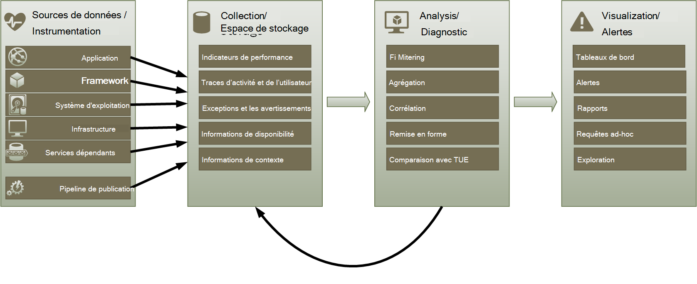
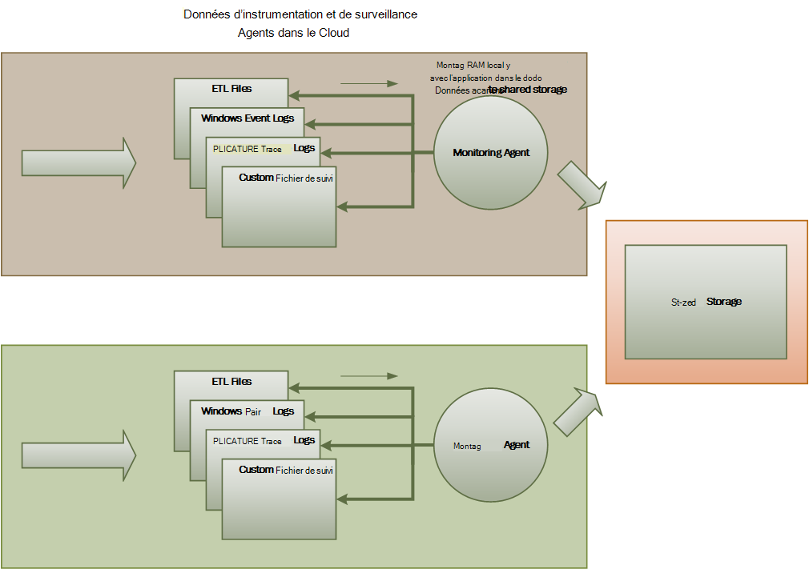
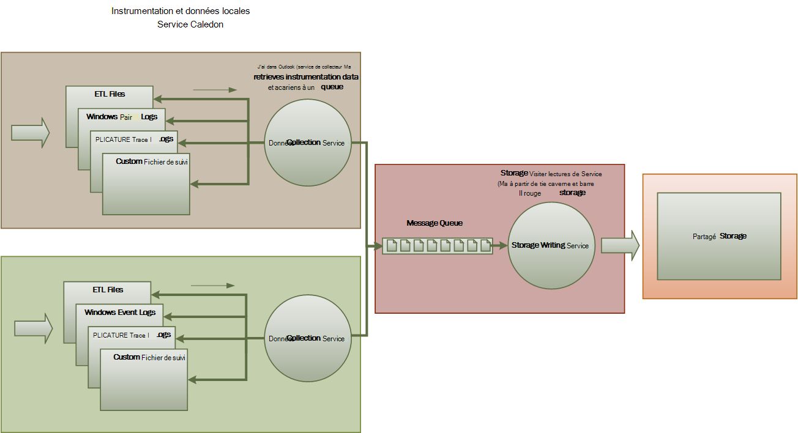
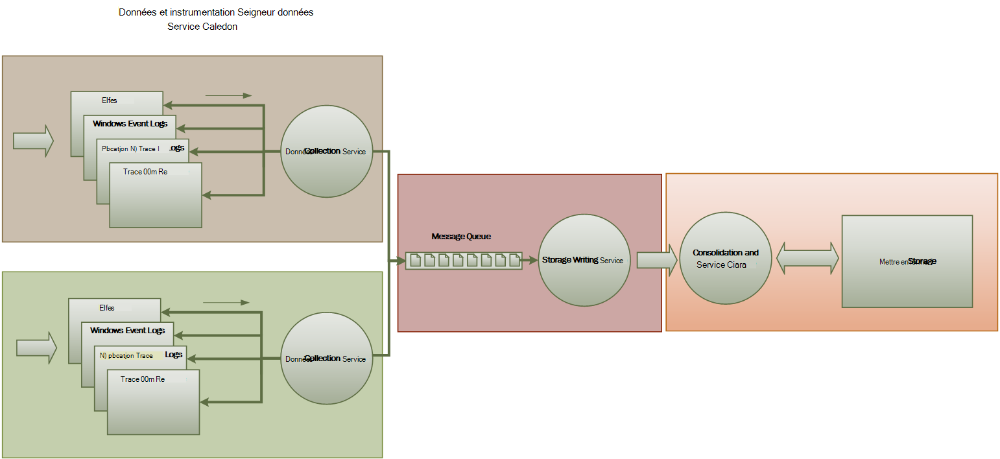
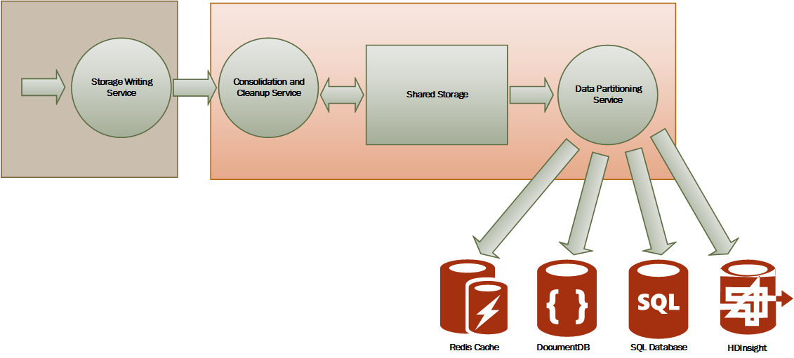

<properties
   pageTitle="Guide de surveillance et les diagnostics | Microsoft Azure"
   description="Meilleures pratiques pour surveiller des applications distribuées dans le cloud."
   services=""
   documentationCenter="na"
   authors="dragon119"
   manager="christb"
   editor=""
   tags=""/>

<tags
   ms.service="best-practice"
   ms.devlang="na"
   ms.topic="article"
   ms.tgt_pltfrm="na"
   ms.workload="na"
   ms.date="07/13/2016"
   ms.author="masashin"/>

# <a name="monitoring-and-diagnostics-guidance"></a>Guide de surveillance et de diagnostic

[AZURE.INCLUDE [pnp-header](../includes/guidance-pnp-header-include.md)]

## <a name="overview"></a>Vue d’ensemble
Applications distribuées et les services qui s’exécutent dans le cloud sont, par nature, des parties du logiciel complexes comprenant de nombreux éléments. Dans un environnement de production, il est important de pouvoir suivre la façon dans lequel les utilisateurs utilisent votre système, l’utilisation des ressources trace et généralement surveiller l’intégrité et les performances de votre système. Vous pouvez utiliser ces informations comme une aide au diagnostic pour détecter et corriger les problèmes et également pour aider à isoler des problèmes potentiels et empêcher qu’elles ne se produise.

## <a name="monitoring-and-diagnostics-scenarios"></a>Scénarios de surveillance et de diagnostic
Vous pouvez utiliser la surveillance se pour faire une idée dans quelle mesure un système fonctionne. Surveillance est important de maintenir les objectifs de qualité de service. Scénarios courants pour la collecte des données d’analyse incluent :

- S’assurer que le système reste correct.
- Suivi de la disponibilité du système et ses éléments composant.
- Maintenir des performances pour vous assurer que le débit du système ne réduit pas les inopinément en tant que le volume de travail augmente.
- Garantir que le système répond à n’importe quel niveau de service (accords) établis avec vos clients.
- Protection de la confidentialité et la sécurité du système, les utilisateurs et leurs données.
- Les opérations effectuées à des fins d’audit ou réglementaires de suivi.
- Analyse de l’utilisation du système et repérer les tendances qui peuvent entraîner des problèmes si elles n’êtes pas adressés au quotidien.
- Suivi des problèmes qui se produisent, à partir d’un rapport initial via l’analyse des causes possibles, correction, mises à jour logicielles qui en résulte et déploiement.
- Opérations de suivi et débogage des versions du logiciel.

> [AZURE.NOTE] Cette liste n’est pas censée être complète. Ce document se concentre sur ces scénarios comme situations les plus courantes pour l’exécution de surveillance. Vous devrez éventuellement d’autres personnes qui sont moins courante ou qui sont spécifiques à votre environnement.

Les sections suivantes décrivent ces scénarios plus en détail. Les informations relatives à chaque scénario sont présentées dans le format suivant :

1. Une vue d’ensemble du scénario
2. Exigences classiques de ce scénario
3. Les données d’instrumentation brute nécessaire pour prendre en charge le scénario et les sources possibles de ces informations
4. Comment ces données brutes peuvent être analysées et combinées pour générer des informations de diagnostic significatives

## <a name="health-monitoring"></a>Contrôle d’état
Un système fonctionne correctement si elle est en cours d’exécution et capable de traiter les demandes. L’objectif du contrôle d’état est pour générer un instantané de l’état actuel du système afin que vous pouvez vérifier que tous les composants du système fonctionnent comme prévu.

### <a name="requirements-for-health-monitoring"></a>Configuration requise pour le contrôle d’état
Un opérateur doit être averti rapidement (quelques secondes) si une partie quelconque du système est considéré comme en mauvais état. L’opérateur doit être en mesure de déterminer les parties du système fonctionnent normalement, et les parties vous rencontrez des problèmes. Intégrité du système pouvant être mises en surbrillance dans un système de feux de signalisation :

- Rouge pour défectueux (le système a cessé de)
- Jaune pour partiellement exact (le système s’exécute avec des fonctionnalités réduites)
- Vert pour complètement exact

Un système de surveillance complet permet à un opérateur d’exploration au sein du système pour afficher l’état d’intégrité de sous-systèmes et composants. Par exemple, si l’ensemble du système est représenté sous partiellement exact, l’opérateur doit être en mesure d’effectuer un zoom sur et déterminer celles qui n’est pas disponible actuellement.

### <a name="data-sources-instrumentation-and-data-collection-requirements"></a>Sources de données, l’instrumentation et configuration requise de collecte de données
Les données brutes nécessaire pour prendre en charge le contrôle d’état peuvent être générées à la suite de :

- Repérer l’exécution des demandes de l’utilisateur. Ces informations peuvent servir à déterminer les requêtes qui ont réussi, ce qui a échoué et la durée de chaque requête.
- Surveillance des utilisateurs synthétique. Ce processus simule les étapes effectuées par un utilisateur et applique une série d’étapes prédéfinie. Les résultats de chaque étape doivent être capturés.
- Journalisation des exceptions, les erreurs et les avertissements. Ces informations peuvent être capturées grâce au suivi des instructions incorporées dans le code de l’application, ainsi que pour récupérer des informations sur les journaux d’événements de tous les services qui fait référence au système.
- Analyse de l’intégrité des services tiers qui utilise le système. Cette surveillance peut nécessiter l’extraction et l’analyse des données de santé fournissent ces services. Ces informations peuvent prendre une variété de formats.
- Point de terminaison de surveillance. Ce mécanisme est décrit plus en détail dans la section « Analyse de la disponibilité ».
- Collecte des informations sur les performances ambiance, telles que l’arrière-plan de l’UC ou activité e/s (y compris le réseau).

### <a name="analyzing-health-data"></a>Analyse des données d’intégrité
L’objectif principal de contrôle d’état est rapidement indiquant si le système est en cours. Hot analyse des données immédiates peut déclencher une alerte si un élément essentiel est détecté comme incorrect. (Il ne répond pas à une série consécutive de commandes ping, par exemple). L’opérateur peut prendre puis l’action verres appropriée.

Un système plus avancé peut-être inclure un élément prédictif qui effectue une analyse de froid sur les charges de travail en cours et récentes. Une analyse de froid peut identifier les tendances et déterminez si le système est susceptible de demeurer exact ou si le système de ressources supplémentaires est nécessaires. Cet élément prédictif doit être basé sur des mesures de performances critiques, telles que :

- Le taux de demandes dirigées de chaque service ou sous-système.
- Le temps de réponse de ces requêtes.
- Le volume de données s’étalant dans et se déconnecter de chaque service.

Si la valeur d’une métrique dépasse un seuil défini, le système peut déclencher une alerte pour permettre à un opérateur ou autoscaling (le cas échéant) pour effectuer les actions préventives nécessaires pour maintenir l’intégrité du système. Ces actions faudra peut-être ajouter des ressources, le redémarrage d’un ou plusieurs services qui sont ignore ou en lui appliquant la limitation aux demandes de haute priorité.

## <a name="availability-monitoring"></a>Analyse de la disponibilité
Un système véritablement exact nécessite que les composants et sous-systèmes qui composent le système sont disponibles. Analyse de la disponibilité est étroitement lié au contrôle d’état. Mais alors que le contrôle d’état fournit une vue immédiate de l’état actuel du système, analyse de la disponibilité concerne la disponibilité du système et ses composants pour générer des statistiques sur la disponibilité du système de suivi.

Dans de nombreux systèmes, certains composants (par exemple, une base de données) sont configurés avec redondance intégrée pour permettre le basculement rapide en cas de panne grave ou la perte de connectivité. Dans l’idéal, les utilisateurs ne doivent pas être prenant en charge qu’une telle défaillance s’est produite. Mais à partir d’une contrôle du point de vue de disponibilité, il est nécessaire recueillir des informations autant que possible sur ce type de défaillance pour déterminer la cause et effectuer des actions de correction pour éviter qu’elle périodique.

Les données qui sont requis pour effectuer le suivi de disponibilité peuvent dépendre d’un certain nombre de facteurs de niveau inférieur. De nombreux facteurs peuvent être spécifiques à l’application, le système et l’environnement. Un système de surveillance efficace capture les données de disponibilité qui correspondant à ces facteurs faisceau et puis regroupe les pour donner une vue d’ensemble du système. Par exemple, un système de commerce électronique, les fonctionnalités d’entreprise qui permet à un client de passer des commandes peuvent dépendre le référentiel où se trouvent les détails de la commande et le système de paiement qui gère les transactions monétaires pour ces commandes d’un abonnement payant. La disponibilité du composant ordre placement du système est donc une fonction de la disponibilité du référentiel et le sous-système de paiement.

### <a name="requirements-for-availability-monitoring"></a>Configuration requise pour l’analyse de la disponibilité
Un opérateur doit également être en mesure d’afficher la disponibilité de chaque SYSTEME et sous historique et utiliser ces informations pour repérer les tendances qui peuvent provoquer un ou plusieurs sous-systèmes régulièrement échec. (Services commencent à échouer à un moment donné du jour qui correspond à des heures de traitement pointe ?)

Une solution d’analyse doit fournir une vue immédiate et historique de la disponibilité ou d’indisponibilité de chaque sous système. Il doit également pouvoir d’alerte rapidement un opérateur lors de l’un ou plusieurs services fail ou lorsque les utilisateurs ne peuvent pas se connecter aux services. Il s’agit d’une question de non seulement chaque service de surveillance, mais également examiner les actions que chaque utilisateur effectue si ces actions échouent quand ils essaient de communiquer avec un service. Dans une certaine mesure, un degré d’échec de connexion est normal et peut être dû à des erreurs transitoires. Mais il peut être utile permettre au système déclencher une alerte pour le nombre de problèmes de connectivité à un sous-système spécifié qui se produisent pendant une période donnée.

### <a name="data-sources-instrumentation-and-data-collection-requirements"></a>Sources de données, l’instrumentation et configuration requise de collecte de données
Comme avec le contrôle d’état, les données brutes nécessaire pour prendre en charge l’analyse de la disponibilité peuvent être due synthétique utilisateur surveiller et de consigner les exceptions, erreurs et les avertissements susceptibles de se produire. En outre, les données de disponibilité peuvent être obtenues à partir de l’analyse de point de terminaison. L’application peut exposer un ou plusieurs points de terminaison d’intégrité, chaque test accès à un domaine fonctionnel au sein du système. Le système de surveillance pouvez ping chaque point de terminaison en suivant un calendrier défini et collecter les résultats (réussite ou échec).

Tous les délais d’expiration, les problèmes de connectivité réseau et les tentatives de connexion doivent être enregistrées. Toutes les données doivent être horodatée.

<a name="analyzing-availability-data"></a>
### <a name="analyzing-availability-data"></a>Analyse des données de disponibilité
Les données d’instrumentation doivent être agrégées et mis en corrélation pour prendre en charge les types suivants de l’analyse :

- La disponibilité du système et sous-systèmes immédiatement.
- Taux d’échec de disponibilité du système et sous-systèmes. Dans l’idéal, un opérateur doit pouvoir faire correspondre les échecs avec des activités spécifiques : ce que s’est-il passé lorsque le système a échoué ?
- Une vue historique des taux de défaillance du système ou des sous-systèmes sur les spécifiées période et la charge sur le système (nombre de demandes de l’utilisateur, par exemple) lorsqu’une erreur est survenue.
- Les raisons de l’indisponibilité du système ou des sous-systèmes. Par exemple, les raisons peuvent être connecté service ne pas en cours d’exécution, connectivité perdue, mais arriver à expiration et les erreurs connectés mais retournées.

Vous pouvez calculer le pourcentage de disponibilité d’un service sur une période de temps à l’aide de la formule suivante :

```
%Availability =  ((Total Time – Total Downtime) / Total Time ) * 100
```

Ceci est utile pour les SLA. ([SLA surveillance](#SLA-monitoring) est décrit plus en détail plus loin dans ce guide.) La définition _d’interruption_ dépend du service. Par exemple, Service Visual Studio Team Services Build définit le temps d’arrêt en tant que la période (total cumulés minutes) pendant laquelle créer le Service n’est pas disponible. Une minute est considéré comme non disponible si toutes les demandes HTTP continues pour créer un Service pour effectuer des opérations exécutée par le client tout au long de la minute génèrent un code d’erreur ou ne retournent pas de réponse.

## <a name="performance-monitoring"></a>Analyse des performances
À mesure que le système est placé sous tension plus (en augmentant le volume d’utilisateurs), la taille des jeux de données qui s’agrandit ces utilisateurs d’accéder et la possibilité d’échec d’un ou plusieurs composants devient censées. Fréquemment, échec du composant est précédé d’une baisse des performances. Si vous êtes en mesure de détecter cette baisse, vous pouvez prendre des initiatives pour y remédier.

Les performances du système dépendant de plusieurs facteurs. Chaque facteur est généralement mesurée par le biais des indicateurs de performance clés (KPI), par exemple le nombre de transactions de base de données par seconde ou le volume de requêtes réseau qui sont traitées correctement dans un intervalle de temps spécifié. Certaines de ces indicateurs de performance clés peuvent être disponibles en tant que mesures de performances spécifiques, alors que d’autres personnes peuvent provenir d’une combinaison des indicateurs.

> [AZURE.NOTE] Détermination des performances de bonne ou mauvaise nécessite que vous savez le niveau de performance à laquelle le système doit être capable de fonctionner. Cette fonctionnalité nécessite observant le système pendant qu’elle fonctionne sous une charge normale et capturer les données pour chaque indicateur de performance clé sur une période donnée. Cela peut impliquer exécutant le système en cas de charge simulé dans un environnement de test et de collecter les données appropriées avant de déployer le système dans un environnement de production.

> Vous devez également vous assurer que le contrôle à des fins de performances ne devient-elle pas une charge sur le système. Vous serez peut-être en mesure d’ajuster dynamiquement le niveau de détail pour les données qui regroupe les processus de l’analyse des performances.

### <a name="requirements-for-performance-monitoring"></a>Configuration requise pour l’analyse des performances
Pour examiner les performances du système, un opérateur doit généralement afficher les informations qui inclut :

- Taux de réponse pour les demandes d’utilisateur.
- Le nombre de demandes utilisateur simultanées.
- Le volume de trafic réseau.
- Taux selon lequel les transactions sont terminées.
- Temps de traitement moyen des demandes.

Il peut également être utile de fournir des outils qui permettent à un opérateur aider corrélations tons directs, tels que :

- Le nombre d’utilisateurs simultanées par rapport à latence demande des heures (le temps nécessaire pour démarrer le traitement d’une requête après que l’utilisateur a envoyé il).
- Le nombre d’utilisateurs simultanées par rapport à l’heure de réponse moyen (le temps nécessaire pour terminer une demande une fois qu’il a commencé à traiter).
- Le volume de requêtes par rapport au nombre d’erreurs de traitement.

Ainsi que les principales informations fonctionnelles, un opérateur doit être en mesure d’obtenir une vue détaillée des performances pour chaque composant dans le système. Ces données sont généralement fournies par le biais des compteurs faisceau qui effectuent le suivi des informations telles que :

- Utilisation de la mémoire.
- Nombre de threads.
- Durée de traitement du processeur.
- Demander la file d’attente.
- Taux d’e/s disque ou votre réseau et des erreurs.
- Nombre d’octets enregistrés ou lus.
- Indicateurs de logiciels intermédiaires, tels que file d’attente.

Toutes les visualisations devraient permettre un opérateur spécifier une période de temps. Les données affichées peuvent être un instantané de la situation actuelle et/ou une vue historique des performances.

Un opérateur doit être en mesure de déclencher une alerte basée sur tout mesurer les performances de n’importe quelle valeur spécifiée pendant un intervalle de temps spécifié.

### <a name="data-sources-instrumentation-and-data-collection-requirements"></a>Sources de données, l’instrumentation et configuration requise de collecte de données
Vous pouvez collecter des données de performances de haut niveau (débit, nombre d’utilisateurs simultanément, le nombre de transactions commerciales, un taux d’erreur et ainsi de suite) en analysant la progression des demandes des utilisateurs lorsqu’ils arrivent et passent au sein du système. Cela implique incorporant des instructions de traçage à des points importants dans le code de l’application, ainsi que les informations de minutage. Toutes les erreurs, exceptions et avertissements doivent être capturés avec des données suffisantes pour leur mise en les requêtes qui a provoqué les. Le journal Internet Information Services (IIS) est une autre source utile.

Si possible, vous devez également capturer les données de performance pour les systèmes externes qui utilise l’application. Ces systèmes externes peuvent fournir leurs propres compteurs de performances ou d’autres fonctionnalités pour demander des données de performance. Si ce n’est pas possibles, enregistrements des informations telles que l’heure de début et heure de fin de chaque demande apportée à un système externe, ainsi que l’état (réussite, échec ou avertissement) de l’opération. Par exemple, vous pouvez utiliser une approche chronomètre demandes : lancer une horloge au démarrage de la demande et puis arrêter le minuteur quand se termine à la demande.

Données de performance faisceau pour différents composants dans un système peuvent être disponibles via les fonctionnalités et services tels que des compteurs de performance Windows et les Diagnostics de Azure.

### <a name="analyzing-performance-data"></a>L’analyse des données de performance
L’essentiel du travail analyse se compose de consolidation des données de performances par type de demande d’utilisateur et/ou le service dans lequel chaque demande est envoyée ou sous-système. Exemple de demande d’un utilisateur est Ajout d’un élément à votre panier ou effectuer le processus d’extraction dans un système de commerce.

Une autre exigence courantes effectue un résumé des données de performance dans centiles sélectionnés. Par exemple, un opérateur peut déterminer les temps de 99 % des demandes de 95 % des demandes et 70 % des demandes de réponse. Il peut y avoir cibles SLA ou autres objectifs défini pour chaque centile. Les résultats en cours doivent être signalés en temps quasi réel pour détecter les problèmes immédiates. Les résultats doivent également être agrégées durée supérieure à des fins statistiques.

Dans le cas de problèmes de latence qui affectent les performances, un opérateur doit être en mesure d’identifier rapidement la cause de la critique en examinant la latence de chaque étape qui effectue chaque demande. Les données de performance doivent donc constituent un moyen de corrélation des mesures de performances de chaque étape pour les lier à une requête spécifique.

Selon les besoins de visualisation, il peut être utile générer et stocker un cube de données qui contient des vues des données brutes. Ce cube de données permet à exécuter des requêtes complexes ad hoc et l’analyse des informations de performances.

## <a name="security-monitoring"></a>Contrôle de la sécurité
Tous les systèmes commerciales qui contiennent des données sensibles doivent implémenter une structure de sécurité. La complexité du mécanisme de sécurité est généralement une fonction de la confidentialité des données. Dans un système qui requiert une authentification des utilisateurs, vous devez enregistrer :

- Toutes les tentatives se connecter, ils échouer ou réussir.
- Toutes les opérations effectuées par--et les détails de toutes les ressources accessible par--un utilisateur authentifié.
- Lorsqu’un utilisateur met fin à une session et déconnecte.

Surveillance peut-être être en mesure de vous aider à détecter les attaques sur le système. Par exemple, un grand nombre d’échecs connexion peut-être indiquer une attaque par force brute. Une augmentation inattendue dans les requêtes peut-être être le résultat d’une distribué refus de service (DDoS) par. Vous devez être prêt à surveiller toutes les requêtes à toutes les ressources quelle que soit la source de ces requêtes. Un système qui a un problème de connexion peut exposer accidentellement les ressources à l’extérieur sans qu’un utilisateur réellement se connecter.

### <a name="requirements-for-security-monitoring"></a>Configuration requise pour contrôler la sécurité
Les aspects essentiels de contrôle de la sécurité doivent activer rapidement un opérateur :

- Détecter les tentatives d’intrusion par une entité non authentifiée.
- Identifiez les tentatives en entités pour effectuer des opérations sur les données pour lesquelles ils n'ont pas accès.
- Déterminer si le système ou une partie du système, se trouve sous attaque à partir de l’extérieur ou à l’intérieur. (Par exemple, un utilisateur authentifié malveillant peut essayer de mettre le système vers le bas.)

Pour répondre à ces exigences, un opérateur doit être averti :

- Si un seul compte est répété infructueuses se connecter pendant une période spécifiée.
- Si un seul compte authentifié tente à plusieurs reprises accéder à une ressource interdite pendant une période spécifiée.
- Si un grand nombre de requêtes non autorisés ou non authentifiés se produire pendant une période spécifiée.

Les informations sont fournies à un opérateur doivent inclure l’adresse de l’hôte de la source pour chaque demande. Violations de sécurité régulièrement le cas échéant à partir d’une plage spécifique d’adresses, ces hôtes peuvent être bloqués.

Un élément essentiel dans la conservation de la sécurité d’un système est la possibilité détecter rapidement les actions qui divergent schéma habituel. Informations telles que le nombre d’échecs et/ou réussies connexion demandes peuvent être affichées visuellement pour vous aider à détecter si est un pic d’activité à un moment inhabituels. (Un exemple de cette activité est utilisateurs en vous connectant à 3:00 AM et effectue un grand nombre d’opérations de lors de leur journée de travail démarre à 9:00 AM). Ces informations peuvent également être utilisées pour aider à configurer autoscaling temporelles. Par exemple, si un opérateur respecte qu’un grand nombre d’utilisateurs régulièrement se connecter à un moment donné du jour, l’opérateur peut organiser démarrer des services d’authentification supplémentaires pour gérer le volume de travail, puis arrêtez ces services supplémentaires lorsque la pointe a expiré.

### <a name="data-sources-instrumentation-and-data-collection-requirements"></a>Sources de données, l’instrumentation et configuration requise de collecte de données
Sécurité est un aspect global des systèmes plus distribués. Les données pertinentes sont susceptibles d’être générés sur plusieurs points dans l’ensemble d’un système. Vous devez prendre en compte adoptant une approche les informations de sécurité et de gestion des événements (SIEM) pour collecter les informations relatives à la sécurité qui résulte d’événements déclenchés par l’application, équipement réseau, serveurs, pare-feu, un logiciel antivirus et autres éléments de prévention des intrusions.

Contrôle de la sécurité peut incorporer des données dans les outils qui ne font pas partie de votre application. Ces outils peuvent inclure des utilitaires qui identifient les activités de balayage de port par les agences externes ou les filtres de réseau détecter les tentatives d’accès non authentifiés à votre application et des données.

Dans tous les cas, les données recueillies doivent activer un administrateur doit déterminer la nature de toute attaque et prendre des mesures appropriées.

### <a name="analyzing-security-data"></a>Analyse des données de sécurité
Une fonctionnalité de contrôle de sécurité est la variété de sources à partir de laquelle les données se produit. Les différents formats et le niveau de détail nécessitent souvent complexe analyse des données capturées réunir en un thread cohérent des informations. En dehors de la plus simple de cas (par exemple, détection d’un grand nombre de connexions a échoué ou plusieurs tentatives non autorisés d’accéder aux ressources critiques), il est parfois pas possible exécuter tout complexe traitement automatique des données de sécurité. Au lieu de cela, il peut être préférable d’écrire ces données, horodatée mais autrement dans sa forme d’origine, à un référentiel sécurisé afin de permettre une analyse manuelle experte.

<a name="SLA-monitoring"></a>

## <a name="sla-monitoring"></a>SLA surveillance
Nombreux systèmes commerciales qui prennent en charge des clients payant apportez garanties sur les performances du système dans le formulaire niveaux de service requis. Pour l’essentiel, SLA indiquer que le système peut gérer un volume de travail dans un délai convenu et sans aucune perte d’informations critiques. Surveillance SLA préoccuper de s’assurer que le système peut SLA mesurables.

> [AZURE.NOTE] Surveillance SLA est étroitement lié à l’analyse des performances. Mais que l’analyse des performances est concernée par veiller à ce que le système fonctions _optimale_, SLA surveillance est régie par une obligation contractuelle qui définit quels _optimale_ signifie réellement.

SLA est souvent définies en termes de :

- Disponibilité générale du système. Par exemple, une organisation peut vous assurer que le système sera-t-il disponible à 99,9 % du temps. Cela revient à ne plus de 9 heures d’interruption par an ou environ 10 minutes par semaine.
- Débit opérationnel. Cet aspect est souvent exprimé en un ou plusieurs – bornes hautes, telles que la garantie que le système peut prendre en charge jusqu'à 100 000 demandes utilisateur simultanées ou traiter les 10 000 transactions commerciales simultanées.
- Temps de réponse opérationnelle. Le système peut également mettre les garanties pour le taux de traitement des demandes. Un exemple est que 99 % de toutes les transactions d’entreprise se termine au sein de 2 secondes, et aucune transaction unique ne doit prendre plue de 10 secondes.

> [AZURE.NOTE] Certains contrats de systèmes commerciale peuvent également inclure SLA du support client. Un exemple est que toutes les demandes d’assistance seront provoquer une réponse dans les 5 minutes, et que 99 % de tous les problèmes sera entièrement résolu dans 1 journée de travail. Effet de [suivi des problèmes](#issue-tracking) (décrites plus loin dans cette section) est crucial pour SLA tels que.

### <a name="requirements-for-sla-monitoring"></a>Configuration requise pour l’analyse de SLA
Au niveau de la plus élevé, un opérateur doit être en mesure de déterminer en un clin de œil si le système respecte les SLA convenus ou non. Si pas, l’opérateur doit être en mesure d’exploration vers le bas et examinez les facteurs sous-jacente pour déterminer les raisons de performances inférieures aux normes.

Indicateurs de haut niveau classiques qui peuvent être décrite visuellement sont les suivantes :

- Le pourcentage de disponibilité du service.
- Le débit d’application (mesuré en termes de transactions réussies et/ou opérations par seconde).
- Le nombre de demandes d’application réussie/défectueux.
- Le nombre de pannes système et d’application, exceptions et avertissements.

Tous ces indicateurs doivent être en mesure de filtré par un certain temps.

Une application en nuage comprend probablement un nombre de sous-systèmes et composants. Un opérateur doit être en mesure de sélectionner un indicateur de haut niveau et voir comment elle se compose de l’état des éléments sous-jacente. Par exemple, si le temps de fonctionnement de l’ensemble du système est inférieur à une valeur acceptable, un opérateur doit être en mesure d’effectuer un zoom sur et déterminer quels éléments sont contribue à ce problème.

> [AZURE.NOTE] Disponibilité du système doit être définie avec soin. Dans un système qui utilise redondance pour assurer la disponibilité maximale, instances individuelles d’éléments peuvent échouer, mais le système peut rester fonctionnel. Disponibilité du système comme présenté par le contrôle d’état doit indiquer la disponibilité d’agrégation de chaque élément, et pas nécessairement indique si le système a réellement arrêté. En outre, les échecs peuvent être isolés. Même si un système spécifique n’est pas disponible, le reste du système peut rester disponible, bien qu’avec fonctionnalités réduites. (Dans un système de commerce, une défaillance dans le système peut empêcher un client de passer des commandes, mais le client pourrez toujours parcourir le catalogue de produits.)

Pour les alertes à des fins, le système doit être en mesure de déclencher un événement si un des indicateurs de haut niveau dépasse un seuil spécifié. Les détails de niveau inférieur de différents éléments qui composent l’indicateur de haut niveau doivent être disponibles en tant que données contextuelles pour le système d’alerte.

### <a name="data-sources-instrumentation-and-data-collection-requirements"></a>Sources de données, l’instrumentation et configuration requise de collecte de données
Les données brutes nécessaire pour prendre en charge la surveillance SLA sont similaires aux données brutes nécessaire pour l’analyse des performances, ainsi que certains aspects de la santé et analyse de la disponibilité. (Voir ces sections pour plus d’informations). Vous pouvez capturer ces données en :

- Exécution d’une analyse de point de terminaison.
- Journalisation des exceptions, les erreurs et les avertissements.
- Repérer l’exécution des requêtes de l’utilisateur.
- Analyse de la disponibilité des services tiers qui utilise le système.
- Utilisation des compteurs et des indicateurs de performance.

Toutes les données doivent être minutées et horodatée.

### <a name="analyzing-sla-data"></a>Analyse des données SLA
Les données d’instrumentation doivent être agrégées pour générer une image des performances globales du système. Données agrégées doivent prennent également en charge l’exploration des niveaux inférieurs pour activer l’examen des performances de sous-systèmes sous-jacente. Par exemple, vous devriez pouvoir à :

- Calculer le nombre total de demandes de l’utilisateur pendant une période spécifiée et déterminer le taux de réussite et d’échec de ces requêtes.
- Combiner les temps de réponse des demandes de l’utilisateur pour générer une vue d’ensemble des temps de réponse.
- Analyser l’avancement des demandes de l’utilisateur pour décomposer le temps de réponse générale d’une requête dans le temps de réponse des éléments de travail individuels dans cette demande.  
- Déterminez la disponibilité générale du système sous forme de pourcentage de disponibilité pour une période spécifique.
- Analyser le pourcentage de disponibilité heure des composants individuels et des services dans le système. Cela peut impliquer l’analyse des journaux de services tiers ayant généré.

De nombreux systèmes professionnelle sont requis pour signaler les chiffres de performances par rapport aux SLA convenu pour une période spécifiée, en général un mois. Ces informations peuvent servir à calculer des crédits ou autres formes de remboursement pour les clients si les SLA ne sont pas respectées pendant cette période. Vous pouvez calculer la disponibilité d’un service à l’aide de la technique décrite dans la section [analyse des données de disponibilité](#analyzing-availability-data).

À des fins internes, une organisation peut également effectuer le suivi du nombre et nature des incidents qui a provoqué échec des services. Comment faire pour résoudre ces problèmes rapidement, ou les supprimer complètement, novice pour réduire les interruptions et SLA.

## <a name="auditing"></a>L’audit
Selon la nature de l’application, vous devrez éventuellement légales ou autres réglementations juridiques qui spécifient configuration requise pour l’audit des opérations sur les utilisateurs et l’accès aux données tous les enregistrements. L’audit peut prouver que les clients des liens à des demandes spécifiques. Non répudiation est un facteur important dans de nombreux systèmes e-business pour aider à gérer la confidentialité entre un client et l’organisation qui est responsable de l’application ou le service.

### <a name="requirements-for-auditing"></a>Configuration requise pour l’audit
Un analyste doit pouvoir effectuer le suivi de la séquence des activités que les utilisateurs effectuez afin que vous pouvez reconstruire actions des utilisateurs. Cela peut être nécessaire simplement comme une question d’enregistrement, ou dans le cadre d’une enquête post-mortem.

Informations d’audit sont très sensibles. Il inclura probablement des données qui identifie les utilisateurs du système, ainsi que les tâches que leurs performances. Pour cette raison, les informations d’audit prendra probablement la forme des rapports sont disponibles uniquement aux analystes approuvés plutôt que comme un système interactif qui prend en charge exploration des niveaux inférieurs d’opérations graphiques. Un analyste doit être en mesure de générer un éventail de rapports. Par exemple, rapports peuvent liste des activités de tous les utilisateurs se produisant pendant un intervalle de temps spécifié, la chronologie de l’activité d’un utilisateur en détail ou l’ordre des opérations effectuées par rapport à une ou plusieurs ressources de la liste.

### <a name="data-sources-instrumentation-and-data-collection-requirements"></a>Sources de données, l’instrumentation et configuration requise de collecte de données
Les sources d’information d’audit principales peuvent inclure :

- Le système de sécurité qui gère l’authentification des utilisateurs.
- Tracer les journaux qui enregistrent l’activité des utilisateurs.
- Journaux de sécurité qui effectuent le suivi de toutes les demandes réseau identifiable et non identifiable.

Le format des données d’audit et celle dans laquelle il est stocké peut être piloté par les exigences réglementaires. Par exemple, il peut ne pas être possible effacer les données d’une manière. (Il doit être enregistré dans son format d’origine.) Accès au référentiel où il est conservé doivent être protégées pour empêcher la falsification.

### <a name="analyzing-audit-data"></a>Analyse des données d’audit
Un analyste doit être en mesure d’accéder aux données brutes dans son intégralité, dans son format d’origine. En dehors de la configuration minimale requise pour générer des rapports d’audit courantes, les outils d’analyse de ces données sont susceptibles d’être spécialisées et reste du système externe.

## <a name="usage-monitoring"></a>Analyse de l’utilisation
Analyse de l’utilisation effectue le suivi de façon dont les fonctionnalités et les composants d’une application sont utilisés. Un opérateur peut utiliser les données collectées pour :

- Pour savoir quelles fonctionnalités sont intensément utilisées et déterminent toutes les zones potentielles dynamiques dans le système. Éléments de trafic élevé peuvent bénéficier de partition fonctionnel ou même réplication pour répartir la charge de manière plus égale. Un opérateur pouvez également utiliser ces informations pour déterminer quelles fonctionnalités sont peu utilisées et sont des candidats possibles pour ancienneté ou de remplacement dans une version ultérieure du système.
- Obtenir des informations sur les événements opérationnels du système, sous utilisation normale. Par exemple, dans un site de commerce électronique, vous pouvez enregistrer les informations statistiques sur le nombre de transactions et le volume de clients responsables. Ces informations peuvent être utilisées pour planifier la capacité à mesure que le nombre de clients augmente.
- Détecter (éventuellement indirectement) satisfaction des utilisateurs avec les performances du système. Par exemple, si un grand nombre de clients dans un système de commerce abandonner régulièrement leurs paniers, cela peut être dû à un problème avec la fonctionnalité de l’extraction.
- Générer des informations de facturation. Une application professionnelle ou un service partagé facturer des clients pour les ressources qu’ils utilisent.
- Appliquer des quotas. Si un utilisateur dans un système partagé dépasse leur quota payant de l’utilisation de temps et de ressources de traitement pendant une période spécifiée, leur accès peut être limité ou peut limiter les traitement.

### <a name="requirements-for-usage-monitoring"></a>Configuration requise pour l’utilisation de surveillance
Pour examiner l’utilisation du système, un opérateur doit généralement afficher les informations qui inclut :

- Le nombre de requêtes qui sont traités par chaque sous système et dirigé vers chaque ressource.
- Le travail exécutée par chaque utilisateur.
- Le volume de stockage des données qu’occupe chaque utilisateur.
- Les ressources qui accède à chaque utilisateur.

Un opérateur doit également être en mesure de générer des graphiques. Par exemple, un graphique peut afficher les utilisateurs plus gourmandes en des ressources ou les plus fréquemment accéder aux ressources ou des fonctionnalités du système.

### <a name="data-sources-instrumentation-and-data-collection-requirements"></a>Sources de données, l’instrumentation et configuration requise de collecte de données
Suivi de l’utilisation peut être effectuée à un niveau relativement élevé. Il peut Notez les heures de début et de fin de chaque demande et de la nature de la demande (lecture, écriture et ainsi de suite, selon la ressource en question). Vous pouvez obtenir ces informations en :

- Suivi des activités des utilisateurs.
- Capturer des compteurs de performances décrivant le taux d’utilisation pour chaque ressource.
- Analyse de l’utilisation des ressources par chaque utilisateur.

Pour à des fins de contrôle, vous devez également être en mesure d’identifier les utilisateurs qui sont responsables permettant d’effectuer les opérations et les ressources qui utilisent ces opérations. Les informations collectées doivent être suffisamment détaillées pour permettre de facturation.

<a name="issue-tracking"></a>
## <a name="issue-tracking"></a>Suivi des problèmes
Clients et les autres utilisateurs peuvent signaler des problèmes en cas événements inattendus ou le comportement du système. Suivi des problèmes concerne gestion ces problèmes et les associer à des efforts pour résoudre les problèmes sous-jacentes dans le système pour informer les clients de solutions possibles.

### <a name="requirements-for-issue-tracking"></a>Configuration requise pour le suivi des problèmes
Opérateurs effectuent souvent suivi en utilisant un système distinct qui permet de les enregistrer et communiquer les détails des problèmes de ce rapport sur les utilisateurs. Il peut s’agir les tâches que l’utilisateur a essayé d’effectuer, symptômes du problème, la séquence d’événements et une erreur ou les messages d’avertissement qui ont été émis.

### <a name="data-sources-instrumentation-and-data-collection-requirements"></a>Sources de données, l’instrumentation et configuration requise de collecte de données
La source de données initiale pour les données de suivi est l’utilisateur qui a signalé le problème en premier lieu. L’utilisateur peut être en mesure de fournir des données supplémentaires telles que :

- Un vidage sur incident (si l’application inclut un composant qui s’exécute sur le bureau de l’utilisateur).
- Une capture d’écran.
- La date et l’heure de l’erreur, ainsi que de toute autre information l’environnement tels que l’emplacement de l’utilisateur.

Ces informations peuvent être utilisées pour effectuer le débogage piloté et vous aider à créer un retard dans les prochaines versions du logiciel.

### <a name="analyzing-issue-tracking-data"></a>Analyse des données de suivi des problèmes
Différents utilisateurs peuvent signaler le même problème. Le système de suivi des problèmes doit associer rapports communs.

L’avancement de l’effort débogage doit être enregistrée dans chaque rapport de problème. Lorsque le problème est résolu, le client peut être informé de la solution.

Si un utilisateur signale un problème avec une solution connue dans le système de suivi des problèmes, l’opérateur doit être en mesure d’informer immédiatement l’utilisateur de la solution.

## <a name="tracing-operations-and-debugging-software-releases"></a>Opérations de suivi et débogage des versions du logiciel
Lorsqu’un utilisateur signale un problème, l’utilisateur est souvent uniquement prenant en charge de l’impact immédiat qu’il possède les opérations. L’utilisateur peut notifier uniquement les résultats de leur propre expérience à un opérateur qui est responsable de gestion du système. Ces expériences sont généralement simplement une manifestation visible d’un ou plusieurs problèmes fondamentaux. Dans de nombreux cas, un analyste devrez aller à la chronologie des opérations sous-jacentes pour établir la cause du problème. Ce processus est appelé _analyse des causes_.

> [AZURE.NOTE] Analyse des causes peut-être révéler d’efficacité dans la conception d’une application. Dans ce cas, il est parfois possible retravaillez les éléments concernés et que vous déployez dans le cadre d’une version ultérieure. Ce processus requiert veillant à ne contrôle et les composants mis à jour doivent être analysés.

### <a name="requirements-for-tracing-and-debugging"></a>Configuration requise pour le suivi et débogage
Pour effectuer le suivi des événements inattendus et autres problèmes, il est essentiel que les données d’analyse fournissent suffisamment d’informations pour activer un analyste pour assurer le suivi de l’origine de ces problèmes et le recréer la séquence des événements qui se sont produites. Ces informations doivent être suffisantes pour activer un analyste pour déterminer la cause des problèmes. Un développeur peut puis apportez les modifications nécessaires pour éviter qu’elle périodique.

### <a name="data-sources-instrumentation-and-data-collection-requirements"></a>Sources de données, l’instrumentation et configuration requise de collecte de données
Résolution des problèmes peuvent nécessiter suivi toutes les méthodes (et leurs paramètres) appelés dans le cadre d’une opération pour créer un organigramme qui illustre le flux logique au sein du système lorsqu’un client effectue une requête spécifique. Exceptions et avertissements généré par le système à la suite de ce flux doivent être capturés et connecté.

Pour prendre en charge le débogage, le système peut fournir des connexions qui permettent à un opérateur capturer les informations d’état en points essentiels dans le système. Ou, le système peut remettre des informations pas à pas détaillées sur l’avancement des opérations sélectionnées. Capture des données à ce niveau de détail peuvent imposer une charge supplémentaire sur le système et doivent être un processus temporaire. Un opérateur utilise ce processus principalement lorsqu’une série d’événements très inhabituelle se produit et est difficile à répliquer ou lorsqu’une nouvelle version d’un ou plusieurs éléments dans un système nécessite une étroite surveillance pour vous assurer que la fonction éléments comme prévu.

## <a name="the-monitoring-and-diagnostics-pipeline"></a>Le pipeline de surveillance et de diagnostic
Analyse d’un système distribué à grande échelle pose un défi. Chacun des scénarios décrits dans la section précédente ne doit pas nécessairement être considérés comme dans isolement. Il est probablement un chevauchement significatif dans les données d’analyse et de diagnostics requis pour chaque situation, bien que ces données peuvent doivent être traitées et présenté de différentes manières. Par conséquent, vous devez prendre une vue globale de surveillance et les diagnostics.

Vous pouvez envisager le processus de diagnostics et de surveillance entier comme un pipeline qui comprend les étapes présentées dans la Figure 1.



_Figure 1. Les étapes dans le pipeline de surveillance et de diagnostic_

Figure 1 met en évidence la façon dont les données de surveillance et de diagnostic peuvent provenir à partir d’une variété de sources de données. Les étapes d’instrumentation et de collection de sites sont concernées par l’identification des sources à partir de l’endroit où les données doivent être capturé, déterminer les données à capturer, comment capturer et la mise en forme de ces données afin qu’il puisse être examiné facilement. La phase d’analyse/diagnostic prend les données brutes et utilise pour générer des informations pertinentes qu’un opérateur peut utiliser pour déterminer l’état du système. L’opérateur peut utiliser ces informations pour prendre des décisions concernant les actions possibles pour prendre et flux puis les résultats dans les étapes d’instrumentation et de collection de sites. La phase de scène Visualisation/alertes présente une vue consommable de l’état du système. Il peut afficher des informations en temps quasi réel à l’aide d’une série de tableaux de bord. Et il peut générer des rapports, des graphiques et des graphiques pour fournir une vue historique des données qui peuvent vous aider à identifier les tendances à long terme. Si informations indiquent qu’un indicateur de performance clé est susceptible de dépassement des limites acceptables, cette étape peut également déclencher une alerte pour un opérateur. Dans certains cas, une alerte peut également être utilisée pour déclencher un processus automatisé qui tente de prendre des mesures adéquates, comme autoscaling.

Notez que ces étapes constituent un processus de flux continu où les phases sont produisent en parallèle. Dans l’idéal, toutes les phases doivent être configurables dynamiquement. À certains moments, particulièrement quand un système a été récemment déployé ou rencontre des problèmes, il peut être nécessaire collecter les données étendues de manière plus fréquente. En d’autres cas, elle doit être possible de revenir à la capture un niveau de base des informations essentielles pour vérifier que le système fonctionne correctement.

En outre, le processus d’analyse entière doit être considérée comme une solution live, en cours est soumis à modifier et améliorations apportées à la suite de commentaires. Par exemple, vous pouvez commencer avec de nombreux facteurs pour déterminer l’intégrité du système de mesure. Analyse au fil du temps susceptibles d’entraîner un perfectionnement comme vous ignorez les mesures qui ne sont pas utilisés, ce qui vous permet de consacrer plus précisément les données dont vous avez besoin tout en réduisant le bruit de fond.

## <a name="sources-of-monitoring-and-diagnostic-data"></a>Sources de données d’analyse et des Diagnostics
Les informations qu’utilise le processus d’analyse peuvent provenir de différentes sources, comme illustré dans la Figure 1. Au niveau de l’application, informations proviennent les journaux de suivi intégrés au code du système. Les développeurs doivent suivre une approche standard pour le suivi du flux de contrôle via leur code. Par exemple, une entrée à une méthode peut émettre un message de trace qui spécifie le nom de la méthode, l’heure actuelle, la valeur de chaque paramètre et toute autre information utile. Enregistrer les heures d’entrée et de sortie peut également s’avérer utile.

Vous devez enregistrer toutes les exceptions et les avertissements et assurez-vous de conserver une trace de toutes les exceptions imbriquées et avertissements complète. Préférence, vous devez également capturer les informations qui identifie l’utilisateur qui s’exécute le code, ainsi que des informations sur l’activité corrélation (pour effectuer le suivi des demandes lorsqu’ils passent par le système). Et vous devez vous connecter tentatives d’accéder à toutes les ressources telles que des files d’attente, les bases de données, les fichiers et les autres services qui en dépendent. Ces informations peuvent être utilisées à des fins d’audit et de contrôle.

Nombreuses applications permet d’effectuer les tâches courantes telles que l’accès à un magasin de données ou sur un réseau de communication des bibliothèques et des cadres. Ces structures peuvent être configurés pour fournir leurs propres messages de suivi et des informations de diagnostic brutes, tels que des taux de transaction et les données transmission réussites et les échecs.

> [AZURE.NOTE] Structures modernes nombreux publier automatiquement les performances et suivi des événements. Capturer ces informations est simplement une question de fournir un moyen pour récupérer et stockez-le dans lequel il peut être traitée et analysée.

Le système d’exploitation dans lequel l’application est exécutée peuvent être une source de faisceau informations système à l’échelle, tels que des compteurs de performance qui indiquent le taux d’e/s, utilisation de la mémoire et de l’UC. Erreurs de système d’exploitation (par exemple, l’échec d’ouvrir un fichier correctement) peuvent également être signalés.

Vous devez également envisager l’infrastructure et les composants sur lequel s’exécute votre système sous-jacente. Machines virtuelles réseaux virtuels, possible et les services de stockage toutes les sources des compteurs de performances au niveau de l’infrastructure importants et autres données de diagnostic.

Si votre application utilise d’autres services externes, tel qu’un serveur web ou un système de gestion de base de données, ces services peuvent publier leurs informations de traçage, les journaux et compteurs de performance. Les exemples sont des vues de gestion dynamique SQL Server pour le suivi des opérations effectuées par rapport à une base de données SQL Server, et les journaux de suivi IIS pour l’enregistrement des demandes effectuées sur un serveur web.

Tandis que les composants d’un système sont modifiés et de nouvelles versions sont déployées, il est important de pouvoir attribut problèmes, les événements et les mesures pour chaque version. Ces informations doivent être liées en le pipeline de version afin que les problèmes avec une version spécifique d’un composant peuvent être suivies rapidement et rectifiés.

Problèmes de sécurité peuvent se produire à tout moment dans le système. Par exemple, un utilisateur peut essayer à se connecter avec un ID utilisateur ou mot de passe. Un utilisateur authentifié peut tenter d’obtenir un accès non autorisé à une ressource. Ou un utilisateur peut fournir une clé non valide ou obsolète pour accéder à des informations chiffrées. Informations de sécurité pour les demandes réussies et coupures doivent toujours être enregistrées.

La section [instrumentation d’une application](#instrumenting-an-application) contient plus de conseils sur les informations que vous devez capturer. Mais vous pouvez utiliser une variété de stratégies pour recueillir ces informations :

- **Application/système de surveillance**. Cette stratégie utilise les sources internes au sein de l’application, structures d’application, système d’exploitation et infrastructure. Le code d’application peut générer son propre analyser des données à des points remarquables pendant le cycle de vie d’une demande de client. L’application peut inclure des instructions de traçage qui peuvent être sélectivement activées ou désactivées comme circonstances imposent. Il est également possible d’injection diagnostics dynamiquement à l’aide d’un cadre diagnostics. Ces structures fournissent généralement les plug-ins que vous pouvez joindre à différents points d’instrumentation dans votre code et capturer les données de suivi à ces points.

    En outre, votre code et/ou l’infrastructure sous-jacente peut-être lever des événements à des points critiques. Surveiller les agents qui sont configurés pour écouter ces événements peut enregistrer les informations d’événement.

- **Surveillance des utilisateurs réel**. Cette approche enregistre les interactions entre un utilisateur et l’application, ainsi que le flux de chaque demande et réponse. Ces informations peuvent avoir un objectif double : il peut être utilisé pour le contrôle de l’utilisation par chaque utilisateur, et il peut être utilisé pour déterminer si les utilisateurs reçoivent une qualité acceptable du service (par exemple, temps de réponse rapide, faible latence et erreurs minimales). Vous pouvez utiliser les données capturées pour identifier les points essentiels où échecs se produire plus souvent. Vous pouvez également utiliser les données pour identifier les éléments où le système ralentit vers le bas, éventuellement en raison de zones dans l’application ou une autre forme de critique. Si vous implémentez cette approche avec soin, il peut être possible de reconstituer s’écoule utilisateurs dans l’application pour le débogage et à des fins de test.

    > [AZURE.IMPORTANT] Vous devez prendre en compte les données qui sont capturées en analysant utilisateurs réels pour être très sensibles, car il peut-être inclure des documents confidentiels. Si vous enregistrez des données capturées, stockez-le en toute sécurité. Si vous voulez utiliser les données de performance surveillance ou à des fins de débogage, réduisez toutes les informations d’identification personnelle tout d’abord.

- **Surveillance des utilisateurs synthétique**. Dans cette approche, vous écrivez votre propre client de test qui simule un utilisateur et effectue une série configurable mais classique d’opérations. Vous pouvez suivre les performances du client test pour aider à déterminer l’état du système. Vous pouvez également utiliser plusieurs instances du client test dans le cadre d’une opération de test de charge pour établir la façon dont le système répond sous tension et quel type de sortie de surveillance est généré dans ces conditions.

    > [AZURE.NOTE] Vous pouvez implémenter utilisateur réel et synthétique surveillance en incluant le code de suivi et arrive à l’exécution d’appels et d’autres parties d’une application critiques.

- Le **profil**. Cette approche est principalement à contrôler et à améliorer les performances de l’application. Plutôt que d’exploitation au niveau fonctionnel de surveillance des utilisateurs réel et synthétique, il capture les informations de niveau inférieur en tant que l’application s’exécute. Vous pouvez mettre en œuvre profil à l’aide d’échantillonnage périodique de l’état de l’exécution d’une application (qui détermine quelle partie de code de l’application est exécutée à un moment donné dans le temps). Vous pouvez également utiliser une instrumentation qui insère sondes dans le code à leur importantes (par exemple, le début et de fin d’un appel de méthode) et enregistre les méthodes qui ont été appelées, à quel moment, et la durée de chaque appel. Vous pouvez ensuite analyser ces données afin de déterminer les parties de l’application peuvent entraîner des problèmes de performances.

- **Point de terminaison de surveillance**. Cette technique utilise un ou plusieurs points de terminaison de diagnostics que l’application expose spécifiquement pour activer le contrôle. Un point de terminaison permet d’accéder au code de l’application et retourne des informations sur l’intégrité du système. Points de terminaison différents peuvent se concentrer sur différents aspects de la fonctionnalité. Vous pouvez écrire votre propre client diagnostics qui envoie des requêtes périodiques à ces points de terminaison et assimiler les réponses. Cette approche est décrite dans [l’État du point de terminaison de surveillance motif](https://msdn.microsoft.com/library/dn589789.aspx) sur le site Web Microsoft.

Pour couverture maximale, vous devrez utiliser une combinaison de ces techniques.

<a name="instrumenting-an-application"></a>
## <a name="instrumenting-an-application"></a>Instrumentation d’une application
Instrumentation est une partie essentielle du processus d’analyse. Vous pouvez prendre des décisions significatives sur les performances et d’intégrité d’un système uniquement si vous capturez tout d’abord les données qui vous permet de ces décisions. Les informations que vous rassemblez à l’aide d’instrumentation doivent être suffisantes pour vous permettent d’analyser les performances, diagnostiquer les problèmes et prendre des décisions sans avoir à se connecter à un serveur de production distant pour effectuer le suivi (et le débogage) manuellement. Données d’instrumentation comprenant généralement les mesures et informations figurant dans les journaux de suivi.

Le contenu d’un journal de suivi peut être dû à des données textuelles écrit par l’application ou des données binaires sont créées comme résultat d’un événement de trace (si l’application utilise Event Tracing for Windows--ETW). Ils peuvent également être générés à partir des journaux système qui enregistrent les événements résultant des parties de l’infrastructure, par exemple un serveur web. Messages du journal textuelles sont souvent conçus pour être lisible, mais ils doivent également être écrites dans un format qui permet à un système automatisé pour les analyser facilement.

Vous devez également catégoriser les journaux. N’écrire toutes les données de suivi des messages dans un journal unique, mais utilisez des journaux distincts pour enregistrer la sortie de traçage à partir de différents aspects opérationnels du système. Vous pouvez ensuite rapidement filtrer les messages du journal en lecture à partir du journal approprié au lieu de devoir de traiter un seul fichier long. Informations jamais écriture ayant des exigences de sécurité différentes (par exemple, les informations d’audit et données de débogage) dans le même journal.

> [AZURE.NOTE] Un journal peut être utilisée comme un fichier sur le système de fichiers, ou il peut se trouver dans un autre format, par exemple un blob dans le stockage blob. Informations de journal peuvent également stockées plus structurées, tels que des lignes dans une table.

Métrique sera généralement une mesure ou le nombre d’un aspect ou une ressource dans le système à une heure spécifique, avec une ou plusieurs balises associées ou dimensions (parfois appelées un _exemple_). Une seule instance d’une métrique n’est généralement pas utile dans isolement. À la place, indicateurs doivent être capturé dans le temps. Le problème de clé à prendre en considération est les mesures que vous devez enregistrer et la fréquence. Génération de données pour les mesures trop souvent peut imposer une charge significative supplémentaire sur le système, alors que les mesures de capture rarement peuvent provoquer manquer les circonstances prospect pour un événement important. Les considérations varient à partir d’un critère à un critère. Par exemple, de l’UC sur un serveur peut-être varier considérablement seconde à seconde, mais utilisation intensive devient un problème uniquement s’il s’agit à long terme sur un certain nombre de minutes.

<a name="information-for-correlating-data"></a>
### <a name="information-for-correlating-data"></a>Informations de corrélation des données
Vous pouvez facilement surveiller les compteurs de performance au niveau du système individuels, comprendre les mesures pour les ressources et obtenir des informations de suivi des applications à partir de différents fichiers journaux. Mais certains écrans de surveillance nécessitent l’analyse et les diagnostics de partage dans le pipeline de surveillance pour faire correspondre les données soient récupérées à partir de plusieurs sources. Ces données peuvent prendre plusieurs formes dans les données brutes et le processus d’analyse doit être fourni avec des données d’instrumentation suffisantes pour pouvoir mapper ces différentes formes. Par exemple, au niveau de l’infrastructure d’application, une tâche peut être identifiée par un ID de thread. Dans une application, le travail même peut être associé à l’ID utilisateur pour l’utilisateur qui effectue la tâche.

En outre, il n’est probablement pas un mappage 1:1 entre threads et les demandes de l’utilisateur, étant donné que les opérations asynchrones peuvent réutiliser les mêmes threads pour effectuer des opérations au nom de plusieurs utilisateur. Pour des problèmes complexes en outre, une seule demande peut-être être gérée par plusieurs threads en tant que flux de l’exécution au sein du système. Si possible, associer chaque demande un ID d’activité unique qui est propagé au sein du système dans le cadre de contexte de la requête. (La technique pour générer et y compris l’activité ID dans informations de suivi dépend de la technologie qui est utilisée pour capturer les données de suivi).

Toutes les données d’analyse doivent être horodatée de la même façon. Pour garantir la cohérence, enregistrer toutes les dates et heures à l’aide de temps universel coordonné. Cela vous aidera plus facilement les séquences de suivi d’événements.

> [AZURE.NOTE] Ordinateurs qui fonctionnent dans des fuseaux horaires différents et réseaux risquent de ne pas être synchronisés. Ne dépendent pas à l’aide d’horodatage autonome de corrélation des données d’instrumentation qui s’étend sur plusieurs ordinateurs.

### <a name="information-to-include-in-the-instrumentation-data"></a>Informations à inclure dans les données d’instrumentation
Lorsque vous choisissez qui vous devez collecter les données d’instrumentation, tenez compte des points suivants :

- Vérifiez que les informations capturées par des événements de suivi sont machine et lisible. Prendre des schémas précis, pour que ces informations pour faciliter traitement automatisé de données du journal sur des systèmes et pour garantir la cohérence à personnel en train de lire les journaux d’ingénierie et opérations. Inclure des informations l’environnement, telles que l’environnement de déploiement, l’ordinateur sur lequel s’exécute le processus, les détails du processus et la pile d’appel.  
- Activer le profil uniquement lorsque cela est nécessaire, car il peut affecter les significative sur le système. Profil à l’aide d’instrumentation enregistre un événement (par exemple, un appel de méthode) chaque fois qu’il apparaît, alors qu’échantillonnage enregistrements uniquement les événements sélectionnés. La sélection peut être temporelles (une fois toutes les *n* secondes), ou fréquence (une fois toutes les *n* requêtes). Si se produisent fréquemment, profil par instrumentation peut entraîner trop d’une charge et lui-même affectent les performances globales. Dans ce cas, la méthode d’échantillonnage peut être préférable. Toutefois, si la fréquence des événements est faible, échantillonnages peuvent rater les. Dans ce cas, instrumentation peut-être être la meilleure approche.
- Fournir du contexte suffisant pour permettre à un développeur ou un administrateur déterminer la source de chaque requête. Il peut s’agir d’une forme d’ID de l’activité qui identifie une instance spécifique d’une requête. Il peut-être également inclure des informations qui peuvent être utilisées pour faire correspondre cette activité avec le calcul travail effectué et les ressources utilisées. Notez que cette opération peut croise ordinateurs et processus. De mesure, le contexte doit également inclure (directement ou indirectement par le biais des autres en corrélation informations) référence au client à l’origine de la demande. Ce contexte fournit des informations utiles sur l’état de l’application au moment où les données d’analyse ont été capturées.
- Enregistrer toutes les demandes et les emplacements ou régions à partir de laquelle ces requêtes sont effectuées. Ces informations peuvent aider à déterminer s’il y a toutes les zones dynamiques spécifiques à l’emplacement. Ces informations peuvent également être utiles pour déterminer s’il repartitionnement une application ou les données qu’il utilise.
- Enregistrer et capturer les détails des exceptions avec soin. Souvent, les informations de débogage critiques sont perdues à la suite de gestion des exceptions médiocre. Capturer les détails complets des exceptions lève l’application, y compris les exceptions internes et autres informations de contexte. Inclure la pile d’appel si possible.
- Cohérence dans les données de capturer les différents éléments de votre application, car cela peut faciliter l’analyse des événements et leur mise en demandes de l’utilisateur. Pensez à l’aide d’un package complet et journalisation pour recueillir des informations, plutôt que selon les développeurs à adopter la même approche mettre en place différentes parties du système. Collecter les données à partir des compteurs de performance clés, tels que le volume d’e/s en cours d’exécution, l’utilisation du réseau, le nombre de requêtes, utilisation de la mémoire et de l’UC. Certains services infrastructure peuvent fournir leurs propres compteurs de performance spécifiques, telles que le nombre de connexions à une base de données, le taux auquel les transactions sont en cours d’exécution et le nombre de transactions qui réussir ou échouer. Les applications peuvent également définir leurs propres compteurs de performance spécifiques.
- Ouvrez une session tous les appels à des services externes, comme des systèmes de base de données, services web ou d’autres services au niveau du système qui font partie de l’infrastructure. Enregistrer des informations sur le temps nécessaire pour effectuer chaque appel et la réussite ou l’échec de l’appel. Si possible, capturer des informations sur toutes les nouvelles tentatives et les échecs de toutes les erreurs transitoires qui se produisent.

### <a name="ensuring-compatibility-with-telemetry-systems"></a>Assurer la compatibilité avec les systèmes de télémétrie
Dans de nombreux cas, les informations d’instrumentation donnant sont générées sous la forme d’une série d’événements et passées à un système de télémétrie distincte pour traitement et l’analyse. Un système de télémétrie est généralement indépendamment d’une application spécifique ou de la technologie, mais il attend des informations à suivre un format spécifique est généralement défini par un schéma. Le schéma spécifie efficacement un contrat qui définit les champs de données et les types que le système de télémétrie peut traiter des fichiers. Le schéma doit être contient pour autoriser pour les données envoyées à partir d’une plage de plateformes et appareils.

Un schéma commun doit inclure les champs qui sont communes à tous les événements d’instrumentation, telles que le nom de l’événement, l’heure de l’événement et l’adresse IP de l’expéditeur et les détails requis pour la corrélation avec d’autres événements (par exemple, un ID d’utilisateur, un ID de périphérique et un ID de l’application). N’oubliez pas que n’importe quel nombre d’appareils peut-être lever des événements, afin que le schéma ne doit pas dépendre le type d’appareil. En outre, divers appareils peuvent lever des événements de l’application même ; l’application peut prendre en charge itinérance ou toute autre forme de distribution et appareils.

Le schéma peut-être également inclure les champs domaine pertinents pour un scénario particulier est commun à plusieurs applications différentes. Il peut s’agir d’informations sur les exceptions, démarrage de l’application et événements de fin et réussite et/ou l’échec d’appels API de service web. Toutes les applications qui utilisent le même jeu de champs domaine doivent émettre le même jeu d’événements, l’activation d’un ensemble de rapports et analytique à générer communes.

Enfin, un schéma peut contenir des champs personnalisés pour capturer les détails des événements spécifiques à l’application.

### <a name="best-practices-for-instrumenting-applications"></a>Meilleures pratiques pour instrumentation d’applications
La liste suivante résume les meilleures pratiques pour l’instrumentation d’une application distribuée en cours d’exécution dans le cloud.

- Vérifiez les journaux facile à lire et simples à analyser. Utiliser structuré journalisation autant que possible. Être concis et descriptif dans les messages de journal.
- Dans tous les fichiers journaux identifier la source, donnez contexte et des informations de minutage que chaque enregistrement est écrit.
- Utiliser le fuseau horaire et le format même pour tous les horodatages. Cela vous aidera à faire correspondre les événements pour les opérations qui s’étalent sur matériel et services qui s’exécutent dans différentes régions géographiques.
- Classer les journaux et écrire des messages dans le fichier journal approprié.
- Pas divulguer des informations confidentielles sur le système ou informations personnelles des utilisateurs. Faites défiler ces informations avant qu’il soit enregistré, mais vous assurer que les détails pertinents sont conservées. Par exemple, supprimer l’ID et le mot de passe de toutes les chaînes de connexion de base de données, mais écrire les informations restantes dans le journal afin qu’un analyste puisse déterminer que le système n’accède à la base de données correcte. Ouvrir une session toutes les exceptions critiques, mais permettent à l’administrateur activer et désactiver la journalisation pour des niveaux inférieurs d’exceptions et d’avertissements. En outre, capturer et enregistrer toutes les informations de logique de nouvelle tentative. Ces données peuvent être utiles pour surveiller l’intégrité du système transitoire.
- Tracer les appels hors processus, tels que les demandes de services web externes ou des bases de données.
- Ne pas combiner des messages du journal avec exigences de sécurité différentes dans le même fichier journal. Par exemple, n’écrire déboguer et les informations dans le même journal d’audit.
- À l’exception de l’audit des événements, assurez-vous que tous les appels de journalisation sont opérations fire et oublier qui ne se bloquent pas la progression des activités. Événements d’audit sont exceptionnelles car ils sont essentiels à l’entreprise et peuvent être classés comme une partie des activités fondamentale.
- Assurez-vous que la journalisation est extensible et ne dispose pas des dépendances directs sur une cible concret. Par exemple, plutôt que d’écriture des informations à l’aide de _System.Diagnostics.Trace_, définissez une interface résumée (par exemple, _ILogger_) qui expose des méthodes d’enregistrement et qui peuvent être implémentées par tout moyen approprié.
- Assurez-vous que toutes les informations consignées sont valide et jamais déclenche des erreurs en cascade. Journalisation ne doit pas lever les exceptions.
- Considérer instrumentation comme un processus continu itératif et examinez les journaux régulièrement, pas seulement lorsqu’il y a un problème.

## <a name="collecting-and-storing-data"></a>Collecter et stocker des données
Récupérer les informations instrumentation génère, mise en forme de ces données pour faciliter pour l’étape de diagnostic/analyse à utiliser, puis enregistrer les données transformées dans le stockage fiable concerne la phase de collection de sites du processus d’analyse. Les données d’instrumentation qui vous collectez les différentes parties d’un système distribué peuvent contenir plusieurs emplacements et avec différents formats. Par exemple, votre code de l’application peut générer des fichiers journaux de suivi des messages et générer les données du journal des événements de l’application, alors que les compteurs de performance qui contrôlent les aspects essentiels de l’infrastructure que votre application utilise peuvent être capturés par le biais d’autres technologies. Les composants tiers et les services que votre application utilise peut-être fournir des informations d’instrumentation dans différents formats, à l’aide de fichiers trace distincte, blob stockage ou même une banque de données personnalisées.

Collecte de données s’effectue souvent par un service de collection de sites qui peut exécuter autonome à partir de l’application qui génère les données d’instrumentation. Figure 2 montre un exemple de cette architecture, mise en surbrillance le sous-système de collecte des données d’instrumentation.


_Figure 2. Collecte des données d’instrumentation_

Notez qu’il s’agit d’une vue simplifiée. Le service de collection de sites n’est pas nécessairement un processus simple et représentent plusieurs parties constituant en cours d’exécution sur des ordinateurs différents, comme décrit dans les sections suivantes. En outre, si l’analyse de certaines données de télémétrie doit être effectuée rapidement (hot analyse, comme décrit dans la section [prise en charge à chaud, analyse froide et chaude,](#supporting-hot-warm-and-cold-analysis) plus loin dans ce document), composants locaux qui fonctionnent en dehors du service de collection de sites peuvent effectuer les tâches d’analyse immédiatement. Figure 2 correspondant à cette situation des événements sélectionnés. Après le traitement analytique, les résultats peuvent être envoyés directement vers la visualisation et sous-système d’alerte. Données sont soumises à une analyse chaude ou froide sont maintenues dans le stockage tandis qu’attendant traitement.

Pour les services et applications Azure, Diagnostics Azure fournit une solution possible pour capturer des données. Diagnostics de Windows Azure collecte des données dans les sources suivantes pour chaque nœud de calcul, il regroupe, puis la télécharge au stockage Azure :

- Journaux IIS
- Journaux IIS Échec de la demande
- Journaux d’événements Windows
- Compteurs de performance
- Vidage sur incident
- Journaux d’infrastructure Diagnostics Azure  
- Journaux d’erreur personnalisée
- Source d’événement .NET
- ETW basée sur manifeste

Pour plus d’informations, voir l’article [Azure : concepts de base de télémétrie et résolution des problèmes](http://social.technet.microsoft.com/wiki/contents/articles/18146.windows-azure-telemetry-basics-and-troubleshooting.aspx).

### <a name="strategies-for-collecting-instrumentation-data"></a>Stratégies pour la collecte de données d’instrumentation
En tenant compte de la nature élastique du cloud et pour éviter la nécessité d’extraction manuellement des données de télémétrie de tous les nœuds dans le système, vous devez organiser pour les données d’être transférés vers un emplacement central et consolidés. Dans un système qui s’étend sur plusieurs centres de données, il peut être utile de recueillir tout d’abord, consolider et stocker des données sur une base de la région par région puis agréger les données régionales en un seul système central.

Pour optimiser l’utilisation de la bande passante, vous pouvez choisir de transférer des données moins urgentes dans des segments, comme des lots. Toutefois, les données ne doivent pas être retardées indéfiniment, surtout si elle contient des informations de durée de vie critique.

#### <a name="pulling-and-pushing-instrumentation-data"></a>_Tirant et transmettre des données d’instrumentation_
Le sous-système de collecte des données d’instrumentation extraire activement des données d’instrumentation de divers journaux et d’autres sources pour chaque instance de l’application (le _modèle d’extraction_). Ou bien, il peut servir à recevoir passif qui attend que les données soient envoyées à partir des composants qui constituent chaque instance de l’application (le _modèle d’émission_).

Une approche mise en œuvre le modèle d’extraction consiste à utiliser surveillance agents qui s’exécutent localement avec chaque instance de l’application. Un agent de surveillance est un processus distinct régulièrement extrait (affiche) des données de télémétrie collectées au niveau du nœud local et écrit ces informations directement dans le stockage centralisé qui partagent toutes les instances de l’application. C’est le mécanisme qui mettent en œuvre, Azure Diagnostics. Chaque instance d’un rôle Azure web ou de travail peut être configuré pour capture diagnostic et d’autres informations de suivi des messages qui sont stockées localement. L’agent de surveillance qui s’exécute à côté de chaque instance copie les données spécifiées au stockage Azure. L’article intitulé [Diagnostics l’activation dans Azure Cloud Services et Machines virtuelles](./cloud-services/cloud-services-dotnet-diagnostics.md) fournit davantage de détails sur ce processus. Certains éléments, tels que les journaux IIS, les images complètes blocage et les journaux d’erreur personnalisée, sont écrits sur le stockage blob. Données dans le journal des événements Windows, événements ETW, puis compteurs sont enregistrées dans le stockage de tables. Figure 3 illustre ce mécanisme.



_Figure 3. À l’aide d’un agent de surveillance pour extraire des informations et d’écriture au stockage partagé_

> [AZURE.NOTE] À l’aide d’un agent de surveillance est idéal pour capturer les données d’instrumentation naturellement extraites d’une source de données. Informations de vues de gestion dynamique SQL Server ou la longueur d’une file d’attente Bus des services Azure est un exemple.


Il est possible d’utiliser l’approche décrites ci-dessus pour stocker les données de télémétrie pour une application de petite taille s’exécutant sur un nombre limité de nœuds dans un emplacement unique. Toutefois, une application en nuage complexes, hautement scalable global peut générer très grands volumes de données à partir des centaines de rôles web et collaborateur, milieu des fragments de base de données et d’autres services. Ce flux de données peut très facilement surcharger la de la bande passante disponible avec un seul emplacement central. Par conséquent, votre solution de télémétrie doit être scalable pour éviter de se comporter comme une critique comme développe le système. Dans l’idéal, votre solution doit incorporer un degré de redondance pour réduire les risques de perdre des informations importantes surveillance (par exemple, les données d’audit ou de facturation) en cas d’échec partie du système.

Pour répondre à ces questions, vous pouvez implémenter queuing, comme illustré dans la Figure 4. Dans cette architecture, l’agent de surveillance local (si elle peut être configurée correctement) ou collecte de données personnalisé service (si n’est pas) envoie les données à une file d’attente. Un processus distinct en cours d’exécution en mode asynchrone (le stockage de rédaction de service dans la Figure 4) les données dans cette file d’attente et les écrit au stockage partagé. Une file d’attente est adaptée à ce scénario, car il offre « au moins une fois » sémantique qui permettent de garantir que les données en file d’attente ne seront pas perdues après sa validation. Vous pouvez implémenter le stockage écriture service à l’aide d’un rôle de collaborateur distincte.



_Figure 4. À l’aide d’une file d’attente en tampon des données d’instrumentation_

Le service de collecte de données locale peut ajouter des données à une file d’attente immédiatement après réception. La file d’attente se comporte comme un tampon, et le stockage écriture service peut récupérer et écrire les données à son propre rythme. Par défaut, une file d’attente opère une première connexion, sorti. Mais vous pouvez la priorité des messages pour accélérer les via la file d’attente s’ils contiennent des données qui doivent être gérées plus rapidement. Pour plus d’informations, consultez le modèle de [Priorité file d’attente](https://msdn.microsoft.com/library/dn589794.aspx) . Par ailleurs, vous pouvez utiliser différents canaux (par exemple, les rubriques Bus des services) pour diriger les données vers des destinations différentes en fonction de la forme d’un traitement analytique nécessaire.

Pour une extensibilité, vous pouvez exécuter plusieurs instances du stockage écriture service. S’il existe un volume élevé d’événements, vous pouvez utiliser un concentrateur événement à distribuer les données aux ressources cluster différents pour le stockage et de traitement.

<a name="consolidating-instrumentation-data"></a>
#### <a name="consolidating-instrumentation-data"></a>_Consolidation de données d’instrumentation_
Les données d’instrumentation qui Récupère le service de collecte de données à partir d’une seule instance d’une application vous donne une vue localisée de l’état et les performances de cette instance. Pour évaluer l’intégrité globale du système, il est nécessaire consolider certains aspects des données dans les vues locales. Vous pouvez effectuer ceci une fois que les données ont été stockées, mais dans certains cas, vous pouvez également y parvenir pendant que les données sont collectées. Plutôt que d’en cours d’écriture directement au stockage partagé, les données d’instrumentation peuvent passer par un service de consolidation de données distinct qui combine les données et se comporte comme un processus de filtre et de nettoyage. Par exemple, les données d’instrumentation qui inclut les mêmes informations de corrélation tels que l’ID d’activité peuvent être fusionnées. (Il est possible qu’un utilisateur démarre une opération d’entreprise sur un nœud et puis soit transféré vers un autre nœud en cas de panne de nœud, ou en fonction de la configuration de l’équilibrage de charge). Ce processus peut également détecter et supprimer des données dupliquées (toujours un risque si le service de télémétrie utilise files d’attente aux données d’instrumentation push arrière vers le stockage). Figure 5 illustre un exemple de cette structure.



_Figure 5. À l’aide d’un service distinct pour consolider et effacer les données d’instrumentation_

### <a name="storing-instrumentation-data"></a>Stockage des données d’instrumentation
Les discussions précédente ont représenté une vue assez simple du mode dans lequel les données d’instrumentation sont stockées. En réalité, il peut judicieux de stocker les différents types d’informations à l’aide de technologies les mieux adaptées à la manière dans lesquelles chaque type est susceptible d’être utilisée.

Par exemple, stockage blob et table Azure disposez certaines similitudes de la façon dans lequel elles sont accessibles. Mais qu’ils ont des limitations dans les opérations que vous pouvez effectuer à l’aide de leur et la précision des données qu’ils détiennent est assez différente. Si vous devez exécuter des opérations d’analyse plus ou besoin de fonctions de recherche en texte intégral sur les données, il peut être plus approprié d’utiliser le stockage des données qui fournit les fonctionnalités qui sont optimisées pour des types de requêtes et accès aux données spécifiques. Par exemple :

- Données de compteur de performances peuvent être stockées dans une base de données SQL pour activer l’analyse ad hoc.
- Les journaux de suivi pouvant être stockées mieux dans Azure DocumentDB.
- Informations de sécurité peuvent être écrites dans HADOOP.
- Informations nécessitant une recherche en texte intégral peuvent être stockées via Elasticsearch (qui peut également accélérer les recherches à l’aide de l’indexation enrichi).

Vous pouvez implémenter un service supplémentaire qui récupère régulièrement les données de stockage partagé, partitions et filtre les données en fonction de son objectif, puis l’écrit dans un ensemble de banques de données comme indiqué dans la Figure 6 approprié. Une autre solution consiste à inclure cette fonctionnalité dans le processus de consolidation et nettoyage et écrire les données directement dans ces magasins qu’il a récupérées plutôt que de l’enregistrer dans un intermédiaire partagé zone de stockage. Chaque approche présente des avantages et des inconvénients. Implémentation d’un service partition distinct réduit la charge sur la consolidation et le service de nettoyage de disque, et il permet au moins une partie des données partitionnées à régénérer le cas échéant (selon la quantité de données est conservé dans le stockage partagé). Toutefois, elle utilise des ressources supplémentaires. En outre, peut-être un délai entre la réception des données d’instrumentation à partir de chaque instance de l’application et la conversion de ces données en informations exploitables.



_Figure 6. Partition des données selon l’analyse et stockage_

Les mêmes données instrumentation peuvent être nécessaires pour plusieurs usages. Par exemple, compteurs de performance peuvent être utilisés pour fournir une vue historique des performances du système dans le temps. Ces informations peuvent être associées à d’autres données d’utilisation pour générer les informations de facturation client. Dans ce cas, les mêmes données peuvent être envoyées à plusieurs destination, par exemple une base de données de document qui peut agir comme un magasin à long terme pour stocker les informations de facturation et un magasin multidimensionnel pour la gestion des analytique performance complexes.

Vous devez également envisager d’urgence les données exigeant requises. Qui fournit des informations pour les alertes doivent être accéder rapidement aux données, et doivent être stocké dans le stockage de données rapide et indexée ni structurée pour optimiser les requêtes qui effectue le système d’alerte. Dans certains cas, il peut être nécessaire pour le service de télémétrie qui regroupe les données sur chaque nœud pour mettre en forme et enregistrer les données localement afin qu’une instance locale du système d’alerte peut rapidement vous informer des problèmes. Les mêmes données peuvent être expédiées vers le stockage écriture service affichées dans les diagrammes précédente et stockés de manière centralisée si elle est également nécessaire à d’autres fins.

Informations qui sont utilisées pour en savoir plus considérés comme analyse, les rapports et permettant de détecter les tendances historiques sont moins urgentes et peuvent être stockées d’une manière qui prend en charge l’exploration de données et les requêtes ad hoc. Pour plus d’informations, voir la section [prise en charge chaude, chaude et froide analyse](#supporting-hot-warm-and-cold-analysis) plus loin dans ce document.

#### <a name="log-rotation-and-data-retention"></a>_Rotation des journaux et rétention des données_
Instrumentation peut générer des volumes importants de données. Ces données peuvent être présentes dans plusieurs endroits, en commençant par les fichiers journaux brutes, les fichiers de suivi, et autres informations capturées à chaque nœud à la base consolidée, nettoyé et partition d’affichage de ces données contenues dans un stockage partagé. Dans certains cas, une fois que les données a été traitées et transférées, les données d’origine source brute peuvent être supprimées de chaque nœud. Dans les autres cas, il peut être nécessaire ou simplement utiles enregistrer les informations brutes. Par exemple, les données qui sont générées pour le débogage peuvent être mieux reste disponibles dans sa forme brute mais peuvent ensuite être supprimées rapidement une fois que les bogues ont été rectifiés.

Les données de performance sont souvent une durée plus longue afin qu’il puisse être utilisé pour repérer les tendances des performances et planification de la capacité. La vue d’ensemble de ces données est généralement disponibles en ligne pour une période limitée activer l’accès rapide. Après cela, il peut être archivé ou ignorée. Les données collectées de mesure et clients facturation peuvent doivent être enregistrées indéfiniment. En outre, réglementaires peuvent nécessiter que les informations collectées à des fins d’audit et de sécurité doivent également être archivés et enregistré. Ces données sont également sensibles et doivent être chiffrés ou dans le cas contraire protégé pour empêcher la falsification. Vous devez ne jamais enregistrer les mots de passe des utilisateurs ou d’autres informations peuvent être utilisées pour valider l’usurpation d’identité. Purge des ces informations à partir des données avant d’être stockée.

#### <a name="down-sampling"></a>_Échantillonnage_
Il est utile stocker les données historiques afin que vous pouvez identifier les tendances à long terme. Plutôt que d’enregistrement des données anciennes dans son intégralité, il est possible pour les données pour réduire sa résolution et enregistrer les coûts de stockage échantillons vers le bas. Par exemple, plutôt que l’enregistrement des indicateurs de performance minute en minute, vous pouvez consolider les données plus d’un mois ancien pour former une vue d’heure par heure.

### <a name="best-practices-for-collecting-and-storing-logging-information"></a>Meilleures pratiques pour collecter et stocker les informations de journalisation
La liste suivante résume les meilleures pratiques pour capturer et stocker des informations de journalisation :

- L’agent de surveillance ou le service de collecte de données doit s’exécuter en tant que processus hors service et doit être simple à déployer.
- Tous les de sortie à partir de l’agent de surveillance ou service de collecte de données doit être un format indépendante qui dépend de l’ordinateur, le système d’exploitation ou le protocole réseau. Par exemple, émettre des informations dans un format tel que JSON, MessagePack, ou Protobuf plutôt que ETL/ETW explicites. À l’aide d’un format standard permet au système afin de créer des pipelines de traitement ; composants de lire, transforment et envoyer des données dans le format convenu peuvent être facilement intégrés.
- Le processus de surveillance et de collecte de données doit être infaillible et devez déclencher pas les conditions d’erreur en cascade.
- En cas de panne transitoire l’envoi d’informations à un récepteur de données, l’agent de surveillance ou le service de collecte de données doit être préparé pour réorganiser les données de télémétrie afin que les informations les plus récentes sont envoyées en premier. (Le service de collecte des données/agent de surveillance peut choisir déplacer les données plus anciennes ou enregistrez-le localement et transmettre une version ultérieure pour intercepter vers le haut, à sa discrétion.)

## <a name="analyzing-data-and-diagnosing-issues"></a>Analyse des données et diagnostiquer les problèmes
Une partie importante du processus de surveillance et les diagnostics d’analyse les données recueillies pour obtenir une image le bien-être globales du système. Vous devez avoir défini vos propres indicateurs de performance clés et d’indicateurs de performance, et il est important de comprendre comment vous pouvez structurer les données qui ont été collectées pour répondre à vos besoins d’analyse. Il est également important de comprendre comment les données qui sont capturées dans différentes mesures et les fichiers journaux sont en corrélation, car ces informations peuvent être clé sur suivi d’une série d’événements et diagnostiquer les problèmes en cas de problème.

Comme décrit dans la section [données d’instrumentation consolidation](#consolidating-instrumentation-data), les données de chaque partie du système sont généralement capturées localement, mais il faut généralement être combinés avec des données générées sur d’autres sites participent au système. Ces informations nécessitent prudent corrélation pour vous assurer que les données sont combinées avec précision. Par exemple, les données d’utilisation pour une opération peuvent s’étendre sur un nœud qui héberge un site Web auquel se connecte un utilisateur, un nœud qui exécute un service distinct accédé dans le cadre de cette opération et le stockage des données conservées sur un autre nœud. Ces informations doivent être liés ensemble pour fournir une vue d’ensemble de l’utilisation de la ressource et de traitement pour l’opération. Un prétraitement et le filtrage des données peuvent se produire sur le nœud sur lequel les données sont capturées, tandis que l’agrégation et la mise en forme sont plus susceptibles de se produire sur un nœud central.

<a name="supporting-hot-warm-and-cold-analysis"></a>
### <a name="supporting-hot-warm-and-cold-analysis"></a>Prise en charge d’analyse chaude, chaude et froide
Analyse et remise en forme des données pour la visualisation, les rapports et les alertes à des fins peuvent être un processus complexe qui utilise son propre jeu de ressources. Certaines formes de surveillance urgents et exigent immédiatement analyse de données soit efficace. Il s’agit _analyse actif_. Les exemples incluent les analyses requis pour les alertes et certains aspects de contrôle de la sécurité (par exemple, détection d’une attaque sur le système). Données nécessaire pour effectuer ces opérations doivent être rapidement disponibles et structurées pour un traitement efficace. Dans certains cas, il peut être nécessaire déplacer l’analyse de traitement à des nœuds individuels dans lequel les données sont conservées.

Autres formes de l’analyse sont moins urgents et peuvent nécessiter quelques calcul et agrégation une fois les données brutes a été reçues. Cette option est appelée _analyse chaude_. Analyse des performances s’avère souvent dans cette catégorie. Dans ce cas, un événement de performances unique, isolé est probablement pas statistique significatives. (Elle peut être provoquée par un pique-notes soudain ou un problème.) Les données à partir d’une série d’événements doivent fournir une image plus fiable des performances du système.

Analyse chaude peut également être utilisée pour diagnostiquer les problèmes d’intégrité. Un événement d’état est généralement traité au moyen d’analyse à chaud et peut déclencher une alerte immédiatement. Un opérateur doit être en mesure d’Explorer les raisons de l’événement d’état en examinant les données à partir du chemin chaude. Ces données doivent contenir des informations sur les événements menant au problème qui a provoqué l’événement d’état.

Certains types de surveillance génèrent des données à plus long terme. Cette analyse peut être effectuée à une date ultérieure, éventuellement selon une planification prédéfinie. Dans certains cas, l’analyse devrez effectuer un filtrage complexe de grands volumes de données capturées sur une période donnée. Cette option est appelée _analyse froid_. L’essentiel est que les données sont stockées en toute sécurité une fois qu’il a été capturé. Par exemple, l’utilisation de surveillance et d’audit nécessite une image avec une précision de l’état du système à réguliers dans le temps, mais ces informations d’état ne doivent pas être disponible pour le traitement des immédiatement après que qu’il a été recueilli.

Un opérateur peut également utiliser l’analyse froid pour fournir les données d’analyse de l’état prédictive. L’opérateur peut recueillir des informations historiques sur une période donnée et utiliser conjointement avec les données d’intégrité actuel (récupérées à partir du chemin d’accès rapide) pour identifier les tendances qui peuvent provoquer plus rapidement les problèmes d’intégrité. Dans ce cas, il peut être nécessaire déclencher une alerte afin que l’action verres puisse être entreprise.

### <a name="correlating-data"></a>Corrélation des données
Les données d’instrumentation capture peuvent fournir un instantané de l’état du système, mais l’objectif de l’analyse consiste à rendre ces données exploitables. Par exemple :

- Ce qui a provoqué une e/s suscitent chargement au niveau du système à un moment donné ?
- Il est le résultat d’un grand nombre d’opérations de base de données ?
- Est cette influe sur la base de données temps de réponse, le nombre de transactions par seconde et arrive à réponse de l’application au même moment ?

Si c’est le cas, une action réparation susceptibles de réduire la charge peut être partagé les données sur davantage de serveurs. En outre, exceptions peuvent survenir suite à une défaillance dans n’importe quel niveau du système. Une exception dans un seul niveau souvent déclenche une autre défaillance dans du niveau supérieur.

Par conséquent, vous devez pouvoir faire correspondre les différents types de données à chaque niveau afin d’obtenir une vue d’ensemble de l’état du système et les applications qui sont exécutent dessus d’analyse. Vous pouvez ensuite utiliser ces informations pour prendre des décisions indique si le système fonctionne acceptable ou non et déterminer ce que peut faire pour améliorer la qualité du système.

Comme décrit dans la section [informations de corrélation des données](#information-for-correlating-data), vous devez vous assurer que les données d’instrumentation brutes incluent des informations suffisantes ID de contexte et de l’activité pour prendre en charge les agrégations requises pour la corrélation des événements. En outre, ces données peuvent être conservées dans différents formats, et il peut être nécessaire analyser ces informations pour convertir dans un format standard pour l’analyse.

### <a name="troubleshooting-and-diagnosing-issues"></a>Résolution des problèmes et diagnostiquer les problèmes
Diagnostic nécessite la capacité à déterminer l’origine d’erreurs ou un comportement inattendu, et notamment à effectuer l’analyse des causes premières. Les informations nécessaire généralement incluent :

- Obtenir des informations détaillées à partir des journaux d’événements et traces, pour l’ensemble du système ou un sous-système spécifié pendant une période spécifiée.
- Effectuez les traces de pile qui résulte de l’exceptions et les erreurs de n’importe quel niveau spécifié qui se produisent dans le système ou un sous-système spécifié pendant une période spécifiée.
- Blocage vide pour tous les processus échecs n’importe où dans le système ou pour un sous-système spécifié pendant une période spécifiée.
- Activité enregistre l’enregistrement les opérations effectuées par tous les utilisateurs ou pour les utilisateurs sélectionnés pendant une période spécifiée.

Analyse des données aux fins de dépannage souvent requiert une connaissance technique approfondie de l’architecture du système et les divers composants qui composent la solution. Par conséquent, une intervention manuelle importante est souvent nécessaire pour interpréter les données, déterminer l’origine des problèmes et recommander une stratégie appropriée pour les corriger. Il peut être approprié simplement conserver une copie de ces informations dans son format d’origine et le rendre disponible pour l’analyse de froid par un expert.

## <a name="visualizing-data-and-raising-alerts"></a>Visualisation des données et le déclenchement d’alertes
Un aspect important d’un système d’analyse est la possibilité de présenter les données de façon à ce qu’un opérateur peut repérer rapidement les tendances ou les problèmes. Important est également la possibilité d’informer rapidement un opérateur si un événement important s’est produite et peut nécessiter l’attention.

Présentation des données peut prendre plusieurs formes, y compris visualisation à l’aide de tableaux de bord, alertes et des rapports.

### <a name="visualization-by-using-dashboards"></a>Visualisation à l’aide de tableaux de bord
La méthode la plus courante pour visualiser des données consiste à utiliser des tableaux de bord qui affiche des informations comme une série de tableaux, graphiques ou une autre illustration. Ces éléments peuvent être paramétrées et un analyste doit être en mesure de sélectionner les paramètres importants (par exemple, la période de temps) pour toutes les situations spécifiques.

Tableaux de bord peut être organisés hiérarchiquement. Tableaux de bord de niveau supérieur peut donner une vue d’ensemble de chaque aspect du système mais activer un opérateur pour développer les détails. Par exemple, un tableau de bord qui décrit le disque global e/s pour le système devrait permettre un analyste afficher le taux d’e/s de chaque disque individuel déterminer si une ou des appareils plus spécifiques du compte pour un volume de trafic disproportionné. Dans l’idéal, le tableau de bord doit également afficher des informations connexes, telles que la source de chaque demande (l’utilisateur ou activité) qui génère cet e/s. Ces informations peuvent ensuite être utilisées pour déterminer si (et comment) pour répartir la charge de manière plus égale sur périphériques, et indique si le système serait fonctionnent mieux si plusieurs périphériques ont été ajoutés.

Un tableau de bord peut également utiliser un code de couleur ou une autre indication visuelle pour indiquer des valeurs qui s’affichent anormale ou qui sont en dehors d’une plage attendue. À l’aide de l’exemple précédent :

- Un disque avec un taux d’e/s qu’approche sa capacité maximale pendant une période prolongée (un disque) pouvant être mises en surbrillance en rouge.
- Un disque avec un taux d’e/s qui exécute périodiquement à sa limite maximale sur courtes périodes (un disque chaud) pouvant être mises en surbrillance en jaune.
- Un disque qui présente l’utilisation normale peut être affiché en vert.

Notez que pour un système de tableau de bord travailler efficacement, il doit comporter les données brutes pour l’utiliser avec. Si vous créez votre propre système de tableau de bord ou à l’aide d’un tableau de bord développé par une autre organisation, vous devez comprendre les données d’instrumentation vous avez besoin de collecter dans les niveaux de précision et comment il doit être mis en forme du tableau de bord à utiliser.

Un tableau de bord bonne n’affiche pas uniquement les informations, il permet également aux analystes de poser des questions ad hoc sur ces informations. Certains systèmes fournissent des outils de gestion qui un opérateur peut utiliser pour effectuer ces tâches et Explorer les données sous-jacentes. Par ailleurs, selon le référentiel qui est utilisé pour inclure ces informations, il est possible interroger ces données directement, ou importez-les dans outils tels que Microsoft Excel pour approfondir l’analyse et création de rapports.

> [AZURE.NOTE] Limitez l’accès aux tableaux de bord au personnel autorisé, car ces informations peuvent être commercialement sensibles. Vous devez également protéger les données sous-jacentes des tableaux de bord empêcher les utilisateurs de le modifier.

### <a name="raising-alerts"></a>Déclenchement d’alertes
Alerte est le processus d’analyse des données de surveillance et d’instrumentation et générer une notification si un événement important n’est détecté.

Alertes permet de s’assurer que le système reste correct, injoignable et sécurisée. Il est essentiel de n’importe quel système qui garantit les performances, la disponibilité et confidentialité aux utilisateurs où les données doivent être exécutées immédiatement. Un opérateur devrez être averti de l’événement qui a déclenché l’alerte. Alertes permet également d’appeler des fonctions de système telles qu’autoscaling.

Alerte généralement dépend des données d’instrumentation suivants :

- Événements de sécurité. Si les journaux d’événements indiquent qui répète authentification et/ou en cas d’erreurs d’autorisation, le système peut être sous attaque et un opérateur doit être informé.
- Indicateurs de performance. Le système doit répondre rapidement si une métrique de performance particulier dépasse un seuil spécifié.
- Informations de disponibilité. Si une erreur est détectée, il peut être nécessaire redémarrer un ou plusieurs sous-systèmes, ou rapidement basculer vers une ressource de sauvegarde. Les erreurs dans un sous-système peuvent indiquer des problèmes plus graves.

Opérateurs peuvent recevoir des informations sur les alertes à l’aide de nombreux canaux de livraison tels que le courrier électronique, un appareil récepteur de radiomessagerie ou un message texte SMS. Une alerte peut-être également inclure une indication de l’importance une situation est. De nombreux systèmes d’alerte en charge les groupes d’abonnés, et tous les opérateurs qui font partie du même groupe peuvent recevoir le même jeu d’alertes.

Un système d’alarme doit être personnalisable et les valeurs appropriées dans les données sous-jacentes d’instrumentation peuvent être fournis en tant que paramètres. Cette approche permet à un opérateur pour filtrer des données et vous concentrer sur ces seuils ou une combinaison de valeurs qui sont utiles. Notez que dans certains cas, les données d’instrumentation brutes peuvent être fournies pour le système d’alerte. Dans d’autres cas, il peut être plus appropriée fournir des données agrégées. (Par exemple, une alerte peut être déclenchée si l’utilisation du processeur pour un nœud a dépassé 90 pour cent sur les dernières 10 minutes). Les informations fournies au système d’alerte doivent également inclure les informations résumées / contexte appropriées. Ces données permettent de réduire la possibilité que des événements de faux positifs seront déclencher une alerte.

### <a name="reporting"></a>Création de rapports
Création de rapports est utilisée pour générer une vue d’ensemble du système. Il peut incorporer des données historiques en plus des informations actuelles. Création de rapports exigences eux-mêmes être regroupées en deux catégories : rapports opérationnels et rapports de sécurité.

Création de rapports opérationnels en général inclut les aspects suivants :

- Agréger les statistiques que vous pouvez utiliser pour comprendre l’utilisation des ressources du système global ou sous-systèmes spécifiées pendant une période spécifiée
- Identifier les tendances dans l’utilisation des ressources pour le système global ou sous-systèmes spécifiées pendant une période spécifiée
- Les exceptions qui ont s’est produite dans l’ensemble du système ou dans spécifié sous-systèmes pendant une période spécifiée de surveillance
- Déterminer les performances de l’application en ce qui concerne les ressources déployées et la signification si le volume de ressources (et leur coût associé) peuvent être réduites sans affecter les performances inutilement

Rapport de sécurité concerne suivi utilisation clients du système. Il peut inclure :

- Audit des opérations de l’utilisateur. Cette fonctionnalité nécessite l’enregistrement des requêtes individuelles que chaque utilisateur effectue, ainsi que les dates et heures. Les données doivent être structurées pour permettre à un administrateur reconstruire rapidement l’ordre des opérations un utilisateur effectue sur une période donnée.
- Utilisation des ressources suivi par l’utilisateur. Cette fonctionnalité nécessite comment chaque demande pour un accès utilisateur diverses ressources qui composent le système et de la durée de l’enregistrement. Un administrateur doit être en mesure d’utiliser ces données pour générer un rapport d’utilisation par l’utilisateur sur une période donnée, éventuellement pour la facturation.

Dans de nombreux cas, les processus lot peuvent générer des rapports selon une planification définie. (Latence n’est pas normalement un problème.) Mais ils doivent également être disponibles pour génération sur une base ad hoc, si nécessaire. Par exemple, si vous stockez les données dans une base de données relationnelle comme base de données SQL Azure, vous pouvez utiliser un outil comme SQL Server Reporting Services pour extraire et mettre en forme les données et présenter sous forme d’un ensemble de rapports.

## <a name="related-patterns-and-guidance"></a>Conseils et des modèles connexes
- [Conseils AutoScaling](best-practices-auto-scaling.md) décrit comment réduire gestion aérienne en réduisant la nécessité d’un opérateur pour surveiller les performances d’un système en permanence et prendre des décisions sur l’ajout ou suppression des ressources.
- [État du point de terminaison de surveillance motif](https://msdn.microsoft.com/library/dn589789.aspx) décrit l’implémentation fonctionnelles contrôles au sein d’une application outils externes accessibles via des points de terminaison exposées à intervalles réguliers.
- [Priorité file d’attente motif](https://msdn.microsoft.com/library/dn589794.aspx) montre comment définir la priorité des messages en file d’attente afin que les demandes urgents sont reçus et peuvent être traités avant les messages moins urgents.

## <a name="more-information"></a>Plus d’informations
- [Surveiller, diagnostiquer et résoudre les problèmes de stockage de Microsoft Azure](./storage/storage-monitoring-diagnosing-troubleshooting.md)
- [Azure : Concepts de base de télémétrie et résolution des problèmes](http://social.technet.microsoft.com/wiki/contents/articles/18146.windows-azure-telemetry-basics-and-troubleshooting.aspx)
- [Activer les Diagnostics dans les Services en nuage Azure et Machines virtuelles](./cloud-services/cloud-services-dotnet-diagnostics.md)
- [Azure Redis Cache](https://azure.microsoft.com/services/cache/) [Azure DocumentDB](https://azure.microsoft.com/services/documentdb/)et [HDInsight](https://azure.microsoft.com/services/hdinsight/)
- [Comment utiliser les files d’attente Bus des services](./service-bus-messaging/service-bus-dotnet-get-started-with-queues.md)
- [Décision de SQL Server dans le Machines virtuelles Azure](./virtual-machines/virtual-machines-windows-classic-ps-sql-bi.md)
- [Recevoir des notifications d’alerte](./monitoring-and-diagnostics/insights-receive-alert-notifications.md) et [état du service de suivi](./monitoring-and-diagnostics/insights-service-health.md)
- [Analyse de l’application](./application-insights/app-insights-overview.md)
