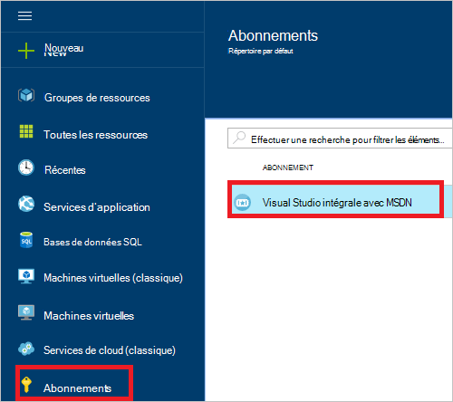
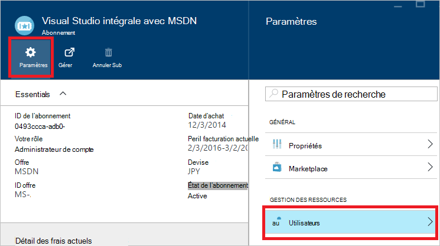
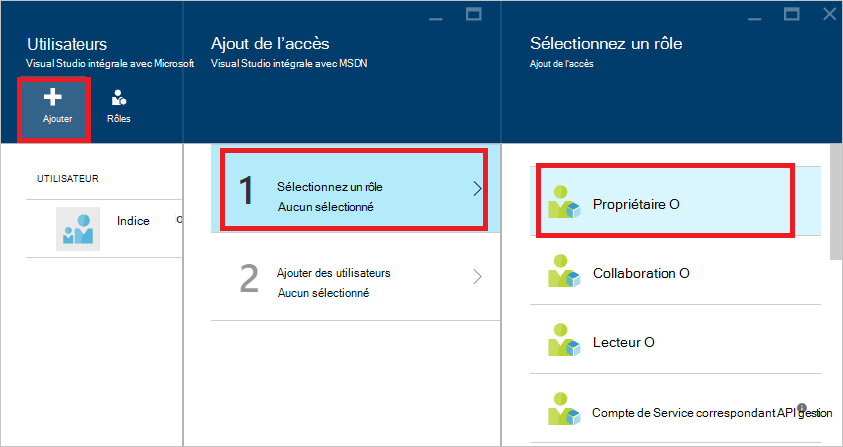
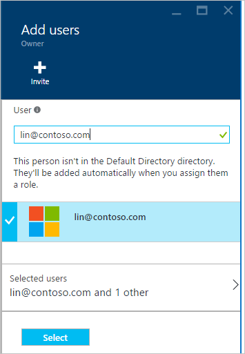
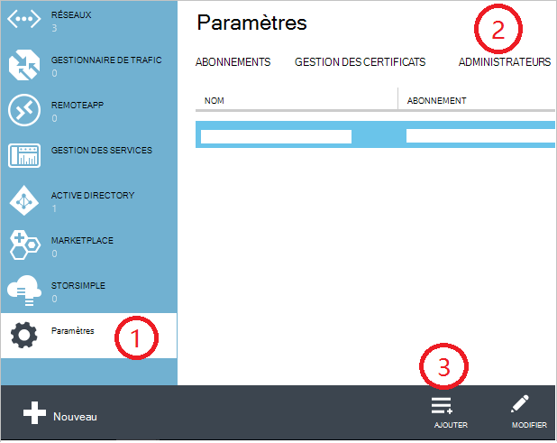
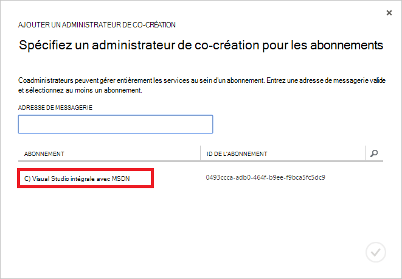
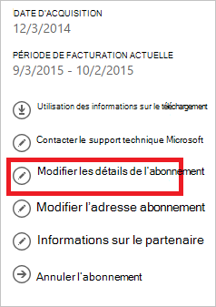
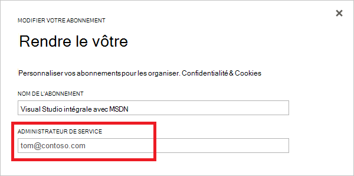

<properties
    pageTitle="Comment ajouter ou modifier des rôles d’administrateur Azure | Microsoft Azure"
    description="Décrit comment ajouter ou modifier Azure co-création administrateur, administrateur de Service et d’administrateur de compte"
    services=""
    documentationCenter=""
    authors="genlin"
    manager="mbaldwin"
    editor=""
    tags="billing"/>

<tags
    ms.service="billing"
    ms.workload="na"
    ms.tgt_pltfrm="na"
    ms.devlang="na"
    ms.topic="article"
    ms.date="08/17/2016"
    ms.author="genli"/>

# Comment ajouter ou modifier des rôles d’administrateur Azure

Il existe trois types de rôles d’administrateur dans Microsoft Azure :

| Rôle d’administrateur   | Limite  | Description
| ------------- | ------------- |---------------|
|Compte d’administrateur (AA)  | 1 par compte Azure  |Il s’agit de la personne qui a inscrit ou acheter des abonnements Azure et est autorisée à accéder au [Centre de compte](https://account.windowsazure.com/Home/Index) et effectuer diverses tâches de gestion. Ceux-ci incluent la possibilité de créer des abonnements, annuler l’abonnement, la facturation pour un abonnement ou à l’administrateur de Service.
| Administrateur de service (SA) | 1 par abonnement Azure  |Ce rôle est autorisé à gérer les services dans le [portail Azure](https://portal.azure.com). Par défaut, pour un nouvel abonnement, l’administrateur de compte est également l’administrateur de Service.|
|Co-création administrateur (CA) dans le [portail classique Azure](https://manage.windowsazure.com)|200 par abonnement| Ce rôle a les mêmes privilèges d’accès en tant que l’administrateur de Service, mais vous ne pouvez pas modifier l’association d’abonnements dans des répertoires Azure. |

> [AZURE.NOTE] Azure contrôle d’accès basé sur Active Directory rôle (RBAC) permet aux utilisateurs d’être ajoutés aux rôles plusieurs. Pour plus d’informations, voir [Contrôle d’accès basé sur Azure Active Directory rôle](./active-directory/role-based-access-control-configure.md).

> [AZURE.NOTE] Si vous avez besoin d’une aide supplémentaire à tout moment dans cet article, veuillez [contacter le support technique](https://portal.azure.com/?#blade/Microsoft_Azure_Support/HelpAndSupportBlade) pour obtenir votre problème résolu rapidement.

## Comment ajouter un administrateur pour un abonnement

**Portail Azure**

1. Connectez-vous au [portail Azure](https://portal.azure.com).

2. Dans le menu concentrateur, sélectionnez **abonnement** > *l’abonnement auquel vous souhaitez que l’administrateur pour accéder à*.

    

3. Dans la carte de l’abonnement, sélectionnez **paramètres**> **utilisateurs**.

    
4. Dans la carte utilisateurs, sélectionnez **Ajouter**>**Sélectionner un rôle** > **propriétaire**.

    

    **Remarque**
    - Le rôle de propriétaire comporte les mêmes privilèges d’accès en tant qu’administrateur Co-création. Ce rôle n’a pas les privilèges d’accès au [Centre de compte Azure](https://account.windowsazure.com/subscriptions).
    - Les propriétaires que vous avez ajouté via le [portail Azure](https://portal.azure.com) ne peuvent pas gérer les services dans le [portail classique Azure](https://manage.windowsazure.com).  

5. Tapez l’adresse de messagerie de l’utilisateur que vous voulez ajouter en tant que propriétaire, cliquez sur l’utilisateur, puis sur **Sélectionner**.

    

**Portail classique Azure**

1. Connectez-vous au [portail classique Azure](https://manage.windowsazure.com/).

2. Dans le volet de navigation, sélectionnez **paramètres**> **administrateurs**> **Ajouter**.  

    

3. Tapez l’adresse de messagerie de la personne que vous voulez ajouter en tant qu’administrateur Co-création, puis sélectionnez l’abonnement auquel vous souhaitez que l’administrateur pour accéder à la. 

     

L’adresse de messagerie suivants peut être ajouté en tant qu’un administrateur de co-création :

* **Compte Microsoft** (anciennement Windows Live ID)  
 Vous pouvez utiliser un Account Microsoft pour se connecter à tous les produits Microsoft orientés consommateur et cloud services, tels que Outlook (Hotmail) Skype (MSN), OneDrive, Windows Phone et Xbox LIVE.
* **Compte professionnel** 
 Compte d’organisation est un compte qui est créé sous Azure Active Directory. L’adresse de compte d’organisation ressemble à ce qui suit : user@ &lt;votre domaine&gt;. onmicrosoft.com

### Restrictions et limitations

 * Chaque abonnement est associé à un répertoire Azure AD (également connu sous le répertoire par défaut). Pour rechercher le répertoire par défaut, l’abonnement est associé, accédez au [portail classique Azure](https://manage.windowsazure.com/), sélectionnez **paramètres** > **abonnements**. Vérifier l’ID de l’abonnement pour rechercher le répertoire par défaut.

 * Si vous êtes connecté avec un Account Microsoft, vous pouvez uniquement ajouter des autres Accounts Microsoft ou les utilisateurs au sein de l’annuaire par défaut en tant qu’administrateur de co-création.

 * Si vous êtes connecté avec un compte d’entreprise, vous pouvez ajouter d’autres comptes professionnels de votre organisation en tant qu’administrateur Co-création. Par exemple, abby@contoso.com pouvez ajouter bob@contoso.com tant qu’administrateur de Service ou l’administrateur de co-création, mais vous ne pouvez pas ajouter john@notcontoso.com , sauf si john@noncontoso.com est l’utilisateur dans le répertoire par défaut. Les utilisateurs connectés avec des comptes d’organisation peuvent continuer à ajouter des utilisateurs de Microsoft Account tant qu’administrateur de Service ou administrateur de co-création.

 * À présent qu’il soit possible pour vous connecter à Azure avec un compte professionnel, voici les modifications apportées aux exigences de compte administrateur de Service et de co-création administrateur :

    Méthode de connexion| Ajouter Account Microsoft ou des utilisateurs au sein de répertoire par défaut comme autorité de certification ou SA ?  |Ajouter un compte professionnel dans la même organisation qu’autorité de certification ou SA ? |Ajouter un compte professionnel dans une autre organisation comme autorité de certification ou SA ?
    ------------- | ------------- |---------------|---------------
    Compte Microsoft |Oui|N°|N°
    Compte professionnel|Oui|Oui|N°

## Comment changer l’administrateur de Service pour un abonnement

Seul l’administrateur de compte peut changer l’administrateur de Service pour un abonnement.

1. Ouvrez une session dans le [Centre de compte Azure](https://account.windowsazure.com/subscriptions) à l’aide de l’administrateur de compte.

2. Sélectionnez l’abonnement que vous souhaitez modifier.

3. Sur le côté droit, cliquez sur **Modifier l’abonnement** .  

    

4. Dans la zone **Administrateur de SERVICE** , entrez l’adresse de messagerie de l’administrateur de Service nouveau.  

    

## Comment changer l’administrateur de compte

Pour transférer la propriété du compte Azure vers un autre compte, voir [Transférer la propriété d’un abonnement Azure](billing-subscription-transfer.md).

## Étapes suivantes

* Pour en savoir plus sur la façon dont l’accès aux ressources est contrôlé dans Microsoft Azure, voir [Présentation de l’accès ressource dans Azure](./active-directory/active-directory-understanding-resource-access.md)

* Pour plus d’informations sur la façon dont Azure Active Directory est liée à votre abonnement Azure, voir [comment Azure abonnements sont associés à Azure Active Directory](./active-directory/active-directory-how-subscriptions-associated-directory.md)

* Pour plus d’informations sur la façon dont Azure Active Directory est liée à votre abonnement Azure, voir [affectation de rôles administrateur dans Azure Active Directory](./active-directory/active-directory-assign-admin-roles.md)

> [AZURE.NOTE] Si vous avez des questions, veuillez [contacter le support technique](https://portal.azure.com/?#blade/Microsoft_Azure_Support/HelpAndSupportBlade) pour obtenir votre problème résolu rapidement.
