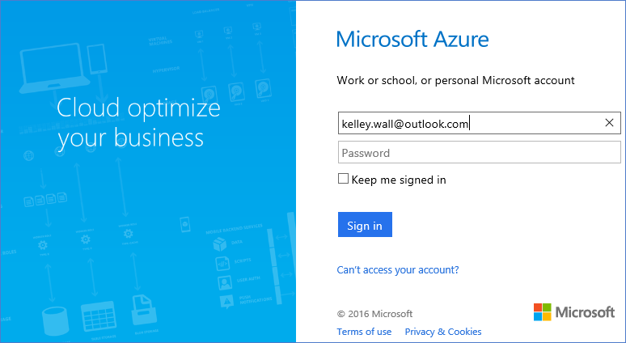
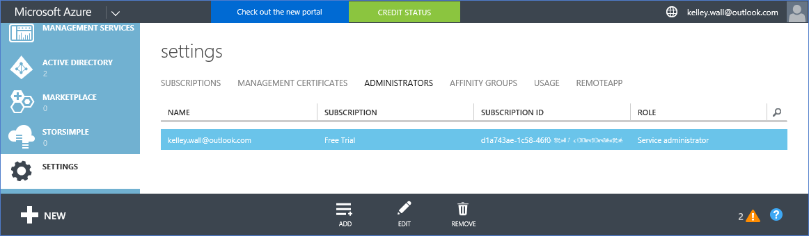
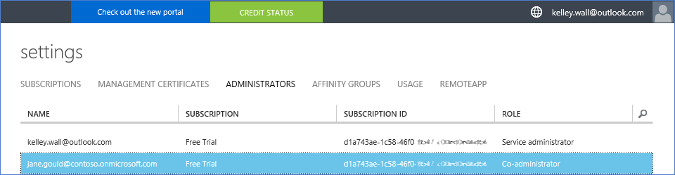

<properties
    pageTitle="Utilisez un client Office 365 avec un abonnement Azure | Microsoft Azure"
    description="Découvrez comment ajouter un annuaire Office 365 (client) à un abonnement Azure pour établir l’association."
    services=""
    documentationCenter=""
    authors="JiangChen79"
    manager="mbaldwin"
    editor=""
    tags="billing,top-support-issue"/>

<tags
    ms.service="billing"
    ms.workload="na"
    ms.tgt_pltfrm="ibiza"
    ms.devlang="na"
    ms.topic="article"
    ms.date="09/16/2016"
    ms.author="cjiang"/>

# Associer un client Office 365 avec un abonnement Azure
Si vous avez acquis séparément abonnements Azure et Office 365 par le passé, et maintenant que vous voulez être en mesure d’accéder au client Office 365 de l’abonnement Azure, il est facile pour le faire. Cet article vous explique comment procéder.

> [AZURE.NOTE] Cet article ne s’applique pas aux clients accord entreprise (EA).

## Conseils rapides
Pour associer votre client Office 365 à votre abonnement Azure, votre compte Azure permet d’ajouter votre client Office 365 et alors associer votre abonnement Azure le client Office 365.

## Procédure détaillée
Dans ce scénario, Kelley Wall est un utilisateur disposant d’un abonnement Azure sous le compte kelley.wall@outlook.com. Kelley est également un abonnement Office 365 sous le compte kelley.wall@contoso.onmicrosoft.com. Kelley souhaite à présent accéder le client Office 365 avec l’abonnement Azure.

### Conditions préalables
Pour l’association fonctionne correctement, les conditions préalables suivantes sont nécessaires :

- Vous devez les informations d’identification de l’administrateur de service de l’abonnement Azure. Coadministrateurs Impossible d’exécuter un sous-ensemble de la procédure.
- Vous devez les informations d’identification d’un administrateur global du client Office 365.
- L’adresse de messagerie de l’administrateur de service ne doit pas figurer dans le client Office 365.
- L’adresse de messagerie de l’administrateur de service doit correspondre pas à celui de n’importe quel administrateur global du client Office 365.
- Si vous utilisez actuellement une adresse de messagerie qui est un compte Microsoft et un compte professionnel, modifier temporairement l’administrateur de service de votre abonnement Azure pour utiliser un autre compte Microsoft. Vous pouvez créer un nouveau compte Microsoft dans la [page de connexion de compte Microsoft](https://signup.live.com/).

Pour modifier votre administrateur de service, procédez comme suit :

1. Connectez-vous au [portail de gestion des comptes](https://account.windowsazure.com/subscriptions).
2. Sélectionnez l’abonnement que vous souhaitez modifier.
3. Sélectionnez **Modifier les détails de l’abonnement**.

    

4. Dans la zone **Administrateur de SERVICE** , entrez l’adresse de messagerie du nouvel administrateur de service.

    

### Associer le client Office 365 à l’abonnement Azure
Pour associer le client Office 365 à l’abonnement Azure, procédez comme suit :

1.  Connectez-vous au [portail de gestion de compte](https://account.windowsazure.com/subscriptions) avec les informations d’identification d’administrateur de service.
2.  Dans le volet gauche, sélectionnez **ACTIVE DIRECTORY**.

    

    > [AZURE.NOTE] Le client Office 365 ne doit pas apparaître. Si elle s’affiche, passez à l’étape suivante.

    

3. Ajouter le client Office 365 à votre abonnement Azure.

    un. Sélectionnez **Nouveau** > **répertoire** > **créer personnalisé**.

    

    b. Dans la page **Ajouter un répertoire** , sous **répertoire**, sélectionnez **utiliser un répertoire existant**. Sélectionnez **je suis prêt à être déconnecté maintenant**, puis sélectionnez **complète** .

    

    c. Une fois que vous êtes déconnecté, connectez-vous à l’aide des informations d’identification de l’administrateur global de votre client Office 365.

    

    d. Sélectionnez **Continuer**.

    

    e. Sélectionnez **se déconnecter maintenant**.

    

    f. Connectez-vous au [portail de gestion de compte](https://account.windowsazure.com/subscriptions) avec les informations d’identification d’administrateur de service.

    

    g. Vous devriez voir votre client Office 365 dans le tableau de bord.

    

4. Modifier le répertoire associé à l’abonnement Azure.

    un. Sélectionnez **paramètres**.

    

    b. Sélectionnez votre abonnement Azure, puis **Modifier le répertoire**.
    

    c. Sélectionnez **suivant** .

    

    > [AZURE.WARNING] Vous recevrez un message d’avertissement que tous les administrateurs de co-création seront supprimées.

    

    >[AZURE.WARNING] En outre, tous les utilisateurs de [contrôle d’accès basé sur un rôle (RBAC)](./active-directory/role-based-access-control-configure.md) avec accès attribuées dans les groupes de ressources existants sont également été supprimés. Toutefois, le message d’avertissement mentionne uniquement la suppression des coadministrateurs.

    

    d. Sélectionnez **complète** .

5. Vous pouvez maintenant ajouter vos comptes d’organisation Office 365 en tant que coadministrateurs vers le client Azure Active Directory.

    un. Sélectionnez l’onglet **administrateurs** , puis **Ajouter**.

    

    b. Entrez un compte d’organisation de votre client Office 365, sélectionnez l’abonnement Azure, puis **achevé** .

    

    c. Revenez à l’onglet **administrateurs** . Vous devriez voir le compte d’organisation affiché en tant qu’administrateur Co-création.

    

6. Ensuite, vous pouvez tester access avec l’administrateur de co-création.

    un. Se déconnecter du portail de gestion des comptes.

    b. Ouvrez le [portail de gestion des comptes](https://account.windowsazure.com/subscriptions) ou le [portail Azure](https://portal.azure.com/).

    c. Si la page de connexion Azure possède un lien de **vous connecter avec votre compte d’organisation**, sélectionnez le lien. Dans le cas contraire, ignorez cette étape.

    

    d. Entrez les informations d’identification de l’administrateur de co-création, puis sélectionnez **se connecter**.

    

## Étapes suivantes
Scénarios connexes sont les suivantes :

- Vous avez souscrit un abonnement Office 365 déjà et que vous êtes prêt pour un abonnement Azure, mais que vous voulez utiliser les comptes d’utilisateur Office 365 existants pour votre abonnement Azure.
- Vous êtes abonné Azure et que vous souhaitez obtenir un abonnement Office 365 pour les utilisateurs de votre instance Azure Active Directory existant.

Pour découvrir comment effectuer ces tâches, voir [utiliser votre Office 365 existant du compte avec votre abonnement Azure, ou vice versa](billing-use-existing-office-365-account-azure-subscription.md).
