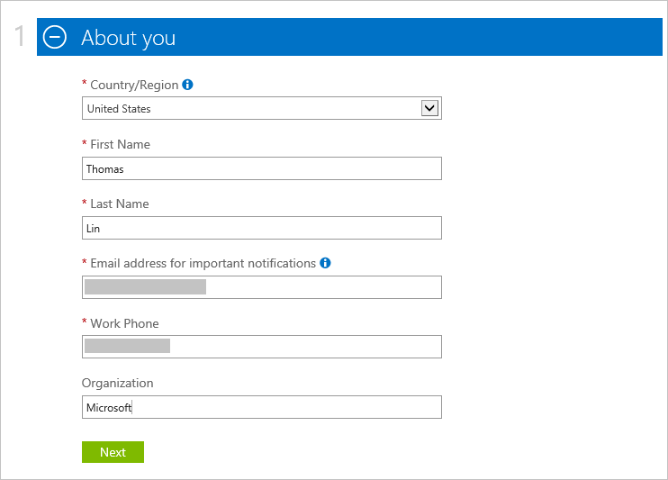

<properties
    pageTitle="Comment faire pour vous inscrire à, acheter, mettre à niveau ou activer un abonnement Azure | Microsoft Azure"
    description="Décrit comment acheter ou s’inscrire à un abonnement Azure"
    services=""
    documentationCenter=""
    authors="genlin"
    manager="mbaldwin"
    editor=""
    tags="billing,top-support-issue"
    />

<tags
    ms.service="billing"
    ms.workload="na"
    ms.tgt_pltfrm="na"
    ms.devlang="na"
    ms.topic="article"
    ms.date="09/23/2016"
    ms.author="genli"/>

# Comment s’inscrire, acheter, mettre à niveau ou activer Azure

> [AZURE.NOTE] Si vous avez besoin d’une aide supplémentaire à tout moment dans cet article, veuillez [contacter le support technique](https://portal.azure.com/?#blade/Microsoft_Azure_Support/HelpAndSupportBlade) pour obtenir votre problème résolu rapidement.

Azure propose différentes offres selon vos besoins professionnels et commencer à utiliser Azure. Visitez [Azure offre](https://azure.microsoft.com/support/legal/offer-details/) pour une liste complète de toutes les offres actives avec des détails sur chaque offre sur ce qu’ils garde, des avantages et disponibilité par pays ou région.

## Azure offre - avantages et limites

Le tableau suivant fournit des détails sur les offres courantes :

| Offre                                                                              | Détail |
|--------------------------------------------------------------------------------------|---------|
| Version d’évaluation gratuite                                                                           |• [Guide d’abonnement et étape par étape](billing-buy-sign-up-azure-subscription.md#SignupFreeTrial) • [Avantages](https://azure.microsoft.com/pricing/free-trial/) • [Forum aux questions](https://azure.microsoft.com/pricing/free-trial-faq/) • [Mise à niveau d’une version d’évaluation gratuite de paiement](billing-buy-sign-up-azure-subscription.md#UpgradeFreeToPYG)     |
| Paiement                                                                        | • [D’abonnement](https://azure.microsoft.com/pricing/purchase-options/) • [Tarifs](https://azure.microsoft.com/pricing/)   |
| Code produit du fabricant (Microsoft Partner Network) - les membres reçoivent mensuels crédits Azure sans frais | • [Azure avantages pour les partenaires](https://azure.microsoft.com/offers/ms-azr-0025p/) • [Inscrire en tant que partenaire](http://go.microsoft.com/fwlink/?linkid=309258&clcid=0x409) ou [s’abonner à Microsoft Action pack](http://go.microsoft.com/fwlink/?linkid=525768&clcid=0x409) • Utilisez crédits Azure - accéder au [portail de code produit du fabricant](https://partner.microsoft.com) et vérifier votre statut d’éligibilité et suivez les étapes sous clés logicielles et avantages. Si vous ne peut pas vérifier votre éligibilité, contacter le [support de code produit du fabricant](https://partner.microsoft.com/Support/).   |
| Abonné MSDN et Visual Studio                                                      |• [Avantages de développement/Test MSDN](https://azure.microsoft.com/offers/ms-azr-0023p/) • [Avantages d’abonné visual Studio](https://azure.microsoft.com/pricing/member-offers/msdn-benefits-details/) • [Activer Visual Studio abonné crédit Azure](https://azure.microsoft.com/pricing/member-offers/msdn-benefits-details/) • [Avantages activer MSDN Azure en trois étapes simples](https://www.youtube.com/watch?v=SN2CA71uOEI&feature=youtu.be):  Connectez-vous au [page compte MSDN](https://msdn.microsoft.com/subscriptions/manage/default.aspx) et vérifier l’éligibilité, cliquez sur « Avantage Azure activer ». Si vous ne peut pas vérifier votre éligibilité, contactez les [Centres de Service clientèle MSDN abonnements](https://msdn.microsoft.com/subscriptions/contactus.aspx).|
| BizSpark                                                                             | • [Avantages BizSpark](https://www.microsoft.com/bizspark/default.aspx#start-two). Pour plus d’informations, voir [bancaire mensuel Azure pour Visual Studio Enterprise](https://azure.microsoft.com/offers/ms-azr-0064p/) • [Rejoindre BizSpark](https://www.microsoft.com/bizspark/signup/default.aspx). Si vous rencontrez des problèmes, contactez l' [Équipe BizSpark](mailto:bizspark@microsoft.com?subject=BizSpark%20Support&body=Thank%20you%20for%20contacting%20BizSpark.%20Please%20provide%20as%20much%20of%20the%20following%20information%20as%20possible,%20as%20it%20will%20help%20expedite%20our%20response%20to%20you.%0aContact%20name:%0aStartup%20name:%0aMicrosoft%20Account/Live%20ID:%0aSpecific%20description%20of%20issue%20experienced%20or%20question:%0a%0aThank%20you,%0a%0aThe%20BizSpark%20Team).      |
| Signe Plus BizSpark                                                                        |• [En savoir plus sur le signe Plus BizSpark](https://www.microsoft.com/bizspark/plus/default.aspx). Pour plus d’informations, voir [BizSpark ainsi que des avantages](https://azure.microsoft.com/offers/ms-azr-0149p/) • [BizSpark joindre](https://www.microsoft.com/bizspark/signup/default.aspx) et travailler avec votre partenaire contactez mise à niveau vers BizSpark Plus. Si vous rencontrez des problèmes, contactez l' [Équipe BizSpark](mailto:bizspark@microsoft.com?subject=BizSpark%20Support&body=Thank%20you%20for%20contacting%20BizSpark.%20Please%20provide%20as%20much%20of%20the%20following%20information%20as%20possible,%20as%20it%20will%20help%20expedite%20our%20response%20to%20you.%0aContact%20name:%0aStartup%20name:%0aMicrosoft%20Account/Live%20ID:%0aSpecific%20description%20of%20issue%20experienced%20or%20question:%0a%0aThank%20you,%0a%0aThe%20BizSpark%20Team).     |
| Revendeurs (programmes de licence en Volume Open)                                             |• [Activer Online service clé - guide étape par étape](billing-buy-sign-up-azure-subscription.md#activateKey) • [Achat, avantages, activer](https://azure.microsoft.com/offers/ms-azr-0111p/)        |
| EA (accord entreprise)                                                            |• [Licence Azure pour les entreprises](https://azure.microsoft.com/pricing/enterprise-agreement/) • À activer, contactez votre responsable de compte Microsoft ou revendeur pour commencer aujourd'hui     |

## S’inscrire à un abonnement d’essai gratuit Azure

Pour vous inscrire pour un abonnement d’essai gratuit Azure, vous devez fournir un numéro de téléphone, une carte de crédit et un Account Microsoft. Votre compte Microsoft est l’adresse de messagerie que vous utilisez, ainsi que votre mot de passe pour vous connecter à n’importe quel programme Windows Live ou service, tel que Outlook, Hotmail ou OneDrive. Vous pouvez configurer un compte Microsoft à l’aide de n’importe quelle adresse de messagerie appartenant à vous, y compris votre messagerie d’entreprise. Pour plus d’informations, consultez [compte Microsoft Forum aux questions](https://www.microsoft.com/account/faq.aspx) .

Voir [Résolution des problèmes de l’abonnement à un Azure](billing-troubleshoot-azure-sign-up-issues.md) si vous rencontrez des problèmes.

>[AZURE.NOTE] Vos informations de carte de crédit et le numéro de téléphone servent uniquement à vérifier votre identité. Bien que votre carte de crédit ne sont pas appliquée, Microsoft place un blocage d’autorisation sur celui-ci pour une quantité minimale vérifier que la carte de crédit est valide. La mise en attente passera dans les jours ouvrés 3 à 5, en fonction des stratégies de votre établissement financier.

1. Ouvrir la [page d’évaluation gratuite Azure](https://azure.microsoft.com/pricing/free-trial/), puis sélectionnez **Démarrer maintenant**.

2. Connectez-vous avec votre compte Microsoft ou compte professionnel.

3. Dans la section **vous concernant** , entrez vos informations personnelles. [En savoir plus](billing-troubleshoot-azure-sign-up-issues.md#i-am-getting-an-error-when-entering-my-information-to-sign-up) sur la saisie de vos informations personnelles avec précision.

    

    >[AZURE.NOTE] Les informations d’adresse et pays messagerie que vous fournissez lorsque vous vous inscrivez pour un abonnement Azure seront toujours associées à l’abonnement et ne peuvent pas être modifiées ultérieurement.

4. Dans la section **vérification par téléphone** , vous devez fournir un numéro de téléphone pour recevoir un code de vérification que vous pouvez fournir pour terminer le processus de vérification.

    Vous pouvez choisir de recevoir le code de vérification en tant que message texte ou via un appel vocal. Effectuez votre choix en sélectionnant **Envoyer le message texte** ou **M’appeler**. Sélectionnez le code de numérotation internationale sur Internet pour votre pays dans la première zone, puis entrez votre numéro de téléphone dans la deuxième zone. Une fois que vous recevez le code de vérification, entrez-le dans la troisième zone, puis sur le bouton **vérifier le code** . [Consultez cet article pour plus d’informations](billing-troubleshoot-azure-sign-up-issues.md#i-am-not-getting-text-messages-or-calls-during-account-verification-when-i-try-to-sign-up).

    >[AZURE.NOTE] Vous ne pouvez pas utiliser un numéro de téléphone VOIP pour le processus de vérification du téléphone.

    

    Si vous ne recevez un message texte ou un appel, essayez d’utiliser un autre numéro de téléphone ou contactez le [Support technique Azure](https://portal.azure.com/#blade/Microsoft_Azure_Support/HelpAndSupportBlade) pour vous aider.

5. Dans la section **vérification par carte** , entrez les détails d’une carte de crédit valide. Ces informations sont collectées uniquement pour vérifier votre identité.

    Si vous recevez un message d’erreur après l’envoi de vos informations de carte de crédit, voir l’article [ma carte de crédit ne traitée lorsque j’essaie d’inscrire Azure](billing-credit-card-fails-during-azure-sign-up.md).

    

6. Dans la section **contrat** , cochez la case si vous acceptez le contrat d’abonnement, détails de l’offre et déclaration de confidentialité. Sélectionnez ensuite **s’inscrire**. Le formulaire de contrat peut varier par pays.

    

    Il peut prendre quelques minutes pour configurer votre abonnement. Si la configuration de l’abonnement ne se termine pas en seulement 15 minutes, contactez le [Support Azure](https://portal.azure.com/#blade/Microsoft_Azure_Support/HelpAndSupportBlade) .

    > [AZURE.NOTE] Si vous obtenez un message d’erreur, suivez les étapes décrites dans le message pour résoudre le problème. Un message d’erreur standard est la suivante :

    > **Désolé, que nous n’avons pas effectuer l’opération. Essayez à nouveau ultérieurement ou recharger la page web**

    > Dans ce cas, essayez d’utiliser un autre navigateur pour terminer le processus d’inscription. Si le problème persiste, contactez [Le Support Azure](https://portal.azure.com/#blade/Microsoft_Azure_Support/HelpAndSupportBlade) pour vous aider.

7. Lorsque l’abonnement est prêt, sélectionnez **commencer la gestion de mon service** pour commencer.

    

### Ressources supplémentaires

- [Je ne parviens pas à activer une version d’évaluation gratuite Azure](billing-troubleshoot-azure-sign-up-issues.md#i-cant-activate-an-azure-free-trial)
- [Essai gratuit azure Forum aux questions](https://azure.microsoft.com/pricing/free-trial-faq/).

## Mise à niveau de la version d’évaluation gratuite Azure vers paiement

1. Connectez-vous au [Portail de compte Azure](https://account.windowsazure.com/subscriptions) à l’aide du compte Microsoft ou votre compte professionnel que vous avez utilisé pour vous inscrire la version d’évaluation gratuite.

2. Sélectionnez l’abonnement, puis **mettre à niveau**

    

3. Sélectionnez **Oui**, puis **mettre à jour maintenant**.

    

Lorsque vous mettez à niveau d’un abonnement d’évaluation gratuite à un abonnement paiement, les avantages restant à partir de votre version d’évaluation gratuite telles que la limite de 30 jours ou 200 $ de crédit à utiliser sur les services Azure continuera jusqu'à ce qu’un d'entre eux est atteint. La mise à niveau de l’abonnement se produit par la suite.

## Activer à l’aide d’une clé d’Activation Service en ligne

Si vous avez acheté crédits **Azure dans la zone Ouvrir** à partir d’un revendeur vous utilisez une clé d’activation (clé 5 x 5), procédez comme suit pour activer votre abonnement :

1. Accédez à la [page de résumé d’abonnement](https://account.windowsazure.com/subscriptions).

2. Sélectionnez **Azure dans la zone Ouvrir**. Dans la page [Azure sous licence Open clé](https://azure.microsoft.com/offers/ms-azr-0111p/) , sélectionnez **Activer un nouvel abonnement ou abonnement existant**.

3. Entrez la clé de produit, puis puis cochez l’option contrat.

> [AZURE.NOTE] Si vous avez des questions, veuillez [contacter le support technique](https://portal.azure.com/?#blade/Microsoft_Azure_Support/HelpAndSupportBlade) pour obtenir votre problème résolu rapidement.
