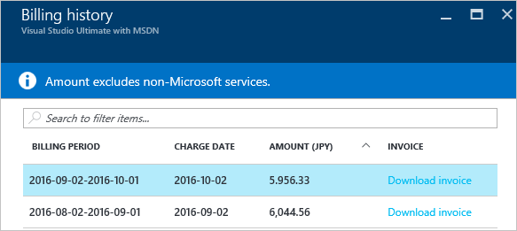

<properties
    pageTitle="Comment télécharger votre Azure facturation facture et quotidiennement les données d’utilisation | Microsoft Azure"
    description="Décrit comment télécharger votre facture facturation Azure et les données d’utilisation quotidienne"
    services=""
    documentationCenter=""
    authors="genlin"
    manager="mbaldwin"
    editor=""
    tags="billing"
    />

<tags
    ms.service="billing"
    ms.workload="na"
    ms.tgt_pltfrm="na"
    ms.devlang="na"
    ms.topic="article"
    ms.date="10/10/2016"
    ms.author="genli"/>

# Comment télécharger votre Azure facturation facture et quotidiennement les données d’utilisation

> [AZURE.NOTE] Si vous avez besoin d’une aide supplémentaire à tout moment dans cet article, veuillez [contacter le support technique](https://portal.azure.com/?#blade/Microsoft_Azure_Support/HelpAndSupportBlade) pour obtenir votre problème résolu rapidement.

En tant que l’administrateur du compte Azure, vous pouvez afficher la facture de facturation et les données d’utilisation quotidienne sur le [portail Azure](https://portal.azure.com) ou le [Centre de compte Azure](https://account.windowsazure.com/subscriptions). Voici comment :

## Portail Azure

1. Connectez-vous au [portail Azure](https://portal.azure.com) tant qu’administrateur de compte.

    >[AZURE.NOTE] Seul l’administrateur de compte est autorisé à accéder aux données facturation. Pour plus d’informations sur la façon de savoir qui est l’administrateur du compte de l’abonnement, voir [Forum aux questions](billing-subscription-transfer.md#faq).

2. Dans le menu concentrateur, sélectionnez **facturation**. Sur la carte **de facturation** , vous pouvez trouver des informations utiles telles que prochaine date de facturation.

    
3. Dans la section **coûts d’abonnement** , sélectionnez l’abonnement que vous souhaitez afficher.

    
4. Cliquez sur **facturation et l’utilisation**.

    

5. Dans la carte **votre historique de facturation** , cliquez sur **Télécharger une facture** pour afficher une copie de votre facture. Cliquez sur une période de facturation pour afficher les données d’utilisation quotidienne.

    

## Centre de compte Azure

1. Connectez-vous au [Centre de compte Azure](https://account.windowsazure.com/subscriptions) tant qu’administrateur de compte.
2. Sélectionnez l’abonnement pour lequel vous souhaitez que les informations facture et l’utilisation.
3. Sélectionnez **votre historique de facturation**.  
4. Vous pouvez voir les instructions pour les périodes de facturation six derniers et la période en cours non facturée.   
5. Sélectionnez **Afficher la déclaration en cours** pour afficher une estimation de vos frais au moment de que la génération de l’estimation. Cette information est uniquement mis à jour tous les jours et ne peut pas contenir toutes vos utilisation. Votre abonnement mensuel peut-être différer de cette estimation.   
6. Sélectionnez **Télécharger facture** à consulter une copie de votre facture dernière.  
7. Sélectionnez **L’utilisation de télécharger** pour télécharger les données d’utilisation quotidienne dans un fichier CSV. 

> [AZURE.NOTE] Si vous avez des questions, veuillez [contacter le support technique](https://portal.azure.com/?#blade/Microsoft_Azure_Support/HelpAndSupportBlade) pour obtenir votre problème résolu rapidement.
