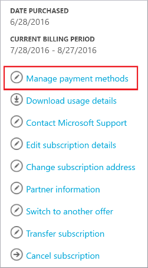

<properties
    pageTitle="Comment modifier la carte de crédit utilisée pour acheter un abonnement Azure | Microsoft Azure"
    description="Décrit comment la modification de la carte de crédit utilisée pour acheter un abonnement Azure"
    services=""
    documentationCenter=""
    authors="genlin"
    manager="mbaldwin"
    editor=""
    tags="billing"
    />

<tags
    ms.service="billing"
    ms.workload="na"
    ms.tgt_pltfrm="na"
    ms.devlang="na"
    ms.topic="article"
    ms.date="08/24/2016"
    ms.author="genli"/>

# Comment modifier la carte de crédit utilisée pour acheter un abonnement Azure

Parfois, vous devrez mettre à jour les détails de la carte de crédit dans vos informations de compte, ou modifier la carte utilisée pour payer votre facture.

Si votre carte de crédit est renouvelé et le nombre reste la même, vous pouvez simplement mettre à jour les détails de la carte de crédit existante, comme la date d’expiration.

Si votre numéro de carte de crédit change, en raison de perte, de vol ou arrive à expiration, vous devez ajouter la nouvelle carte de crédit à votre compte. C’est parce que le code de sécurité cryptogramme sur la carte est modifié lorsque le numéro de carte de crédit change.

> [AZURE.NOTE] Si vous avez besoin d’une aide supplémentaire à tout moment dans cet article, veuillez [contacter le support technique](https://portal.azure.com/?#blade/Microsoft_Azure_Support/HelpAndSupportBlade) pour obtenir votre problème résolu rapidement.

## Modifier les informations de paiement pour une carte de crédit existante
1. Connectez-vous au [Centre de compte Azure](https://account.windowsazure.com/Subscriptions) tant qu’administrateur de compte. Dans le [portail Azure](https://portal.azure.com), vous pouvez accéder au centre de compte en sélectionnant **abonnement**>*le nom de l’abonnement*>**Gérer**.

    > [AZURE.NOTE] Seul l’administrateur de compte est autorisé à accéder au centre de compte. Pour plus d’informations sur l’administrateur de compte, voir [comment ajouter ou modifier des rôles d’administrateur Azure](billing-add-change-azure-subscription-administrator.md).

2. Sous **cliquez sur un abonnement pour afficher les détails et l’utilisation**, sélectionnez l’abonnement lié à la carte de crédit.  
3. Sur le côté droit de la page, sélectionnez **Gérer les modes de paiement**.  
4. Dans la page **Gérer les modes de paiement** , sélectionnez **Modifier** en regard du numéro de carte de crédit.  
5. Dans la page **Modifier** , vérifiez que vous avez sélectionné le nombre de type et carte de carte de crédit.
6. Apportez les modifications que vous devez les détails de la carte, puis sélectionnez **suivant** à la page **choisir de paiement** .

## Ajouter une nouvelle carte de crédit comme mode de paiement
1. Ouvrez une session sur le [Centre de compte Azure](https://account.windowsazure.com/Subscriptions) tant qu’administrateur du compte.
2. Sous **cliquez sur un abonnement pour afficher les détails et l’utilisation**, sélectionnez l’abonnement pour lequel vous souhaitez ajouter un nouveau mode de paiement.
3. Sur le côté droit de la page, sélectionnez **Gérer les modes de paiement**.
4. Dans la page **Gérer les modes de paiement** , sélectionnez « + » pour ajouter une nouvelle carte de crédit.
5. Choisir un type de carte de crédit et puis fournissez toutes les informations requises.
6. Sélectionnez **suivant** pour revenir à la page **Gérer les modes de paiement** . Si la carte que vous avez ajouté est valide, il sera ajouté à la liste des modes de paiement disponibles.

## Modifier la carte de crédit que vous utilisez pour payer une facture Azure
1. Ouvrez une session sur le [Centre de compte Azure](https://account.windowsazure.com/Subscriptions) tant qu’administrateur du compte.
2. Sous **cliquez sur un abonnement pour afficher les détails et l’utilisation**, sélectionnez l’abonnement pour lequel vous souhaitez mettre à jour du mode de paiement.
3. Sur le côté droit de la page, sélectionnez **Gérer les modes de paiement**.
4. Dans la page **Gérer les modes de paiement** , cliquez sur **Utiliser à la place** pour sélectionner la carte de crédit que vous souhaitez utiliser.

## Suppression d’une carte de crédit à partir du compte
1. Ouvrez une session sur le [Centre de compte Azure](https://account.windowsazure.com/Subscriptions) tant qu’administrateur du compte.
2. Sous **cliquez sur un abonnement pour afficher les détails et l’utilisation**, sélectionnez l’abonnement pour lequel vous souhaitez mettre à jour du mode de paiement.
3. Sur le côté droit de la page, sélectionnez **Gérer les modes de paiement**.
4. Dans la page **Gérer les modes de paiement** , cliquez sur **Supprimer** pour sélectionner la carte de crédit que vous voulez supprimer.

    > [AZURE.NOTE] Vous ne pourrez pas supprimer une carte de crédit si elle est liée avec d’autres abonnements Microsoft actives. Si vous recevez un message d’erreur la carte est en cours d’utilisation, assurez-vous qu’il est dissocié de tous les abonnements actifs que vous avez avec Microsoft.

> [AZURE.NOTE] Si vous avez des questions, veuillez [contacter le support technique](https://portal.azure.com/?#blade/Microsoft_Azure_Support/HelpAndSupportBlade) pour obtenir votre problème résolu rapidement.
