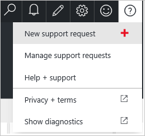

<properties
    pageTitle="Comment créer une demande d’assistance pour Azure facturation et d’abonnement | Microsoft Azure"
    description="Décrit comment créer une demande d’assistance pour Azure facturation et d’abonnement"
    services=""
    documentationCenter=""
    authors="genlin"
    manager="mbaldwin"
    editor=""
    tags="billing"
    />

<tags
    ms.service="billing"
    ms.workload="na"
    ms.tgt_pltfrm="na"
    ms.devlang="na"
    ms.topic="article"
    ms.date="08/24/2016"
    ms.author="genli"/>

# Comment créer une demande d’assistance pour les problèmes de facturation et d’abonnement Azure
Cet article fournit les informations que vous aurez besoin ouvrir un tickets avec Azure prise en charge.

1. Se connecter au [portail Azure](https://portal.azure.com/). Sélectionnez **aide + prise en charge**>**Nouveau prend en charge la demande**.

    
2. Dans la carte **Concepts de base** , sélectionnez le plan de type, abonnement et support problème.
3. Dans la carte de **problème** , fournissent les informations suivantes :

 * **Gravité**. Choisissez une option qui représente la gravité de votre demande. Pour plus d’informations sur les types de gravité, reportez-vous à la [Table de gravité Incident de Microsoft Azure](http://support.microsoft.com/gp/AzureSevDetails).
 * **Type de problème**. Sélectionnez un type de problème.
 * **Plus d’informations**. Donner un titre incidents à votre demande, puis utilisez le texte zones fournissent les informations requises et d’inclure des informations supplémentaires sur la demande.
 * **Intervalle de temps** (facultatif). Si possible, fournissent des informations de date, heure et fuseau horaire pour l’occurrence de la plus récente de votre problème.
 * Utilisez l’outil de **Téléchargement de fichier** pour joindre documentation associée à votre demande.
4. Dans la carte de **Visite d’informations** , vérifiez vos informations de contact et la méthode de contact favorite, puis cliquez sur **créer**.

Vous serez contacté par un représentant du support technique Azure selon les termes du contrat.

Vous pouvez également envoyer une demande de support à partir du site web Azure prend en charge ou à partir du centre de comptes Azure :

 * Pour envoyer une demande d’assistance à partir du [Azure prend en charge le site web](https://azure.microsoft.com/support/options/), cliquez sur **obtenir une assistance technique**.
 * Pour envoyer une demande d’assistance à partir du [Centre de compte Azure](https://account.windowsazure.com/Subscriptions), sélectionnez un abonnement, puis cliquez sur **Contacter le Support Microsoft**.

 >[AZURE.NOTE]Seul l’administrateur de compte Azure est autorisé à accéder au centre de compte. Pour plus d’informations sur la façon de savoir qui est l’administrateur du compte de l’abonnement, voir [Forum aux questions](billing-subscription-transfer.md#faq).
