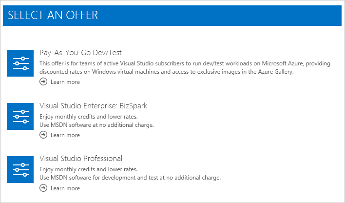

<properties
    pageTitle="Basculer votre abonnement Azure vers une autre offre | Microsoft Azure"
    description="Découvrez comment modifier votre abonnement Azure et basculer vers une autre offre à l’aide du portail de gestion d’abonnement"
    services=""
    documentationCenter=""
    authors="genlin"
    manager="mbaldwin"
    editor=""
    tags="billing,top-support-issue"/>

<tags
    ms.service="billing"
    ms.workload="na"
    ms.tgt_pltfrm="na"
    ms.devlang="na"
    ms.topic="article"
    ms.date="09/30/2016"
    ms.author="genli"/>

# Basculer votre abonnement Azure vers une autre offre

En tant que [paiement](https://azure.microsoft.com/offers/ms-azr-0003p/) client, vous pourrez peut-être basculer votre abonnement Azure vers une autre offre dans le [Centre de compte](https://account.windowsazure.com/Subscriptions). Par exemple, vous pouvez utiliser cette fonctionnalité pour tirer parti des [crédits mensuels pour les abonnés Visual Studio](https://azure.microsoft.com/pricing/member-offers/msdn-benefits-details/). Si vous utilisez la [Version d’évaluation gratuite](https://azure.microsoft.com/free/), découvrez comment [mettre à niveau vers paiement](billing-upgrade-azure-subscription.md).

#### Qu’est pris en charge :

| De                                                              | À                                                                                      |
|-------------------------------------------------------------------|-----------------------------------------------------------------------------------------|
| [Paiement](https://azure.microsoft.com/offers/ms-azr-0003p/) | [Paiement développement/Test](https://azure.microsoft.com/offers/ms-azr-0023p/)              |
| [Paiement](https://azure.microsoft.com/offers/ms-azr-0003p/) | [Visual Studio Professionnel](https://azure.microsoft.com/offers/ms-azr-0059p/)          |
| [Paiement](https://azure.microsoft.com/offers/ms-azr-0003p/) | [Visual Studio Test Professional](https://azure.microsoft.com/offers/ms-azr-0060p/)     |
| [Paiement](https://azure.microsoft.com/offers/ms-azr-0003p/) | [Plateformes MSDN](https://azure.microsoft.com/offers/ms-azr-0062p/)                      |
| [Paiement](https://azure.microsoft.com/offers/ms-azr-0003p/) | [Visual Studio Enterprise](https://azure.microsoft.com/offers/ms-azr-0063p/)            |
| [Paiement](https://azure.microsoft.com/offers/ms-azr-0003p/) | [Visual Studio Enterprise (Bizspark)](https://azure.microsoft.com/offers/ms-azr-0064p/) |

> [AZURE.NOTE] Pour d’autres offrent des modifications, [contactez le support technique](https://portal.azure.com/?#blade/Microsoft_Azure_Support/HelpAndSupportBlade).
    
## Offres d’abonnement à commutateur

> [AZURE.VIDEO switch-to-a-different-azure-offer]

1.  Connectez-vous au [Centre de compte Azure](https://account.windowsazure.com/Subscriptions).

2.  Sélectionnez votre abonnement paiement.

3.  Cliquez sur **Basculer vers une autre offre**. Le bouton est uniquement disponible si vous utilisez paiement et terminé avec votre première période de facturation.

    
    
4.  **Sélectionnez l’offre que vous voulez** dans la liste des offres à que votre abonnement peut être changé. Cette liste varie selon les appartenances associé à votre compte. Si rien n’est disponible, consultez la [liste des offres disponibles, à que vous pouvez basculer](#whats-supported) et vérifiez que vous disposez de l’appartenance à droite. 

    

5.  En fonction de l’offre que vous changez, vous pouvez voir une note relative à l’impact du passage. Accédez à cette liste avec soin et suivez les instructions avant de poursuivre.

    

6.  Vous pouvez renommer votre abonnement. Par défaut, nous le configurer pour le nouveau nom de l’offre. Cliquez sur **Proposer commutateur** pour terminer le processus.

    

7.  Succès ! Votre abonnement est devenu la nouvelle offre.

## Pourquoi ne puis-je pas changer offres ?

Vous ne verrez pas **Basculer vers une autre offre** si :

- Vous n’êtes pas sur [paiement](https://azure.microsoft.com/offers/ms-azr-0003p/). Actuellement uniquement les abonnements paiement peuvent être changées à une autre offre.

    - Si vous utilisez la [Version d’évaluation gratuite](https://azure.microsoft.com/free/), découvrez comment [mettre à niveau vers paiement](billing-upgrade-azure-subscription.md).

    - Changer d’offre à partir d’un autre abonnement, [contactez le support technique](https://portal.azure.com/?#blade/Microsoft_Azure_Support/HelpAndSupportBlade).

- Vous utilisez toujours votre première période de facturation ; Vous devez attendre votre première période de facturation mettre fin avant de pouvoir changer d’offres.

Vous verrez peut-être **Aucune offre disponible dans votre région ou pays pour le moment** si :

- Vous n’êtes pas éligibles pour tous les commutateurs offre. Consultez la [liste des offres disponibles, à que vous pouvez basculer](#whats-supported).

## Que signifie la facturation et changement d’offre Azure à mon service ?

Voici les détails sur ce qui survient lorsque vous basculez Azure plans dans le centre de compte.

### Accès aux services

Il existe sans interruption de service pour tous les utilisateurs associé à l’abonnement. Toutefois, l’offre que vous basculez vers peut-être avoir des restrictions. Par exemple, certaines offres interdisent l’utilisation de production, et vous devez donc déplacer des ressources de production vers un autre abonnement.

### Facturation

Le jour que vous avez changé, une facture est générée pour tous les frais en suspens. Ensuite, votre abonnement est facturé par conditions de tarification de la nouvelle offre. La date de facturation abonnement modifie la date à laquelle vous avez modifié des offres. L’utilisation et les données de facturation avant le changement d’offre n’est pas conservé, nous vous recommandons de télécharger une copie avant de changer.

> [AZURE.NOTE] En raison de contraintes liés à la facturation, les commutateurs offre ne sont pas possibles dans le premier cycle de facturation après la création d’un abonnement.

## Puis-je migrer à partir de paiement à l’utilisation de [Fournisseur de solutions de Cloud](https://partner.microsoft.com/Solutions/cloud-reseller-overview) ou [Accord entreprise](https://azure.microsoft.com/pricing/enterprise-agreement/) (EA) ?

Nous ne pris en charge changement d’offre au fournisseur ou EA dans le centre de comptes. Pour déplacer votre abonnement existant dans EA, disposer votre administrateur d’inscription ajouter votre compte dans le EA. Ensuite, vous recevez un message électronique d’invitation. Lorsque vous suivez les instructions pour accepter l’invitation, vos abonnements sont déplacés automatiquement sous l’accord entreprise. Pour migrer vers fournisseur, voir [Migration d’abonnement Azure au fournisseur](https://blogs.technet.microsoft.com/hybridcloudbp/2016/08/26/azure-subscription-migration-to-csp/).

## Étapes suivantes

- Découvrez comment [Gérer les rôles d’administrateur](billing-add-change-azure-subscription-administrator.md) pour votre abonnement

- Effectuer le suivi de l’utilisation de votre en [téléchargeant facture et données d’utilisation](billing-download-azure-invoice-daily-usage-date.md)

## Besoin d’aide ? Contacter le support technique.

Si vous avez des questions, veuillez [contacter le support technique](https://portal.azure.com/?#blade/Microsoft_Azure_Support/HelpAndSupportBlade) pour obtenir votre problème résolu rapidement.
