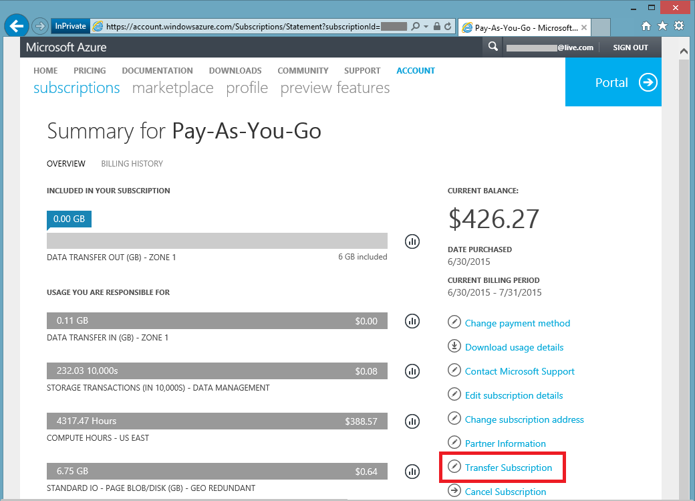

<properties
   pageTitle="Transfert de la propriété d’un abonnement Azure | Microsoft Azure"
   description="Comment transférer un abonnement Azure vers un autre utilisateur, certaines Forum aux questions (FAQ) sur le processus"
   services=""
   documentationCenter=""
   authors="genlin"
   manager="stevenpo"
   editor=""
   tags="billing,top-support-issue"/>

<tags
   ms.service="billing"
   ms.workload="na"
   ms.tgt_pltfrm="na"
   ms.devlang="na"
   ms.topic="article"
   ms.date="10/10/2016"
   ms.author="genli"/>

# Transfert de la propriété d’un abonnement Azure

Vraiment :

- Vous souhaitez cédez le facturation la propriété de votre abonnement Azure à quelqu'un d’autre ?
- Vous voulez changer le compte utilisé pour vous inscrire Azure ? Vous peut-être utilisé votre Account Microsoft, mais ne sont destinées à utiliser votre compte professionnel ou scolaire à la place ?
- Vous voulez déplacer votre abonnement Azure d’un répertoire vers un autre ?
- Avoir Azure et Office 365 dans différents clients et souhaitez consolider ?

Vous pouvez désormais faire ceci facilement dans le Microsoft Azure compte Centre - pour paiement, MSDN, Action Pack ou BizSpark abonnements.  Nous avons ajouté la possibilité de transférer votre abonnement à un autre utilisateur. En d’autres termes, vous pouvez désormais modifier le compte administrateur dans n’importe quel paiement, MSDN, Action Pack ou BizSpark abonnement dont vous êtes propriétaire, quel que soit le pays qui vous travaillez dans. Nous prennent désormais en charge le transfert d’Azure Marketplace achats pour ces types d’abonnements.

> [AZURE.NOTE] Pour modifier votre abonnement à une autre offre, voir [changer votre abonnement Azure à une autre offre](billing-how-to-switch-azure-offer.md) pour plus d’informations. Si vous avez besoin d’une aide supplémentaire à tout moment dans cet article, veuillez [contacter le support technique](https://portal.azure.com/?#blade/Microsoft_Azure_Support/HelpAndSupportBlade) pour obtenir votre problème résolu rapidement.

## Comment faire pour transférer la propriété d’un abonnement Azure

> [AZURE.VIDEO transfer-an-azure-subscription]

1.  Connectez-vous à <https://account.windowsazure.com/Subscriptions>. Vous devez être l’administrateur de compte pour effectuer un transfert de la propriété. Pour plus d’informations sur la façon de savoir qui est l’administrateur du compte de l’abonnement, voir [Forum aux questions](#faq).

2.  Sélectionnez l’abonnement à transférer.

3.  Cliquez sur l’option de **Transfert d’un abonnement** .

    

4.  Suivez les invites pour spécifier le destinataire.

    

5.  Le destinataire recevront un message électronique avec un lien d’acceptation.

    

6.  Le destinataire clique sur le lien et applique les instructions, y compris comment entrer ses informations de paiement.

    

    

7. Succès ! L’abonnement est automatiquement transférée maintenant.

## Forum aux questions (FAQ)

-   **Comment puis-je savoir qui est l’administrateur du compte de l’abonnement ?**

    Vous pouvez vérifier qui est l’administrateur du compte de l’abonnement comme suit :

    1. Connectez-vous au [portail Azure](https://portal.azure.com).
    2. Dans le menu concentrateur, sélectionnez **l’abonnement**.
    3. Sélectionnez l’abonnement que vous souhaitez vérifier, puis **paramètres**.
    4. Sélectionnez **Propriétés**. L’administrateur du compte de l’abonnement s’affichera dans la zone **Compte d’administrateur** .  

-   **Un transfert de l’abonnement entraîne dans les temps d’arrêt du service ?**

    Il n’existe aucun impact sur le service. Cela efficacement annule l’abonnement sous le compte actif administrateur et crée un nouveau sous compte du destinataire, mais associe les services Azure sous-jacents le nouvel abonnement. L’ID de l’abonnement reste la même.

-   **Comment utiliser ce mécanisme pour changer le répertoire par abonnement ?**-   
    Un abonnement Azure est créé dans le répertoire appartenant à l’administrateur de compte. Par conséquent, afin de changer le répertoire, simplement transférer l’abonnement à un compte d’utilisateur dans le répertoire cible. Lorsque cet utilisateur termine la procédure pour accepter transfert, l’abonnement déplace automatiquement dans le répertoire cible.

-   **Si j’ai prendre possession facturation d’un abonnement à partir d’une autre organisation, continueront qu’ils puissent accéder à mes ressources ?**

    Si l’abonnement est automatiquement transférée vers un autre client, les utilisateurs associés au client précédent seront perdues accès à l’abonnement. Même si un utilisateur n’est pas un administrateur de Service ou d’un administrateur de co-création plus, ils peuvent toujours ont accès à l’abonnement par d’autres mécanismes de sécurité. Parmi lesquels :
    - Certificats de gestion qui octroyez-lui les droits d’administrateur pour les ressources d’abonnement. Pour plus d’informations, voir [créer et télécharger un certificat de gestion de Azure](https://msdn.microsoft.com/library/azure/gg551722.aspx)
    -   Touches d’accès rapide pour les services tels que l’espace de stockage. Pour plus d’informations, voir [Afficher, copier et stockage régénérer les touches d’accès](storage-create-storage-account.md#view-copy-and-regenerate-storage-access-keys)
    -   Informations d’identification de l’accès à distance pour les services tels que Machines virtuelles Azure

    Il s’agit pas d’une liste complète. Le destinataire est conseillé d’actualiser tout secrets associés au service s’ils souhaitent limiter l’accès à leurs ressources. La plupart des ressources pouvant être mis à jour comme suit :

    1.   Accédez au portail Azure : [ *https://portal.azure.com*](https://portal.azure.com)

    2.    Cliquez sur Rechercher tout -&gt; toutes les ressources

    3.    Sélectionnez la ressource. Cette action ouvre la carte de ressources.

    4.    Dans la carte de la ressource, cliquez sur **paramètres**. Vous pouvez afficher et mettre à jour secrets existants.

-   **Si l’abonnement au milieu de la période de facturation transférer, cycle par le destinataire salaire pour la facturation entière ?**

    L’expéditeur est responsable du paiement pour toutes les utilisations qui a été signalé jusqu'à l’endroit que le transfert est terminé. Le destinataire est responsable de l’utilisation de l’heure du transfert à partir de. Il peut y avoir certains l’utilisation qui a eu lieu avant le transfert, mais a été signalée par la suite. Cela sera être inclus dans la facture du destinataire.

-   **Le destinataire a accès à l’utilisation et l’historique de facturation ?**

    Pour l’instant, la seule information révélée au destinataire est la quantité de la dernière facture (ou le solde actuel, si l’abonnement a été transféré avant que la première lettre a été généré). Le reste de l’utilisation et l’historique de facturation ne sont pas transférés l’abonnement.

-   **L’offre peut être modifiée lors d’un transfert ?**

    L’offre doit rester le même. Pour modifier votre offre, vous devez [contacter le support technique](http://go.microsoft.com/fwlink/?LinkID=619338).

-   **Puis-je transférer un abonnement à un compte d’utilisateur dans un autre pays ?**

    Non, pour le moment, qu'il n’est pas pris en charge. Compte d’utilisateur du destinataire doit être placé dans le même pays.

-   **Le destinataire peut utiliser un mécanisme de paiement différent ?**

    Oui. Il existe des limites ici : à présent l’historique de facturation de l’abonnement est fractionné sur deux comptes. Mais l’avantage est que vous pouvez le faire sans avoir à [contacter le support technique](http://go.microsoft.com/fwlink/?LinkID=619338).

-   **Le mode de paiement être affecté une fois que j’ai transféré un abonnement Azure ?**

    Pour accepter un transfert de l’abonnement, une carte de crédit ou de paiement similaire doit être fourni payer pour l’abonnement. Par exemple, si Bob transfère un abonnement à Jeanne et Jeanne accepte le transfert, Jeanne doit également fournir un mode de paiement qu’elle utilisera pour régler l’abonnement. Une fois que le transfert est terminé, Bob sera n’est plus facturé pour l’abonnement qu'il transféré à Jeanne.

## Étapes suivantes après avoir accepté la propriété d’un abonnement

1. Vous êtes l’administrateur de compte. Passez en revue et mettre à jour de l’administrateur de Service et Coadministrateurs. Gérer les administrateurs dans le [portail classique Azure](https://manage.windowsazure.com) en accédant à paramètres. [En savoir plus](http://go.microsoft.com/fwlink/?LinkID=533293).
2. Vous pouvez également utiliser le contrôle d’accès basé sur un rôle (RBAC) pour votre abonnement et les services. Visitez [portail Azure](https://portal.azure.com) [en savoir plus sur RBAC](http://go.microsoft.com/fwlink/?LinkID=544802)
3. Mettre à jour les informations d’identification associées aux services de cet abonnement. Parmi lesquels :
    - Certificats de gestion qui octroyez-lui les droits d’administrateur pour les ressources d’abonnement. Pour plus d’informations, voir [créer et télécharger une gestion des certificats pour Azure](https://msdn.microsoft.com/library/azure/gg551722.aspx)
    -   Touches d’accès rapide pour les services tels que l’espace de stockage. Pour plus d’informations, voir [Afficher, copier et stockage régénérer les touches d’accès](storage-create-storage-account.md#view-copy-and-regenerate-storage-access-keys)
    -   Informations d’identification de l’accès à distance pour les services tels que Machines virtuelles Azure
4. Mise à jour de la facturation des alertes pour cet abonnement, au [Centre de compte Azure](https://account.windowsazure.com/Subscriptions)  [en savoir plus](http://go.microsoft.com/fwlink/?LinkID=533292)
5.  Si vous travaillez avec un partenaire, vous pouvez mettre à jour l’ID de partenaire pour cet abonnement. Vous pouvez le faire dans le [Centre de compte Azure](https://account.windowsazure.com/Subscriptions).

> [AZURE.NOTE] Si vous avez des questions, veuillez [contacter le support technique](https://portal.azure.com/?#blade/Microsoft_Azure_Support/HelpAndSupportBlade) pour obtenir votre problème résolu rapidement.
