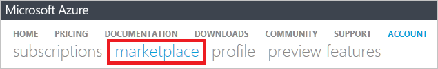

<properties
    pageTitle="Comprendre les frais de service externe Azure | Microsoft Azure"
    description="Obtenir des informations sur la facturation des services externes, auparavant connu sous le Marketplace, frais dans Azure."
    services=""
    documentationCenter=""
    authors="adpick"
    manager="felixwu"
    editor=""
    tags="billing"
    />

<tags
    ms.service="billing"
    ms.workload="na"
    ms.tgt_pltfrm="na"
    ms.devlang="na"
    ms.topic="article"
    ms.date="10/12/2016"
    ms.author="adpick"/>

# Comprendre les frais de service externe Azure

Cet article explique la facturation des services externes dans Azure. Services externes utilisés pour être appelé commandes Marketplace. Des Services externes sont fournies par des fournisseurs de services indépendants, mais sont complètement intégrés au sein du réseau Azure. Découvrez comment :

- Identifier des Services externes
- Comprendre comment la facturation diffère d’autres ressources Azure
- Afficher et suivre les coûts que vous méthode d’allocation à partir de l’utilisation des services externes
- Gérer des commandes de service externe et le mode de paiement pour les

## Quels sont les services externes Azure ?

Services externes utilisés pour être appelé Azure Marketplace. En règle générale, elles sont services publiés par des tiers disponibles pour Azure. Par exemple, ClearDB et SendGrid sont des services externes que vous pouvez acheter dans Azure, mais ne sont pas publiés par Microsoft.

### Identifier des services externes

Lorsque vous configurez un nouveau service externe ou une ressource, un avertissement s’affiche :

>[AZURE.NOTE] Services externes sont publiés par des sociétés qui ne sont pas Microsoft, mais parfois les produits Microsoft sont également considérés comme des services externes.

### Des services externes sont facturés séparément

Des services externes sont considérées comme des commandes individuelles au sein de votre abonnement Azure. La période de facturation pour chaque service est définie lorsque vous achetez le service. Ne pas confondre avec la période de facturation de l’abonnement dans lesquelles vous en avez acheté. Vous recevez également factures distinctes et votre carte de crédit est facturée séparément.

### Chaque service externe dispose d’un autre modèle de facturation

Certains services sont facturées dans un mode de paiement tandis que d’autres personnes utilisent un modèle de base paiement mensuel. Vous avez besoin d’une carte de crédit pour des services externes Azure, vous ne pouvez pas acheter des services externes avec payer par facture.

### Vous ne pouvez pas utiliser mensuels crédits gratuits pour des services externes

Si vous utilisez un abonnement Azure incluant [crédits gratuits](https://azure.microsoft.com/pricing/spending-limits/), ils ne peuvent pas être appliqués à factures service externe. Utiliser une carte de crédit pour acheter des services externes.

## Afficher les dépenses service externe et historique

Vous pouvez afficher une liste des services externes qui se trouvent sur chaque abonnement au sein du [portail Azure](https://portal.azure.com/): 

1. Connectez-vous au [portail Azure](https://portal.azure.com/) et [accédez à la carte de **facturation** ](https://portal.azure.com/?flight=1#blade/Microsoft_Azure_Billing/BillingBlade).

     
  
2. Dans la section **coûts d’abonnement** , sélectionnez l’abonnement que vous souhaitez afficher. 
   
    

3. Cliquez sur **services externes**.

    

4. Vous devriez voir chacun de vos commandes service externe, le nom de l’éditeur, niveau de service que vous avez acheté, nom vous avez affecté à la ressource et son statut actuel. Sélectionnez un service externe pour afficher les factures.

    

5. À partir de là, vous pouvez afficher les montants de facture, y compris la répartition des taxes.

    

## Gérer les modes de paiement pour les commandes service externe

Mettre à jour vos modes de paiement pour les commandes de service externe à partir du [Centre de compte](https://account.windowsazure.com/).

> [AZURE.NOTE] Si vous avez acheté votre abonnement avec un compte professionnel ou scolaire que vous devez [contacter le support technique](https://portal.azure.com/?#blade/Microsoft_Azure_Support/HelpAndSupportBlade) pour apporter des modifications à votre mode de paiement.

1. Connectez-vous au [Centre de compte](https://account.windowsazure.com/) et [accédez à l’onglet **marketplace** ](https://account.windowsazure.com/Store)

    

2. Sélectionnez le service externe à gérer

    

3. Cliquez sur **mode de paiement de modification** sur le côté droit de la page. Ce lien vous dirige vers un autre portail pour gérer votre mode de paiement.
    
    

4. Cliquez sur **Modifier les informations** et suivez les instructions pour mettre à jour vos informations de paiement.

    
    
## Annuler une commande service externe

Si vous voulez annuler votre commande service externe, vous devez supprimer cette ressource dans le [portail Azure](https://portal.azure.com).

## Besoin d’aide ? Contacter le support technique.

Si vous avez des questions, veuillez [contacter le support technique](https://portal.azure.com/?#blade/Microsoft_Azure_Support/HelpAndSupportBlade) pour obtenir votre problème résolu rapidement.
