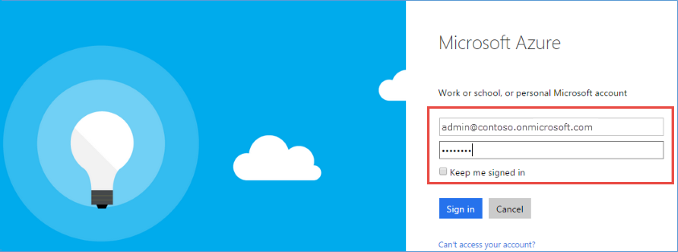

<properties
    pageTitle="Partager un seul client Azure AD abonnements Office 365 et Azure | Microsoft Azure"
    description="Découvrez comment partager votre client Azure AD Office 365 et ses utilisateurs avec votre abonnement Azure, ou vice versa"
    services=""
    documentationCenter=""
    authors="JiangChen79"
    manager="mbaldwin"
    editor=""
    tags="billing,top-support-issue"/>

<tags
    ms.service="billing"
    ms.workload="na"
    ms.tgt_pltfrm="ibiza"
    ms.devlang="na"
    ms.topic="article"
    ms.date="08/17/2016"
    ms.author="cjiang"/>

# Utiliser un compte Office 365 existant avec votre abonnement Azure ou vice versa
Scénario : Vous possédez déjà un abonnement Office 365 et êtes prêt pour un abonnement Azure, mais que vous voulez utiliser les comptes d’utilisateur Office 365 existants pour votre abonnement Azure. Par ailleurs, vous êtes abonné Azure et obtenir un abonnement Office 365 pour les utilisateurs de votre domaine Azure Active Directory existant. Cet article vous explique combien il est facile d’obtenir les deux.

> [AZURE.NOTE] Cet article ne s’applique pas aux clients accord entreprise (EA). Si vous avez besoin d’une aide supplémentaire à tout moment dans cet article, [contactez le support technique](https://portal.azure.com/?#blade/Microsoft_Azure_Support/HelpAndSupportBlade) à résoudre rapidement votre problème.

## Conseils rapides

- Si vous avez déjà avez souscrit un abonnement Office 365 et que vous voulez vous inscrire Azure, utilisez l’option **Connectez-vous avec votre compte d’organisation** . Poursuivez le processus d’inscription Azure avec votre compte Office 365. Consultez [la procédure détaillée plus loin dans cet article](#s1).

- Si vous avez souscrit un abonnement Azure déjà et pour obtenir un abonnement Office 365, connectez-vous à Office 365 avec votre compte Azure. Poursuivez les étapes d’inscription. Une fois que vous avez terminé la procédure d’abonnement, l’abonnement à Office 365 est ajouté à la même instance Azure Active Directory appartenant à votre abonnement Azure. Pour plus d’informations, voir section [procédure détaillée plus loin dans cet article](#s2).

>[AZURE.NOTE] Pour obtenir un abonnement Office 365, le compte que vous utilisez pour inscription doit être membre du rôle répertoire administrateur Global ou administrateur de facturation de votre client Azure Active Directory. [Apprenez à déterminer le rôle dans Azure Active Directory](#how-to-know-your-role-in-your-azure-active-directory).

Pour mieux comprendre que se passe-t-il lorsque vous ajoutez un abonnement à un compte, consultez les [informations générales plus loin dans l’article](#background-information).

## Procédure détaillée

### Scénario 1 : Office 365, les utilisateurs qui envisage d’Azure
Dans ce scénario, nous part du principe que Kelley Wall est un utilisateur qui dispose d’un abonnement Office 365 et planification pour vous abonner à Azure. Il existe deux utilisateurs actifs supplémentaires, Jeanne et Tricia. Compte de Kelley est admin@contoso.onmicrosoft.com.

Pour vous inscrire Azure, procédez comme suit :

1. Inscrivez-vous à Azure en [Azure.com](https://azure.microsoft.com/). Cliquez sur **essai gratuit**. Dans la page suivante, cliquez sur **Démarrer maintenant**.

    

2. Cliquez sur **Connectez-vous avec votre compte d’organisation**.

    

3. Connectez-vous avec votre compte Office 365. Dans ce cas, il est compte Office 365 de Kelley.

    

4. Renseignez les informations et terminer le processus d’inscription.

    

    

Maintenant que vous avez terminé. Dans le portail Azure, vous devriez voir les mêmes utilisateurs qui apparaissent. Pour ce faire, procédez comme suit :

1. Dans l’écran affiché précédemment, cliquez sur **commencer la gestion de mon service** .
2. Cliquez sur **Parcourir**, puis cliquez sur **Active Directory**.

    

3. Cliquez sur **utilisateurs**.

    

4. Tous les utilisateurs, y compris Kelley, sont répertoriées comme prévu.

    

### Scénario 2 : Azure utilisateurs envisagez d’achètent Office 365

Dans ce scénario, Kelley Wall est un utilisateur disposant d’un abonnement Azure sous le compte admin@contoso.onmicrosoft.com. Kelley souhaite vous abonner à Office 365 et utiliser le même répertoire qu’elle a déjà avec Azure.

>[AZURE.NOTE] Pour obtenir un abonnement Office 365, le compte que vous utilisez pour se connecter doit être membre du rôle répertoire administrateur Global ou administrateur de facturation de votre client Azure Active Directory. [Apprendre à connaître le rôle dans Azure Active Directory](#how-to-know-your-role-in-your-azure-active-directory).

Pour vous abonner à Office 365, procédez comme suit :

1. Accédez à la [page de produit Office 365](https://products.office.com/business)et sélectionnez un plan qui vous convient.
2. Après avoir sélectionné le plan, la page suivante s’affiche. Ne remplissent pas dans le formulaire. Dans le coin supérieur droit de la page, cliquez sur **se connecter** .

    

3. Connectez-vous à l’aide de vos informations d’identification de compte. Dans cet exemple, il est compte de Kelley.

    

4. Cliquez sur **Essayer maintenant**.

    

5. Dans la page Confirmation de la commande, cliquez sur **Continuer**.

    

Maintenant que vous avez terminé. Dans le centre d’administration Office 365, vous devriez voir les utilisateurs à partir du répertoire de Contoso s’affiche en tant qu’utilisateurs actifs. Pour ce faire, procédez comme suit :

1. Ouvrez le centre d’administration Office 365.
2. Développer **les utilisateurs**, puis cliquez sur **Utilisateurs actifs**.

    

### Comment connaître votre rôle dans votre Azure Active Directory

1. Connectez-vous au [portail Azure](https://portal.azure.com/).
2. Cliquez sur **Parcourir**, puis cliquez sur **Active Directory**.

    

3. Cliquez sur **utilisateurs**.

    

4. Cliquez sur l’utilisateur. Dans cet exemple, l’utilisateur est Kelley Wall.

    Notez que le champ du **Rôle d’organisation**.

    

## Informations générales sur les abonnements Azure et Office 365
Office 365 et Azure utilisent le service Azure Active Directory pour gérer les utilisateurs et les abonnements. Envisagez d’un répertoire Azure comme un conteneur dans lequel vous pouvez regrouper les utilisateurs et les abonnements. Pour utiliser le même compte d’utilisateur pour vos abonnements Azure et Office 365, vous devez vous assurer que les abonnements sont créés dans le même répertoire. Gardez à l’esprit les points suivants :

- Un abonnement est créé sous un répertoire, et non l’inverse.
- Les utilisateurs appartiennent répertoires, et non l’inverse.
- Un abonnement arrive dans l’annuaire de l’utilisateur qui crée l’abonnement. Par conséquent, votre abonnement Office 365 est lié au même compte en tant que votre abonnement Azure lorsque vous utilisez ce compte pour créer l’abonnement Office 365.

Pour plus d’informations, voir [comment Azure abonnements sont associés à Azure Active Directory](./active-directory/active-directory-how-subscriptions-associated-directory.md).

>[AZURE.NOTE] Abonnements Azure appartiennent à des utilisateurs individuels dans l’annuaire.

>[AZURE.NOTE] Abonnements Office 365 appartiennent à l’annuaire lui-même. Si les utilisateurs dans l’annuaire ont les autorisations requises, ils peuvent fonctionner sur ces abonnements.

## Étapes suivantes
Si vous avez acquis séparément votre Azure et Office 365 abonnements précédemment et que vous souhaitez pouvoir y accéder le client Office 365 à partir de l’abonnement Azure, voir [associer un client Office 365 avec un abonnement Azure](billing-add-office-365-tenant-to-azure-subscription.md).

> [AZURE.NOTE] Si vous avez encore des questions, [contactez le support technique](https://portal.azure.com/?#blade/Microsoft_Azure_Support/HelpAndSupportBlade) à résoudre rapidement votre problème.
