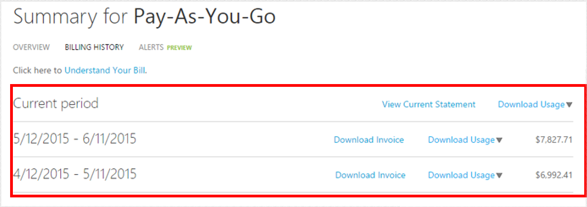
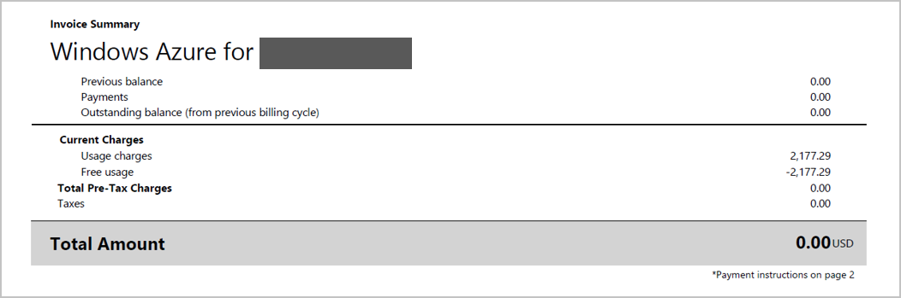
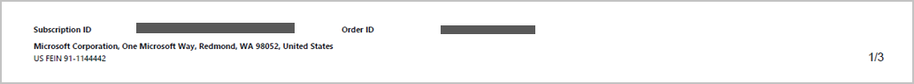
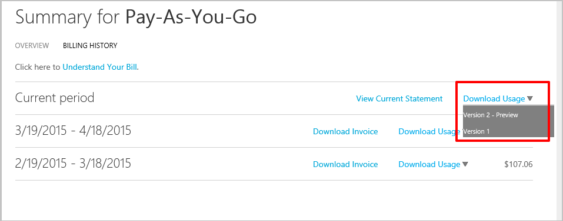
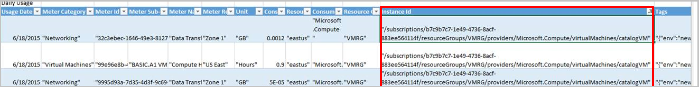

<properties
   pageTitle="Comprendre votre facture | Microsoft Azure"
   description="Apprenez à lire et comprendre l’utilisation et la facture pour votre abonnement Azure"
   services=""
   documentationCenter=""
   authors="genlin"
   manager="stevenpo"
   editor=""
   tags="billing"/>

<tags
   ms.service="billing"
   ms.devlang="na"
   ms.topic="article"
   ms.tgt_pltfrm="na"
   ms.workload="na"
   ms.date="10/31/2016"
   ms.author="erihur;genli"/>

# Comprendre votre facture pour Microsoft Azure

> [AZURE.NOTE] Si vous avez besoin d’une aide supplémentaire à tout moment dans cet article, veuillez [contacter le support technique](https://portal.azure.com/?#blade/Microsoft_Azure_Support/HelpAndSupportBlade) pour obtenir votre problème résolu rapidement.

Les frais pour les abonnements Microsoft Azure varient selon le plan de taux. Certains plans taux, tels que les abonnés Visual Studio Enterprise (MPN), incluent crédits mensuels que vous pouvez utiliser sur n’importe quel service Azure selon vos besoins.

Notez que l’à 24 heures d’une utilisation à partir de votre période de facturation préalable peut être déclaré dans votre période de facturation actuelle.

Pour plus d’informations sur la consommation et les plans de taux, voir la [page d’Options d’achat de Microsoft Azure](https://azure.microsoft.com/pricing/purchase-options/).

<!-- The below links cover a complete list of all Microsoft Azure services.

<!-- - [Service Details list (csv1)](https://azurepricing.blob.core.windows.net/supplemental/MOSPServices_csv1.xlsx)
<!-- - [Service Details list (csv2)](https://azurepricing.blob.core.windows.net/supplemental/MOSPServices_csv2.xlsx)

<!-- *NOTE: The **csv1** link refers to the column header names for csv version 1 and **csv2** link refers to the new column header names for csv version 2.  These files are updated monthly.*-->

### Afficher ou télécharger une facture pour Microsoft Azure :

1. Connectez-vous au [Centre de compte](https://account.windowsazure.com/subscriptions) à l’aide de votre Account Microsoft ou un ID d’organisation.

2. Cliquez sur l’abonnement dans lequel vous voulez voir les détails et l’utilisation.

3. Cliquez sur **votre historique de facturation**

    

4. La section **Historique de facturation** répertorie les instructions pour les périodes de facturation antérieures ainsi que la période en cours non facturée. L’instruction pour la période actuelle est une estimation de vos frais au moment où que l’estimation a été générée. Cette information est uniquement mis à jour tous les jours et ne peut pas contenir toutes les activités engagée jusqu'à ce jour. Votre abonnement mensuel peut-être différer de cette estimation.  

    

5. Cliquez sur **Afficher la déclaration en cours** pour afficher une estimation de vos frais au moment où que l’estimation a été générée. Cette information est uniquement mis à jour tous les jours et ne peut pas contenir toutes les activités engagée jusqu'à ce jour. Votre abonnement mensuel peut-être différer de cette estimation.

    

    

6. Cliquez sur **Télécharger une facture** pour afficher une copie de votre facture précédente.

    

> [AZURE.NOTE] Frais répertoriés sur la facturation des instructions pour les clients internationaux sont des estimations uniquement comme banques ont des coûts différents pour les taux de conversion.

Voici quelques exemples d’instructions pour les deux offres différentes disponibles sur Microsoft Azure.

 Type d’offre | Description | Télécharger |
 :--------- |:-------- | :-------|
Paiement | Paiement mensuel en retard | [Exemple de fichier](https://azurepricing.blob.core.windows.net/sampleinvoices/Microsoft_Azure_ccinvoice_Sample.pdf)
Offre d’engagement | Consacrez déduit à partir de votre engagement prépayée | [Exemple de fichier](https://azurepricing.blob.core.windows.net/sampleinvoices/Microsoft_Azure_invoice_Sample.pdf)

## Informations de compte

La section informations de compte identifie les informations pertinentes concernant votre utilisation et votre profil.

| Magasin de termes                | Description                                                                                         |
|---------------------|-----------------------------------------------------------------------------------------------------|
| N° facture         | Un identificateur de factures uniques pour des fins de suivi                                                   |
| Cycle de facturation       | L’intervalle de temps dans laquelle l’utilisation a eu lieu                                                       |
| Date de facturation        | Date à laquelle la facture a été générée                                                                 |
| Mode de paiement      | Type de paiement utilisé sur le compte (facture ou carte de crédit)                                   |
| Adresse de facturation             | Adresse de paiements de Microsoft Azure                                                                    |
| Offres d’abonnement  | Type d’offre d’abonnement a été acheté (paiement, BizSpark Plus, Azure passe, etc.) |
| Propriétaire de l’adresse de messagerie | L’adresse de messagerie du compte que le compte Microsoft Azure est enregistré sous                      |

## Comprendre le résumé de facture

La section **Résumé de la facture** de la facture résume les transactions depuis votre dernière facture et les frais de l’utilisation en cours.

Le solde précédent, paiements et solde section de la facture résume les transactions depuis votre dernière facture.

| Magasin de termes                                              | Description                                                                              |
|---------------------------------------------------|------------------------------------------------------------------------------------------|
| Solde précédent                                  | Le montant total dû à partir de votre dernière facture                                                 |
| Paiements                                          | Total des paiements appliqués à votre dernière facture                                                 |
| Solde (du cycle de facturation précédent) | Des ajustements facture (crédits ou soldes) appliqués à votre compte depuis votre dernière facture  |

## Comprendre les frais
La section des frais actuels de la facture contient des détails sur les frais mensuels. Les liens sont organisées en les sous-sections suivantes.

| Magasin de termes          | Description                                                                                                                                                                                                                                                                                                                                                                                                                                            |
|---------------|--------------------------------------------------------------------------------------------------------------------------------------------------------------------------------------------------------------------------------------------------------------------------------------------------------------------------------------------------------------------------------------------------------------------------------------------------------|
| Frais d’utilisation | Frais d’utilisation sont total des frais mensuels sur un abonnement. Vous êtes facturé en retard pour réduire l’utilisation de votre mois précédents.                                                                                                                                                                                                                                                                                                                                       |
| Remises     | Remises service appliqués à votre facture actuel est reflétées dans cet article.                                                                                                                                                                                                                                                                                                                                              |
| Ajustements   | Ajustements divers sont crédits divers ou frais en suspens appliqués à votre facture actuel. Par exemple, si vous avez la Visual Studio Enterprise avec offre MSDN, vous verrez un crédit mensuel dans cet article. Si vous annulez votre abonnement, vous verrez frais pour réduire l’utilisation mensuelle plus le crédit mensuel inclus dans votre offre à partir du début de la période de facturation actuelle à la date de l’annulation de votre abonnement.|

## Informations de pied de page

## Comprendre les informations supplémentaires
La page informations supplémentaires vous donne des références vers d’autres ressources à comprendre votre facture et des liens pour afficher votre activité et autres informations pertinentes pour votre facture.

### Utilisation détaillée
Un lien dans la description de **L’utilisation détaillées** vous dirige le centre de compte dans lequel vous pouvez afficher vos utilisation détaillées pour cet abonnement.  Il existe désormais deux versions disponibles pour le téléchargement : **.csv version 1** contient les champs de l’utilisation et une convention d’anciens et **.csv version 2** contient les noms de clients convivial pour chacune des catégories ainsi que des champs supplémentaires qui vous aidera à comprendre les services que vous utilisez sur Microsoft Azure. Notez que dans la version .csv 1 qu’il n’y a aucun détail Azure le Gestionnaire de ressources. Vous trouverez des informations de gestionnaire de ressources Azure au format .csv version 2.

### Informations supplémentaires et des ressources utiles
Cette section comporte des liens à des questions concernant la taille d’instance cluster, frais de base de données SQL et liens utiles pour vous aider à répondre à des questions simples.

| Magasin de termes                 | Description                                                                                                                            |
|----------------------|----------------------------------------------------------------------------------------------------------------------------------------|
| A vendu pour              | Ceci est prérempli avec l’adresse du profil sur le compte                                                                           |
| Instructions de paiement | Cette section est les instructions de paiement d’où vous souhaitez transférer chèques, transferts fils ou tests dépôts soit votre mode de paiement par facture |

## Comprendre les frais d’utilisation détaillées

Dans le cadre de notre engagement en cours pour aider les clients facilement gérer leur utilisation Azure, nous avons amélioré le fichier de l’utilisation de télécharger des rapports sur vos coûts et l’utilisation de services Azure.  Le lien de téléchargement contient deux versions du fichier l’utilisation :

- **Version 1** utilise le format existant

- **Version 2** inclut des informations supplémentaires et mises à jour des noms de colonnes dans la section Utilisation quotidienne.  

Frais d’utilisation sont frais total **mensuel** sur un abonnement inférieure tout crédit ou de remise. Vous êtes facturé en retard pour réduire l’utilisation de votre mois précédents.  La partie supérieure du fichier affiche les détails sur les services que vous êtes facturé pour lors du cycle de facturation du mois précédent.  Le tableau ci-dessus répertorie les noms des colonnes pour chacun des fichiers .csv version.

Version 1 |  Version 2  |  Description|
:---------------| :---------------- | --------|
Période de facturation | Période de facturation | La période de facturation lorsque la ressource a été consommée.
Nom | Compteur catégorie | Identifie le service de niveau supérieur pour lequel cette utilisation appartient.
Type | Compteur sous-catégorie | Service Azure peut également défini par type dans cette colonne, qui peut affecter le taux.
Ressource | Nom de compteur | Identifie l’unité de mesure pour la ressource est utilisée.
Région | Compteur région | Identifie l’emplacement du centre de données pour certains services dont le prix est basée sur l’emplacement du centre de données.
RÉFÉRENCE (SKU) | RÉFÉRENCE (SKU) | Identifie l’identificateur unique du système pour chaque ressource Azure.
Unité | Unité | Identifie l’unité que le service est facturé dans. Par exemple, Go, heures, 10,000s.
Consommées | Quantité consommée | Indique le montant de la ressource qui a été utilisée pendant la période de facturation.
Inclus | Quantité incluse | Indique le montant de la ressource qui est inclus sans frais dans votre période de facturation actuelle.
Facturables | Limites d’âge quantité | Si le montant utilisé dépasse le montant inclus, cette colonne affiche la différence. Vous êtes facturé pendant cette période. Pour les offres de paiement sans montant inclus avec l’offre, ce total est identique à la quantité utilisé.
Au sein d’engagement | Au sein d’engagement | Contient les frais de ressources sont diminues à partir de votre montant d’engagement associé à votre offre de 6 ou 12 mois. Les frais de ressources sont diminues de la quantité d’engagement dans l’ordre chronologique.
Devise | Devise | Affiche la devise reflétée dans votre période de facturation actuelle.
Excédent | Excédent | Contient les frais de ressources qui dépassent le montant de votre engagement associé à votre offre de 6 ou 12 mois.
Taux d’engagement | Taux d’engagement | Indique le taux d’engagement selon votre montant total engagement associé à votre offre de 6 ou 12 mois.
Taux | Taux | Taux affiche le taux que vous êtes chargé unitaire facturables.
Valeur | Valeur | Affiche le résultat de la multiplication de la colonne facturable par la colonne taux. Si le montant utilisé ne dépasse pas la quantité fournie, il sera sans frais dans cette colonne.

## Analyser les données d’utilisation quotidienne
Selon votre utilisation, on peut observer des milliers de lignes de données d’utilisation quotidienne. Si vous voulez analyser ces données, cliquez sur **L’utilisation de télécharger** et choisissez une version de fichier de variables séparées par des virgules (.csv) pour afficher vos données d’utilisation quotidienne pour la période de facturation appropriée.  Pour référence, vous pouvez télécharger un exemple de fichier .csv pour chaque version ci-dessous.

 Nom | Télécharger |
 :----------:| :-------: |
  Utilisation détaillée .csv Version 1|  [Exemple de fichier](https://azurepricing.blob.core.windows.net/supplemental/MOSPServices_csv1.xlsx)
  Utilisation détaillée .csv Version 2 | [Exemple de fichier](https://azurepricing.blob.core.windows.net/supplemental/MOSPServices_csv2.xlsx)

Dans le fichier .csv, les éléments sont décomposées pour afficher une liste de la quantité de chaque ressource a été consommée au sein de la période de facturation actuelle.

Les colonnes suivantes affichent les détails qui affectent les taux au début de la période de facturation :

Version 1 |   Version 2   |  Description |
:---------------| :----------------| -----|
Date de l’utilisation | Date de l’utilisation | La date lorsque la ressource a été émise.
Nom | Compteur catégorie | Identifie le service de niveau supérieur pour lequel cette utilisation appartient.
GUID de ressource | ID compteur | L’identificateur de compteur facturée.  Il est utilisé comme l’identificateur utilisé pour l’utilisation de facturation de prix.
Type | Compteur sous-catégorie | Service Azure peut également défini par type dans cette colonne, qui peut affecter le taux.
Ressource | Nom de compteur | Identifie l’unité de mesure pour la ressource est utilisée.
Région | Compteur région | Identifie l’emplacement du centre de données pour certains services dont le prix est basée sur l’emplacement du centre de données.
Unité | Unité | Identifie l’unité que le service est facturé dans. Par exemple, Go, heures, 10,000s.
Consommées | Quantité consommée | Indique le montant de la ressource qui a été utilisé pour ce jour.
Sub région | Emplacement de la ressource | Identifie le centre de données dans laquelle la ressource est en cours d’exécution.
Service | Service consommée | Cette colonne est utilisée pour effectuer le suivi du service plateforme Azure individuels qui sont ne peut-être pas spécifiquement identifié dans la colonne nom. Ce Service colonne indique l’utilisation du service quelles se rapporte.
N/A | Groupe de ressources | _**Nouveauté de colonne.**_ Dans laquelle la ressource déployée est en cours d’exécution dans le groupe de ressources. Reportez-vous à la [vue d’ensemble du Gestionnaire de ressources Azure](../azure-resource-manager/resource-group-overview.md)
Composant | ID de l’instance | L’identificateur de la ressource en cours d’exécution. L’identificateur contient le nom que vous spécifiez pour la ressource lorsqu’il a été créé.
N/A | Balises | _**Nouveauté de colonne.**_ Nouveaux types de ressources dans Azure vous permettent de ressources de balise. Reportez-vous à [organiser vos ressources Azure avec des balises](http://azure.microsoft.com/updates/organize-your-azure-resources-with-tags/)
Informations supplémentaires | Informations supplémentaires | Métadonnées supplémentaires relatives au service.
Informations relatives au service 1 | Informations relatives au service 1 | Cette colonne fournit le nom du projet auquel appartient le service sur votre abonnement.
Informations relatives au service 2 | Informations relatives au service 2 | Il s’agit d’un champ hérité qui capture les métadonnées spécifiques au service facultatives.

Outre les quelques nouveaux champs et les modifications de nom au format csv Version 2, il sera être normalisés mise en forme pour les données dans le dessous des champs :

- **ID de l’instance**: représente de champ de l’ID de l’Instance l’utilisateur spécifié identificateur pour le service de sa mise en service. Pour l’instant, il existe deux mises en forme à utiliser pour représenter l’ID de l’Instance : il est le nom de la ressource ou l’ID de ressource complet. Services Microsoft Azure sont en cours de transition pour représenter l’ID d’Instance dans un format Nº ressource complet standardisé _**(/subscriptions/<subscription id>/resourcegroups/<resourcegroupname>/providers/<providername>/<resourcename>)**_. Transition vers le nouveau format de services vous verrez le champ de données ID de l’Instance remplacez simplement le nom de la ressource ID de ressource. L’ID de ressource est le format utilisé par l' [API du Gestionnaire de ressources Azure](https://msdn.microsoft.com/library/azure/dn790567.aspx) pour identifier les ressources dans un abonnement.

- **Informations supplémentaires**: colonne The Info supplémentaires dans le fichier .csv l’utilisation spécifie les métadonnées spécifiques au service. Par exemple, un type d’image pour une machine virtuelle. Pour l’instant, un service émet spécifiques au service de métadonnées dans plusieurs colonnes : champs Infos supplémentaires, Service Info1 et Service informations 2. Pour standardisation des services Microsoft Azure, émission de métadonnées spécifiques au service de la colonne des informations supplémentaires.  Voir le ci-dessous instantané du format standard :

- **Balises**: cette colonne contienne l’utilisateur spécifié les balises de ressources. Les balises peuvent être utilisées pour regrouper des données de facturation. Par exemple, vous pouvez utiliser des balises pour distribuer des coûts par département au moyen du service. En savoir plus sur [l’utilisation de balises pour organiser les ressources Azure](../resource-group-using-tags.md). Les services qui prennent en charge les balises émission sont :  

    - Machines virtuelles

    - Stockage et

    - Services de réseau sa mise en service à l’aide de l' [API du Gestionnaire de ressources Azure](https://msdn.microsoft.com/library/azure/dn790567.aspx)

## Étapes suivantes

- [Définir des alertes de facturation](../billing-set-up-alerts.md)

- [Gérer vos méthodes de paiement](../billing-how-to-change-credit-card.md)

- [Comprendre les frais Azure Marketplace](../billing-understand-your-azure-marketplace-charges.md)

- [Forum aux questions sur Azure facturation et d’abonnement](../billing-subscription-faq.md)

> [AZURE.NOTE] Si vous avez des questions, veuillez [contacter le support technique](https://portal.azure.com/?#blade/Microsoft_Azure_Support/HelpAndSupportBlade) pour obtenir votre problème résolu rapidement.

<!--
OLD MSDN Articles
- [What do I do if my Azure subscription become disabled?](https://msdn.microsoft.com/library/azure/dn736049.aspx)
- [Edit payment information for an existing credit card](https://msdn.microsoft.com/library/azure/dn736053.aspx)
- [Add a new credit card to use as a payment method](https://msdn.microsoft.com/library/azure/dn736057.aspx)
- [Change the credit card on your Microsoft Azure account](https://msdn.microsoft.com/library/azure/dn736050.aspx)
- [Manage your payment method](https://msdn.microsoft.com/library/azure/dn736054.aspx)
-->

<!--Image references-->
