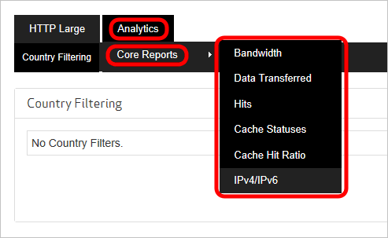
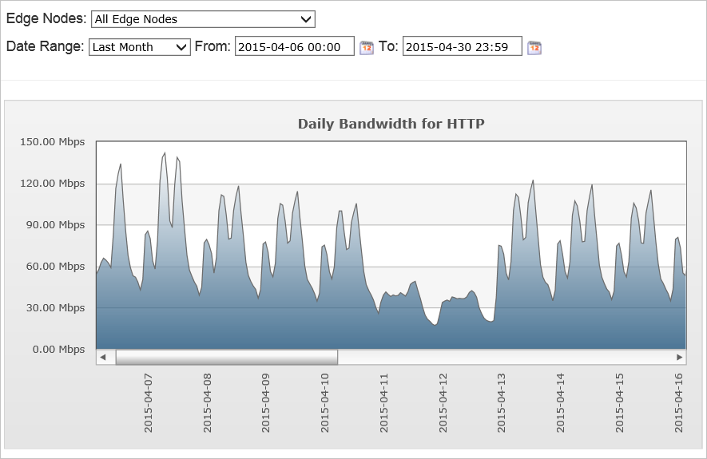
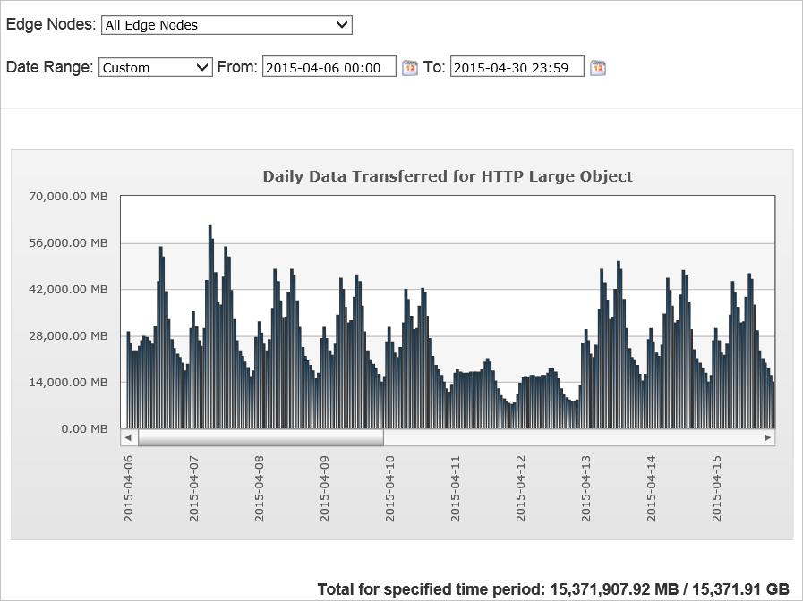
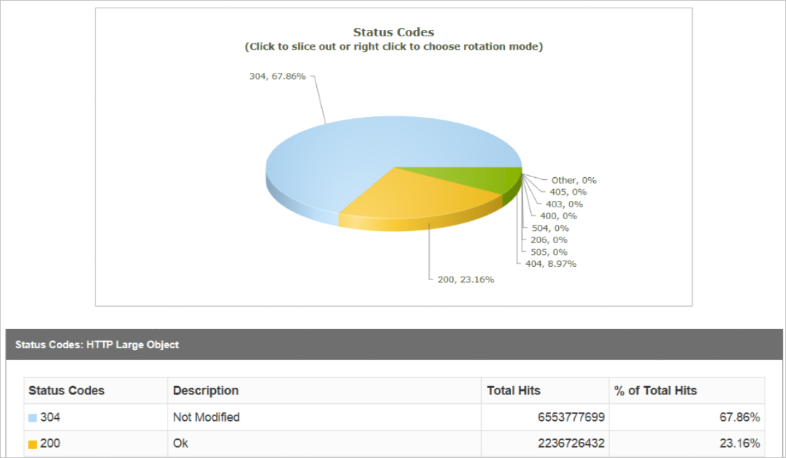

<properties
    pageTitle="Analyser les modèles d’utilisation Azure CDN | Microsoft Azure"
    description="Vous pouvez afficher des modèles d’utilisation pour votre fournisseur à l’aide de rapports suivants : la bande passante, les données transférées, accès, statuts de Cache, taux d’accès au Cache, IPV4/IPV6 données transférées."
    services="cdn"
    documentationCenter=""
    authors="camsoper"
    manager="erikre"
    editor=""/>

<tags
    ms.service="cdn"
    ms.workload="tbd"
    ms.tgt_pltfrm="na"
    ms.devlang="na"
    ms.topic="article"
    ms.date="07/28/2016"
    ms.author="casoper"/>

# Analyser les modèles d’utilisation Azure CDN

[AZURE.INCLUDE [cdn-verizon-only](../../includes/cdn-verizon-only.md)]

Vous pouvez afficher des modèles d’utilisation pour votre fournisseur à l’aide de rapports suivants :

- Bande passante
- Données transférées
- Accès
- Statuts de cache
- Taux de présence cache
- Données IPv4/IPV6 transférées

## L’accès aux rapports HTTP avancées

1. À partir de la carte de profil CDN, cliquez sur le bouton **Gérer** .

    

    Le portail de gestion CDN s’ouvre.

2. Placez le curseur sur l’onglet **Analytique** , puis placez le curseur sur le Lanceur de **Rapports de base** .  Cliquez sur le rapport souhaité dans le menu.

    

## Bande passante

Le rapport de bande passante consiste en un tableau de graphique et les données indiquant l’utilisation de la bande passante pour HTTP et HTTPS sur une période donnée. Vous pouvez afficher l’utilisation de la bande passante au sein de tous les CDN POP ou un POP particulier. Cela vous permet d’afficher les pointes de trafic et de distribution dans CDN s’affiche dans Mbps.

- Sélectionner tous les nœuds de bord pour voir le trafic de tous les nœuds ou choisissez un nœud/région spécifique dans la liste déroulante.
- Sélectionnez la plage de dates pour afficher des données pour le jour/semaine/mois, etc. ou entrez des dates personnalisées, puis cliquez sur « accédez » pour vous assurer que votre sélection est mis à jour.
- Vous pouvez exporter et télécharger les données en cliquant sur l’icône de feuille excel située en regard de « atteindre ».

Le rapport est mis à jour toutes les 5 minutes.

## Données transférées

Ce rapport se compose d’un tableau de données et graphique indiquant l’utilisation du trafic pour HTTP et HTTPS sur une période donnée. Vous pouvez afficher l’utilisation du trafic au sein de tous les CDN POP ou un POP particulier. Cela vous permet d’afficher les pointes de trafic et de distribution dans CDN s’en Go.

- Sélectionner tous les nœuds de bord pour voir le trafic de toutes les notes ou choisissez un nœud/région spécifique dans la liste déroulante.
- Sélectionnez la plage de dates pour afficher des données pour le jour/semaine/mois, etc. ou entrez des dates personnalisées, puis cliquez sur « accédez » pour vous assurer que votre sélection est mis à jour.
- Vous pouvez exporter et télécharger les données en cliquant sur l’icône de feuille excel située en regard de « atteindre ».

Le rapport est mis à jour toutes les 5 minutes.

## Accès (codes d’état)

Ce rapport décrit la distribution des codes de statut de demande pour votre contenu. Chaque demande de contenu générera un code d’état HTTP. Le code d’état décrit comment POP bord gérés à la demande. Par exemple, les codes d’état 2xx indiquent que la demande a été correctement pris en charge pour un client, tandis qu’un code d’état 4xx indique une erreur est survenue. Pour plus d’informations sur le code d’état HTTP, voir [codes de statut](https://en.wikipedia.org/wiki/List_of_HTTP_status_codes).

- Sélectionnez la plage de dates pour afficher des données pour le jour/semaine/mois, etc. ou entrez des dates personnalisées, puis cliquez sur « accédez » pour vous assurer que votre sélection est mis à jour.
- Vous pouvez exporter et télécharger les données en cliquant sur la feuille excel située en regard de « atteindre ».

## Statuts de cache

Ce rapport décrit la distribution des correspondances dans le cache et absences dans le cache de requête client. Dans la mesure où les meilleures performances provient d’accès au cache, vous pouvez optimiser vitesses de remise de données en réduisant échecs du cache et accès au cache qui a expiré. Échecs du cache peuvent être réduites en configurant votre serveur d’origine pour éviter d’affecter des en-têtes de réponse « no-cache », en évitant la chaîne de requête mise en cache, sauf si strictement nécessaire et en évitant les codes de réponse non mis en cache. Qui a expiré cache correspondances peuvent être évitées à l’aide d’un bien prendre beaucoup de temps max-age autant que possible pour réduire le nombre de requêtes au serveur d’origine.

### Statuts principal de cache sont les suivantes :

- TCP_HIT : Provenant de bord. L’objet était en cache et n'avait pas dépassée son âge max.
- TCP_MISS : Pris en charge d’origine. L’objet n’est pas dans le cache et la réponse était à l’origine.
- TCP_EXPIRED _MISS : pris en charge d’origine après la revalidation avec origine. L’objet dans le cache mais le dépasse son âge max. Une revalidation avec origine a donné lieu à l’objet de cache remplacée par une nouvelle réponse à partir d’origine.
- TCP_EXPIRED _HIT : provenant de bord après la revalidation avec origine. L’objet dans le cache mais le dépasse son âge max. Une revalidation avec le serveur d’origine a donné lieu à l’objet de cache en cours inchangé.

- Sélectionnez la plage de dates pour afficher des données pour le jour/semaine/mois, etc. ou entrez des dates personnalisées, puis cliquez sur « accédez » pour vous assurer que votre sélection est mis à jour.
- Vous pouvez exporter et télécharger les données en cliquant sur l’icône de feuille excel située en regard de « atteindre ».

### Liste complète des statuts de cache

- TCP_HIT - ce statut est signalé lorsqu’une demande est pris en charge directement à partir de la fenêtre contextuelle au client. Un bien fournie immédiatement à partir d’un POP lorsqu’il est mis en cache sur le plus proche du client POP et il a valide time to live ou TTL. Durée de vie est déterminée par les en-têtes de réponse suivants :

    - Contrôle du cache : s-maxage
    - Contrôle du cache : max-age
    - Arrive à expiration

- TCP_MISS - cet état indique qu’une version mise en cache de la ressource demandée est introuvable sur le plus proche du client POP. L’actif sera demandé à partir d’un serveur d’origine ou un serveur de protection d’origine. Si le serveur d’origine ou le serveur de protection d’origine renvoie un bien, il sera pris en charge pour le client et mis en cache sur le client et le serveur edge. Dans le cas contraire, un code d’état non-200 (par exemple, 403 interdit, 404 non trouvé, etc.) sera retourné.

- TCP_EXPIRED _HIT - ce statut est signalé lorsqu’une demande de destinée à un bien avec une durée de vie qui a expiré, tels que lorsque max-age l’actif a expiré, a été pris en charge directement à partir de la fenêtre contextuelle au client.

    Une requête qui a expiré résulte généralement dans une demande de revalidation sur le serveur d’origine. Dans l’ordre pour un _HIT TCP_EXPIRED se produise, le serveur d’origine doit indiquer qu’une version plus récente de l’actif n’existe pas. Ce type de situation met à jour généralement cet actif Cache-Control et en-têtes de date d’expiration.

- TCP_EXPIRED _MISS - ce statut est signalé lorsqu’une version plus récente d’un bien expiré mis en cache est pris en charge à partir de la fenêtre contextuelle au client. Cela se produit lorsque la durée de vie d’un bien mis en cache a expiré (par exemple, expiré max-age) et le serveur d’origine retourne une version plus récente de cette ressource. Cette nouvelle version de l’actif sera servie au client à la place de la version en cache. Par ailleurs, il sera caché sur le serveur edge et le client.

- CONFIG_NOCACHE - cet état indique qu’une configuration spécifique au client sur notre bord POP empêché l’actif de mise en cache.

- Aucun : ce statut indique qu’une vérification de l’actualisation du contenu de cache n’a pas été effectuée.

- TCP_ CLIENT_REFRESH _MISS - ce statut est signalé lorsqu’un client HTTP (par exemple, navigateur) force la création d’une bordure POP pour extraire une nouvelle version d’un bien obsolètes dans le serveur d’origine.

    Par défaut, un client HTTP empêchent nos serveurs de forcer notre serveurs edge pour récupérer une nouvelle version de l’actif depuis le serveur d’origine.

- TCP_ PARTIAL_HIT - ce statut est signalé lorsqu’une demande de plage d’octets produit comme résultat un accès à une ressource partiellement mis en cache. La plage d’octets demandée immédiatement fournie à partir de la fenêtre contextuelle au client.

- UNCACHEABLE - ce statut est signalé lorsque les en-têtes de contrôle du Cache et la date d’expiration d’un élément indiquent qu’elle ne doit pas être mis en cache sur un POP ou par le client HTTP. Ces types de requêtes sont servies à partir du serveur d’origine

## Taux de présence cache

Ce rapport indique le pourcentage de requêtes mis en cache qui ont été servies directement à partir du cache.

Le rapport fournit les informations suivantes :

- Le contenu demandé a été mis en cache dans la fenêtre contextuelle le plus proche au demandeur.
- La demande a été pris en charge directement à partir du bord de notre réseau.
- La demande ne pas demander la revalidation avec le serveur d’origine.

Le rapport n’inclut pas :

- Requêtes refusées en raison de pays options de filtrage.
- Demandes de biens dont en-têtes indiquent qu’ils ne doivent pas être mis en cache. Par exemple, Cache-Control : privé, Cache-Control : aucun cache ou Pragma : en-têtes du cache non empêchera un bien mis en cache.
- Demandes de plage octets pour le contenu partiellement mis en cache.

La formule est : (positionnement TCP_ / (positionnement TCP_ + TCP_MISS)) * 100

- Sélectionnez la plage de dates pour afficher des données pour le jour/semaine/mois, etc. ou entrez des dates personnalisées, puis cliquez sur « accédez » pour vous assurer que votre sélection est mis à jour.
- Vous pouvez exporter et télécharger les données en cliquant sur l’icône de feuille excel située en regard de « atteindre ».

## Données IPv4/IPV6 transférées

Ce rapport révèle la répartition de l’utilisation du trafic dans IPV4 et IPV6.

- Sélectionnez la plage de dates pour afficher des données pour le jour/semaine/mois, etc. ou entrez des dates personnalisées.
- Ensuite, cliquez sur « Aller » pour vous assurer que votre sélection est mis à jour.

## Considérations relatives à la

Rapports peuvent uniquement être générés dans les 18 derniers mois.
