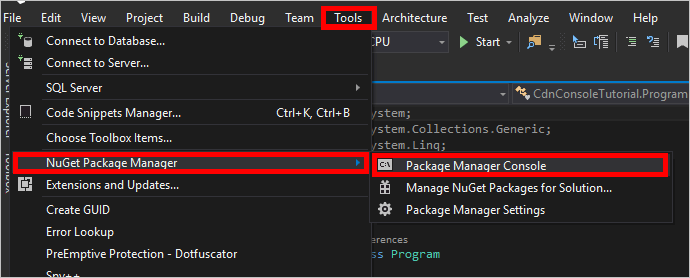

<properties
    pageTitle="Prise en main la bibliothèque CDN Azure pour .NET | Microsoft Azure"
    description="Apprenez à écrire des applications pour gérer Azure CDN à l’aide de Visual Studio .NET."
    services="cdn"
    documentationCenter=".net"
    authors="camsoper"
    manager="erikre"
    editor=""/>

<tags
    ms.service="cdn"
    ms.workload="tbd"
    ms.tgt_pltfrm="na"
    ms.devlang="na"
    ms.topic="article"
    ms.date="09/15/2016"
    ms.author="casoper"/>

# <a name="get-started-with-azure-cdn-development"></a>Prise en main développement Azure CDN

> [AZURE.SELECTOR]
- [Node.js](cdn-app-dev-node.md)
- [.NET](cdn-app-dev-net.md)

Vous pouvez utiliser la [Bibliothèque de CDN Azure pour .NET](https://msdn.microsoft.com/library/mt657769.aspx) pour automatiser la création et la gestion des profils CDN et des points de terminaison.  Ce didacticiel décrit la création d’une application console .NET simple qui montre plusieurs des opérations disponibles.  Ce didacticiel n’est pas destiné pour décrire tous les aspects de la bibliothèque CDN Azure pour .NET en détail.

Vous devez Visual Studio 2015 pour effectuer ce didacticiel.  [Visual Studio Communauté 2015](https://www.visualstudio.com/products/visual-studio-community-vs.aspx) est possible de télécharger gratuitement.

> [AZURE.TIP] Le [terminé un projet à partir de ce didacticiel](https://code.msdn.microsoft.com/Azure-CDN-Management-1f2fba2c) est disponible au téléchargement sur MSDN.

[AZURE.INCLUDE [cdn-app-dev-prep](../../includes/cdn-app-dev-prep.md)]

## <a name="create-your-project-and-add-nuget-packages"></a>Créer votre projet et ajouter des packages Nuget

Maintenant que nous avons créé un groupe de ressources pour les profils de notre CDN et autorisés notre application Azure AD à gérer les profils CDN et points de terminaison dans ce groupe, nous pouvons commencer à créer notre application.

À partir de Visual Studio 2015, cliquez sur **fichier**, **Nouveau**, **projet...** pour ouvrir la boîte de dialogue Nouveau projet.  Développez **Visual c#**, puis sélectionnez **Windows** dans le volet gauche.  Cliquez sur **Application Console** dans le volet central.  Nommez votre projet, puis cliquez sur **OK**.  


Notre projet va utiliser certaines bibliothèques Azure contenues dans des packages Nuget.  Nous allons ajouter ceux au projet.

1. Cliquez sur le menu **Outils** , **Gestionnaire de Package Nuget**, puis **Console du Gestionnaire de Package**.

    

2. Dans la Console du Gestionnaire de Package, exécutez la commande suivante pour installer **Bibliothèque terme (Active Directory authentification ADAL)**:

    `Install-Package Microsoft.IdentityModel.Clients.ActiveDirectory`

3. Exécutez la commande suivante pour installer la **Bibliothèque de gestion des CDN Azure**:

    `Install-Package Microsoft.Azure.Management.Cdn`

## <a name="directives-constants-main-method-and-helper-methods"></a>Directives, des constantes, méthode principale et méthodes d’assistance

Nous allons apprendre la structure de base de notre programme écrit.

1. Dans l’onglet Program.cs, remplacez le `using` directives dans la partie supérieure avec les éléments suivants :

    ```csharp
    using System;
    using System.Collections.Generic;
    using Microsoft.Azure.Management.Cdn;
    using Microsoft.Azure.Management.Cdn.Models;
    using Microsoft.Azure.Management.Resources;
    using Microsoft.Azure.Management.Resources.Models;
    using Microsoft.IdentityModel.Clients.ActiveDirectory;
    using Microsoft.Rest;
    ```

2. Nous devons définir certaines constantes que nos méthodes utiliseront.  Dans la `Program` classe, mais avant que le `Main` méthode, ajoutez le code suivant.  N’oubliez pas de remplacer les espaces réservés, y compris la ** &lt;chevrons&gt;**, avec vos propres valeurs selon vos besoins.

    ```csharp
    //Tenant app constants
    private const string clientID = "<YOUR CLIENT ID>";
    private const string clientSecret = "<YOUR CLIENT AUTHENTICATION KEY>"; //Only for service principals
    private const string authority = "https://login.microsoftonline.com/<YOUR TENANT ID>/<YOUR TENANT DOMAIN NAME>";

    //Application constants
    private const string subscriptionId = "<YOUR SUBSCRIPTION ID>";
    private const string profileName = "CdnConsoleApp";
    private const string endpointName = "<A UNIQUE NAME FOR YOUR CDN ENDPOINT>";
    private const string resourceGroupName = "CdnConsoleTutorial";
    private const string resourceLocation = "<YOUR PREFERRED AZURE LOCATION, SUCH AS Central US>";
    ```

3. Également au niveau de classe, définissez ces deux variables.  Nous allons utiliser ultérieurement ces afin de déterminer si notre profil et le point de terminaison existent déjà.

    ```csharp
    static bool profileAlreadyExists = false;
    static bool endpointAlreadyExists = false;
    ```

4.  Remplacer le `Main` méthode comme suit :

    ```csharp
    static void Main(string[] args)
    {
        //Get a token
        AuthenticationResult authResult = GetAccessToken();

        // Create CDN client
        CdnManagementClient cdn = new CdnManagementClient(new TokenCredentials(authResult.AccessToken))
            { SubscriptionId = subscriptionId };

        ListProfilesAndEndpoints(cdn);

        // Create CDN Profile
        CreateCdnProfile(cdn);

        // Create CDN Endpoint
        CreateCdnEndpoint(cdn);
        
        Console.WriteLine();

        // Purge CDN Endpoint
        PromptPurgeCdnEndpoint(cdn);

        // Delete CDN Endpoint
        PromptDeleteCdnEndpoint(cdn);

        // Delete CDN Profile
        PromptDeleteCdnProfile(cdn);

        Console.WriteLine("Press Enter to end program.");
        Console.ReadLine();
    }
    ```

5. Certaines des autres méthodes de notre passent demander à l’utilisateur des questions « Oui/non ».  Ajoutez la méthode suivante afin de vous un peu plus facilement :

    ```csharp
    private static bool PromptUser(string Question)
    {
        Console.Write(Question + " (Y/N): ");
        var response = Console.ReadKey();
        Console.WriteLine();
        if (response.Key == ConsoleKey.Y)
        {
            return true;
        }
        else if (response.Key == ConsoleKey.N)
        {
            return false;
        }
        else
        {
            // They pressed something other than Y or N.  Let's ask them again.
            return PromptUser(Question);
        }
    }
    ```

Maintenant que la structure de base de notre programme écrit, nous devons créer les méthodes appelées par le `Main` méthode.

## <a name="authentication"></a>Authentification

Avant de pouvoir utiliser la bibliothèque de gestion Azure CDN, nous avons besoin de s’authentifier notre principal du service et d’obtenir un jeton d’authentification.  Cette méthode utilise le terme ADAL pour récupérer le jeton.

```csharp
private static AuthenticationResult GetAccessToken()
{
    AuthenticationContext authContext = new AuthenticationContext(authority); 
    ClientCredential credential = new ClientCredential(clientID, clientSecret);
    AuthenticationResult authResult = 
        authContext.AcquireTokenAsync("https://management.core.windows.net/", credential).Result;

    return authResult;
}
```

Si vous utilisez l’authentification des utilisateurs individuels, la `GetAccessToken` méthode ressemble légèrement différente.

>[AZURE.IMPORTANT] Utilisez cet exemple de code uniquement si vous préférez que l’authentification des utilisateurs individuels au lieu d’un service principal.

```csharp
private static AuthenticationResult GetAccessToken()
{
    AuthenticationContext authContext = new AuthenticationContext(authority);
    AuthenticationResult authResult = authContext.AcquireTokenAsync("https://management.core.windows.net/",
        clientID, new Uri("http://<redirect URI>"), new PlatformParameters(PromptBehavior.RefreshSession)).Result;

    return authResult;
}
```

N’oubliez pas de remplacer `<redirect URI>` avec la redirection URI que vous avez entré lorsque vous avez enregistré l’application dans Azure AD.

## <a name="list-cdn-profiles-and-endpoints"></a>Liste CDN profils et points de terminaison

Nous sommes maintenant prêts à effectuer des opérations CDN.  La première chose que notre méthode est liste tous les profils et les points de terminaison dans notre groupe de ressources et s’il trouve une correspondance pour les noms de profil et de point de terminaison spécifié dans notre constantes, apporte une note de cet pour rappel ultérieur afin que nous n’essayez pas de créer des doublons.

```csharp
private static void ListProfilesAndEndpoints(CdnManagementClient cdn)
{
    // List all the CDN profiles in this resource group
    var profileList = cdn.Profiles.ListByResourceGroup(resourceGroupName);
    foreach (Profile p in profileList)
    {
        Console.WriteLine("CDN profile {0}", p.Name);
        if (p.Name.Equals(profileName, StringComparison.OrdinalIgnoreCase))
        {
            // Hey, that's the name of the CDN profile we want to create!
            profileAlreadyExists = true;
        }

        //List all the CDN endpoints on this CDN profile
        Console.WriteLine("Endpoints:");
        var endpointList = cdn.Endpoints.ListByProfile(p.Name, resourceGroupName);
        foreach (Endpoint e in endpointList)
        {
            Console.WriteLine("-{0} ({1})", e.Name, e.HostName);
            if (e.Name.Equals(endpointName, StringComparison.OrdinalIgnoreCase))
            {
                // The unique endpoint name already exists.
                endpointAlreadyExists = true;
            }
        }
        Console.WriteLine();
    }
}
```

## <a name="create-cdn-profiles-and-endpoints"></a>Créer des points de terminaison et des profils CDN

Ensuite, nous allons créer un profil.

```csharp
private static void CreateCdnProfile(CdnManagementClient cdn)
{
    if (profileAlreadyExists)
    {
        Console.WriteLine("Profile {0} already exists.", profileName);
    }
    else
    {
        Console.WriteLine("Creating profile {0}.", profileName);
        ProfileCreateParameters profileParms =
            new ProfileCreateParameters() { Location = resourceLocation, Sku = new Sku(SkuName.StandardVerizon) };
        cdn.Profiles.Create(profileName, profileParms, resourceGroupName);
    }
}
```

Une fois que le profil est créé, nous allons créer un point de terminaison.

```csharp
private static void CreateCdnEndpoint(CdnManagementClient cdn)
{
    if (endpointAlreadyExists)
    {
        Console.WriteLine("Profile {0} already exists.", profileName);
    }
    else
    {
        Console.WriteLine("Creating endpoint {0} on profile {1}.", endpointName, profileName);
        EndpointCreateParameters endpointParms =
            new EndpointCreateParameters()
            {
                Origins = new List<DeepCreatedOrigin>() { new DeepCreatedOrigin("Contoso", "www.contoso.com") },
                IsHttpAllowed = true,
                IsHttpsAllowed = true,
                Location = resourceLocation
            };
        cdn.Endpoints.Create(endpointName, endpointParms, profileName, resourceGroupName);
    }
}
```

>[AZURE.NOTE] L’exemple ci-dessus assigne le point de terminaison une origine nommée *Contoso* avec un nom d’hôte `www.contoso.com`.  Vous devez modifier pour pointer vers le nom d’hôte de votre propre origine.

## <a name="purge-an-endpoint"></a>Effacer un point de terminaison

En supposant que le point de terminaison a été créé, une tâche courante que nous pourrions effectuer dans notre programme purge le contenu de notre point de terminaison.

```csharp
private static void PromptPurgeCdnEndpoint(CdnManagementClient cdn)
{
    if (PromptUser(String.Format("Purge CDN endpoint {0}?", endpointName)))
    {
        Console.WriteLine("Purging endpoint. Please wait...");
        cdn.Endpoints.PurgeContent(endpointName, profileName, resourceGroupName, new List<string>() { "/*" });
        Console.WriteLine("Done.");
        Console.WriteLine();
    }
}
```

>[AZURE.NOTE] Dans l’exemple ci-dessus, la chaîne `/*` indique que je souhaite supprimer définitivement tous les éléments de la racine du chemin d’accès de point de terminaison.  Cela équivaut à vérifier **Effacer tout** dans la boîte de dialogue « purge » du portail Azure. Dans la `CreateCdnProfile` méthode, j’ai créé notre profil comme profil **Azure CDN de Verizon** en utilisant le code `Sku = new Sku(SkuName.StandardVerizon)`, c’est pourquoi il s’agit de réussie.  Toutefois, **Azure CDN à partir d’Akamai** profils ne pas prennent en charge **Purge toutes les**, afin que si j’ai utilise un profil Akamai pour ce didacticiel, j’ai nécessaires pour inclure des chemins spécifiques pour supprimer définitivement.

## <a name="delete-cdn-profiles-and-endpoints"></a>Supprimer des points de terminaison et des profils CDN

Les dernières méthodes va supprimer notre point de terminaison et le profil.

```csharp
private static void PromptDeleteCdnEndpoint(CdnManagementClient cdn)
{
    if(PromptUser(String.Format("Delete CDN endpoint {0} on profile {1}?", endpointName, profileName)))
    {
        Console.WriteLine("Deleting endpoint. Please wait...");
        cdn.Endpoints.DeleteIfExists(endpointName, profileName, resourceGroupName);
        Console.WriteLine("Done.");
        Console.WriteLine();
    }
}

private static void PromptDeleteCdnProfile(CdnManagementClient cdn)
{
    if(PromptUser(String.Format("Delete CDN profile {0}?", profileName)))
    {
        Console.WriteLine("Deleting profile. Please wait...");
        cdn.Profiles.DeleteIfExists(profileName, resourceGroupName);
        Console.WriteLine("Done.");
        Console.WriteLine();
    }
}
```

## <a name="running-the-program"></a>L’exécution du programme

Nous pouvons à présent compiler et exécuter le programme en cliquant sur le bouton **Démarrer** dans Visual Studio.


Lorsque le programme atteint l’invite ci-dessus, vous devriez pouvoir revenir à votre groupe de ressources dans le portail Azure et vérifier que le profil a été créé.


Nous pouvons puis confirmez les invites pour exécuter le reste du programme.


## <a name="next-steps"></a>Étapes suivantes

Pour afficher le projet à partir de cette procédure pas à pas, [Téléchargez l’exemple](https://code.msdn.microsoft.com/Azure-CDN-Management-1f2fba2c)terminé.

Pour rechercher une documentation supplémentaire sur la bibliothèque de gestion Azure CDN pour .NET, permet d’afficher les [informations de référence sur MSDN](https://msdn.microsoft.com/library/mt657769.aspx).

Gérer vos ressources CDN avec [PowerShell](./cdn-manage-powershell.md).


