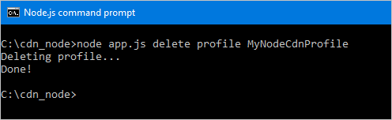

<properties
    pageTitle="Prise en main du Kit de développement Azure CDN pour Node.js | Microsoft Azure"
    description="Apprenez à écrire des applications Node.js pour gérer Azure CDN."
    services="cdn"
    documentationCenter="nodejs"
    authors="camsoper"
    manager="erikre"
    editor=""/>

<tags
    ms.service="cdn"
    ms.workload="tbd"
    ms.tgt_pltfrm="na"
    ms.devlang="na"
    ms.topic="article"
    ms.date="09/15/2016"
    ms.author="casoper"/>

# <a name="get-started-with-azure-cdn-development"></a>Prise en main développement Azure CDN

> [AZURE.SELECTOR]
- [Node.js](cdn-app-dev-node.md)
- [.NET](cdn-app-dev-net.md)

Vous pouvez utiliser le [Kit de développement logiciel pour Node.js CDN Azure](https://www.npmjs.com/package/azure-arm-cdn) pour automatiser la création et la gestion des profils CDN et des points de terminaison.  Ce didacticiel décrit la création d’une application de console Node.js simple qui montre plusieurs des opérations disponibles.  Ce didacticiel n’est pas destiné pour décrire tous les aspects du Kit de développement Azure CDN pour Node.js en détail.

Pour effectuer ce didacticiel, vous disposez déjà de [Node.js](http://www.nodejs.org) **versions4.x.x** ou une valeur supérieure installé et configuré.  Vous pouvez utiliser un éditeur de texte que vous voulez créer votre application Node.js.  Pour écrire ce didacticiel, que j’ai utilisé le [Code de Visual Studio](https://code.visualstudio.com).  

> [AZURE.TIP] Le [terminé un projet à partir de ce didacticiel](https://code.msdn.microsoft.com/Azure-CDN-SDK-for-Nodejs-c712bc74) est disponible au téléchargement sur MSDN.

[AZURE.INCLUDE [cdn-app-dev-prep](../../includes/cdn-app-dev-prep.md)]

## <a name="create-your-project-and-add-npm-dependencies"></a>Créer votre projet et ajouter des dépendances NPM

Maintenant que nous avons créé un groupe de ressources pour les profils de notre CDN et autorisés notre application Azure AD à gérer les profils CDN et points de terminaison dans ce groupe, nous pouvons commencer à créer notre application.

Créer un dossier pour stocker votre application.  À partir de la console avec les outils Node.js dans votre chemin d’accès actuel, définir votre emplacement actuel dans ce nouveau dossier et initialisation votre projet en exécutant :
    
    npm init
    
Vous obtiendrez une série de questions initialisation votre projet.  Pour le **point d’entrée**, ce didacticiel utilise *app.js*.  Vous pouvez afficher mes autres choix dans l’exemple suivant.


Notre projet est maintenant initialisé avec un fichier *packages.json* .  Notre projet va utiliser certaines bibliothèques Azure contenues dans des packages NPM.  Nous allons utiliser l’exécution du Client Azure pour Node.js (ms-reste-azure) et la bibliothèque de Client Azure CDN pour Node.js (cd-processeur-azure).  Nous allons rajoutez-les au projet en tant que dépendances.
 
    npm install --save ms-rest-azure
    npm install --save azure-arm-cdn

Une fois les packages sont effectuées l’installation effectuée, la *package.json* fichier doit ressembler à cet exemple (version nombres peuvent varier) :

``` json
{
  "name": "cdn_node",
  "version": "1.0.0",
  "description": "Azure CDN Node.js tutorial project",
  "main": "app.js",
  "scripts": {
    "test": "echo \"Error: no test specified\" && exit 1"
  },
  "author": "Cam Soper",
  "license": "MIT",
  "dependencies": {
    "azure-arm-cdn": "^0.2.1",
    "ms-rest-azure": "^1.14.4"
  }
}
```

Enfin, à l’aide de votre éditeur de texte, créez un fichier texte vide et enregistrez-le dans la racine de notre dossier du projet en tant que *app.js*.  Nous sommes maintenant prêts à commencer à écrire du code.

## <a name="requires-constants-authentication-and-structure"></a>Requiert, constantes, l’authentification et la structure

Avec *app.js* ouvert dans notre éditeur, nous allons apprendre la structure de base de notre programme écrit.

1. Ajouter la « nécessite » pour notre packages NPM dans la partie supérieure avec les éléments suivants :

    ``` javascript
    var msRestAzure = require('ms-rest-azure');
    var cdnManagementClient = require('azure-arm-cdn');
    ```

2. Nous devons définir certaines constantes que nos méthodes utiliseront.  Ajoutez les informations suivantes.  N’oubliez pas de remplacer les espaces réservés, y compris la ** &lt;chevrons&gt;**, avec vos propres valeurs selon vos besoins.

    ``` javascript
    //Tenant app constants
    const clientId = "<YOUR CLIENT ID>";
    const clientSecret = "<YOUR CLIENT AUTHENTICATION KEY>"; //Only for service principals
    const tenantId = "<YOUR TENANT ID>";

    //Application constants
    const subscriptionId = "<YOUR SUBSCRIPTION ID>";
    const resourceGroupName = "CdnConsoleTutorial";
    const resourceLocation = "<YOUR PREFERRED AZURE LOCATION, SUCH AS Central US>";
    ```

3. Ensuite, nous instanciation le client management CDN et lui attribuer ses informations d’identification.

    ``` javascript
    var credentials = new msRestAzure.ApplicationTokenCredentials(clientId, tenantId, clientSecret);
    var cdnClient = new cdnManagementClient(credentials, subscriptionId);
    ```
    
    Si vous utilisez l’authentification des utilisateurs individuels, ces deux lignes seront présentera légèrement différentes.

    >[AZURE.IMPORTANT] Utilisez cet exemple de code uniquement si vous préférez que l’authentification des utilisateurs individuels au lieu d’un service principal.  Veillez à protéger vos informations d’identification utilisateur individuel et les garder secret.

    ``` javascript
    var credentials = new msRestAzure.UserTokenCredentials(clientId, 
        tenantId, '<username>', '<password>', '<redirect URI>');
    var cdnClient = new cdnManagementClient(credentials, subscriptionId);
    ```

    N’oubliez pas de remplacer les éléments de ** &lt;chevrons&gt; ** avec les informations appropriées.  Pour `<redirect URI>`, utilisez la redirection URI que vous avez entré lorsque vous avez enregistré l’application dans Azure AD.
    

4.  Notre application console Node.js va prendre certains paramètres de ligne de commande.  Nous allons valider qu’au moins un paramètre a été passé.

    ```javascript
    //Collect command-line parameters
    var parms = process.argv.slice(2);

    //Do we have parameters?
    if(parms == null || parms.length == 0)
    {
        console.log("Not enough parameters!");
        console.log("Valid commands are list, delete, create, and purge.");
        process.exit(1);
    }
    ```

5. Ce qui nous amène à la partie principale de notre programme, dans lequel nous créer des branches à d’autres fonctions selon les paramètres passés.

    ```javascript
    switch(parms[0].toLowerCase())
    {
        case "list":
            cdnList();
            break;

        case "create":
            cdnCreate();
            break;
        
        case "delete":
            cdnDelete();
            break;

        case "purge":
            cdnPurge();
            break;

        default:
            console.log("Valid commands are list, delete, create, and purge.");
            process.exit(1);
    }
    ```

6.  En plusieurs endroits dans notre programme, nous avons besoin pour vous assurer que le nombre exact de paramètres ont été passé et affiche d’aide pour si elles ne semblent correctes.  Nous allons créer des fonctions pour ce faire.

    ```javascript
    function requireParms(parmCount) {
        if(parms.length < parmCount) {
            usageHelp(parms[0].toLowerCase());
            process.exit(1);
        }
    }

    function usageHelp(cmd) {
        console.log("Usage for " + cmd + ":");
        switch(cmd)
        {
            case "list":
                console.log("list profiles");
                console.log("list endpoints <profile name>");
                break;

            case "create":
                console.log("create profile <profile name>");
                console.log("create endpoint <profile name> <endpoint name> <origin hostname>");
                break;
            
            case "delete":
                console.log("delete profile <profile name>");
                console.log("delete endpoint <profile name> <endpoint name>");
                break;

            case "purge":
                console.log("purge <profile name> <endpoint name> <path>");
                break;

            default:
                console.log("Invalid command.");
        }
    }
    ```

7. Enfin, les fonctions que nous utiliserons sur le client de gestion des CDN étant asynchrones, dont elles ont besoin d’une méthode à appeler lorsqu’ils ont terminé.  Nous allons créer une qui peut afficher la sortie à partir du client de gestion des CDN (le cas échéant) et quitter le programme normalement.

    ```javascript
    function callback(err, result, request, response) {
        if (err) {
            console.log(err);
            process.exit(1);
        } else {
            console.log((result == null) ? "Done!" : result);
            process.exit(0);
        }
    }
    ```

Maintenant que la structure de base de notre programme écrit, nous devons créer les fonctions appelées reposant sur notre paramètres.

## <a name="list-cdn-profiles-and-endpoints"></a>Liste CDN profils et points de terminaison

Commençons par code à notre profils existants et les points de terminaison de la liste.  Mes commentaires code fournissent la syntaxe attendue pour savoir où va chaque paramètre.

```javascript
// list profiles
// list endpoints <profile name>
function cdnList(){
    requireParms(2);
    switch(parms[1].toLowerCase())
    {
        case "profiles":
            console.log("Listing profiles...");
            cdnClient.profiles.listByResourceGroup(resourceGroupName, callback);
            break;

        case "endpoints":
            requireParms(3);
            console.log("Listing endpoints...");
            cdnClient.endpoints.listByProfile(parms[2], resourceGroupName, callback);
            break;

        default:
            console.log("Invalid parameter.");
            process.exit(1);
    }
}
```

## <a name="create-cdn-profiles-and-endpoints"></a>Créer des points de terminaison et des profils CDN

Ensuite, nous allons écrire les fonctions pour créer des profils et points de terminaison.

```javascript
function cdnCreate() {
    requireParms(2);
    switch(parms[1].toLowerCase())
    {
        case "profile":
            cdnCreateProfile();
            break;

        case "endpoint":
            cdnCreateEndpoint();
            break;

        default:
            console.log("Invalid parameter.");
            process.exit(1);
    }
}

// create profile <profile name>
function cdnCreateProfile() {
    requireParms(3);
    console.log("Creating profile...");
    var standardCreateParameters = {
        location: resourceLocation,
        sku: {
            name: 'Standard_Verizon'
        }
    };

    cdnClient.profiles.create(parms[2], standardCreateParameters, resourceGroupName, callback);
}

// create endpoint <profile name> <endpoint name> <origin hostname>        
function cdnCreateEndpoint() {
    requireParms(5);
    console.log("Creating endpoint...");
    var endpointProperties = {
        location: resourceLocation,
        origins: [{
            name: parms[4],
            hostName: parms[4]
        }]
    };

    cdnClient.endpoints.create(parms[3], endpointProperties, parms[2], resourceGroupName, callback);
}
```

## <a name="purge-an-endpoint"></a>Effacer un point de terminaison

En supposant que le point de terminaison a été créé, une tâche courante que nous pourrions effectuer dans notre programme est purge du contenu dans notre point de terminaison.

```javascript
// purge <profile name> <endpoint name> <path>
function cdnPurge() {
    requireParms(4);
    console.log("Purging endpoint...");
    var purgeContentPaths = [ parms[3] ];
    cdnClient.endpoints.purgeContent(parms[2], parms[1], resourceGroupName, purgeContentPaths, callback);
}
```

## <a name="delete-cdn-profiles-and-endpoints"></a>Supprimer des points de terminaison et des profils CDN

La dernière fonction que nous inclura supprime les points de terminaison et les profils.

```javascript
function cdnDelete() {
    requireParms(2);
    switch(parms[1].toLowerCase())
    {
        // delete profile <profile name>
        case "profile":
            requireParms(3);
            console.log("Deleting profile...");
            cdnClient.profiles.deleteIfExists(parms[2], resourceGroupName, callback);
            break;

        // delete endpoint <profile name> <endpoint name>
        case "endpoint":
            requireParms(4);
            console.log("Deleting endpoint...");
            cdnClient.endpoints.deleteIfExists(parms[3], parms[2], resourceGroupName, callback);
            break;

        default:
            console.log("Invalid parameter.");
            process.exit(1);
    }
}
```

## <a name="running-the-program"></a>L’exécution du programme

Nous pouvons maintenant exécuter notre programme Node.js à l’aide de notre débogueur favori ou à la console.

> [AZURE.TIP] Si vous utilisez le Code de Visual Studio comme débogueur, vous devez configurer votre environnement pour passer les paramètres de ligne de commande.  Code de Visual Studio pour cela, dans le fichier **lanuch.json** .  Recherchez une propriété nommée **arguments** et ajouter un tableau de valeurs de chaîne pour vos paramètres, afin qu’il ressemble à ceci : `"args": ["list", "profiles"]`.

Commençons par répertorier notre profils.


Nous avons obtenu un tableau vide.  Étant donné que nous ne disposez pas de profil dans notre groupe de ressources, il est prévu.  Nous allons maintenant créer un profil.


À présent, nous allons ajouter un point de terminaison.


Pour finir, nous allons supprimer notre profil.



## <a name="next-steps"></a>Étapes suivantes

Pour afficher le projet à partir de cette procédure pas à pas, [Téléchargez l’exemple](https://code.msdn.microsoft.com/Azure-CDN-SDK-for-Nodejs-c712bc74)terminé.

Pour voir la référence pour le Kit de développement Azure CDN pour Node.js, permet d’afficher la [référence](http://azure.github.io/azure-sdk-for-node/azure-arm-cdn/latest/).

Pour trouver des informations supplémentaires le Kit de développement Azure pour Node.js, permet d’afficher la [référence complète](http://azure.github.io/azure-sdk-for-node/).

Gérer vos ressources CDN avec [PowerShell](./cdn-manage-powershell.md).

