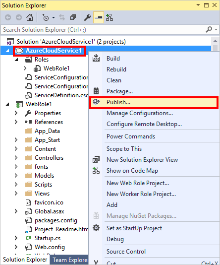

<properties
    pageTitle="Intégrer un service cloud Azure CDN | Microsoft Azure"
    description="Un didacticiel qui vous apprend à déployer un service cloud qui sert le contenu à partir d’un point de terminaison Azure CDN intégrée"
    services="cdn, cloud-services"
    documentationCenter=".net"
    authors="camsoper"
    manager="erikre"
    editor="tysonn"/>

<tags
    ms.service="cdn"
    ms.workload="tbd"
    ms.tgt_pltfrm="na"
    ms.devlang="dotnet"
    ms.topic="article"
    ms.date="07/28/2016"
    ms.author="casoper"/>

# Intégrer un service cloud Azure CDN

Un service cloud peut être intégré aux Azure CDN, servant du contenu à partir de l’emplacement du service cloud. Cette approche vous offre les avantages suivants :

- Facilement déployer et mettre à jour des images, des scripts et des feuilles de style dans des répertoires de projet de votre service cloud
- Aisément mettre à jour les packages NuGet dans votre service cloud, tel que jQuery ou versions démarrage
- Gérer votre application Web et votre tout contenu CDN servi à partir de la même interface de Visual Studio
- Flux de travail de déploiement unifiée pour votre application Web et votre contenu CDN-pris en charge
- Intégrer ASP.NET regroupement et minimisation Azure CDN

## Enseignements de cet article ##

Dans ce didacticiel, vous allez apprendre comment :

-   [Intégrer un point de terminaison Azure CDN à votre service cloud et du contenu statique dans vos pages Web à partir d’Azure CDN](#deploy)
-   [Configurer les paramètres de cache pour le contenu statique dans votre service de nuage](#caching)
-   [Fournir du contenu à partir d’actions contrôleur via Azure CDN](#controller)
-   [Serve groupées et réduite contenu via Azure CDN tout en conservant le script débogage expérience dans Visual Studio](#bundling)
-   [Configurer secours vos scripts et CSS lorsque votre Azure CDN est hors connexion](#fallback)

## Vous allez créer ##

Vous déployez un rôle Web de service cloud à l’aide de la valeur par défaut modèle ASP.NET MVC, ajouter du code pour fournir du contenu à partir d’un CDN Azure intégrés, tels que les fichiers JavaScript et CSS par défaut, une image et résultats de l’action contrôleur et également écrire du code pour configurer le mécanisme de secours pour les offres pris en charge dans le cas où le CDN est en mode hors connexion.

## Composants nécessaires ##

Ce didacticiel comporte les conditions préalables suivantes :

-   Un [compte Microsoft Azure](/account/) active
-   Visual Studio 2015 avec [SDK Azure](http://go.microsoft.com/fwlink/?linkid=518003&clcid=0x409)

> [AZURE.NOTE] Vous avez besoin d’un compte Azure pour effectuer ce didacticiel :
> + Vous pouvez [Ouvrir un compte Azure gratuitement](/pricing/free-trial/) - vous obtenez crédits vous pouvez utiliser pour essayer de services Azure payants et même après leur utilisation jusqu'à vous pouvez conserver le compte et libérer de l’utilisation des services Azure, tels que des sites Web.
> + Vous pouvez [Activer les avantages d’abonné MSDN](/pricing/member-offers/msdn-benefits-details/) - MSDN votre abonnement fournit les crédits chaque mois que vous pouvez utiliser pour les services Azure payants.

## Déployer un service cloud ##

Dans cette section, vous déployez le modèle d’application ASP.NET MVC dans Visual Studio 2015 par défaut à un rôle cloud service Web et puis intégrer un point de terminaison CDN. Suivez les instructions ci-dessous :

1. Dans Visual Studio 2015, créer un nouveau service cloud Azure à partir de la barre de menus en accédant à **fichier > Nouveau > projet > Cloud > Azure Cloud Service**. Attribuez un nom et cliquez sur **OK**.

    

2. Sélectionnez le **Rôle Web ASP.NET** , cliquez sur le **>** bouton. Cliquez sur OK.

    

3. Sélectionnez **MVC** et cliquez sur **OK**.

    

4. À présent, publier ce rôle Web à un service cloud Azure. Cliquez sur le projet de service cloud et sélectionnez **Publier**.

    

5. Si vous n’avez pas encore connecté à Microsoft Azure, cliquez sur la liste déroulante **Ajouter un compte...** , puis cliquez sur l’élément de menu **Ajouter un compte** .

    

6. Dans la page de connexion, connectez-vous à l’aide du compte Microsoft que vous avez utilisé pour activer votre compte Azure.
7. Une fois que vous êtes connecté, cliquez sur **suivant**.

    

8. En supposant que vous n’avez pas créé un compte de service ou de stockage cloud, Visual Studio va vous aider à créer les deux. Dans la boîte de dialogue **créer un Service Cloud et compte** , tapez le nom de service de votre choix et sélectionnez la région souhaitée. Ensuite, cliquez sur **créer**.

    

9. Dans la page Paramètres de publication, vérifiez la configuration et cliquez sur **Publier**.

    

    >[AZURE.NOTE] Le processus de publication pour les services en nuage prend beaucoup de temps. L’activer déploiement Web pour tous les option rôles peut rendre le débogage votre service cloud beaucoup plus rapide en fournissant des mises à jour rapides (mais temporaire) à vos rôles Web. Pour plus d’informations sur cette option, voir [publication d’un Service de nuage en utilisant les outils Azure](http://msdn.microsoft.com/library/ff683672.aspx).

    Lorsque le **Journal d’activité Microsoft Azure** indique que l’état de publication est **terminé**, vous allez créer un point de terminaison CDN est intégré à ce service cloud.

    >[AZURE.WARNING] Si, après la publication, le service en nuage déployé affiche un écran d’erreur, il est probable que le service en nuage que vous avez déployé utilise un [système d’exploitation qui n’inclut pas .NET 4.5.2 invité](../cloud-services/cloud-services-guestos-update-matrix.md#news-updates).  Vous pouvez contourner ce problème en [déployant .NET 4.5.2 comme une tâche de démarrage](../cloud-services/cloud-services-dotnet-install-dotnet.md).

## Créer un nouveau profil CDN

Un profil CDN est un ensemble de points de terminaison CDN.  Chaque profil contient un ou plusieurs points de terminaison CDN.  Vous souhaiterez peut-être utiliser plusieurs profils pour organiser vos points de terminaison CDN par domaine internet, application web ou d’autres critères.

> [AZURE.TIP] Si vous disposez déjà d’un profil CDN que vous souhaitez utiliser pour ce didacticiel, passez à [créer un point de terminaison CDN](#create-a-new-cdn-endpoint).

[AZURE.INCLUDE [cdn-create-profile](../../includes/cdn-create-profile.md)]

## Créer un point de terminaison CDN

**Pour créer un nouveau point de terminaison CDN pour votre compte de stockage**

1. Dans le [Portail de gestion Azure](https://portal.azure.com), accédez à votre profil CDN.  Vous pouvez ont épinglée il au tableau de bord à l’étape précédente.  Si vous pas, vous pouvez trouver en cliquant sur **Parcourir**, puis sur **profils CDN**, en cliquant sur le profil que vous envisagez d’ajouter votre point de terminaison.

    La carte de profil CDN s’affiche.

    ![Profil CDN][cdn-profile-settings]

2. Cliquez sur le bouton **Ajouter un point de terminaison** .

    ![Ajouter le bouton de point de terminaison][cdn-new-endpoint-button]

    La carte **d’Ajouter un point de terminaison** s’affiche.

    ![Ajouter la carte de point de terminaison][cdn-add-endpoint]

3. Entrez un **nom** pour ce point de terminaison CDN.  Ce nom servira à accéder à vos ressources mis en cache au niveau du domaine `<EndpointName>.azureedge.net`.

4. Dans la liste déroulante **type d’origine** , sélectionnez *service Cloud*.  

5. Dans la liste déroulante **nom d’hôte d’origine** , sélectionnez votre service cloud.

6. Conservez les paramètres par défaut pour **chemin d’accès d’origine**, **en-tête hôte d’origine**et le **port de protocole/Origin**.  Vous devez spécifier au moins un protocole (HTTP ou HTTPS).

7. Cliquez sur le bouton **Ajouter** pour créer le nouveau point de terminaison.

8. Une fois que le point de terminaison est créé, il apparaît dans la liste des points de terminaison pour le profil. L’affichage de liste affiche l’URL à utiliser pour accéder aux contenu mis en cache, ainsi que le domaine d’origine.

    ![Point de terminaison CDN][cdn-endpoint-success]

    > [AZURE.NOTE] Le point de terminaison immédiatement sera pas disponible pour une utilisation.  Il peut prendre jusqu'à 90 minutes pour l’enregistrement de se propager via le réseau CDN. Les utilisateurs essaient d’utiliser le nom de domaine CDN immédiatement peuvent recevoir code d’état 404 jusqu'à ce que le contenu est disponible via le CDN.

## Tester le point de terminaison CDN

Lorsque l’état de publication est **terminé**, ouvrez une fenêtre de navigateur et accédez à * *http://<cdnName>*.azureedge.net/Content/bootstrap.css**. Mon installation, cette URL est la suivante :

    http://camservice.azureedge.net/Content/bootstrap.css

Ce qui correspond à l’URL d’origine suivante au point de terminaison CDN :

    http://camcdnservice.cloudapp.net/Content/bootstrap.css

Lorsque vous naviguez vers * *http://*&lt;cdnName >*.azureedge.net/Content/bootstrap.css**, en fonction de votre navigateur, vous serez invité à télécharger ou à ouvrir le bootstrap.css fourni à partir de votre application Web publiée.

Vous pouvez accéder à n’importe quelle URL accessible au public auprès de la même façon * *http://*&lt;ServiceName% >*.cloudapp.net/**, directement à partir de votre point de terminaison CDN. Par exemple :

-   Un fichier .js du chemin d’accès /Script
-   Tout fichier de contenu à partir de la /Content chemin d’accès
-   N’importe quel contrôleur/action
-   Si la chaîne de requête est activée au votre point de terminaison CDN, n’importe quelle URL avec des chaînes de requête

En fait, avec la configuration ci-dessus, vous pouvez héberger le service cloud entière à partir * *http://*&lt;cdnName >*.azureedge.net/**. Si j’ai atteindre **http://camservice.azureedge.net/ **, obtenir le résultat de l’action à partir d’accueil/Index.

Cela ne signifie pas, cependant, il est toujours judicieux de sélectionner (ou généralement recommandé) pour répondre à un service cloud entière via Azure CDN. Les avertissements sont notamment :

-   Cette approche nécessite l’ensemble de votre site d’être publique, car Azure CDN ne peut pas servir aucun contenu privé pour le moment.
-   Si le point de terminaison CDN est déconnecté pour une raison quelconque, si maintenance planifiée ou erreur de l’utilisateur, votre service cloud entière est hors connexion, à moins que les clients peuvent être redirigés vers l’URL d’origine * *http://*&lt;ServiceName% >*.cloudapp.net/**.
-   Même avec les paramètres de contrôle du Cache personnalisés (voir [configurer les options pour les fichiers statiques dans votre service cloud mise en cache](#caching)), un point de terminaison CDN n’améliore pas les performances du contenu dynamique hautement. Si vous avez essayé de charger la page d’accueil à partir de votre point de terminaison CDN comme indiqué ci-dessus, notez que l’opération était d’au moins 5 secondes pour charger la page d’accueil par défaut la première fois, ce qui correspond à une page simple. Imaginons que se passe-t-il à l’expérience client si cette page contient du contenu dynamique que vous devez mettre à jour toutes les minutes. Héberger un contenu dynamique à partir d’un point de terminaison CDN nécessite l’expiration de cache courte, qui se traduit par échecs dans le cache fréquents au point de terminaison CDN. Cette problème les performances de votre service cloud et nuit à l’utilité d’un CDN.

La solution consiste à déterminer le contenu à faire à partir d’Azure CDN sur un cas dans votre service cloud. À cet effet, vous avez déjà appris à accéder à des fichiers de contenu à partir du point de terminaison CDN. J’ai vous montrent comment prendre en charge une action contrôleur spécifique via le point de terminaison CDN de [fournir du contenu à partir d’actions contrôleur via Azure CDN](#controller).

## Configurer les options de mise en cache pour les fichiers statiques dans votre service de nuage ##

Avec l’intégration des Azure CDN dans votre service cloud, vous pouvez spécifier comment vous voulez contenu statique à mettre en cache dans le point de terminaison CDN. Pour ce faire, ouvrez le *fichier Web.config* à partir de votre projet de rôle Web (par exemple, WebRole1) et ajouter une `<staticContent>` élément à `<system.webServer>`. Le code XML ci-dessous configure le cache pour expirer dans les 3 jours.  

    <system.webServer>
      <staticContent>
        <clientCache cacheControlMode="UseMaxAge" cacheControlMaxAge="3.00:00:00"/>
      </staticContent>
      ...
    </system.webServer>

Une fois que vous procédez ainsi, tous les fichiers statiques dans votre service de nuage observerez la même règle dans le cache de résolution CDN. Contrôle plus précis des paramètres du cache, ajouter un fichier *Web.config* dans un dossier et ajoutez vos paramètres. Par exemple, ajouter un fichier *Web.config* au dossier *\Content* et remplacez le contenu par le code XML suivant :

    <?xml version="1.0"?>
    <configuration>
      <system.webServer>
        <staticContent>
          <clientCache cacheControlMode="UseMaxAge" cacheControlMaxAge="15.00:00:00"/>
        </staticContent>
      </system.webServer>
    </configuration>

Ce paramètre, tous les fichiers statiques à partir du dossier *\Content* à mettre en cache pour 15 jours.

Pour plus d’informations sur la configuration du `<clientCache>` élément, voir [Cache Client &lt;clientCache >](http://www.iis.net/configreference/system.webserver/staticcontent/clientcache).

De [fournir du contenu à partir d’actions contrôleur via Azure CDN](#controller), j’ai également montre comment vous pouvez configurer les paramètres de cache de résultats contrôleur d’action dans le cache CDN.

## Fournir du contenu à partir d’actions contrôleur via Azure CDN ##

Lorsque vous intégrez un rôle cloud service Web avec Azure CDN, il est relativement facile de fournir du contenu à partir d’actions du contrôleur par le biais du CDN Azure. Différent de faisant office de votre service cloud directement par le biais d’Azure CDN (illustrée ci-dessus), [Martin Balliauw](https://twitter.com/maartenballiauw) vous montre comment y parvenir avec une amusante contrôleur de MemeGenerator [latence réducteur sur le web avec le CDN Azure](http://channel9.msdn.com/events/TechDays/Techdays-2014-the-Netherlands/Reducing-latency-on-the-web-with-the-Windows-Azure-CDN). J’ai sera simplement le reproduire ici.

Supposons dans votre service cloud que vous souhaitez générer memes basé sur une image Chuck Norris jeune (photo par [Lumière Maurice](http://www.flickr.com/photos/alan-light/218493788/)) comme suit :

Vous avez un simple `Index` action qui autorise les clients à spécifier les superlatifs dans l’image, puis génère la meme une fois qu’ils publient à l’action. Dans la mesure où il est Chuck Norris, vous vous attendez cette page pour devenir globalement grandement populaires. Il s’agit d’un bon exemple d’héberger un contenu dynamique semi-structurées avec Azure CDN.

Suivez les étapes ci-dessus pour cette action contrôleur de configuration :

1. Dans le dossier *\Controllers* , créez un nouveau fichier .cs appelé *MemeGeneratorController.cs* et remplacez le contenu par le code suivant. N’oubliez pas de remplacer la partie en surbrillance par le nom de votre fournisseur.  

        using System;
        using System.Collections.Generic;
        using System.Diagnostics;
        using System.Drawing;
        using System.IO;
        using System.Net;
        using System.Web.Hosting;
        using System.Web.Mvc;
        using System.Web.UI;

        namespace WebRole1.Controllers
        {
            public class MemeGeneratorController : Controller
            {
                static readonly Dictionary<string, Tuple<string ,string>> Memes = new Dictionary<string, Tuple<string, string>>();

                public ActionResult Index()
                {
                    return View();
                }

                [HttpPost, ActionName("Index")]
                public ActionResult Index_Post(string top, string bottom)
                {
                    var identifier = Guid.NewGuid().ToString();
                    if (!Memes.ContainsKey(identifier))
                    {
                        Memes.Add(identifier, new Tuple<string, string>(top, bottom));
                    }

                    return Content("<a href=\"" + Url.Action("Show", new {id = identifier}) + "\">here's your meme</a>");
                }

                [OutputCache(VaryByParam = "*", Duration = 1, Location = OutputCacheLocation.Downstream)]
                public ActionResult Show(string id)
                {
                    Tuple<string, string> data = null;
                    if (!Memes.TryGetValue(id, out data))
                    {
                        return new HttpStatusCodeResult(HttpStatusCode.NotFound);
                    }

                    if (Debugger.IsAttached) // Preserve the debug experience
                    {
                        return Redirect(string.Format("/MemeGenerator/Generate?top={0}&bottom={1}", data.Item1, data.Item2));
                    }
                    else // Get content from Azure CDN
                    {
                        return Redirect(string.Format("http://<yourCdnName>.azureedge.net/MemeGenerator/Generate?top={0}&bottom={1}", data.Item1, data.Item2));
                    }
                }

                [OutputCache(VaryByParam = "*", Duration = 3600, Location = OutputCacheLocation.Downstream)]
                public ActionResult Generate(string top, string bottom)
                {
                    string imageFilePath = HostingEnvironment.MapPath("~/Content/chuck.bmp");
                    Bitmap bitmap = (Bitmap)Image.FromFile(imageFilePath);

                    using (Graphics graphics = Graphics.FromImage(bitmap))
                    {
                        SizeF size = new SizeF();
                        using (Font arialFont = FindBestFitFont(bitmap, graphics, top.ToUpperInvariant(), new Font("Arial Narrow", 100), out size))
                        {
                            graphics.DrawString(top.ToUpperInvariant(), arialFont, Brushes.White, new PointF(((bitmap.Width - size.Width) / 2), 10f));
                        }
                        using (Font arialFont = FindBestFitFont(bitmap, graphics, bottom.ToUpperInvariant(), new Font("Arial Narrow", 100), out size))
                        {
                            graphics.DrawString(bottom.ToUpperInvariant(), arialFont, Brushes.White, new PointF(((bitmap.Width - size.Width) / 2), bitmap.Height - 10f - arialFont.Height));
                        }
                    }

                    MemoryStream ms = new MemoryStream();
                    bitmap.Save(ms, System.Drawing.Imaging.ImageFormat.Png);
                    return File(ms.ToArray(), "image/png");
                }

                private Font FindBestFitFont(Image i, Graphics g, String text, Font font, out SizeF size)
                {
                    // Compute actual size, shrink if needed
                    while (true)
                    {
                        size = g.MeasureString(text, font);

                        // It fits, back out
                        if (size.Height < i.Height &&
                             size.Width < i.Width) { return font; }

                        // Try a smaller font (90% of old size)
                        Font oldFont = font;
                        font = new Font(font.Name, (float)(font.Size * .9), font.Style);
                        oldFont.Dispose();
                    }
                }
            }
        }

2. Avec le bouton droit dans la valeur par défaut `Index()` action et sélectionnez **Ajouter une vue**.

    

3.  Acceptez les paramètres ci-dessous, puis cliquez sur **Ajouter**.

    

4. Ouvrez la nouvelle *Views\MemeGenerator\Index.cshtml* et remplacez le contenu par le HTML simple suivant pour l’envoi des superlatifs :

        <h2>Meme Generator</h2>

        <form action="" method="post">
            <input type="text" name="top" placeholder="Enter top text here" />
             
            <input type="text" name="bottom" placeholder="Enter bottom text here" />
             
            <input class="btn" type="submit" value="Generate meme" />
        </form>

5. Publier à nouveau le service cloud et accédez à * *http://*&lt;ServiceName% >*.cloudapp.net/MemeGenerator/Index** dans votre navigateur.

Lorsque vous envoyez les valeurs de formulaire à `/MemeGenerator/Index`, la `Index_Post` méthode d’action renvoie un lien vers la `Show` méthode d’action avec l’identificateur d’entrée correspondante. Lorsque vous cliquez sur le lien, vous atteignez le code suivant :  

    [OutputCache(VaryByParam = "*", Duration = 1, Location = OutputCacheLocation.Downstream)]
    public ActionResult Show(string id)
    {
        Tuple<string, string> data = null;
        if (!Memes.TryGetValue(id, out data))
        {
            return new HttpStatusCodeResult(HttpStatusCode.NotFound);
        }

        if (Debugger.IsAttached) // Preserve the debug experience
        {
            return Redirect(string.Format("/MemeGenerator/Generate?top={0}&bottom={1}", data.Item1, data.Item2));
        }
        else // Get content from Azure CDN
        {
            return Redirect(string.Format("http://<yourCDNName>.azureedge.net/MemeGenerator/Generate?top={0}&bottom={1}", data.Item1, data.Item2));
        }
    }

Si votre débogueur local est connecté, vous obtiendrez l’expérience de débogage standard avec une redirection locale. Si elle s’exécute dans le service cloud, il vous redirige vers :

    http://<yourCDNName>.azureedge.net/MemeGenerator/Generate?top=<formInput>&bottom=<formInput>

Ce qui correspond à l’URL d’origine suivants à votre point de terminaison CDN :

    http://<youCloudServiceName>.cloudapp.net/MemeGenerator/Generate?top=<formInput>&bottom=<formInput>

Vous pouvez ensuite utiliser la `OutputCacheAttribute` attribut sur la `Generate` méthode pour spécifier comment le résultat de l’action doit être mis en cache, qui respecte la Azure CDN. Le code ci-dessous spécifier une durée d’expiration de cache d’une heure (3 600 secondes).

    [OutputCache(VaryByParam = "*", Duration = 3600, Location = OutputCacheLocation.Downstream)]

De même, vous pouvez servir de du contenu provenant de n’importe quelle action contrôleur dans votre service de nuage via votre Azure CDN, avec l’option de mise en cache souhaitée.

Dans la section suivante, je vous montrent comment prendre en charge les scripts groupées et réduites et CSS via Azure CDN.

## Intégrer ASP.NET regroupement et minimisation Azure CDN ##

Feuilles de style CSS et les scripts Modifier rarement et sont les premiers candidats pour le cache Azure CDN. Utilisation ; la totalité du rôle Web via votre Azure CDN est la plus simple pour intégrer regroupement et minimisation Azure CDN. Toutefois, que vous souhaitiez pas pour ce faire, je vous montrent comment y parvenir alors qu’en conservant l’expérience de programme souhaité de ASP.NET regroupement et minimisation, telles que :

-   Expérience de mode débogage rédaction
-   Rationaliser le déploiement
-   Mises à jour immédiates aux clients des mises à niveau de version de script/CSS
-   Mécanisme de secours en cas d’échec de votre point de terminaison CDN
-   Réduire la modification de code

Dans le projet **WebRole1** que vous avez créé dans [intégrer un point de terminaison Azure CDN votre Azure site Web et rver statique du contenu dans vos pages Web à partir d’Azure CDN](#deploy), ouvrez *App_Start\BundleConfig.cs* et examinez la `bundles.Add()` appels de méthode.

    public static void RegisterBundles(BundleCollection bundles)
    {
        bundles.Add(new ScriptBundle("~/bundles/jquery").Include(
                    "~/Scripts/jquery-{version}.js"));
        ...
    }

La première `bundles.Add()` instruction ajoute un ensemble de guides de script dans le répertoire virtuel `~/bundles/jquery`. Ensuite, ouvrez *Views\Shared\_Layout.cshtml* pour voir comment la balise d’ensemble de guides de script est affichée. Vous devez être en mesure de trouver la ligne de code Razor suivante :

    @Scripts.Render("~/bundles/jquery")

Lorsque ce code Razor est exécuté dans le rôle Azure Web, il doit rendre un `

Cependant, lorsqu’il est exécuté dans Visual Studio en tapant `F5`, il doit rendre chaque fichier de script du lot individuellement (dans l’exemple précédent, fichier de script qu’une seule est du lot) :

    

Cela vous permet de déboguer le code JavaScript dans votre environnement de développement lors de la réduction des connexions client simultanées (regroupement) et l’amélioration fichier téléchargement performances (réduction) en production. Il est une excellente fonctionnalité pour conserver avec l’intégration Azure CDN. En outre, étant donné que l’offre rendu contient déjà une chaîne de version généré automatiquement, vous souhaitez répliquer cette fonctionnalité afin que lorsque vous mettez à jour votre version jQuery via NuGet, il peut être mis à jour sur le côté client dès que possible.

Suivez les étapes ci-dessous pour l’intégration ASP.NET regroupement et minimisation avec votre point de terminaison CDN.

1. Dans *App_Start\BundleConfig.cs*, modifiez le `bundles.Add()` méthodes à utiliser un autre [constructeur offre groupée](http://msdn.microsoft.com/library/jj646464.aspx), qui indique une adresse CDN. Pour ce faire, remplacez le `RegisterBundles` définition de méthode par le code suivant :  

        public static void RegisterBundles(BundleCollection bundles)
        {
            bundles.UseCdn = true;
            var version = System.Reflection.Assembly.GetAssembly(typeof(Controllers.HomeController))
                .GetName().Version.ToString();
            var cdnUrl = "http://<yourCDNName>.azureedge.net/{0}?v=" + version;

            bundles.Add(new ScriptBundle("~/bundles/jquery", string.Format(cdnUrl, "bundles/jquery")).Include(
                        "~/Scripts/jquery-{version}.js"));

            bundles.Add(new ScriptBundle("~/bundles/jqueryval", string.Format(cdnUrl, "bundles/jqueryval")).Include(
                        "~/Scripts/jquery.validate*"));

            // Use the development version of Modernizr to develop with and learn from. Then, when you're
            // ready for production, use the build tool at http://modernizr.com to pick only the tests you need.
            bundles.Add(new ScriptBundle("~/bundles/modernizr", string.Format(cdnUrl, "bundles/modernizer")).Include(
                        "~/Scripts/modernizr-*"));

            bundles.Add(new ScriptBundle("~/bundles/bootstrap", string.Format(cdnUrl, "bundles/bootstrap")).Include(
                        "~/Scripts/bootstrap.js",
                        "~/Scripts/respond.js"));

            bundles.Add(new StyleBundle("~/Content/css", string.Format(cdnUrl, "Content/css")).Include(
                        "~/Content/bootstrap.css",
                        "~/Content/site.css"));
        }

    N’oubliez pas de remplacer `<yourCDNName>` avec le nom de votre Azure CDN.

    Clairement, vous êtes en train `bundles.UseCdn = true` et ajoutés une URL CDN soignée à chaque ensemble. Par exemple, le premier constructeur dans le code :

        new ScriptBundle("~/bundles/jquery", string.Format(cdnUrl, "bundles/jquery"))

    est identique à la suivante :

        new ScriptBundle("~/bundles/jquery", string.Format(cdnUrl, "http://<yourCDNName>.azureedge.net/bundles/jquery?v=<W.X.Y.Z>"))

    Ce constructeur indique ASP.NET regroupement et minimisation pour afficher les fichiers de script individuels lors du débogage localement, mais utilisez l’adresse CDN spécifiée pour accéder au script en question. Toutefois, tenez compte des deux points importants avec cette URL CDN soignée :

    -   L’origine de cette URL CDN est `http://<yourCloudService>.cloudapp.net/bundles/jquery?v=<W.X.Y.Z>`, qui est en réalité le répertoire virtuel du fichier de script dans votre service cloud.
    -   Dans la mesure où vous utilisez constructeur CDN, la balise de script CDN pour l’offre groupée ne contient plus la chaîne de version généré automatiquement l’URL du rendu. Vous devez générer manuellement une chaîne de version unique chaque fois que l’offre de script a été modifiée pour forcer une absence de cache à votre Azure CDN. En même temps, cette chaîne version unique doit rester constante via la durée de vie du déploiement afin d’optimiser l’accès au cache à votre Azure CDN après le déploiement de l’offre.
    -   La chaîne de requête v = extrait < W.X.Y.Z > à partir de *Properties\AssemblyInfo.cs* dans votre projet de rôle Web. Vous pouvez avoir un flux de travail de déploiement incluant incrémentation de la version d’assemblage chaque fois que vous publiez sur Azure. Ou, vous pouvez simplement modifier *Properties\AssemblyInfo.cs* dans votre projet pour incrémenter automatiquement la chaîne de version chaque fois que vous créez, avec le caractère générique ' *'. Par exemple :

            [assembly: AssemblyVersion("1.0.0.*")]

        N’importe quel autre stratégie rationaliser générer une chaîne unique pour la durée de vie d’un déploiement est prises en charge ici.

3. Publier à nouveau le service cloud et accéder à la page d’accueil.

4. Affichez le code HTML de la page. Vous devez être en mesure de voir l’URL CDN rendu, avec une chaîne de version unique chaque fois que vous republiez des modifications à votre service cloud. Par exemple :  

        ...

        <link href="http://camservice.azureedge.net/Content/css?v=1.0.0.25449" rel="stylesheet"/>

        

        ...

        

        

        ...

5. Dans Visual Studio, déboguer le service cloud dans Visual Studio en tapant `F5`.,

6. Affichez le code HTML de la page. Vous verrez toujours chaque fichier de script rendu individuellement afin que vous pouvez avoir une opération de débogage cohérente expérience dans Visual Studio.  

        ...

            <link href="/Content/bootstrap.css" rel="stylesheet"/>
        <link href="/Content/site.css" rel="stylesheet"/>

            

        ...

            

            
        

        ...   

## Mécanisme de secours pour CDN URL ##

Lorsque votre point de terminaison Azure CDN échoue pour une raison quelconque, vous souhaitez que votre page Web assez intelligent accéder à votre serveur Web d’origine comme option de secours pour le chargement d’un code JavaScript ou démarrage. Il est assez grave perdre des images sur votre site Web en raison de l’indisponibilité CDN, mais beaucoup plus important perte de fonctionnalités essentielles page fournies par vos scripts et les feuilles de style.

La classe [offre groupée](http://msdn.microsoft.com/library/system.web.optimization.bundle.aspx) contient une propriété appelée [CdnFallbackExpression](http://msdn.microsoft.com/library/system.web.optimization.bundle.cdnfallbackexpression.aspx) qui vous permet de configurer le mécanisme de secours pour Échec CDN. Pour utiliser cette propriété, procédez comme suit :

1. Dans votre projet de rôle Web, ouvrez *App_Start\BundleConfig.cs*, où vous avez ajouté une URL CDN dans chaque [constructeur faisceau](http://msdn.microsoft.com/library/jj646464.aspx)et apportez les modifications suivantes en surbrillance pour ajouter mécanisme de secours aux groupes par défaut :  

        public static void RegisterBundles(BundleCollection bundles)
        {
            var version = System.Reflection.Assembly.GetAssembly(typeof(BundleConfig))
                .GetName().Version.ToString();
            var cdnUrl = "http://cdnurl.azureedge.net/.../{0}?" + version;
            bundles.UseCdn = true;

            bundles.Add(new ScriptBundle("~/bundles/jquery", string.Format(cdnUrl, "bundles/jquery"))
                        { CdnFallbackExpression = "window.jquery" }
                        .Include("~/Scripts/jquery-{version}.js"));

            bundles.Add(new ScriptBundle("~/bundles/jqueryval", string.Format(cdnUrl, "bundles/jqueryval"))
                        { CdnFallbackExpression = "$.validator" }
                        .Include("~/Scripts/jquery.validate*"));

            // Use the development version of Modernizr to develop with and learn from. Then, when you&#39;re
            // ready for production, use the build tool at http://modernizr.com to pick only the tests you need.
            bundles.Add(new ScriptBundle("~/bundles/modernizr", string.Format(cdnUrl, "bundles/modernizer"))
                        { CdnFallbackExpression = "window.Modernizr" }
                        .Include("~/Scripts/modernizr-*"));

            bundles.Add(new ScriptBundle("~/bundles/bootstrap", string.Format(cdnUrl, "bundles/bootstrap"))     
                        { CdnFallbackExpression = "$.fn.modal" }
                        .Include(
                                "~/Scripts/bootstrap.js",
                                "~/Scripts/respond.js"));

            bundles.Add(new StyleBundle("~/Content/css", string.Format(cdnUrl, "Content/css")).Include(
                        "~/Content/bootstrap.css",
                        "~/Content/site.css"));
        }

    Lorsque `CdnFallbackExpression` est pas null, script est injecte dans le code HTML pour tester si l’offre est chargé correctement et, dans le cas contraire, accéder à l’offre directement depuis le serveur Web d’origine. Cette propriété doit être affectée à une expression JavaScript qui teste si l’offre CDN respectif est chargé correctement. L’expression nécessaire pour tester chaque botte varie en fonction du contenu. Pour les offres groupées par défaut ci-dessus :

    -   `window.jquery`est défini dans .js jquery-{version}
    -   `$.validator`est défini dans jquery.validate.js
    -   `window.Modernizr`est défini dans modernizer-{version} .js
    -   `$.fn.modal`est défini dans bootstrap.js

    Vous avez probablement remarqué que je n’a pas défini CdnFallbackExpression pour la `~/Cointent/css` offre groupée. C’est parce qu’actuellement il y a un [bogue dans System.Web.Optimization](https://aspnetoptimization.codeplex.com/workitem/104) qui injecte un `

            
        

        ...

            
        

            
        

        ...

    Notez que script inséré pour l’offre groupée CSS contienne toujours l’incomplète errant à partir de la `CdnFallbackExpression` propriété dans la ligne :

        }())||document.write('

    Mais depuis la première partie de la || expression retourne toujours true (dans la ligne directement supérieur à celui), la fonction document.Write () ne s’exécutera jamais.

## Plus d’informations ##
- [Vue d’ensemble du réseau de distribution de contenu Azure (CDN)](http://msdn.microsoft.com/library/azure/ff919703.aspx)
- [À l’aide de CDN Azure](cdn-create-new-endpoint.md)
- [ASP.NET regroupement et minimisation](http://www.asp.net/mvc/tutorials/mvc-4/bundling-and-minification)

[new-cdn-profile]: ./media/cdn-cloud-service-with-cdn/cdn-new-profile.png
[cdn-profile-settings]: ./media/cdn-cloud-service-with-cdn/cdn-profile-settings.png
[cdn-new-endpoint-button]: ./media/cdn-cloud-service-with-cdn/cdn-new-endpoint-button.png
[cdn-add-endpoint]: ./media/cdn-cloud-service-with-cdn/cdn-add-endpoint.png
[cdn-endpoint-success]: ./media/cdn-cloud-service-with-cdn/cdn-endpoint-success.png
