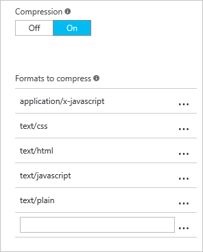

<properties
    pageTitle="Améliorer les performances en compressant les fichiers dans Azure CDN | Microsoft Azure"
    description="Découvrez comment faire pour améliorer la vitesse de transfert de fichier et améliore les performances de chargement de page en compressant vos fichiers dans Azure CDN."
    services="cdn"
    documentationCenter=""
    authors="camsoper"
    manager="erikre"
    editor=""/>

<tags
    ms.service="cdn"
    ms.workload="tbd"
    ms.tgt_pltfrm="na"
    ms.devlang="na"
    ms.topic="article"
    ms.date="07/28/2016"
    ms.author="casoper"/>

# Améliorer les performances en compressant les fichiers

La compression est une méthode simple et efficace pour améliorer la vitesse de transfert de fichier et améliorer les performances de chargement de page en réduisant la taille de fichier avant d’être envoyé à partir du serveur. Il vous permet de réduire les coûts de bande passante et offre une expérience plus réactive pour vos utilisateurs.

Il existe deux façons d’activer la compression :

- Vous pouvez activer la compression sur votre serveur d’origine, auquel cas le CDN sera passent par les fichiers compressés et les fichiers compressés à des clients qui font la demande.
- Vous pouvez activer la compression directement sur les serveurs edge CDN, auquel cas le CDN sera compresser les fichiers et répondre aux utilisateurs finaux, même si elles ne sont pas compressées par le serveur d’origine.

> [AZURE.IMPORTANT] Modifications de la configuration CDN prennent un certain temps de se propager via le réseau.  Les profils <b>Azure CDN à partir d’Akamai</b> , propagation se termine généralement en une minute sous.  Les profils <b>Azure CDN de Verizon</b> , vous généralement verront vos modifications s’appliquent au sein de 90 minutes.  Si c’est la première fois que vous avez configuré compression pour votre point de terminaison CDN, vous devez prendre en compte en attente heures 1 et 2 pour vous assurer que la compression paramètres ont été propagées aux POP avant de résolution des problèmes

## Activation de la compression

> [AZURE.NOTE] Les couches Standard et Premium CDN fournissent les mêmes fonctionnalités de compression, mais diffère de l’interface utilisateur.  Pour plus d’informations sur les différences entre les niveaux Standard et CDN Premium, voir [Vue d’ensemble de Azure CDN](cdn-overview.md).

### Couche standard

> [AZURE.NOTE] Cette section s’applique aux profils **Azure CDN Standard de Verizon** et **Azure CDN Standard à partir d’Akamai** .

1. À partir de la carte de profil CDN, cliquez sur le point de terminaison CDN que vous souhaitez gérer.

    

    La carte de point de terminaison CDN s’ouvre.

2. Cliquez sur le bouton **configurer** .

    

    La carte CDN Configuration s’ouvre.

3. Activer la **Compression**.

    

4. Utilisez les types par défaut, ou modifiez la liste en supprimant ou en ajoutant des types de fichiers.
    
    > [AZURE.TIP] Que possible, il n’est pas recommandé d’appliquer la compression compressé formats, tels que ZIP, MP3, MP4, JPG, etc..
    
5. Après avoir apporté vos modifications, cliquez sur le bouton **Enregistrer** .

### Niveau Premium

> [AZURE.NOTE] Cette section s’applique aux profils **Azure CDN Premium auprès de Verizon** .

1. À partir de la carte de profil CDN, cliquez sur le bouton **Gérer** .

    

    Le portail de gestion CDN s’ouvre.

2. Placez le curseur sur l’onglet **Grande HTTP** , puis placez le curseur sur le Lanceur de **Paramètres du Cache** .  Cliquez sur **Compression**.

    Options de compression sont affichées.

    

3. Activer la compression en cliquant sur le bouton d’option **Compression activée** .  Entrez les types MIME que vous souhaitez compresser comme une liste délimitée par des virgules (sans espace) dans la zone de texte de **Types de fichiers** .
        
    > [AZURE.TIP] Que possible, il n’est pas recommandé d’appliquer la compression à des formats compressés, tels que ZIP, MP3, MP4, JPG, etc.. 

4. Après avoir apporté vos modifications, cliquez sur le bouton de **mise à jour** .

## Règles de compression

Ces tableaux décrire le comportement de compression Azure CDN pour chaque scénario.

> [AZURE.IMPORTANT] Pour **Azure CDN de Verizon** (Standard et Premium), seuls les fichiers éligibles sont compressées.  Pour pouvoir bénéficier de compression, un fichier doit :
>
> - Dépasser 128 octets.
> - Être inférieure à 1 Mo.
> 
> Pour **Azure CDN à partir d’Akamai**, tous les fichiers sont éligibles pour la compression.
>
> Pour tous les produits Azure CDN, un fichier doit être un type MIME qui a été [configuré pour la compression](#enabling-compression).
>
> Profils **d’Azure CDN de Verizon** (Standard et Premium) prend en charge **gzip**, **compressé**ou **bzip2** codage.  Profils **Azure CDN à partir d’Akamai** prend uniquement en charge le codage de **gzip** .
>
> Points de terminaison **Azure CDN à partir d’Akamai** demander toujours fichiers **gzip** codée à l’origine, quelle que soit la demande du client.

### Compression désactivée ou le fichier est non éligibles pour la compression

|Mettre en forme (par le biais en-tête encodage-acceptation) demandée par le client|Format de fichier mis en cache|Réponse CDN au client|Notes|
|----------------|-----------|------------|-----|
|Compressé|Compressé|Compressé|   |
|Compressé|Non compressé|Non compressé|    | 
|Compressé|Non mis en cache|Compressé ou non compressé|Dépend de réponse d’origine|
|Non compressé|Compressé|Non compressé|    |
|Non compressé|Non compressé|Non compressé|    |   
|Non compressé|Non mis en cache|Non compressé|     |

### Compression activée et le fichier est éligible pour la compression

|Mettre en forme (par le biais en-tête encodage-acceptation) demandée par le client|Format de fichier mis en cache|Réponse CDN au client|Notes|
|----------------|-----------|------------|-----|
|Compressé|Compressé|Compressé|Transcode CDN entre les formats pris en charge|
|Compressé|Non compressé|Compressé|CDN effectue une compression|
|Compressé|Non mis en cache|Compressé|CDN effectue une compression si origin renvoie compressée.  **Azure CDN de Verizon** sera passez le fichier compressé à la première requête et puis compresser et mettre en cache le fichier pour les demandes suivantes.  Fichiers avec `Cache-Control: no-cache` en-tête est jamais compressée. 
|Non compressé|Compressé|Non compressé|CDN effectue décompression|
|Non compressé|Non compressé|Non compressé|     |  
|Non compressé|Non mis en cache|Non compressé|     |

## Media Services CDN Compression

Du fournisseur de Services de support activée points de terminaison de diffusion en continu, compression est activée par défaut pour les types de contenu suivants : application/vnd.ms-sstr + xml, application/dash+xml,application/vnd.apple.mpegurl, application/f4m + xml. Vous ne pouvez pas activer ou désactiver la compression pour les types de mentionné à l’aide du portail Azure.  

## Voir aussi
- [Résolution des problèmes de compression des fichiers CDN](cdn-troubleshoot-compression.md)    
