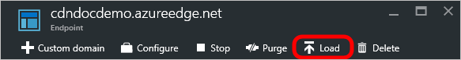

<properties
    pageTitle="Chargez au préalable les biens sur un point de terminaison Azure CDN | Microsoft Azure"
    description="Découvrez comment chargez au préalable contenu mis en cache sur un point de terminaison CDN."
    services="cdn"
    documentationCenter=""
    authors="camsoper"
    manager="erikre"
    editor=""/>

<tags
    ms.service="cdn"
    ms.workload="tbd"
    ms.tgt_pltfrm="na"
    ms.devlang="na"
    ms.topic="article"
    ms.date="07/28/2016"
    ms.author="casoper"/>

# Chargez au préalable les biens sur un point de terminaison Azure CDN

[AZURE.INCLUDE [cdn-verizon-only](../../includes/cdn-verizon-only.md)]

Par défaut, actifs sont tout d’abord mis en cache lorsqu’elles sont demandées. Cela signifie que la première requête de chaque région peut prendre plus de temps, dans la mesure où les serveurs périphériques n’ont pas le contenu mis en cache et avez besoin de transférer la demande au serveur d’origine. Chargement avant de contenu permet d’éviter cette première latence d’accès.

En plus de fournir une meilleure expérience client, préalable du chargement de vos biens mis en cache peut également réduire le trafic réseau sur le serveur d’origine.

> [AZURE.NOTE] Avant le chargement actifs est utile pour les événements de grande taille ou contenu devient disponible simultanément sur un grand nombre d’utilisateurs, par exemple une nouvelle version de film ou une mise à jour logicielle.

Ce didacticiel vous guide tout au long de chargement avant de contenu mis en cache sur tous les nœuds de bord Azure CDN.

## Procédure pas à pas

1. Dans le [Portail Azure](https://portal.azure.com), accédez au profil CDN contenant le point de terminaison que vous souhaitez chargez au préalable.  La carte de profil s’ouvre.

2. Cliquez sur le point de terminaison dans la liste.  La carte de point de terminaison s’ouvre.

3. À partir de la carte de point de terminaison CDN, cliquez sur le bouton Charger.

    

    La carte de charge s’ouvre.

    

4. Entrez le chemin complet de chaque élément que vous souhaitez charger (par exemple, `/pictures/kitten.png`) dans la zone de texte **chemin d’accès** .

    > [AZURE.TIP] Plusieurs zones de texte **chemin d’accès** s’afficheront lorsque vous entrez du texte pour vous permettre de créer une liste d’éléments multiples.  Vous pouvez supprimer des éléments dans la liste en cliquant sur le bouton points de suspension (...).
    >
    > Chemins d’accès doivent être une URL relative qui correspond à l' [expression régulière](https://msdn.microsoft.com/library/az24scfc.aspx)suivante : `^(?:\/[a-zA-Z0-9-_.\u0020]+)+$`.  Chaque ressource doit avoir son propre chemin d’accès.  Il n’existe aucune fonctionnalité génériques de chargement des ressources.

    

5. Cliquez sur le bouton **charger** .

    

> [AZURE.NOTE] Il existe une limitation de charge 10 requêtes par minute par profil CDN.

## Voir aussi
- [Effacer un point de terminaison Azure CDN](cdn-purge-endpoint.md)
- [Référence de l’API REST CDN Azure - Purge ou chargez au préalable un point de terminaison](https://msdn.microsoft.com/library/mt634451.aspx)
