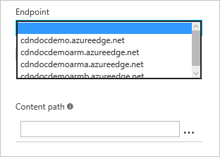

<properties
    pageTitle="Effacer un point de terminaison Azure CDN | Microsoft Azure"
    description="Découvrez comment effacer tout le contenu mis en cache à partir d’un point de terminaison CDN."
    services="cdn"
    documentationCenter=""
    authors="camsoper"
    manager="erikre"
    editor=""/>

<tags
    ms.service="cdn"
    ms.workload="tbd"
    ms.tgt_pltfrm="na"
    ms.devlang="na"
    ms.topic="article"
    ms.date="07/28/2016"
    ms.author="casoper"/>

# Effacer un point de terminaison Azure CDN

## Vue d’ensemble

Nœuds de bord Azure CDN stockera actifs jusqu'à ce que time to live (TTL) l’actif arrive à expiration.  Durée de vie du bien l’expiration, lorsqu’un client demande l’actif depuis le nœud de bord, le nœud de bord récupère une nouvelle copie mise à jour de la ressource pour répondre à la demande de client et store actualiser le cache.

Parfois, vous souhaiterez vider contenu mis en cache de tous les nœuds de bord et forcer tous les pour récupérer de nouvelles ressources mis à jour.  Cela peut être dû à des mises à jour pour votre application web, ou pour mettre à jour rapidement les éléments qui contiennent des informations incorrectes.

> [AZURE.TIP] Notez que purge efface uniquement le contenu mis en cache sur les serveurs de bord CDN.  N’importe quel cache en aval, tels que les serveurs proxy et le cache du navigateur local, il est possible que conserve une copie du fichier mis en cache.  Il est important de ne pas oublier cet élément lorsque vous définissez un fichier time to live.  Vous pouvez forcer un client en aval pour demander la dernière version de votre fichier, donnez-lui un nom unique chaque fois que vous mettez à jour ou en tirant parti de [la mise en cache de chaîne de requête](cdn-query-string.md).  

Ce didacticiel vous guide lors de la purge des éléments à partir de tous les nœuds de bord d’un point de terminaison.

## Procédure pas à pas

1. Dans le [Portail Azure](https://portal.azure.com), accédez au profil CDN contenant le point de terminaison que vous souhaitez nettoyer.

2. À partir de la carte de profil CDN, cliquez sur le bouton vider.

    

    La carte Purge s’ouvre.

    

3. Dans la carte Purge, sélectionnez l’adresse du service que vous souhaitez nettoyer dans le menu déroulant URL.

    

    > [AZURE.NOTE] Vous pouvez également accéder à la carte de Purge en cliquant sur le bouton **Vider** la carte de point de terminaison CDN.  Dans ce cas, le champ **URL** sera préremplie avec l’adresse du service de ce point de terminaison spécifique.

4. Sélectionnez actifs dont vous souhaitez nettoyer des nœuds de bord.  Si vous souhaitez effacer toutes les ressources, cliquez sur la case à cocher **Effacer tout** .  Dans le cas contraire, tapez le chemin complet de chaque élément que vous souhaitez nettoyer (par exemple, `/pictures/kitten.png`) dans la zone de texte **chemin d’accès** .

    > [AZURE.TIP] Plusieurs zones de texte **chemin d’accès** s’afficheront lorsque vous entrez du texte pour vous permettre de créer une liste d’éléments multiples.  Vous pouvez supprimer des éléments dans la liste en cliquant sur le bouton points de suspension (...).
    >
    > Chemins d’accès doivent être une URL relative qui correspondent à l' [expression régulière](https://msdn.microsoft.com/library/az24scfc.aspx)suivante : `^\/(?:[a-zA-Z0-9-_.\u0020]+\/)*\*$";`.  Pour **Azure CDN de Verizon** (Standard et Premium), astérisque (\*) peut être utilisé comme un caractère générique (par exemple, `/music/*`).  Caractères génériques et **Purge toutes** ne sont pas autorisées avec **Azure CDN à partir d’Akamai**.
    
5. Cliquez sur le bouton **Vider** .

    

> [AZURE.IMPORTANT] Demandes de purge prennent environ 2-3 minutes pour traiter avec **Azure CDN de Verizon** (Standard et Premium) et 7 minutes environ avec **Azure CDN à partir d’Akamai**.  Azure CDN est limité à 50 simultanées purge demandes à un moment donné. 

## Voir aussi
- [Chargez au préalable les biens sur un point de terminaison Azure CDN](cdn-preload-endpoint.md)
- [Référence de l’API REST CDN Azure - Purge ou chargez au préalable un point de terminaison](https://msdn.microsoft.com/library/mt634451.aspx)
