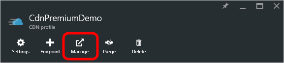

<properties
    pageTitle="Alertes en temps réel Azure CDN | Microsoft Azure"
    description="Alertes en temps réel dans Microsoft Azure CDN. Alertes en temps réel fournissent des notifications concernant les performances des points de terminaison dans votre profil CDN."
    services="cdn"
    documentationCenter=""
    authors="camsoper"
    manager="erikre"
    editor=""/>

<tags
    ms.service="cdn"
    ms.workload="tbd"
    ms.tgt_pltfrm="na"
    ms.devlang="na"
    ms.topic="article"
    ms.date="07/12/2016"
    ms.author="casoper"/>

# <a name="real-time-alerts-in-microsoft-azure-cdn"></a>Alertes en temps réel dans Microsoft Azure CDN

[AZURE.INCLUDE [cdn-premium-feature](../../includes/cdn-premium-feature.md)]


## <a name="overview"></a>Vue d’ensemble

Ce document explique les alertes en temps réel dans Microsoft Azure CDN. Cette fonctionnalité envoie des notifications en temps réel sur les performances des points de terminaison dans votre profil CDN.  Vous pouvez définir la messagerie électronique ou alertes HTTP basées sur :

* Bande passante
* Codes d’état
* Statuts de cache
* Connexions

## <a name="creating-a-real-time-alert"></a>Création d’une alerte en temps réel

1. Dans le [Portail Azure](https://portal.azure.com), accédez à votre profil CDN.

    

2. À partir de la carte de profil CDN, cliquez sur le bouton **Gérer** .

    

    Le portail de gestion CDN s’ouvre.

3. Placez le curseur sur l’onglet **Analytique** , puis placez le curseur sur le Lanceur de **Statistiques en temps réel** .  Cliquez sur **les alertes en temps réel**.

    

    La liste des configurations d’alerte existantes (le cas échéant) s’affiche.

4. Cliquez sur le bouton **Ajouter une alerte** .

    

    Un formulaire permettant de créer une nouvelle alerte s’affiche.

    

5. Si vous souhaitez que cette alerte pour être actif lorsque vous cliquez sur **Enregistrer**, cochez la case **Alerte activée** .

6. Dans le champ **nom** , entrez un nom descriptif pour votre alerte.

7. Dans la liste déroulante **Type de média** , sélectionnez **Objet volumineux HTTP**.

    

    > [AZURE.IMPORTANT] Vous devez sélectionner des **Objets volumineux HTTP** en tant que le **Type de média**.  Les autres choix ne sont pas utilisés par **Azure CDN de Verizon**.  Sélectionner des **Objets volumineux HTTP** provoquera votre alerte jamais déclenché.

8. Créer une **Expression** à surveiller en sélectionnant une **métrique**, **opérateur**et **valeur du déclencheur**.

    - Pour **métrique**, sélectionnez le type de condition à surveiller.  **La bande passante Mbps** est la quantité de bande passante en mégabits par seconde.  **Nombre total de connexions** est le nombre de connexions HTTP simultanées à notre serveurs edge.  Pour les définitions des différents statuts de cache et codes d’état, voir [Codes de statut Azure CDN Cache](https://msdn.microsoft.com/library/mt759237.aspx) et [Codes d’état HTTP Azure CDN](https://msdn.microsoft.com/library/mt759238.aspx)
    - **Opérateur** est l’opérateur mathématique qui établit la relation entre la mesure et la valeur du déclencheur.
    - **Valeur de déclenchement** est la valeur seuil qui doit être remplie avant une notification est envoyée.

    Dans l’exemple ci-dessous, l’expression que j’ai créé indique que je souhaite recevoir une notification lorsque le nombre de codes d’état 404 est supérieur à 25.

    

9. Pour l' **intervalle**, entrez la fréquence à laquelle vous voulez que l’expression évaluée.

10. Dans la liste déroulante **Avertir sur** , sélectionnez lorsque vous souhaitez recevoir une notification lorsque l’expression est vraie.
    
    - **Condition démarrer** indique qu’une notification est envoyée lorsque la condition spécifiée est détectée en premier.
    - **Condition de fin** indique qu’une notification est envoyée lorsque la condition spécifiée n’est plus détectée. Cette notification ne peut être déclenchée après que notre réseau surveillance système détecté que la condition spécifiée s’est produite.
    - **Continu** indique qu’une notification est envoyée chaque fois que le système de surveillance réseau détecte la condition spécifiée. N’oubliez pas que le système de surveillance réseau vérifie uniquement une fois par intervalle pour la condition spécifiée.
    - **Condition Start et End** indique qu’une notification est envoyée la première fois que la condition spécifiée est détectée et une nouvelle fois lorsque la condition n’est plus détectée.

11. Si vous souhaitez recevoir des notifications par courrier électronique, activez la case à cocher **avertir par courrier électronique** .  

    
    
    Dans le champ **à** , entrez l’adresse de messagerie que vous l’endroit où vous voulez que les notifications envoyées. Pour **l’objet** et le **corps**, vous pouvez être amené à la valeur par défaut, ou vous pouvez personnaliser le message à l’aide de la liste de **mots clés disponibles** pour insérer dynamiquement les données d’alerte lorsque le message est envoyé.

    > [AZURE.NOTE] Vous pouvez tester la notification par courrier électronique en cliquant sur le bouton **Tester la Notification** , mais uniquement si la configuration d’alerte a été enregistrée.

12. Si vous souhaitez que les notifications à être publié sur un serveur web, cochez la case à cocher **avertir par HTTP Post** .

    

    Dans le champ **Url** , entrez l’URL que vous l’endroit où vous voulez que le message HTTP publié. Dans la zone de texte **en-têtes** , entrez les en-têtes HTTP à envoyer dans la demande.  Pour le **corps** , vous pouvez personnaliser le message à l’aide de la liste de **mots clés disponibles** pour insérer dynamiquement les données d’alerte lorsque le message est envoyé.  **En-têtes** et le **corps** par défaut pour une charge XML semblable à l’exemple ci-dessous.

    ```
    <string xmlns="http://schemas.microsoft.com/2003/10/Serialization/">
        <![CDATA[Expression=Status Code : 404 per second > 25&Metric=Status Code : 404 per second&CurrentValue=[CurrentValue]&NotificationCondition=Condition Start]]>
    </string>
    ```

    > [AZURE.NOTE] Vous pouvez tester la notification HTTP Post en cliquant sur le bouton **Tester la Notification** , mais uniquement si la configuration d’alerte a été enregistrée.

13. Cliquez sur le bouton **Enregistrer** pour enregistrer votre configuration d’alerte.  Si vous avez coché **Alerte activée** à l’étape 5, l’alerte est maintenant actif.

## <a name="next-steps"></a>Étapes suivantes

- Analyser [les statistiques en temps réel dans Azure CDN](cdn-real-time-stats.md)
- Aller plus loin avec [des rapports HTTP avancés](cdn-advanced-http-reports.md)
- Analyser les [modèles d’utilisation](cdn-analyze-usage-patterns.md)

